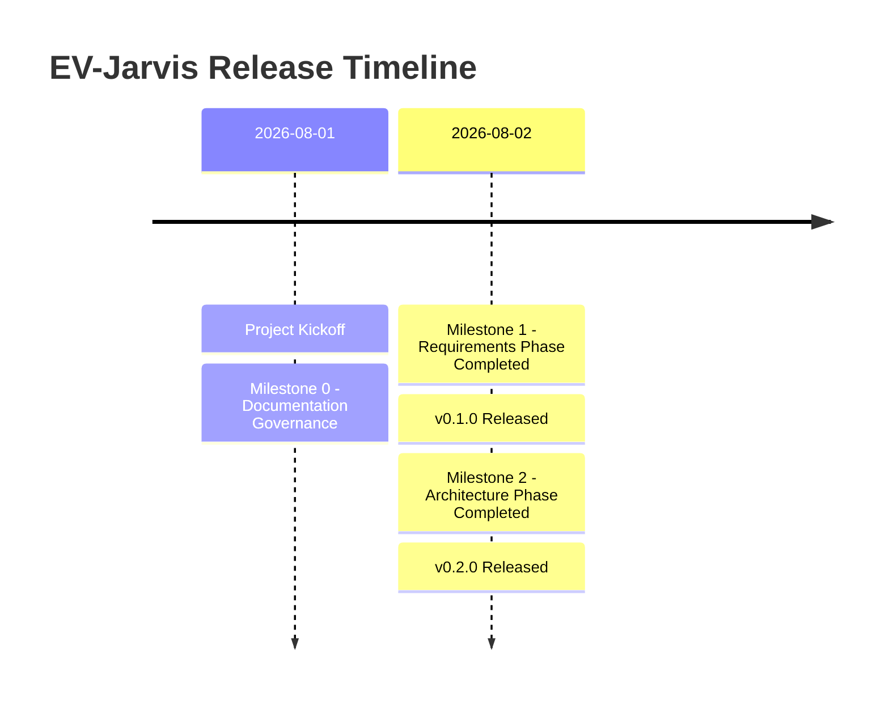

# Changelog

เอกสารนี้บันทึกการเปลี่ยนแปลงทั้งหมดในโปรเจกต์ EV-Jarvis รูปแบบเอกสารอ้างอิงตาม [Keep a Changelog 1.1.0](https://keepachangelog.com/en/1.1.0/) และการกำหนดเวอร์ชันอ้างอิงตาม [Semantic Versioning](https://semver.org/spec/v2.0.0.html).

**Cross-reference:** 
- [MASTER_CONTEXT](MASTER_CONTEXT.md) 
- [PROJECT_PROGRESS](PROJECT_PROGRESS.md) 
- [PRD](../02_Requirements/03_PRD.md) 
- [SRS](../02_Requirements/04_SRS.md) 
- [REQUIREMENTS](../02_Requirements/05_REQUIREMENTS.md)

---

## [v0.2.0] - 2026-08-02

### Added
- เพิ่มเอกสารสถาปัตยกรรมระบบ: `01_SYSTEM_ARCHITECTURE.md`, `02_C4_MODEL.md`, `03_TECH_STACK.md`, `04_DEPLOYMENT.md`, `05_SECURITY_ARCHITECTURE.md`, `06_AI_ARCHITECTURE.md`
- เพิ่มเอกสารสถาปัตยกรรมฐานข้อมูล: `01_DATABASE_DESIGN.md`, `02_ERD.md`, `03_DATA_DICTIONARY.md`, `04_MIGRATION.md`
- เพิ่มเอกสารสถาปัตยกรรม API: `01_API_SPECIFICATION.md`, `02_AUTHENTICATION.md`, `03_OPENAPI.md`, `04_WEBHOOKS.md`
- บังคับใช้และเพิ่ม **Sprint Verification Policy** ลงใน `01_PROJECT_RULES.md` และ `AI_AGENT_RULES.md`

### Architecture
- Completed System, Database, and API Architecture specifications.

---

## [v0.1.0] - 2026-08-02

### Added
- เพิ่มเอกสาร `PROJECT_RULES.md` เพื่อกำหนดมาตรฐานและนโยบายโครงสร้างโปรเจกต์
- เพิ่มเอกสาร `AI_AGENT_RULES.md` เพื่อเป็นคู่มือและกฎเกณฑ์สำหรับ AI
- เพิ่มเอกสาร `MASTER_CONTEXT.md` สำหรับรักษาบริบทส่วนกลางเพื่อประหยัด Token ในอนาคต
- เพิ่มเอกสาร `PRODUCT_VISION.md` กำหนดทิศทางและกลุ่มเป้าหมายของระบบ
- เพิ่มเอกสาร `PRD.md` สำหรับกำหนดขอบเขต Epic และ Feature ของ MVP
- เพิ่มเอกสาร `SRS.md` สำหรับข้อกำหนดทางวิศวกรรมซอฟต์แวร์และเทคนิค
- เพิ่มเอกสาร `REQUIREMENTS.md` รวบรวมข้อกำหนดระดับ Production-grade ทุกประเภท

### Documentation
- โครงสร้างเอกสารของโปรเจกต์ (Documentation Governance) ได้รับการตั้งค่าอย่างสมบูรณ์
- สร้าง Requirement Traceability Matrix แบบ End-to-End เสร็จสิ้น

### Architecture
- Not Started (กำหนดใน Requirements เบื้องต้น แต่รอเอกสารจริงใน Milestone 2)

### Database
- Not Started

### API
- Not Started

### Backend
- Not Started

### Frontend
- Not Started

### AI Module
- Not Started

### Testing
- Not Started

### Deployment
- Not Started

### Security
- กำหนด Requirements เชิงนโยบาย (เช่น JWT, AES-256) ใน `REQUIREMENTS.md`

### Changed
- None

### Removed
- None

### Deprecated
- None

### Fixed
- None

---

## Version Matrix

| Project Version | Release Date | Description | Status |
|---|---|---|---|
| v0.2.0 | 2026-08-02 | Architecture, Database, & API Design Phase | Released |
| v0.1.0 | 2026-08-02 | Requirements Phase & Documentation Governance | Released |

## Milestone History

| Milestone | Project Version | Status | Key Deliverables |
|---|---|---|---|
| Milestone 0 | v0.1.0-alpha | Completed | PROJECT_RULES, AI_AGENT_RULES, MASTER_CONTEXT |
| Milestone 1 | v0.1.0 | Completed | PRODUCT_VISION, PRD, SRS, REQUIREMENTS |
| Milestone 2 | v0.2.0 | Completed | Architecture, Database, API Docs |

## Document History

| Document | Action | Version Introduced |
|---|---|---|
| `PROJECT_RULES.md` | Added | v0.1.0-alpha |
| `AI_AGENT_RULES.md` | Added | v0.1.0-alpha |
| `MASTER_CONTEXT.md` | Added | v0.1.0-alpha |
| `PRODUCT_VISION.md` | Added | v0.1.0 |
| `PRD.md` | Added | v0.1.0 |
| `SRS.md` | Added | v0.1.0 |
| `REQUIREMENTS.md` | Added | v0.1.0 |
| `PROJECT_PROGRESS.md` | Added | v0.1.0 |
| `CHANGELOG.md` | Added | v0.1.0 |
| `01_SYSTEM_ARCHITECTURE.md` | Added | v0.2.0 |
| `02_C4_MODEL.md` | Added | v0.2.0 |
| `03_TECH_STACK.md` | Added | v0.2.0 |
| `04_DEPLOYMENT.md` | Added | v0.2.0 |
| `05_SECURITY_ARCHITECTURE.md` | Added | v0.2.0 |
| `06_AI_ARCHITECTURE.md` | Added | v0.2.0 |
| `01_DATABASE_DESIGN.md` | Added | v0.2.0 |
| `02_ERD.md` | Added | v0.2.0 |
| `03_DATA_DICTIONARY.md` | Added | v0.2.0 |
| `04_MIGRATION.md` | Added | v0.2.0 |
| `01_API_SPECIFICATION.md` | Added | v0.2.0 |
| `02_AUTHENTICATION.md` | Added | v0.2.0 |
| `03_OPENAPI.md` | Added | v0.2.0 |
| `04_WEBHOOKS.md` | Added | v0.2.0 |

## Release Timeline

