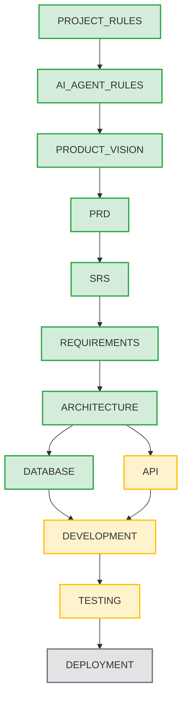

# Document Information

เอกสารนี้คือแหล่งรวบรวมบริบทของโปรเจกต์ (Single Source of Truth) เพื่อลดการใช้ Resource (Token) ในการสแกน Repository ซ้ำซ้อน สำหรับ AI Agent ที่จะเข้ามาทำงานในอนาคต โดยจะเป็นจุดเริ่มต้นก่อนเปิดอ่านเอกสารขนาดใหญ่ การสรุปข้อมูลในเอกสารนี้มีความครอบคลุมเพื่อให้ AI Agent สามารถเข้าใจภาพรวมและดำเนินการต่อได้ทันทีโดยไม่ต้องเปิดอ่าน PRD หรือ SRS แบบเต็ม

# Purpose

- เป็นจุดรวมศูนย์บริบท (Context) ของโปรเจกต์ EV-Jarvis อย่างครบถ้วน
- สรุปภาพรวม (Summary) ของโครงสร้างเอกสาร สถิติ โครงสร้างโปรเจกต์ และสถานะปัจจุบัน
- ลดการอ่านเอกสารยาวอย่าง PRD หรือ SRS แบบเต็ม (Full scan) โดยไม่จำเป็น เพื่อประหยัด Token และเวลา
- กำหนดกฎเกณฑ์การทำงานของ AI (AI Execution Policy) สำหรับเซสชันถัดไปอย่างเคร่งครัด
- นำเสนอ Dependency Chain เพื่อให้เข้าใจความเชื่อมโยงของการออกแบบระบบ

# Project Summary

- **Project Name:** EV-Jarvis
- **Repository:** DoubleFo20/EV-Jarvis
- **Version:** 1.0.0
- **Status:** In Development
- **Current Phase:** Phase 2 — Sprint Implementation; Sprint 1 closure remains pending
- **Current Frontend Decision:** Next.js 16 App Router with SSR, approved by the Project Owner on 2026-08-07; this decision does not authorize an architecture change
- **Objective:** สร้างระบบผู้ช่วย AI ส่วนตัวระดับแนวหน้าสำหรับเจ้าของรถ EV ที่ผสานรวมข้อมูล Telemetry, สถานะแบตเตอรี่, ประวัติการชาร์จ, การบำรุงรักษา และการนำทาง เข้าไว้ในแพลตฟอร์มเดียว เพื่อเพิ่มความสะดวกสบาย ลดความกังวลเรื่องระยะทาง (Range Anxiety) และบริหารจัดการต้นทุนการใช้รถ EV ได้อย่างมีประสิทธิภาพสูงสุด

# Documentation Status

ตารางแสดงสถานะของเอกสารทั้งหมดในโครงการ:

| Document | File Path | Status | Description |
|---|---|---|---|
| **PROJECT_RULES** | `docs/01_Project_Management/01_PROJECT_RULES.md` | Complete | กฎ โครงสร้างพื้นฐาน และมาตรฐานของ Repository |
| **AI_AGENT_RULES** | `docs/01_Project_Management/AI_AGENT_RULES.md` | Complete | แนวทางการทำงาน บทบาท หน้าที่ และข้อจำกัดของ AI Agent |
| **MASTER_CONTEXT** | `docs/01_Project_Management/MASTER_CONTEXT.md` | Complete | เอกสารรวมบริบทโปรเจกต์ฉบับนี้ |
| **PRODUCT_VISION** | `docs/02_Requirements/02_PRODUCT_VISION.md` | Complete | วิสัยทัศน์ กลุ่มเป้าหมาย Value Proposition และเป้าหมายทางธุรกิจ |
| **PRD** | `docs/02_Requirements/03_PRD.md` | Complete | Product Requirements Document กำหนดขอบเขตฟีเจอร์สำหรับ MVP |
| **SRS** | `docs/02_Requirements/04_SRS.md` | Complete | Software Requirements Specification กำหนดรายละเอียดเชิงเทคนิคและมาตรฐาน |
| **REQUIREMENTS** | `docs/02_Requirements/05_REQUIREMENTS.md` | Complete | รายละเอียด Requirement ระดับ Production-grade |
| **Architecture** | `docs/03_Architecture/*` | Baseline Complete | Architecture documents exist; see `PROJECT_PROGRESS.md` for current status |
| **Database** | `docs/07_Database/*` | Sprint 1 Auth scope verified | Domain schema work remains outside Sprint 1 |
| **API** | `docs/08_API/*` | Review | Auth specification exists; OpenAPI machine validation has not been run |
| **Development** | `docs/04_Development/*` | Baseline Partial | `BACKEND_STRUCTURE.md` is intentionally empty and requires Owner approval before editing |
| **Testing** | `docs/05_Testing/*` | Baseline Documented | Sprint 1 closure remains pending verification gaps |
| **Deployment** | `docs/06_Deployment/*` | Baseline Documented | No Production deployment is recorded |

# Current Statistics

ภาพรวมเชิงปริมาณของขอบเขตโปรเจกต์ EV-Jarvis:

- **Epic Count:** 12 Epics
- **Feature Count:** 37 Features
- **User Story Count:** 37 User Stories
- **Requirement Count:** 500+ Requirements (ครอบคลุม FR, NFR, UI, API, DB, SEC, PERF, LOG, VAL, ERR, STATE, TEST)
- **Current Version:** 1.0.0 (MVP Scope)

**Major Modules & Epics Overview:**
1. **EPIC-001 (Authentication & User Profile):** ระบบล็อกอิน, จัดการโปรไฟล์, Preferences
2. **EPIC-002 (Vehicle Discovery & Onboarding):** ค้นหารถ EV, เชื่อมต่อ API ผู้ผลิต, เพิ่มรถในระบบ
3. **EPIC-003 (Vehicle Profile & Telemetry):** ข้อมูลรถ, สถานะล่าสุด, ข้อมูลเอกสารและประกันภัย
4. **EPIC-004 (Battery & Charging Status):** สถานะแบตเตอรี่ (SOC/SOH), การชาร์จปัจจุบัน, ประวัติการชาร์จ
5. **EPIC-005 (Maintenance & Health):** การแจ้งเตือนเช็คระยะ, บันทึกการบำรุงรักษา, คำนวณความเสื่อมแบตเตอรี่
6. **EPIC-006 (Trip & Routing):** บันทึกการเดินทาง, นำทางพร้อมสถานีชาร์จ, คาดการณ์แบตเตอรี่
7. **EPIC-007 (Charging Cost & Analytics):** วิเคราะห์ค่าใช้จ่าย, สรุปรายเดือน, ตั้งค่าเรทค่าไฟ (TOU)
8. **EPIC-008 (Location & Point of Interest):** ค้นหาสถานีชาร์จ, เพิ่มสถานีส่วนตัว, บันทึกสถานที่โปรด
9. **EPIC-009 (Integration & Data Provider):** จัดการ Token จากค่ายรถ, ซิงค์ข้อมูล, เชื่อมต่อผู้ให้บริการชาร์จ
10. **EPIC-010 (Notification & Alert):** การตั้งค่าการแจ้งเตือน, Push Notification, Email Alert
11. **EPIC-011 (Admin & Support):** แดชบอร์ดสำหรับผู้ดูแลระบบ, จัดการผู้ใช้, รายงานภาพรวม
12. **EPIC-012 (Data Sync & Background Jobs):** ระบบ Queue จัดการ Sync ข้อมูลเบื้องหลัง

# Project Structure

โครงสร้างโฟลเดอร์หลักของโปรเจกต์ EV-Jarvis ที่ AI ต้องรับทราบ:

```text
EV-Jarvis/
├── docs/
│   ├── 01_Project_Management/  (กฎการทำงาน, กฎของ AI, Master Context)
│   ├── 02_Requirements/        (Product Vision, PRD, SRS, Requirements)
│   ├── 03_Architecture/        (System Design, Database, API Design)
│   ├── 04_Development/         (Code Guidelines, Environment Setup)
│   ├── 05_Testing/             (Test Strategy, QA Plans)
│   ├── 06_Deployment/          (Infrastructure as Code, CI/CD)
│   └── assets/                 (ภาพประกอบ, โลโก้, ไดอะแกรม)
├── backend/                    (TypeScript API and authentication implementation)
├── frontend/                   (Next.js 16 App Router SSR implementation)
├── docs/                       (Project, architecture, implementation, and test documents)
├── packages/                   (Shared packages)
├── scripts/                    (Repository scripts)
└── README.md                   (Project Landing Page)
```

# Technology Stack

สถานะ implementation ที่ยืนยันได้ใน repository ปัจจุบัน: Frontend ใช้ Next.js 16 App Router แบบ SSR ตาม Owner decision; Backend มี TypeScript API และ Prisma สำหรับ persistence การระบุนี้เป็นการบันทึกสภาพจริง ไม่ใช่การอนุมัติเปลี่ยน Requirement หรือ Architecture เพิ่มเติม

ชุดเทคโนโลยีที่กำหนดไว้และสถานะ implementation ปัจจุบันของ EV-Jarvis:

- **Frontend:** 
  - Mobile App: React Native หรือ Flutter รองรับ iOS/Android
  - Web Frontend: Next.js 16 App Router แบบ SSR ตาม Owner decision 2026-08-07
- **Backend:** 
  - Core Services: Node.js (TypeScript) แบบ Modular Monolith ตาม implementation ปัจจุบัน
  - Framework: Express ตาม implementation ปัจจุบัน
- **Database:** 
  - Primary: PostgreSQL สำหรับเก็บข้อมูล Core Transaction และ User Data
  - Cache/Queue: Redis สำหรับ Session, Caching, และ Background Job Queue
- **AI & ML:** 
  - LLM API: OpenAI GPT-4 หรือ Google Gemini สำหรับประมวลผลคำสั่ง EV-Jarvis
- **Infrastructure:** 
  - Cloud Provider: AWS หรือ Google Cloud Platform (GCP)
  - Compute: Managed Container Service (เช่น AWS Fargate, GCP Cloud Run)
- **Deployment:** 
  - Containerization: Docker
  - CI/CD: GitHub Actions สำหรับ Automated Testing, Linting และ Deployment

# Current Development Status

สถานะปัจจุบัน ณ 2026-09-28 อ้างอิง `PROJECT_PROGRESS.md`, Sprint 1 plan และหลักฐานใน local repository/GitHub:

- **Completed implementation:** Sprint 1 Milestone 2 authentication backend และ Milestone 3 Next.js SSR authentication flow มีหลักฐานการตรวจใน `PROJECT_PROGRESS.md`; database/Auth verification ที่บันทึกไว้จำกัดอยู่ที่ EV-JARVIS-DEV
- **Current status:** Sprint 1 Closure Pending — local/disposable evidence และ GitHub CI evidence ผ่านตามที่บันทึกไว้; clean working tree/per-path disposition ยังเปิดอยู่
- **Current handoff task:** `S1-CLOSE-11` remediation — ใช้ one-writer-per-file/path และอนุญาต disjoint subagent ownership เฉพาะ path ที่ไม่ทับซ้อน; shared files ต้อง serialize และ conflict ต้องหยุดรายงาน
- **Repository state:** local `main` และ `origin/main` ตรงกันที่ `9fbc108`; GitHub Actions run `36379393726` จบ `success`. Phase A restore และ Phase B exact `.gitignore` rules สำเร็จ; เอกสาร Phase C ยังเป็น working-tree changes ตาม HANDOFF
- **Not authorized by this status:** ห้ามตีความว่า Sprint 1 ปิดแล้วหรือเริ่ม Sprint 2 ได้

# Dependency Chain

ลำดับความสำคัญและเส้นทางการอ้างอิงเอกสารทั้งหมดในโปรเจกต์ (Document Dependency Flow):


```mermaid
flowchart TD
    %% Phase 1: Project Setup
    PR[PROJECT_RULES] --> AIR[AI_AGENT_RULES]
    
    %% Phase 2: Requirements
    AIR --> PV[PRODUCT_VISION]
    PV --> PRD[PRD]
    PRD --> SRS[SRS]
    SRS --> REQ[REQUIREMENTS]
    
    %% Phase 3: Architecture
    REQ --> ARCH[ARCHITECTURE]
    ARCH --> DB[DATABASE]
    ARCH --> API[API]
    
    %% Phase 4: Implementation
    DB --> DEV[DEVELOPMENT]
    API --> DEV[DEVELOPMENT]
    DEV --> TEST[TESTING]
    TEST --> DEPLOY[DEPLOYMENT]
    
    classDef complete fill:#d4edda,stroke:#28a745,stroke-width:2px;
    classDef inprogress fill:#fff3cd,stroke:#ffc107,stroke-width:2px;
    classDef pending fill:#e2e3e5,stroke:#6c757d,stroke-width:2px;
    
    class PR,AIR,PV,PRD,SRS,REQ,ARCH,DB complete;
    class API,DEV,TEST inprogress;
    class DEPLOY pending;
```

# Current Working Rules

สรุปกฎสำคัญของ Repository ที่ AI และ Developer ต้องปฏิบัติตามอย่างเคร่งครัด (อ้างอิงจาก AI_AGENT_RULES):

1. **Language Policy:** อธิบายเนื้อหาบรรยายด้วยภาษาไทย (Thai) เสมอ และใช้คำศัพท์เทคนิค (Technical terms) เป็นภาษาอังกฤษ (English) ห้ามแปลทับศัพท์ให้เสียความหมาย
2. **No Placeholders:** ห้ามใช้คำว่า TODO, TBD, Placeholder หรือเว้นว่างข้อมูลไว้ ต้องใช้ข้อมูลอ้างอิง ข้อมูลจำลองที่สมจริง หรือทำการตัดสินใจสถาปัตยกรรม (Architectural Decision) ทันที
3. **Format & Metadata:** งานเอกสารต้องใช้ Markdown (.md) เท่านั้น และต้องมี YAML Frontmatter หรือ Metadata header (เช่น version, status, date) ที่ส่วนบนสุดของไฟล์เสมอ
4. **Tool Constraints:** AI ห้ามสร้าง Script, Generator, PowerShell, Python หรือไฟล์ชั่วคราวเพื่อดำเนินการทำงาน ต้องใช้ความสามารถในการประมวลผลข้อความและส่งผลลัพธ์เป็น Markdown เท่านั้น
5. **Quality Standard:** โค้ดและเอกสารต้องเป็น Production-grade เสมอ ครอบคลุมมุมมองทั้ง Functional, Security, Performance, และ Error Handling
6. **Disjoint Agent Ownership:** Agent หนึ่งตัวเขียนได้เฉพาะ file/path ที่ได้รับมอบหมาย; subagents ทำงานพร้อมกันได้เมื่อ ownership ไม่ทับซ้อนกัน ส่วน shared files ต้องมีผู้เขียนหนึ่งตัวและ serialize

# AI Execution Policy

Future AI agents MUST ปฏิบัติตามนโยบายดังต่อไปนี้เพื่อประสิทธิภาพสูงสุด:

- **Read MASTER_CONTEXT first:** ต้องอ่านเอกสารนี้เป็นอันดับแรกก่อนเริ่มงานทุกครั้ง เพื่อรับบริบทล่าสุดของโปรเจกต์
- **Do NOT scan the repository again unless required:** ห้ามรันคำสั่งเพื่อสแกนหรือ List ไฟล์ใน Repository ซ้ำซ้อนโดยไม่จำเป็น เพื่อประหยัด Token
- **Do NOT read PRD again unless necessary:** ห้ามเปิดอ่าน 03_PRD.md เต็มรูปแบบ เว้นแต่ต้องการสืบค้น User Story เชิงลึก
- **Do NOT read SRS again unless necessary:** ห้ามเปิดอ่าน 04_SRS.md เต็มรูปแบบ เว้นแต่ต้องการตรวจสอบ Requirement ID เชิงลึกแบบเฉพาะเจาะจง
- **Only inspect documents directly related to the requested task:** เปิดดูเฉพาะเอกสารที่เกี่ยวข้องกับงาน (Task) ที่ได้รับมอบหมายเท่านั้น
- **Update only the requested target file:** แก้ไขเฉพาะไฟล์เป้าหมายที่ระบุในคำสั่งของผู้ใช้ (User Request)
- **Never create helper scripts:** ห้ามสร้าง Script ช่วยเหลือในการประมวลผลข้อความหรือจัดการไฟล์
- **Never create generators:** ห้ามสร้าง Code Generator
- **Never create PowerShell:** ห้ามเขียนหรือรัน PowerShell scripts เพื่อแทรกแซงกระบวนการ
- **Never create Python:** ห้ามเขียนหรือรัน Python scripts เพื่อแทรกแซงกระบวนการ
- **Never create temporary files:** ห้ามสร้างไฟล์ชั่วคราวใดๆ
- **Markdown is the final deliverable:** ผลลัพธ์สุดท้ายต้องส่งมอบอยู่ในรูปแบบไฟล์ Markdown เท่านั้น

# Reference Documents

รายชื่อเอกสารที่จัดทำเสร็จสิ้นและได้รับการอนุมัติ ใช้เป็นแหล่งอ้างอิงและอิงตาม:

- `docs/01_Project_Management/01_PROJECT_RULES.md` - มาตรฐานและโครงสร้างโปรเจกต์
- `docs/01_Project_Management/AI_AGENT_RULES.md` - กฎข้อบังคับสำหรับ AI
- `docs/02_Requirements/02_PRODUCT_VISION.md` - วิสัยทัศน์ของผลิตภัณฑ์
- `docs/02_Requirements/03_PRD.md` - ขอบเขต MVP ของผลิตภัณฑ์
- `docs/02_Requirements/04_SRS.md` - ข้อกำหนดซอฟต์แวร์ทางเทคนิค

# Current Roadmap

- **Current Milestone:** Sprint 1 Closure Pending — GitHub CI verified; clean-tree/per-path disposition remains open
  - ปิด clean-tree gap ตาม `docs/09_Implementation/04_SPRINT_1_PLAN.md` หลังได้รับ Owner disposition; ยังห้ามเริ่ม Android implementation ก่อน Sprint 1 closure
- **Next Milestone:** ยังไม่เริ่ม; ต้องผ่าน Sprint 1 Definition of Done และได้รับ scope/Owner approval ตามกฎโครงการก่อน
- **Long-term Milestone (Phase 3+):** Advanced Features & AI Integration
  - พัฒนาฟีเจอร์ Trip & Routing, Charging Analytics, ระบบ Automation และผสาน AI Assistant (EV-Jarvis) อย่างเต็มรูปแบบเพื่อยกระดับ UX

# Revision History

| Version | Date | Status | Author | Change Description |
|---|---|---|---|---|
| 1.2.0 | 2026-09-28 | Review | Codex | Reconcile current HEAD/GitHub CI evidence and document one-writer-per-file/path with disjoint subagent ownership |
| 1.1.0 | 2026-09-27 | Review | Codex | ปรับสถานะปัจจุบันจาก requirements baseline ให้ตรงกับหลักฐาน Sprint 1, Owner-approved Next.js SSR, closure gaps และข้อจำกัดการรับช่วง |
| 1.0.0 | 2026-08-02 | Complete | Documentation Architect | Initial MASTER_CONTEXT creation |
