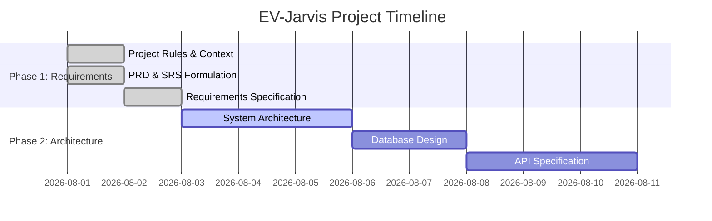
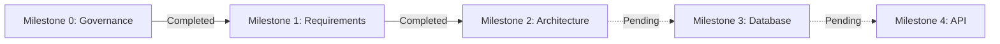

# 1. Project Information
- **Project Name:** EV-Jarvis
- **Repository:** DoubleFo20/EV-Jarvis
- **Objective:** สร้างแพลตฟอร์มผู้ช่วย AI อัจฉริยะสำหรับเจ้าของรถ EV

# 2. Current Phase
- **Phase:** Phase 1 - Requirements & Architecture Definition

# 3. Current Milestone
- **Milestone:** Milestone 1 (Complete Requirements Phase)

# 4. Overall Progress (%)
- **Progress:** 10% (Phase 1 เสร็จสมบูรณ์ เตรียมเข้าสู่ Architecture Design)

# 5. Completed Documents
| Document | Description |
|---|---|
| `PROJECT_RULES.md` | กฎและมาตรฐานของโปรเจกต์ |
| `AI_AGENT_RULES.md` | นโยบายการทำงานของ AI Agent |
| `MASTER_CONTEXT.md` | บริบทส่วนกลางสำหรับ AI |
| `PRODUCT_VISION.md` | วิสัยทัศน์ผลิตภัณฑ์ |
| `PRD.md` | ข้อกำหนดทางธุรกิจ |
| `SRS.md` | ข้อกำหนดทางซอฟต์แวร์ |
| `REQUIREMENTS.md` | ข้อกำหนดระดับ Production-grade |
| `01_SYSTEM_ARCHITECTURE.md` | เอกสารสถาปัตยกรรมระบบ (System Architecture) |
| `02_C4_MODEL.md` | เอกสาร C4 Architecture Model (C4 Model) |
| `03_TECH_STACK.md` | เอกสารชุดเทคโนโลยี (Technology Stack) |
| `04_DEPLOYMENT.md` | เอกสารสถาปัตยกรรมการนำระบบขึ้นทำงาน (Deployment Architecture) |
| `05_SECURITY_ARCHITECTURE.md` | เอกสารสถาปัตยกรรมความปลอดภัย (Security Architecture) |
| `06_AI_ARCHITECTURE.md` | เอกสารสถาปัตยกรรมปัญญาประดิษฐ์ (AI Architecture) |
| `01_DATABASE_DESIGN.md` | เอกสารการออกแบบฐานข้อมูล (Database Architecture) |
| `02_ERD.md` | แผนภาพความสัมพันธ์ของเอนทิตี (Entity Relationship Diagram) |

# 6. Documents In Progress
| Document | Description |
|---|---|
| `PROJECT_PROGRESS.md` | รายงานความคืบหน้าของโปรเจกต์ |
| `CHANGELOG.md` | บันทึกการเปลี่ยนแปลง |

# 7. Pending Documents
| Document | Description |
|---|---|
| `API.md` | เอกสารการออกแบบ API Contract |

# 8. Current Active Task
- จัดทำเอกสารติดตามผล (Project Documentation & Tracking)

# 9. Next Recommended Task
- เตรียมเริ่มต้น Milestone 2: Architecture Design

# 10. Current Branch
- `main`

# 11. Latest Commit
- `eddf7e2`

# 12. Repository Status
- **Status:** Initialized and Documented (ผ่านกระบวนการตั้งค่าโปรเจกต์เรียบร้อย พร้อมสำหรับการวิเคราะห์ออกแบบ)

# 13. Architecture Status
- Complete

# 14. Database Status
- Not Started

# 15. API Status
- Not Started

# 16. Backend Status
- Not Started

# 17. Frontend Status
- Not Started

# 18. AI Module Status
- Not Started

# 19. Testing Status
- Not Started

# 20. Deployment Status
- Not Started

# 21. Known Issues
- ไม่มี (โครงการอยู่ในระยะเริ่มต้น)

# 22. Risks
- ความเสี่ยงจากการผสานรวม API จากค่ายรถหลายยี่ห้อ (Integration Risk)

# 23. Blockers
- ไม่มี (Unblocked)

# 24. Next 10 Tasks
| Task | Description | Status |
|---|---|---|
| 1 | ออกแบบ System Architecture (High-level) | Complete |
| 2 | ออกแบบ Database Schema และ ERD | Pending |
| 3 | กำหนด API Contract ด้วย OpenAPI | Pending |
| 4 | กำหนด Use Cases และ User Flow | Pending |
| 5 | กำหนด Sequence Diagrams สำหรับฟีเจอร์หลัก | Pending |
| 6 | เตรียม Environment สำหรับการพัฒนา Backend | Pending |
| 7 | เตรียม Environment สำหรับการพัฒนา Frontend | Pending |
| 8 | เชื่อมต่อ CI/CD Pipeline พื้นฐาน | Pending |
| 9 | กำหนดรูปแบบ Testing Framework | Pending |
| 10 | สร้าง AI Module Proof of Concept | Pending |

# 25. Progress Timeline

# 26. Milestone Table

| Milestone | Description | Status |
|---|---|---|
| Milestone 0 | Initialize documentation governance | Complete |
| Milestone 1 | Complete requirements phase | Complete |
| Milestone 2 | Architecture documentation | Complete |
| Milestone 3 | Database design | Pending |
| Milestone 4 | API specification | Pending |
| Milestone 5 | Analysis artifacts | Pending |
| Milestone 6 | Initialize backend | Pending |
| Milestone 7 | Initialize frontend | Pending |
| Milestone 8 | Add AI assistant | Pending |
| Milestone 9 | Add test suite | Pending |
| Milestone 10 | Release Candidate (v1.0.0) | Pending |

# 27. AI Working Context

- การดำเนินงานปัจจุบันมุ่งเน้นไปที่การวางรากฐานและโครงสร้างเอกสาร (Documentation Governance) 
- ทุกเอกสารผ่านการ Validate และ Cross-reference เรียบร้อยแล้วตามมาตรฐานของ `AI_AGENT_RULES.md`
- บริบททั้งหมดถูกอ้างอิงไว้ใน `MASTER_CONTEXT.md` เพื่อใช้สำหรับ AI ในรอบต่อๆ ไป

# 28. Revision History

| Version | Date | Status | Author | Change Description |
|---|---|---|---|---|
| 1.0.0 | 2026-08-02 | Complete | PMO | Initial release of Project Progress |
| 1.1.0 | 2026-08-02 | Complete | Principal Solution Architect | Added 02_C4_MODEL.md to completed documents |

### Progress Flow

