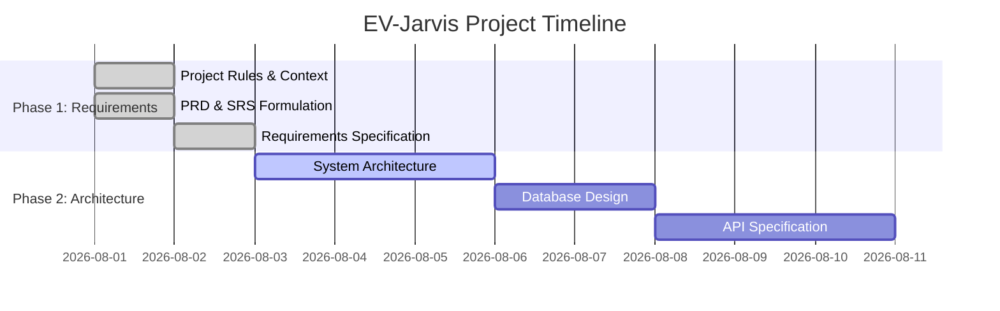
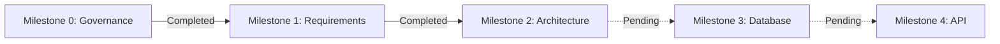

# 1. Project Information
- **Project Name:** EV-Jarvis
- **Repository:** DoubleFo20/EV-Jarvis
- **Objective:** สร้างแพลตฟอร์มผู้ช่วย AI อัจฉริยะสำหรับเจ้าของรถ EV

# 2. Current Phase
- **Phase:** Phase 2 - Sprint Implementation

# 3. Current Milestone
- **Milestone:** Sprint 1 Complete — post-push evidence verified; closure documentation recorded locally

# 4. Overall Progress (%)
- **Progress:** Sprint 1 Auth implementation, local disposable verification, visible clean-tree checkpoint และ GitHub Actions มีหลักฐานครบตาม scope. Commit `f24d1fc` ถูก push ไป `origin/main`; run `36382091960` จบ `success` สำหรับ backend/frontend. เอกสาร closure ถูก reconcile และบันทึกใน local-only documentation commit ของ `S1-CLOSE-14`; ยังไม่มี Android, emulator/DHU, รถจริง, OEM telemetry หรือ provider-live evidence.

# 5. Documentation Status

## Documentation Folders Status
- 🟡 01_Project_Management : ACTIVE — Sprint 1 closure ถูกบันทึกแล้ว; งานเอกสารโครงการอื่นยังคงสถานะเดิม
- ✅ 02_Requirements : BASELINE COMPLETE
- ✅ 03_Architecture : BASELINE COMPLETE
- 🟡 04_Development : BASELINE PARTIAL — `BACKEND_STRUCTURE.md` เป็นไฟล์ว่างโดยตั้งใจและต้องมี Owner approval ก่อนแก้
- ✅ 05_Testing : BASELINE DOCUMENTED
- ✅ 06_Deployment : BASELINE DOCUMENTED — ยังไม่มี Production deployment
- 🟡 07_Database : SPRINT 1 AUTH SCOPE VERIFIED — domain schema ที่เหลือเป็นงาน Sprint ถัดไป
- 🟡 08_API : REVIEW — API Specification/OpenAPI remediation ยังไม่อนุมัติและยังไม่ได้ทำ OpenAPI machine validation
- ✅ 09_Implementation : SPRINT 1 CLOSURE RECORDED — remote documentation checkpoint ยังไม่ถูก push

## Files
| Document | Description |
|---|---|
| `PROJECT_RULES.md` | กฎและมาตรฐานของโปรเจกต์ |
| `AI_AGENT_RULES.md` | นโยบายการทำงานของ AI Agent |
| `MASTER_CONTEXT.md` | บริบทส่วนกลางสำหรับ AI |
| `PRODUCT_VISION.md` | วิสัยทัศน์ผลิตภัณฑ์ |
| `PRD.md` | ข้อกำหนดทางธุรกิจ |
| `SRS.md` | ข้อกำหนดทางซอฟต์แวร์ |
| `REQUIREMENTS.md` | ข้อกำหนดระดับ Production-grade |
| `01_SYSTEM_ARCHITECTURE.md` | เอกสารสถาปัตยกรรมระบบ (System Architecture) |
| `02_C4_MODEL.md` | เอกสาร C4 Architecture Model (C4 Model) |
| `03_TECH_STACK.md` | เอกสารชุดเทคโนโลยี (Technology Stack) |
| `04_DEPLOYMENT.md` | เอกสารสถาปัตยกรรมการนำระบบขึ้นทำงาน (Deployment Architecture) |
| `05_SECURITY_ARCHITECTURE.md` | เอกสารสถาปัตยกรรมความปลอดภัย (Security Architecture) |
| `06_AI_ARCHITECTURE.md` | เอกสารสถาปัตยกรรมปัญญาประดิษฐ์ (AI Architecture) |
| `01_DATABASE_DESIGN.md` | เอกสารการออกแบบฐานข้อมูล (Database Architecture) |
| `02_ERD.md` | แผนภาพความสัมพันธ์ของเอนทิตี (Entity Relationship Diagram) |
| `03_DATA_DICTIONARY.md` | พจนานุกรมข้อมูล (Data Dictionary) |
| `04_MIGRATION.md` | คู่มือการย้ายโครงสร้างฐานข้อมูล (Database Migration) |
| `01_API_SPECIFICATION.md` | ข้อกำหนดและการออกแบบ API (API Specification) |
| `02_AUTHENTICATION.md` | สถาปัตยกรรมการยืนยันตัวตนและสิทธิ์ (Auth Architecture) |
| `03_OPENAPI.md` | สเปก OpenAPI (OpenAPI Specification) |
| `04_WEBHOOKS.md` | สถาปัตยกรรม Webhook และ Async Queue (Webhooks Architecture) |
| `01_IMPLEMENTATION_PLAN.md` | แผนดำเนินการหลักเพื่อการพัฒนา (Master Implementation Plan) |
| `02_MVP_CHECKLIST.md` | รายการตรวจสอบและติดตามความคืบหน้า (MVP Checklist) |
| `03_AI_TASK_BREAKDOWN.md` | การแยกย่อยงานสำหรับพัฒนาด้วย AI (AI Task Breakdown) |
| `TECHNICAL_DEBT.md` | บันทึกข้อจำกัดและหนี้ทางเทคนิค (Technical Debt Register) |

# 6. Documents In Progress
| Document | Description |
|---|---|
| `PROJECT_PROGRESS.md` | รายงานความคืบหน้าของโปรเจกต์ |
| `01_API_SPECIFICATION.md` | Auth API contract remediation สถานะ Review |
| `03_OPENAPI.md` | Auth OpenAPI documentation remediation; machine validation ยังไม่ได้รัน |
| `04_SPRINT_1_PLAN.md` | Sprint 1 closure recorded; remote documentation checkpoint remains separate |
| `TECHNICAL_DEBT.md` | Technical debt register สถานะ Active |

# 7. Pending Documents
| Document | Description |
|---|---|

# 8. Current Active Task
- `S1-CLOSE-14` — reconcile post-push Sprint 1 closure evidence in `PROJECT_PROGRESS.md`, `04_SPRINT_1_PLAN.md`, and `HANDOFF.md`, then create the approved local documentation commit; push remains a separate decision

# 9. Next Recommended Task
- ดำเนิน `ANDROID-MVP-READINESS-01`/งาน readiness ถัดไปภายใต้ architecture ที่อนุมัติแล้ว; ขอ separate push approval สำหรับ local documentation closure commit และห้ามอ้าง CI ของ commit นั้นจนกว่าจะ push/verify จริง

# 10. Current Branch
- `main`

# 11. Latest Commit
- Remote `origin/main`: `f24d1fc27f81341c0f72ae19924def7191d68334` (`docs: reconcile sprint 1 governance and handoff`); GitHub Actions run `36382091960` completed `success`.
- Local `HEAD`: S1-CLOSE-14 documentation closure commit created locally and not pushed; no GitHub CI result is claimed for this local-only commit.

# 12. Repository Status
- **Status:** หลัง post-push checkpoint ของ `f24d1fc` working tree แสดงผลสะอาดและ `main` ตรงกับ `origin/main`; S1-CLOSE-14 เปลี่ยนเฉพาะเอกสาร closure สามไฟล์และสร้าง local-only commit โดยไม่ push
- ไม่มี visible uncommitted หรือ staged path หลัง local commit; `frontend/next-env.d.ts` และ `backend/scripts/verify-auth-dev.ts` ยังอยู่บน disk และถูก ignore ด้วย exact root rules; generated/dependency artifacts ใน Phase A ยังคงตรง `HEAD` และ verifier script ไม่ถูกเรียกใช้
- Remote alignment และ GitHub Actions run ถูกตรวจจริงแล้ว; ผล CI นี้ใช้กับ `f24d1fc` เท่านั้น และไม่ครอบคลุม local-only documentation commit, Android, emulator/DHU, รถจริง หรือ OEM telemetry

# 13. Architecture Status
- Approved with Next.js 16 App Router SSR override for Frontend (Owner decision 2026-08-07)

# 14. Database Status
- Auth/Profile migration deployed to EV-JARVIS-DEV; RBAC/RLS and cleanup verified

# 15. API Status
- `/api/v1/auth` implementation มีหลักฐานทดสอบตาม Sprint 1 scope แต่ API Specification/OpenAPI ยังอยู่สถานะ Review
- ยังไม่ได้รัน OpenAPI machine validation หรือ validate bundled machine-readable specification จึงห้ามอ้างว่า OpenAPI validation ผ่าน

# 16. Backend Status
- Sprint 1 Auth backend scope ถูก implement และมีหลักฐาน claims/JWKS กับ Auth/RBAC tests; Sprint 1 closure ถูกบันทึกแล้วโดยไม่ขยายไปยัง Android หรือ vehicle telemetry

# 17. Frontend Status
- Next.js SSR Auth scope ถูก implement: Register, Confirm, Login, Dashboard, Profile/RLS, Refresh และ Logout; Sprint 1 closure evidence และ post-push CI ถูกตรวจแล้ว

# 18. AI Module Status
- Not Started

# 19. Testing Status
- Frontend/backend build, typecheck, lint, automated tests, runtime smoke และ EV-JARVIS-DEV live Auth flow มีหลักฐานผ่านก่อน commit; `S1-CLOSE-07` เพิ่ม disposable local evidence สำหรับ reproducible install, Prisma validation/build/typecheck/lint/test; GitHub Actions run `36382091960` สำหรับ commit `f24d1fc` จบ `success` ทั้ง backend และ frontend. ผลนี้ไม่ครอบคลุม local-only documentation commit, emulator/DHU, รถจริง หรือ OEM telemetry

# 20. Deployment Status
- Not Started

# 21. Known Issues
- ไม่มี Critical/High issue ที่บันทึกค้างใน Sprint 1 Auth scope
- `BACKEND_STRUCTURE.md` ถูกตั้งใจคืนเป็นไฟล์ว่างที่ commit `e2cd0a7`; ห้ามเติมเนื้อหาโดยไม่มี Owner approval ใหม่
- OpenAPI เป็นเอกสาร Markdown พร้อม YAML fragments; ยังไม่มีผลจาก OpenAPI validator หรือ bundled specification validation

# 22. Risks
- Hosted DEV email quota อาจ rate-limit การทดสอบ registration; ห้าม retry loop และใช้ custom SMTP เฉพาะเมื่อ Owner อนุมัติ
- Destructive DEV Auth verifier ต้องผ่าน environment name, approved project-ref fingerprint และ explicit opt-in gate ทุกครั้ง
- Phase A restored `backend/dist/*` 8 paths และ `backend/node_modules/.package-lock.json` ให้ตรง `HEAD`; ห้าม restore/clean path อื่นโดยไม่มี approval ใหม่
- GitHub Actions workflow ถูก track/push แล้วและ run `36382091960` ผ่านสำหรับ `f24d1fc`; ห้ามสรุป Android/emulator/รถจริง/OEM telemetry จาก run นี้

# 23. Blockers
- ไม่มี Sprint 1 implementation blocker
- Technical Sprint 1 closure evidence complete: local disposable evidence, GitHub run `36382091960` for `f24d1fc`, and the visible clean-tree checkpoint all passed. The local documentation closure commit from `S1-CLOSE-14` is not yet pushed and therefore has no GitHub result.
- Android implementation remains subject to the existing Sprint 1 closure and architecture gates, which are now recorded as satisfied for the approved Auth scope; the documentation push is a separate publication decision, not a new requirement.
- การเปลี่ยน `docs/04_Development/BACKEND_STRUCTURE.md` ต้องมี Owner approval โดยตรง

## Cross-agent Handoff Rules
- Codex และ Antigravity สามารถรับช่วงแทนกันได้ภายใน Task ที่กำหนด โดยมีผู้แก้ไฟล์ครั้งละหนึ่งตัว
- การเปลี่ยน Agent ไม่ขยาย Scope ไม่เปลี่ยน Architecture และไม่ถือเป็น Approval ใหม่
- ผู้รับช่วงต้องเทียบ `HANDOFF.md` กับ Git และ implementation จริงก่อนแก้; ห้ามทำซ้ำงานที่เสร็จแล้ว
- อัปเดต `HANDOFF.md` หลังจบแต่ละ subtask ก่อนเริ่ม subtask ถัดไป และเมื่อ Owner พิมพ์ “ส่งไม้ต่อ” ให้หยุดงานใหม่ บันทึกสถานะ และรายงานความพร้อมรับช่วง
- รายละเอียด Task ปัจจุบัน หลักฐาน คำสั่ง ผลตรวจ และงานที่ต้องรักษาอยู่ใน `docs/01_Project_Management/HANDOFF.md`

## Sprint 1 Milestone 3 Implementation Evidence

หลักฐานต่อไปนี้ยืนยัน implementation ที่ดำเนินการแล้ว แต่ไม่ถือเป็นหลักฐานว่า Sprint 1 ปิดอย่างเป็นทางการ:

- EV-JARVIS-DEV เท่านั้น; ไม่มี Production access
- Public registration + verification email, Login, Dashboard, Profile/RLS, forced refresh, Logout และ post-logout protection ผ่าน
- Disposable users/sessions ถูก revoke และ cleanup จาก `auth.users`, `public.users`, `public.user_profiles` แล้ว
- Frontend build/typecheck/lint/tests และ Backend typecheck/Auth tests/Prisma validation ผ่าน
- Pre-commit secret scan, scoped review และ `git diff --check` ผ่านตาม evidence ที่บันทึกไว้
- Sprint implementation commit `78f6048` และ corrective documentation commit `e2cd0a7` ถูก push ไป `origin/main` แล้ว
- Historical Milestone 3 post-push audit ยืนยัน local `HEAD` และ `origin/main` ตรงกันที่ `e2cd0a7`; commit เก่านั้นไม่มี CI result ที่ยืนยันได้
- Current push ยืนยัน `origin/main` ที่ `f24d1fc`; GitHub Actions run `36382091960` จบ `success`. Local S1-CLOSE-14 documentation commit ยังไม่ถูก push.

# 24. Sprint 1 Closure Tasks

รายการด้านล่างเป็น Sprint 1 evidence/closure register; ไม่ได้อนุมัติให้แก้ code, dependency, CI หรือเริ่ม Android นอก scope:

| Task | Description | Status |
|---|---|---|
| 1 | ตรวจและอนุมัติเอกสารส่งต่อ Codex/Antigravity | Recorded in current handoff |
| 2 | Backend reproducible install (`npm ci`) evidence | Evidence recorded in `S1-CLOSE-07` (local disposable snapshot) |
| 3 | Frontend reproducible install (`npm ci`) evidence | Evidence recorded in `S1-CLOSE-07` (local disposable snapshot) |
| 4 | Explicit expired access-token test evidence | Isolated provider-error-to-401 mapping evidence recorded; live JWKS expiry remains unverified |
| 5 | GitHub CI evidence | Passed — run `36382091960` / commit `f24d1fc` |
| 6 | Resolve tracked generated/dependency artifacts and clean working tree | Passed at the `f24d1fc` post-push snapshot; Phase A restore, Phase B exact-ignore, and S1-CLOSE-14 local documentation closure recorded |
| 7 | Review local nanoid security commit and establish GitHub remote alignment | Passed for current push; `origin/main` at `f24d1fc`; local documentation commit remains unpushed |

# 25. Progress Timeline

> หมายเหตุ: Gantt ด้านล่างเป็น initial planning baseline ไม่ใช่สถานะหรือกำหนดการปัจจุบัน; การทำงาน Sprint ให้ยึด `04_SPRINT_1_PLAN.md` และสถานะใน Section 3, 8, 9 และ 23 ของเอกสารนี้

```mermaid
gantt
    title EV-Jarvis Project Timeline
    dateFormat  YYYY-MM-DD
    section Phase 1: Requirements
    Project Rules & Context       :done,    des1, 2026-08-01, 1d
    PRD & SRS Formulation         :done,    des2, 2026-08-01, 1d
    Requirements Specification    :done,    des3, 2026-08-02, 1d
    section Phase 2: Architecture
    System Architecture           :active,  des4, 2026-08-03, 3d
    Database Design               :         des5, after des4, 2d
    API Specification             :         des6, after des5, 3d
```

# 26. Milestone Table

> Milestone 0–10 ด้านล่างเป็น project initialization roadmap แยกจาก Sprint 1 closure status; ห้ามใช้ตารางนี้อนุมานว่า Sprint 1 ปิดหรือ Sprint 2 ได้รับอนุมัติ

| Milestone | Description | Status |
|---|---|---|
| Milestone 0 | Initialize documentation governance | Complete |
| Milestone 1 | Complete requirements phase | Complete |
| Milestone 2 | Architecture documentation | Complete |
| Milestone 3 | Database design | Complete |
| Milestone 4 | API specification | Complete |
| Milestone 5 | Analysis artifacts | Pending |
| Milestone 6 | Initialize backend | Complete |
| Milestone 7 | Initialize frontend | Complete (Next.js SSR Owner-approved override) |
| Milestone 8 | Add AI assistant | Pending |
| Milestone 9 | Add test suite | In Progress (Sprint 1 Auth coverage complete) |
| Milestone 10 | Release Candidate (v1.0.0) | Pending |

# 27. AI Working Context

- งานปัจจุบันคือเตรียมเอกสารส่งต่อระหว่าง Codex และ Antigravity ภายใน Task ที่กำหนด; ผู้แก้ไฟล์ได้ครั้งละหนึ่ง AI และการเปลี่ยน AI ไม่ขยาย scope หรือเปลี่ยน architecture
- `MASTER_CONTEXT.md` สรุปภาพรวม ส่วน `HANDOFF.md` บันทึก branch, local changes, งานเสร็จ/ค้าง และผลตรวจล่าสุด; ผู้รับช่วงต้องเทียบกับ Git และ implementation จริงก่อนแก้
- เอกสารโครงการบางส่วนยังมีสถานะ Review และ OpenAPI machine validation ยังไม่ได้ทำ; Sprint 1 closure เป็นเฉพาะ Auth scope ที่มีหลักฐาน ห้ามอ้างว่าทุกเอกสารหรือ Android/vehicle scope ผ่านแล้ว

# 28. Revision History

| Version | Date | Status | Author | Change Description |
|---|---|---|---|---|
| 1.8.0 | 2026-09-28 | Active | Codex | Record post-push `f24d1fc`/run `36382091960` evidence and local Sprint 1 documentation closure checkpoint; keep push as a separate gate |
| 1.7.0 | 2026-09-28 | Active | Codex | Record S1-CLOSE-11 Phase A/B/C scope, exact ignored local paths, restored artifacts, and remaining pre-commit gate |
| 1.6.0 | 2026-09-28 | Active | Codex | Record pushed commit `9fbc108`, GitHub Actions run `36379393726` success, and reduce Sprint 1 remaining gap to clean-tree disposition |
| 1.5.0 | 2026-09-28 | Active | Codex | บันทึกหลักฐาน disposable local verification และ reconcile Sprint 1 checklist โดยคง GitHub CI/clean-tree gaps เป็น Pending |
| 1.4.0 | 2026-09-27 | Active | Codex | แยก local HEAD จาก GitHub state ที่ตรวจไม่ได้ และตั้ง cross-agent handoff documentation เป็น task ปัจจุบัน โดยคง Sprint 1 closure pending |
| 1.3.0 | 2026-08-14 | Active | Codex | ปรับเป็น post-push state, บันทึก Sprint closure remediation, CI gap และ tracked generated/dependency debt |
| 1.2.0 | 2026-08-07 | Active | Project Owner / Codex | บันทึก Sprint 1 Milestone 3 implementation, Next.js SSR decision, DEV verification และ pre-commit state |
| 1.1.0 | 2026-08-02 | Complete | Principal Solution Architect | Added 02_C4_MODEL.md to completed documents |
| 1.0.0 | 2026-08-02 | Complete | PMO | Initial release of Project Progress |

### Progress Flow

```mermaid
flowchart LR
    A[Milestone 0: Governance] -->|Completed| B[Milestone 1: Requirements]
    B -->|Completed| C[Milestone 2: Architecture]
    C -.->|Pending| D[Milestone 3: Database]
    D -.->|Pending| E[Milestone 4: API]
```
