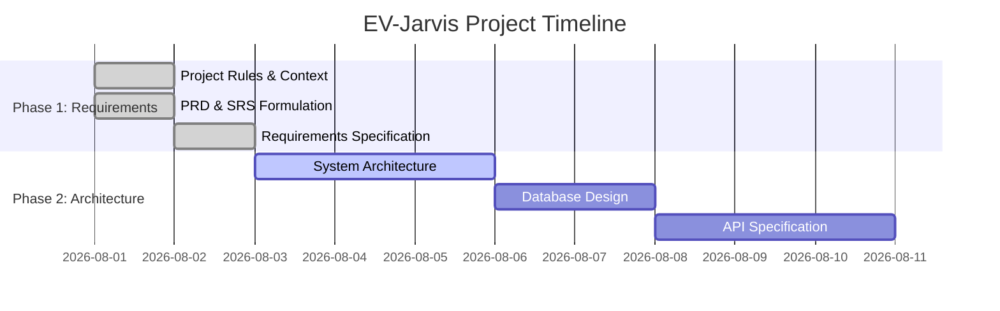
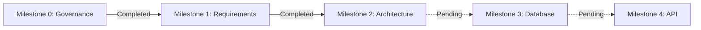

# 1. Project Information
- **Project Name:** EV-Jarvis
- **Repository:** DoubleFo20/EV-Jarvis
- **Objective:** สร้างแพลตฟอร์มผู้ช่วย AI อัจฉริยะสำหรับเจ้าของรถ EV

# 2. Current Phase
- **Phase:** Phase 2 - Sprint Implementation

# 3. Current Milestone
- **Milestone:** Sprint 1 Milestone 3 (Next.js SSR Authentication — Pre-commit)

# 4. Overall Progress (%)
- **Progress:** Sprint 1 Milestone 3 implementation และ live DEV verification เสร็จแล้ว อยู่ระหว่างปิด pre-commit gate

# 5. Completed Documents

## Documentation Folders Status
- ✅ 01_Project_Management : COMPLETE
- ✅ 02_Requirements : COMPLETE
- ✅ 03_Architecture : COMPLETE
- ✅ 04_Development : COMPLETE
- ✅ 05_Testing : COMPLETE
- ✅ 06_Deployment : COMPLETE
- ✅ 07_Database : COMPLETE
- ✅ 08_API : COMPLETE
- ✅ 09_Implementation : COMPLETE

## Files
| Document | Description |
|---|---|
| `PROJECT_RULES.md` | กฎและมาตรฐานของโปรเจกต์ |
| `AI_AGENT_RULES.md` | นโยบายการทำงานของ AI Agent |
| `MASTER_CONTEXT.md` | บริบทส่วนกลางสำหรับ AI |
| `PRODUCT_VISION.md` | วิสัยทัศน์ผลิตภัณฑ์ |
| `PRD.md` | ข้อกำหนดทางธุรกิจ |
| `SRS.md` | ข้อกำหนดทางซอฟต์แวร์ |
| `REQUIREMENTS.md` | ข้อกำหนดระดับ Production-grade |
| `01_SYSTEM_ARCHITECTURE.md` | เอกสารสถาปัตยกรรมระบบ (System Architecture) |
| `02_C4_MODEL.md` | เอกสาร C4 Architecture Model (C4 Model) |
| `03_TECH_STACK.md` | เอกสารชุดเทคโนโลยี (Technology Stack) |
| `04_DEPLOYMENT.md` | เอกสารสถาปัตยกรรมการนำระบบขึ้นทำงาน (Deployment Architecture) |
| `05_SECURITY_ARCHITECTURE.md` | เอกสารสถาปัตยกรรมความปลอดภัย (Security Architecture) |
| `06_AI_ARCHITECTURE.md` | เอกสารสถาปัตยกรรมปัญญาประดิษฐ์ (AI Architecture) |
| `01_DATABASE_DESIGN.md` | เอกสารการออกแบบฐานข้อมูล (Database Architecture) |
| `02_ERD.md` | แผนภาพความสัมพันธ์ของเอนทิตี (Entity Relationship Diagram) |
| `03_DATA_DICTIONARY.md` | พจนานุกรมข้อมูล (Data Dictionary) |
| `04_MIGRATION.md` | คู่มือการย้ายโครงสร้างฐานข้อมูล (Database Migration) |
| `01_API_SPECIFICATION.md` | ข้อกำหนดและการออกแบบ API (API Specification) |
| `02_AUTHENTICATION.md` | สถาปัตยกรรมการยืนยันตัวตนและสิทธิ์ (Auth Architecture) |
| `03_OPENAPI.md` | สเปก OpenAPI (OpenAPI Specification) |
| `04_WEBHOOKS.md` | สถาปัตยกรรม Webhook และ Async Queue (Webhooks Architecture) |
| `01_IMPLEMENTATION_PLAN.md` | แผนดำเนินการหลักเพื่อการพัฒนา (Master Implementation Plan) |
| `02_MVP_CHECKLIST.md` | รายการตรวจสอบและติดตามความคืบหน้า (MVP Checklist) |
| `03_AI_TASK_BREAKDOWN.md` | การแยกย่อยงานสำหรับพัฒนาด้วย AI (AI Task Breakdown) |
| `TECHNICAL_DEBT.md` | บันทึกข้อจำกัดและหนี้ทางเทคนิค (Technical Debt Register) |

# 6. Documents In Progress
| Document | Description |
|---|---|
| `PROJECT_PROGRESS.md` | รายงานความคืบหน้าของโปรเจกต์ |
| `CHANGELOG.md` | บันทึกการเปลี่ยนแปลง |

# 7. Pending Documents
| Document | Description |
|---|---|

# 8. Current Active Task
- ปิด Sprint 1 Milestone 3 pre-commit blockers, ตรวจ diff และขอ Owner อนุมัติ Commit

# 9. Next Recommended Task
- Owner ตรวจ verification evidence และรายการไฟล์ safe-to-stage ก่อนอนุมัติ Git mutation

# 10. Current Branch
- `main`

# 11. Latest Commit
- `eddf7e2`

# 12. Repository Status
- **Status:** Sprint 1 Authentication implemented and verified; dirty working tree ยังไม่ stage/commit

# 13. Architecture Status
- Approved with Next.js 16 App Router SSR override for Frontend (Owner decision 2026-08-07)

# 14. Database Status
- Auth/Profile migration deployed to EV-JARVIS-DEV; RBAC/RLS and cleanup verified

# 15. API Status
- Sprint 1 Auth API complete and verified

# 16. Backend Status
- Sprint 1 Auth backend complete; claims/JWKS verification and Auth/RBAC tests pass

# 17. Frontend Status
- Next.js SSR Auth complete: Register, Confirm, Login, Dashboard, Profile/RLS, Refresh and Logout

# 18. AI Module Status
- Not Started

# 19. Testing Status
- Frontend and backend automated suites, runtime smoke and EV-JARVIS-DEV live Auth verification pass

# 20. Deployment Status
- Not Started

# 21. Known Issues
- ไม่มี Critical/High issue ใน Sprint 1 Milestone 3

# 22. Risks
- Hosted DEV email quota อาจ rate-limit การทดสอบ registration; ห้าม retry loop และใช้ custom SMTP เฉพาะเมื่อ Owner อนุมัติ
- Destructive DEV Auth verifier ต้องผ่าน environment name, approved project-ref fingerprint และ explicit opt-in gate ทุกครั้ง

# 23. Blockers
- ไม่มี implementation blocker; Commit/Push ยังรอคำสั่ง Owner โดยตรง

## Sprint 1 Milestone 3 Verification Evidence

- EV-JARVIS-DEV เท่านั้น; ไม่มี Production access
- Public registration + verification email, Login, Dashboard, Profile/RLS, forced refresh, Logout และ post-logout protection ผ่าน
- Disposable users/sessions ถูก revoke และ cleanup จาก `auth.users`, `public.users`, `public.user_profiles` แล้ว
- Frontend build/typecheck/lint/tests และ Backend typecheck/Auth tests/Prisma validation ผ่าน
- ไม่พบ secret ใน tracked diff และยังไม่มี Git mutation

# 24. Next 10 Tasks
| Task | Description | Status |
|---|---|---|
| 1 | ออกแบบ System Architecture (High-level) | Complete |
| 2 | ออกแบบ Database Schema และ ERD | Pending |
| 3 | กำหนด API Contract ด้วย OpenAPI | Pending |
| 4 | กำหนด Use Cases และ User Flow | Pending |
| 5 | กำหนด Sequence Diagrams สำหรับฟีเจอร์หลัก | Pending |
| 6 | เตรียม Environment สำหรับการพัฒนา Backend | Pending |
| 7 | เตรียม Environment สำหรับการพัฒนา Frontend | Pending |
| 8 | เชื่อมต่อ CI/CD Pipeline พื้นฐาน | Pending |
| 9 | กำหนดรูปแบบ Testing Framework | Pending |
| 10 | สร้าง AI Module Proof of Concept | Pending |

# 25. Progress Timeline

```mermaid
gantt
    title EV-Jarvis Project Timeline
    dateFormat  YYYY-MM-DD
    section Phase 1: Requirements
    Project Rules & Context       :done,    des1, 2026-08-01, 1d
    PRD & SRS Formulation         :done,    des2, 2026-08-01, 1d
    Requirements Specification    :done,    des3, 2026-08-02, 1d
    section Phase 2: Architecture
    System Architecture           :active,  des4, 2026-08-03, 3d
    Database Design               :         des5, after des4, 2d
    API Specification             :         des6, after des5, 3d
```

# 26. Milestone Table

| Milestone | Description | Status |
|---|---|---|
| Milestone 0 | Initialize documentation governance | Complete |
| Milestone 1 | Complete requirements phase | Complete |
| Milestone 2 | Architecture documentation | Complete |
| Milestone 3 | Database design | Complete |
| Milestone 4 | API specification | Complete |
| Milestone 5 | Analysis artifacts | Pending |
| Milestone 6 | Initialize backend | Complete |
| Milestone 7 | Initialize frontend | Complete (Next.js SSR Owner-approved override) |
| Milestone 8 | Add AI assistant | Pending |
| Milestone 9 | Add test suite | In Progress (Sprint 1 Auth coverage complete) |
| Milestone 10 | Release Candidate (v1.0.0) | Pending |

# 27. AI Working Context

- การดำเนินงานปัจจุบันมุ่งเน้นไปที่การวางรากฐานและโครงสร้างเอกสาร (Documentation Governance) 
- ทุกเอกสารผ่านการ Validate และ Cross-reference เรียบร้อยแล้วตามมาตรฐานของ `AI_AGENT_RULES.md`
- บริบททั้งหมดถูกอ้างอิงไว้ใน `MASTER_CONTEXT.md` เพื่อใช้สำหรับ AI ในรอบต่อๆ ไป

# 28. Revision History

| Version | Date | Status | Author | Change Description |
|---|---|---|---|---|
| 1.2.0 | 2026-08-07 | Active | Project Owner / Codex | บันทึก Sprint 1 Milestone 3 implementation, Next.js SSR decision, DEV verification และ pre-commit state |
| 1.0.0 | 2026-08-02 | Complete | PMO | Initial release of Project Progress |
| 1.1.0 | 2026-08-02 | Complete | Principal Solution Architect | Added 02_C4_MODEL.md to completed documents |

### Progress Flow

```mermaid
flowchart LR
    A[Milestone 0: Governance] -->|Completed| B[Milestone 1: Requirements]
    B -->|Completed| C[Milestone 2: Architecture]
    C -.->|Pending| D[Milestone 3: Database]
    D -.->|Pending| E[Milestone 4: API]
```
