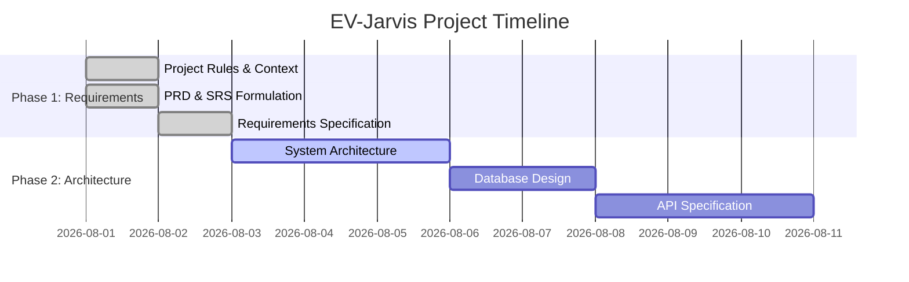
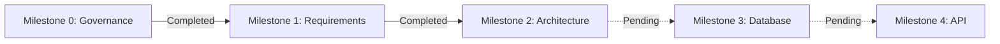

# 1. Project Information
- **Project Name:** EV-Jarvis
- **Repository:** DoubleFo20/EV-Jarvis
- **Objective:** สร้างแพลตฟอร์มผู้ช่วย AI อัจฉริยะสำหรับเจ้าของรถ EV

# 2. Current Phase
- **Phase:** Phase 2 - Sprint Implementation

# 3. Current Milestone
- **Milestone:** Sprint 1 Closure (Post-push Documentation Remediation)

# 4. Overall Progress (%)
- **Progress:** Sprint 1 Auth implementation ถูก push แล้วที่ `origin/main@e2cd0a7`; เอกสาร closure ยังอยู่สถานะ Review และ Sprint 1 ยังเป็น Closure Pending จนกว่า verification gaps ทั้ง 5 ข้อจะได้รับหลักฐาน

# 5. Documentation Status

## Documentation Folders Status
- 🟡 01_Project_Management : ACTIVE — `PROJECT_PROGRESS.md` อยู่ระหว่าง closure remediation
- ✅ 02_Requirements : BASELINE COMPLETE
- ✅ 03_Architecture : BASELINE COMPLETE
- 🟡 04_Development : BASELINE PARTIAL — `BACKEND_STRUCTURE.md` เป็นไฟล์ว่างโดยตั้งใจและต้องมี Owner approval ก่อนแก้
- ✅ 05_Testing : BASELINE DOCUMENTED
- ✅ 06_Deployment : BASELINE DOCUMENTED — ยังไม่มี Production deployment
- 🟡 07_Database : SPRINT 1 AUTH SCOPE VERIFIED — domain schema ที่เหลือเป็นงาน Sprint ถัดไป
- 🟡 08_API : REVIEW — API Specification/OpenAPI remediation ยังไม่อนุมัติและยังไม่ได้ทำ OpenAPI machine validation
- 🟡 09_Implementation : REVIEW / CLOSURE PENDING

## Files
| Document | Description |
|---|---|
| `PROJECT_RULES.md` | กฎและมาตรฐานของโปรเจกต์ |
| `AI_AGENT_RULES.md` | นโยบายการทำงานของ AI Agent |
| `MASTER_CONTEXT.md` | บริบทส่วนกลางสำหรับ AI |
| `PRODUCT_VISION.md` | วิสัยทัศน์ผลิตภัณฑ์ |
| `PRD.md` | ข้อกำหนดทางธุรกิจ |
| `SRS.md` | ข้อกำหนดทางซอฟต์แวร์ |
| `REQUIREMENTS.md` | ข้อกำหนดระดับ Production-grade |
| `01_SYSTEM_ARCHITECTURE.md` | เอกสารสถาปัตยกรรมระบบ (System Architecture) |
| `02_C4_MODEL.md` | เอกสาร C4 Architecture Model (C4 Model) |
| `03_TECH_STACK.md` | เอกสารชุดเทคโนโลยี (Technology Stack) |
| `04_DEPLOYMENT.md` | เอกสารสถาปัตยกรรมการนำระบบขึ้นทำงาน (Deployment Architecture) |
| `05_SECURITY_ARCHITECTURE.md` | เอกสารสถาปัตยกรรมความปลอดภัย (Security Architecture) |
| `06_AI_ARCHITECTURE.md` | เอกสารสถาปัตยกรรมปัญญาประดิษฐ์ (AI Architecture) |
| `01_DATABASE_DESIGN.md` | เอกสารการออกแบบฐานข้อมูล (Database Architecture) |
| `02_ERD.md` | แผนภาพความสัมพันธ์ของเอนทิตี (Entity Relationship Diagram) |
| `03_DATA_DICTIONARY.md` | พจนานุกรมข้อมูล (Data Dictionary) |
| `04_MIGRATION.md` | คู่มือการย้ายโครงสร้างฐานข้อมูล (Database Migration) |
| `01_API_SPECIFICATION.md` | ข้อกำหนดและการออกแบบ API (API Specification) |
| `02_AUTHENTICATION.md` | สถาปัตยกรรมการยืนยันตัวตนและสิทธิ์ (Auth Architecture) |
| `03_OPENAPI.md` | สเปก OpenAPI (OpenAPI Specification) |
| `04_WEBHOOKS.md` | สถาปัตยกรรม Webhook และ Async Queue (Webhooks Architecture) |
| `01_IMPLEMENTATION_PLAN.md` | แผนดำเนินการหลักเพื่อการพัฒนา (Master Implementation Plan) |
| `02_MVP_CHECKLIST.md` | รายการตรวจสอบและติดตามความคืบหน้า (MVP Checklist) |
| `03_AI_TASK_BREAKDOWN.md` | การแยกย่อยงานสำหรับพัฒนาด้วย AI (AI Task Breakdown) |
| `TECHNICAL_DEBT.md` | บันทึกข้อจำกัดและหนี้ทางเทคนิค (Technical Debt Register) |

# 6. Documents In Progress
| Document | Description |
|---|---|
| `PROJECT_PROGRESS.md` | รายงานความคืบหน้าของโปรเจกต์ |
| `01_API_SPECIFICATION.md` | Auth API contract remediation สถานะ Review |
| `03_OPENAPI.md` | Auth OpenAPI documentation remediation; machine validation ยังไม่ได้รัน |
| `04_SPRINT_1_PLAN.md` | Sprint verification reconciliation สถานะ Closure Pending |
| `TECHNICAL_DEBT.md` | Technical debt register สถานะ Active |

# 7. Pending Documents
| Document | Description |
|---|---|

# 8. Current Active Task
- สร้าง documentation-only closure-status commit จากเอกสาร 5 ไฟล์ที่ Owner อนุมัติ โดยไม่อ้างว่า Sprint 1 ปิดแล้ว

# 9. Next Recommended Task
- ทำ read-only post-commit audit และขอ Owner approval แยกต่างหากก่อน push

# 10. Current Branch
- `main`

# 11. Latest Commit
- `e2cd0a7` (`origin/main` ตรงกับ local `HEAD` ณ post-push audit)

# 12. Repository Status
- **Status:** Sprint 1 Authentication อยู่ที่ `origin/main@e2cd0a7`; Owner อนุมัติ documentation-only closure-status commit แล้ว แต่ยังไม่อนุมัติ push และต้องรักษา pre-existing working-tree exclusions

# 13. Architecture Status
- Approved with Next.js 16 App Router SSR override for Frontend (Owner decision 2026-08-07)

# 14. Database Status
- Auth/Profile migration deployed to EV-JARVIS-DEV; RBAC/RLS and cleanup verified

# 15. API Status
- `/api/v1/auth` implementation มีหลักฐานทดสอบตาม Sprint 1 scope แต่ API Specification/OpenAPI ยังอยู่สถานะ Review
- ยังไม่ได้รัน OpenAPI machine validation หรือ validate bundled machine-readable specification จึงห้ามอ้างว่า OpenAPI validation ผ่าน

# 16. Backend Status
- Sprint 1 Auth backend scope ถูก implement และมีหลักฐาน claims/JWKS กับ Auth/RBAC tests; สถานะนี้ไม่เท่ากับการปิด Sprint อย่างเป็นทางการ

# 17. Frontend Status
- Next.js SSR Auth scope ถูก implement: Register, Confirm, Login, Dashboard, Profile/RLS, Refresh และ Logout; Sprint closure ยัง Pending

# 18. AI Module Status
- Not Started

# 19. Testing Status
- Frontend/backend build, typecheck, lint, automated tests, runtime smoke และ EV-JARVIS-DEV live Auth flow มีหลักฐานผ่านก่อน commit; post-push CI ไม่มีผลให้ยืนยัน

# 20. Deployment Status
- Not Started

# 21. Known Issues
- ไม่มี Critical/High issue ที่บันทึกค้างใน Sprint 1 Auth scope
- `BACKEND_STRUCTURE.md` ถูกตั้งใจคืนเป็นไฟล์ว่างที่ commit `e2cd0a7`; ห้ามเติมเนื้อหาโดยไม่มี Owner approval ใหม่
- OpenAPI เป็นเอกสาร Markdown พร้อม YAML fragments; ยังไม่มีผลจาก OpenAPI validator หรือ bundled specification validation

# 22. Risks
- Hosted DEV email quota อาจ rate-limit การทดสอบ registration; ห้าม retry loop และใช้ custom SMTP เฉพาะเมื่อ Owner อนุมัติ
- Destructive DEV Auth verifier ต้องผ่าน environment name, approved project-ref fingerprint และ explicit opt-in gate ทุกครั้ง
- `backend/dist` และ `backend/node_modules` ยังเป็น tracked files ทำให้ generated/dependency changes ปะปนใน working tree; บันทึกเป็น Technical Debt
- Repository ยังไม่มี GitHub Actions workflow และ commit `e2cd0a7` ไม่มี CI status/check run; ห้ามอ้างว่า CI ผ่าน

# 23. Blockers
- ไม่มี Sprint 1 implementation blocker
- Sprint 1 formal closure ยัง Pending เพราะ verification checklist มี 5 ข้อที่ยังไม่มีหลักฐานครบ: Backend `npm ci`, Frontend `npm ci`, expired access-token test, GitHub CI และ clean working tree
- Owner อนุมัติ stage/commit เฉพาะเอกสาร closure 5 ไฟล์เมื่อ 2026-08-15; push ยังไม่ได้รับอนุมัติ
- การเปลี่ยน `docs/04_Development/BACKEND_STRUCTURE.md` ต้องมี Owner approval โดยตรง

## Sprint 1 Milestone 3 Implementation Evidence

หลักฐานต่อไปนี้ยืนยัน implementation ที่ดำเนินการแล้ว แต่ไม่ถือเป็นหลักฐานว่า Sprint 1 ปิดอย่างเป็นทางการ:

- EV-JARVIS-DEV เท่านั้น; ไม่มี Production access
- Public registration + verification email, Login, Dashboard, Profile/RLS, forced refresh, Logout และ post-logout protection ผ่าน
- Disposable users/sessions ถูก revoke และ cleanup จาก `auth.users`, `public.users`, `public.user_profiles` แล้ว
- Frontend build/typecheck/lint/tests และ Backend typecheck/Auth tests/Prisma validation ผ่าน
- Pre-commit secret scan, scoped review และ `git diff --check` ผ่านตาม evidence ที่บันทึกไว้
- Sprint implementation commit `78f6048` และ corrective documentation commit `e2cd0a7` ถูก push ไป `origin/main` แล้ว
- Post-push audit ยืนยัน local `HEAD` และ `origin/main` ตรงกันที่ `e2cd0a7`; ไม่พบ CI result สำหรับ commit นี้

# 24. Next 10 Tasks
| Task | Description | Status |
|---|---|---|
| 1 | ออกแบบ System Architecture (High-level) | Complete |
| 2 | ออกแบบ Database Schema และ ERD | Pending |
| 3 | กำหนด API Contract ด้วย OpenAPI | Pending |
| 4 | กำหนด Use Cases และ User Flow | Pending |
| 5 | กำหนด Sequence Diagrams สำหรับฟีเจอร์หลัก | Pending |
| 6 | เตรียม Environment สำหรับการพัฒนา Backend | Pending |
| 7 | เตรียม Environment สำหรับการพัฒนา Frontend | Pending |
| 8 | เชื่อมต่อ CI/CD Pipeline พื้นฐาน | Pending |
| 9 | กำหนดรูปแบบ Testing Framework | Pending |
| 10 | สร้าง AI Module Proof of Concept | Pending |

# 25. Progress Timeline

```mermaid
gantt
    title EV-Jarvis Project Timeline
    dateFormat  YYYY-MM-DD
    section Phase 1: Requirements
    Project Rules & Context       :done,    des1, 2026-08-01, 1d
    PRD & SRS Formulation         :done,    des2, 2026-08-01, 1d
    Requirements Specification    :done,    des3, 2026-08-02, 1d
    section Phase 2: Architecture
    System Architecture           :active,  des4, 2026-08-03, 3d
    Database Design               :         des5, after des4, 2d
    API Specification             :         des6, after des5, 3d
```

# 26. Milestone Table

| Milestone | Description | Status |
|---|---|---|
| Milestone 0 | Initialize documentation governance | Complete |
| Milestone 1 | Complete requirements phase | Complete |
| Milestone 2 | Architecture documentation | Complete |
| Milestone 3 | Database design | Complete |
| Milestone 4 | API specification | Complete |
| Milestone 5 | Analysis artifacts | Pending |
| Milestone 6 | Initialize backend | Complete |
| Milestone 7 | Initialize frontend | Complete (Next.js SSR Owner-approved override) |
| Milestone 8 | Add AI assistant | Pending |
| Milestone 9 | Add test suite | In Progress (Sprint 1 Auth coverage complete) |
| Milestone 10 | Release Candidate (v1.0.0) | Pending |

# 27. AI Working Context

- การดำเนินงานปัจจุบันมุ่งเน้นไปที่การวางรากฐานและโครงสร้างเอกสาร (Documentation Governance) 
- ทุกเอกสารผ่านการ Validate และ Cross-reference เรียบร้อยแล้วตามมาตรฐานของ `AI_AGENT_RULES.md`
- บริบททั้งหมดถูกอ้างอิงไว้ใน `MASTER_CONTEXT.md` เพื่อใช้สำหรับ AI ในรอบต่อๆ ไป

# 28. Revision History

| Version | Date | Status | Author | Change Description |
|---|---|---|---|---|
| 1.3.0 | 2026-08-14 | Active | Codex | ปรับเป็น post-push state, บันทึก Sprint closure remediation, CI gap และ tracked generated/dependency debt |
| 1.2.0 | 2026-08-07 | Active | Project Owner / Codex | บันทึก Sprint 1 Milestone 3 implementation, Next.js SSR decision, DEV verification และ pre-commit state |
| 1.1.0 | 2026-08-02 | Complete | Principal Solution Architect | Added 02_C4_MODEL.md to completed documents |
| 1.0.0 | 2026-08-02 | Complete | PMO | Initial release of Project Progress |

### Progress Flow

```mermaid
flowchart LR
    A[Milestone 0: Governance] -->|Completed| B[Milestone 1: Requirements]
    B -->|Completed| C[Milestone 2: Architecture]
    C -.->|Pending| D[Milestone 3: Database]
    D -.->|Pending| E[Milestone 4: API]
```
