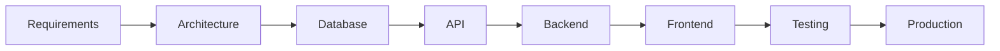
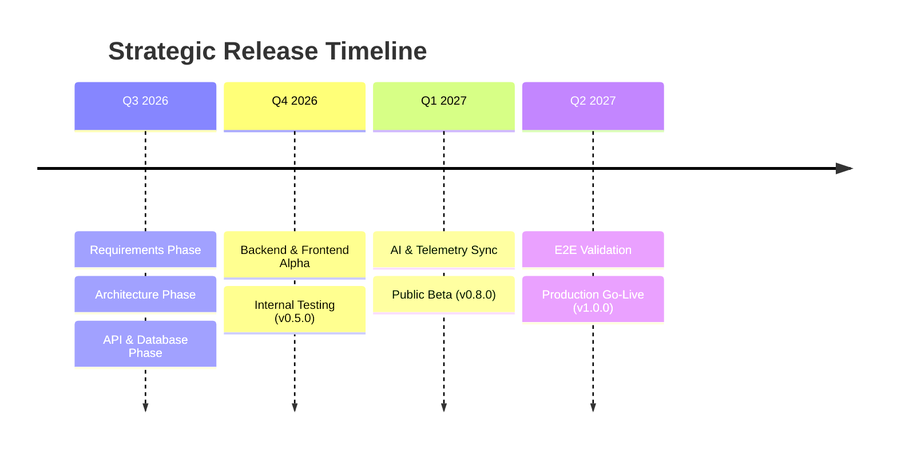
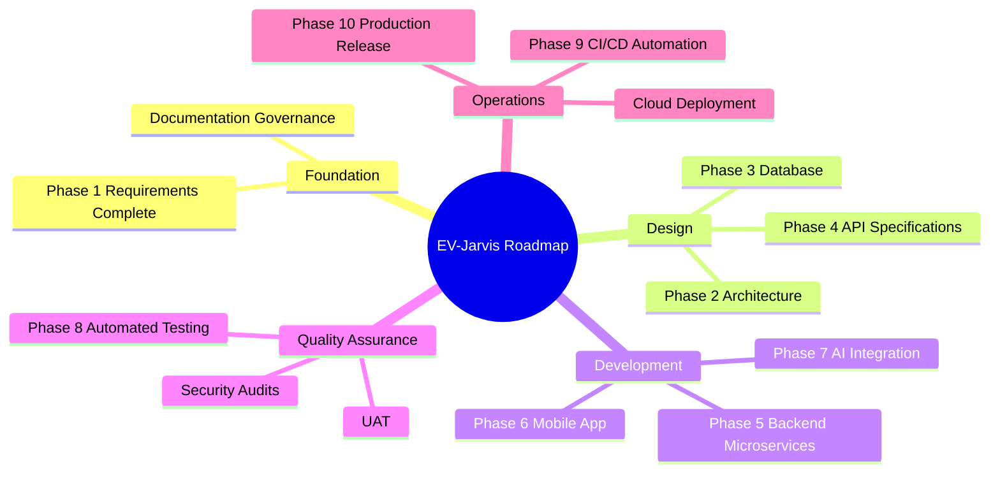

# Project Roadmap: EV-Jarvis

เอกสารนี้แสดงแผนงาน (Roadmap) และเส้นทางของโครงการแบบ End-to-End ตั้งแต่ช่วงการวางแผนเริ่มต้นจนถึงช่วงนำระบบขึ้นใช้งานจริง (Production Release)

**เอกสารอ้างอิงที่เกี่ยวข้อง (Cross-reference):**
- [MASTER_CONTEXT](MASTER_CONTEXT.md)
- [PROJECT_PROGRESS](PROJECT_PROGRESS.md)
- [PRD](../02_Requirements/03_PRD.md)
- [SRS](../02_Requirements/04_SRS.md)
- [REQUIREMENTS](../02_Requirements/05_REQUIREMENTS.md)

---

## Vision
เป็นผู้นำด้านแพลตฟอร์มผู้ช่วย AI ส่วนตัวระดับแนวหน้าสำหรับเจ้าของรถ EV ที่เชื่อมต่อข้อมูลรอบด้านเพื่อให้ผู้ใช้ขับขี่ได้อย่างมั่นใจ สะดวกสบาย และประหยัดค่าใช้จ่ายที่สุด

## Product Goals
- นำเสนอแดชบอร์ดข้อมูลรถ (Telemetry) และแบตเตอรี่แบบเรียลไทม์
- คำนวณเส้นทางและจุดชาร์จให้สอดคล้องกับสมรรถนะของรถ (Smart Routing)
- บูรณาการ AI Assistant เพื่อตอบคำถามและช่วยเหลือผู้ใช้งานอย่างเป็นธรรมชาติ

## Business Goals
- มีจำนวนผู้ใช้งาน (Active Users) อย่างน้อย 10,000 คน ภายในไตรมาสแรกหลังคลอด MVP
- รองรับการเชื่อมต่อกับค่ายรถชั้นนำอย่างน้อย 3 แบรนด์ในเฟสแรก
- สร้างมูลค่าเพิ่มด้วยฟีเจอร์พรีเมียม (Predictive Maintenance)

## Technical Goals
- สถาปัตยกรรมรองรับการขยายตัว (Scalable Architecture) ระดับ 5,000 Request/วินาที
- Uptime 99.9% สำหรับ Core API
- RTO < 4 ชั่วโมง และ RPO < 1 ชั่วโมง ในส่วนของการกู้คืนระบบ (Disaster Recovery)

---

## Current Status
- **ปัจจุบัน:** โปรเจกต์อยู่ใน Phase 1 (Requirements) 
- **ความคืบหน้า:** กฎของโปรเจกต์ โครงสร้างเอกสาร และ Requirement เชิงลึก (PRD, SRS, REQUIREMENTS) ได้รับการอนุมัติและจัดทำเสร็จสิ้น (Status: Complete) อ้างอิงจาก `PROJECT_PROGRESS.md`
- **ขั้นตอนต่อไป:** เตรียมเข้าสู่ Phase 2 (Architecture)

---

## 🚀 Lifecycle Phases

ทุก Phase อ้างอิงบริบทจาก [MASTER_CONTEXT](MASTER_CONTEXT.md) และสถานะจริงจาก [PROJECT_PROGRESS](PROJECT_PROGRESS.md). กรอบแนวคิดอิงตาม [PRD](../02_Requirements/03_PRD.md) และข้อกำหนดทางวิศวกรรมจาก [SRS](../02_Requirements/04_SRS.md) รวมถึงข้อกำหนดละเอียดจาก [REQUIREMENTS](../02_Requirements/05_REQUIREMENTS.md).

### Phase 1: Requirements
- **Status:** Complete
- **Description:** รวบรวมและวิเคราะห์ข้อกำหนดทางธุรกิจ ทางเทคนิค และการจัดการเอกสารส่วนกลางทั้งหมด
- **Deliverables:** `PROJECT_RULES.md`, `AI_AGENT_RULES.md`, `PRODUCT_VISION.md`, `PRD.md`, `SRS.md`, `REQUIREMENTS.md`
- **Dependencies:** ไม่มี (เป็นจุดเริ่มต้น)

### Phase 2: Architecture
- **Status:** Pending
- **Description:** ออกแบบสถาปัตยกรรมระบบ โครงสร้างพื้นฐาน และ Microservices
- **Deliverables:** `Architecture.md`, `System_Diagram.png`
- **Dependencies:** Phase 1 Requirements

### Phase 3: Database
- **Status:** Pending
- **Description:** ออกแบบ Database Schema, ERD, และนโยบายการจัดเก็บข้อมูล
- **Deliverables:** `Database.md`, SQL Migration Scripts เบื้องต้น
- **Dependencies:** Phase 2 Architecture

### Phase 4: API
- **Status:** Pending
- **Description:** ออกแบบ API Contract, OpenAPI Specification และ Webhook
- **Deliverables:** `API.md`, Swagger Spec
- **Dependencies:** Phase 2 Architecture, Phase 3 Database

### Phase 5: Backend
- **Status:** Pending
- **Description:** พัฒนาระบบ Backend Services, Authentication และ Data Ingestion
- **Deliverables:** Backend Source Code, Unit Tests
- **Dependencies:** Phase 4 API

### Phase 6: Frontend
- **Status:** Pending
- **Description:** พัฒนา Mobile App และ Web Dashboard สำหรับผู้ใช้งานและผู้ดูแลระบบ
- **Deliverables:** Frontend Source Code, UI Components
- **Dependencies:** Phase 4 API, Phase 5 Backend (บางส่วน)

### Phase 7: AI Assistant
- **Status:** Pending
- **Description:** พัฒนาและเชื่อมต่อโมเดล LLM สำหรับ EV-Jarvis
- **Deliverables:** AI Prompt Engineering, Context Injection Service
- **Dependencies:** Phase 5 Backend

### Phase 8: Testing
- **Status:** Pending
- **Description:** ทำการทดสอบระบบแบบ E2E, Load Testing และ Security Scan
- **Deliverables:** Test Reports, Bug Fixes
- **Dependencies:** Phase 5 Backend, Phase 6 Frontend, Phase 7 AI

### Phase 9: Deployment
- **Status:** Pending
- **Description:** จัดเตรียม Infrastructure, CI/CD Pipeline และ Blue/Green Deployment
- **Deliverables:** Dockerfiles, GitHub Actions Workflows, Terraform Scripts
- **Dependencies:** Phase 8 Testing

### Phase 10: Production Release
- **Status:** Pending
- **Description:** นำระบบขึ้นใช้งานจริง (Go-Live) สู่กลุ่มผู้ใช้เป้าหมาย (MVP v1.0.0)
- **Deliverables:** v1.0.0 Release, Marketing Launch, Operations Runbook
- **Dependencies:** Phase 9 Deployment

---

## Future Roadmap
- พัฒนาระบบวิเคราะห์เชิงทำนาย (Predictive Maintenance)
- ขยายการรองรับผู้ให้บริการชาร์จไฟฟ้าแบบ 3rd Party ครบทุกเจ้าในประเทศ
- นำร่องฟีเจอร์ Autonomous Route Planning ทำงานร่วมกับระบบรถโดยตรง

## Version Roadmap
| Version | Target | Core Features | Status |
|---|---|---|---|
| **v0.1.0** | Documentation & Governance | Requirements, AI Rules, Project Rules | **Complete** |
| **v0.5.0** | Alpha Release (Internal) | Backend APIs, DB Schema, Basic App | Pending |
| **v0.8.0** | Beta Release (Public) | Full App UI, Real Telemetry, EV-Jarvis AI | Pending |
| **v1.0.0** | Production Release | MVP Complete, Smart Routing, Notifications | Pending |

## Quarter Plan
| Quarter | Focus Area | Output |
|---|---|---|
| **Q3 2026** | Requirements, Architecture, Design | Approved Specs & Mockups |
| **Q4 2026** | Core Backend, DB, API, Frontend Alpha | Internal Alpha (v0.5.0) |
| **Q1 2027** | Telemetry Sync, AI Integration, Testing | Public Beta (v0.8.0) |
| **Q2 2027** | Optimization, Load Testing, Go-Live | Production Release (v1.0.0) |

## Monthly Plan (Current Quarter)
| Month | Focus Area | Status |
|---|---|---|
| **August 2026** | Phase 1 (Requirements) & Phase 2 (Architecture) | In Progress |
| **September 2026** | Phase 3 (Database) & Phase 4 (API) | Pending |
| **October 2026** | Phase 5 (Backend) เริ่มต้น | Pending |

## Weekly Plan (Current Month)
| Week | Focus Area | Status |
|---|---|---|
| **Week 1** | Project Initialization & Requirements (PRD, SRS) | **Complete** |
| **Week 2** | System Architecture & Technology Stack | Pending |
| **Week 3** | Database ERD & Schema Design | Pending |
| **Week 4** | API Contract Specification (OpenAPI) | Pending |

---

## Milestones
| Milestone | Description | Priority |
|---|---|---|
| **M1: Foundation** | Requirements และเอกสารโปรเจกต์เสร็จสมบูรณ์ | High |
| **M2: Design** | Architecture, DB, API ได้รับการอนุมัติ | High |
| **M3: Core Dev** | Backend และ Frontend สามารถเชื่อมต่อกันได้ | High |
| **M4: AI & Sync** | โมดูล AI ทำงานร่วมกับข้อมูลรถแบบเรียลไทม์ | High |
| **M5: Launch** | ระบบพร้อมให้บริการแก่บุคคลทั่วไป (v1.0.0) | Critical |

## Deliverables
- Documentation (Markdown files)
- Source Code (Backend/Frontend)
- Database Schemas
- CI/CD Pipelines
- Automated Test Suites
- Compiled Mobile App (APK/IPA)
- Web Application
- Infrastructure as Code (IaC)

## Dependencies
- ข้อมูลจำเพาะจากผู้ให้บริการ API ค่ายรถยนต์
- งบประมาณสำหรับ Cloud Infrastructure
- ความเสถียรของบริการ LLM (OpenAI / Gemini) สำหรับระบบ AI

## Critical Path


## Risk Matrix
| Risk | Probability | Impact | Mitigation Strategy |
|---|---|---|---|
| API ค่ายรถเปลี่ยนโครงสร้างข้อมูล | Medium | High | สร้าง Integration Layer และ Adapter Pattern แบบหลวมๆ |
| ระบบ AI ประมวลผลผิดพลาด (Hallucination) | Low | Medium | ตั้งค่า Temperature ให้ต่ำ และมี Fallback Response |
| ระบบล่มเมื่อผู้ใช้งานเพิ่มขึ้นกระทันหัน | Low | High | ออกแบบเป็น Cloud-native รองรับ Auto-scaling ทันที |

## Success Metrics
- ระบบจัดการ Requirement ครอบคลุม 100% ตามมาตรฐาน IEEE
- ส่งมอบเอกสาร Design ได้ทันตามระยะเวลา Q3
- สามารถแสดงผลข้อมูลรถในหน้า UI ภายใน 3 วินาที

## KPI
- จำนวน Bug ในระดับ High/Critical < 5 รายการก่อน Release
- Code Coverage ของ Unit Tests > 80%
- SLA ของ Uptime ทะลุ 99.9% ในช่วง Beta

---

## Timeline (Mermaid Gantt)
```mermaid
gantt
    title EV-Jarvis Development Timeline
    dateFormat  YYYY-MM-DD
    
    section Foundation (M1)
    Phase 1: Requirements       :done,    m1_1, 2026-08-01, 2d
    
    section Design (M2)
    Phase 2: Architecture       :active,  m2_1, 2026-08-03, 4d
    Phase 3: Database           :         m2_2, after m2_1, 3d
    Phase 4: API                :         m2_3, after m2_2, 3d
    
    section Execution (M3, M4)
    Phase 5: Backend            :         m3_1, 2026-08-15, 14d
    Phase 6: Frontend           :         m3_2, 2026-08-20, 14d
    Phase 7: AI Assistant       :         m4_1, 2026-09-01, 10d
    
    section Launch (M5)
    Phase 8: Testing            :         m5_1, 2026-09-12, 7d
    Phase 9: Deployment         :         m5_2, 2026-09-20, 5d
    Phase 10: Production        :         m5_3, 2026-09-26, 1d
```

## Mermaid Timeline


## Mermaid Mindmap

