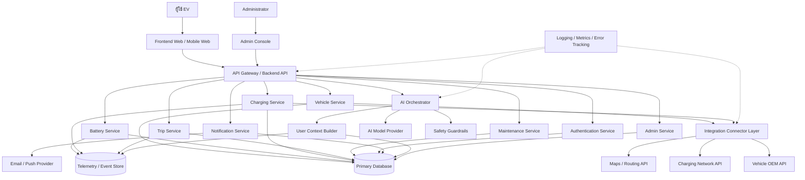

# EV-JARVIS Product Requirements Document

> **Document ID:** DOC-003  
> **Version:** 1.0.0  
> **Status:** Draft  
> **Project:** EV-JARVIS  
> **Author:** Product Team  
> **Last Updated:** 2026-08-02  
> **Primary Language:** Thai  
> **Document Type:** Product Requirements Document  
> **Methodology:** IEEE Requirements Practice, Agile Product Management, Scrum Delivery

---

# Table of Contents

1. [Executive Summary](#executive-summary)
2. [Business Goals](#business-goals)
3. [Stakeholders](#stakeholders)
4. [Scope](#scope)
5. [Success Metrics](#success-metrics)
6. [Product Architecture Overview](#product-architecture-overview)
7. [Epic List](#epic-list)
8. [Feature List](#feature-list)
9. [User Stories](#user-stories)
10. [Functional Overview](#functional-overview)
11. [Requirement Traceability Matrix](#requirement-traceability-matrix)
12. [MVP Definition](#mvp-definition)
13. [Release Plan](#release-plan)
14. [Risks](#risks)
15. [Dependencies](#dependencies)
16. [Assumptions](#assumptions)
17. [Constraints](#constraints)
18. [Non-Goals](#non-goals)
19. [Glossary](#glossary)
20. [Revision History](#revision-history)

---

# Executive Summary

EV-JARVIS คือแพลตฟอร์ม AI Assistant สำหรับผู้ใช้รถยนต์ไฟฟ้า (Electric Vehicle หรือ EV) ที่รวมข้อมูลรถ แบตเตอรี่ การชาร์จ การเดินทาง การบำรุงรักษา การแจ้งเตือน และคำแนะนำจาก AI ไว้ในระบบเดียว เป้าหมายหลักคือช่วยให้เจ้าของรถ EV เข้าใจสถานะรถได้ง่ายขึ้น วางแผนการใช้งานได้มั่นใจขึ้น ลดความยุ่งยากจากการใช้หลายแอปพลิเคชัน และสร้างฐานข้อมูลที่พร้อมต่อยอดเป็นบริการ EV ecosystem ในอนาคต

ปัญหาทางธุรกิจที่ EV-JARVIS ต้องแก้คือข้อมูลของผู้ใช้ EV กระจัดกระจายอยู่ในหลายแหล่ง เช่น แอปรถยนต์ แอปสถานีชาร์จ ประวัติการชำระค่าไฟ บันทึกการเดินทาง และประวัติศูนย์บริการ ทำให้ผู้ใช้ไม่สามารถเห็นภาพรวมของค่าใช้จ่าย ประสิทธิภาพแบตเตอรี่ พฤติกรรมการขับขี่ และความเสี่ยงด้านการบำรุงรักษาได้อย่างครบถ้วน ระบบนี้จึงถูกสร้างขึ้นเพื่อเป็นศูนย์กลางการติดตาม วิเคราะห์ และช่วยตัดสินใจสำหรับการใช้งานรถ EV ในชีวิตประจำวัน

เหตุผลที่โปรเจกต์นี้มีอยู่คือการเติบโตของตลาด EV ทำให้ผู้ใช้ต้องการเครื่องมือที่ใช้งานง่าย ปลอดภัย และอธิบายข้อมูลเชิงเทคนิคให้อยู่ในรูปแบบที่เข้าใจได้ EV-JARVIS จะทำหน้าที่เป็นผู้ช่วยดิจิทัลที่แปลข้อมูลรถให้เป็น insight ที่ลงมือทำได้ เช่น ควรชาร์จเมื่อใด ค่าใช้จ่ายต่อกิโลเมตรเป็นเท่าใด แบตเตอรี่มีแนวโน้มเสื่อมเร็วหรือไม่ และควรเข้ารับบริการเมื่อใด

ผลลัพธ์ที่คาดหวังคือผู้ใช้สามารถจัดการรถ EV ได้จาก Dashboard เดียว ได้รับการแจ้งเตือนที่สำคัญก่อนเกิดปัญหา มีข้อมูลเชิงวิเคราะห์สำหรับลดค่าใช้จ่ายและยืดอายุแบตเตอรี่ และสามารถถาม AI Assistant เพื่อรับคำอธิบายหรือคำแนะนำที่อ้างอิงจากข้อมูลของตนเองได้อย่างปลอดภัย

---

# Business Goals

## Business Objectives

| Objective ID | Objective | คำอธิบาย | Target |
|---|---|---|---|
| BO-001 | สร้างแพลตฟอร์มศูนย์กลางสำหรับผู้ใช้ EV | รวมข้อมูลสำคัญของรถ EV ไว้ในระบบเดียว เพื่อลดการสลับหลายแอปและเพิ่มความสะดวกในการตัดสินใจ | ผู้ใช้ MVP สามารถดูข้อมูลรถ แบตเตอรี่ การชาร์จ และทริปได้จาก Dashboard เดียว |
| BO-002 | เพิ่มความเชื่อมั่นในการใช้รถ EV | ให้ข้อมูลแบตเตอรี่ ระยะทาง และการชาร์จที่ชัดเจน เพื่อลด range anxiety และความกังวลในการเดินทาง | ผู้ใช้ 80% ของกลุ่มทดลองระบุว่าระบบช่วยให้วางแผนการใช้รถได้ดีขึ้น |
| BO-003 | สร้างฐานผลิตภัณฑ์สำหรับ EV ecosystem | ออกแบบผลิตภัณฑ์ให้ต่อยอดบริการพันธมิตร เช่น สถานีชาร์จ ศูนย์บริการ ประกันภัย และ Fleet ได้ในอนาคต | Architecture รองรับ partner integration ผ่าน connector layer |
| BO-004 | เพิ่ม retention ผ่าน AI insight | ใช้ AI Assistant และ proactive recommendation เพื่อเพิ่มคุณค่าการใช้งานซ้ำ | Month-1 retention ของผู้ใช้กลุ่มทดลองไม่น้อยกว่า 35% |

## Technical Objectives

| Objective ID | Objective | คำอธิบาย | Target |
|---|---|---|---|
| TO-001 | Modular Architecture | แยกโมดูลตาม domain เช่น Vehicle, Battery, Charging, Trips, Maintenance และ AI เพื่อให้พัฒนาและทดสอบได้อิสระ | แต่ละโมดูลมี service boundary, data model และ API contract ชัดเจน |
| TO-002 | Secure by Design | ใช้ authentication, authorization, encryption, audit log และ input validation ตั้งแต่ MVP | ไม่มี secret ใน source code และ API สำคัญต้องตรวจสิทธิ์ทุกครั้ง |
| TO-003 | Scalable Data Foundation | เตรียมฐานข้อมูลสำหรับ time-series telemetry, event log, user data และ AI context | รองรับข้อมูล snapshot อย่างน้อย 1 ล้านรายการโดยไม่ต้องเปลี่ยน schema หลัก |
| TO-004 | Observable Production System | มี logging, metrics, error tracking และ health check เพื่อให้ดูแลระบบหลัง release ได้ | API สำคัญมี structured log และ health endpoint |

## Product Objectives

| Objective ID | Objective | คำอธิบาย | Target |
|---|---|---|---|
| PO-001 | Dashboard ที่เข้าใจง่าย | แสดงข้อมูลสำคัญที่สุดก่อน เช่น battery level, estimated range, charging status, alerts และ next maintenance | ผู้ใช้เข้าถึงข้อมูลหลักได้ภายใน 2 clicks |
| PO-002 | Vehicle Data Management | ผู้ใช้สามารถเพิ่มรถ แก้ไขข้อมูลรถ และดู snapshot ล่าสุดได้ | ผู้ใช้เพิ่มรถคันแรกได้สำเร็จภายใน 3 นาที |
| PO-003 | Charging Cost Visibility | ผู้ใช้เห็นประวัติการชาร์จ ค่าใช้จ่าย และพลังงานที่ใช้ | ระบบคำนวณค่าใช้จ่ายต่อ session และต่อกิโลเมตรได้ |
| PO-004 | AI Assistant ที่มี guardrail | AI ตอบคำถามจากข้อมูลระบบ อธิบายข้อจำกัด และไม่สั่งการรถโดยตรง | AI response ต้องแสดง confidence level หรือ disclaimer เมื่อข้อมูลไม่ครบ |

## Success Criteria

| Criteria ID | เกณฑ์ความสำเร็จ | วิธีวัดผล |
|---|---|---|
| SC-001 | MVP สามารถใช้งาน end-to-end ตั้งแต่สมัครสมาชิก เพิ่มรถ ดู Dashboard บันทึกการชาร์จ บันทึกทริป และรับ notification | Product acceptance test และ UAT |
| SC-002 | ระบบมีความเสถียรเพียงพอสำหรับ pilot users | API availability ไม่น้อยกว่า 99.0% ในช่วง pilot |
| SC-003 | ผู้ใช้เข้าใจข้อมูลสำคัญโดยไม่ต้องอ่านคู่มือยาว | Usability test task completion rate ไม่น้อยกว่า 85% |
| SC-004 | ข้อมูลส่วนบุคคลและข้อมูลรถได้รับการป้องกัน | Security checklist และ penetration test สำหรับ release candidate |
| SC-005 | AI Assistant ให้คำตอบที่มีประโยชน์และไม่ทำให้ผู้ใช้เข้าใจผิด | AI answer helpfulness ไม่น้อยกว่า 75% และ unsafe response ต่ำกว่า 1% |

## KPI

| KPI ID | KPI | นิยาม | Target สำหรับ Version 1.0 |
|---|---|---|---|
| KPI-001 | Activation Rate | สัดส่วนผู้ใช้ที่สมัครสมาชิกและเพิ่มรถคันแรกสำเร็จ | ไม่น้อยกว่า 60% |
| KPI-002 | Weekly Active Users | ผู้ใช้ที่กลับมาใช้งานอย่างน้อย 1 ครั้งต่อสัปดาห์ | ไม่น้อยกว่า 40% ของ activated users |
| KPI-003 | Dashboard Load Time | เวลาที่ Dashboard แสดงข้อมูลหลักพร้อมใช้งาน | P95 ต่ำกว่า 2.5 วินาที |
| KPI-004 | Charging Log Completion | สัดส่วนผู้ใช้ที่บันทึก charging session สำเร็จ | ไม่น้อยกว่า 70% ของผู้เริ่มกรอกฟอร์ม |
| KPI-005 | Notification Relevance | สัดส่วน notification ที่ผู้ใช้ไม่ปิดประเภทการแจ้งเตือนนั้นภายใน 7 วัน | ไม่น้อยกว่า 80% |
| KPI-006 | AI Helpful Rate | คะแนนคำตอบ AI จากผู้ใช้ที่กด helpful | ไม่น้อยกว่า 75% |

## OKR

| Objective | Key Results |
|---|---|
| O-001 สร้าง MVP ที่ใช้งานได้จริงสำหรับผู้ใช้ EV รายบุคคล | KR-001 เปิดใช้งาน core modules ครบ 9 โมดูลใน Version 1.0 KR-002 UAT critical defects เหลือ 0 รายการก่อน production release KR-003 ผู้ใช้ pilot อย่างน้อย 50 รายสามารถเพิ่มรถและบันทึกข้อมูลได้ |
| O-002 ทำให้ผู้ใช้เห็นคุณค่าจากข้อมูล EV ของตนเอง | KR-004 Dashboard แสดงสถานะรถ แบตเตอรี่ ค่าใช้จ่าย และ alert ภายในหน้าหลักเดียว KR-005 ผู้ใช้ pilot อย่างน้อย 70% เปิด Dashboard มากกว่า 2 ครั้งต่อสัปดาห์ KR-006 ผู้ใช้ pilot อย่างน้อย 60% ใช้ AI Assistant หรือ insight อย่างน้อย 1 ครั้ง |
| O-003 เตรียมระบบให้พร้อมต่อยอดเชิงพาณิชย์และพันธมิตร | KR-007 มี integration layer สำหรับ vehicle API, charging API และ AI service KR-008 มี audit log สำหรับ admin action และ security-sensitive action KR-009 มี export format มาตรฐาน CSV และ JSON สำหรับข้อมูลหลัก |

---

# Stakeholders

## Stakeholder List

| Stakeholder | บทบาท | ความรับผิดชอบหลัก |
|---|---|---|
| Owner | ผู้สนับสนุนและผู้ตัดสินใจระดับผลิตภัณฑ์ | อนุมัติทิศทางธุรกิจ งบประมาณ release scope และ acceptance ของ milestone สำคัญ |
| Product Manager | เจ้าของ product strategy และ backlog | กำหนด vision, priority, user value, acceptance criteria และ release roadmap |
| Developer | ทีมพัฒนา frontend, backend, database และ integration | ออกแบบเชิงเทคนิค พัฒนา feature เขียน test และดูแลคุณภาพ code |
| QA | ทีมประกันคุณภาพ | วาง test strategy, test case, regression test, performance test และ defect report |
| Users | เจ้าของรถ EV และผู้ใช้งานจริง | ใช้งานระบบ ให้ feedback และยืนยันว่าปัญหาหลักได้รับการแก้ไข |
| Administrator | ผู้ดูแลระบบ | จัดการผู้ใช้ ตรวจสอบสถานะระบบ ดู audit log และตั้งค่าข้อมูลอ้างอิง |
| Future Partners | พันธมิตรในอนาคต เช่น charging network, OEM, service center และ fleet operator | เชื่อมต่อข้อมูลและให้บริการเสริมผ่าน integration contract ที่ได้รับอนุมัติ |

## Responsibilities

| Area | Responsible Stakeholders | รายละเอียดความรับผิดชอบ |
|---|---|---|
| Product Strategy | Owner, Product Manager | กำหนด positioning, market fit, pricing direction และ release priority |
| Requirements | Product Manager, Users, Administrator | รวบรวมปัญหา เขียน requirement ตรวจ acceptance criteria และจัดลำดับความสำคัญ |
| Architecture | Developer, Product Manager | กำหนด modular architecture, API contract, data model, security model และ integration strategy |
| Development | Developer | สร้าง feature ตาม backlog และ Definition of Done |
| Quality Assurance | QA, Developer | ตรวจ functional, integration, regression, performance และ security baseline |
| Operations | Administrator, Developer | ดูแล deployment, monitoring, incident response และ production support |
| Partner Enablement | Product Manager, Developer, Future Partners | กำหนด partner API, data sharing policy, onboarding process และ security requirement |

## RACI Table

| Activity | Owner | Product Manager | Developer | QA | Users | Administrator | Future Partners |
|---|---|---|---|---|---|---|---|
| Product vision approval | A | R | C | I | C | I | I |
| Backlog prioritization | A | R | C | C | C | I | I |
| Requirement clarification | C | A/R | C | C | C | I | I |
| UX acceptance | C | A/R | C | C | C | I | I |
| Technical architecture | I | C | A/R | C | I | C | C |
| Feature implementation | I | C | A/R | C | I | I | I |
| Test planning | I | C | C | A/R | I | I | I |
| User acceptance testing | C | A/R | C | C | R | I | I |
| Security approval | A | C | R | C | I | C | I |
| Production release | A | R | R | C | I | A/R | I |
| Incident response | I | C | R | C | I | A/R | C |
| Partner integration approval | A | R | C | C | I | C | R |

Legend: R = Responsible, A = Accountable, C = Consulted, I = Informed

---

# Scope

## In Scope

- ระบบ Authentication สำหรับสมัครสมาชิก เข้าสู่ระบบ ออกจากระบบ รีเซ็ตรหัสผ่าน และจัดการสิทธิ์พื้นฐาน
- Dashboard แสดงภาพรวมรถ EV แบตเตอรี่ การชาร์จ ทริป ค่าใช้จ่าย การแจ้งเตือน และ insight ที่สำคัญ
- Vehicle Management สำหรับเพิ่ม แก้ไข และติดตามข้อมูลรถ
- Battery Monitoring สำหรับดู State of Charge, State of Health, range estimate และแนวโน้มแบตเตอรี่
- Charging Management สำหรับบันทึก charging session คำนวณค่าใช้จ่าย และวิเคราะห์พฤติกรรมการชาร์จ
- Trip Management สำหรับบันทึกการเดินทาง ดูระยะทาง พลังงานที่ใช้ และประสิทธิภาพต่อกิโลเมตร
- Maintenance Management สำหรับตารางบำรุงรักษา ประวัติศูนย์บริการ และคำแนะนำเชิงป้องกัน
- Notification System สำหรับเตือนเหตุการณ์สำคัญ เช่น battery low, charging complete, maintenance due และ system alert
- AI Assistant สำหรับถามตอบ วิเคราะห์ข้อมูล และแนะนำการใช้งานจากบริบทของผู้ใช้
- Settings สำหรับ profile, unit, language, privacy consent และ connected services
- Admin Console สำหรับจัดการผู้ใช้ ตรวจ system health ดู audit log และตั้งค่าข้อมูลอ้างอิง
- Data Export และ integration foundation สำหรับ CSV, JSON, vehicle API, charging API และ AI service

## Out of Scope

- การสั่งควบคุมรถโดยตรง เช่น unlock, start engine, climate control และ remote driving
- OTA firmware update สำหรับตัวรถ
- Payment processing และการชำระเงินที่สถานีชาร์จ
- Marketplace สำหรับซื้อขายบริการหรือสินค้า
- Social network, community feed และ public leaderboard
- Insurance underwriting และการประเมินเบี้ยประกันแบบเป็นทางการ
- Fleet management เชิงลึกสำหรับองค์กรขนาดใหญ่ใน Version 1.0

## Future Scope

- Fleet Management สำหรับผู้ดูแลรถหลายคันและองค์กร
- Partner Marketplace สำหรับศูนย์บริการ สถานีชาร์จ ประกันภัย และอุปกรณ์เสริม
- Predictive Maintenance ขั้นสูงจาก machine learning model เฉพาะรุ่นรถ
- Smart Charging optimization ตามค่าไฟ Time of Use, solar generation และ grid demand
- Vehicle-to-Grid readiness สำหรับพื้นที่ที่รองรับมาตรฐานและกฎหมายที่เกี่ยวข้อง
- Native mobile application พร้อม background sync และ push notification ขั้นสูง

## Release Scope

| Release | Scope Summary | เป้าหมาย |
|---|---|---|
| Version 1.0 | MVP สำหรับผู้ใช้ EV รายบุคคล | ใช้งาน core workflow ได้ครบตั้งแต่ account, vehicle, dashboard, charging, trips, maintenance, notifications และ AI Q&A พื้นฐาน |
| Version 1.1 | Usability และ integration enhancement | เพิ่มความสามารถ export, connector เพิ่มเติม, notification rule ละเอียดขึ้น และ analytics ที่ใช้งานง่ายขึ้น |
| Version 2.0 | AI-driven EV Intelligence | เพิ่ม AI insight cards, predictive maintenance, smart charging recommendation และ route planning ขั้นสูง |
| Version 3.0 | Ecosystem Platform | รองรับ partner integration, fleet, marketplace และ monetization model |

## MVP Scope

MVP ต้องทำให้ผู้ใช้รายบุคคลสามารถเริ่มใช้งานระบบได้จริงภายในเวลาอันสั้น โดยมีความสามารถหลักดังนี้:

- สมัครสมาชิกและเข้าสู่ระบบได้อย่างปลอดภัย
- เพิ่มรถ EV อย่างน้อย 1 คันพร้อมข้อมูลพื้นฐาน
- เห็น Dashboard รวมสถานะรถ แบตเตอรี่ ค่าใช้จ่าย และ alert
- บันทึก charging session และคำนวณค่าใช้จ่ายได้
- บันทึก trip และดู efficiency ได้
- ตั้ง maintenance schedule และได้รับ notification เมื่อถึงกำหนด
- ใช้ AI Assistant เพื่อถามคำถามจากข้อมูลของตนเองได้
- ตั้งค่าหน่วยวัด ภาษา timezone และ privacy consent ได้
- Admin สามารถจัดการผู้ใช้และตรวจสอบ audit log ได้

---

# Success Metrics

## Business Metrics

| Metric ID | Metric | Target | เหตุผล |
|---|---|---|---|
| BM-001 | Activated Users | 60% ของผู้สมัครเพิ่มรถคันแรกสำเร็จ | วัดว่าผู้ใช้เห็นคุณค่าแรกเริ่มและเริ่มใช้งานจริง |
| BM-002 | Weekly Retention | 40% ของ activated users กลับมาใช้งานในสัปดาห์ถัดไป | วัดความต่อเนื่องของ use case |
| BM-003 | Feature Adoption | 50% ของ activated users ใช้ Charging หรือ Trip module ภายใน 14 วัน | วัดว่า core workflow มีคุณค่าจริง |
| BM-004 | User Satisfaction | CSAT เฉลี่ยไม่น้อยกว่า 4.0 จาก 5 | วัดความพึงพอใจของผู้ใช้ pilot |

## Technical Metrics

| Metric ID | Metric | Target | เหตุผล |
|---|---|---|---|
| TM-001 | API Availability | ไม่น้อยกว่า 99.0% ใน pilot | ระบบต้องพร้อมใช้งานสำหรับ workflow หลัก |
| TM-002 | API Error Rate | ต่ำกว่า 1.0% สำหรับ endpoint สำคัญ | ลดปัญหาการใช้งานและข้อมูลหาย |
| TM-003 | Build Success Rate | ไม่น้อยกว่า 95% บน main development branch | ช่วยรักษาคุณภาพ delivery |
| TM-004 | Automated Test Pass Rate | 100% สำหรับ test suite ที่เป็น release gate | ป้องกัน regression ในฟีเจอร์หลัก |

## Performance Metrics

| Metric ID | Metric | Target | เหตุผล |
|---|---|---|---|
| PM-001 | Dashboard P95 Load Time | ต่ำกว่า 2.5 วินาที | Dashboard เป็นจุดเข้าใช้งานหลัก |
| PM-002 | API P95 Response Time | ต่ำกว่า 800 มิลลิวินาทีสำหรับ read endpoint หลัก | ผู้ใช้ต้องรับรู้ว่าระบบตอบสนองเร็ว |
| PM-003 | AI P95 First Response Time | ต่ำกว่า 5 วินาทีสำหรับคำถามทั่วไป | AI ต้องเร็วพอสำหรับการสนทนา |
| PM-004 | Data Sync Job Success | ไม่น้อยกว่า 98% ต่อวัน | ลดข้อมูลขาดช่วงจาก integration |

## Security Metrics

| Metric ID | Metric | Target | เหตุผล |
|---|---|---|---|
| SM-001 | Critical Vulnerabilities | 0 รายการก่อน release | ป้องกันความเสี่ยงสูงต่อข้อมูลผู้ใช้ |
| SM-002 | Unauthorized API Access | 0 incident ที่ยืนยันแล้ว | ยืนยันว่า authorization ทำงานถูกต้อง |
| SM-003 | Secret Exposure | 0 secret ใน repository | ลดความเสี่ยงจาก credential leakage |
| SM-004 | Audit Coverage | 100% สำหรับ admin action และ sensitive user action | ช่วยตรวจสอบย้อนหลังและรองรับ incident response |

## UX Metrics

| Metric ID | Metric | Target | เหตุผล |
|---|---|---|---|
| UX-001 | Add Vehicle Completion | 85% ของผู้ใช้ทดสอบเพิ่มรถสำเร็จโดยไม่ต้องช่วย | ตรวจความง่ายของ onboarding |
| UX-002 | Charging Log Completion | 70% ของผู้เริ่มกรอกบันทึกชาร์จทำสำเร็จ | วัดความเรียบง่ายของฟอร์มหลัก |
| UX-003 | Dashboard Comprehension | 80% ของผู้ใช้ตอบได้ว่าสถานะรถปัจจุบันเป็นอย่างไรหลังดู Dashboard | ตรวจว่า information hierarchy ชัดเจน |
| UX-004 | Accessibility Baseline | รองรับ keyboard navigation สำหรับ flow หลักและ contrast ผ่าน WCAG AA | ทำให้ระบบใช้งานได้กว้างและเป็นมืออาชีพ |

## AI Metrics

| Metric ID | Metric | Target | เหตุผล |
|---|---|---|---|
| AIM-001 | Helpful Answer Rate | ไม่น้อยกว่า 75% | วัดคุณภาพคำตอบจากมุมผู้ใช้ |
| AIM-002 | Grounded Response Rate | ไม่น้อยกว่า 90% สำหรับคำถามที่อ้างอิงข้อมูลในระบบ | ลดคำตอบที่ไม่มีแหล่งข้อมูลรองรับ |
| AIM-003 | Unsafe Response Rate | ต่ำกว่า 1% | ป้องกันคำแนะนำที่เสี่ยงต่อความปลอดภัย |
| AIM-004 | AI Fallback Rate | ต่ำกว่า 20% หลังใช้งานจริง 30 วัน | วัดว่าระบบมีข้อมูลและ prompt เพียงพอ |

---

# Product Architecture Overview

EV-JARVIS ใช้แนวคิด modular architecture โดยแยกชั้นการทำงานเป็น Frontend, Backend API, Domain Services, Data Layer, Integration Layer และ AI Service Layer เพื่อให้แต่ละส่วนพัฒนา ทดสอบ และขยายได้อย่างเป็นระบบ

## Architecture Principles

- แยก domain ตาม business capability เพื่อให้ ownership ชัดเจน
- API ต้องมี authentication, authorization, validation และ structured error response
- ข้อมูล telemetry และ event ต้องออกแบบให้รองรับ time-series และย้อนหลังได้
- AI Assistant ต้องตอบจากข้อมูลที่ได้รับอนุญาตและต้องไม่ทำ vehicle control action
- Admin action และ security-sensitive action ต้องมี audit log
- Integration กับ third-party ต้องผ่าน connector layer เพื่อลดผลกระทบเมื่อ API ภายนอกเปลี่ยนแปลง

## Architecture Diagram

## Core Data Entities

| Entity | คำอธิบาย | ตัวอย่างข้อมูลหลัก |
|---|---|---|
| User | บัญชีผู้ใช้และข้อมูล profile | email, name, password hash, preferred language, timezone |
| Role | สิทธิ์การใช้งาน | user, admin, support, partner |
| Vehicle | ข้อมูลรถที่ผู้ใช้เพิ่มในระบบ | make, model, year, VIN optional, battery capacity, connector type |
| BatterySnapshot | สถานะแบตเตอรี่ ณ เวลาใดเวลาหนึ่ง | SOC, SOH, temperature, estimated range, captured at |
| ChargingSession | ประวัติการชาร์จ | start time, end time, kWh, cost, location, charger type |
| Trip | ประวัติการเดินทาง | distance, duration, energy used, average efficiency, route summary |
| MaintenanceRecord | ประวัติบำรุงรักษา | service type, due date, odometer, provider, cost |
| Notification | ข้อความแจ้งเตือนและสถานะการอ่าน | type, severity, message, channel, read status |
| AIConversation | ประวัติคำถามและคำตอบ AI | prompt, response summary, context reference, feedback |
| IntegrationAccount | การเชื่อมต่อบริการภายนอก | provider, token reference, sync status, last sync |
| AuditLog | บันทึกเหตุการณ์สำคัญ | actor, action, target, timestamp, IP address |

---

# Epic List

| Epic ID | Epic | Description | Business Value | Priority | Dependencies |
|---|---|---|---|---|---|
| EPIC-001 | Authentication & User Account | ระบบบัญชีผู้ใช้ การเข้าสู่ระบบ session และสิทธิ์พื้นฐาน | สร้างความปลอดภัยและเป็นประตูสู่ข้อมูลส่วนบุคคลของผู้ใช้ | P0 | Database, Email Provider, Security Policy |
| EPIC-002 | Dashboard & Insights | หน้าภาพรวมที่รวมสถานะรถ แบตเตอรี่ การชาร์จ ทริป alert และ insight | ทำให้ผู้ใช้เห็นคุณค่าหลักภายในเวลาสั้น | P0 | Vehicle, Battery, Charging, Trips, Notifications |
| EPIC-003 | Vehicle Profile Management | เพิ่ม แก้ไข และติดตามข้อมูลรถ EV ของผู้ใช้ | เป็นฐานข้อมูลหลักสำหรับการคำนวณและวิเคราะห์ทุกโมดูล | P0 | Authentication, Database |
| EPIC-004 | Battery Monitoring & Analytics | ติดตาม SOC, SOH, temperature, range estimate และแนวโน้มแบตเตอรี่ | ลดความกังวลเรื่องระยะทางและช่วยยืดอายุแบตเตอรี่ | P0 | Vehicle, Telemetry Data, AI Context |
| EPIC-005 | Charging Management | บันทึก วิเคราะห์ และแนะนำการชาร์จ | ช่วยผู้ใช้เข้าใจค่าใช้จ่ายและวางแผนการชาร์จ | P0 | Vehicle, Battery, Tariff Data |
| EPIC-006 | Trip Management & Route History | บันทึกทริป วิเคราะห์พลังงาน และช่วยวางแผนเดินทาง | ช่วยให้ผู้ใช้รู้ประสิทธิภาพการขับขี่และเตรียมการเดินทาง | P1 | Vehicle, Battery, Maps API |
| EPIC-007 | Maintenance & Service | ตารางบำรุงรักษา ประวัติบริการ และคำแนะนำเชิงป้องกัน | ลดความเสี่ยงจากการละเลยการดูแลรถ | P1 | Vehicle, Trips, Battery |
| EPIC-008 | Notifications & Alerts | การแจ้งเตือนเหตุการณ์สำคัญผ่าน in-app, email และ push-ready design | เพิ่มความ proactive และลดปัญหาจากการพลาดข้อมูลสำคัญ | P0 | User Preferences, Notification Provider |
| EPIC-009 | AI Assistant & Recommendations | ผู้ช่วย AI สำหรับถามตอบ วิเคราะห์ และให้ recommendation ตามข้อมูลผู้ใช้ | เป็นจุดต่างหลักของผลิตภัณฑ์และเพิ่ม engagement | P0 | AI Service, Data Context, Guardrails |
| EPIC-010 | Settings & User Preferences | ตั้งค่า profile, language, unit, privacy และ connected services | ทำให้ระบบปรับตามผู้ใช้และเคารพข้อมูลส่วนบุคคล | P0 | Authentication, Consent Storage |
| EPIC-011 | Admin & Operations | เครื่องมือสำหรับผู้ดูแลระบบ ผู้ใช้ audit log และ system health | รองรับ production operations และ governance | P1 | RBAC, Observability, Audit Log |
| EPIC-012 | Data Integration, Export & API Foundation | Connector กับแหล่งข้อมูลภายนอก การ sync และ export | ทำให้ผลิตภัณฑ์ขยายสู่ partner ecosystem ได้ | P1 | External APIs, Data Model, Security Review |

Priority Definition: P0 = จำเป็นต่อ MVP, P1 = สำคัญต่อ release ใกล้เคียง, P2 = เพิ่มคุณค่าแต่เลื่อนได้, P3 = สำหรับอนาคต

---

# Feature List

## EPIC-001 Authentication & User Account

| Feature ID | Feature | Description | Priority | Business Value | Dependencies | Acceptance Criteria |
|---|---|---|---|---|---|---|
| FEAT-001 | User Registration | ผู้ใช้สมัครสมาชิกด้วย email และ password พร้อมยืนยันเงื่อนไขการใช้งาน | P0 | ทำให้ผู้ใช้เริ่มใช้งานระบบได้ | Email Provider, User DB | สมัครด้วย email ที่ไม่ซ้ำได้; password ต้องผ่าน policy; ระบบสร้าง user profile และส่ง email verification |
| FEAT-002 | Login, Logout & Session | ผู้ใช้เข้าสู่ระบบ ออกจากระบบ และระบบจัดการ session อย่างปลอดภัย | P0 | ป้องกันข้อมูลส่วนบุคคลและลด account takeover | Auth Service, Token Store | login สำเร็จเมื่อ credential ถูกต้อง; logout ทำให้ refresh token ใช้งานต่อไม่ได้; session หมดอายุตาม policy |
| FEAT-003 | Password Reset & Account Recovery | ผู้ใช้รีเซ็ตรหัสผ่านผ่าน email token แบบมีอายุจำกัด | P0 | ลดภาระ support และช่วยผู้ใช้กลับเข้าใช้งาน | Email Provider, Security Policy | reset token หมดอายุภายในเวลาที่กำหนด; password ใหม่ต้องผ่าน policy; reset event ถูกบันทึกใน audit log |
| FEAT-004 | Role-Based Access Control | ระบบกำหนดสิทธิ์ user, admin, support และ partner-ready role | P0 | ป้องกันการเข้าถึงข้อมูลผิดสิทธิ์ | Auth Service, Admin Module | API สำคัญตรวจ role ทุกครั้ง; admin เท่านั้นที่จัดการผู้ใช้ได้; unauthorized request ได้รับ response แบบปลอดภัย |

## EPIC-002 Dashboard & Insights

| Feature ID | Feature | Description | Priority | Business Value | Dependencies | Acceptance Criteria |
|---|---|---|---|---|---|---|
| FEAT-005 | Dashboard Overview Cards | แสดง battery level, estimated range, charging status, next maintenance และ recent trip | P0 | ผู้ใช้เห็นสถานะสำคัญทันที | Vehicle, Battery, Charging, Trips | Dashboard โหลดข้อมูลหลักสำเร็จ; card แสดง empty state เมื่อยังไม่มีข้อมูล; ข้อมูลแต่ละ card link ไป module ที่เกี่ยวข้อง |
| FEAT-006 | Alert Summary Panel | รวม alert สำคัญ เช่น battery low, charging complete, maintenance due และ sync failed | P0 | ลดความเสี่ยงจากการพลาดเหตุการณ์สำคัญ | Notifications, Battery, Maintenance | alert เรียงตาม severity และเวลา; ผู้ใช้ mark as read ได้; alert ที่ถูกอ่านไม่หายจาก history |
| FEAT-007 | Usage Trend Widgets | แสดงแนวโน้มพลังงาน ค่าใช้จ่าย ระยะทาง และ efficiency แบบรายสัปดาห์และรายเดือน | P1 | ช่วยให้ผู้ใช้เข้าใจพฤติกรรมการใช้รถ | Charging, Trips, Analytics | widget มีช่วงเวลาให้เลือก; ข้อมูลคำนวณตรงกับข้อมูล session และ trip; แสดง no data state อย่างชัดเจน |

## EPIC-003 Vehicle Profile Management

| Feature ID | Feature | Description | Priority | Business Value | Dependencies | Acceptance Criteria |
|---|---|---|---|---|---|---|
| FEAT-008 | Add & Edit Vehicle | ผู้ใช้เพิ่มและแก้ไขข้อมูลรถ เช่น brand, model, year, battery capacity และ connector type | P0 | เป็นฐานข้อมูลสำหรับทุกการคำนวณ | Authentication, Vehicle DB | ผู้ใช้เพิ่มรถได้มากกว่า 1 คัน; field สำคัญมี validation; การแก้ไขถูกบันทึกพร้อม updated timestamp |
| FEAT-009 | Vehicle Telemetry Snapshot | แสดงข้อมูลสถานะล่าสุดของรถจาก manual input หรือ integration | P0 | ทำให้ผู้ใช้เห็นภาพปัจจุบันของรถ | Vehicle DB, Integration Layer | snapshot ล่าสุดแสดงเวลาอัปเดต; ระบบรองรับ manual fallback; ข้อมูลผิดรูปแบบถูกปฏิเสธ |
| FEAT-010 | Vehicle Documents & Ownership Notes | เก็บข้อมูลเอกสารรถแบบ metadata เช่น warranty, insurance date และ registration date | P2 | ช่วยให้ผู้ใช้ไม่พลาดกำหนดสำคัญ | Storage Policy, Notifications | ผู้ใช้เพิ่ม metadata ได้; ระบบแจ้งเตือนก่อนวันหมดอายุ; ไม่เก็บไฟล์เอกสารจริงใน MVP หากยังไม่มี storage security |

## EPIC-004 Battery Monitoring & Analytics

| Feature ID | Feature | Description | Priority | Business Value | Dependencies | Acceptance Criteria |
|---|---|---|---|---|---|---|
| FEAT-011 | Battery State Monitoring | แสดง SOC, SOH, temperature และ estimated range ล่าสุด | P0 | ลดความกังวลเรื่องแบตเตอรี่และระยะทาง | Vehicle, BatterySnapshot | ค่า SOC อยู่ในช่วง 0-100; range คำนวณตาม vehicle profile; แสดง timestamp และ data source |
| FEAT-012 | Battery Health Analytics | วิเคราะห์แนวโน้ม SOH, charging habit และอุณหภูมิที่เสี่ยง | P1 | ช่วยยืดอายุแบตเตอรี่และลดค่าใช้จ่ายระยะยาว | BatterySnapshot, Charging | ระบบแสดง trend เมื่อมีข้อมูลเพียงพอ; highlight anomaly ได้; อธิบายเหตุผลของ insight เป็นภาษาไทย |
| FEAT-013 | Range Estimation | ประเมินระยะทางที่เหลือจาก SOC, consumption history, temperature และ driving pattern | P1 | ช่วยผู้ใช้วางแผนเดินทางมั่นใจขึ้น | Battery, Trips, Vehicle | range estimate ต้องแสดง confidence; เมื่อข้อมูลไม่พอให้ใช้ค่า default จาก vehicle profile; ไม่แสดงค่าที่เกิน battery capacity logic |

## EPIC-005 Charging Management

| Feature ID | Feature | Description | Priority | Business Value | Dependencies | Acceptance Criteria |
|---|---|---|---|---|---|---|
| FEAT-014 | Charging Session Logging | ผู้ใช้บันทึกเวลาเริ่ม เวลาเสร็จ kWh สถานที่ charger type และ note | P0 | สร้างข้อมูลค่าใช้จ่ายและพฤติกรรมชาร์จ | Vehicle, Charging DB | ฟอร์มบันทึก session สำเร็จ; end time ต้องไม่น้อยกว่า start time; kWh ต้องเป็นค่าบวก |
| FEAT-015 | Charging Cost Calculation | คำนวณค่าใช้จ่ายจาก kWh, tariff, location type และ currency | P0 | ผู้ใช้รู้ต้นทุนการใช้งานจริง | Tariff Config, ChargingSession | ระบบคำนวณ cost ต่อ session; ผู้ใช้แก้ tariff ได้; Dashboard รวมค่าใช้จ่ายรายเดือนถูกต้อง |
| FEAT-016 | Smart Charging Recommendation | แนะนำช่วงเวลาชาร์จและระดับชาร์จที่เหมาะสมจากพฤติกรรมและค่าไฟ | P2 | เพิ่มคุณค่าด้วยการลดค่าไฟและถนอมแบตเตอรี่ | Charging History, AI Assistant, Tariff Data | recommendation มีเหตุผลประกอบ; ไม่สั่งเริ่มชาร์จอัตโนมัติ; แสดงข้อจำกัดเมื่อไม่มี tariff หรือข้อมูลเพียงพอ |

## EPIC-006 Trip Management & Route History

| Feature ID | Feature | Description | Priority | Business Value | Dependencies | Acceptance Criteria |
|---|---|---|---|---|---|---|
| FEAT-017 | Trip Recording | ผู้ใช้บันทึก trip ด้วยระยะทาง เวลา พลังงานที่ใช้ จุดเริ่มต้น และปลายทางแบบ optional | P0 | สร้างฐานข้อมูลพฤติกรรมการขับขี่ | Vehicle, Trip DB | trip บันทึกได้; distance และ duration ต้องเป็นค่าที่สมเหตุสมผล; ผู้ใช้แก้ไขและลบ trip ของตนเองได้ |
| FEAT-018 | Trip Efficiency Analytics | คำนวณ kWh/100km, cost/km และเปรียบเทียบแนวโน้ม | P1 | ช่วยผู้ใช้ลดค่าใช้จ่ายและปรับพฤติกรรมการขับ | Trips, Charging Cost | efficiency คำนวณจากข้อมูลจริง; แสดง trend รายสัปดาห์และรายเดือน; แจ้งเตือนเมื่อข้อมูลไม่พอสำหรับสรุป |
| FEAT-019 | Route & Charging Plan | วางแผนเส้นทางและจุดชาร์จจากระยะทาง battery level และ charging station data | P2 | ช่วยเดินทางไกลได้มั่นใจขึ้น | Maps API, Charging Network API, Battery | แสดงจุดชาร์จที่เกี่ยวข้อง; มี fallback เมื่อ API แผนที่ไม่พร้อม; route plan ต้องระบุว่าเป็นคำแนะนำไม่ใช่การรับประกัน |

## EPIC-007 Maintenance & Service

| Feature ID | Feature | Description | Priority | Business Value | Dependencies | Acceptance Criteria |
|---|---|---|---|---|---|---|
| FEAT-020 | Maintenance Schedule | ตั้งรายการบำรุงรักษาตามวันที่ ระยะทาง หรือประเภทงาน | P0 | ลดโอกาสพลาดการดูแลรถ | Vehicle, Notifications | ผู้ใช้เพิ่ม schedule ได้; ระบบแจ้งเตือนก่อนครบกำหนด; รายการที่ทำแล้วถูก mark completed ได้ |
| FEAT-021 | Service Records | เก็บประวัติการเข้าศูนย์ ค่าใช้จ่าย provider และ note | P1 | ให้ผู้ใช้เห็น total cost of ownership | Maintenance DB | เพิ่ม แก้ไข ลบ record ได้ตามสิทธิ์; cost รวมใน analytics ได้; record ผูกกับรถที่ถูกต้อง |
| FEAT-022 | Predictive Maintenance | วิเคราะห์แนวโน้มปัญหาจาก battery, trip, charging และ maintenance history | P2 | สร้างมูลค่าจากการคาดการณ์ก่อนเกิดปัญหา | AI Assistant, Battery, Trips, Service Records | insight ต้องมี confidence; แยก warning กับ recommendation; ไม่แทนคำวินิจฉัยจากช่างผู้เชี่ยวชาญ |

## EPIC-008 Notifications & Alerts

| Feature ID | Feature | Description | Priority | Business Value | Dependencies | Acceptance Criteria |
|---|---|---|---|---|---|---|
| FEAT-023 | Alert Rule Engine | สร้าง rule สำหรับ battery low, charging complete, maintenance due, abnormal data และ sync failure | P0 | แจ้งเตือนก่อนเกิดปัญหาสำคัญ | Battery, Charging, Maintenance, Sync Jobs | rule ทำงานตาม threshold; severity ถูกกำหนดชัดเจน; rule event ถูกบันทึกตรวจสอบได้ |
| FEAT-024 | Notification Delivery | ส่ง notification ผ่าน in-app และ email พร้อมโครงสร้างรองรับ push | P0 | ผู้ใช้รับรู้เหตุการณ์สำคัญในช่องทางที่เหมาะสม | Email Provider, User Preferences | ผู้ใช้เปิดปิด channel ได้; email ส่งเฉพาะ alert ที่ตั้งค่าไว้; delivery failure ถูก log |
| FEAT-025 | Notification Center | หน้ารวม notification พร้อมสถานะ unread, read, archived และ filter | P0 | ให้ผู้ใช้ตรวจย้อนหลังได้ | Notification DB | แสดง notification ตามผู้ใช้เท่านั้น; filter ตาม type และ severity ได้; mark all as read ได้ |

## EPIC-009 AI Assistant & Recommendations

| Feature ID | Feature | Description | Priority | Business Value | Dependencies | Acceptance Criteria |
|---|---|---|---|---|---|---|
| FEAT-026 | EV Chat Assistant | ผู้ใช้ถามคำถามเกี่ยวกับรถ แบตเตอรี่ การชาร์จ ทริป และการบำรุงรักษา | P0 | สร้างความแตกต่างและลดความซับซ้อนของข้อมูล | AI Model Provider, Context Builder | AI ตอบเป็นภาษาไทยได้; ใช้ข้อมูลเฉพาะผู้ใช้เมื่อได้รับอนุญาต; แสดง fallback เมื่อไม่มั่นใจ |
| FEAT-027 | AI Insight Cards | ระบบสร้าง insight สั้น ๆ บน Dashboard เช่น ค่าใช้จ่ายสูงขึ้นหรือแบตเสื่อมเร็วผิดปกติ | P1 | เพิ่ม engagement และ proactive value | Dashboard, AI Orchestrator, Analytics | insight มีแหล่งข้อมูลประกอบ; ผู้ใช้ dismiss ได้; insight ไม่ซ้ำเกินความถี่ที่กำหนด |
| FEAT-028 | AI Feedback & Safety Guardrails | ผู้ใช้ให้ feedback คำตอบ และระบบบังคับใช้ policy เพื่อป้องกันคำแนะนำเสี่ยง | P0 | เพิ่มคุณภาพ AI และลดความเสี่ยงด้านความปลอดภัย | AI Orchestrator, Audit Log | มีปุ่ม helpful และ not helpful; sensitive topic ต้องมี disclaimer; AI ไม่เสนอการกระทำที่เป็น vehicle control |

## EPIC-010 Settings & User Preferences

| Feature ID | Feature | Description | Priority | Business Value | Dependencies | Acceptance Criteria |
|---|---|---|---|---|---|---|
| FEAT-029 | Profile & Preferences | ผู้ใช้ตั้งชื่อ ภาษา timezone หน่วยวัด currency และ theme | P0 | ทำให้ประสบการณ์ใช้งานเหมาะกับผู้ใช้ | User Profile DB | บันทึก preference สำเร็จ; ค่า preference ส่งผลต่อ Dashboard; ค่า default ถูกกำหนดเมื่อสมัครใหม่ |
| FEAT-030 | Connected Services | ผู้ใช้จัดการการเชื่อมต่อ vehicle API, charging API และ map service account ในอนาคต | P1 | วางฐานสำหรับข้อมูลอัตโนมัติและ partner ecosystem | Integration Layer, Token Vault | แสดง provider ที่รองรับ; ผู้ใช้ disconnect ได้; token ไม่ถูกแสดงเป็น plain text |
| FEAT-031 | Privacy Consent & Data Retention | ผู้ใช้จัดการ consent การใช้ข้อมูลกับ AI และ retention policy | P0 | สร้างความเชื่อมั่นและลดความเสี่ยงด้านกฎหมาย | Consent Store, AI Service | AI ใช้ข้อมูลส่วนบุคคลเฉพาะเมื่อ consent เปิดอยู่; ผู้ใช้ export และขอลบข้อมูลได้; การเปลี่ยน consent ถูก audit |

## EPIC-011 Admin & Operations

| Feature ID | Feature | Description | Priority | Business Value | Dependencies | Acceptance Criteria |
|---|---|---|---|---|---|---|
| FEAT-032 | Admin User Management | Admin ดูรายการผู้ใช้ ปรับสถานะ และจัดการ role ตามสิทธิ์ | P1 | ช่วยดูแลระบบและ support ผู้ใช้ | RBAC, Audit Log | admin ค้นหาผู้ใช้ได้; เปลี่ยน role ได้เฉพาะ role ที่ได้รับอนุญาต; action ถูกบันทึกใน audit log |
| FEAT-033 | System Health & Audit Log | Admin ดู health check, sync status, error summary และ audit log | P1 | เพิ่มความพร้อมด้าน operations | Observability, Integration Layer | แสดงสถานะ service สำคัญ; filter audit log ได้; ไม่เปิดเผยข้อมูลลับใน log |
| FEAT-034 | Reference Data Configuration | Admin ตั้งค่าข้อมูลอ้างอิง เช่น charger type, tariff template และ maintenance template | P2 | ลดการ hardcode และช่วยปรับระบบตามตลาด | Admin Console, Config DB | เพิ่ม แก้ไข ปิดใช้งาน reference data ได้; การเปลี่ยนแปลงมี version; ผู้ใช้เห็นเฉพาะรายการ active |

## EPIC-012 Data Integration, Export & API Foundation

| Feature ID | Feature | Description | Priority | Business Value | Dependencies | Acceptance Criteria |
|---|---|---|---|---|---|---|
| FEAT-035 | External API Connectors | Connector สำหรับ vehicle OEM, charging network, map และ AI provider | P1 | รองรับข้อมูลอัตโนมัติและขยายกับ partner | Third-party APIs, Token Vault | connector มี retry และ timeout; error ไม่ทำให้ระบบหลักล่ม; provider status ถูกแสดงใน admin |
| FEAT-036 | Data Export | ผู้ใช้ export vehicle, charging, trip, maintenance และ notification data เป็น CSV หรือ JSON | P1 | เพิ่มความโปร่งใสและสิทธิ์ของผู้ใช้ต่อข้อมูลตนเอง | Data Model, Privacy Consent | export เฉพาะข้อมูลของผู้ใช้; มี timestamp และ schema version; file download มีอายุจำกัด |
| FEAT-037 | Data Sync Jobs | งาน sync ข้อมูลแบบ scheduled และ manual trigger สำหรับ provider ที่รองรับ | P1 | ทำให้ข้อมูลล่าสุดโดยไม่ต้องกรอกเองทั้งหมด | Queue Worker, Connector Layer | sync job มีสถานะ queued, running, success, failed; manual sync จำกัด rate; failed job มี error reason ที่ปลอดภัย |

---

# User Stories

| User Story ID | Epic | As a | I want | So that | Acceptance Criteria | Story Points | Priority |
|---|---|---|---|---|---|---|---|
| US-001 | EPIC-001 | ผู้ใช้ใหม่ | สมัครสมาชิกด้วย email และ password | ฉันสามารถเริ่มใช้ EV-JARVIS ได้ | email ต้องไม่ซ้ำ; password ผ่าน policy; profile ถูกสร้างหลังสมัครสำเร็จ | 5 | P0 |
| US-002 | EPIC-001 | ผู้ใช้ที่มีบัญชี | เข้าสู่ระบบและออกจากระบบได้ | ฉันสามารถปกป้องข้อมูลรถของฉัน | login สำเร็จเมื่อ credential ถูกต้อง; logout ยกเลิก session; session หมดอายุตาม policy | 5 | P0 |
| US-003 | EPIC-001 | ผู้ใช้ที่ลืมรหัสผ่าน | รีเซ็ตรหัสผ่านผ่าน email | ฉันสามารถกลับเข้าใช้งานได้โดยไม่ต้องติดต่อ support | token มีอายุจำกัด; password ใหม่ผ่าน policy; audit log บันทึกเหตุการณ์ | 3 | P0 |
| US-004 | EPIC-001 | Admin | กำหนด role ให้ผู้ใช้ | ฉันสามารถควบคุมสิทธิ์การเข้าถึงระบบ | admin เห็น role ปัจจุบัน; เปลี่ยน role ตามสิทธิ์; unauthorized ถูกปฏิเสธ | 5 | P0 |
| US-005 | EPIC-002 | เจ้าของรถ EV | เห็นสถานะรถบน Dashboard | ฉันรู้ทันทีว่ารถพร้อมใช้งานหรือไม่ | แสดง battery, range, charging status; link ไปหน้ารายละเอียด; มี empty state | 5 | P0 |
| US-006 | EPIC-002 | เจ้าของรถ EV | เห็น alert สำคัญในหน้าหลัก | ฉันไม่พลาดเหตุการณ์ที่ต้องรีบจัดการ | alert เรียงตาม severity; mark as read ได้; history ยังตรวจย้อนหลังได้ | 3 | P0 |
| US-007 | EPIC-002 | ผู้ใช้ที่ติดตามค่าใช้จ่าย | ดู trend การใช้พลังงานและค่าใช้จ่าย | ฉันปรับพฤติกรรมการใช้รถได้ | เลือกช่วงเวลาได้; คำนวณจาก charging และ trip จริง; แสดง no data state | 5 | P1 |
| US-008 | EPIC-003 | เจ้าของรถ EV | เพิ่มและแก้ไขข้อมูลรถของฉัน | ระบบสามารถคำนวณข้อมูลที่เกี่ยวข้องได้แม่นยำขึ้น | เพิ่มรถได้; field สำคัญ validate; แก้ไขแล้วมี updated timestamp | 5 | P0 |
| US-009 | EPIC-003 | เจ้าของรถ EV | ดู telemetry snapshot ล่าสุด | ฉันรู้ว่าสถานะข้อมูลล่าสุดมาจากเวลาใด | แสดง data source; แสดง captured time; manual fallback ทำงานได้ | 5 | P0 |
| US-010 | EPIC-003 | เจ้าของรถ EV | บันทึกวันหมดอายุ warranty และทะเบียน | ฉันได้รับการเตือนก่อนครบกำหนด | เพิ่ม metadata ได้; notification ถูกสร้างก่อนครบกำหนด; ข้อมูลผูกกับรถที่ถูกต้อง | 3 | P2 |
| US-011 | EPIC-004 | เจ้าของรถ EV | ดู SOC, SOH และ range ล่าสุด | ฉันวางแผนการเดินทางได้ดีขึ้น | SOC อยู่ในช่วงถูกต้อง; range มีที่มาของการคำนวณ; แสดง timestamp | 5 | P0 |
| US-012 | EPIC-004 | ผู้ใช้ที่ดูแลแบตเตอรี่ | ดูแนวโน้มสุขภาพแบตเตอรี่ | ฉันลดความเสี่ยงจากแบตเสื่อมเร็วได้ | แสดง trend เมื่อข้อมูลพอ; highlight anomaly; อธิบาย insight เป็นภาษาไทย | 8 | P1 |
| US-013 | EPIC-004 | ผู้ใช้ที่ต้องเดินทาง | เห็น range estimate ตามพฤติกรรมการใช้รถ | ฉันวางแผนชาร์จได้มั่นใจขึ้น | แสดง confidence; fallback เมื่อข้อมูลไม่พอ; ไม่คำนวณเกินตรรกะของแบตเตอรี่ | 8 | P1 |
| US-014 | EPIC-005 | เจ้าของรถ EV | บันทึก charging session | ฉันติดตามประวัติการชาร์จได้ | start และ end time ถูกต้อง; kWh เป็นค่าบวก; session ผูกกับรถที่เลือก | 5 | P0 |
| US-015 | EPIC-005 | ผู้ใช้ที่สนใจค่าใช้จ่าย | ให้ระบบคำนวณค่าใช้จ่ายการชาร์จ | ฉันรู้ต้นทุนต่อเดือนและต่อทริป | tariff แก้ได้; cost แสดงต่อ session; Dashboard รวมรายเดือนได้ | 5 | P0 |
| US-016 | EPIC-005 | ผู้ใช้ที่ต้องการประหยัดค่าไฟ | รับคำแนะนำช่วงเวลาชาร์จ | ฉันลดต้นทุนและถนอมแบตเตอรี่ได้ | มีเหตุผลประกอบ; ไม่สั่งชาร์จอัตโนมัติ; แจ้งเมื่อข้อมูลไม่เพียงพอ | 8 | P2 |
| US-017 | EPIC-006 | เจ้าของรถ EV | บันทึก trip | ฉันรู้ประวัติการเดินทางของรถ | distance และ duration สมเหตุสมผล; แก้ไขได้; ลบได้ตามสิทธิ์ | 5 | P0 |
| US-018 | EPIC-006 | ผู้ใช้ที่ต้องการขับประหยัด | ดู efficiency ของแต่ละทริป | ฉันปรับพฤติกรรมการขับได้ | คำนวณ kWh/100km; แสดง cost/km; มี trend รายสัปดาห์และรายเดือน | 5 | P1 |
| US-019 | EPIC-006 | ผู้ใช้ที่เดินทางไกล | วางแผน route และจุดชาร์จ | ฉันลดความเสี่ยงแบตเตอรี่ไม่พอระหว่างทาง | แสดงจุดชาร์จ; fallback เมื่อ maps API ใช้ไม่ได้; ระบุข้อจำกัดของคำแนะนำ | 8 | P2 |
| US-020 | EPIC-007 | เจ้าของรถ EV | ตั้ง maintenance schedule | ฉันไม่พลาดการบำรุงรักษาสำคัญ | เพิ่ม schedule ได้; แจ้งเตือนก่อนครบกำหนด; mark completed ได้ | 5 | P0 |
| US-021 | EPIC-007 | เจ้าของรถ EV | เก็บ service records | ฉันเห็นต้นทุนการดูแลรถย้อนหลัง | เพิ่ม record ได้; cost รวมใน analytics; record ผูกกับรถที่ถูกต้อง | 5 | P1 |
| US-022 | EPIC-007 | เจ้าของรถ EV | ได้รับ predictive maintenance insight | ฉันจัดการความเสี่ยงก่อนเกิดปัญหาได้ | มี confidence; แยก warning กับ recommendation; มี disclaimer ไม่แทนช่าง | 8 | P2 |
| US-023 | EPIC-008 | เจ้าของรถ EV | ให้ระบบตรวจเงื่อนไข alert อัตโนมัติ | ฉันรู้เหตุการณ์สำคัญทันเวลา | rule ทำงานตาม threshold; severity ถูกต้อง; event ตรวจย้อนหลังได้ | 5 | P0 |
| US-024 | EPIC-008 | เจ้าของรถ EV | รับ notification ตามช่องทางที่เลือก | ฉันไม่พลาดแจ้งเตือนที่สำคัญ | เปิดปิด channel ได้; email ส่งตาม preference; failure ถูก log | 5 | P0 |
| US-025 | EPIC-008 | เจ้าของรถ EV | ดู notification ทั้งหมดในศูนย์แจ้งเตือน | ฉันตรวจสอบประวัติได้ | filter ได้; mark as read ได้; แสดงเฉพาะข้อมูลของฉัน | 3 | P0 |
| US-026 | EPIC-009 | เจ้าของรถ EV | ถาม AI เกี่ยวกับข้อมูลรถของฉัน | ฉันเข้าใจข้อมูลเทคนิคได้ง่ายขึ้น | AI ตอบภาษาไทย; ใช้ข้อมูลเมื่อมี consent; fallback เมื่อไม่มั่นใจ | 8 | P0 |
| US-027 | EPIC-009 | เจ้าของรถ EV | เห็น AI insight บน Dashboard | ฉันได้รับคำแนะนำโดยไม่ต้องค้นเอง | insight มีที่มาข้อมูล; dismiss ได้; ไม่แสดงซ้ำถี่เกินไป | 5 | P1 |
| US-028 | EPIC-009 | ผู้ใช้ระบบ | ให้ feedback คำตอบ AI | ระบบเรียนรู้คุณภาพคำตอบและลดความเสี่ยง | มี helpful และ not helpful; guardrail ทำงาน; AI ไม่สั่งควบคุมรถ | 5 | P0 |
| US-029 | EPIC-010 | ผู้ใช้ระบบ | ตั้งค่าภาษา หน่วยวัด และ currency | ระบบแสดงข้อมูลตามความคุ้นเคยของฉัน | บันทึก preference ได้; ค่าแสดงผลเปลี่ยนตาม preference; มี default เมื่อสมัครใหม่ | 3 | P0 |
| US-030 | EPIC-010 | ผู้ใช้ระบบ | จัดการ connected services | ฉันควบคุมการเชื่อมต่อข้อมูลภายนอกได้ | แสดง provider; disconnect ได้; token ไม่เปิดเผยเป็น plain text | 8 | P1 |
| US-031 | EPIC-010 | ผู้ใช้ระบบ | จัดการ privacy consent | ฉันควบคุมการใช้ข้อมูลส่วนตัวกับ AI ได้ | เปิดปิด consent ได้; AI เคารพ consent; การเปลี่ยนแปลงถูก audit | 5 | P0 |
| US-032 | EPIC-011 | Administrator | จัดการผู้ใช้และ role | ฉันดูแลระบบได้ตามนโยบาย | ค้นหาผู้ใช้ได้; เปลี่ยน role ได้; action ถูก audit | 5 | P1 |
| US-033 | EPIC-011 | Administrator | ตรวจ system health และ audit log | ฉันแก้ไขปัญหาระบบได้เร็วขึ้น | แสดง service status; filter audit log ได้; log ไม่เปิดเผย secret | 5 | P1 |
| US-034 | EPIC-011 | Administrator | ตั้งค่าข้อมูลอ้างอิง | ระบบไม่ต้อง hardcode tariff และ template สำคัญ | เพิ่มแก้ไข reference data ได้; มี version; ผู้ใช้เห็นเฉพาะรายการ active | 5 | P2 |
| US-035 | EPIC-012 | Developer | ใช้ connector layer กับ third-party API | ระบบเปลี่ยน provider ได้โดยกระทบ core domain น้อย | มี timeout และ retry; error ถูก isolate; admin เห็น provider status | 8 | P1 |
| US-036 | EPIC-012 | ผู้ใช้ระบบ | export ข้อมูลของฉันเป็น CSV หรือ JSON | ฉันมีสิทธิ์ควบคุมและนำข้อมูลไปใช้ต่อได้ | export เฉพาะข้อมูลของผู้ใช้; มี schema version; download link หมดอายุ | 5 | P1 |
| US-037 | EPIC-012 | Administrator | ดูและ trigger data sync job | ฉันจัดการข้อมูลจาก provider ได้ | job มีสถานะ; manual sync จำกัด rate; failed job มี error reason ที่ปลอดภัย | 8 | P1 |

---

# Functional Overview

## Authentication

Authentication เป็นโมดูลประตูทางเข้าของระบบ มีหน้าที่สมัครสมาชิก เข้าสู่ระบบ ออกจากระบบ รีเซ็ตรหัสผ่าน จัดการ session และตรวจสิทธิ์ตาม role ทุก API ที่เข้าถึงข้อมูลผู้ใช้ รถ หรือ admin ต้องผ่านการตรวจ authentication และ authorization เสมอ ข้อมูลรหัสผ่านต้องเก็บเป็น hash ที่ปลอดภัย และ event ที่เกี่ยวข้องกับความปลอดภัยต้องถูกบันทึกใน audit log

## Dashboard

Dashboard เป็นหน้าหลักที่รวมข้อมูลสำคัญที่สุดของผู้ใช้ไว้ในมุมมองเดียว ประกอบด้วยสถานะรถ แบตเตอรี่ ระยะทางที่คาดการณ์ สถานะชาร์จ ค่าใช้จ่ายล่าสุด ทริปล่าสุด maintenance ที่ใกล้ครบกำหนด notification และ AI insight ระบบต้องให้ผู้ใช้เข้าใจสถานะรถได้ทันทีโดยไม่ต้องเปิดหลายหน้า และต้องรองรับ empty state สำหรับผู้ใช้ใหม่ที่ยังไม่มีข้อมูล

## Vehicle

Vehicle module จัดการข้อมูลรถ EV ของผู้ใช้ เช่น brand, model, year, battery capacity, connector type และ telemetry snapshot ล่าสุด โมดูลนี้เป็นฐานให้ Battery, Charging, Trips และ Maintenance ใช้คำนวณข้อมูลต่าง ๆ ผู้ใช้ต้องสามารถเพิ่มรถได้หลายคัน เลือกรถหลัก และดูว่าข้อมูลล่าสุดมาจาก manual input หรือ integration

## Battery

Battery module แสดงสถานะแบตเตอรี่และวิเคราะห์สุขภาพแบตเตอรี่ ข้อมูลหลักคือ SOC, SOH, temperature, estimated range และ trend ของการเปลี่ยนแปลง ระบบต้องช่วยให้ผู้ใช้เข้าใจความเสี่ยง เช่น การชาร์จเต็มบ่อยเกินไป อุณหภูมิสูงผิดปกติ หรือ SOH ลดลงเร็ว โดยต้องอธิบายด้วยภาษาที่เข้าใจง่ายและแสดงระดับความมั่นใจเมื่อเป็นค่าประมาณ

## Charging

Charging module ใช้บันทึกและวิเคราะห์ charging session ผู้ใช้สามารถบันทึก kWh, เวลา, สถานที่, charger type, tariff และค่าใช้จ่ายได้ ระบบต้องคำนวณค่าใช้จ่ายต่อ session ค่าใช้จ่ายรายเดือน และต้นทุนต่อกิโลเมตรเมื่อมีข้อมูล trip เพียงพอ ในอนาคตโมดูลนี้จะรองรับ smart charging recommendation โดยอ้างอิงจากค่าไฟและพฤติกรรมการใช้งาน

## Trips

Trips module ใช้บันทึกการเดินทางและวิเคราะห์ประสิทธิภาพการใช้พลังงาน ผู้ใช้สามารถดูระยะทาง ระยะเวลา พลังงานที่ใช้ ค่าใช้จ่ายต่อทริป และ efficiency trend ได้ โมดูลนี้ช่วยให้ผู้ใช้เปรียบเทียบพฤติกรรมการขับขี่ และเป็นข้อมูลสำคัญสำหรับ range estimation กับ route planning

## Maintenance

Maintenance module ช่วยผู้ใช้จัดการตารางบำรุงรักษาและประวัติการเข้าศูนย์ ผู้ใช้สามารถตั้งกำหนดตามวันที่ ระยะทาง หรือประเภทงาน เช่น ตรวจยาง ตรวจเบรก เปลี่ยนไส้กรองห้องโดยสาร และตรวจระบบไฟฟ้า ระบบต้องแจ้งเตือนก่อนครบกำหนดและเก็บประวัติเพื่อใช้วิเคราะห์ total cost of ownership

## Notification

Notification module ตรวจจับเหตุการณ์สำคัญจาก rule engine และส่งแจ้งเตือนตาม preference ของผู้ใช้ ประเภทแจ้งเตือนหลักคือ battery low, charging complete, maintenance due, sync failed, abnormal battery data และ AI insight available ผู้ใช้ต้องสามารถดู notification center, mark as read, archive และตั้งค่าช่องทางแจ้งเตือนได้

## AI Assistant

AI Assistant เป็นผู้ช่วยที่ตอบคำถามเกี่ยวกับข้อมูลรถของผู้ใช้และให้คำแนะนำเชิงปฏิบัติ เช่น อธิบายค่า efficiency, สรุปค่าใช้จ่ายการชาร์จ, วิเคราะห์พฤติกรรมชาร์จ และแนะนำการดูแลแบตเตอรี่ โมดูลนี้ต้องมี context builder เพื่อดึงข้อมูลเฉพาะที่ได้รับอนุญาตจากผู้ใช้ และต้องมี guardrails เพื่อหลีกเลี่ยงคำแนะนำที่เสี่ยงหรือเกินขอบเขต เช่น การสั่งควบคุมรถโดยตรง

## Settings

Settings module ให้ผู้ใช้ตั้งค่าข้อมูลส่วนตัว ภาษา หน่วยวัด currency timezone theme notification preference connected services และ privacy consent การตั้งค่าต้องส่งผลต่อการแสดงผลทั้งระบบ เช่น ระยะทางเป็น km, พลังงานเป็น kWh และค่าใช้จ่ายเป็นสกุลเงินที่เลือก การจัดการ consent ต้องชัดเจนและตรวจสอบย้อนหลังได้

## Admin

Admin module เป็นเครื่องมือสำหรับผู้ดูแลระบบในการจัดการผู้ใช้ role สถานะระบบ provider sync audit log และ reference data การใช้งาน admin ต้องถูกจำกัดด้วย RBAC และทุก action ที่กระทบผู้ใช้หรือการตั้งค่าระบบต้องถูกบันทึกใน audit log เพื่อรองรับ governance, compliance และ incident investigation

---

# Requirement Traceability Matrix

| Epic ID | Epic | Feature ID | Feature | User Story ID |
|---|---|---|---|---|
| EPIC-001 | Authentication & User Account | FEAT-001 | User Registration | US-001 |
| EPIC-001 | Authentication & User Account | FEAT-002 | Login, Logout & Session | US-002 |
| EPIC-001 | Authentication & User Account | FEAT-003 | Password Reset & Account Recovery | US-003 |
| EPIC-001 | Authentication & User Account | FEAT-004 | Role-Based Access Control | US-004 |
| EPIC-002 | Dashboard & Insights | FEAT-005 | Dashboard Overview Cards | US-005 |
| EPIC-002 | Dashboard & Insights | FEAT-006 | Alert Summary Panel | US-006 |
| EPIC-002 | Dashboard & Insights | FEAT-007 | Usage Trend Widgets | US-007 |
| EPIC-003 | Vehicle Profile Management | FEAT-008 | Add & Edit Vehicle | US-008 |
| EPIC-003 | Vehicle Profile Management | FEAT-009 | Vehicle Telemetry Snapshot | US-009 |
| EPIC-003 | Vehicle Profile Management | FEAT-010 | Vehicle Documents & Ownership Notes | US-010 |
| EPIC-004 | Battery Monitoring & Analytics | FEAT-011 | Battery State Monitoring | US-011 |
| EPIC-004 | Battery Monitoring & Analytics | FEAT-012 | Battery Health Analytics | US-012 |
| EPIC-004 | Battery Monitoring & Analytics | FEAT-013 | Range Estimation | US-013 |
| EPIC-005 | Charging Management | FEAT-014 | Charging Session Logging | US-014 |
| EPIC-005 | Charging Management | FEAT-015 | Charging Cost Calculation | US-015 |
| EPIC-005 | Charging Management | FEAT-016 | Smart Charging Recommendation | US-016 |
| EPIC-006 | Trip Management & Route History | FEAT-017 | Trip Recording | US-017 |
| EPIC-006 | Trip Management & Route History | FEAT-018 | Trip Efficiency Analytics | US-018 |
| EPIC-006 | Trip Management & Route History | FEAT-019 | Route & Charging Plan | US-019 |
| EPIC-007 | Maintenance & Service | FEAT-020 | Maintenance Schedule | US-020 |
| EPIC-007 | Maintenance & Service | FEAT-021 | Service Records | US-021 |
| EPIC-007 | Maintenance & Service | FEAT-022 | Predictive Maintenance | US-022 |
| EPIC-008 | Notifications & Alerts | FEAT-023 | Alert Rule Engine | US-023 |
| EPIC-008 | Notifications & Alerts | FEAT-024 | Notification Delivery | US-024 |
| EPIC-008 | Notifications & Alerts | FEAT-025 | Notification Center | US-025 |
| EPIC-009 | AI Assistant & Recommendations | FEAT-026 | EV Chat Assistant | US-026 |
| EPIC-009 | AI Assistant & Recommendations | FEAT-027 | AI Insight Cards | US-027 |
| EPIC-009 | AI Assistant & Recommendations | FEAT-028 | AI Feedback & Safety Guardrails | US-028 |
| EPIC-010 | Settings & User Preferences | FEAT-029 | Profile & Preferences | US-029 |
| EPIC-010 | Settings & User Preferences | FEAT-030 | Connected Services | US-030 |
| EPIC-010 | Settings & User Preferences | FEAT-031 | Privacy Consent & Data Retention | US-031 |
| EPIC-011 | Admin & Operations | FEAT-032 | Admin User Management | US-032 |
| EPIC-011 | Admin & Operations | FEAT-033 | System Health & Audit Log | US-033 |
| EPIC-011 | Admin & Operations | FEAT-034 | Reference Data Configuration | US-034 |
| EPIC-012 | Data Integration, Export & API Foundation | FEAT-035 | External API Connectors | US-035 |
| EPIC-012 | Data Integration, Export & API Foundation | FEAT-036 | Data Export | US-036 |
| EPIC-012 | Data Integration, Export & API Foundation | FEAT-037 | Data Sync Jobs | US-037 |

---

# MVP Definition

## MoSCoW Prioritization

| Category | Requirement IDs | คำอธิบาย |
|---|---|---|
| Must Have | FEAT-001, FEAT-002, FEAT-003, FEAT-004, FEAT-005, FEAT-006, FEAT-008, FEAT-009, FEAT-011, FEAT-014, FEAT-015, FEAT-017, FEAT-020, FEAT-023, FEAT-024, FEAT-025, FEAT-026, FEAT-028, FEAT-029, FEAT-031 | ความสามารถขั้นต่ำที่ทำให้ผู้ใช้สมัคร เพิ่มรถ ดูสถานะ บันทึกข้อมูลหลัก รับแจ้งเตือน และใช้ AI พื้นฐานได้อย่างปลอดภัย |
| Should Have | FEAT-007, FEAT-012, FEAT-013, FEAT-018, FEAT-021, FEAT-027, FEAT-030, FEAT-032, FEAT-033, FEAT-035, FEAT-036, FEAT-037 | ความสามารถที่ควรมีเพื่อเพิ่มคุณค่า ความพร้อมด้าน operations และรองรับการต่อยอด |
| Could Have | FEAT-010, FEAT-016, FEAT-019, FEAT-022, FEAT-034 | ความสามารถที่เพิ่มประสบการณ์และความฉลาดของระบบ แต่สามารถเลื่อนออกจาก MVP หาก timeline หรือความเสี่ยงสูง |
| Won't Have In MVP | OTA firmware, direct vehicle control, payment processing, marketplace, fleet management, insurance underwriting, social community | ความสามารถที่ยังไม่รวมใน Version 1.0 เพราะมีความเสี่ยงสูง ต้องใช้ partner contract หรือยังไม่จำเป็นต่อการพิสูจน์ product value แรก |

## MVP Acceptance Summary

- ผู้ใช้ใหม่สามารถสมัคร เข้าสู่ระบบ เพิ่มรถ และเห็น Dashboard ได้ใน flow เดียว
- ผู้ใช้สามารถบันทึก charging session และ trip ได้โดยไม่มี error ระดับ critical
- ระบบคำนวณค่าใช้จ่าย charging และแสดงข้อมูลบน Dashboard ได้
- ระบบแจ้งเตือน battery low, charging complete และ maintenance due ได้
- AI Assistant ตอบคำถามพื้นฐานจากข้อมูลที่ได้รับอนุญาตได้
- Admin สามารถตรวจ audit log สำหรับ security-sensitive action ได้
- Release candidate ผ่าน regression test, security checklist และ UAT sign-off

---

# Release Plan

## Timeline

| Phase | Date Range | เป้าหมาย | Deliverables |
|---|---|---|---|
| Discovery & Requirement Baseline | 2026-08-02 ถึง 2026-08-16 | ยืนยัน PRD, scope, user flow และ acceptance criteria | PRD approved, backlog baseline, UX flow draft |
| Architecture & Sprint 0 | 2026-08-17 ถึง 2026-08-30 | วาง architecture, data model, development standards และ CI baseline | Architecture document, database schema draft, API conventions, CI setup |
| MVP Build Sprint 1-3 | 2026-08-31 ถึง 2026-10-11 | พัฒนา core modules สำหรับ Version 1.0 | Authentication, Vehicle, Dashboard, Battery, Charging, Trips |
| MVP Build Sprint 4-5 | 2026-10-12 ถึง 2026-11-08 | เพิ่ม Maintenance, Notifications, AI Assistant, Settings และ Admin baseline | Maintenance, Notification Center, AI Q&A, Preferences, Audit Log |
| Hardening & UAT | 2026-11-09 ถึง 2026-11-29 | Regression, performance, security review และ user acceptance | Test report, defect closure, release notes |
| Version 1.0 Release | 2026-11-30 | เปิดใช้งาน MVP สำหรับ pilot users | Production deployment, monitoring dashboard, support runbook |

## Version 1.0

| Milestone | Description | Exit Criteria |
|---|---|---|
| M1.0-01 | Authentication และ user account พร้อมใช้งาน | สมัคร login logout reset password และ RBAC ผ่าน test |
| M1.0-02 | Vehicle, Battery, Charging และ Trips ทำงานร่วมกัน | ผู้ใช้เพิ่มรถ บันทึกข้อมูล และเห็นผลบน Dashboard ได้ |
| M1.0-03 | Notification และ Maintenance baseline | alert rule สำคัญทำงานและ notification center ใช้งานได้ |
| M1.0-04 | AI Assistant baseline | AI ตอบคำถามข้อมูลรถพร้อม guardrail และ feedback |
| M1.0-05 | Production readiness | monitoring, audit log, backup policy และ release checklist พร้อม |

## Version 1.1

| Target Date | Scope | Expected Outcome |
|---|---|---|
| 2027-01-29 | เพิ่ม analytics widgets, data export, connected services UI และ admin system health | ผู้ใช้เห็นข้อมูลลึกขึ้นและทีมดูแลระบบได้ดีขึ้น |
| 2027-02-26 | ปรับ UX จาก pilot feedback และเพิ่ม notification preference ละเอียดขึ้น | ลด friction และเพิ่ม retention |

## Version 2.0

| Target Date | Scope | Expected Outcome |
|---|---|---|
| 2027-05-28 | AI insight cards, battery health analytics, range estimation และ trip efficiency analytics | ระบบให้คำแนะนำเชิงรุกจากข้อมูลจริง |
| 2027-06-25 | Smart charging recommendation และ route planning | ผู้ใช้วางแผนชาร์จและเดินทางได้ดีขึ้น |

## Version 3.0

| Target Date | Scope | Expected Outcome |
|---|---|---|
| 2027-11-26 | Partner integration framework, fleet-ready account structure และ reference data marketplace | EV-JARVIS พร้อมขยายสู่ ecosystem และ B2B |
| 2027-12-24 | Commercial readiness, partner onboarding, SLA dashboard และ data governance enhancement | เตรียมผลิตภัณฑ์สำหรับ monetization และ partner operation |

---

# Risks

## Business Risks

| Risk ID | Risk | Impact | Probability | Mitigation Plan |
|---|---|---|---|---|
| BR-001 | ผู้ใช้ไม่เห็นคุณค่าหากต้องกรอกข้อมูลเองมากเกินไป | High | Medium | ทำ onboarding ให้สั้น ใช้ default ที่สมเหตุสมผล เพิ่ม import และ connector ใน release ถัดไป |
| BR-002 | ตลาด EV และ partner ecosystem เปลี่ยนเร็ว | Medium | Medium | ใช้ modular architecture และ connector layer เพื่อเปลี่ยน provider ได้ |
| BR-003 | AI Assistant ถูกคาดหวังให้ตอบได้ทุกเรื่อง | Medium | High | จำกัด scope คำตอบ แสดง disclaimer และใช้ fallback เมื่อข้อมูลไม่พอ |
| BR-004 | คู่แข่งจาก OEM หรือ charging app มีข้อมูลมากกว่า | High | Medium | โฟกัส cross-provider dashboard, user-owned data และ AI explanation ที่เป็นกลาง |

## Technical Risks

| Risk ID | Risk | Impact | Probability | Mitigation Plan |
|---|---|---|---|---|
| TR-001 | Vehicle OEM API ไม่เสถียรหรือไม่เปิดให้ใช้งาน | High | High | รองรับ manual input, mock connector และ provider abstraction |
| TR-002 | Data model ไม่รองรับ telemetry ระยะยาว | High | Medium | แยก transactional database กับ telemetry/event store ตั้งแต่แรก |
| TR-003 | AI latency สูงหรือค่าใช้จ่ายสูง | Medium | Medium | ใช้ caching สำหรับ context, จำกัด token, แยกประเภทคำถาม และ monitor cost |
| TR-004 | Integration error ทำให้ระบบหลักล่ม | High | Medium | ใช้ circuit breaker, timeout, retry policy และ job isolation |

## Operational Risks

| Risk ID | Risk | Impact | Probability | Mitigation Plan |
|---|---|---|---|---|
| OR-001 | ไม่มี monitoring เพียงพอหลัง production | High | Medium | สร้าง health check, metrics, alert และ incident runbook ก่อน release |
| OR-002 | Support team ตรวจสอบปัญหาผู้ใช้ไม่ได้ | Medium | Medium | สร้าง admin audit view และ sync status โดยไม่เปิดเผยข้อมูลลับ |
| OR-003 | Data sync job ล้มเหลวสะสม | Medium | Medium | ทำ retry, dead-letter queue, failure dashboard และ manual re-run แบบจำกัดสิทธิ์ |

## Security Risks

| Risk ID | Risk | Impact | Probability | Mitigation Plan |
|---|---|---|---|---|
| SR-001 | Unauthorized access ต่อข้อมูลรถและข้อมูลส่วนตัว | Critical | Medium | ใช้ RBAC, object-level authorization, automated security test และ audit log |
| SR-002 | Third-party token รั่วไหล | Critical | Low | เก็บ token ใน vault หรือ encrypted storage และไม่ log token |
| SR-003 | Prompt injection หรือ AI ตอบเกินสิทธิ์ข้อมูล | High | Medium | ใช้ context filtering, consent check, prompt guardrails และ response policy |
| SR-004 | Export data ถูกเข้าถึงโดยผู้อื่น | High | Low | ใช้ signed download link อายุสั้น ตรวจ owner ทุกครั้ง และบันทึก export audit |

---

# Dependencies

## Internal Dependencies

| Dependency ID | Dependency | รายละเอียด |
|---|---|---|
| INT-001 | Product Backlog | ต้องมี backlog ที่ map กับ Epic, Feature และ User Story ในเอกสารนี้ |
| INT-002 | Architecture Decision Record | ต้องบันทึกการตัดสินใจเรื่อง database, AI provider, auth pattern และ integration pattern |
| INT-003 | UX Design System | ต้องมี UI component และ interaction pattern สำหรับ Dashboard, form, table, alert และ settings |
| INT-004 | QA Test Plan | ต้องมี test case ตาม acceptance criteria และ release gate |
| INT-005 | Security Policy | ต้องกำหนด password policy, token expiration, RBAC และ data retention |

## External Dependencies

| Dependency ID | Dependency | รายละเอียด |
|---|---|---|
| EXT-001 | Email Provider | ใช้สำหรับ verification, password reset และ notification |
| EXT-002 | AI Model Provider | ใช้สำหรับ EV Chat Assistant, insight generation และ summarization |
| EXT-003 | Maps / Routing Provider | ใช้สำหรับ route planning และ charging station search ใน release ที่รองรับ |
| EXT-004 | Charging Network Data | ใช้ข้อมูลสถานีชาร์จ ราคา และ availability เมื่อ partner พร้อม |
| EXT-005 | Vehicle OEM Data | ใช้ telemetry และ vehicle status เมื่อ OEM หรือผู้ใช้เชื่อมต่อได้ |

## Third-party APIs

| API Type | Required For | Requirement |
|---|---|---|
| Authentication Email API | FEAT-001, FEAT-003, FEAT-024 | ต้องรองรับ transactional email, delivery status และ template |
| AI API | FEAT-026, FEAT-027, FEAT-028 | ต้องรองรับภาษาไทย มี latency เหมาะสม และมี policy สำหรับข้อมูลส่วนบุคคล |
| Maps API | FEAT-019 | ต้องรองรับ route, distance, location search และ fallback handling |
| Charging Provider API | FEAT-019, FEAT-035, FEAT-037 | ต้องมีข้อมูล location, connector type, tariff หรือ availability ตามที่ provider ให้ได้ |
| Vehicle OEM API | FEAT-009, FEAT-035, FEAT-037 | ต้องมี consent-based token และ rate limit ที่จัดการได้ |

## Database

| Database Need | Requirement |
|---|---|
| Transactional Data | เก็บ user, role, vehicle, charging session, trip, maintenance, notification, settings และ audit log |
| Telemetry Data | เก็บ battery snapshot และ event ที่เกิดถี่โดยแยกจาก transactional workload เมื่อข้อมูลเริ่มมาก |
| Backup | ต้องมี backup policy สำหรับ production และ restore test ตามรอบที่กำหนด |
| Migration | schema change ต้องใช้ migration script และ rollback strategy |

## Infrastructure

| Infrastructure Need | Requirement |
|---|---|
| Application Hosting | รองรับ staging และ production environment |
| Secrets Management | เก็บ API key, token และ database credential นอก source code |
| Observability | มี logs, metrics, traces, error tracking และ health check |
| Job Worker | รองรับ async job สำหรับ notification, sync และ export |
| File Storage | รองรับ export file แบบอายุจำกัดและควบคุมสิทธิ์ |

## AI Services

| AI Dependency | Requirement |
|---|---|
| Context Builder | ดึงเฉพาะข้อมูลที่ผู้ใช้มีสิทธิ์และ consent เปิดอยู่ |
| Guardrail Policy | ป้องกันคำแนะนำเสี่ยงและข้อมูลที่เกิน scope |
| Prompt Versioning | prompt สำคัญต้องมี version และเปลี่ยนผ่าน review |
| AI Feedback Store | เก็บ helpful, not helpful, category และ reason เพื่อปรับปรุงคุณภาพ |
| Cost Monitoring | เก็บจำนวน request, token หรือ unit cost ตาม provider ที่ใช้ |

---

# Assumptions

| Assumption ID | Assumption |
|---|---|
| ASM-001 | ผู้ใช้เป้าหมายมี smartphone หรือ browser ที่สามารถเข้าใช้งาน web application ได้ |
| ASM-002 | ใน Version 1.0 ระบบสามารถใช้ manual input เป็น fallback เมื่อยังไม่มี vehicle API |
| ASM-003 | ผู้ใช้ยินยอมให้ใช้ข้อมูลบางส่วนกับ AI เฉพาะเมื่อเปิด privacy consent |
| ASM-004 | ข้อมูลค่าไฟและ tariff เริ่มต้นสามารถกำหนดจาก user input หรือ template ที่ admin ตั้งไว้ |
| ASM-005 | MVP เน้นผู้ใช้รายบุคคลก่อน fleet และ partner workflow เชิงลึก |
| ASM-006 | ระบบจะใช้ภาษาไทยเป็นภาษาหลัก แต่คง technical terms ที่จำเป็นเป็น English เพื่อให้ทีมพัฒนาเข้าใจตรงกัน |
| ASM-007 | ข้อมูลแบตเตอรี่และ range estimate เป็นค่าประมาณเมื่อไม่มี telemetry จากรถโดยตรง |
| ASM-008 | ผู้ใช้รับทราบว่า AI Assistant เป็นเครื่องมือช่วยตัดสินใจ ไม่ใช่คำแนะนำจากผู้ผลิตรถหรือช่างผู้เชี่ยวชาญ |

---

# Constraints

| Constraint ID | Constraint | ผลกระทบ |
|---|---|---|
| CON-001 | Third-party API อาจมี rate limit และ availability ต่างกัน | ต้องมี caching, retry, fallback และ clear error state |
| CON-002 | ข้อมูลรถแต่ละยี่ห้อมี format และ permission ไม่เหมือนกัน | ต้องใช้ connector abstraction และ normalized data model |
| CON-003 | Privacy และ consent มีผลต่อข้อมูลที่ AI ใช้ได้ | AI context builder ต้องตรวจสิทธิ์และ consent ทุกครั้ง |
| CON-004 | MVP timeline จำกัด | ต้องยึด MoSCoW และไม่เพิ่ม scope นอก Version 1.0 โดยไม่มี approval |
| CON-005 | ระบบไม่ควรให้คำแนะนำที่ทำให้เกิดความเสี่ยงต่อความปลอดภัยของผู้ขับขี่ | AI ต้องมี disclaimer และหลีกเลี่ยง vehicle control guidance |
| CON-006 | Production ต้องไม่มี hardcoded secret | ทุก environment variable และ credential ต้องอยู่ใน secrets management |
| CON-007 | Accessibility เป็น baseline ของ UX คุณภาพสูง | UI หลักต้องรองรับ keyboard navigation และ contrast ตาม WCAG AA |

---

# Non-Goals

| Non-Goal ID | Non-Goal |
|---|---|
| NG-001 | ระบบจะไม่สั่งควบคุมรถโดยตรงใน Version 1.0 |
| NG-002 | ระบบจะไม่ทำ OTA firmware update ให้รถ |
| NG-003 | ระบบจะไม่เป็น payment gateway สำหรับสถานีชาร์จใน MVP |
| NG-004 | ระบบจะไม่รับรองความแม่นยำของ range estimate เทียบเท่าผู้ผลิตรถ |
| NG-005 | ระบบจะไม่แทนคำวินิจฉัยของช่างหรือศูนย์บริการ |
| NG-006 | ระบบจะไม่เปิด marketplace หรือ social community ใน Version 1.0 |
| NG-007 | ระบบจะไม่รองรับ fleet operation เชิงลึกจนกว่าจะถึง release ที่กำหนด |

---

# Glossary

| Term | Thai Meaning | English Meaning |
|---|---|---|
| EV | รถยนต์ไฟฟ้า | Electric Vehicle |
| SOC | ระดับพลังงานแบตเตอรี่คงเหลือเป็นเปอร์เซ็นต์ | State of Charge |
| SOH | สุขภาพแบตเตอรี่เทียบกับสภาพเดิม | State of Health |
| kWh | หน่วยพลังงานไฟฟ้า | Kilowatt-hour |
| Range Anxiety | ความกังวลว่าระยะทางที่เหลือไม่พอ | Driver concern about remaining driving range |
| Charging Session | รอบการชาร์จหนึ่งครั้ง | A single charging event |
| Tariff | อัตราค่าไฟหรือค่าชาร์จ | Electricity or charging price rate |
| Telemetry | ข้อมูลสถานะจากรถหรืออุปกรณ์ | Machine-generated operational data |
| Connector | ชั้นเชื่อมต่อบริการภายนอก | Integration adapter for external services |
| Dashboard | หน้ารวมข้อมูลสำคัญ | Primary overview screen |
| Notification | การแจ้งเตือน | User alert message |
| AI Assistant | ผู้ช่วยอัจฉริยะ | AI-powered conversational assistant |
| Guardrail | กติกาควบคุมความปลอดภัยของ AI | Safety and policy control for AI behavior |
| RBAC | การกำหนดสิทธิ์ตามบทบาท | Role-Based Access Control |
| Audit Log | บันทึกเหตุการณ์ตรวจสอบย้อนหลัง | Security and operation event record |
| MVP | ผลิตภัณฑ์ขั้นต่ำที่ใช้งานได้จริง | Minimum Viable Product |
| KPI | ตัวชี้วัดผลงานสำคัญ | Key Performance Indicator |
| OKR | เป้าหมายและผลลัพธ์หลัก | Objectives and Key Results |
| UAT | การทดสอบโดยผู้ใช้หรือผู้แทนธุรกิจ | User Acceptance Testing |

---

# Revision History

| Version | Date | Status | Author | Description |
|---|---|---|---|---|
| 1.0.0 | 2026-08-02 | Draft | Product Team | Initial production-grade PRD for EV-JARVIS covering business goals, stakeholders, scope, success metrics, architecture, epics, features, user stories, traceability, MVP, release plan, risks, dependencies, assumptions, constraints, non-goals and glossary |
