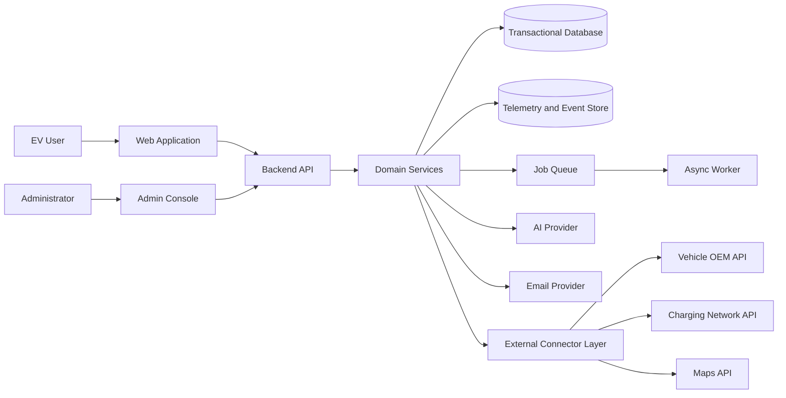
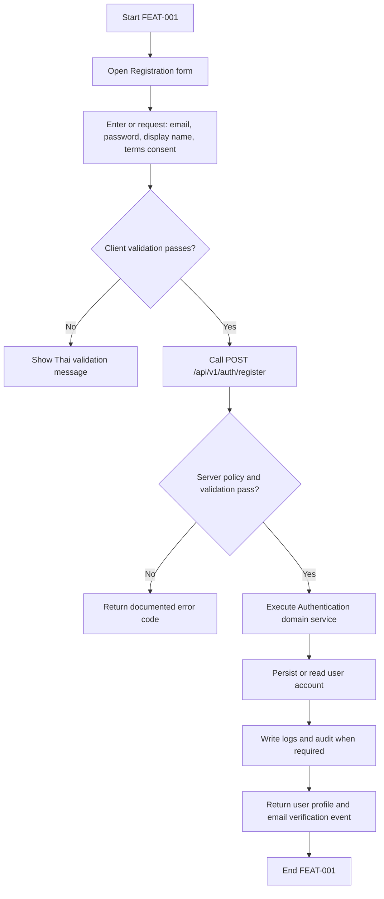
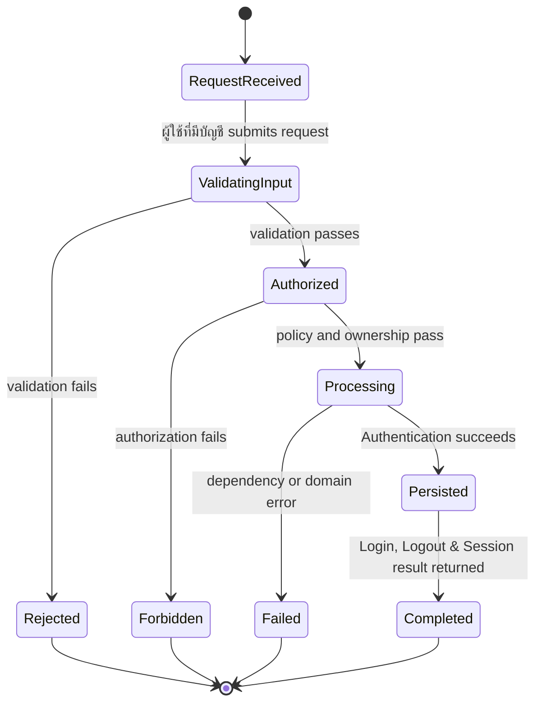
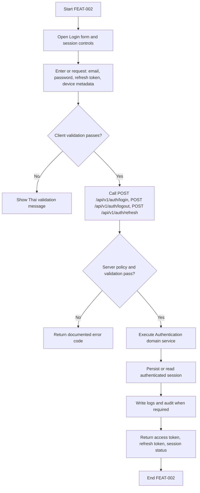
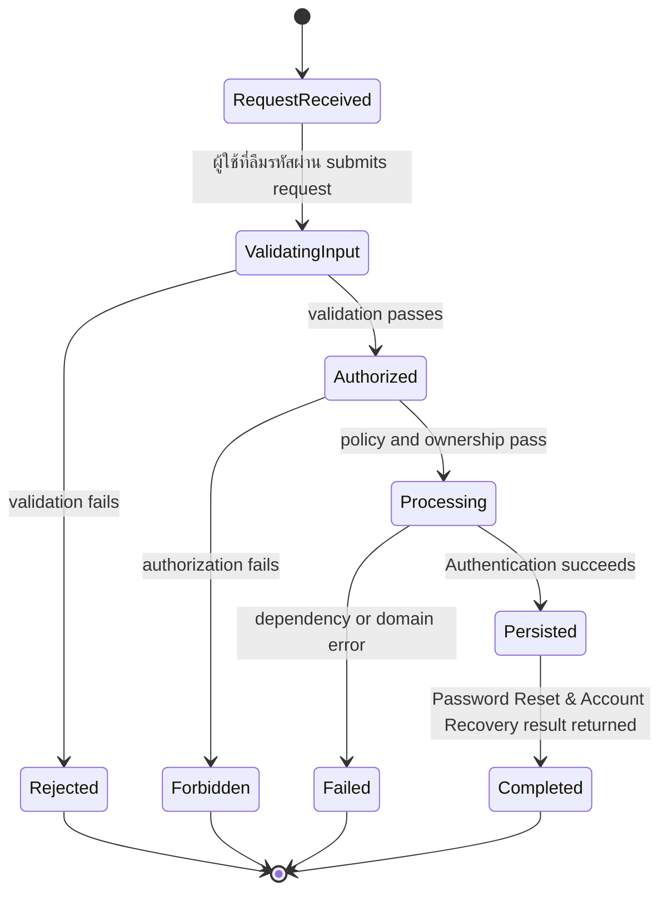
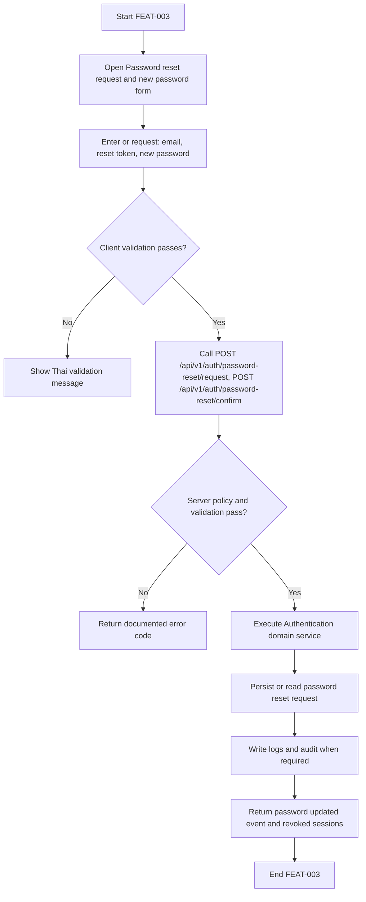
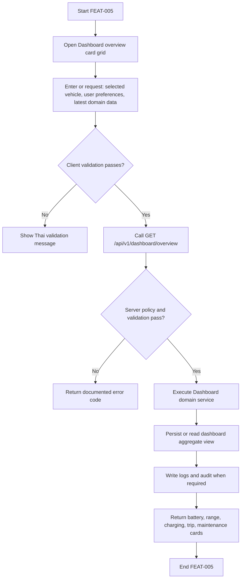
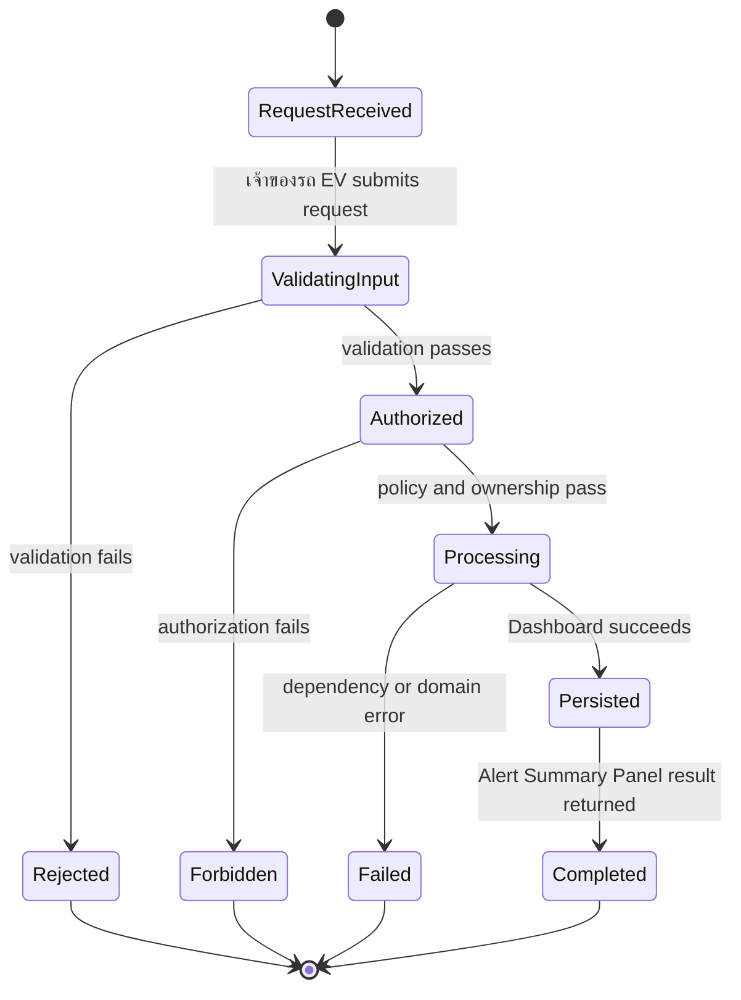
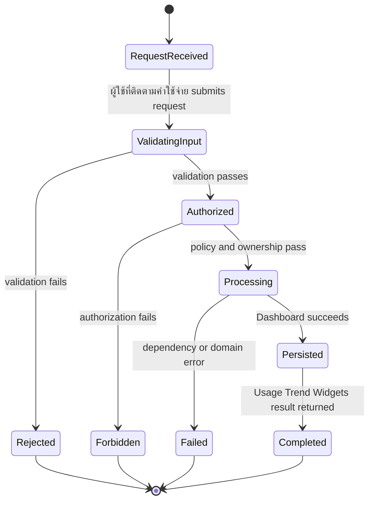

# EV-JARVIS Software Requirements Specification (SRS)

> **Document ID:** DOC-004  
> **Version:** 1.0.0  
> **Status:** Draft  
> **Project:** EV-JARVIS  
> **Author:** Product Team  
> **Last Updated:** 2026-08-02  
> **Reference Document:** docs/02_Requirements/03_PRD.md  
> **Standard:** IEEE 29148-aligned Software Requirements Specification  
> **Language:** Thai with English technical terms

---

# 1. Introduction

## 1.1 Purpose

เอกสาร SRS นี้ระบุข้อกำหนดเชิงระบบของ EV-JARVIS ในระดับที่ทีมวิศวกรรมสามารถนำไปออกแบบ API, database schema, UI behavior, automated tests, logging, security control และ deployment readiness ได้ทันที โดยอ้างอิง feature scope จาก `docs/02_Requirements/03_PRD.md` และไม่ทำซ้ำส่วน business narrative ของ PRD

## 1.2 IEEE 29148 Alignment

| IEEE 29148 Area | Coverage in This SRS |
|---|---|
| System context | Section 2 ระบุ actors, boundaries, dependencies และ interface context |
| Functional requirements | Section 5 แยก `FR-*` ต่อ feature |
| Quality requirements | Section 5 แยก `NFR-*`, `PERF-*`, `SEC-*`, `LOG-*` ต่อ feature |
| Interface requirements | Section 5 แยก `UI-*` และ `API-*` ต่อ feature |
| Data requirements | Section 5 แยก `DB-*` ต่อ feature |
| Verification requirements | Section 5 แยก `TEST-*` ต่อ feature |
| Traceability | ทุก feature section ระบุ `Epic`, `Feature`, `User Story` และ requirement IDs |

## 1.3 Requirement ID Convention

| Prefix | Meaning | Scope |
|---|---|---|
| FR | Functional Requirement | พฤติกรรมที่ระบบต้องทำให้สำเร็จ |
| NFR | Non-functional Requirement | คุณภาพระบบ เช่น availability, reliability, maintainability |
| BR | Business Rule | กติกาธุรกิจที่ต้อง enforce |
| CON | Constraint | ข้อจำกัดด้าน scope, technology, policy หรือ operation |
| UI | User Interface / External Interface | พฤติกรรมหน้าจอและ contract ระหว่างผู้ใช้กับระบบ |
| DB | Database Requirement | entity, table, persistence, migration และ integrity |
| API | API Requirement | endpoint, method, request, response และ status code |
| SEC | Security Requirement | authentication, authorization, privacy, encryption และ secret handling |
| PERF | Performance Requirement | latency, throughput, timeout และ responsiveness |
| LOG | Logging Requirement | audit, structured log, observability และ redaction |
| VAL | Validation Requirement | input validation, domain validation และ data normalization |
| ERR | Error Handling Requirement | error code, retry behavior, fallback และ user-safe message |
| STATE | State Transition Requirement | สถานะที่อนุญาตและ transition ที่ถูกต้อง |
| TEST | Test Requirement | unit, integration, E2E, security, performance หรือ UAT coverage |

## 1.4 Priority Definition

| Priority | Definition | Engineering Expectation |
|---|---|---|
| P0 | Required for MVP and production readiness | ต้อง implement, test และผ่าน release gate ใน Version 1.0 |
| P1 | Important for reliable product operation | ควร implement ใน Version 1.0 หรือ 1.1 ตาม dependency |
| P2 | Valuable extension | ทำเมื่อ core flow พร้อมและไม่เพิ่ม risk ต่อ release |

## 1.5 Risk Definition

| Risk Level | Meaning | Required Treatment |
|---|---|---|
| Critical | กระทบ security, privacy, safety หรือ production availability โดยตรง | ต้องมี mitigation, automated test และ owner sign-off |
| High | กระทบ workflow หลักหรือข้อมูลสำคัญของผู้ใช้ | ต้องมี validation, monitoring และ regression test |
| Medium | กระทบ usability, accuracy หรือ operational support | ต้องมี clear error state และ test coverage ตาม risk |
| Low | กระทบเล็กน้อยและมี workaround | ต้องมี logging และ backlog follow-up เมื่อจำเป็น |

---

# 2. System Context

## 2.1 System Boundary

EV-JARVIS ประกอบด้วย client application, backend API, domain services, database, telemetry store, job worker, notification provider, integration connectors และ AI provider ระบบไม่ทำ direct vehicle control และไม่ทำ payment processing ใน scope ของ SRS version นี้



## 2.2 Principal Actors

| Actor | Technical Access | Primary System Concern |
|---|---|---|
| EV User | Authenticated user role | จัดการรถ ข้อมูลการชาร์จ ทริป การแจ้งเตือน AI และ privacy |
| Administrator | Admin role with elevated permissions | จัดการผู้ใช้ ตรวจระบบ audit และ reference data |
| Support Operator | Restricted support role | ช่วยตรวจสถานะโดยไม่เห็น secret หรือข้อมูลเกินจำเป็น |
| Async Worker | Service identity | ประมวลผล sync, notification, export และ analytics job |
| External Provider | OAuth or API-key mediated service | ส่งข้อมูลรถ สถานีชาร์จ แผนที่ email หรือ AI response |

## 2.3 Common API Response Contract

| Field | Requirement |
|---|---|
| `requestId` | ต้องปรากฏในทุก response และตรงกับ structured log |
| `data` | ใช้เมื่อ request สำเร็จและไม่มี error |
| `error.code` | ใช้ stable machine-readable code เมื่อเกิด error |
| `error.message` | ใช้ข้อความที่ปลอดภัยต่อผู้ใช้ ไม่เปิดเผย stack trace หรือ secret |
| `meta` | ใช้สำหรับ pagination, partial data, source timestamp และ schema version |

## 2.4 Cross-cutting Requirements

| Area | Requirement |
|---|---|
| Authentication | ทุก protected API ต้องตรวจ access token หรือ service identity |
| Authorization | ทุก object-level operation ต้องตรวจ owner หรือ role permission |
| Privacy | AI context และ export ต้องใช้ข้อมูลเฉพาะที่ผู้ใช้มีสิทธิ์และ consent อนุญาต |
| Observability | ทุก API ต้องสร้าง request log พร้อม requestId, actorId เมื่อมี, latency, status และ error code |
| Data Integrity | การแก้ไขข้อมูลสำคัญต้องใช้ transaction หรือ idempotency ตามความเหมาะสม |
| Localization | UI และ user-facing error ต้องรองรับภาษาไทยเป็น baseline |

---

# 3. External Interface Requirements

| Interface ID | Interface | Requirement | Related Prefix |
|---|---|---|---|
| EXT-UI-001 | Web Application | ต้องรองรับ responsive layout, keyboard navigation และ Thai text rendering | UI |
| EXT-API-001 | Backend REST API | ต้องใช้ versioned path `/api/v1` และ response contract เดียวกัน | API |
| EXT-AI-001 | AI Provider | ต้องผ่าน AI Orchestrator, consent check, context filtering และ guardrail evaluation | SEC, API |
| EXT-EMAIL-001 | Email Provider | ต้องรองรับ transactional email และ delivery failure callback หรือ polling | API, LOG |
| EXT-OEM-001 | Vehicle OEM API | ต้องเชื่อมผ่าน connector layer และรองรับ provider failure isolation | API, SEC |
| EXT-CHARGE-001 | Charging Network API | ต้อง normalize station, tariff และ availability data ก่อนใช้ใน domain | API, DB |
| EXT-MAPS-001 | Maps API | ต้องใช้เฉพาะ route planning และลดการเก็บ location ที่ไม่จำเป็น | API, SEC |

---

# 4. Data Classification

| Classification | Data Examples | Handling Requirement |
|---|---|---|
| Public | reference data ที่ไม่มีข้อมูลผู้ใช้ | cache ได้ตาม policy และไม่ต้อง encrypt แยกเฉพาะรายการ |
| Internal | service status, provider status, non-sensitive metrics | จำกัดเฉพาะ admin และ operator ที่ได้รับสิทธิ์ |
| Personal | email, display name, preferences, vehicle ownership metadata | ต้องเข้าถึงตาม owner หรือ role และบันทึก audit เมื่อ sensitive |
| Sensitive Personal | location, trip route, connected service token, AI context | ต้องใช้ encryption, redaction, consent enforcement และ least privilege |
| Security Secret | API key, refresh token, provider token | ต้องเก็บใน vault หรือ encrypted store และห้าม log ทุกกรณี |

---

# 5. Feature-Level Software Requirements

## FEAT-001 User Registration

- **Module:** Authentication
- **Traceability:** EPIC-001 -> FEAT-001 -> US-001
- **Primary Actor:** ผู้ใช้ใหม่
- **Primary Technical Object:** user account
- **Primary API Surface:** POST /api/v1/auth/register

### Requirement Details

| Requirement ID | Type | Description | Priority | Acceptance Criteria | Dependencies | Risk | Target |
|---|---|---|---|---|---|---|---|
| FR-001 | Functional Requirement | ระบบต้องให้ผู้ใช้ใหม่สามารถสมัครสมาชิกด้วย email และ password โดยประมวลผลข้อมูล email, password, display name, terms consent และสร้างผลลัพธ์ user profile and email verification event ภายใต้ module Authentication | P0 | workflow สำเร็จจาก UI ถึง database; response ตรง API contract; state เปลี่ยนตาม STATE-001 | Email Provider, User DB | ข้อมูลบัญชีซ้ำ การโจมตี credential stuffing หรือ email verification ไม่สำเร็จ | บัญชีถูกสร้างและ verification email ถูก queue ภายใน 30 วินาที |
| NFR-001 | Non-functional Requirement | feature User Registration ต้องทำงานได้อย่างเสถียร รองรับ retry ที่เหมาะสม และไม่ทำให้ module อื่นล้มเหลวเมื่อ dependency บางส่วนไม่พร้อม | P0 | ระบบยังตอบ user-safe error ได้เมื่อ dependency ล้มเหลว; ไม่มี unhandled exception; health metric แสดงผลกระทบได้ | Email Provider, User DB | ข้อมูลบัญชีซ้ำ การโจมตี credential stuffing หรือ email verification ไม่สำเร็จ | availability ของ flow สำคัญ >= 99.0% ในช่วง pilot |
| BR-001 | Business Rule | กฎธุรกิจของ User Registration ต้องบังคับใช้ ownership, allowed action, allowed status และ policy เฉพาะ domain ก่อนบันทึกหรือส่ง response | P0 | request ที่ผิด rule ถูก reject; rule ถูกทดสอบด้วย unit test; error code สื่อสาเหตุที่ปลอดภัย | Email Provider, User DB | ข้อมูลบัญชีซ้ำ การโจมตี credential stuffing หรือ email verification ไม่สำเร็จ | business rule coverage >= 90% สำหรับ branch สำคัญ |
| CON-001 | Constraint | implementation ต้องเคารพข้อจำกัดของ MVP, privacy, provider capability และไม่เพิ่ม direct vehicle control หรือ payment behavior ผ่าน feature นี้ | P0 | ไม่มี endpoint หรือ UI control ที่อยู่นอก scope; feature flag ระบุ release ได้; architecture review ผ่าน | Email Provider, User DB | ข้อมูลบัญชีซ้ำ การโจมตี credential stuffing หรือ email verification ไม่สำเร็จ | scope deviation = 0 รายการใน release review |
| UI-001 | Interface Requirement | Registration form ต้องแสดง field, loading state, empty state, success state และ error state เป็นภาษาไทยพร้อม technical hint เมื่อจำเป็น | P0 | ผู้ใช้ทำงานหลักสำเร็จได้; validation message อยู่ใกล้ field; keyboard navigation และ responsive layout ผ่าน QA | Design System, Frontend Routing, Localization | ข้อมูลบัญชีซ้ำ การโจมตี credential stuffing หรือ email verification ไม่สำเร็จ | task completion >= 85% สำหรับ flow หลักของ feature |
| DB-001 | Database Requirement | ระบบต้อง persist หรืออ่านข้อมูลจาก users, user_profiles, email_verifications, audit_logs ด้วย migration ที่ versioned, foreign key หรือ application integrity และ timestamp audit ที่จำเป็น | P0 | schema รองรับ create/read/update ตาม flow; migration rollback ได้; no orphan records จาก operation หลัก | Database, Migration Tool, Backup Policy | ข้อมูลบัญชีซ้ำ การโจมตี credential stuffing หรือ email verification ไม่สำเร็จ | data integrity defect ระดับ High = 0 ก่อน release |
| API-001 | API Requirement | ต้องมี API surface POST /api/v1/auth/register โดยใช้ JSON request/response, /api/v1, requestId และ stable error code | P0 | OpenAPI contract ผ่าน review; integration test ครอบคลุม success และ failure; response ไม่มี field ที่ไม่อนุญาต | Backend API, Auth Middleware, API Gateway | ข้อมูลบัญชีซ้ำ การโจมตี credential stuffing หรือ email verification ไม่สำเร็จ | API breaking change ต้องผ่าน change control ทุกครั้ง |
| SEC-001 | Security Requirement | hash password, rate limit by IP and email, never log password; ทุก request ต้องตรวจ authentication, authorization และ data classification ก่อนตอบกลับ | P0 | unauthorized access ถูกปฏิเสธ; sensitive field ถูก redacted; security test สำหรับ negative case ผ่าน | Security Policy, RBAC, Secrets Management | ข้อมูลบัญชีซ้ำ การโจมตี credential stuffing หรือ email verification ไม่สำเร็จ | critical security finding = 0 ก่อน production |
| PERF-001 | Performance Requirement | P95 response <= 800ms excluding email provider latency; background work ที่ใช้เวลานานต้องส่งต่อ queue หรือใช้ cached aggregate ตาม design | P0 | performance test ผ่าน target; timeout ถูกกำหนด; slow dependency ไม่ block UI เกิน target | Observability, Cache, Queue Worker | ข้อมูลบัญชีซ้ำ การโจมตี credential stuffing หรือ email verification ไม่สำเร็จ | P95 latency เกิน target ต้อง block release สำหรับ P0 |
| LOG-001 | Logging Requirement | ต้องสร้าง structured log สำหรับ request lifecycle, domain event, security-sensitive action และ failure โดยมี requestId, actorId, featureId และ error code | P0 | log ค้นหาได้จาก requestId; ไม่มี password token secret หรือ raw AI sensitive context; audit event ถูกสร้างเมื่อ action สำคัญ | Logging Platform, Audit Log, Redaction Rules | ข้อมูลบัญชีซ้ำ การโจมตี credential stuffing หรือ email verification ไม่สำเร็จ | missing audit log สำหรับ sensitive action ถือเป็น High defect |
| VAL-001 | Validation Requirement | email format, unique email, password policy, consent required; validation ต้องเกิดทั้ง client-side เพื่อ UX และ server-side เพื่อความถูกต้องของข้อมูล | P0 | invalid input ถูก reject ด้วย 4xx; server validation ไม่พึ่ง client; boundary cases มี test | Validation Library, Domain Model | ข้อมูลบัญชีซ้ำ การโจมตี credential stuffing หรือ email verification ไม่สำเร็จ | invalid data เข้าฐานข้อมูล = 0 รายการใน test suite |
| ERR-001 | Error Handling Requirement | error handling ต้องรองรับ 409 EMAIL_ALREADY_EXISTS, 422 PASSWORD_POLICY_FAILED, 503 EMAIL_PROVIDER_UNAVAILABLE พร้อม user-facing message ภาษาไทยและ remediation hint ที่ไม่เปิดเผยข้อมูลลับ | P0 | ทุก documented error มี test; UI แสดง retry หรือ corrective action; server ไม่ส่ง stack trace | API Contract, Localization, Logging | ข้อมูลบัญชีซ้ำ การโจมตี credential stuffing หรือ email verification ไม่สำเร็จ | unknown 5xx จาก flow หลักต้องถูกจัดเป็น release blocker เมื่อเกิดซ้ำ |
| STATE-001 | State Transition Requirement | สถานะของ feature ต้องเป็น Unregistered -> RegistrationSubmitted -> VerificationPending -> Active และระบบต้องป้องกัน transition ที่ผิดลำดับหรือข้าม authorization | P0 | state transition ถูก enforce ใน service layer; invalid transition ได้ 409 หรือ 422; audit log ระบุ from/to เมื่อสำคัญ | Domain Service, Database Transaction | ข้อมูลบัญชีซ้ำ การโจมตี credential stuffing หรือ email verification ไม่สำเร็จ | state corruption ต้องมี migration หรือ repair plan ก่อน release |
| TEST-001 | Test Requirement | ต้องมี unit, integration, API contract, UI flow และ negative security tests สำหรับ User Registration ตาม priority และ risk | P0 | test ครอบคลุม success path, validation failure, authorization failure, dependency failure และ logging assertion ที่สำคัญ | QA Test Plan, CI Pipeline, Test Data Factory | ข้อมูลบัญชีซ้ำ การโจมตี credential stuffing หรือ email verification ไม่สำเร็จ | P0 feature ห้าม release หาก automated tests ไม่ผ่าน 100% |

### State Transition


### Activity Diagram



### Sequence Diagram

```mermaid
sequenceDiagram
    actor Actor as ผู้ใช้ใหม่
    participant UI as Registration form
    participant API as Backend API
    participant Service as Authentication Service
    participant DB as Database
    participant Log as Logging and Audit
    Actor->>UI: Perform User Registration action
    UI->>UI: Client-side validation
    UI->>API: POST /api/v1/auth/register
    API->>API: Authenticate and authorize
    API->>Service: Execute FEAT-001 command or query
    Service->>DB: Read or write user account
    DB-->>Service: Return persisted or queried data
    Service->>Log: Emit structured log for FEAT-001
    Service-->>API: Domain result or typed error
    API-->>UI: JSON response with requestId
    UI-->>Actor: Render success, empty, or error state
```

### Verification Notes

- TEST-001 must be linked to CI and release gate for priority P0.
- QA must verify positive path, negative path, authorization, validation, logging, and state transition for FEAT-001.
- Product acceptance must confirm that the behavior implements US-001 without introducing scope outside PRD reference.

## FEAT-002 Login, Logout & Session

- **Module:** Authentication
- **Traceability:** EPIC-001 -> FEAT-002 -> US-002
- **Primary Actor:** ผู้ใช้ที่มีบัญชี
- **Primary Technical Object:** authenticated session
- **Primary API Surface:** POST /api/v1/auth/login, POST /api/v1/auth/logout, POST /api/v1/auth/refresh

### Requirement Details

| Requirement ID | Type | Description | Priority | Acceptance Criteria | Dependencies | Risk | Target |
|---|---|---|---|---|---|---|---|
| FR-002 | Functional Requirement | ระบบต้องให้ผู้ใช้ที่มีบัญชีสามารถเข้าสู่ระบบ ออกจากระบบ และรักษา session โดยประมวลผลข้อมูล email, password, refresh token, device metadata และสร้างผลลัพธ์ access token, refresh token, session status ภายใต้ module Authentication | P0 | workflow สำเร็จจาก UI ถึง database; response ตรง API contract; state เปลี่ยนตาม STATE-002 | Auth Service, Token Store | session hijacking token replay หรือ logout ไม่ยกเลิก session จริง | login สำเร็จภายใน 2 วินาทีและ refresh token ถูก revoke เมื่อ logout |
| NFR-002 | Non-functional Requirement | feature Login, Logout & Session ต้องทำงานได้อย่างเสถียร รองรับ retry ที่เหมาะสม และไม่ทำให้ module อื่นล้มเหลวเมื่อ dependency บางส่วนไม่พร้อม | P0 | ระบบยังตอบ user-safe error ได้เมื่อ dependency ล้มเหลว; ไม่มี unhandled exception; health metric แสดงผลกระทบได้ | Auth Service, Token Store | session hijacking token replay หรือ logout ไม่ยกเลิก session จริง | availability ของ flow สำคัญ >= 99.0% ในช่วง pilot |
| BR-002 | Business Rule | กฎธุรกิจของ Login, Logout & Session ต้องบังคับใช้ ownership, allowed action, allowed status และ policy เฉพาะ domain ก่อนบันทึกหรือส่ง response | P0 | request ที่ผิด rule ถูก reject; rule ถูกทดสอบด้วย unit test; error code สื่อสาเหตุที่ปลอดภัย | Auth Service, Token Store | session hijacking token replay หรือ logout ไม่ยกเลิก session จริง | business rule coverage >= 90% สำหรับ branch สำคัญ |
| CON-002 | Constraint | implementation ต้องเคารพข้อจำกัดของ MVP, privacy, provider capability และไม่เพิ่ม direct vehicle control หรือ payment behavior ผ่าน feature นี้ | P0 | ไม่มี endpoint หรือ UI control ที่อยู่นอก scope; feature flag ระบุ release ได้; architecture review ผ่าน | Auth Service, Token Store | session hijacking token replay หรือ logout ไม่ยกเลิก session จริง | scope deviation = 0 รายการใน release review |
| UI-002 | Interface Requirement | Login form and session controls ต้องแสดง field, loading state, empty state, success state และ error state เป็นภาษาไทยพร้อม technical hint เมื่อจำเป็น | P0 | ผู้ใช้ทำงานหลักสำเร็จได้; validation message อยู่ใกล้ field; keyboard navigation และ responsive layout ผ่าน QA | Design System, Frontend Routing, Localization | session hijacking token replay หรือ logout ไม่ยกเลิก session จริง | task completion >= 85% สำหรับ flow หลักของ feature |
| DB-002 | Database Requirement | ระบบต้อง persist หรืออ่านข้อมูลจาก users, auth_sessions, refresh_tokens, audit_logs ด้วย migration ที่ versioned, foreign key หรือ application integrity และ timestamp audit ที่จำเป็น | P0 | schema รองรับ create/read/update ตาม flow; migration rollback ได้; no orphan records จาก operation หลัก | Database, Migration Tool, Backup Policy | session hijacking token replay หรือ logout ไม่ยกเลิก session จริง | data integrity defect ระดับ High = 0 ก่อน release |
| API-002 | API Requirement | ต้องมี API surface POST /api/v1/auth/login, POST /api/v1/auth/logout, POST /api/v1/auth/refresh โดยใช้ JSON request/response, /api/v1, requestId และ stable error code | P0 | OpenAPI contract ผ่าน review; integration test ครอบคลุม success และ failure; response ไม่มี field ที่ไม่อนุญาต | Backend API, Auth Middleware, API Gateway | session hijacking token replay หรือ logout ไม่ยกเลิก session จริง | API breaking change ต้องผ่าน change control ทุกครั้ง |
| SEC-002 | Security Requirement | JWT signing, refresh token rotation, secure cookie or secure storage policy; ทุก request ต้องตรวจ authentication, authorization และ data classification ก่อนตอบกลับ | P0 | unauthorized access ถูกปฏิเสธ; sensitive field ถูก redacted; security test สำหรับ negative case ผ่าน | Security Policy, RBAC, Secrets Management | session hijacking token replay หรือ logout ไม่ยกเลิก session จริง | critical security finding = 0 ก่อน production |
| PERF-002 | Performance Requirement | P95 auth endpoint <= 500ms when database is healthy; background work ที่ใช้เวลานานต้องส่งต่อ queue หรือใช้ cached aggregate ตาม design | P0 | performance test ผ่าน target; timeout ถูกกำหนด; slow dependency ไม่ block UI เกิน target | Observability, Cache, Queue Worker | session hijacking token replay หรือ logout ไม่ยกเลิก session จริง | P95 latency เกิน target ต้อง block release สำหรับ P0 |
| LOG-002 | Logging Requirement | ต้องสร้าง structured log สำหรับ request lifecycle, domain event, security-sensitive action และ failure โดยมี requestId, actorId, featureId และ error code | P0 | log ค้นหาได้จาก requestId; ไม่มี password token secret หรือ raw AI sensitive context; audit event ถูกสร้างเมื่อ action สำคัญ | Logging Platform, Audit Log, Redaction Rules | session hijacking token replay หรือ logout ไม่ยกเลิก session จริง | missing audit log สำหรับ sensitive action ถือเป็น High defect |
| VAL-002 | Validation Requirement | credential required, active account, token signature, token expiry; validation ต้องเกิดทั้ง client-side เพื่อ UX และ server-side เพื่อความถูกต้องของข้อมูล | P0 | invalid input ถูก reject ด้วย 4xx; server validation ไม่พึ่ง client; boundary cases มี test | Validation Library, Domain Model | session hijacking token replay หรือ logout ไม่ยกเลิก session จริง | invalid data เข้าฐานข้อมูล = 0 รายการใน test suite |
| ERR-002 | Error Handling Requirement | error handling ต้องรองรับ 401 INVALID_CREDENTIALS, 403 ACCOUNT_DISABLED, 419 SESSION_EXPIRED พร้อม user-facing message ภาษาไทยและ remediation hint ที่ไม่เปิดเผยข้อมูลลับ | P0 | ทุก documented error มี test; UI แสดง retry หรือ corrective action; server ไม่ส่ง stack trace | API Contract, Localization, Logging | session hijacking token replay หรือ logout ไม่ยกเลิก session จริง | unknown 5xx จาก flow หลักต้องถูกจัดเป็น release blocker เมื่อเกิดซ้ำ |
| STATE-002 | State Transition Requirement | สถานะของ feature ต้องเป็น LoggedOut -> Authenticating -> Authenticated -> Refreshing -> LoggedOut และระบบต้องป้องกัน transition ที่ผิดลำดับหรือข้าม authorization | P0 | state transition ถูก enforce ใน service layer; invalid transition ได้ 409 หรือ 422; audit log ระบุ from/to เมื่อสำคัญ | Domain Service, Database Transaction | session hijacking token replay หรือ logout ไม่ยกเลิก session จริง | state corruption ต้องมี migration หรือ repair plan ก่อน release |
| TEST-002 | Test Requirement | ต้องมี unit, integration, API contract, UI flow และ negative security tests สำหรับ Login, Logout & Session ตาม priority และ risk | P0 | test ครอบคลุม success path, validation failure, authorization failure, dependency failure และ logging assertion ที่สำคัญ | QA Test Plan, CI Pipeline, Test Data Factory | session hijacking token replay หรือ logout ไม่ยกเลิก session จริง | P0 feature ห้าม release หาก automated tests ไม่ผ่าน 100% |

### State Transition



### Activity Diagram



### Sequence Diagram

```mermaid
sequenceDiagram
    actor Actor as ผู้ใช้ที่มีบัญชี
    participant UI as Login form and session controls
    participant API as Backend API
    participant Service as Authentication Service
    participant DB as Database
    participant Log as Logging and Audit
    Actor->>UI: Perform Login, Logout & Session action
    UI->>UI: Client-side validation
    UI->>API: POST /api/v1/auth/login, POST /api/v1/auth/logout, POST /api/v1/auth/refresh
    API->>API: Authenticate and authorize
    API->>Service: Execute FEAT-002 command or query
    Service->>DB: Read or write authenticated session
    DB-->>Service: Return persisted or queried data
    Service->>Log: Emit structured log for FEAT-002
    Service-->>API: Domain result or typed error
    API-->>UI: JSON response with requestId
    UI-->>Actor: Render success, empty, or error state
```

### Verification Notes

- TEST-002 must be linked to CI and release gate for priority P0.
- QA must verify positive path, negative path, authorization, validation, logging, and state transition for FEAT-002.
- Product acceptance must confirm that the behavior implements US-002 without introducing scope outside PRD reference.

## FEAT-003 Password Reset & Account Recovery

- **Module:** Authentication
- **Traceability:** EPIC-001 -> FEAT-003 -> US-003
- **Primary Actor:** ผู้ใช้ที่ลืมรหัสผ่าน
- **Primary Technical Object:** password reset request
- **Primary API Surface:** POST /api/v1/auth/password-reset/request, POST /api/v1/auth/password-reset/confirm

### Requirement Details

| Requirement ID | Type | Description | Priority | Acceptance Criteria | Dependencies | Risk | Target |
|---|---|---|---|---|---|---|---|
| FR-003 | Functional Requirement | ระบบต้องให้ผู้ใช้ที่ลืมรหัสผ่านสามารถรีเซ็ตรหัสผ่านผ่าน email token โดยประมวลผลข้อมูล email, reset token, new password และสร้างผลลัพธ์ password updated event and revoked sessions ภายใต้ module Authentication | P0 | workflow สำเร็จจาก UI ถึง database; response ตรง API contract; state เปลี่ยนตาม STATE-003 | Email Provider, Security Policy | token ถูกเดาได้ reset link รั่ว หรือ session เก่ายังใช้งานได้ | reset token อายุไม่เกิน 30 นาทีและ session เดิมถูก revoke หลังเปลี่ยนรหัสผ่าน |
| NFR-003 | Non-functional Requirement | feature Password Reset & Account Recovery ต้องทำงานได้อย่างเสถียร รองรับ retry ที่เหมาะสม และไม่ทำให้ module อื่นล้มเหลวเมื่อ dependency บางส่วนไม่พร้อม | P0 | ระบบยังตอบ user-safe error ได้เมื่อ dependency ล้มเหลว; ไม่มี unhandled exception; health metric แสดงผลกระทบได้ | Email Provider, Security Policy | token ถูกเดาได้ reset link รั่ว หรือ session เก่ายังใช้งานได้ | availability ของ flow สำคัญ >= 99.0% ในช่วง pilot |
| BR-003 | Business Rule | กฎธุรกิจของ Password Reset & Account Recovery ต้องบังคับใช้ ownership, allowed action, allowed status และ policy เฉพาะ domain ก่อนบันทึกหรือส่ง response | P0 | request ที่ผิด rule ถูก reject; rule ถูกทดสอบด้วย unit test; error code สื่อสาเหตุที่ปลอดภัย | Email Provider, Security Policy | token ถูกเดาได้ reset link รั่ว หรือ session เก่ายังใช้งานได้ | business rule coverage >= 90% สำหรับ branch สำคัญ |
| CON-003 | Constraint | implementation ต้องเคารพข้อจำกัดของ MVP, privacy, provider capability และไม่เพิ่ม direct vehicle control หรือ payment behavior ผ่าน feature นี้ | P0 | ไม่มี endpoint หรือ UI control ที่อยู่นอก scope; feature flag ระบุ release ได้; architecture review ผ่าน | Email Provider, Security Policy | token ถูกเดาได้ reset link รั่ว หรือ session เก่ายังใช้งานได้ | scope deviation = 0 รายการใน release review |
| UI-003 | Interface Requirement | Password reset request and new password form ต้องแสดง field, loading state, empty state, success state และ error state เป็นภาษาไทยพร้อม technical hint เมื่อจำเป็น | P0 | ผู้ใช้ทำงานหลักสำเร็จได้; validation message อยู่ใกล้ field; keyboard navigation และ responsive layout ผ่าน QA | Design System, Frontend Routing, Localization | token ถูกเดาได้ reset link รั่ว หรือ session เก่ายังใช้งานได้ | task completion >= 85% สำหรับ flow หลักของ feature |
| DB-003 | Database Requirement | ระบบต้อง persist หรืออ่านข้อมูลจาก password_reset_tokens, users, auth_sessions, audit_logs ด้วย migration ที่ versioned, foreign key หรือ application integrity และ timestamp audit ที่จำเป็น | P0 | schema รองรับ create/read/update ตาม flow; migration rollback ได้; no orphan records จาก operation หลัก | Database, Migration Tool, Backup Policy | token ถูกเดาได้ reset link รั่ว หรือ session เก่ายังใช้งานได้ | data integrity defect ระดับ High = 0 ก่อน release |
| API-003 | API Requirement | ต้องมี API surface POST /api/v1/auth/password-reset/request, POST /api/v1/auth/password-reset/confirm โดยใช้ JSON request/response, /api/v1, requestId และ stable error code | P0 | OpenAPI contract ผ่าน review; integration test ครอบคลุม success และ failure; response ไม่มี field ที่ไม่อนุญาต | Backend API, Auth Middleware, API Gateway | token ถูกเดาได้ reset link รั่ว หรือ session เก่ายังใช้งานได้ | API breaking change ต้องผ่าน change control ทุกครั้ง |
| SEC-003 | Security Requirement | store token hash only, mask account existence, revoke active sessions; ทุก request ต้องตรวจ authentication, authorization และ data classification ก่อนตอบกลับ | P0 | unauthorized access ถูกปฏิเสธ; sensitive field ถูก redacted; security test สำหรับ negative case ผ่าน | Security Policy, RBAC, Secrets Management | token ถูกเดาได้ reset link รั่ว หรือ session เก่ายังใช้งานได้ | critical security finding = 0 ก่อน production |
| PERF-003 | Performance Requirement | P95 reset confirm <= 800ms excluding email provider latency; background work ที่ใช้เวลานานต้องส่งต่อ queue หรือใช้ cached aggregate ตาม design | P0 | performance test ผ่าน target; timeout ถูกกำหนด; slow dependency ไม่ block UI เกิน target | Observability, Cache, Queue Worker | token ถูกเดาได้ reset link รั่ว หรือ session เก่ายังใช้งานได้ | P95 latency เกิน target ต้อง block release สำหรับ P0 |
| LOG-003 | Logging Requirement | ต้องสร้าง structured log สำหรับ request lifecycle, domain event, security-sensitive action และ failure โดยมี requestId, actorId, featureId และ error code | P0 | log ค้นหาได้จาก requestId; ไม่มี password token secret หรือ raw AI sensitive context; audit event ถูกสร้างเมื่อ action สำคัญ | Logging Platform, Audit Log, Redaction Rules | token ถูกเดาได้ reset link รั่ว หรือ session เก่ายังใช้งานได้ | missing audit log สำหรับ sensitive action ถือเป็น High defect |
| VAL-003 | Validation Requirement | token hash match, token not expired, password policy, single-use token; validation ต้องเกิดทั้ง client-side เพื่อ UX และ server-side เพื่อความถูกต้องของข้อมูล | P0 | invalid input ถูก reject ด้วย 4xx; server validation ไม่พึ่ง client; boundary cases มี test | Validation Library, Domain Model | token ถูกเดาได้ reset link รั่ว หรือ session เก่ายังใช้งานได้ | invalid data เข้าฐานข้อมูล = 0 รายการใน test suite |
| ERR-003 | Error Handling Requirement | error handling ต้องรองรับ 404 ACCOUNT_NOT_FOUND_MASKED, 410 RESET_TOKEN_EXPIRED, 422 PASSWORD_POLICY_FAILED พร้อม user-facing message ภาษาไทยและ remediation hint ที่ไม่เปิดเผยข้อมูลลับ | P0 | ทุก documented error มี test; UI แสดง retry หรือ corrective action; server ไม่ส่ง stack trace | API Contract, Localization, Logging | token ถูกเดาได้ reset link รั่ว หรือ session เก่ายังใช้งานได้ | unknown 5xx จาก flow หลักต้องถูกจัดเป็น release blocker เมื่อเกิดซ้ำ |
| STATE-003 | State Transition Requirement | สถานะของ feature ต้องเป็น Active -> ResetRequested -> TokenIssued -> PasswordUpdated -> SessionsRevoked และระบบต้องป้องกัน transition ที่ผิดลำดับหรือข้าม authorization | P0 | state transition ถูก enforce ใน service layer; invalid transition ได้ 409 หรือ 422; audit log ระบุ from/to เมื่อสำคัญ | Domain Service, Database Transaction | token ถูกเดาได้ reset link รั่ว หรือ session เก่ายังใช้งานได้ | state corruption ต้องมี migration หรือ repair plan ก่อน release |
| TEST-003 | Test Requirement | ต้องมี unit, integration, API contract, UI flow และ negative security tests สำหรับ Password Reset & Account Recovery ตาม priority และ risk | P0 | test ครอบคลุม success path, validation failure, authorization failure, dependency failure และ logging assertion ที่สำคัญ | QA Test Plan, CI Pipeline, Test Data Factory | token ถูกเดาได้ reset link รั่ว หรือ session เก่ายังใช้งานได้ | P0 feature ห้าม release หาก automated tests ไม่ผ่าน 100% |

### State Transition



### Activity Diagram



### Sequence Diagram

```mermaid
sequenceDiagram
    actor Actor as ผู้ใช้ที่ลืมรหัสผ่าน
    participant UI as Password reset request and new password form
    participant API as Backend API
    participant Service as Authentication Service
    participant DB as Database
    participant Log as Logging and Audit
    Actor->>UI: Perform Password Reset & Account Recovery action
    UI->>UI: Client-side validation
    UI->>API: POST /api/v1/auth/password-reset/request, POST /api/v1/auth/password-reset/confirm
    API->>API: Authenticate and authorize
    API->>Service: Execute FEAT-003 command or query
    Service->>DB: Read or write password reset request
    DB-->>Service: Return persisted or queried data
    Service->>Log: Emit structured log for FEAT-003
    Service-->>API: Domain result or typed error
    API-->>UI: JSON response with requestId
    UI-->>Actor: Render success, empty, or error state
```

### Verification Notes

- TEST-003 must be linked to CI and release gate for priority P0.
- QA must verify positive path, negative path, authorization, validation, logging, and state transition for FEAT-003.
- Product acceptance must confirm that the behavior implements US-003 without introducing scope outside PRD reference.

## FEAT-004 Role-Based Access Control

- **Module:** Authentication
- **Traceability:** EPIC-001 -> FEAT-004 -> US-004
- **Primary Actor:** Admin
- **Primary Technical Object:** role assignment
- **Primary API Surface:** GET /api/v1/admin/users/{id}/roles, PATCH /api/v1/admin/users/{id}/roles

### Requirement Details

| Requirement ID | Type | Description | Priority | Acceptance Criteria | Dependencies | Risk | Target |
|---|---|---|---|---|---|---|---|
| FR-004 | Functional Requirement | ระบบต้องให้Adminสามารถกำหนดและตรวจ role ของผู้ใช้ โดยประมวลผลข้อมูล actor role, target user, requested role change และสร้างผลลัพธ์ authorized access decision and audit record ภายใต้ module Authentication | P0 | workflow สำเร็จจาก UI ถึง database; response ตรง API contract; state เปลี่ยนตาม STATE-004 | Auth Service, Admin Module | privilege escalation หรือ API สำคัญไม่ตรวจ object-level authorization | ทุก protected endpoint ตรวจ role และ owner ภายใน middleware เดียวกัน |
| NFR-004 | Non-functional Requirement | feature Role-Based Access Control ต้องทำงานได้อย่างเสถียร รองรับ retry ที่เหมาะสม และไม่ทำให้ module อื่นล้มเหลวเมื่อ dependency บางส่วนไม่พร้อม | P0 | ระบบยังตอบ user-safe error ได้เมื่อ dependency ล้มเหลว; ไม่มี unhandled exception; health metric แสดงผลกระทบได้ | Auth Service, Admin Module | privilege escalation หรือ API สำคัญไม่ตรวจ object-level authorization | availability ของ flow สำคัญ >= 99.0% ในช่วง pilot |
| BR-004 | Business Rule | กฎธุรกิจของ Role-Based Access Control ต้องบังคับใช้ ownership, allowed action, allowed status และ policy เฉพาะ domain ก่อนบันทึกหรือส่ง response | P0 | request ที่ผิด rule ถูก reject; rule ถูกทดสอบด้วย unit test; error code สื่อสาเหตุที่ปลอดภัย | Auth Service, Admin Module | privilege escalation หรือ API สำคัญไม่ตรวจ object-level authorization | business rule coverage >= 90% สำหรับ branch สำคัญ |
| CON-004 | Constraint | implementation ต้องเคารพข้อจำกัดของ MVP, privacy, provider capability และไม่เพิ่ม direct vehicle control หรือ payment behavior ผ่าน feature นี้ | P0 | ไม่มี endpoint หรือ UI control ที่อยู่นอก scope; feature flag ระบุ release ได้; architecture review ผ่าน | Auth Service, Admin Module | privilege escalation หรือ API สำคัญไม่ตรวจ object-level authorization | scope deviation = 0 รายการใน release review |
| UI-004 | Interface Requirement | Admin role management controls ต้องแสดง field, loading state, empty state, success state และ error state เป็นภาษาไทยพร้อม technical hint เมื่อจำเป็น | P0 | ผู้ใช้ทำงานหลักสำเร็จได้; validation message อยู่ใกล้ field; keyboard navigation และ responsive layout ผ่าน QA | Design System, Frontend Routing, Localization | privilege escalation หรือ API สำคัญไม่ตรวจ object-level authorization | task completion >= 85% สำหรับ flow หลักของ feature |
| DB-004 | Database Requirement | ระบบต้อง persist หรืออ่านข้อมูลจาก roles, user_roles, permissions, audit_logs ด้วย migration ที่ versioned, foreign key หรือ application integrity และ timestamp audit ที่จำเป็น | P0 | schema รองรับ create/read/update ตาม flow; migration rollback ได้; no orphan records จาก operation หลัก | Database, Migration Tool, Backup Policy | privilege escalation หรือ API สำคัญไม่ตรวจ object-level authorization | data integrity defect ระดับ High = 0 ก่อน release |
| API-004 | API Requirement | ต้องมี API surface GET /api/v1/admin/users/{id}/roles, PATCH /api/v1/admin/users/{id}/roles โดยใช้ JSON request/response, /api/v1, requestId และ stable error code | P0 | OpenAPI contract ผ่าน review; integration test ครอบคลุม success และ failure; response ไม่มี field ที่ไม่อนุญาต | Backend API, Auth Middleware, API Gateway | privilege escalation หรือ API สำคัญไม่ตรวจ object-level authorization | API breaking change ต้องผ่าน change control ทุกครั้ง |
| SEC-004 | Security Requirement | least privilege, admin action audit, deny by default; ทุก request ต้องตรวจ authentication, authorization และ data classification ก่อนตอบกลับ | P0 | unauthorized access ถูกปฏิเสธ; sensitive field ถูก redacted; security test สำหรับ negative case ผ่าน | Security Policy, RBAC, Secrets Management | privilege escalation หรือ API สำคัญไม่ตรวจ object-level authorization | critical security finding = 0 ก่อน production |
| PERF-004 | Performance Requirement | authorization decision <= 50ms from cached permission set; background work ที่ใช้เวลานานต้องส่งต่อ queue หรือใช้ cached aggregate ตาม design | P0 | performance test ผ่าน target; timeout ถูกกำหนด; slow dependency ไม่ block UI เกิน target | Observability, Cache, Queue Worker | privilege escalation หรือ API สำคัญไม่ตรวจ object-level authorization | P95 latency เกิน target ต้อง block release สำหรับ P0 |
| LOG-004 | Logging Requirement | ต้องสร้าง structured log สำหรับ request lifecycle, domain event, security-sensitive action และ failure โดยมี requestId, actorId, featureId และ error code | P0 | log ค้นหาได้จาก requestId; ไม่มี password token secret หรือ raw AI sensitive context; audit event ถูกสร้างเมื่อ action สำคัญ | Logging Platform, Audit Log, Redaction Rules | privilege escalation หรือ API สำคัญไม่ตรวจ object-level authorization | missing audit log สำหรับ sensitive action ถือเป็น High defect |
| VAL-004 | Validation Requirement | role exists, actor has grant permission, target user active; validation ต้องเกิดทั้ง client-side เพื่อ UX และ server-side เพื่อความถูกต้องของข้อมูล | P0 | invalid input ถูก reject ด้วย 4xx; server validation ไม่พึ่ง client; boundary cases มี test | Validation Library, Domain Model | privilege escalation หรือ API สำคัญไม่ตรวจ object-level authorization | invalid data เข้าฐานข้อมูล = 0 รายการใน test suite |
| ERR-004 | Error Handling Requirement | error handling ต้องรองรับ 403 ROLE_CHANGE_FORBIDDEN, 404 USER_NOT_FOUND, 409 ROLE_CONFLICT พร้อม user-facing message ภาษาไทยและ remediation hint ที่ไม่เปิดเผยข้อมูลลับ | P0 | ทุก documented error มี test; UI แสดง retry หรือ corrective action; server ไม่ส่ง stack trace | API Contract, Localization, Logging | privilege escalation หรือ API สำคัญไม่ตรวจ object-level authorization | unknown 5xx จาก flow หลักต้องถูกจัดเป็น release blocker เมื่อเกิดซ้ำ |
| STATE-004 | State Transition Requirement | สถานะของ feature ต้องเป็น RoleUnassigned -> RoleRequested -> RoleValidated -> RoleAssigned -> RoleRevoked และระบบต้องป้องกัน transition ที่ผิดลำดับหรือข้าม authorization | P0 | state transition ถูก enforce ใน service layer; invalid transition ได้ 409 หรือ 422; audit log ระบุ from/to เมื่อสำคัญ | Domain Service, Database Transaction | privilege escalation หรือ API สำคัญไม่ตรวจ object-level authorization | state corruption ต้องมี migration หรือ repair plan ก่อน release |
| TEST-004 | Test Requirement | ต้องมี unit, integration, API contract, UI flow และ negative security tests สำหรับ Role-Based Access Control ตาม priority และ risk | P0 | test ครอบคลุม success path, validation failure, authorization failure, dependency failure และ logging assertion ที่สำคัญ | QA Test Plan, CI Pipeline, Test Data Factory | privilege escalation หรือ API สำคัญไม่ตรวจ object-level authorization | P0 feature ห้าม release หาก automated tests ไม่ผ่าน 100% |

### State Transition


### Activity Diagram

```mermaid
flowchart TD
    A[Start FEAT-004] --> B[Open Admin role management controls]
    B --> C[Enter or request: actor role, target user, requested role change]
    C --> D{Client validation passes?}
    D -- No --> E[Show Thai validation message]
    D -- Yes --> F[Call GET /api/v1/admin/users/{id}/roles, PATCH /api/v1/admin/users/{id}/roles]
    F --> G{Server policy and validation pass?}
    G -- No --> H[Return documented error code]
    G -- Yes --> I[Execute Authentication domain service]
    I --> J[Persist or read role assignment]
    J --> K[Write logs and audit when required]
    K --> L[Return authorized access decision and audit record]
    L --> M[End FEAT-004]
```

### Sequence Diagram

```mermaid
sequenceDiagram
    actor Actor as Admin
    participant UI as Admin role management controls
    participant API as Backend API
    participant Service as Authentication Service
    participant DB as Database
    participant Log as Logging and Audit
    Actor->>UI: Perform Role-Based Access Control action
    UI->>UI: Client-side validation
    UI->>API: GET /api/v1/admin/users/{id}/roles, PATCH /api/v1/admin/users/{id}/roles
    API->>API: Authenticate and authorize
    API->>Service: Execute FEAT-004 command or query
    Service->>DB: Read or write role assignment
    DB-->>Service: Return persisted or queried data
    Service->>Log: Emit structured log for FEAT-004
    Service-->>API: Domain result or typed error
    API-->>UI: JSON response with requestId
    UI-->>Actor: Render success, empty, or error state
```

### Verification Notes

- TEST-004 must be linked to CI and release gate for priority P0.
- QA must verify positive path, negative path, authorization, validation, logging, and state transition for FEAT-004.
- Product acceptance must confirm that the behavior implements US-004 without introducing scope outside PRD reference.

## FEAT-005 Dashboard Overview Cards

- **Module:** Dashboard
- **Traceability:** EPIC-002 -> FEAT-005 -> US-005
- **Primary Actor:** เจ้าของรถ EV
- **Primary Technical Object:** dashboard aggregate view
- **Primary API Surface:** GET /api/v1/dashboard/overview

### Requirement Details

| Requirement ID | Type | Description | Priority | Acceptance Criteria | Dependencies | Risk | Target |
|---|---|---|---|---|---|---|---|
| FR-005 | Functional Requirement | ระบบต้องให้เจ้าของรถ EVสามารถดู card สถานะรถและข้อมูลสำคัญบน Dashboard โดยประมวลผลข้อมูล selected vehicle, user preferences, latest domain data และสร้างผลลัพธ์ battery, range, charging, trip, maintenance cards ภายใต้ module Dashboard | P0 | workflow สำเร็จจาก UI ถึง database; response ตรง API contract; state เปลี่ยนตาม STATE-005 | Vehicle, Battery, Charging, Trips | ข้อมูลไม่ตรงกันระหว่างโมดูลหรือ card แสดงข้อมูลล้าสมัย | Dashboard card หลักพร้อมใช้งานภายใน 2.5 วินาทีที่ P95 |
| NFR-005 | Non-functional Requirement | feature Dashboard Overview Cards ต้องทำงานได้อย่างเสถียร รองรับ retry ที่เหมาะสม และไม่ทำให้ module อื่นล้มเหลวเมื่อ dependency บางส่วนไม่พร้อม | P0 | ระบบยังตอบ user-safe error ได้เมื่อ dependency ล้มเหลว; ไม่มี unhandled exception; health metric แสดงผลกระทบได้ | Vehicle, Battery, Charging, Trips | ข้อมูลไม่ตรงกันระหว่างโมดูลหรือ card แสดงข้อมูลล้าสมัย | availability ของ flow สำคัญ >= 99.0% ในช่วง pilot |
| BR-005 | Business Rule | กฎธุรกิจของ Dashboard Overview Cards ต้องบังคับใช้ ownership, allowed action, allowed status และ policy เฉพาะ domain ก่อนบันทึกหรือส่ง response | P0 | request ที่ผิด rule ถูก reject; rule ถูกทดสอบด้วย unit test; error code สื่อสาเหตุที่ปลอดภัย | Vehicle, Battery, Charging, Trips | ข้อมูลไม่ตรงกันระหว่างโมดูลหรือ card แสดงข้อมูลล้าสมัย | business rule coverage >= 90% สำหรับ branch สำคัญ |
| CON-005 | Constraint | implementation ต้องเคารพข้อจำกัดของ MVP, privacy, provider capability และไม่เพิ่ม direct vehicle control หรือ payment behavior ผ่าน feature นี้ | P0 | ไม่มี endpoint หรือ UI control ที่อยู่นอก scope; feature flag ระบุ release ได้; architecture review ผ่าน | Vehicle, Battery, Charging, Trips | ข้อมูลไม่ตรงกันระหว่างโมดูลหรือ card แสดงข้อมูลล้าสมัย | scope deviation = 0 รายการใน release review |
| UI-005 | Interface Requirement | Dashboard overview card grid ต้องแสดง field, loading state, empty state, success state และ error state เป็นภาษาไทยพร้อม technical hint เมื่อจำเป็น | P0 | ผู้ใช้ทำงานหลักสำเร็จได้; validation message อยู่ใกล้ field; keyboard navigation และ responsive layout ผ่าน QA | Design System, Frontend Routing, Localization | ข้อมูลไม่ตรงกันระหว่างโมดูลหรือ card แสดงข้อมูลล้าสมัย | task completion >= 85% สำหรับ flow หลักของ feature |
| DB-005 | Database Requirement | ระบบต้อง persist หรืออ่านข้อมูลจาก vehicles, battery_snapshots, charging_sessions, trips, maintenance_schedules ด้วย migration ที่ versioned, foreign key หรือ application integrity และ timestamp audit ที่จำเป็น | P0 | schema รองรับ create/read/update ตาม flow; migration rollback ได้; no orphan records จาก operation หลัก | Database, Migration Tool, Backup Policy | ข้อมูลไม่ตรงกันระหว่างโมดูลหรือ card แสดงข้อมูลล้าสมัย | data integrity defect ระดับ High = 0 ก่อน release |
| API-005 | API Requirement | ต้องมี API surface GET /api/v1/dashboard/overview โดยใช้ JSON request/response, /api/v1, requestId และ stable error code | P0 | OpenAPI contract ผ่าน review; integration test ครอบคลุม success และ failure; response ไม่มี field ที่ไม่อนุญาต | Backend API, Auth Middleware, API Gateway | ข้อมูลไม่ตรงกันระหว่างโมดูลหรือ card แสดงข้อมูลล้าสมัย | API breaking change ต้องผ่าน change control ทุกครั้ง |
| SEC-005 | Security Requirement | object-level authorization for every aggregate source; ทุก request ต้องตรวจ authentication, authorization และ data classification ก่อนตอบกลับ | P0 | unauthorized access ถูกปฏิเสธ; sensitive field ถูก redacted; security test สำหรับ negative case ผ่าน | Security Policy, RBAC, Secrets Management | ข้อมูลไม่ตรงกันระหว่างโมดูลหรือ card แสดงข้อมูลล้าสมัย | critical security finding = 0 ก่อน production |
| PERF-005 | Performance Requirement | P95 dashboard overview <= 2500ms and cached aggregate age <= 5 minutes; background work ที่ใช้เวลานานต้องส่งต่อ queue หรือใช้ cached aggregate ตาม design | P0 | performance test ผ่าน target; timeout ถูกกำหนด; slow dependency ไม่ block UI เกิน target | Observability, Cache, Queue Worker | ข้อมูลไม่ตรงกันระหว่างโมดูลหรือ card แสดงข้อมูลล้าสมัย | P95 latency เกิน target ต้อง block release สำหรับ P0 |
| LOG-005 | Logging Requirement | ต้องสร้าง structured log สำหรับ request lifecycle, domain event, security-sensitive action และ failure โดยมี requestId, actorId, featureId และ error code | P0 | log ค้นหาได้จาก requestId; ไม่มี password token secret หรือ raw AI sensitive context; audit event ถูกสร้างเมื่อ action สำคัญ | Logging Platform, Audit Log, Redaction Rules | ข้อมูลไม่ตรงกันระหว่างโมดูลหรือ card แสดงข้อมูลล้าสมัย | missing audit log สำหรับ sensitive action ถือเป็น High defect |
| VAL-005 | Validation Requirement | vehicle ownership, active vehicle, preference unit conversion; validation ต้องเกิดทั้ง client-side เพื่อ UX และ server-side เพื่อความถูกต้องของข้อมูล | P0 | invalid input ถูก reject ด้วย 4xx; server validation ไม่พึ่ง client; boundary cases มี test | Validation Library, Domain Model | ข้อมูลไม่ตรงกันระหว่างโมดูลหรือ card แสดงข้อมูลล้าสมัย | invalid data เข้าฐานข้อมูล = 0 รายการใน test suite |
| ERR-005 | Error Handling Requirement | error handling ต้องรองรับ 404 VEHICLE_NOT_FOUND, 206 PARTIAL_DASHBOARD_DATA, 503 DASHBOARD_SOURCE_UNAVAILABLE พร้อม user-facing message ภาษาไทยและ remediation hint ที่ไม่เปิดเผยข้อมูลลับ | P0 | ทุก documented error มี test; UI แสดง retry หรือ corrective action; server ไม่ส่ง stack trace | API Contract, Localization, Logging | ข้อมูลไม่ตรงกันระหว่างโมดูลหรือ card แสดงข้อมูลล้าสมัย | unknown 5xx จาก flow หลักต้องถูกจัดเป็น release blocker เมื่อเกิดซ้ำ |
| STATE-005 | State Transition Requirement | สถานะของ feature ต้องเป็น NoVehicle -> LoadingOverview -> OverviewReady -> PartialData -> ErrorState และระบบต้องป้องกัน transition ที่ผิดลำดับหรือข้าม authorization | P0 | state transition ถูก enforce ใน service layer; invalid transition ได้ 409 หรือ 422; audit log ระบุ from/to เมื่อสำคัญ | Domain Service, Database Transaction | ข้อมูลไม่ตรงกันระหว่างโมดูลหรือ card แสดงข้อมูลล้าสมัย | state corruption ต้องมี migration หรือ repair plan ก่อน release |
| TEST-005 | Test Requirement | ต้องมี unit, integration, API contract, UI flow และ negative security tests สำหรับ Dashboard Overview Cards ตาม priority และ risk | P0 | test ครอบคลุม success path, validation failure, authorization failure, dependency failure และ logging assertion ที่สำคัญ | QA Test Plan, CI Pipeline, Test Data Factory | ข้อมูลไม่ตรงกันระหว่างโมดูลหรือ card แสดงข้อมูลล้าสมัย | P0 feature ห้าม release หาก automated tests ไม่ผ่าน 100% |

### State Transition


### Activity Diagram



### Sequence Diagram

```mermaid
sequenceDiagram
    actor Actor as เจ้าของรถ EV
    participant UI as Dashboard overview card grid
    participant API as Backend API
    participant Service as Dashboard Service
    participant DB as Database
    participant Log as Logging and Audit
    Actor->>UI: Perform Dashboard Overview Cards action
    UI->>UI: Client-side validation
    UI->>API: GET /api/v1/dashboard/overview
    API->>API: Authenticate and authorize
    API->>Service: Execute FEAT-005 command or query
    Service->>DB: Read or write dashboard aggregate view
    DB-->>Service: Return persisted or queried data
    Service->>Log: Emit structured log for FEAT-005
    Service-->>API: Domain result or typed error
    API-->>UI: JSON response with requestId
    UI-->>Actor: Render success, empty, or error state
```

### Verification Notes

- TEST-005 must be linked to CI and release gate for priority P0.
- QA must verify positive path, negative path, authorization, validation, logging, and state transition for FEAT-005.
- Product acceptance must confirm that the behavior implements US-005 without introducing scope outside PRD reference.

## FEAT-006 Alert Summary Panel

- **Module:** Dashboard
- **Traceability:** EPIC-002 -> FEAT-006 -> US-006
- **Primary Actor:** เจ้าของรถ EV
- **Primary Technical Object:** alert summary
- **Primary API Surface:** GET /api/v1/dashboard/alerts, PATCH /api/v1/notifications/{id}/read

### Requirement Details

| Requirement ID | Type | Description | Priority | Acceptance Criteria | Dependencies | Risk | Target |
|---|---|---|---|---|---|---|---|
| FR-006 | Functional Requirement | ระบบต้องให้เจ้าของรถ EVสามารถเห็น alert สำคัญและจัดการสถานะการอ่าน โดยประมวลผลข้อมูล notification events, alert severity, read state และสร้างผลลัพธ์ ordered alert panel with unread count ภายใต้ module Dashboard | P0 | workflow สำเร็จจาก UI ถึง database; response ตรง API contract; state เปลี่ยนตาม STATE-006 | Notifications, Battery, Maintenance | alert สำคัญตกหล่นหรือเรียง severity ผิดจนผู้ใช้พลาดเหตุการณ์ | alert ระดับ critical แสดงบน Dashboard ภายใน 60 วินาทีหลัง rule ถูก trigger |
| NFR-006 | Non-functional Requirement | feature Alert Summary Panel ต้องทำงานได้อย่างเสถียร รองรับ retry ที่เหมาะสม และไม่ทำให้ module อื่นล้มเหลวเมื่อ dependency บางส่วนไม่พร้อม | P0 | ระบบยังตอบ user-safe error ได้เมื่อ dependency ล้มเหลว; ไม่มี unhandled exception; health metric แสดงผลกระทบได้ | Notifications, Battery, Maintenance | alert สำคัญตกหล่นหรือเรียง severity ผิดจนผู้ใช้พลาดเหตุการณ์ | availability ของ flow สำคัญ >= 99.0% ในช่วง pilot |
| BR-006 | Business Rule | กฎธุรกิจของ Alert Summary Panel ต้องบังคับใช้ ownership, allowed action, allowed status และ policy เฉพาะ domain ก่อนบันทึกหรือส่ง response | P0 | request ที่ผิด rule ถูก reject; rule ถูกทดสอบด้วย unit test; error code สื่อสาเหตุที่ปลอดภัย | Notifications, Battery, Maintenance | alert สำคัญตกหล่นหรือเรียง severity ผิดจนผู้ใช้พลาดเหตุการณ์ | business rule coverage >= 90% สำหรับ branch สำคัญ |
| CON-006 | Constraint | implementation ต้องเคารพข้อจำกัดของ MVP, privacy, provider capability และไม่เพิ่ม direct vehicle control หรือ payment behavior ผ่าน feature นี้ | P0 | ไม่มี endpoint หรือ UI control ที่อยู่นอก scope; feature flag ระบุ release ได้; architecture review ผ่าน | Notifications, Battery, Maintenance | alert สำคัญตกหล่นหรือเรียง severity ผิดจนผู้ใช้พลาดเหตุการณ์ | scope deviation = 0 รายการใน release review |
| UI-006 | Interface Requirement | Dashboard alert panel ต้องแสดง field, loading state, empty state, success state และ error state เป็นภาษาไทยพร้อม technical hint เมื่อจำเป็น | P0 | ผู้ใช้ทำงานหลักสำเร็จได้; validation message อยู่ใกล้ field; keyboard navigation และ responsive layout ผ่าน QA | Design System, Frontend Routing, Localization | alert สำคัญตกหล่นหรือเรียง severity ผิดจนผู้ใช้พลาดเหตุการณ์ | task completion >= 85% สำหรับ flow หลักของ feature |
| DB-006 | Database Requirement | ระบบต้อง persist หรืออ่านข้อมูลจาก notifications, notification_reads, alert_events ด้วย migration ที่ versioned, foreign key หรือ application integrity และ timestamp audit ที่จำเป็น | P0 | schema รองรับ create/read/update ตาม flow; migration rollback ได้; no orphan records จาก operation หลัก | Database, Migration Tool, Backup Policy | alert สำคัญตกหล่นหรือเรียง severity ผิดจนผู้ใช้พลาดเหตุการณ์ | data integrity defect ระดับ High = 0 ก่อน release |
| API-006 | API Requirement | ต้องมี API surface GET /api/v1/dashboard/alerts, PATCH /api/v1/notifications/{id}/read โดยใช้ JSON request/response, /api/v1, requestId และ stable error code | P0 | OpenAPI contract ผ่าน review; integration test ครอบคลุม success และ failure; response ไม่มี field ที่ไม่อนุญาต | Backend API, Auth Middleware, API Gateway | alert สำคัญตกหล่นหรือเรียง severity ผิดจนผู้ใช้พลาดเหตุการณ์ | API breaking change ต้องผ่าน change control ทุกครั้ง |
| SEC-006 | Security Requirement | users can read and mutate only their own alerts; ทุก request ต้องตรวจ authentication, authorization และ data classification ก่อนตอบกลับ | P0 | unauthorized access ถูกปฏิเสธ; sensitive field ถูก redacted; security test สำหรับ negative case ผ่าน | Security Policy, RBAC, Secrets Management | alert สำคัญตกหล่นหรือเรียง severity ผิดจนผู้ใช้พลาดเหตุการณ์ | critical security finding = 0 ก่อน production |
| PERF-006 | Performance Requirement | P95 alert panel query <= 700ms for 100 latest alerts; background work ที่ใช้เวลานานต้องส่งต่อ queue หรือใช้ cached aggregate ตาม design | P0 | performance test ผ่าน target; timeout ถูกกำหนด; slow dependency ไม่ block UI เกิน target | Observability, Cache, Queue Worker | alert สำคัญตกหล่นหรือเรียง severity ผิดจนผู้ใช้พลาดเหตุการณ์ | P95 latency เกิน target ต้อง block release สำหรับ P0 |
| LOG-006 | Logging Requirement | ต้องสร้าง structured log สำหรับ request lifecycle, domain event, security-sensitive action และ failure โดยมี requestId, actorId, featureId และ error code | P0 | log ค้นหาได้จาก requestId; ไม่มี password token secret หรือ raw AI sensitive context; audit event ถูกสร้างเมื่อ action สำคัญ | Logging Platform, Audit Log, Redaction Rules | alert สำคัญตกหล่นหรือเรียง severity ผิดจนผู้ใช้พลาดเหตุการณ์ | missing audit log สำหรับ sensitive action ถือเป็น High defect |
| VAL-006 | Validation Requirement | notification owner, severity enum, read status transition; validation ต้องเกิดทั้ง client-side เพื่อ UX และ server-side เพื่อความถูกต้องของข้อมูล | P0 | invalid input ถูก reject ด้วย 4xx; server validation ไม่พึ่ง client; boundary cases มี test | Validation Library, Domain Model | alert สำคัญตกหล่นหรือเรียง severity ผิดจนผู้ใช้พลาดเหตุการณ์ | invalid data เข้าฐานข้อมูล = 0 รายการใน test suite |
| ERR-006 | Error Handling Requirement | error handling ต้องรองรับ 404 ALERT_NOT_FOUND, 409 ALERT_ALREADY_ARCHIVED, 503 ALERT_SOURCE_UNAVAILABLE พร้อม user-facing message ภาษาไทยและ remediation hint ที่ไม่เปิดเผยข้อมูลลับ | P0 | ทุก documented error มี test; UI แสดง retry หรือ corrective action; server ไม่ส่ง stack trace | API Contract, Localization, Logging | alert สำคัญตกหล่นหรือเรียง severity ผิดจนผู้ใช้พลาดเหตุการณ์ | unknown 5xx จาก flow หลักต้องถูกจัดเป็น release blocker เมื่อเกิดซ้ำ |
| STATE-006 | State Transition Requirement | สถานะของ feature ต้องเป็น Unread -> Displayed -> Read -> Archived และระบบต้องป้องกัน transition ที่ผิดลำดับหรือข้าม authorization | P0 | state transition ถูก enforce ใน service layer; invalid transition ได้ 409 หรือ 422; audit log ระบุ from/to เมื่อสำคัญ | Domain Service, Database Transaction | alert สำคัญตกหล่นหรือเรียง severity ผิดจนผู้ใช้พลาดเหตุการณ์ | state corruption ต้องมี migration หรือ repair plan ก่อน release |
| TEST-006 | Test Requirement | ต้องมี unit, integration, API contract, UI flow และ negative security tests สำหรับ Alert Summary Panel ตาม priority และ risk | P0 | test ครอบคลุม success path, validation failure, authorization failure, dependency failure และ logging assertion ที่สำคัญ | QA Test Plan, CI Pipeline, Test Data Factory | alert สำคัญตกหล่นหรือเรียง severity ผิดจนผู้ใช้พลาดเหตุการณ์ | P0 feature ห้าม release หาก automated tests ไม่ผ่าน 100% |

### State Transition



### Activity Diagram

```mermaid
flowchart TD
    A[Start FEAT-006] --> B[Open Dashboard alert panel]
    B --> C[Enter or request: notification events, alert severity, read state]
    C --> D{Client validation passes?}
    D -- No --> E[Show Thai validation message]
    D -- Yes --> F[Call GET /api/v1/dashboard/alerts, PATCH /api/v1/notifications/{id}/read]
    F --> G{Server policy and validation pass?}
    G -- No --> H[Return documented error code]
    G -- Yes --> I[Execute Dashboard domain service]
    I --> J[Persist or read alert summary]
    J --> K[Write logs and audit when required]
    K --> L[Return ordered alert panel with unread count]
    L --> M[End FEAT-006]
```

### Sequence Diagram

```mermaid
sequenceDiagram
    actor Actor as เจ้าของรถ EV
    participant UI as Dashboard alert panel
    participant API as Backend API
    participant Service as Dashboard Service
    participant DB as Database
    participant Log as Logging and Audit
    Actor->>UI: Perform Alert Summary Panel action
    UI->>UI: Client-side validation
    UI->>API: GET /api/v1/dashboard/alerts, PATCH /api/v1/notifications/{id}/read
    API->>API: Authenticate and authorize
    API->>Service: Execute FEAT-006 command or query
    Service->>DB: Read or write alert summary
    DB-->>Service: Return persisted or queried data
    Service->>Log: Emit structured log for FEAT-006
    Service-->>API: Domain result or typed error
    API-->>UI: JSON response with requestId
    UI-->>Actor: Render success, empty, or error state
```

### Verification Notes

- TEST-006 must be linked to CI and release gate for priority P0.
- QA must verify positive path, negative path, authorization, validation, logging, and state transition for FEAT-006.
- Product acceptance must confirm that the behavior implements US-006 without introducing scope outside PRD reference.

## FEAT-007 Usage Trend Widgets

- **Module:** Dashboard
- **Traceability:** EPIC-002 -> FEAT-007 -> US-007
- **Primary Actor:** ผู้ใช้ที่ติดตามค่าใช้จ่าย
- **Primary Technical Object:** usage trend aggregate
- **Primary API Surface:** GET /api/v1/dashboard/trends

### Requirement Details

| Requirement ID | Type | Description | Priority | Acceptance Criteria | Dependencies | Risk | Target |
|---|---|---|---|---|---|---|---|
| FR-007 | Functional Requirement | ระบบต้องให้ผู้ใช้ที่ติดตามค่าใช้จ่ายสามารถดูแนวโน้มพลังงาน ค่าใช้จ่าย ระยะทาง และ efficiency โดยประมวลผลข้อมูล date range, vehicle, charging data, trip data และสร้างผลลัพธ์ weekly and monthly trend widgets ภายใต้ module Dashboard | P1 | workflow สำเร็จจาก UI ถึง database; response ตรง API contract; state เปลี่ยนตาม STATE-007 | Charging, Trips, Analytics | สูตร aggregate ผิดทำให้ผู้ใช้ตัดสินใจเรื่องค่าใช้จ่ายคลาดเคลื่อน | trend คำนวณจากข้อมูลจริงและ refresh เมื่อมี charging หรือ trip ใหม่ |
| NFR-007 | Non-functional Requirement | feature Usage Trend Widgets ต้องทำงานได้อย่างเสถียร รองรับ retry ที่เหมาะสม และไม่ทำให้ module อื่นล้มเหลวเมื่อ dependency บางส่วนไม่พร้อม | P1 | ระบบยังตอบ user-safe error ได้เมื่อ dependency ล้มเหลว; ไม่มี unhandled exception; health metric แสดงผลกระทบได้ | Charging, Trips, Analytics | สูตร aggregate ผิดทำให้ผู้ใช้ตัดสินใจเรื่องค่าใช้จ่ายคลาดเคลื่อน | availability ของ flow สำคัญ >= 99.0% ในช่วง pilot |
| BR-007 | Business Rule | กฎธุรกิจของ Usage Trend Widgets ต้องบังคับใช้ ownership, allowed action, allowed status และ policy เฉพาะ domain ก่อนบันทึกหรือส่ง response | P1 | request ที่ผิด rule ถูก reject; rule ถูกทดสอบด้วย unit test; error code สื่อสาเหตุที่ปลอดภัย | Charging, Trips, Analytics | สูตร aggregate ผิดทำให้ผู้ใช้ตัดสินใจเรื่องค่าใช้จ่ายคลาดเคลื่อน | business rule coverage >= 90% สำหรับ branch สำคัญ |
| CON-007 | Constraint | implementation ต้องเคารพข้อจำกัดของ MVP, privacy, provider capability และไม่เพิ่ม direct vehicle control หรือ payment behavior ผ่าน feature นี้ | P1 | ไม่มี endpoint หรือ UI control ที่อยู่นอก scope; feature flag ระบุ release ได้; architecture review ผ่าน | Charging, Trips, Analytics | สูตร aggregate ผิดทำให้ผู้ใช้ตัดสินใจเรื่องค่าใช้จ่ายคลาดเคลื่อน | scope deviation = 0 รายการใน release review |
| UI-007 | Interface Requirement | Dashboard trend widgets ต้องแสดง field, loading state, empty state, success state และ error state เป็นภาษาไทยพร้อม technical hint เมื่อจำเป็น | P1 | ผู้ใช้ทำงานหลักสำเร็จได้; validation message อยู่ใกล้ field; keyboard navigation และ responsive layout ผ่าน QA | Design System, Frontend Routing, Localization | สูตร aggregate ผิดทำให้ผู้ใช้ตัดสินใจเรื่องค่าใช้จ่ายคลาดเคลื่อน | task completion >= 85% สำหรับ flow หลักของ feature |
| DB-007 | Database Requirement | ระบบต้อง persist หรืออ่านข้อมูลจาก charging_sessions, trips, analytics_snapshots ด้วย migration ที่ versioned, foreign key หรือ application integrity และ timestamp audit ที่จำเป็น | P1 | schema รองรับ create/read/update ตาม flow; migration rollback ได้; no orphan records จาก operation หลัก | Database, Migration Tool, Backup Policy | สูตร aggregate ผิดทำให้ผู้ใช้ตัดสินใจเรื่องค่าใช้จ่ายคลาดเคลื่อน | data integrity defect ระดับ High = 0 ก่อน release |
| API-007 | API Requirement | ต้องมี API surface GET /api/v1/dashboard/trends โดยใช้ JSON request/response, /api/v1, requestId และ stable error code | P1 | OpenAPI contract ผ่าน review; integration test ครอบคลุม success และ failure; response ไม่มี field ที่ไม่อนุญาต | Backend API, Auth Middleware, API Gateway | สูตร aggregate ผิดทำให้ผู้ใช้ตัดสินใจเรื่องค่าใช้จ่ายคลาดเคลื่อน | API breaking change ต้องผ่าน change control ทุกครั้ง |
| SEC-007 | Security Requirement | aggregate must not mix data across users; ทุก request ต้องตรวจ authentication, authorization และ data classification ก่อนตอบกลับ | P1 | unauthorized access ถูกปฏิเสธ; sensitive field ถูก redacted; security test สำหรับ negative case ผ่าน | Security Policy, RBAC, Secrets Management | สูตร aggregate ผิดทำให้ผู้ใช้ตัดสินใจเรื่องค่าใช้จ่ายคลาดเคลื่อน | critical security finding = 0 ก่อน production |
| PERF-007 | Performance Requirement | P95 trend query <= 1200ms for 12 months of data; background work ที่ใช้เวลานานต้องส่งต่อ queue หรือใช้ cached aggregate ตาม design | P1 | performance test ผ่าน target; timeout ถูกกำหนด; slow dependency ไม่ block UI เกิน target | Observability, Cache, Queue Worker | สูตร aggregate ผิดทำให้ผู้ใช้ตัดสินใจเรื่องค่าใช้จ่ายคลาดเคลื่อน | P95 latency เกิน target ต้อง block release สำหรับ P0 |
| LOG-007 | Logging Requirement | ต้องสร้าง structured log สำหรับ request lifecycle, domain event, security-sensitive action และ failure โดยมี requestId, actorId, featureId และ error code | P1 | log ค้นหาได้จาก requestId; ไม่มี password token secret หรือ raw AI sensitive context; audit event ถูกสร้างเมื่อ action สำคัญ | Logging Platform, Audit Log, Redaction Rules | สูตร aggregate ผิดทำให้ผู้ใช้ตัดสินใจเรื่องค่าใช้จ่ายคลาดเคลื่อน | missing audit log สำหรับ sensitive action ถือเป็น High defect |
| VAL-007 | Validation Requirement | date range allowed, vehicle ownership, unit conversion; validation ต้องเกิดทั้ง client-side เพื่อ UX และ server-side เพื่อความถูกต้องของข้อมูล | P1 | invalid input ถูก reject ด้วย 4xx; server validation ไม่พึ่ง client; boundary cases มี test | Validation Library, Domain Model | สูตร aggregate ผิดทำให้ผู้ใช้ตัดสินใจเรื่องค่าใช้จ่ายคลาดเคลื่อน | invalid data เข้าฐานข้อมูล = 0 รายการใน test suite |
| ERR-007 | Error Handling Requirement | error handling ต้องรองรับ 422 INVALID_DATE_RANGE, 206 INCOMPLETE_TREND_DATA, 503 ANALYTICS_UNAVAILABLE พร้อม user-facing message ภาษาไทยและ remediation hint ที่ไม่เปิดเผยข้อมูลลับ | P1 | ทุก documented error มี test; UI แสดง retry หรือ corrective action; server ไม่ส่ง stack trace | API Contract, Localization, Logging | สูตร aggregate ผิดทำให้ผู้ใช้ตัดสินใจเรื่องค่าใช้จ่ายคลาดเคลื่อน | unknown 5xx จาก flow หลักต้องถูกจัดเป็น release blocker เมื่อเกิดซ้ำ |
| STATE-007 | State Transition Requirement | สถานะของ feature ต้องเป็น NoData -> Aggregating -> TrendReady -> PartialTrend -> NoData และระบบต้องป้องกัน transition ที่ผิดลำดับหรือข้าม authorization | P1 | state transition ถูก enforce ใน service layer; invalid transition ได้ 409 หรือ 422; audit log ระบุ from/to เมื่อสำคัญ | Domain Service, Database Transaction | สูตร aggregate ผิดทำให้ผู้ใช้ตัดสินใจเรื่องค่าใช้จ่ายคลาดเคลื่อน | state corruption ต้องมี migration หรือ repair plan ก่อน release |
| TEST-007 | Test Requirement | ต้องมี unit, integration, API contract, UI flow และ negative security tests สำหรับ Usage Trend Widgets ตาม priority และ risk | P1 | test ครอบคลุม success path, validation failure, authorization failure, dependency failure และ logging assertion ที่สำคัญ | QA Test Plan, CI Pipeline, Test Data Factory | สูตร aggregate ผิดทำให้ผู้ใช้ตัดสินใจเรื่องค่าใช้จ่ายคลาดเคลื่อน | P0 feature ห้าม release หาก automated tests ไม่ผ่าน 100% |

### State Transition



### Activity Diagram

```mermaid
flowchart TD
    A[Start FEAT-007] --> B[Open Dashboard trend widgets]
    B --> C[Enter or request: date range, vehicle, charging data, trip data]
    C --> D{Client validation passes?}
    D -- No --> E[Show Thai validation message]
    D -- Yes --> F[Call GET /api/v1/dashboard/trends]
    F --> G{Server policy and validation pass?}
    G -- No --> H[Return documented error code]
    G -- Yes --> I[Execute Dashboard domain service]
    I --> J[Persist or read usage trend aggregate]
    J --> K[Write logs and audit when required]
    K --> L[Return weekly and monthly trend widgets]
    L --> M[End FEAT-007]
```

### Sequence Diagram

```mermaid
sequenceDiagram
    actor Actor as ผู้ใช้ที่ติดตามค่าใช้จ่าย
    participant UI as Dashboard trend widgets
    participant API as Backend API
    participant Service as Dashboard Service
    participant DB as Database
    participant Log as Logging and Audit
    Actor->>UI: Perform Usage Trend Widgets action
    UI->>UI: Client-side validation
    UI->>API: GET /api/v1/dashboard/trends
    API->>API: Authenticate and authorize
    API->>Service: Execute FEAT-007 command or query
    Service->>DB: Read or write usage trend aggregate
    DB-->>Service: Return persisted or queried data
    Service->>Log: Emit structured log for FEAT-007
    Service-->>API: Domain result or typed error
    API-->>UI: JSON response with requestId
    UI-->>Actor: Render success, empty, or error state
```

### Verification Notes

- TEST-007 must be linked to CI and release gate for priority P1.
- QA must verify positive path, negative path, authorization, validation, logging, and state transition for FEAT-007.
- Product acceptance must confirm that the behavior implements US-007 without introducing scope outside PRD reference.

## FEAT-008 Add & Edit Vehicle

- **Module:** Vehicle
- **Traceability:** EPIC-003 -> FEAT-008 -> US-008
- **Primary Actor:** เจ้าของรถ EV
- **Primary Technical Object:** vehicle profile
- **Primary API Surface:** POST /api/v1/vehicles, PATCH /api/v1/vehicles/{id}

### Requirement Details

| Requirement ID | Type | Description | Priority | Acceptance Criteria | Dependencies | Risk | Target |
|---|---|---|---|---|---|---|---|
| FR-008 | Functional Requirement | ระบบต้องให้เจ้าของรถ EVสามารถเพิ่มและแก้ไขข้อมูลรถ EV โดยประมวลผลข้อมูล brand, model, year, battery capacity, connector type และสร้างผลลัพธ์ created or updated vehicle profile ภายใต้ module Vehicle | P0 | workflow สำเร็จจาก UI ถึง database; response ตรง API contract; state เปลี่ยนตาม STATE-008 | Authentication, Vehicle DB | ข้อมูลรถผิดทำให้ range, charging cost และ maintenance calculation ผิด | ผู้ใช้เพิ่มรถคันแรกได้ภายใน 3 นาทีด้วย validation ที่ชัดเจน |
| NFR-008 | Non-functional Requirement | feature Add & Edit Vehicle ต้องทำงานได้อย่างเสถียร รองรับ retry ที่เหมาะสม และไม่ทำให้ module อื่นล้มเหลวเมื่อ dependency บางส่วนไม่พร้อม | P0 | ระบบยังตอบ user-safe error ได้เมื่อ dependency ล้มเหลว; ไม่มี unhandled exception; health metric แสดงผลกระทบได้ | Authentication, Vehicle DB | ข้อมูลรถผิดทำให้ range, charging cost และ maintenance calculation ผิด | availability ของ flow สำคัญ >= 99.0% ในช่วง pilot |
| BR-008 | Business Rule | กฎธุรกิจของ Add & Edit Vehicle ต้องบังคับใช้ ownership, allowed action, allowed status และ policy เฉพาะ domain ก่อนบันทึกหรือส่ง response | P0 | request ที่ผิด rule ถูก reject; rule ถูกทดสอบด้วย unit test; error code สื่อสาเหตุที่ปลอดภัย | Authentication, Vehicle DB | ข้อมูลรถผิดทำให้ range, charging cost และ maintenance calculation ผิด | business rule coverage >= 90% สำหรับ branch สำคัญ |
| CON-008 | Constraint | implementation ต้องเคารพข้อจำกัดของ MVP, privacy, provider capability และไม่เพิ่ม direct vehicle control หรือ payment behavior ผ่าน feature นี้ | P0 | ไม่มี endpoint หรือ UI control ที่อยู่นอก scope; feature flag ระบุ release ได้; architecture review ผ่าน | Authentication, Vehicle DB | ข้อมูลรถผิดทำให้ range, charging cost และ maintenance calculation ผิด | scope deviation = 0 รายการใน release review |
| UI-008 | Interface Requirement | Vehicle create and edit form ต้องแสดง field, loading state, empty state, success state และ error state เป็นภาษาไทยพร้อม technical hint เมื่อจำเป็น | P0 | ผู้ใช้ทำงานหลักสำเร็จได้; validation message อยู่ใกล้ field; keyboard navigation และ responsive layout ผ่าน QA | Design System, Frontend Routing, Localization | ข้อมูลรถผิดทำให้ range, charging cost และ maintenance calculation ผิด | task completion >= 85% สำหรับ flow หลักของ feature |
| DB-008 | Database Requirement | ระบบต้อง persist หรืออ่านข้อมูลจาก vehicles, vehicle_profiles, audit_logs ด้วย migration ที่ versioned, foreign key หรือ application integrity และ timestamp audit ที่จำเป็น | P0 | schema รองรับ create/read/update ตาม flow; migration rollback ได้; no orphan records จาก operation หลัก | Database, Migration Tool, Backup Policy | ข้อมูลรถผิดทำให้ range, charging cost และ maintenance calculation ผิด | data integrity defect ระดับ High = 0 ก่อน release |
| API-008 | API Requirement | ต้องมี API surface POST /api/v1/vehicles, PATCH /api/v1/vehicles/{id} โดยใช้ JSON request/response, /api/v1, requestId และ stable error code | P0 | OpenAPI contract ผ่าน review; integration test ครอบคลุม success และ failure; response ไม่มี field ที่ไม่อนุญาต | Backend API, Auth Middleware, API Gateway | ข้อมูลรถผิดทำให้ range, charging cost และ maintenance calculation ผิด | API breaking change ต้องผ่าน change control ทุกครั้ง |
| SEC-008 | Security Requirement | owner-only access and audit on vehicle update; ทุก request ต้องตรวจ authentication, authorization และ data classification ก่อนตอบกลับ | P0 | unauthorized access ถูกปฏิเสธ; sensitive field ถูก redacted; security test สำหรับ negative case ผ่าน | Security Policy, RBAC, Secrets Management | ข้อมูลรถผิดทำให้ range, charging cost และ maintenance calculation ผิด | critical security finding = 0 ก่อน production |
| PERF-008 | Performance Requirement | P95 create or update <= 700ms; background work ที่ใช้เวลานานต้องส่งต่อ queue หรือใช้ cached aggregate ตาม design | P0 | performance test ผ่าน target; timeout ถูกกำหนด; slow dependency ไม่ block UI เกิน target | Observability, Cache, Queue Worker | ข้อมูลรถผิดทำให้ range, charging cost และ maintenance calculation ผิด | P95 latency เกิน target ต้อง block release สำหรับ P0 |
| LOG-008 | Logging Requirement | ต้องสร้าง structured log สำหรับ request lifecycle, domain event, security-sensitive action และ failure โดยมี requestId, actorId, featureId และ error code | P0 | log ค้นหาได้จาก requestId; ไม่มี password token secret หรือ raw AI sensitive context; audit event ถูกสร้างเมื่อ action สำคัญ | Logging Platform, Audit Log, Redaction Rules | ข้อมูลรถผิดทำให้ range, charging cost และ maintenance calculation ผิด | missing audit log สำหรับ sensitive action ถือเป็น High defect |
| VAL-008 | Validation Requirement | required fields, battery capacity > 0, model year valid, connector type enum; validation ต้องเกิดทั้ง client-side เพื่อ UX และ server-side เพื่อความถูกต้องของข้อมูล | P0 | invalid input ถูก reject ด้วย 4xx; server validation ไม่พึ่ง client; boundary cases มี test | Validation Library, Domain Model | ข้อมูลรถผิดทำให้ range, charging cost และ maintenance calculation ผิด | invalid data เข้าฐานข้อมูล = 0 รายการใน test suite |
| ERR-008 | Error Handling Requirement | error handling ต้องรองรับ 422 INVALID_VEHICLE_FIELD, 404 VEHICLE_NOT_FOUND, 409 DUPLICATE_VEHICLE พร้อม user-facing message ภาษาไทยและ remediation hint ที่ไม่เปิดเผยข้อมูลลับ | P0 | ทุก documented error มี test; UI แสดง retry หรือ corrective action; server ไม่ส่ง stack trace | API Contract, Localization, Logging | ข้อมูลรถผิดทำให้ range, charging cost และ maintenance calculation ผิด | unknown 5xx จาก flow หลักต้องถูกจัดเป็น release blocker เมื่อเกิดซ้ำ |
| STATE-008 | State Transition Requirement | สถานะของ feature ต้องเป็น NoVehicle -> DraftVehicle -> VehicleCreated -> VehicleActive -> VehicleUpdated และระบบต้องป้องกัน transition ที่ผิดลำดับหรือข้าม authorization | P0 | state transition ถูก enforce ใน service layer; invalid transition ได้ 409 หรือ 422; audit log ระบุ from/to เมื่อสำคัญ | Domain Service, Database Transaction | ข้อมูลรถผิดทำให้ range, charging cost และ maintenance calculation ผิด | state corruption ต้องมี migration หรือ repair plan ก่อน release |
| TEST-008 | Test Requirement | ต้องมี unit, integration, API contract, UI flow และ negative security tests สำหรับ Add & Edit Vehicle ตาม priority และ risk | P0 | test ครอบคลุม success path, validation failure, authorization failure, dependency failure และ logging assertion ที่สำคัญ | QA Test Plan, CI Pipeline, Test Data Factory | ข้อมูลรถผิดทำให้ range, charging cost และ maintenance calculation ผิด | P0 feature ห้าม release หาก automated tests ไม่ผ่าน 100% |

### State Transition

```mermaid
stateDiagram-v2
    [*] --> RequestReceived
    RequestReceived --> ValidatingInput: เจ้าของรถ EV submits request
    ValidatingInput --> Rejected: validation fails
    ValidatingInput --> Authorized: validation passes
    Authorized --> Processing: policy and ownership pass
    Authorized --> Forbidden: authorization fails
    Processing --> Persisted: Vehicle succeeds
    Processing --> Failed: dependency or domain error
    Persisted --> Completed: Add & Edit Vehicle result returned
    Rejected --> [*]
    Forbidden --> [*]
    Failed --> [*]
    Completed --> [*]
```

### Activity Diagram

```mermaid
flowchart TD
    A[Start FEAT-008] --> B[Open Vehicle create and edit form]
    B --> C[Enter or request: brand, model, year, battery capacity, connector type]
    C --> D{Client validation passes?}
    D -- No --> E[Show Thai validation message]
    D -- Yes --> F[Call POST /api/v1/vehicles, PATCH /api/v1/vehicles/{id}]
    F --> G{Server policy and validation pass?}
    G -- No --> H[Return documented error code]
    G -- Yes --> I[Execute Vehicle domain service]
    I --> J[Persist or read vehicle profile]
    J --> K[Write logs and audit when required]
    K --> L[Return created or updated vehicle profile]
    L --> M[End FEAT-008]
```

### Sequence Diagram

```mermaid
sequenceDiagram
    actor Actor as เจ้าของรถ EV
    participant UI as Vehicle create and edit form
    participant API as Backend API
    participant Service as Vehicle Service
    participant DB as Database
    participant Log as Logging and Audit
    Actor->>UI: Perform Add & Edit Vehicle action
    UI->>UI: Client-side validation
    UI->>API: POST /api/v1/vehicles, PATCH /api/v1/vehicles/{id}
    API->>API: Authenticate and authorize
    API->>Service: Execute FEAT-008 command or query
    Service->>DB: Read or write vehicle profile
    DB-->>Service: Return persisted or queried data
    Service->>Log: Emit structured log for FEAT-008
    Service-->>API: Domain result or typed error
    API-->>UI: JSON response with requestId
    UI-->>Actor: Render success, empty, or error state
```

### Verification Notes

- TEST-008 must be linked to CI and release gate for priority P0.
- QA must verify positive path, negative path, authorization, validation, logging, and state transition for FEAT-008.
- Product acceptance must confirm that the behavior implements US-008 without introducing scope outside PRD reference.

## FEAT-009 Vehicle Telemetry Snapshot

- **Module:** Vehicle
- **Traceability:** EPIC-003 -> FEAT-009 -> US-009
- **Primary Actor:** เจ้าของรถ EV
- **Primary Technical Object:** vehicle telemetry snapshot
- **Primary API Surface:** GET /api/v1/vehicles/{id}/snapshot, POST /api/v1/vehicles/{id}/snapshots

### Requirement Details

| Requirement ID | Type | Description | Priority | Acceptance Criteria | Dependencies | Risk | Target |
|---|---|---|---|---|---|---|---|
| FR-009 | Functional Requirement | ระบบต้องให้เจ้าของรถ EVสามารถดูสถานะล่าสุดของรถจาก manual input หรือ integration โดยประมวลผลข้อมูล data source, captured time, battery, odometer, location optional และสร้างผลลัพธ์ normalized latest snapshot ภายใต้ module Vehicle | P0 | workflow สำเร็จจาก UI ถึง database; response ตรง API contract; state เปลี่ยนตาม STATE-009 | Vehicle DB, Integration Layer | snapshot ล้าสมัยหรือข้อมูลจาก provider format ต่างกันทำให้ Dashboard ผิด | snapshot ล่าสุดแสดง source และ timestamp ทุกครั้ง |
| NFR-009 | Non-functional Requirement | feature Vehicle Telemetry Snapshot ต้องทำงานได้อย่างเสถียร รองรับ retry ที่เหมาะสม และไม่ทำให้ module อื่นล้มเหลวเมื่อ dependency บางส่วนไม่พร้อม | P0 | ระบบยังตอบ user-safe error ได้เมื่อ dependency ล้มเหลว; ไม่มี unhandled exception; health metric แสดงผลกระทบได้ | Vehicle DB, Integration Layer | snapshot ล้าสมัยหรือข้อมูลจาก provider format ต่างกันทำให้ Dashboard ผิด | availability ของ flow สำคัญ >= 99.0% ในช่วง pilot |
| BR-009 | Business Rule | กฎธุรกิจของ Vehicle Telemetry Snapshot ต้องบังคับใช้ ownership, allowed action, allowed status และ policy เฉพาะ domain ก่อนบันทึกหรือส่ง response | P0 | request ที่ผิด rule ถูก reject; rule ถูกทดสอบด้วย unit test; error code สื่อสาเหตุที่ปลอดภัย | Vehicle DB, Integration Layer | snapshot ล้าสมัยหรือข้อมูลจาก provider format ต่างกันทำให้ Dashboard ผิด | business rule coverage >= 90% สำหรับ branch สำคัญ |
| CON-009 | Constraint | implementation ต้องเคารพข้อจำกัดของ MVP, privacy, provider capability และไม่เพิ่ม direct vehicle control หรือ payment behavior ผ่าน feature นี้ | P0 | ไม่มี endpoint หรือ UI control ที่อยู่นอก scope; feature flag ระบุ release ได้; architecture review ผ่าน | Vehicle DB, Integration Layer | snapshot ล้าสมัยหรือข้อมูลจาก provider format ต่างกันทำให้ Dashboard ผิด | scope deviation = 0 รายการใน release review |
| UI-009 | Interface Requirement | Vehicle telemetry panel ต้องแสดง field, loading state, empty state, success state และ error state เป็นภาษาไทยพร้อม technical hint เมื่อจำเป็น | P0 | ผู้ใช้ทำงานหลักสำเร็จได้; validation message อยู่ใกล้ field; keyboard navigation และ responsive layout ผ่าน QA | Design System, Frontend Routing, Localization | snapshot ล้าสมัยหรือข้อมูลจาก provider format ต่างกันทำให้ Dashboard ผิด | task completion >= 85% สำหรับ flow หลักของ feature |
| DB-009 | Database Requirement | ระบบต้อง persist หรืออ่านข้อมูลจาก vehicle_snapshots, integration_accounts, sync_jobs ด้วย migration ที่ versioned, foreign key หรือ application integrity และ timestamp audit ที่จำเป็น | P0 | schema รองรับ create/read/update ตาม flow; migration rollback ได้; no orphan records จาก operation หลัก | Database, Migration Tool, Backup Policy | snapshot ล้าสมัยหรือข้อมูลจาก provider format ต่างกันทำให้ Dashboard ผิด | data integrity defect ระดับ High = 0 ก่อน release |
| API-009 | API Requirement | ต้องมี API surface GET /api/v1/vehicles/{id}/snapshot, POST /api/v1/vehicles/{id}/snapshots โดยใช้ JSON request/response, /api/v1, requestId และ stable error code | P0 | OpenAPI contract ผ่าน review; integration test ครอบคลุม success และ failure; response ไม่มี field ที่ไม่อนุญาต | Backend API, Auth Middleware, API Gateway | snapshot ล้าสมัยหรือข้อมูลจาก provider format ต่างกันทำให้ Dashboard ผิด | API breaking change ต้องผ่าน change control ทุกครั้ง |
| SEC-009 | Security Requirement | provider tokens never returned to client and owner authorization required; ทุก request ต้องตรวจ authentication, authorization และ data classification ก่อนตอบกลับ | P0 | unauthorized access ถูกปฏิเสธ; sensitive field ถูก redacted; security test สำหรับ negative case ผ่าน | Security Policy, RBAC, Secrets Management | snapshot ล้าสมัยหรือข้อมูลจาก provider format ต่างกันทำให้ Dashboard ผิด | critical security finding = 0 ก่อน production |
| PERF-009 | Performance Requirement | P95 latest snapshot read <= 500ms; background work ที่ใช้เวลานานต้องส่งต่อ queue หรือใช้ cached aggregate ตาม design | P0 | performance test ผ่าน target; timeout ถูกกำหนด; slow dependency ไม่ block UI เกิน target | Observability, Cache, Queue Worker | snapshot ล้าสมัยหรือข้อมูลจาก provider format ต่างกันทำให้ Dashboard ผิด | P95 latency เกิน target ต้อง block release สำหรับ P0 |
| LOG-009 | Logging Requirement | ต้องสร้าง structured log สำหรับ request lifecycle, domain event, security-sensitive action และ failure โดยมี requestId, actorId, featureId และ error code | P0 | log ค้นหาได้จาก requestId; ไม่มี password token secret หรือ raw AI sensitive context; audit event ถูกสร้างเมื่อ action สำคัญ | Logging Platform, Audit Log, Redaction Rules | snapshot ล้าสมัยหรือข้อมูลจาก provider format ต่างกันทำให้ Dashboard ผิด | missing audit log สำหรับ sensitive action ถือเป็น High defect |
| VAL-009 | Validation Requirement | captured_at not future beyond tolerance, supported source, numeric ranges; validation ต้องเกิดทั้ง client-side เพื่อ UX และ server-side เพื่อความถูกต้องของข้อมูล | P0 | invalid input ถูก reject ด้วย 4xx; server validation ไม่พึ่ง client; boundary cases มี test | Validation Library, Domain Model | snapshot ล้าสมัยหรือข้อมูลจาก provider format ต่างกันทำให้ Dashboard ผิด | invalid data เข้าฐานข้อมูล = 0 รายการใน test suite |
| ERR-009 | Error Handling Requirement | error handling ต้องรองรับ 422 INVALID_SNAPSHOT, 404 VEHICLE_NOT_FOUND, 409 STALE_SNAPSHOT_REJECTED พร้อม user-facing message ภาษาไทยและ remediation hint ที่ไม่เปิดเผยข้อมูลลับ | P0 | ทุก documented error มี test; UI แสดง retry หรือ corrective action; server ไม่ส่ง stack trace | API Contract, Localization, Logging | snapshot ล้าสมัยหรือข้อมูลจาก provider format ต่างกันทำให้ Dashboard ผิด | unknown 5xx จาก flow หลักต้องถูกจัดเป็น release blocker เมื่อเกิดซ้ำ |
| STATE-009 | State Transition Requirement | สถานะของ feature ต้องเป็น NoSnapshot -> SnapshotReceived -> Normalized -> Stored -> Displayed และระบบต้องป้องกัน transition ที่ผิดลำดับหรือข้าม authorization | P0 | state transition ถูก enforce ใน service layer; invalid transition ได้ 409 หรือ 422; audit log ระบุ from/to เมื่อสำคัญ | Domain Service, Database Transaction | snapshot ล้าสมัยหรือข้อมูลจาก provider format ต่างกันทำให้ Dashboard ผิด | state corruption ต้องมี migration หรือ repair plan ก่อน release |
| TEST-009 | Test Requirement | ต้องมี unit, integration, API contract, UI flow และ negative security tests สำหรับ Vehicle Telemetry Snapshot ตาม priority และ risk | P0 | test ครอบคลุม success path, validation failure, authorization failure, dependency failure และ logging assertion ที่สำคัญ | QA Test Plan, CI Pipeline, Test Data Factory | snapshot ล้าสมัยหรือข้อมูลจาก provider format ต่างกันทำให้ Dashboard ผิด | P0 feature ห้าม release หาก automated tests ไม่ผ่าน 100% |

### State Transition

```mermaid
stateDiagram-v2
    [*] --> RequestReceived
    RequestReceived --> ValidatingInput: เจ้าของรถ EV submits request
    ValidatingInput --> Rejected: validation fails
    ValidatingInput --> Authorized: validation passes
    Authorized --> Processing: policy and ownership pass
    Authorized --> Forbidden: authorization fails
    Processing --> Persisted: Vehicle succeeds
    Processing --> Failed: dependency or domain error
    Persisted --> Completed: Vehicle Telemetry Snapshot result returned
    Rejected --> [*]
    Forbidden --> [*]
    Failed --> [*]
    Completed --> [*]
```

### Activity Diagram

```mermaid
flowchart TD
    A[Start FEAT-009] --> B[Open Vehicle telemetry panel]
    B --> C[Enter or request: data source, captured time, battery, odometer, location optional]
    C --> D{Client validation passes?}
    D -- No --> E[Show Thai validation message]
    D -- Yes --> F[Call GET /api/v1/vehicles/{id}/snapshot, POST /api/v1/vehicles/{id}/snapshots]
    F --> G{Server policy and validation pass?}
    G -- No --> H[Return documented error code]
    G -- Yes --> I[Execute Vehicle domain service]
    I --> J[Persist or read vehicle telemetry snapshot]
    J --> K[Write logs and audit when required]
    K --> L[Return normalized latest snapshot]
    L --> M[End FEAT-009]
```

### Sequence Diagram

```mermaid
sequenceDiagram
    actor Actor as เจ้าของรถ EV
    participant UI as Vehicle telemetry panel
    participant API as Backend API
    participant Service as Vehicle Service
    participant DB as Database
    participant Log as Logging and Audit
    Actor->>UI: Perform Vehicle Telemetry Snapshot action
    UI->>UI: Client-side validation
    UI->>API: GET /api/v1/vehicles/{id}/snapshot, POST /api/v1/vehicles/{id}/snapshots
    API->>API: Authenticate and authorize
    API->>Service: Execute FEAT-009 command or query
    Service->>DB: Read or write vehicle telemetry snapshot
    DB-->>Service: Return persisted or queried data
    Service->>Log: Emit structured log for FEAT-009
    Service-->>API: Domain result or typed error
    API-->>UI: JSON response with requestId
    UI-->>Actor: Render success, empty, or error state
```

### Verification Notes

- TEST-009 must be linked to CI and release gate for priority P0.
- QA must verify positive path, negative path, authorization, validation, logging, and state transition for FEAT-009.
- Product acceptance must confirm that the behavior implements US-009 without introducing scope outside PRD reference.

## FEAT-010 Vehicle Documents & Ownership Notes

- **Module:** Vehicle
- **Traceability:** EPIC-003 -> FEAT-010 -> US-010
- **Primary Actor:** เจ้าของรถ EV
- **Primary Technical Object:** vehicle ownership metadata
- **Primary API Surface:** POST /api/v1/vehicles/{id}/ownership-notes, PATCH /api/v1/vehicles/{id}/ownership-notes/{noteId}

### Requirement Details

| Requirement ID | Type | Description | Priority | Acceptance Criteria | Dependencies | Risk | Target |
|---|---|---|---|---|---|---|---|
| FR-010 | Functional Requirement | ระบบต้องให้เจ้าของรถ EVสามารถบันทึก metadata เอกสารรถและวันสำคัญ โดยประมวลผลข้อมูล warranty date, insurance date, registration date, note และสร้างผลลัพธ์ ownership notes and reminder seeds ภายใต้ module Vehicle | P2 | workflow สำเร็จจาก UI ถึง database; response ตรง API contract; state เปลี่ยนตาม STATE-010 | Storage Policy, Notifications | วันสำคัญไม่ถูกแจ้งเตือนหรือผู้ใช้เข้าใจว่าระบบเก็บเอกสารจริงใน MVP | metadata ถูกบันทึกและสร้าง reminder seed ได้โดยไม่เก็บไฟล์เอกสารจริง |
| NFR-010 | Non-functional Requirement | feature Vehicle Documents & Ownership Notes ต้องทำงานได้อย่างเสถียร รองรับ retry ที่เหมาะสม และไม่ทำให้ module อื่นล้มเหลวเมื่อ dependency บางส่วนไม่พร้อม | P2 | ระบบยังตอบ user-safe error ได้เมื่อ dependency ล้มเหลว; ไม่มี unhandled exception; health metric แสดงผลกระทบได้ | Storage Policy, Notifications | วันสำคัญไม่ถูกแจ้งเตือนหรือผู้ใช้เข้าใจว่าระบบเก็บเอกสารจริงใน MVP | availability ของ flow สำคัญ >= 99.0% ในช่วง pilot |
| BR-010 | Business Rule | กฎธุรกิจของ Vehicle Documents & Ownership Notes ต้องบังคับใช้ ownership, allowed action, allowed status และ policy เฉพาะ domain ก่อนบันทึกหรือส่ง response | P2 | request ที่ผิด rule ถูก reject; rule ถูกทดสอบด้วย unit test; error code สื่อสาเหตุที่ปลอดภัย | Storage Policy, Notifications | วันสำคัญไม่ถูกแจ้งเตือนหรือผู้ใช้เข้าใจว่าระบบเก็บเอกสารจริงใน MVP | business rule coverage >= 90% สำหรับ branch สำคัญ |
| CON-010 | Constraint | implementation ต้องเคารพข้อจำกัดของ MVP, privacy, provider capability และไม่เพิ่ม direct vehicle control หรือ payment behavior ผ่าน feature นี้ | P2 | ไม่มี endpoint หรือ UI control ที่อยู่นอก scope; feature flag ระบุ release ได้; architecture review ผ่าน | Storage Policy, Notifications | วันสำคัญไม่ถูกแจ้งเตือนหรือผู้ใช้เข้าใจว่าระบบเก็บเอกสารจริงใน MVP | scope deviation = 0 รายการใน release review |
| UI-010 | Interface Requirement | Ownership notes form ต้องแสดง field, loading state, empty state, success state และ error state เป็นภาษาไทยพร้อม technical hint เมื่อจำเป็น | P2 | ผู้ใช้ทำงานหลักสำเร็จได้; validation message อยู่ใกล้ field; keyboard navigation และ responsive layout ผ่าน QA | Design System, Frontend Routing, Localization | วันสำคัญไม่ถูกแจ้งเตือนหรือผู้ใช้เข้าใจว่าระบบเก็บเอกสารจริงใน MVP | task completion >= 85% สำหรับ flow หลักของ feature |
| DB-010 | Database Requirement | ระบบต้อง persist หรืออ่านข้อมูลจาก vehicle_ownership_notes, notification_rules, audit_logs ด้วย migration ที่ versioned, foreign key หรือ application integrity และ timestamp audit ที่จำเป็น | P2 | schema รองรับ create/read/update ตาม flow; migration rollback ได้; no orphan records จาก operation หลัก | Database, Migration Tool, Backup Policy | วันสำคัญไม่ถูกแจ้งเตือนหรือผู้ใช้เข้าใจว่าระบบเก็บเอกสารจริงใน MVP | data integrity defect ระดับ High = 0 ก่อน release |
| API-010 | API Requirement | ต้องมี API surface POST /api/v1/vehicles/{id}/ownership-notes, PATCH /api/v1/vehicles/{id}/ownership-notes/{noteId} โดยใช้ JSON request/response, /api/v1, requestId และ stable error code | P2 | OpenAPI contract ผ่าน review; integration test ครอบคลุม success และ failure; response ไม่มี field ที่ไม่อนุญาต | Backend API, Auth Middleware, API Gateway | วันสำคัญไม่ถูกแจ้งเตือนหรือผู้ใช้เข้าใจว่าระบบเก็บเอกสารจริงใน MVP | API breaking change ต้องผ่าน change control ทุกครั้ง |
| SEC-010 | Security Requirement | metadata encrypted at rest when classified personal; ทุก request ต้องตรวจ authentication, authorization และ data classification ก่อนตอบกลับ | P2 | unauthorized access ถูกปฏิเสธ; sensitive field ถูก redacted; security test สำหรับ negative case ผ่าน | Security Policy, RBAC, Secrets Management | วันสำคัญไม่ถูกแจ้งเตือนหรือผู้ใช้เข้าใจว่าระบบเก็บเอกสารจริงใน MVP | critical security finding = 0 ก่อน production |
| PERF-010 | Performance Requirement | P95 save note <= 700ms; background work ที่ใช้เวลานานต้องส่งต่อ queue หรือใช้ cached aggregate ตาม design | P2 | performance test ผ่าน target; timeout ถูกกำหนด; slow dependency ไม่ block UI เกิน target | Observability, Cache, Queue Worker | วันสำคัญไม่ถูกแจ้งเตือนหรือผู้ใช้เข้าใจว่าระบบเก็บเอกสารจริงใน MVP | P95 latency เกิน target ต้อง block release สำหรับ P0 |
| LOG-010 | Logging Requirement | ต้องสร้าง structured log สำหรับ request lifecycle, domain event, security-sensitive action และ failure โดยมี requestId, actorId, featureId และ error code | P2 | log ค้นหาได้จาก requestId; ไม่มี password token secret หรือ raw AI sensitive context; audit event ถูกสร้างเมื่อ action สำคัญ | Logging Platform, Audit Log, Redaction Rules | วันสำคัญไม่ถูกแจ้งเตือนหรือผู้ใช้เข้าใจว่าระบบเก็บเอกสารจริงใน MVP | missing audit log สำหรับ sensitive action ถือเป็น High defect |
| VAL-010 | Validation Requirement | date format, note length limit, vehicle ownership; validation ต้องเกิดทั้ง client-side เพื่อ UX และ server-side เพื่อความถูกต้องของข้อมูล | P2 | invalid input ถูก reject ด้วย 4xx; server validation ไม่พึ่ง client; boundary cases มี test | Validation Library, Domain Model | วันสำคัญไม่ถูกแจ้งเตือนหรือผู้ใช้เข้าใจว่าระบบเก็บเอกสารจริงใน MVP | invalid data เข้าฐานข้อมูล = 0 รายการใน test suite |
| ERR-010 | Error Handling Requirement | error handling ต้องรองรับ 422 INVALID_OWNERSHIP_DATE, 404 NOTE_NOT_FOUND, 413 NOTE_TOO_LONG พร้อม user-facing message ภาษาไทยและ remediation hint ที่ไม่เปิดเผยข้อมูลลับ | P2 | ทุก documented error มี test; UI แสดง retry หรือ corrective action; server ไม่ส่ง stack trace | API Contract, Localization, Logging | วันสำคัญไม่ถูกแจ้งเตือนหรือผู้ใช้เข้าใจว่าระบบเก็บเอกสารจริงใน MVP | unknown 5xx จาก flow หลักต้องถูกจัดเป็น release blocker เมื่อเกิดซ้ำ |
| STATE-010 | State Transition Requirement | สถานะของ feature ต้องเป็น NoNote -> NoteDraft -> NoteSaved -> ReminderScheduled -> NoteUpdated และระบบต้องป้องกัน transition ที่ผิดลำดับหรือข้าม authorization | P2 | state transition ถูก enforce ใน service layer; invalid transition ได้ 409 หรือ 422; audit log ระบุ from/to เมื่อสำคัญ | Domain Service, Database Transaction | วันสำคัญไม่ถูกแจ้งเตือนหรือผู้ใช้เข้าใจว่าระบบเก็บเอกสารจริงใน MVP | state corruption ต้องมี migration หรือ repair plan ก่อน release |
| TEST-010 | Test Requirement | ต้องมี unit, integration, API contract, UI flow และ negative security tests สำหรับ Vehicle Documents & Ownership Notes ตาม priority และ risk | P2 | test ครอบคลุม success path, validation failure, authorization failure, dependency failure และ logging assertion ที่สำคัญ | QA Test Plan, CI Pipeline, Test Data Factory | วันสำคัญไม่ถูกแจ้งเตือนหรือผู้ใช้เข้าใจว่าระบบเก็บเอกสารจริงใน MVP | P0 feature ห้าม release หาก automated tests ไม่ผ่าน 100% |

### State Transition

```mermaid
stateDiagram-v2
    [*] --> RequestReceived
    RequestReceived --> ValidatingInput: เจ้าของรถ EV submits request
    ValidatingInput --> Rejected: validation fails
    ValidatingInput --> Authorized: validation passes
    Authorized --> Processing: policy and ownership pass
    Authorized --> Forbidden: authorization fails
    Processing --> Persisted: Vehicle succeeds
    Processing --> Failed: dependency or domain error
    Persisted --> Completed: Vehicle Documents & Ownership Notes result returned
    Rejected --> [*]
    Forbidden --> [*]
    Failed --> [*]
    Completed --> [*]
```

### Activity Diagram

```mermaid
flowchart TD
    A[Start FEAT-010] --> B[Open Ownership notes form]
    B --> C[Enter or request: warranty date, insurance date, registration date, note]
    C --> D{Client validation passes?}
    D -- No --> E[Show Thai validation message]
    D -- Yes --> F[Call POST /api/v1/vehicles/{id}/ownership-notes, PATCH /api/v1/vehicles/{id}/ownership-notes/{noteId}]
    F --> G{Server policy and validation pass?}
    G -- No --> H[Return documented error code]
    G -- Yes --> I[Execute Vehicle domain service]
    I --> J[Persist or read vehicle ownership metadata]
    J --> K[Write logs and audit when required]
    K --> L[Return ownership notes and reminder seeds]
    L --> M[End FEAT-010]
```

### Sequence Diagram

```mermaid
sequenceDiagram
    actor Actor as เจ้าของรถ EV
    participant UI as Ownership notes form
    participant API as Backend API
    participant Service as Vehicle Service
    participant DB as Database
    participant Log as Logging and Audit
    Actor->>UI: Perform Vehicle Documents & Ownership Notes action
    UI->>UI: Client-side validation
    UI->>API: POST /api/v1/vehicles/{id}/ownership-notes, PATCH /api/v1/vehicles/{id}/ownership-notes/{noteId}
    API->>API: Authenticate and authorize
    API->>Service: Execute FEAT-010 command or query
    Service->>DB: Read or write vehicle ownership metadata
    DB-->>Service: Return persisted or queried data
    Service->>Log: Emit structured log for FEAT-010
    Service-->>API: Domain result or typed error
    API-->>UI: JSON response with requestId
    UI-->>Actor: Render success, empty, or error state
```

### Verification Notes

- TEST-010 must be linked to CI and release gate for priority P2.
- QA must verify positive path, negative path, authorization, validation, logging, and state transition for FEAT-010.
- Product acceptance must confirm that the behavior implements US-010 without introducing scope outside PRD reference.

## FEAT-011 Battery State Monitoring

- **Module:** Battery
- **Traceability:** EPIC-004 -> FEAT-011 -> US-011
- **Primary Actor:** เจ้าของรถ EV
- **Primary Technical Object:** battery state
- **Primary API Surface:** GET /api/v1/vehicles/{id}/battery/state

### Requirement Details

| Requirement ID | Type | Description | Priority | Acceptance Criteria | Dependencies | Risk | Target |
|---|---|---|---|---|---|---|---|
| FR-011 | Functional Requirement | ระบบต้องให้เจ้าของรถ EVสามารถดู SOC, SOH, temperature และ estimated range ล่าสุด โดยประมวลผลข้อมูล battery snapshot, vehicle profile, unit preferences และสร้างผลลัพธ์ battery status display and status flags ภายใต้ module Battery | P0 | workflow สำเร็จจาก UI ถึง database; response ตรง API contract; state เปลี่ยนตาม STATE-011 | Vehicle, BatterySnapshot | SOC หรือ range ผิดทำให้ผู้ใช้วางแผนเดินทางผิดพลาด | battery state แสดง timestamp, source และ value bounds ครบทุกครั้ง |
| NFR-011 | Non-functional Requirement | feature Battery State Monitoring ต้องทำงานได้อย่างเสถียร รองรับ retry ที่เหมาะสม และไม่ทำให้ module อื่นล้มเหลวเมื่อ dependency บางส่วนไม่พร้อม | P0 | ระบบยังตอบ user-safe error ได้เมื่อ dependency ล้มเหลว; ไม่มี unhandled exception; health metric แสดงผลกระทบได้ | Vehicle, BatterySnapshot | SOC หรือ range ผิดทำให้ผู้ใช้วางแผนเดินทางผิดพลาด | availability ของ flow สำคัญ >= 99.0% ในช่วง pilot |
| BR-011 | Business Rule | กฎธุรกิจของ Battery State Monitoring ต้องบังคับใช้ ownership, allowed action, allowed status และ policy เฉพาะ domain ก่อนบันทึกหรือส่ง response | P0 | request ที่ผิด rule ถูก reject; rule ถูกทดสอบด้วย unit test; error code สื่อสาเหตุที่ปลอดภัย | Vehicle, BatterySnapshot | SOC หรือ range ผิดทำให้ผู้ใช้วางแผนเดินทางผิดพลาด | business rule coverage >= 90% สำหรับ branch สำคัญ |
| CON-011 | Constraint | implementation ต้องเคารพข้อจำกัดของ MVP, privacy, provider capability และไม่เพิ่ม direct vehicle control หรือ payment behavior ผ่าน feature นี้ | P0 | ไม่มี endpoint หรือ UI control ที่อยู่นอก scope; feature flag ระบุ release ได้; architecture review ผ่าน | Vehicle, BatterySnapshot | SOC หรือ range ผิดทำให้ผู้ใช้วางแผนเดินทางผิดพลาด | scope deviation = 0 รายการใน release review |
| UI-011 | Interface Requirement | Battery status screen and dashboard card ต้องแสดง field, loading state, empty state, success state และ error state เป็นภาษาไทยพร้อม technical hint เมื่อจำเป็น | P0 | ผู้ใช้ทำงานหลักสำเร็จได้; validation message อยู่ใกล้ field; keyboard navigation และ responsive layout ผ่าน QA | Design System, Frontend Routing, Localization | SOC หรือ range ผิดทำให้ผู้ใช้วางแผนเดินทางผิดพลาด | task completion >= 85% สำหรับ flow หลักของ feature |
| DB-011 | Database Requirement | ระบบต้อง persist หรืออ่านข้อมูลจาก battery_snapshots, vehicles ด้วย migration ที่ versioned, foreign key หรือ application integrity และ timestamp audit ที่จำเป็น | P0 | schema รองรับ create/read/update ตาม flow; migration rollback ได้; no orphan records จาก operation หลัก | Database, Migration Tool, Backup Policy | SOC หรือ range ผิดทำให้ผู้ใช้วางแผนเดินทางผิดพลาด | data integrity defect ระดับ High = 0 ก่อน release |
| API-011 | API Requirement | ต้องมี API surface GET /api/v1/vehicles/{id}/battery/state โดยใช้ JSON request/response, /api/v1, requestId และ stable error code | P0 | OpenAPI contract ผ่าน review; integration test ครอบคลุม success และ failure; response ไม่มี field ที่ไม่อนุญาต | Backend API, Auth Middleware, API Gateway | SOC หรือ range ผิดทำให้ผู้ใช้วางแผนเดินทางผิดพลาด | API breaking change ต้องผ่าน change control ทุกครั้ง |
| SEC-011 | Security Requirement | vehicle ownership verified before returning battery data; ทุก request ต้องตรวจ authentication, authorization และ data classification ก่อนตอบกลับ | P0 | unauthorized access ถูกปฏิเสธ; sensitive field ถูก redacted; security test สำหรับ negative case ผ่าน | Security Policy, RBAC, Secrets Management | SOC หรือ range ผิดทำให้ผู้ใช้วางแผนเดินทางผิดพลาด | critical security finding = 0 ก่อน production |
| PERF-011 | Performance Requirement | P95 battery state read <= 600ms; background work ที่ใช้เวลานานต้องส่งต่อ queue หรือใช้ cached aggregate ตาม design | P0 | performance test ผ่าน target; timeout ถูกกำหนด; slow dependency ไม่ block UI เกิน target | Observability, Cache, Queue Worker | SOC หรือ range ผิดทำให้ผู้ใช้วางแผนเดินทางผิดพลาด | P95 latency เกิน target ต้อง block release สำหรับ P0 |
| LOG-011 | Logging Requirement | ต้องสร้าง structured log สำหรับ request lifecycle, domain event, security-sensitive action และ failure โดยมี requestId, actorId, featureId และ error code | P0 | log ค้นหาได้จาก requestId; ไม่มี password token secret หรือ raw AI sensitive context; audit event ถูกสร้างเมื่อ action สำคัญ | Logging Platform, Audit Log, Redaction Rules | SOC หรือ range ผิดทำให้ผู้ใช้วางแผนเดินทางผิดพลาด | missing audit log สำหรับ sensitive action ถือเป็น High defect |
| VAL-011 | Validation Requirement | SOC 0-100, SOH 0-100, temperature within configured physical bounds; validation ต้องเกิดทั้ง client-side เพื่อ UX และ server-side เพื่อความถูกต้องของข้อมูล | P0 | invalid input ถูก reject ด้วย 4xx; server validation ไม่พึ่ง client; boundary cases มี test | Validation Library, Domain Model | SOC หรือ range ผิดทำให้ผู้ใช้วางแผนเดินทางผิดพลาด | invalid data เข้าฐานข้อมูล = 0 รายการใน test suite |
| ERR-011 | Error Handling Requirement | error handling ต้องรองรับ 404 BATTERY_STATE_NOT_FOUND, 422 BATTERY_VALUE_OUT_OF_RANGE, 206 ESTIMATE_USED พร้อม user-facing message ภาษาไทยและ remediation hint ที่ไม่เปิดเผยข้อมูลลับ | P0 | ทุก documented error มี test; UI แสดง retry หรือ corrective action; server ไม่ส่ง stack trace | API Contract, Localization, Logging | SOC หรือ range ผิดทำให้ผู้ใช้วางแผนเดินทางผิดพลาด | unknown 5xx จาก flow หลักต้องถูกจัดเป็น release blocker เมื่อเกิดซ้ำ |
| STATE-011 | State Transition Requirement | สถานะของ feature ต้องเป็น NoBatteryData -> SnapshotLoaded -> StateCalculated -> Displayed -> WarningRaised และระบบต้องป้องกัน transition ที่ผิดลำดับหรือข้าม authorization | P0 | state transition ถูก enforce ใน service layer; invalid transition ได้ 409 หรือ 422; audit log ระบุ from/to เมื่อสำคัญ | Domain Service, Database Transaction | SOC หรือ range ผิดทำให้ผู้ใช้วางแผนเดินทางผิดพลาด | state corruption ต้องมี migration หรือ repair plan ก่อน release |
| TEST-011 | Test Requirement | ต้องมี unit, integration, API contract, UI flow และ negative security tests สำหรับ Battery State Monitoring ตาม priority และ risk | P0 | test ครอบคลุม success path, validation failure, authorization failure, dependency failure และ logging assertion ที่สำคัญ | QA Test Plan, CI Pipeline, Test Data Factory | SOC หรือ range ผิดทำให้ผู้ใช้วางแผนเดินทางผิดพลาด | P0 feature ห้าม release หาก automated tests ไม่ผ่าน 100% |

### State Transition

```mermaid
stateDiagram-v2
    [*] --> RequestReceived
    RequestReceived --> ValidatingInput: เจ้าของรถ EV submits request
    ValidatingInput --> Rejected: validation fails
    ValidatingInput --> Authorized: validation passes
    Authorized --> Processing: policy and ownership pass
    Authorized --> Forbidden: authorization fails
    Processing --> Persisted: Battery succeeds
    Processing --> Failed: dependency or domain error
    Persisted --> Completed: Battery State Monitoring result returned
    Rejected --> [*]
    Forbidden --> [*]
    Failed --> [*]
    Completed --> [*]
```

### Activity Diagram

```mermaid
flowchart TD
    A[Start FEAT-011] --> B[Open Battery status screen and dashboard card]
    B --> C[Enter or request: battery snapshot, vehicle profile, unit preferences]
    C --> D{Client validation passes?}
    D -- No --> E[Show Thai validation message]
    D -- Yes --> F[Call GET /api/v1/vehicles/{id}/battery/state]
    F --> G{Server policy and validation pass?}
    G -- No --> H[Return documented error code]
    G -- Yes --> I[Execute Battery domain service]
    I --> J[Persist or read battery state]
    J --> K[Write logs and audit when required]
    K --> L[Return battery status display and status flags]
    L --> M[End FEAT-011]
```

### Sequence Diagram

```mermaid
sequenceDiagram
    actor Actor as เจ้าของรถ EV
    participant UI as Battery status screen and dashboard card
    participant API as Backend API
    participant Service as Battery Service
    participant DB as Database
    participant Log as Logging and Audit
    Actor->>UI: Perform Battery State Monitoring action
    UI->>UI: Client-side validation
    UI->>API: GET /api/v1/vehicles/{id}/battery/state
    API->>API: Authenticate and authorize
    API->>Service: Execute FEAT-011 command or query
    Service->>DB: Read or write battery state
    DB-->>Service: Return persisted or queried data
    Service->>Log: Emit structured log for FEAT-011
    Service-->>API: Domain result or typed error
    API-->>UI: JSON response with requestId
    UI-->>Actor: Render success, empty, or error state
```

### Verification Notes

- TEST-011 must be linked to CI and release gate for priority P0.
- QA must verify positive path, negative path, authorization, validation, logging, and state transition for FEAT-011.
- Product acceptance must confirm that the behavior implements US-011 without introducing scope outside PRD reference.

## FEAT-012 Battery Health Analytics

- **Module:** Battery
- **Traceability:** EPIC-004 -> FEAT-012 -> US-012
- **Primary Actor:** ผู้ใช้ที่ดูแลแบตเตอรี่
- **Primary Technical Object:** battery health analytics
- **Primary API Surface:** GET /api/v1/vehicles/{id}/battery/health-analytics

### Requirement Details

| Requirement ID | Type | Description | Priority | Acceptance Criteria | Dependencies | Risk | Target |
|---|---|---|---|---|---|---|---|
| FR-012 | Functional Requirement | ระบบต้องให้ผู้ใช้ที่ดูแลแบตเตอรี่สามารถวิเคราะห์แนวโน้ม SOH charging habit และอุณหภูมิที่เสี่ยง โดยประมวลผลข้อมูล battery snapshots, charging sessions, temperature readings และสร้างผลลัพธ์ health trend, anomaly flags, Thai explanation ภายใต้ module Battery | P1 | workflow สำเร็จจาก UI ถึง database; response ตรง API contract; state เปลี่ยนตาม STATE-012 | BatterySnapshot, Charging | AI หรือ analytics ตีความผิดทำให้ผู้ใช้กังวลหรือชะลอการเข้าศูนย์ | analytics แสดงเมื่อมีข้อมูลเพียงพอและระบุ confidence ทุกครั้ง |
| NFR-012 | Non-functional Requirement | feature Battery Health Analytics ต้องทำงานได้อย่างเสถียร รองรับ retry ที่เหมาะสม และไม่ทำให้ module อื่นล้มเหลวเมื่อ dependency บางส่วนไม่พร้อม | P1 | ระบบยังตอบ user-safe error ได้เมื่อ dependency ล้มเหลว; ไม่มี unhandled exception; health metric แสดงผลกระทบได้ | BatterySnapshot, Charging | AI หรือ analytics ตีความผิดทำให้ผู้ใช้กังวลหรือชะลอการเข้าศูนย์ | availability ของ flow สำคัญ >= 99.0% ในช่วง pilot |
| BR-012 | Business Rule | กฎธุรกิจของ Battery Health Analytics ต้องบังคับใช้ ownership, allowed action, allowed status และ policy เฉพาะ domain ก่อนบันทึกหรือส่ง response | P1 | request ที่ผิด rule ถูก reject; rule ถูกทดสอบด้วย unit test; error code สื่อสาเหตุที่ปลอดภัย | BatterySnapshot, Charging | AI หรือ analytics ตีความผิดทำให้ผู้ใช้กังวลหรือชะลอการเข้าศูนย์ | business rule coverage >= 90% สำหรับ branch สำคัญ |
| CON-012 | Constraint | implementation ต้องเคารพข้อจำกัดของ MVP, privacy, provider capability และไม่เพิ่ม direct vehicle control หรือ payment behavior ผ่าน feature นี้ | P1 | ไม่มี endpoint หรือ UI control ที่อยู่นอก scope; feature flag ระบุ release ได้; architecture review ผ่าน | BatterySnapshot, Charging | AI หรือ analytics ตีความผิดทำให้ผู้ใช้กังวลหรือชะลอการเข้าศูนย์ | scope deviation = 0 รายการใน release review |
| UI-012 | Interface Requirement | Battery health analytics chart ต้องแสดง field, loading state, empty state, success state และ error state เป็นภาษาไทยพร้อม technical hint เมื่อจำเป็น | P1 | ผู้ใช้ทำงานหลักสำเร็จได้; validation message อยู่ใกล้ field; keyboard navigation และ responsive layout ผ่าน QA | Design System, Frontend Routing, Localization | AI หรือ analytics ตีความผิดทำให้ผู้ใช้กังวลหรือชะลอการเข้าศูนย์ | task completion >= 85% สำหรับ flow หลักของ feature |
| DB-012 | Database Requirement | ระบบต้อง persist หรืออ่านข้อมูลจาก battery_snapshots, charging_sessions, analytics_snapshots ด้วย migration ที่ versioned, foreign key หรือ application integrity และ timestamp audit ที่จำเป็น | P1 | schema รองรับ create/read/update ตาม flow; migration rollback ได้; no orphan records จาก operation หลัก | Database, Migration Tool, Backup Policy | AI หรือ analytics ตีความผิดทำให้ผู้ใช้กังวลหรือชะลอการเข้าศูนย์ | data integrity defect ระดับ High = 0 ก่อน release |
| API-012 | API Requirement | ต้องมี API surface GET /api/v1/vehicles/{id}/battery/health-analytics โดยใช้ JSON request/response, /api/v1, requestId และ stable error code | P1 | OpenAPI contract ผ่าน review; integration test ครอบคลุม success และ failure; response ไม่มี field ที่ไม่อนุญาต | Backend API, Auth Middleware, API Gateway | AI หรือ analytics ตีความผิดทำให้ผู้ใช้กังวลหรือชะลอการเข้าศูนย์ | API breaking change ต้องผ่าน change control ทุกครั้ง |
| SEC-012 | Security Requirement | analytics uses only owner data and consent-bound AI context; ทุก request ต้องตรวจ authentication, authorization และ data classification ก่อนตอบกลับ | P1 | unauthorized access ถูกปฏิเสธ; sensitive field ถูก redacted; security test สำหรับ negative case ผ่าน | Security Policy, RBAC, Secrets Management | AI หรือ analytics ตีความผิดทำให้ผู้ใช้กังวลหรือชะลอการเข้าศูนย์ | critical security finding = 0 ก่อน production |
| PERF-012 | Performance Requirement | P95 analytics retrieval <= 1500ms after precompute; background work ที่ใช้เวลานานต้องส่งต่อ queue หรือใช้ cached aggregate ตาม design | P1 | performance test ผ่าน target; timeout ถูกกำหนด; slow dependency ไม่ block UI เกิน target | Observability, Cache, Queue Worker | AI หรือ analytics ตีความผิดทำให้ผู้ใช้กังวลหรือชะลอการเข้าศูนย์ | P95 latency เกิน target ต้อง block release สำหรับ P0 |
| LOG-012 | Logging Requirement | ต้องสร้าง structured log สำหรับ request lifecycle, domain event, security-sensitive action และ failure โดยมี requestId, actorId, featureId และ error code | P1 | log ค้นหาได้จาก requestId; ไม่มี password token secret หรือ raw AI sensitive context; audit event ถูกสร้างเมื่อ action สำคัญ | Logging Platform, Audit Log, Redaction Rules | AI หรือ analytics ตีความผิดทำให้ผู้ใช้กังวลหรือชะลอการเข้าศูนย์ | missing audit log สำหรับ sensitive action ถือเป็น High defect |
| VAL-012 | Validation Requirement | minimum data points, consistent vehicle id, time ordering; validation ต้องเกิดทั้ง client-side เพื่อ UX และ server-side เพื่อความถูกต้องของข้อมูล | P1 | invalid input ถูก reject ด้วย 4xx; server validation ไม่พึ่ง client; boundary cases มี test | Validation Library, Domain Model | AI หรือ analytics ตีความผิดทำให้ผู้ใช้กังวลหรือชะลอการเข้าศูนย์ | invalid data เข้าฐานข้อมูล = 0 รายการใน test suite |
| ERR-012 | Error Handling Requirement | error handling ต้องรองรับ 422 INSUFFICIENT_BATTERY_DATA, 206 LOW_CONFIDENCE_ANALYTICS, 503 ANALYTICS_JOB_FAILED พร้อม user-facing message ภาษาไทยและ remediation hint ที่ไม่เปิดเผยข้อมูลลับ | P1 | ทุก documented error มี test; UI แสดง retry หรือ corrective action; server ไม่ส่ง stack trace | API Contract, Localization, Logging | AI หรือ analytics ตีความผิดทำให้ผู้ใช้กังวลหรือชะลอการเข้าศูนย์ | unknown 5xx จาก flow หลักต้องถูกจัดเป็น release blocker เมื่อเกิดซ้ำ |
| STATE-012 | State Transition Requirement | สถานะของ feature ต้องเป็น InsufficientData -> DataQualified -> TrendComputed -> InsightGenerated -> Displayed และระบบต้องป้องกัน transition ที่ผิดลำดับหรือข้าม authorization | P1 | state transition ถูก enforce ใน service layer; invalid transition ได้ 409 หรือ 422; audit log ระบุ from/to เมื่อสำคัญ | Domain Service, Database Transaction | AI หรือ analytics ตีความผิดทำให้ผู้ใช้กังวลหรือชะลอการเข้าศูนย์ | state corruption ต้องมี migration หรือ repair plan ก่อน release |
| TEST-012 | Test Requirement | ต้องมี unit, integration, API contract, UI flow และ negative security tests สำหรับ Battery Health Analytics ตาม priority และ risk | P1 | test ครอบคลุม success path, validation failure, authorization failure, dependency failure และ logging assertion ที่สำคัญ | QA Test Plan, CI Pipeline, Test Data Factory | AI หรือ analytics ตีความผิดทำให้ผู้ใช้กังวลหรือชะลอการเข้าศูนย์ | P0 feature ห้าม release หาก automated tests ไม่ผ่าน 100% |

### State Transition

```mermaid
stateDiagram-v2
    [*] --> RequestReceived
    RequestReceived --> ValidatingInput: ผู้ใช้ที่ดูแลแบตเตอรี่ submits request
    ValidatingInput --> Rejected: validation fails
    ValidatingInput --> Authorized: validation passes
    Authorized --> Processing: policy and ownership pass
    Authorized --> Forbidden: authorization fails
    Processing --> Persisted: Battery succeeds
    Processing --> Failed: dependency or domain error
    Persisted --> Completed: Battery Health Analytics result returned
    Rejected --> [*]
    Forbidden --> [*]
    Failed --> [*]
    Completed --> [*]
```

### Activity Diagram

```mermaid
flowchart TD
    A[Start FEAT-012] --> B[Open Battery health analytics chart]
    B --> C[Enter or request: battery snapshots, charging sessions, temperature readings]
    C --> D{Client validation passes?}
    D -- No --> E[Show Thai validation message]
    D -- Yes --> F[Call GET /api/v1/vehicles/{id}/battery/health-analytics]
    F --> G{Server policy and validation pass?}
    G -- No --> H[Return documented error code]
    G -- Yes --> I[Execute Battery domain service]
    I --> J[Persist or read battery health analytics]
    J --> K[Write logs and audit when required]
    K --> L[Return health trend, anomaly flags, Thai explanation]
    L --> M[End FEAT-012]
```

### Sequence Diagram

```mermaid
sequenceDiagram
    actor Actor as ผู้ใช้ที่ดูแลแบตเตอรี่
    participant UI as Battery health analytics chart
    participant API as Backend API
    participant Service as Battery Service
    participant DB as Database
    participant Log as Logging and Audit
    Actor->>UI: Perform Battery Health Analytics action
    UI->>UI: Client-side validation
    UI->>API: GET /api/v1/vehicles/{id}/battery/health-analytics
    API->>API: Authenticate and authorize
    API->>Service: Execute FEAT-012 command or query
    Service->>DB: Read or write battery health analytics
    DB-->>Service: Return persisted or queried data
    Service->>Log: Emit structured log for FEAT-012
    Service-->>API: Domain result or typed error
    API-->>UI: JSON response with requestId
    UI-->>Actor: Render success, empty, or error state
```

### Verification Notes

- TEST-012 must be linked to CI and release gate for priority P1.
- QA must verify positive path, negative path, authorization, validation, logging, and state transition for FEAT-012.
- Product acceptance must confirm that the behavior implements US-012 without introducing scope outside PRD reference.

## FEAT-013 Range Estimation

- **Module:** Battery
- **Traceability:** EPIC-004 -> FEAT-013 -> US-013
- **Primary Actor:** ผู้ใช้ที่ต้องเดินทาง
- **Primary Technical Object:** range estimate
- **Primary API Surface:** GET /api/v1/vehicles/{id}/range-estimate

### Requirement Details

| Requirement ID | Type | Description | Priority | Acceptance Criteria | Dependencies | Risk | Target |
|---|---|---|---|---|---|---|---|
| FR-013 | Functional Requirement | ระบบต้องให้ผู้ใช้ที่ต้องเดินทางสามารถประเมินระยะทางที่เหลือจาก SOC และพฤติกรรมการขับ โดยประมวลผลข้อมูล SOC, consumption history, temperature, driving pattern, battery capacity และสร้างผลลัพธ์ estimated range with confidence ภายใต้ module Battery | P1 | workflow สำเร็จจาก UI ถึง database; response ตรง API contract; state เปลี่ยนตาม STATE-013 | Battery, Trips, Vehicle | range estimate สูงเกินจริงทำให้ผู้ใช้เสี่ยงแบตเตอรี่ไม่พอ | range estimate ต้องมี confidence และ fallback เมื่อข้อมูลไม่ครบ |
| NFR-013 | Non-functional Requirement | feature Range Estimation ต้องทำงานได้อย่างเสถียร รองรับ retry ที่เหมาะสม และไม่ทำให้ module อื่นล้มเหลวเมื่อ dependency บางส่วนไม่พร้อม | P1 | ระบบยังตอบ user-safe error ได้เมื่อ dependency ล้มเหลว; ไม่มี unhandled exception; health metric แสดงผลกระทบได้ | Battery, Trips, Vehicle | range estimate สูงเกินจริงทำให้ผู้ใช้เสี่ยงแบตเตอรี่ไม่พอ | availability ของ flow สำคัญ >= 99.0% ในช่วง pilot |
| BR-013 | Business Rule | กฎธุรกิจของ Range Estimation ต้องบังคับใช้ ownership, allowed action, allowed status และ policy เฉพาะ domain ก่อนบันทึกหรือส่ง response | P1 | request ที่ผิด rule ถูก reject; rule ถูกทดสอบด้วย unit test; error code สื่อสาเหตุที่ปลอดภัย | Battery, Trips, Vehicle | range estimate สูงเกินจริงทำให้ผู้ใช้เสี่ยงแบตเตอรี่ไม่พอ | business rule coverage >= 90% สำหรับ branch สำคัญ |
| CON-013 | Constraint | implementation ต้องเคารพข้อจำกัดของ MVP, privacy, provider capability และไม่เพิ่ม direct vehicle control หรือ payment behavior ผ่าน feature นี้ | P1 | ไม่มี endpoint หรือ UI control ที่อยู่นอก scope; feature flag ระบุ release ได้; architecture review ผ่าน | Battery, Trips, Vehicle | range estimate สูงเกินจริงทำให้ผู้ใช้เสี่ยงแบตเตอรี่ไม่พอ | scope deviation = 0 รายการใน release review |
| UI-013 | Interface Requirement | Range estimate card ต้องแสดง field, loading state, empty state, success state และ error state เป็นภาษาไทยพร้อม technical hint เมื่อจำเป็น | P1 | ผู้ใช้ทำงานหลักสำเร็จได้; validation message อยู่ใกล้ field; keyboard navigation และ responsive layout ผ่าน QA | Design System, Frontend Routing, Localization | range estimate สูงเกินจริงทำให้ผู้ใช้เสี่ยงแบตเตอรี่ไม่พอ | task completion >= 85% สำหรับ flow หลักของ feature |
| DB-013 | Database Requirement | ระบบต้อง persist หรืออ่านข้อมูลจาก battery_snapshots, trips, vehicles, range_estimates ด้วย migration ที่ versioned, foreign key หรือ application integrity และ timestamp audit ที่จำเป็น | P1 | schema รองรับ create/read/update ตาม flow; migration rollback ได้; no orphan records จาก operation หลัก | Database, Migration Tool, Backup Policy | range estimate สูงเกินจริงทำให้ผู้ใช้เสี่ยงแบตเตอรี่ไม่พอ | data integrity defect ระดับ High = 0 ก่อน release |
| API-013 | API Requirement | ต้องมี API surface GET /api/v1/vehicles/{id}/range-estimate โดยใช้ JSON request/response, /api/v1, requestId และ stable error code | P1 | OpenAPI contract ผ่าน review; integration test ครอบคลุม success และ failure; response ไม่มี field ที่ไม่อนุญาต | Backend API, Auth Middleware, API Gateway | range estimate สูงเกินจริงทำให้ผู้ใช้เสี่ยงแบตเตอรี่ไม่พอ | API breaking change ต้องผ่าน change control ทุกครั้ง |
| SEC-013 | Security Requirement | estimation cannot expose trip history details to other users; ทุก request ต้องตรวจ authentication, authorization และ data classification ก่อนตอบกลับ | P1 | unauthorized access ถูกปฏิเสธ; sensitive field ถูก redacted; security test สำหรับ negative case ผ่าน | Security Policy, RBAC, Secrets Management | range estimate สูงเกินจริงทำให้ผู้ใช้เสี่ยงแบตเตอรี่ไม่พอ | critical security finding = 0 ก่อน production |
| PERF-013 | Performance Requirement | P95 estimate endpoint <= 900ms; background work ที่ใช้เวลานานต้องส่งต่อ queue หรือใช้ cached aggregate ตาม design | P1 | performance test ผ่าน target; timeout ถูกกำหนด; slow dependency ไม่ block UI เกิน target | Observability, Cache, Queue Worker | range estimate สูงเกินจริงทำให้ผู้ใช้เสี่ยงแบตเตอรี่ไม่พอ | P95 latency เกิน target ต้อง block release สำหรับ P0 |
| LOG-013 | Logging Requirement | ต้องสร้าง structured log สำหรับ request lifecycle, domain event, security-sensitive action และ failure โดยมี requestId, actorId, featureId และ error code | P1 | log ค้นหาได้จาก requestId; ไม่มี password token secret หรือ raw AI sensitive context; audit event ถูกสร้างเมื่อ action สำคัญ | Logging Platform, Audit Log, Redaction Rules | range estimate สูงเกินจริงทำให้ผู้ใช้เสี่ยงแบตเตอรี่ไม่พอ | missing audit log สำหรับ sensitive action ถือเป็น High defect |
| VAL-013 | Validation Requirement | SOC and capacity valid, consumption history sanitized, confidence calculated; validation ต้องเกิดทั้ง client-side เพื่อ UX และ server-side เพื่อความถูกต้องของข้อมูล | P1 | invalid input ถูก reject ด้วย 4xx; server validation ไม่พึ่ง client; boundary cases มี test | Validation Library, Domain Model | range estimate สูงเกินจริงทำให้ผู้ใช้เสี่ยงแบตเตอรี่ไม่พอ | invalid data เข้าฐานข้อมูล = 0 รายการใน test suite |
| ERR-013 | Error Handling Requirement | error handling ต้องรองรับ 422 RANGE_INPUT_INVALID, 206 DEFAULT_PROFILE_USED, 503 RANGE_ENGINE_UNAVAILABLE พร้อม user-facing message ภาษาไทยและ remediation hint ที่ไม่เปิดเผยข้อมูลลับ | P1 | ทุก documented error มี test; UI แสดง retry หรือ corrective action; server ไม่ส่ง stack trace | API Contract, Localization, Logging | range estimate สูงเกินจริงทำให้ผู้ใช้เสี่ยงแบตเตอรี่ไม่พอ | unknown 5xx จาก flow หลักต้องถูกจัดเป็น release blocker เมื่อเกิดซ้ำ |
| STATE-013 | State Transition Requirement | สถานะของ feature ต้องเป็น NoEstimate -> InputsCollected -> EstimateCalculated -> ConfidenceAssigned -> Displayed และระบบต้องป้องกัน transition ที่ผิดลำดับหรือข้าม authorization | P1 | state transition ถูก enforce ใน service layer; invalid transition ได้ 409 หรือ 422; audit log ระบุ from/to เมื่อสำคัญ | Domain Service, Database Transaction | range estimate สูงเกินจริงทำให้ผู้ใช้เสี่ยงแบตเตอรี่ไม่พอ | state corruption ต้องมี migration หรือ repair plan ก่อน release |
| TEST-013 | Test Requirement | ต้องมี unit, integration, API contract, UI flow และ negative security tests สำหรับ Range Estimation ตาม priority และ risk | P1 | test ครอบคลุม success path, validation failure, authorization failure, dependency failure และ logging assertion ที่สำคัญ | QA Test Plan, CI Pipeline, Test Data Factory | range estimate สูงเกินจริงทำให้ผู้ใช้เสี่ยงแบตเตอรี่ไม่พอ | P0 feature ห้าม release หาก automated tests ไม่ผ่าน 100% |

### State Transition

```mermaid
stateDiagram-v2
    [*] --> RequestReceived
    RequestReceived --> ValidatingInput: ผู้ใช้ที่ต้องเดินทาง submits request
    ValidatingInput --> Rejected: validation fails
    ValidatingInput --> Authorized: validation passes
    Authorized --> Processing: policy and ownership pass
    Authorized --> Forbidden: authorization fails
    Processing --> Persisted: Battery succeeds
    Processing --> Failed: dependency or domain error
    Persisted --> Completed: Range Estimation result returned
    Rejected --> [*]
    Forbidden --> [*]
    Failed --> [*]
    Completed --> [*]
```

### Activity Diagram

```mermaid
flowchart TD
    A[Start FEAT-013] --> B[Open Range estimate card]
    B --> C[Enter or request: SOC, consumption history, temperature, driving pattern, battery capacity]
    C --> D{Client validation passes?}
    D -- No --> E[Show Thai validation message]
    D -- Yes --> F[Call GET /api/v1/vehicles/{id}/range-estimate]
    F --> G{Server policy and validation pass?}
    G -- No --> H[Return documented error code]
    G -- Yes --> I[Execute Battery domain service]
    I --> J[Persist or read range estimate]
    J --> K[Write logs and audit when required]
    K --> L[Return estimated range with confidence]
    L --> M[End FEAT-013]
```

### Sequence Diagram

```mermaid
sequenceDiagram
    actor Actor as ผู้ใช้ที่ต้องเดินทาง
    participant UI as Range estimate card
    participant API as Backend API
    participant Service as Battery Service
    participant DB as Database
    participant Log as Logging and Audit
    Actor->>UI: Perform Range Estimation action
    UI->>UI: Client-side validation
    UI->>API: GET /api/v1/vehicles/{id}/range-estimate
    API->>API: Authenticate and authorize
    API->>Service: Execute FEAT-013 command or query
    Service->>DB: Read or write range estimate
    DB-->>Service: Return persisted or queried data
    Service->>Log: Emit structured log for FEAT-013
    Service-->>API: Domain result or typed error
    API-->>UI: JSON response with requestId
    UI-->>Actor: Render success, empty, or error state
```

### Verification Notes

- TEST-013 must be linked to CI and release gate for priority P1.
- QA must verify positive path, negative path, authorization, validation, logging, and state transition for FEAT-013.
- Product acceptance must confirm that the behavior implements US-013 without introducing scope outside PRD reference.

## FEAT-014 Charging Session Logging

- **Module:** Charging
- **Traceability:** EPIC-005 -> FEAT-014 -> US-014
- **Primary Actor:** เจ้าของรถ EV
- **Primary Technical Object:** charging session
- **Primary API Surface:** POST /api/v1/vehicles/{id}/charging-sessions, PATCH /api/v1/charging-sessions/{id}

### Requirement Details

| Requirement ID | Type | Description | Priority | Acceptance Criteria | Dependencies | Risk | Target |
|---|---|---|---|---|---|---|---|
| FR-014 | Functional Requirement | ระบบต้องให้เจ้าของรถ EVสามารถบันทึก charging session โดยประมวลผลข้อมูล start time, end time, kWh, location, charger type, note และสร้างผลลัพธ์ stored charging session and event for analytics ภายใต้ module Charging | P0 | workflow สำเร็จจาก UI ถึง database; response ตรง API contract; state เปลี่ยนตาม STATE-014 | Vehicle, Charging DB | session เวลาผิดหรือ kWh ผิดทำให้ค่าใช้จ่ายและ analytics คลาดเคลื่อน | charging session ถูกบันทึกพร้อม validation และพร้อมให้ Dashboard ใช้ทันที |
| NFR-014 | Non-functional Requirement | feature Charging Session Logging ต้องทำงานได้อย่างเสถียร รองรับ retry ที่เหมาะสม และไม่ทำให้ module อื่นล้มเหลวเมื่อ dependency บางส่วนไม่พร้อม | P0 | ระบบยังตอบ user-safe error ได้เมื่อ dependency ล้มเหลว; ไม่มี unhandled exception; health metric แสดงผลกระทบได้ | Vehicle, Charging DB | session เวลาผิดหรือ kWh ผิดทำให้ค่าใช้จ่ายและ analytics คลาดเคลื่อน | availability ของ flow สำคัญ >= 99.0% ในช่วง pilot |
| BR-014 | Business Rule | กฎธุรกิจของ Charging Session Logging ต้องบังคับใช้ ownership, allowed action, allowed status และ policy เฉพาะ domain ก่อนบันทึกหรือส่ง response | P0 | request ที่ผิด rule ถูก reject; rule ถูกทดสอบด้วย unit test; error code สื่อสาเหตุที่ปลอดภัย | Vehicle, Charging DB | session เวลาผิดหรือ kWh ผิดทำให้ค่าใช้จ่ายและ analytics คลาดเคลื่อน | business rule coverage >= 90% สำหรับ branch สำคัญ |
| CON-014 | Constraint | implementation ต้องเคารพข้อจำกัดของ MVP, privacy, provider capability และไม่เพิ่ม direct vehicle control หรือ payment behavior ผ่าน feature นี้ | P0 | ไม่มี endpoint หรือ UI control ที่อยู่นอก scope; feature flag ระบุ release ได้; architecture review ผ่าน | Vehicle, Charging DB | session เวลาผิดหรือ kWh ผิดทำให้ค่าใช้จ่ายและ analytics คลาดเคลื่อน | scope deviation = 0 รายการใน release review |
| UI-014 | Interface Requirement | Charging session form ต้องแสดง field, loading state, empty state, success state และ error state เป็นภาษาไทยพร้อม technical hint เมื่อจำเป็น | P0 | ผู้ใช้ทำงานหลักสำเร็จได้; validation message อยู่ใกล้ field; keyboard navigation และ responsive layout ผ่าน QA | Design System, Frontend Routing, Localization | session เวลาผิดหรือ kWh ผิดทำให้ค่าใช้จ่ายและ analytics คลาดเคลื่อน | task completion >= 85% สำหรับ flow หลักของ feature |
| DB-014 | Database Requirement | ระบบต้อง persist หรืออ่านข้อมูลจาก charging_sessions, charging_locations, audit_logs ด้วย migration ที่ versioned, foreign key หรือ application integrity และ timestamp audit ที่จำเป็น | P0 | schema รองรับ create/read/update ตาม flow; migration rollback ได้; no orphan records จาก operation หลัก | Database, Migration Tool, Backup Policy | session เวลาผิดหรือ kWh ผิดทำให้ค่าใช้จ่ายและ analytics คลาดเคลื่อน | data integrity defect ระดับ High = 0 ก่อน release |
| API-014 | API Requirement | ต้องมี API surface POST /api/v1/vehicles/{id}/charging-sessions, PATCH /api/v1/charging-sessions/{id} โดยใช้ JSON request/response, /api/v1, requestId และ stable error code | P0 | OpenAPI contract ผ่าน review; integration test ครอบคลุม success และ failure; response ไม่มี field ที่ไม่อนุญาต | Backend API, Auth Middleware, API Gateway | session เวลาผิดหรือ kWh ผิดทำให้ค่าใช้จ่ายและ analytics คลาดเคลื่อน | API breaking change ต้องผ่าน change control ทุกครั้ง |
| SEC-014 | Security Requirement | only owner can create or edit session for vehicle; ทุก request ต้องตรวจ authentication, authorization และ data classification ก่อนตอบกลับ | P0 | unauthorized access ถูกปฏิเสธ; sensitive field ถูก redacted; security test สำหรับ negative case ผ่าน | Security Policy, RBAC, Secrets Management | session เวลาผิดหรือ kWh ผิดทำให้ค่าใช้จ่ายและ analytics คลาดเคลื่อน | critical security finding = 0 ก่อน production |
| PERF-014 | Performance Requirement | P95 create session <= 800ms; background work ที่ใช้เวลานานต้องส่งต่อ queue หรือใช้ cached aggregate ตาม design | P0 | performance test ผ่าน target; timeout ถูกกำหนด; slow dependency ไม่ block UI เกิน target | Observability, Cache, Queue Worker | session เวลาผิดหรือ kWh ผิดทำให้ค่าใช้จ่ายและ analytics คลาดเคลื่อน | P95 latency เกิน target ต้อง block release สำหรับ P0 |
| LOG-014 | Logging Requirement | ต้องสร้าง structured log สำหรับ request lifecycle, domain event, security-sensitive action และ failure โดยมี requestId, actorId, featureId และ error code | P0 | log ค้นหาได้จาก requestId; ไม่มี password token secret หรือ raw AI sensitive context; audit event ถูกสร้างเมื่อ action สำคัญ | Logging Platform, Audit Log, Redaction Rules | session เวลาผิดหรือ kWh ผิดทำให้ค่าใช้จ่ายและ analytics คลาดเคลื่อน | missing audit log สำหรับ sensitive action ถือเป็น High defect |
| VAL-014 | Validation Requirement | end time >= start time, kWh > 0, charger type enum, vehicle ownership; validation ต้องเกิดทั้ง client-side เพื่อ UX และ server-side เพื่อความถูกต้องของข้อมูล | P0 | invalid input ถูก reject ด้วย 4xx; server validation ไม่พึ่ง client; boundary cases มี test | Validation Library, Domain Model | session เวลาผิดหรือ kWh ผิดทำให้ค่าใช้จ่ายและ analytics คลาดเคลื่อน | invalid data เข้าฐานข้อมูล = 0 รายการใน test suite |
| ERR-014 | Error Handling Requirement | error handling ต้องรองรับ 422 INVALID_CHARGING_SESSION, 404 CHARGING_SESSION_NOT_FOUND, 409 OVERLAPPING_SESSION พร้อม user-facing message ภาษาไทยและ remediation hint ที่ไม่เปิดเผยข้อมูลลับ | P0 | ทุก documented error มี test; UI แสดง retry หรือ corrective action; server ไม่ส่ง stack trace | API Contract, Localization, Logging | session เวลาผิดหรือ kWh ผิดทำให้ค่าใช้จ่ายและ analytics คลาดเคลื่อน | unknown 5xx จาก flow หลักต้องถูกจัดเป็น release blocker เมื่อเกิดซ้ำ |
| STATE-014 | State Transition Requirement | สถานะของ feature ต้องเป็น SessionDraft -> Validating -> SessionStored -> AnalyticsQueued -> VisibleOnDashboard และระบบต้องป้องกัน transition ที่ผิดลำดับหรือข้าม authorization | P0 | state transition ถูก enforce ใน service layer; invalid transition ได้ 409 หรือ 422; audit log ระบุ from/to เมื่อสำคัญ | Domain Service, Database Transaction | session เวลาผิดหรือ kWh ผิดทำให้ค่าใช้จ่ายและ analytics คลาดเคลื่อน | state corruption ต้องมี migration หรือ repair plan ก่อน release |
| TEST-014 | Test Requirement | ต้องมี unit, integration, API contract, UI flow และ negative security tests สำหรับ Charging Session Logging ตาม priority และ risk | P0 | test ครอบคลุม success path, validation failure, authorization failure, dependency failure และ logging assertion ที่สำคัญ | QA Test Plan, CI Pipeline, Test Data Factory | session เวลาผิดหรือ kWh ผิดทำให้ค่าใช้จ่ายและ analytics คลาดเคลื่อน | P0 feature ห้าม release หาก automated tests ไม่ผ่าน 100% |

### State Transition

```mermaid
stateDiagram-v2
    [*] --> RequestReceived
    RequestReceived --> ValidatingInput: เจ้าของรถ EV submits request
    ValidatingInput --> Rejected: validation fails
    ValidatingInput --> Authorized: validation passes
    Authorized --> Processing: policy and ownership pass
    Authorized --> Forbidden: authorization fails
    Processing --> Persisted: Charging succeeds
    Processing --> Failed: dependency or domain error
    Persisted --> Completed: Charging Session Logging result returned
    Rejected --> [*]
    Forbidden --> [*]
    Failed --> [*]
    Completed --> [*]
```

### Activity Diagram

```mermaid
flowchart TD
    A[Start FEAT-014] --> B[Open Charging session form]
    B --> C[Enter or request: start time, end time, kWh, location, charger type, note]
    C --> D{Client validation passes?}
    D -- No --> E[Show Thai validation message]
    D -- Yes --> F[Call POST /api/v1/vehicles/{id}/charging-sessions, PATCH /api/v1/charging-sessions/{id}]
    F --> G{Server policy and validation pass?}
    G -- No --> H[Return documented error code]
    G -- Yes --> I[Execute Charging domain service]
    I --> J[Persist or read charging session]
    J --> K[Write logs and audit when required]
    K --> L[Return stored charging session and event for analytics]
    L --> M[End FEAT-014]
```

### Sequence Diagram

```mermaid
sequenceDiagram
    actor Actor as เจ้าของรถ EV
    participant UI as Charging session form
    participant API as Backend API
    participant Service as Charging Service
    participant DB as Database
    participant Log as Logging and Audit
    Actor->>UI: Perform Charging Session Logging action
    UI->>UI: Client-side validation
    UI->>API: POST /api/v1/vehicles/{id}/charging-sessions, PATCH /api/v1/charging-sessions/{id}
    API->>API: Authenticate and authorize
    API->>Service: Execute FEAT-014 command or query
    Service->>DB: Read or write charging session
    DB-->>Service: Return persisted or queried data
    Service->>Log: Emit structured log for FEAT-014
    Service-->>API: Domain result or typed error
    API-->>UI: JSON response with requestId
    UI-->>Actor: Render success, empty, or error state
```

### Verification Notes

- TEST-014 must be linked to CI and release gate for priority P0.
- QA must verify positive path, negative path, authorization, validation, logging, and state transition for FEAT-014.
- Product acceptance must confirm that the behavior implements US-014 without introducing scope outside PRD reference.

## FEAT-015 Charging Cost Calculation

- **Module:** Charging
- **Traceability:** EPIC-005 -> FEAT-015 -> US-015
- **Primary Actor:** ผู้ใช้ที่สนใจค่าใช้จ่าย
- **Primary Technical Object:** charging cost calculation
- **Primary API Surface:** POST /api/v1/charging-sessions/{id}/calculate-cost, GET /api/v1/vehicles/{id}/charging-costs

### Requirement Details

| Requirement ID | Type | Description | Priority | Acceptance Criteria | Dependencies | Risk | Target |
|---|---|---|---|---|---|---|---|
| FR-015 | Functional Requirement | ระบบต้องให้ผู้ใช้ที่สนใจค่าใช้จ่ายสามารถคำนวณค่าใช้จ่ายจาก kWh tariff location type และ currency โดยประมวลผลข้อมูล kWh, tariff, currency, charging session, location type และสร้างผลลัพธ์ session cost, monthly cost, cost per km input for analytics ภายใต้ module Charging | P0 | workflow สำเร็จจาก UI ถึง database; response ตรง API contract; state เปลี่ยนตาม STATE-015 | Tariff Config, ChargingSession | ค่าใช้จ่ายคำนวณผิดทำให้ผู้ใช้วางแผนต้นทุนผิด | cost ต่อ session และ aggregate รายเดือนตรงกับ tariff ที่ใช้บันทึก |
| NFR-015 | Non-functional Requirement | feature Charging Cost Calculation ต้องทำงานได้อย่างเสถียร รองรับ retry ที่เหมาะสม และไม่ทำให้ module อื่นล้มเหลวเมื่อ dependency บางส่วนไม่พร้อม | P0 | ระบบยังตอบ user-safe error ได้เมื่อ dependency ล้มเหลว; ไม่มี unhandled exception; health metric แสดงผลกระทบได้ | Tariff Config, ChargingSession | ค่าใช้จ่ายคำนวณผิดทำให้ผู้ใช้วางแผนต้นทุนผิด | availability ของ flow สำคัญ >= 99.0% ในช่วง pilot |
| BR-015 | Business Rule | กฎธุรกิจของ Charging Cost Calculation ต้องบังคับใช้ ownership, allowed action, allowed status และ policy เฉพาะ domain ก่อนบันทึกหรือส่ง response | P0 | request ที่ผิด rule ถูก reject; rule ถูกทดสอบด้วย unit test; error code สื่อสาเหตุที่ปลอดภัย | Tariff Config, ChargingSession | ค่าใช้จ่ายคำนวณผิดทำให้ผู้ใช้วางแผนต้นทุนผิด | business rule coverage >= 90% สำหรับ branch สำคัญ |
| CON-015 | Constraint | implementation ต้องเคารพข้อจำกัดของ MVP, privacy, provider capability และไม่เพิ่ม direct vehicle control หรือ payment behavior ผ่าน feature นี้ | P0 | ไม่มี endpoint หรือ UI control ที่อยู่นอก scope; feature flag ระบุ release ได้; architecture review ผ่าน | Tariff Config, ChargingSession | ค่าใช้จ่ายคำนวณผิดทำให้ผู้ใช้วางแผนต้นทุนผิด | scope deviation = 0 รายการใน release review |
| UI-015 | Interface Requirement | Charging cost fields and cost widgets ต้องแสดง field, loading state, empty state, success state และ error state เป็นภาษาไทยพร้อม technical hint เมื่อจำเป็น | P0 | ผู้ใช้ทำงานหลักสำเร็จได้; validation message อยู่ใกล้ field; keyboard navigation และ responsive layout ผ่าน QA | Design System, Frontend Routing, Localization | ค่าใช้จ่ายคำนวณผิดทำให้ผู้ใช้วางแผนต้นทุนผิด | task completion >= 85% สำหรับ flow หลักของ feature |
| DB-015 | Database Requirement | ระบบต้อง persist หรืออ่านข้อมูลจาก charging_sessions, tariff_templates, cost_calculations ด้วย migration ที่ versioned, foreign key หรือ application integrity และ timestamp audit ที่จำเป็น | P0 | schema รองรับ create/read/update ตาม flow; migration rollback ได้; no orphan records จาก operation หลัก | Database, Migration Tool, Backup Policy | ค่าใช้จ่ายคำนวณผิดทำให้ผู้ใช้วางแผนต้นทุนผิด | data integrity defect ระดับ High = 0 ก่อน release |
| API-015 | API Requirement | ต้องมี API surface POST /api/v1/charging-sessions/{id}/calculate-cost, GET /api/v1/vehicles/{id}/charging-costs โดยใช้ JSON request/response, /api/v1, requestId และ stable error code | P0 | OpenAPI contract ผ่าน review; integration test ครอบคลุม success และ failure; response ไม่มี field ที่ไม่อนุญาต | Backend API, Auth Middleware, API Gateway | ค่าใช้จ่ายคำนวณผิดทำให้ผู้ใช้วางแผนต้นทุนผิด | API breaking change ต้องผ่าน change control ทุกครั้ง |
| SEC-015 | Security Requirement | cost data scoped to owner and cannot alter tariff templates without admin role; ทุก request ต้องตรวจ authentication, authorization และ data classification ก่อนตอบกลับ | P0 | unauthorized access ถูกปฏิเสธ; sensitive field ถูก redacted; security test สำหรับ negative case ผ่าน | Security Policy, RBAC, Secrets Management | ค่าใช้จ่ายคำนวณผิดทำให้ผู้ใช้วางแผนต้นทุนผิด | critical security finding = 0 ก่อน production |
| PERF-015 | Performance Requirement | P95 cost calculation <= 400ms; background work ที่ใช้เวลานานต้องส่งต่อ queue หรือใช้ cached aggregate ตาม design | P0 | performance test ผ่าน target; timeout ถูกกำหนด; slow dependency ไม่ block UI เกิน target | Observability, Cache, Queue Worker | ค่าใช้จ่ายคำนวณผิดทำให้ผู้ใช้วางแผนต้นทุนผิด | P95 latency เกิน target ต้อง block release สำหรับ P0 |
| LOG-015 | Logging Requirement | ต้องสร้าง structured log สำหรับ request lifecycle, domain event, security-sensitive action และ failure โดยมี requestId, actorId, featureId และ error code | P0 | log ค้นหาได้จาก requestId; ไม่มี password token secret หรือ raw AI sensitive context; audit event ถูกสร้างเมื่อ action สำคัญ | Logging Platform, Audit Log, Redaction Rules | ค่าใช้จ่ายคำนวณผิดทำให้ผู้ใช้วางแผนต้นทุนผิด | missing audit log สำหรับ sensitive action ถือเป็น High defect |
| VAL-015 | Validation Requirement | tariff >= 0, currency ISO-like code, kWh present, rounding policy; validation ต้องเกิดทั้ง client-side เพื่อ UX และ server-side เพื่อความถูกต้องของข้อมูล | P0 | invalid input ถูก reject ด้วย 4xx; server validation ไม่พึ่ง client; boundary cases มี test | Validation Library, Domain Model | ค่าใช้จ่ายคำนวณผิดทำให้ผู้ใช้วางแผนต้นทุนผิด | invalid data เข้าฐานข้อมูล = 0 รายการใน test suite |
| ERR-015 | Error Handling Requirement | error handling ต้องรองรับ 422 INVALID_TARIFF, 404 SESSION_NOT_FOUND, 409 COST_ALREADY_LOCKED พร้อม user-facing message ภาษาไทยและ remediation hint ที่ไม่เปิดเผยข้อมูลลับ | P0 | ทุก documented error มี test; UI แสดง retry หรือ corrective action; server ไม่ส่ง stack trace | API Contract, Localization, Logging | ค่าใช้จ่ายคำนวณผิดทำให้ผู้ใช้วางแผนต้นทุนผิด | unknown 5xx จาก flow หลักต้องถูกจัดเป็น release blocker เมื่อเกิดซ้ำ |
| STATE-015 | State Transition Requirement | สถานะของ feature ต้องเป็น CostMissing -> InputsValidated -> CostCalculated -> CostStored -> AggregateUpdated และระบบต้องป้องกัน transition ที่ผิดลำดับหรือข้าม authorization | P0 | state transition ถูก enforce ใน service layer; invalid transition ได้ 409 หรือ 422; audit log ระบุ from/to เมื่อสำคัญ | Domain Service, Database Transaction | ค่าใช้จ่ายคำนวณผิดทำให้ผู้ใช้วางแผนต้นทุนผิด | state corruption ต้องมี migration หรือ repair plan ก่อน release |
| TEST-015 | Test Requirement | ต้องมี unit, integration, API contract, UI flow และ negative security tests สำหรับ Charging Cost Calculation ตาม priority และ risk | P0 | test ครอบคลุม success path, validation failure, authorization failure, dependency failure และ logging assertion ที่สำคัญ | QA Test Plan, CI Pipeline, Test Data Factory | ค่าใช้จ่ายคำนวณผิดทำให้ผู้ใช้วางแผนต้นทุนผิด | P0 feature ห้าม release หาก automated tests ไม่ผ่าน 100% |

### State Transition

```mermaid
stateDiagram-v2
    [*] --> RequestReceived
    RequestReceived --> ValidatingInput: ผู้ใช้ที่สนใจค่าใช้จ่าย submits request
    ValidatingInput --> Rejected: validation fails
    ValidatingInput --> Authorized: validation passes
    Authorized --> Processing: policy and ownership pass
    Authorized --> Forbidden: authorization fails
    Processing --> Persisted: Charging succeeds
    Processing --> Failed: dependency or domain error
    Persisted --> Completed: Charging Cost Calculation result returned
    Rejected --> [*]
    Forbidden --> [*]
    Failed --> [*]
    Completed --> [*]
```

### Activity Diagram

```mermaid
flowchart TD
    A[Start FEAT-015] --> B[Open Charging cost fields and cost widgets]
    B --> C[Enter or request: kWh, tariff, currency, charging session, location type]
    C --> D{Client validation passes?}
    D -- No --> E[Show Thai validation message]
    D -- Yes --> F[Call POST /api/v1/charging-sessions/{id}/calculate-cost, GET /api/v1/vehicles/{id}/charging-costs]
    F --> G{Server policy and validation pass?}
    G -- No --> H[Return documented error code]
    G -- Yes --> I[Execute Charging domain service]
    I --> J[Persist or read charging cost calculation]
    J --> K[Write logs and audit when required]
    K --> L[Return session cost, monthly cost, cost per km input for analytics]
    L --> M[End FEAT-015]
```

### Sequence Diagram

```mermaid
sequenceDiagram
    actor Actor as ผู้ใช้ที่สนใจค่าใช้จ่าย
    participant UI as Charging cost fields and cost widgets
    participant API as Backend API
    participant Service as Charging Service
    participant DB as Database
    participant Log as Logging and Audit
    Actor->>UI: Perform Charging Cost Calculation action
    UI->>UI: Client-side validation
    UI->>API: POST /api/v1/charging-sessions/{id}/calculate-cost, GET /api/v1/vehicles/{id}/charging-costs
    API->>API: Authenticate and authorize
    API->>Service: Execute FEAT-015 command or query
    Service->>DB: Read or write charging cost calculation
    DB-->>Service: Return persisted or queried data
    Service->>Log: Emit structured log for FEAT-015
    Service-->>API: Domain result or typed error
    API-->>UI: JSON response with requestId
    UI-->>Actor: Render success, empty, or error state
```

### Verification Notes

- TEST-015 must be linked to CI and release gate for priority P0.
- QA must verify positive path, negative path, authorization, validation, logging, and state transition for FEAT-015.
- Product acceptance must confirm that the behavior implements US-015 without introducing scope outside PRD reference.

## FEAT-016 Smart Charging Recommendation

- **Module:** Charging
- **Traceability:** EPIC-005 -> FEAT-016 -> US-016
- **Primary Actor:** ผู้ใช้ที่ต้องการประหยัดค่าไฟ
- **Primary Technical Object:** smart charging recommendation
- **Primary API Surface:** GET /api/v1/vehicles/{id}/charging-recommendations

### Requirement Details

| Requirement ID | Type | Description | Priority | Acceptance Criteria | Dependencies | Risk | Target |
|---|---|---|---|---|---|---|---|
| FR-016 | Functional Requirement | ระบบต้องให้ผู้ใช้ที่ต้องการประหยัดค่าไฟสามารถรับคำแนะนำช่วงเวลาชาร์จและระดับชาร์จ โดยประมวลผลข้อมูล charging history, tariff windows, battery state, user schedule optional และสร้างผลลัพธ์ recommendation with reason and limitation ภายใต้ module Charging | P2 | workflow สำเร็จจาก UI ถึง database; response ตรง API contract; state เปลี่ยนตาม STATE-016 | Charging History, AI Assistant, Tariff Data | คำแนะนำทำให้ผู้ใช้ชาร์จไม่พอหรือเข้าใจว่าเป็นการควบคุมรถอัตโนมัติ | recommendation ต้องระบุเหตุผล ข้อจำกัด และไม่สั่งเริ่มชาร์จอัตโนมัติ |
| NFR-016 | Non-functional Requirement | feature Smart Charging Recommendation ต้องทำงานได้อย่างเสถียร รองรับ retry ที่เหมาะสม และไม่ทำให้ module อื่นล้มเหลวเมื่อ dependency บางส่วนไม่พร้อม | P2 | ระบบยังตอบ user-safe error ได้เมื่อ dependency ล้มเหลว; ไม่มี unhandled exception; health metric แสดงผลกระทบได้ | Charging History, AI Assistant, Tariff Data | คำแนะนำทำให้ผู้ใช้ชาร์จไม่พอหรือเข้าใจว่าเป็นการควบคุมรถอัตโนมัติ | availability ของ flow สำคัญ >= 99.0% ในช่วง pilot |
| BR-016 | Business Rule | กฎธุรกิจของ Smart Charging Recommendation ต้องบังคับใช้ ownership, allowed action, allowed status และ policy เฉพาะ domain ก่อนบันทึกหรือส่ง response | P2 | request ที่ผิด rule ถูก reject; rule ถูกทดสอบด้วย unit test; error code สื่อสาเหตุที่ปลอดภัย | Charging History, AI Assistant, Tariff Data | คำแนะนำทำให้ผู้ใช้ชาร์จไม่พอหรือเข้าใจว่าเป็นการควบคุมรถอัตโนมัติ | business rule coverage >= 90% สำหรับ branch สำคัญ |
| CON-016 | Constraint | implementation ต้องเคารพข้อจำกัดของ MVP, privacy, provider capability และไม่เพิ่ม direct vehicle control หรือ payment behavior ผ่าน feature นี้ | P2 | ไม่มี endpoint หรือ UI control ที่อยู่นอก scope; feature flag ระบุ release ได้; architecture review ผ่าน | Charging History, AI Assistant, Tariff Data | คำแนะนำทำให้ผู้ใช้ชาร์จไม่พอหรือเข้าใจว่าเป็นการควบคุมรถอัตโนมัติ | scope deviation = 0 รายการใน release review |
| UI-016 | Interface Requirement | Smart charging recommendation card ต้องแสดง field, loading state, empty state, success state และ error state เป็นภาษาไทยพร้อม technical hint เมื่อจำเป็น | P2 | ผู้ใช้ทำงานหลักสำเร็จได้; validation message อยู่ใกล้ field; keyboard navigation และ responsive layout ผ่าน QA | Design System, Frontend Routing, Localization | คำแนะนำทำให้ผู้ใช้ชาร์จไม่พอหรือเข้าใจว่าเป็นการควบคุมรถอัตโนมัติ | task completion >= 85% สำหรับ flow หลักของ feature |
| DB-016 | Database Requirement | ระบบต้อง persist หรืออ่านข้อมูลจาก charging_sessions, tariff_templates, battery_snapshots, ai_recommendations ด้วย migration ที่ versioned, foreign key หรือ application integrity และ timestamp audit ที่จำเป็น | P2 | schema รองรับ create/read/update ตาม flow; migration rollback ได้; no orphan records จาก operation หลัก | Database, Migration Tool, Backup Policy | คำแนะนำทำให้ผู้ใช้ชาร์จไม่พอหรือเข้าใจว่าเป็นการควบคุมรถอัตโนมัติ | data integrity defect ระดับ High = 0 ก่อน release |
| API-016 | API Requirement | ต้องมี API surface GET /api/v1/vehicles/{id}/charging-recommendations โดยใช้ JSON request/response, /api/v1, requestId และ stable error code | P2 | OpenAPI contract ผ่าน review; integration test ครอบคลุม success และ failure; response ไม่มี field ที่ไม่อนุญาต | Backend API, Auth Middleware, API Gateway | คำแนะนำทำให้ผู้ใช้ชาร์จไม่พอหรือเข้าใจว่าเป็นการควบคุมรถอัตโนมัติ | API breaking change ต้องผ่าน change control ทุกครั้ง |
| SEC-016 | Security Requirement | AI context uses consented data and recommendation is advisory only; ทุก request ต้องตรวจ authentication, authorization และ data classification ก่อนตอบกลับ | P2 | unauthorized access ถูกปฏิเสธ; sensitive field ถูก redacted; security test สำหรับ negative case ผ่าน | Security Policy, RBAC, Secrets Management | คำแนะนำทำให้ผู้ใช้ชาร์จไม่พอหรือเข้าใจว่าเป็นการควบคุมรถอัตโนมัติ | critical security finding = 0 ก่อน production |
| PERF-016 | Performance Requirement | P95 recommendation retrieval <= 2000ms with cached context; background work ที่ใช้เวลานานต้องส่งต่อ queue หรือใช้ cached aggregate ตาม design | P2 | performance test ผ่าน target; timeout ถูกกำหนด; slow dependency ไม่ block UI เกิน target | Observability, Cache, Queue Worker | คำแนะนำทำให้ผู้ใช้ชาร์จไม่พอหรือเข้าใจว่าเป็นการควบคุมรถอัตโนมัติ | P95 latency เกิน target ต้อง block release สำหรับ P0 |
| LOG-016 | Logging Requirement | ต้องสร้าง structured log สำหรับ request lifecycle, domain event, security-sensitive action และ failure โดยมี requestId, actorId, featureId และ error code | P2 | log ค้นหาได้จาก requestId; ไม่มี password token secret หรือ raw AI sensitive context; audit event ถูกสร้างเมื่อ action สำคัญ | Logging Platform, Audit Log, Redaction Rules | คำแนะนำทำให้ผู้ใช้ชาร์จไม่พอหรือเข้าใจว่าเป็นการควบคุมรถอัตโนมัติ | missing audit log สำหรับ sensitive action ถือเป็น High defect |
| VAL-016 | Validation Requirement | minimum history or tariff data, SOC valid, no auto-control action; validation ต้องเกิดทั้ง client-side เพื่อ UX และ server-side เพื่อความถูกต้องของข้อมูล | P2 | invalid input ถูก reject ด้วย 4xx; server validation ไม่พึ่ง client; boundary cases มี test | Validation Library, Domain Model | คำแนะนำทำให้ผู้ใช้ชาร์จไม่พอหรือเข้าใจว่าเป็นการควบคุมรถอัตโนมัติ | invalid data เข้าฐานข้อมูล = 0 รายการใน test suite |
| ERR-016 | Error Handling Requirement | error handling ต้องรองรับ 422 INSUFFICIENT_TARIFF_DATA, 206 LOW_CONFIDENCE_RECOMMENDATION, 503 AI_RECOMMENDER_UNAVAILABLE พร้อม user-facing message ภาษาไทยและ remediation hint ที่ไม่เปิดเผยข้อมูลลับ | P2 | ทุก documented error มี test; UI แสดง retry หรือ corrective action; server ไม่ส่ง stack trace | API Contract, Localization, Logging | คำแนะนำทำให้ผู้ใช้ชาร์จไม่พอหรือเข้าใจว่าเป็นการควบคุมรถอัตโนมัติ | unknown 5xx จาก flow หลักต้องถูกจัดเป็น release blocker เมื่อเกิดซ้ำ |
| STATE-016 | State Transition Requirement | สถานะของ feature ต้องเป็น NoRecommendation -> InputsQualified -> RecommendationGenerated -> UserViewed -> Dismissed และระบบต้องป้องกัน transition ที่ผิดลำดับหรือข้าม authorization | P2 | state transition ถูก enforce ใน service layer; invalid transition ได้ 409 หรือ 422; audit log ระบุ from/to เมื่อสำคัญ | Domain Service, Database Transaction | คำแนะนำทำให้ผู้ใช้ชาร์จไม่พอหรือเข้าใจว่าเป็นการควบคุมรถอัตโนมัติ | state corruption ต้องมี migration หรือ repair plan ก่อน release |
| TEST-016 | Test Requirement | ต้องมี unit, integration, API contract, UI flow และ negative security tests สำหรับ Smart Charging Recommendation ตาม priority และ risk | P2 | test ครอบคลุม success path, validation failure, authorization failure, dependency failure และ logging assertion ที่สำคัญ | QA Test Plan, CI Pipeline, Test Data Factory | คำแนะนำทำให้ผู้ใช้ชาร์จไม่พอหรือเข้าใจว่าเป็นการควบคุมรถอัตโนมัติ | P0 feature ห้าม release หาก automated tests ไม่ผ่าน 100% |

### State Transition

```mermaid
stateDiagram-v2
    [*] --> RequestReceived
    RequestReceived --> ValidatingInput: ผู้ใช้ที่ต้องการประหยัดค่าไฟ submits request
    ValidatingInput --> Rejected: validation fails
    ValidatingInput --> Authorized: validation passes
    Authorized --> Processing: policy and ownership pass
    Authorized --> Forbidden: authorization fails
    Processing --> Persisted: Charging succeeds
    Processing --> Failed: dependency or domain error
    Persisted --> Completed: Smart Charging Recommendation result returned
    Rejected --> [*]
    Forbidden --> [*]
    Failed --> [*]
    Completed --> [*]
```

### Activity Diagram

```mermaid
flowchart TD
    A[Start FEAT-016] --> B[Open Smart charging recommendation card]
    B --> C[Enter or request: charging history, tariff windows, battery state, user schedule optional]
    C --> D{Client validation passes?}
    D -- No --> E[Show Thai validation message]
    D -- Yes --> F[Call GET /api/v1/vehicles/{id}/charging-recommendations]
    F --> G{Server policy and validation pass?}
    G -- No --> H[Return documented error code]
    G -- Yes --> I[Execute Charging domain service]
    I --> J[Persist or read smart charging recommendation]
    J --> K[Write logs and audit when required]
    K --> L[Return recommendation with reason and limitation]
    L --> M[End FEAT-016]
```

### Sequence Diagram

```mermaid
sequenceDiagram
    actor Actor as ผู้ใช้ที่ต้องการประหยัดค่าไฟ
    participant UI as Smart charging recommendation card
    participant API as Backend API
    participant Service as Charging Service
    participant DB as Database
    participant Log as Logging and Audit
    Actor->>UI: Perform Smart Charging Recommendation action
    UI->>UI: Client-side validation
    UI->>API: GET /api/v1/vehicles/{id}/charging-recommendations
    API->>API: Authenticate and authorize
    API->>Service: Execute FEAT-016 command or query
    Service->>DB: Read or write smart charging recommendation
    DB-->>Service: Return persisted or queried data
    Service->>Log: Emit structured log for FEAT-016
    Service-->>API: Domain result or typed error
    API-->>UI: JSON response with requestId
    UI-->>Actor: Render success, empty, or error state
```

### Verification Notes

- TEST-016 must be linked to CI and release gate for priority P2.
- QA must verify positive path, negative path, authorization, validation, logging, and state transition for FEAT-016.
- Product acceptance must confirm that the behavior implements US-016 without introducing scope outside PRD reference.

## FEAT-017 Trip Recording

- **Module:** Trips
- **Traceability:** EPIC-006 -> FEAT-017 -> US-017
- **Primary Actor:** เจ้าของรถ EV
- **Primary Technical Object:** trip record
- **Primary API Surface:** POST /api/v1/vehicles/{id}/trips, PATCH /api/v1/trips/{id}, DELETE /api/v1/trips/{id}

### Requirement Details

| Requirement ID | Type | Description | Priority | Acceptance Criteria | Dependencies | Risk | Target |
|---|---|---|---|---|---|---|---|
| FR-017 | Functional Requirement | ระบบต้องให้เจ้าของรถ EVสามารถบันทึก trip ด้วยระยะทาง เวลา และพลังงานที่ใช้ โดยประมวลผลข้อมูล distance, duration, energy used, start point optional, end point optional และสร้างผลลัพธ์ stored trip and analytics event ภายใต้ module Trips | P0 | workflow สำเร็จจาก UI ถึง database; response ตรง API contract; state เปลี่ยนตาม STATE-017 | Vehicle, Trip DB | trip ผูกผิดรถหรือค่าระยะทางไม่สมเหตุสมผลทำให้ efficiency ผิด | trip ถูกบันทึก แก้ไข และลบได้ตามสิทธิ์ของเจ้าของ |
| NFR-017 | Non-functional Requirement | feature Trip Recording ต้องทำงานได้อย่างเสถียร รองรับ retry ที่เหมาะสม และไม่ทำให้ module อื่นล้มเหลวเมื่อ dependency บางส่วนไม่พร้อม | P0 | ระบบยังตอบ user-safe error ได้เมื่อ dependency ล้มเหลว; ไม่มี unhandled exception; health metric แสดงผลกระทบได้ | Vehicle, Trip DB | trip ผูกผิดรถหรือค่าระยะทางไม่สมเหตุสมผลทำให้ efficiency ผิด | availability ของ flow สำคัญ >= 99.0% ในช่วง pilot |
| BR-017 | Business Rule | กฎธุรกิจของ Trip Recording ต้องบังคับใช้ ownership, allowed action, allowed status และ policy เฉพาะ domain ก่อนบันทึกหรือส่ง response | P0 | request ที่ผิด rule ถูก reject; rule ถูกทดสอบด้วย unit test; error code สื่อสาเหตุที่ปลอดภัย | Vehicle, Trip DB | trip ผูกผิดรถหรือค่าระยะทางไม่สมเหตุสมผลทำให้ efficiency ผิด | business rule coverage >= 90% สำหรับ branch สำคัญ |
| CON-017 | Constraint | implementation ต้องเคารพข้อจำกัดของ MVP, privacy, provider capability และไม่เพิ่ม direct vehicle control หรือ payment behavior ผ่าน feature นี้ | P0 | ไม่มี endpoint หรือ UI control ที่อยู่นอก scope; feature flag ระบุ release ได้; architecture review ผ่าน | Vehicle, Trip DB | trip ผูกผิดรถหรือค่าระยะทางไม่สมเหตุสมผลทำให้ efficiency ผิด | scope deviation = 0 รายการใน release review |
| UI-017 | Interface Requirement | Trip record form ต้องแสดง field, loading state, empty state, success state และ error state เป็นภาษาไทยพร้อม technical hint เมื่อจำเป็น | P0 | ผู้ใช้ทำงานหลักสำเร็จได้; validation message อยู่ใกล้ field; keyboard navigation และ responsive layout ผ่าน QA | Design System, Frontend Routing, Localization | trip ผูกผิดรถหรือค่าระยะทางไม่สมเหตุสมผลทำให้ efficiency ผิด | task completion >= 85% สำหรับ flow หลักของ feature |
| DB-017 | Database Requirement | ระบบต้อง persist หรืออ่านข้อมูลจาก trips, trip_locations, audit_logs ด้วย migration ที่ versioned, foreign key หรือ application integrity และ timestamp audit ที่จำเป็น | P0 | schema รองรับ create/read/update ตาม flow; migration rollback ได้; no orphan records จาก operation หลัก | Database, Migration Tool, Backup Policy | trip ผูกผิดรถหรือค่าระยะทางไม่สมเหตุสมผลทำให้ efficiency ผิด | data integrity defect ระดับ High = 0 ก่อน release |
| API-017 | API Requirement | ต้องมี API surface POST /api/v1/vehicles/{id}/trips, PATCH /api/v1/trips/{id}, DELETE /api/v1/trips/{id} โดยใช้ JSON request/response, /api/v1, requestId และ stable error code | P0 | OpenAPI contract ผ่าน review; integration test ครอบคลุม success และ failure; response ไม่มี field ที่ไม่อนุญาต | Backend API, Auth Middleware, API Gateway | trip ผูกผิดรถหรือค่าระยะทางไม่สมเหตุสมผลทำให้ efficiency ผิด | API breaking change ต้องผ่าน change control ทุกครั้ง |
| SEC-017 | Security Requirement | location fields treated as sensitive personal data; ทุก request ต้องตรวจ authentication, authorization และ data classification ก่อนตอบกลับ | P0 | unauthorized access ถูกปฏิเสธ; sensitive field ถูก redacted; security test สำหรับ negative case ผ่าน | Security Policy, RBAC, Secrets Management | trip ผูกผิดรถหรือค่าระยะทางไม่สมเหตุสมผลทำให้ efficiency ผิด | critical security finding = 0 ก่อน production |
| PERF-017 | Performance Requirement | P95 trip create <= 800ms; background work ที่ใช้เวลานานต้องส่งต่อ queue หรือใช้ cached aggregate ตาม design | P0 | performance test ผ่าน target; timeout ถูกกำหนด; slow dependency ไม่ block UI เกิน target | Observability, Cache, Queue Worker | trip ผูกผิดรถหรือค่าระยะทางไม่สมเหตุสมผลทำให้ efficiency ผิด | P95 latency เกิน target ต้อง block release สำหรับ P0 |
| LOG-017 | Logging Requirement | ต้องสร้าง structured log สำหรับ request lifecycle, domain event, security-sensitive action และ failure โดยมี requestId, actorId, featureId และ error code | P0 | log ค้นหาได้จาก requestId; ไม่มี password token secret หรือ raw AI sensitive context; audit event ถูกสร้างเมื่อ action สำคัญ | Logging Platform, Audit Log, Redaction Rules | trip ผูกผิดรถหรือค่าระยะทางไม่สมเหตุสมผลทำให้ efficiency ผิด | missing audit log สำหรับ sensitive action ถือเป็น High defect |
| VAL-017 | Validation Requirement | distance > 0, duration > 0, energy used >= 0, vehicle ownership; validation ต้องเกิดทั้ง client-side เพื่อ UX และ server-side เพื่อความถูกต้องของข้อมูล | P0 | invalid input ถูก reject ด้วย 4xx; server validation ไม่พึ่ง client; boundary cases มี test | Validation Library, Domain Model | trip ผูกผิดรถหรือค่าระยะทางไม่สมเหตุสมผลทำให้ efficiency ผิด | invalid data เข้าฐานข้อมูล = 0 รายการใน test suite |
| ERR-017 | Error Handling Requirement | error handling ต้องรองรับ 422 INVALID_TRIP, 404 TRIP_NOT_FOUND, 409 TRIP_LOCKED_FOR_EXPORT พร้อม user-facing message ภาษาไทยและ remediation hint ที่ไม่เปิดเผยข้อมูลลับ | P0 | ทุก documented error มี test; UI แสดง retry หรือ corrective action; server ไม่ส่ง stack trace | API Contract, Localization, Logging | trip ผูกผิดรถหรือค่าระยะทางไม่สมเหตุสมผลทำให้ efficiency ผิด | unknown 5xx จาก flow หลักต้องถูกจัดเป็น release blocker เมื่อเกิดซ้ำ |
| STATE-017 | State Transition Requirement | สถานะของ feature ต้องเป็น TripDraft -> TripValidated -> TripSaved -> AnalyticsQueued -> TripArchived และระบบต้องป้องกัน transition ที่ผิดลำดับหรือข้าม authorization | P0 | state transition ถูก enforce ใน service layer; invalid transition ได้ 409 หรือ 422; audit log ระบุ from/to เมื่อสำคัญ | Domain Service, Database Transaction | trip ผูกผิดรถหรือค่าระยะทางไม่สมเหตุสมผลทำให้ efficiency ผิด | state corruption ต้องมี migration หรือ repair plan ก่อน release |
| TEST-017 | Test Requirement | ต้องมี unit, integration, API contract, UI flow และ negative security tests สำหรับ Trip Recording ตาม priority และ risk | P0 | test ครอบคลุม success path, validation failure, authorization failure, dependency failure และ logging assertion ที่สำคัญ | QA Test Plan, CI Pipeline, Test Data Factory | trip ผูกผิดรถหรือค่าระยะทางไม่สมเหตุสมผลทำให้ efficiency ผิด | P0 feature ห้าม release หาก automated tests ไม่ผ่าน 100% |

### State Transition

```mermaid
stateDiagram-v2
    [*] --> RequestReceived
    RequestReceived --> ValidatingInput: เจ้าของรถ EV submits request
    ValidatingInput --> Rejected: validation fails
    ValidatingInput --> Authorized: validation passes
    Authorized --> Processing: policy and ownership pass
    Authorized --> Forbidden: authorization fails
    Processing --> Persisted: Trips succeeds
    Processing --> Failed: dependency or domain error
    Persisted --> Completed: Trip Recording result returned
    Rejected --> [*]
    Forbidden --> [*]
    Failed --> [*]
    Completed --> [*]
```

### Activity Diagram

```mermaid
flowchart TD
    A[Start FEAT-017] --> B[Open Trip record form]
    B --> C[Enter or request: distance, duration, energy used, start point optional, end point optional]
    C --> D{Client validation passes?}
    D -- No --> E[Show Thai validation message]
    D -- Yes --> F[Call POST /api/v1/vehicles/{id}/trips, PATCH /api/v1/trips/{id}, DELETE /api/v1/trips/{id}]
    F --> G{Server policy and validation pass?}
    G -- No --> H[Return documented error code]
    G -- Yes --> I[Execute Trips domain service]
    I --> J[Persist or read trip record]
    J --> K[Write logs and audit when required]
    K --> L[Return stored trip and analytics event]
    L --> M[End FEAT-017]
```

### Sequence Diagram

```mermaid
sequenceDiagram
    actor Actor as เจ้าของรถ EV
    participant UI as Trip record form
    participant API as Backend API
    participant Service as Trips Service
    participant DB as Database
    participant Log as Logging and Audit
    Actor->>UI: Perform Trip Recording action
    UI->>UI: Client-side validation
    UI->>API: POST /api/v1/vehicles/{id}/trips, PATCH /api/v1/trips/{id}, DELETE /api/v1/trips/{id}
    API->>API: Authenticate and authorize
    API->>Service: Execute FEAT-017 command or query
    Service->>DB: Read or write trip record
    DB-->>Service: Return persisted or queried data
    Service->>Log: Emit structured log for FEAT-017
    Service-->>API: Domain result or typed error
    API-->>UI: JSON response with requestId
    UI-->>Actor: Render success, empty, or error state
```

### Verification Notes

- TEST-017 must be linked to CI and release gate for priority P0.
- QA must verify positive path, negative path, authorization, validation, logging, and state transition for FEAT-017.
- Product acceptance must confirm that the behavior implements US-017 without introducing scope outside PRD reference.

## FEAT-018 Trip Efficiency Analytics

- **Module:** Trips
- **Traceability:** EPIC-006 -> FEAT-018 -> US-018
- **Primary Actor:** ผู้ใช้ที่ต้องการขับประหยัด
- **Primary Technical Object:** trip efficiency analytics
- **Primary API Surface:** GET /api/v1/vehicles/{id}/trips/efficiency

### Requirement Details

| Requirement ID | Type | Description | Priority | Acceptance Criteria | Dependencies | Risk | Target |
|---|---|---|---|---|---|---|---|
| FR-018 | Functional Requirement | ระบบต้องให้ผู้ใช้ที่ต้องการขับประหยัดสามารถคำนวณ kWh per 100km cost per km และ trend โดยประมวลผลข้อมูล trip records, charging cost data, date range และสร้างผลลัพธ์ efficiency metrics and trend ภายใต้ module Trips | P1 | workflow สำเร็จจาก UI ถึง database; response ตรง API contract; state เปลี่ยนตาม STATE-018 | Trips, Charging Cost | efficiency calculation ไม่ตรงสูตรหรือใช้ cost จากช่วงเวลาผิด | metrics คำนวณจาก trip และ cost ที่ผ่าน validation เท่านั้น |
| NFR-018 | Non-functional Requirement | feature Trip Efficiency Analytics ต้องทำงานได้อย่างเสถียร รองรับ retry ที่เหมาะสม และไม่ทำให้ module อื่นล้มเหลวเมื่อ dependency บางส่วนไม่พร้อม | P1 | ระบบยังตอบ user-safe error ได้เมื่อ dependency ล้มเหลว; ไม่มี unhandled exception; health metric แสดงผลกระทบได้ | Trips, Charging Cost | efficiency calculation ไม่ตรงสูตรหรือใช้ cost จากช่วงเวลาผิด | availability ของ flow สำคัญ >= 99.0% ในช่วง pilot |
| BR-018 | Business Rule | กฎธุรกิจของ Trip Efficiency Analytics ต้องบังคับใช้ ownership, allowed action, allowed status และ policy เฉพาะ domain ก่อนบันทึกหรือส่ง response | P1 | request ที่ผิด rule ถูก reject; rule ถูกทดสอบด้วย unit test; error code สื่อสาเหตุที่ปลอดภัย | Trips, Charging Cost | efficiency calculation ไม่ตรงสูตรหรือใช้ cost จากช่วงเวลาผิด | business rule coverage >= 90% สำหรับ branch สำคัญ |
| CON-018 | Constraint | implementation ต้องเคารพข้อจำกัดของ MVP, privacy, provider capability และไม่เพิ่ม direct vehicle control หรือ payment behavior ผ่าน feature นี้ | P1 | ไม่มี endpoint หรือ UI control ที่อยู่นอก scope; feature flag ระบุ release ได้; architecture review ผ่าน | Trips, Charging Cost | efficiency calculation ไม่ตรงสูตรหรือใช้ cost จากช่วงเวลาผิด | scope deviation = 0 รายการใน release review |
| UI-018 | Interface Requirement | Trip efficiency chart ต้องแสดง field, loading state, empty state, success state และ error state เป็นภาษาไทยพร้อม technical hint เมื่อจำเป็น | P1 | ผู้ใช้ทำงานหลักสำเร็จได้; validation message อยู่ใกล้ field; keyboard navigation และ responsive layout ผ่าน QA | Design System, Frontend Routing, Localization | efficiency calculation ไม่ตรงสูตรหรือใช้ cost จากช่วงเวลาผิด | task completion >= 85% สำหรับ flow หลักของ feature |
| DB-018 | Database Requirement | ระบบต้อง persist หรืออ่านข้อมูลจาก trips, cost_calculations, analytics_snapshots ด้วย migration ที่ versioned, foreign key หรือ application integrity และ timestamp audit ที่จำเป็น | P1 | schema รองรับ create/read/update ตาม flow; migration rollback ได้; no orphan records จาก operation หลัก | Database, Migration Tool, Backup Policy | efficiency calculation ไม่ตรงสูตรหรือใช้ cost จากช่วงเวลาผิด | data integrity defect ระดับ High = 0 ก่อน release |
| API-018 | API Requirement | ต้องมี API surface GET /api/v1/vehicles/{id}/trips/efficiency โดยใช้ JSON request/response, /api/v1, requestId และ stable error code | P1 | OpenAPI contract ผ่าน review; integration test ครอบคลุม success และ failure; response ไม่มี field ที่ไม่อนุญาต | Backend API, Auth Middleware, API Gateway | efficiency calculation ไม่ตรงสูตรหรือใช้ cost จากช่วงเวลาผิด | API breaking change ต้องผ่าน change control ทุกครั้ง |
| SEC-018 | Security Requirement | analytics isolated by vehicle owner; ทุก request ต้องตรวจ authentication, authorization และ data classification ก่อนตอบกลับ | P1 | unauthorized access ถูกปฏิเสธ; sensitive field ถูก redacted; security test สำหรับ negative case ผ่าน | Security Policy, RBAC, Secrets Management | efficiency calculation ไม่ตรงสูตรหรือใช้ cost จากช่วงเวลาผิด | critical security finding = 0 ก่อน production |
| PERF-018 | Performance Requirement | P95 efficiency query <= 1200ms; background work ที่ใช้เวลานานต้องส่งต่อ queue หรือใช้ cached aggregate ตาม design | P1 | performance test ผ่าน target; timeout ถูกกำหนด; slow dependency ไม่ block UI เกิน target | Observability, Cache, Queue Worker | efficiency calculation ไม่ตรงสูตรหรือใช้ cost จากช่วงเวลาผิด | P95 latency เกิน target ต้อง block release สำหรับ P0 |
| LOG-018 | Logging Requirement | ต้องสร้าง structured log สำหรับ request lifecycle, domain event, security-sensitive action และ failure โดยมี requestId, actorId, featureId และ error code | P1 | log ค้นหาได้จาก requestId; ไม่มี password token secret หรือ raw AI sensitive context; audit event ถูกสร้างเมื่อ action สำคัญ | Logging Platform, Audit Log, Redaction Rules | efficiency calculation ไม่ตรงสูตรหรือใช้ cost จากช่วงเวลาผิด | missing audit log สำหรับ sensitive action ถือเป็น High defect |
| VAL-018 | Validation Requirement | minimum valid trips, distance not zero, date range allowed; validation ต้องเกิดทั้ง client-side เพื่อ UX และ server-side เพื่อความถูกต้องของข้อมูล | P1 | invalid input ถูก reject ด้วย 4xx; server validation ไม่พึ่ง client; boundary cases มี test | Validation Library, Domain Model | efficiency calculation ไม่ตรงสูตรหรือใช้ cost จากช่วงเวลาผิด | invalid data เข้าฐานข้อมูล = 0 รายการใน test suite |
| ERR-018 | Error Handling Requirement | error handling ต้องรองรับ 422 INSUFFICIENT_TRIP_DATA, 206 COST_DATA_MISSING, 503 ANALYTICS_UNAVAILABLE พร้อม user-facing message ภาษาไทยและ remediation hint ที่ไม่เปิดเผยข้อมูลลับ | P1 | ทุก documented error มี test; UI แสดง retry หรือ corrective action; server ไม่ส่ง stack trace | API Contract, Localization, Logging | efficiency calculation ไม่ตรงสูตรหรือใช้ cost จากช่วงเวลาผิด | unknown 5xx จาก flow หลักต้องถูกจัดเป็น release blocker เมื่อเกิดซ้ำ |
| STATE-018 | State Transition Requirement | สถานะของ feature ต้องเป็น NoEfficiency -> DataQualified -> MetricsComputed -> TrendRendered -> UserFiltered และระบบต้องป้องกัน transition ที่ผิดลำดับหรือข้าม authorization | P1 | state transition ถูก enforce ใน service layer; invalid transition ได้ 409 หรือ 422; audit log ระบุ from/to เมื่อสำคัญ | Domain Service, Database Transaction | efficiency calculation ไม่ตรงสูตรหรือใช้ cost จากช่วงเวลาผิด | state corruption ต้องมี migration หรือ repair plan ก่อน release |
| TEST-018 | Test Requirement | ต้องมี unit, integration, API contract, UI flow และ negative security tests สำหรับ Trip Efficiency Analytics ตาม priority และ risk | P1 | test ครอบคลุม success path, validation failure, authorization failure, dependency failure และ logging assertion ที่สำคัญ | QA Test Plan, CI Pipeline, Test Data Factory | efficiency calculation ไม่ตรงสูตรหรือใช้ cost จากช่วงเวลาผิด | P0 feature ห้าม release หาก automated tests ไม่ผ่าน 100% |

### State Transition

```mermaid
stateDiagram-v2
    [*] --> RequestReceived
    RequestReceived --> ValidatingInput: ผู้ใช้ที่ต้องการขับประหยัด submits request
    ValidatingInput --> Rejected: validation fails
    ValidatingInput --> Authorized: validation passes
    Authorized --> Processing: policy and ownership pass
    Authorized --> Forbidden: authorization fails
    Processing --> Persisted: Trips succeeds
    Processing --> Failed: dependency or domain error
    Persisted --> Completed: Trip Efficiency Analytics result returned
    Rejected --> [*]
    Forbidden --> [*]
    Failed --> [*]
    Completed --> [*]
```

### Activity Diagram

```mermaid
flowchart TD
    A[Start FEAT-018] --> B[Open Trip efficiency chart]
    B --> C[Enter or request: trip records, charging cost data, date range]
    C --> D{Client validation passes?}
    D -- No --> E[Show Thai validation message]
    D -- Yes --> F[Call GET /api/v1/vehicles/{id}/trips/efficiency]
    F --> G{Server policy and validation pass?}
    G -- No --> H[Return documented error code]
    G -- Yes --> I[Execute Trips domain service]
    I --> J[Persist or read trip efficiency analytics]
    J --> K[Write logs and audit when required]
    K --> L[Return efficiency metrics and trend]
    L --> M[End FEAT-018]
```

### Sequence Diagram

```mermaid
sequenceDiagram
    actor Actor as ผู้ใช้ที่ต้องการขับประหยัด
    participant UI as Trip efficiency chart
    participant API as Backend API
    participant Service as Trips Service
    participant DB as Database
    participant Log as Logging and Audit
    Actor->>UI: Perform Trip Efficiency Analytics action
    UI->>UI: Client-side validation
    UI->>API: GET /api/v1/vehicles/{id}/trips/efficiency
    API->>API: Authenticate and authorize
    API->>Service: Execute FEAT-018 command or query
    Service->>DB: Read or write trip efficiency analytics
    DB-->>Service: Return persisted or queried data
    Service->>Log: Emit structured log for FEAT-018
    Service-->>API: Domain result or typed error
    API-->>UI: JSON response with requestId
    UI-->>Actor: Render success, empty, or error state
```

### Verification Notes

- TEST-018 must be linked to CI and release gate for priority P1.
- QA must verify positive path, negative path, authorization, validation, logging, and state transition for FEAT-018.
- Product acceptance must confirm that the behavior implements US-018 without introducing scope outside PRD reference.

## FEAT-019 Route & Charging Plan

- **Module:** Trips
- **Traceability:** EPIC-006 -> FEAT-019 -> US-019
- **Primary Actor:** ผู้ใช้ที่เดินทางไกล
- **Primary Technical Object:** route charging plan
- **Primary API Surface:** POST /api/v1/routes/charging-plan

### Requirement Details

| Requirement ID | Type | Description | Priority | Acceptance Criteria | Dependencies | Risk | Target |
|---|---|---|---|---|---|---|---|
| FR-019 | Functional Requirement | ระบบต้องให้ผู้ใช้ที่เดินทางไกลสามารถวางแผน route และจุดชาร์จจาก battery level และ station data โดยประมวลผลข้อมูล origin, destination, battery state, vehicle range, station filters และสร้างผลลัพธ์ route options and charging stop suggestions ภายใต้ module Trips | P2 | workflow สำเร็จจาก UI ถึง database; response ตรง API contract; state เปลี่ยนตาม STATE-019 | Maps API, Charging Network API, Battery | ข้อมูลสถานีชาร์จไม่พร้อมหรือ route plan ทำให้ผู้ใช้เข้าใจว่าเป็นการรับประกัน | route plan แสดงแหล่งข้อมูล เวลาอัปเดต และ disclaimer ทุกครั้ง |
| NFR-019 | Non-functional Requirement | feature Route & Charging Plan ต้องทำงานได้อย่างเสถียร รองรับ retry ที่เหมาะสม และไม่ทำให้ module อื่นล้มเหลวเมื่อ dependency บางส่วนไม่พร้อม | P2 | ระบบยังตอบ user-safe error ได้เมื่อ dependency ล้มเหลว; ไม่มี unhandled exception; health metric แสดงผลกระทบได้ | Maps API, Charging Network API, Battery | ข้อมูลสถานีชาร์จไม่พร้อมหรือ route plan ทำให้ผู้ใช้เข้าใจว่าเป็นการรับประกัน | availability ของ flow สำคัญ >= 99.0% ในช่วง pilot |
| BR-019 | Business Rule | กฎธุรกิจของ Route & Charging Plan ต้องบังคับใช้ ownership, allowed action, allowed status และ policy เฉพาะ domain ก่อนบันทึกหรือส่ง response | P2 | request ที่ผิด rule ถูก reject; rule ถูกทดสอบด้วย unit test; error code สื่อสาเหตุที่ปลอดภัย | Maps API, Charging Network API, Battery | ข้อมูลสถานีชาร์จไม่พร้อมหรือ route plan ทำให้ผู้ใช้เข้าใจว่าเป็นการรับประกัน | business rule coverage >= 90% สำหรับ branch สำคัญ |
| CON-019 | Constraint | implementation ต้องเคารพข้อจำกัดของ MVP, privacy, provider capability และไม่เพิ่ม direct vehicle control หรือ payment behavior ผ่าน feature นี้ | P2 | ไม่มี endpoint หรือ UI control ที่อยู่นอก scope; feature flag ระบุ release ได้; architecture review ผ่าน | Maps API, Charging Network API, Battery | ข้อมูลสถานีชาร์จไม่พร้อมหรือ route plan ทำให้ผู้ใช้เข้าใจว่าเป็นการรับประกัน | scope deviation = 0 รายการใน release review |
| UI-019 | Interface Requirement | Route planner form and map view ต้องแสดง field, loading state, empty state, success state และ error state เป็นภาษาไทยพร้อม technical hint เมื่อจำเป็น | P2 | ผู้ใช้ทำงานหลักสำเร็จได้; validation message อยู่ใกล้ field; keyboard navigation และ responsive layout ผ่าน QA | Design System, Frontend Routing, Localization | ข้อมูลสถานีชาร์จไม่พร้อมหรือ route plan ทำให้ผู้ใช้เข้าใจว่าเป็นการรับประกัน | task completion >= 85% สำหรับ flow หลักของ feature |
| DB-019 | Database Requirement | ระบบต้อง persist หรืออ่านข้อมูลจาก route_plans, charging_station_cache, battery_snapshots ด้วย migration ที่ versioned, foreign key หรือ application integrity และ timestamp audit ที่จำเป็น | P2 | schema รองรับ create/read/update ตาม flow; migration rollback ได้; no orphan records จาก operation หลัก | Database, Migration Tool, Backup Policy | ข้อมูลสถานีชาร์จไม่พร้อมหรือ route plan ทำให้ผู้ใช้เข้าใจว่าเป็นการรับประกัน | data integrity defect ระดับ High = 0 ก่อน release |
| API-019 | API Requirement | ต้องมี API surface POST /api/v1/routes/charging-plan โดยใช้ JSON request/response, /api/v1, requestId และ stable error code | P2 | OpenAPI contract ผ่าน review; integration test ครอบคลุม success และ failure; response ไม่มี field ที่ไม่อนุญาต | Backend API, Auth Middleware, API Gateway | ข้อมูลสถานีชาร์จไม่พร้อมหรือ route plan ทำให้ผู้ใช้เข้าใจว่าเป็นการรับประกัน | API breaking change ต้องผ่าน change control ทุกครั้ง |
| SEC-019 | Security Requirement | location query minimized and not shared without consent; ทุก request ต้องตรวจ authentication, authorization และ data classification ก่อนตอบกลับ | P2 | unauthorized access ถูกปฏิเสธ; sensitive field ถูก redacted; security test สำหรับ negative case ผ่าน | Security Policy, RBAC, Secrets Management | ข้อมูลสถานีชาร์จไม่พร้อมหรือ route plan ทำให้ผู้ใช้เข้าใจว่าเป็นการรับประกัน | critical security finding = 0 ก่อน production |
| PERF-019 | Performance Requirement | P95 plan generation <= 5000ms when providers respond; background work ที่ใช้เวลานานต้องส่งต่อ queue หรือใช้ cached aggregate ตาม design | P2 | performance test ผ่าน target; timeout ถูกกำหนด; slow dependency ไม่ block UI เกิน target | Observability, Cache, Queue Worker | ข้อมูลสถานีชาร์จไม่พร้อมหรือ route plan ทำให้ผู้ใช้เข้าใจว่าเป็นการรับประกัน | P95 latency เกิน target ต้อง block release สำหรับ P0 |
| LOG-019 | Logging Requirement | ต้องสร้าง structured log สำหรับ request lifecycle, domain event, security-sensitive action และ failure โดยมี requestId, actorId, featureId และ error code | P2 | log ค้นหาได้จาก requestId; ไม่มี password token secret หรือ raw AI sensitive context; audit event ถูกสร้างเมื่อ action สำคัญ | Logging Platform, Audit Log, Redaction Rules | ข้อมูลสถานีชาร์จไม่พร้อมหรือ route plan ทำให้ผู้ใช้เข้าใจว่าเป็นการรับประกัน | missing audit log สำหรับ sensitive action ถือเป็น High defect |
| VAL-019 | Validation Requirement | origin and destination required, battery state valid, route distance available; validation ต้องเกิดทั้ง client-side เพื่อ UX และ server-side เพื่อความถูกต้องของข้อมูล | P2 | invalid input ถูก reject ด้วย 4xx; server validation ไม่พึ่ง client; boundary cases มี test | Validation Library, Domain Model | ข้อมูลสถานีชาร์จไม่พร้อมหรือ route plan ทำให้ผู้ใช้เข้าใจว่าเป็นการรับประกัน | invalid data เข้าฐานข้อมูล = 0 รายการใน test suite |
| ERR-019 | Error Handling Requirement | error handling ต้องรองรับ 422 INVALID_ROUTE_INPUT, 503 MAPS_PROVIDER_UNAVAILABLE, 206 CHARGING_DATA_PARTIAL พร้อม user-facing message ภาษาไทยและ remediation hint ที่ไม่เปิดเผยข้อมูลลับ | P2 | ทุก documented error มี test; UI แสดง retry หรือ corrective action; server ไม่ส่ง stack trace | API Contract, Localization, Logging | ข้อมูลสถานีชาร์จไม่พร้อมหรือ route plan ทำให้ผู้ใช้เข้าใจว่าเป็นการรับประกัน | unknown 5xx จาก flow หลักต้องถูกจัดเป็น release blocker เมื่อเกิดซ้ำ |
| STATE-019 | State Transition Requirement | สถานะของ feature ต้องเป็น PlanDraft -> RouteCalculated -> StopsSuggested -> PlanDisplayed -> PlanExpired และระบบต้องป้องกัน transition ที่ผิดลำดับหรือข้าม authorization | P2 | state transition ถูก enforce ใน service layer; invalid transition ได้ 409 หรือ 422; audit log ระบุ from/to เมื่อสำคัญ | Domain Service, Database Transaction | ข้อมูลสถานีชาร์จไม่พร้อมหรือ route plan ทำให้ผู้ใช้เข้าใจว่าเป็นการรับประกัน | state corruption ต้องมี migration หรือ repair plan ก่อน release |
| TEST-019 | Test Requirement | ต้องมี unit, integration, API contract, UI flow และ negative security tests สำหรับ Route & Charging Plan ตาม priority และ risk | P2 | test ครอบคลุม success path, validation failure, authorization failure, dependency failure และ logging assertion ที่สำคัญ | QA Test Plan, CI Pipeline, Test Data Factory | ข้อมูลสถานีชาร์จไม่พร้อมหรือ route plan ทำให้ผู้ใช้เข้าใจว่าเป็นการรับประกัน | P0 feature ห้าม release หาก automated tests ไม่ผ่าน 100% |

### State Transition

```mermaid
stateDiagram-v2
    [*] --> RequestReceived
    RequestReceived --> ValidatingInput: ผู้ใช้ที่เดินทางไกล submits request
    ValidatingInput --> Rejected: validation fails
    ValidatingInput --> Authorized: validation passes
    Authorized --> Processing: policy and ownership pass
    Authorized --> Forbidden: authorization fails
    Processing --> Persisted: Trips succeeds
    Processing --> Failed: dependency or domain error
    Persisted --> Completed: Route & Charging Plan result returned
    Rejected --> [*]
    Forbidden --> [*]
    Failed --> [*]
    Completed --> [*]
```

### Activity Diagram

```mermaid
flowchart TD
    A[Start FEAT-019] --> B[Open Route planner form and map view]
    B --> C[Enter or request: origin, destination, battery state, vehicle range, station filters]
    C --> D{Client validation passes?}
    D -- No --> E[Show Thai validation message]
    D -- Yes --> F[Call POST /api/v1/routes/charging-plan]
    F --> G{Server policy and validation pass?}
    G -- No --> H[Return documented error code]
    G -- Yes --> I[Execute Trips domain service]
    I --> J[Persist or read route charging plan]
    J --> K[Write logs and audit when required]
    K --> L[Return route options and charging stop suggestions]
    L --> M[End FEAT-019]
```

### Sequence Diagram

```mermaid
sequenceDiagram
    actor Actor as ผู้ใช้ที่เดินทางไกล
    participant UI as Route planner form and map view
    participant API as Backend API
    participant Service as Trips Service
    participant DB as Database
    participant Log as Logging and Audit
    Actor->>UI: Perform Route & Charging Plan action
    UI->>UI: Client-side validation
    UI->>API: POST /api/v1/routes/charging-plan
    API->>API: Authenticate and authorize
    API->>Service: Execute FEAT-019 command or query
    Service->>DB: Read or write route charging plan
    DB-->>Service: Return persisted or queried data
    Service->>Log: Emit structured log for FEAT-019
    Service-->>API: Domain result or typed error
    API-->>UI: JSON response with requestId
    UI-->>Actor: Render success, empty, or error state
```

### Verification Notes

- TEST-019 must be linked to CI and release gate for priority P2.
- QA must verify positive path, negative path, authorization, validation, logging, and state transition for FEAT-019.
- Product acceptance must confirm that the behavior implements US-019 without introducing scope outside PRD reference.

## FEAT-020 Maintenance Schedule

- **Module:** Maintenance
- **Traceability:** EPIC-007 -> FEAT-020 -> US-020
- **Primary Actor:** เจ้าของรถ EV
- **Primary Technical Object:** maintenance schedule
- **Primary API Surface:** POST /api/v1/vehicles/{id}/maintenance-schedules, PATCH /api/v1/maintenance-schedules/{id}

### Requirement Details

| Requirement ID | Type | Description | Priority | Acceptance Criteria | Dependencies | Risk | Target |
|---|---|---|---|---|---|---|---|
| FR-020 | Functional Requirement | ระบบต้องให้เจ้าของรถ EVสามารถตั้งรายการบำรุงรักษาตามวันที่ ระยะทาง หรือประเภทงาน โดยประมวลผลข้อมูล service type, due date, due odometer, reminder threshold และสร้างผลลัพธ์ schedule and reminder rule ภายใต้ module Maintenance | P0 | workflow สำเร็จจาก UI ถึง database; response ตรง API contract; state เปลี่ยนตาม STATE-020 | Vehicle, Notifications | กำหนดบำรุงรักษาผิดหรือแจ้งเตือนช้า ทำให้ผู้ใช้พลาดการดูแลรถ | schedule สร้าง reminder ได้และ mark completed ได้ |
| NFR-020 | Non-functional Requirement | feature Maintenance Schedule ต้องทำงานได้อย่างเสถียร รองรับ retry ที่เหมาะสม และไม่ทำให้ module อื่นล้มเหลวเมื่อ dependency บางส่วนไม่พร้อม | P0 | ระบบยังตอบ user-safe error ได้เมื่อ dependency ล้มเหลว; ไม่มี unhandled exception; health metric แสดงผลกระทบได้ | Vehicle, Notifications | กำหนดบำรุงรักษาผิดหรือแจ้งเตือนช้า ทำให้ผู้ใช้พลาดการดูแลรถ | availability ของ flow สำคัญ >= 99.0% ในช่วง pilot |
| BR-020 | Business Rule | กฎธุรกิจของ Maintenance Schedule ต้องบังคับใช้ ownership, allowed action, allowed status และ policy เฉพาะ domain ก่อนบันทึกหรือส่ง response | P0 | request ที่ผิด rule ถูก reject; rule ถูกทดสอบด้วย unit test; error code สื่อสาเหตุที่ปลอดภัย | Vehicle, Notifications | กำหนดบำรุงรักษาผิดหรือแจ้งเตือนช้า ทำให้ผู้ใช้พลาดการดูแลรถ | business rule coverage >= 90% สำหรับ branch สำคัญ |
| CON-020 | Constraint | implementation ต้องเคารพข้อจำกัดของ MVP, privacy, provider capability และไม่เพิ่ม direct vehicle control หรือ payment behavior ผ่าน feature นี้ | P0 | ไม่มี endpoint หรือ UI control ที่อยู่นอก scope; feature flag ระบุ release ได้; architecture review ผ่าน | Vehicle, Notifications | กำหนดบำรุงรักษาผิดหรือแจ้งเตือนช้า ทำให้ผู้ใช้พลาดการดูแลรถ | scope deviation = 0 รายการใน release review |
| UI-020 | Interface Requirement | Maintenance schedule form ต้องแสดง field, loading state, empty state, success state และ error state เป็นภาษาไทยพร้อม technical hint เมื่อจำเป็น | P0 | ผู้ใช้ทำงานหลักสำเร็จได้; validation message อยู่ใกล้ field; keyboard navigation และ responsive layout ผ่าน QA | Design System, Frontend Routing, Localization | กำหนดบำรุงรักษาผิดหรือแจ้งเตือนช้า ทำให้ผู้ใช้พลาดการดูแลรถ | task completion >= 85% สำหรับ flow หลักของ feature |
| DB-020 | Database Requirement | ระบบต้อง persist หรืออ่านข้อมูลจาก maintenance_schedules, notification_rules, audit_logs ด้วย migration ที่ versioned, foreign key หรือ application integrity และ timestamp audit ที่จำเป็น | P0 | schema รองรับ create/read/update ตาม flow; migration rollback ได้; no orphan records จาก operation หลัก | Database, Migration Tool, Backup Policy | กำหนดบำรุงรักษาผิดหรือแจ้งเตือนช้า ทำให้ผู้ใช้พลาดการดูแลรถ | data integrity defect ระดับ High = 0 ก่อน release |
| API-020 | API Requirement | ต้องมี API surface POST /api/v1/vehicles/{id}/maintenance-schedules, PATCH /api/v1/maintenance-schedules/{id} โดยใช้ JSON request/response, /api/v1, requestId และ stable error code | P0 | OpenAPI contract ผ่าน review; integration test ครอบคลุม success และ failure; response ไม่มี field ที่ไม่อนุญาต | Backend API, Auth Middleware, API Gateway | กำหนดบำรุงรักษาผิดหรือแจ้งเตือนช้า ทำให้ผู้ใช้พลาดการดูแลรถ | API breaking change ต้องผ่าน change control ทุกครั้ง |
| SEC-020 | Security Requirement | maintenance schedule scoped to vehicle owner; ทุก request ต้องตรวจ authentication, authorization และ data classification ก่อนตอบกลับ | P0 | unauthorized access ถูกปฏิเสธ; sensitive field ถูก redacted; security test สำหรับ negative case ผ่าน | Security Policy, RBAC, Secrets Management | กำหนดบำรุงรักษาผิดหรือแจ้งเตือนช้า ทำให้ผู้ใช้พลาดการดูแลรถ | critical security finding = 0 ก่อน production |
| PERF-020 | Performance Requirement | P95 schedule save <= 700ms; background work ที่ใช้เวลานานต้องส่งต่อ queue หรือใช้ cached aggregate ตาม design | P0 | performance test ผ่าน target; timeout ถูกกำหนด; slow dependency ไม่ block UI เกิน target | Observability, Cache, Queue Worker | กำหนดบำรุงรักษาผิดหรือแจ้งเตือนช้า ทำให้ผู้ใช้พลาดการดูแลรถ | P95 latency เกิน target ต้อง block release สำหรับ P0 |
| LOG-020 | Logging Requirement | ต้องสร้าง structured log สำหรับ request lifecycle, domain event, security-sensitive action และ failure โดยมี requestId, actorId, featureId และ error code | P0 | log ค้นหาได้จาก requestId; ไม่มี password token secret หรือ raw AI sensitive context; audit event ถูกสร้างเมื่อ action สำคัญ | Logging Platform, Audit Log, Redaction Rules | กำหนดบำรุงรักษาผิดหรือแจ้งเตือนช้า ทำให้ผู้ใช้พลาดการดูแลรถ | missing audit log สำหรับ sensitive action ถือเป็น High defect |
| VAL-020 | Validation Requirement | due date or odometer required, service type enum, reminder threshold valid; validation ต้องเกิดทั้ง client-side เพื่อ UX และ server-side เพื่อความถูกต้องของข้อมูล | P0 | invalid input ถูก reject ด้วย 4xx; server validation ไม่พึ่ง client; boundary cases มี test | Validation Library, Domain Model | กำหนดบำรุงรักษาผิดหรือแจ้งเตือนช้า ทำให้ผู้ใช้พลาดการดูแลรถ | invalid data เข้าฐานข้อมูล = 0 รายการใน test suite |
| ERR-020 | Error Handling Requirement | error handling ต้องรองรับ 422 INVALID_MAINTENANCE_SCHEDULE, 404 SCHEDULE_NOT_FOUND, 409 SCHEDULE_ALREADY_COMPLETED พร้อม user-facing message ภาษาไทยและ remediation hint ที่ไม่เปิดเผยข้อมูลลับ | P0 | ทุก documented error มี test; UI แสดง retry หรือ corrective action; server ไม่ส่ง stack trace | API Contract, Localization, Logging | กำหนดบำรุงรักษาผิดหรือแจ้งเตือนช้า ทำให้ผู้ใช้พลาดการดูแลรถ | unknown 5xx จาก flow หลักต้องถูกจัดเป็น release blocker เมื่อเกิดซ้ำ |
| STATE-020 | State Transition Requirement | สถานะของ feature ต้องเป็น ScheduleDraft -> Scheduled -> DueSoon -> Due -> Completed และระบบต้องป้องกัน transition ที่ผิดลำดับหรือข้าม authorization | P0 | state transition ถูก enforce ใน service layer; invalid transition ได้ 409 หรือ 422; audit log ระบุ from/to เมื่อสำคัญ | Domain Service, Database Transaction | กำหนดบำรุงรักษาผิดหรือแจ้งเตือนช้า ทำให้ผู้ใช้พลาดการดูแลรถ | state corruption ต้องมี migration หรือ repair plan ก่อน release |
| TEST-020 | Test Requirement | ต้องมี unit, integration, API contract, UI flow และ negative security tests สำหรับ Maintenance Schedule ตาม priority และ risk | P0 | test ครอบคลุม success path, validation failure, authorization failure, dependency failure และ logging assertion ที่สำคัญ | QA Test Plan, CI Pipeline, Test Data Factory | กำหนดบำรุงรักษาผิดหรือแจ้งเตือนช้า ทำให้ผู้ใช้พลาดการดูแลรถ | P0 feature ห้าม release หาก automated tests ไม่ผ่าน 100% |

### State Transition

```mermaid
stateDiagram-v2
    [*] --> RequestReceived
    RequestReceived --> ValidatingInput: เจ้าของรถ EV submits request
    ValidatingInput --> Rejected: validation fails
    ValidatingInput --> Authorized: validation passes
    Authorized --> Processing: policy and ownership pass
    Authorized --> Forbidden: authorization fails
    Processing --> Persisted: Maintenance succeeds
    Processing --> Failed: dependency or domain error
    Persisted --> Completed: Maintenance Schedule result returned
    Rejected --> [*]
    Forbidden --> [*]
    Failed --> [*]
    Completed --> [*]
```

### Activity Diagram

```mermaid
flowchart TD
    A[Start FEAT-020] --> B[Open Maintenance schedule form]
    B --> C[Enter or request: service type, due date, due odometer, reminder threshold]
    C --> D{Client validation passes?}
    D -- No --> E[Show Thai validation message]
    D -- Yes --> F[Call POST /api/v1/vehicles/{id}/maintenance-schedules, PATCH /api/v1/maintenance-schedules/{id}]
    F --> G{Server policy and validation pass?}
    G -- No --> H[Return documented error code]
    G -- Yes --> I[Execute Maintenance domain service]
    I --> J[Persist or read maintenance schedule]
    J --> K[Write logs and audit when required]
    K --> L[Return schedule and reminder rule]
    L --> M[End FEAT-020]
```

### Sequence Diagram

```mermaid
sequenceDiagram
    actor Actor as เจ้าของรถ EV
    participant UI as Maintenance schedule form
    participant API as Backend API
    participant Service as Maintenance Service
    participant DB as Database
    participant Log as Logging and Audit
    Actor->>UI: Perform Maintenance Schedule action
    UI->>UI: Client-side validation
    UI->>API: POST /api/v1/vehicles/{id}/maintenance-schedules, PATCH /api/v1/maintenance-schedules/{id}
    API->>API: Authenticate and authorize
    API->>Service: Execute FEAT-020 command or query
    Service->>DB: Read or write maintenance schedule
    DB-->>Service: Return persisted or queried data
    Service->>Log: Emit structured log for FEAT-020
    Service-->>API: Domain result or typed error
    API-->>UI: JSON response with requestId
    UI-->>Actor: Render success, empty, or error state
```

### Verification Notes

- TEST-020 must be linked to CI and release gate for priority P0.
- QA must verify positive path, negative path, authorization, validation, logging, and state transition for FEAT-020.
- Product acceptance must confirm that the behavior implements US-020 without introducing scope outside PRD reference.

## FEAT-021 Service Records

- **Module:** Maintenance
- **Traceability:** EPIC-007 -> FEAT-021 -> US-021
- **Primary Actor:** เจ้าของรถ EV
- **Primary Technical Object:** service record
- **Primary API Surface:** POST /api/v1/vehicles/{id}/service-records, PATCH /api/v1/service-records/{id}, DELETE /api/v1/service-records/{id}

### Requirement Details

| Requirement ID | Type | Description | Priority | Acceptance Criteria | Dependencies | Risk | Target |
|---|---|---|---|---|---|---|---|
| FR-021 | Functional Requirement | ระบบต้องให้เจ้าของรถ EVสามารถเก็บประวัติการเข้าศูนย์ ค่าใช้จ่าย provider และ note โดยประมวลผลข้อมูล service date, provider, service type, odometer, cost, note และสร้างผลลัพธ์ service history and ownership cost input ภายใต้ module Maintenance | P1 | workflow สำเร็จจาก UI ถึง database; response ตรง API contract; state เปลี่ยนตาม STATE-021 | Maintenance DB | record ผิดหรือถูกลบผิดสิทธิ์ทำให้ประวัติดูแลรถไม่ครบ | service record เพิ่ม แก้ไข และลบได้ตามสิทธิ์พร้อม audit |
| NFR-021 | Non-functional Requirement | feature Service Records ต้องทำงานได้อย่างเสถียร รองรับ retry ที่เหมาะสม และไม่ทำให้ module อื่นล้มเหลวเมื่อ dependency บางส่วนไม่พร้อม | P1 | ระบบยังตอบ user-safe error ได้เมื่อ dependency ล้มเหลว; ไม่มี unhandled exception; health metric แสดงผลกระทบได้ | Maintenance DB | record ผิดหรือถูกลบผิดสิทธิ์ทำให้ประวัติดูแลรถไม่ครบ | availability ของ flow สำคัญ >= 99.0% ในช่วง pilot |
| BR-021 | Business Rule | กฎธุรกิจของ Service Records ต้องบังคับใช้ ownership, allowed action, allowed status และ policy เฉพาะ domain ก่อนบันทึกหรือส่ง response | P1 | request ที่ผิด rule ถูก reject; rule ถูกทดสอบด้วย unit test; error code สื่อสาเหตุที่ปลอดภัย | Maintenance DB | record ผิดหรือถูกลบผิดสิทธิ์ทำให้ประวัติดูแลรถไม่ครบ | business rule coverage >= 90% สำหรับ branch สำคัญ |
| CON-021 | Constraint | implementation ต้องเคารพข้อจำกัดของ MVP, privacy, provider capability และไม่เพิ่ม direct vehicle control หรือ payment behavior ผ่าน feature นี้ | P1 | ไม่มี endpoint หรือ UI control ที่อยู่นอก scope; feature flag ระบุ release ได้; architecture review ผ่าน | Maintenance DB | record ผิดหรือถูกลบผิดสิทธิ์ทำให้ประวัติดูแลรถไม่ครบ | scope deviation = 0 รายการใน release review |
| UI-021 | Interface Requirement | Service record form and history table ต้องแสดง field, loading state, empty state, success state และ error state เป็นภาษาไทยพร้อม technical hint เมื่อจำเป็น | P1 | ผู้ใช้ทำงานหลักสำเร็จได้; validation message อยู่ใกล้ field; keyboard navigation และ responsive layout ผ่าน QA | Design System, Frontend Routing, Localization | record ผิดหรือถูกลบผิดสิทธิ์ทำให้ประวัติดูแลรถไม่ครบ | task completion >= 85% สำหรับ flow หลักของ feature |
| DB-021 | Database Requirement | ระบบต้อง persist หรืออ่านข้อมูลจาก service_records, maintenance_schedules, cost_calculations, audit_logs ด้วย migration ที่ versioned, foreign key หรือ application integrity และ timestamp audit ที่จำเป็น | P1 | schema รองรับ create/read/update ตาม flow; migration rollback ได้; no orphan records จาก operation หลัก | Database, Migration Tool, Backup Policy | record ผิดหรือถูกลบผิดสิทธิ์ทำให้ประวัติดูแลรถไม่ครบ | data integrity defect ระดับ High = 0 ก่อน release |
| API-021 | API Requirement | ต้องมี API surface POST /api/v1/vehicles/{id}/service-records, PATCH /api/v1/service-records/{id}, DELETE /api/v1/service-records/{id} โดยใช้ JSON request/response, /api/v1, requestId และ stable error code | P1 | OpenAPI contract ผ่าน review; integration test ครอบคลุม success และ failure; response ไม่มี field ที่ไม่อนุญาต | Backend API, Auth Middleware, API Gateway | record ผิดหรือถูกลบผิดสิทธิ์ทำให้ประวัติดูแลรถไม่ครบ | API breaking change ต้องผ่าน change control ทุกครั้ง |
| SEC-021 | Security Requirement | cost and provider note visible only to owner and authorized support; ทุก request ต้องตรวจ authentication, authorization และ data classification ก่อนตอบกลับ | P1 | unauthorized access ถูกปฏิเสธ; sensitive field ถูก redacted; security test สำหรับ negative case ผ่าน | Security Policy, RBAC, Secrets Management | record ผิดหรือถูกลบผิดสิทธิ์ทำให้ประวัติดูแลรถไม่ครบ | critical security finding = 0 ก่อน production |
| PERF-021 | Performance Requirement | P95 service record mutation <= 800ms; background work ที่ใช้เวลานานต้องส่งต่อ queue หรือใช้ cached aggregate ตาม design | P1 | performance test ผ่าน target; timeout ถูกกำหนด; slow dependency ไม่ block UI เกิน target | Observability, Cache, Queue Worker | record ผิดหรือถูกลบผิดสิทธิ์ทำให้ประวัติดูแลรถไม่ครบ | P95 latency เกิน target ต้อง block release สำหรับ P0 |
| LOG-021 | Logging Requirement | ต้องสร้าง structured log สำหรับ request lifecycle, domain event, security-sensitive action และ failure โดยมี requestId, actorId, featureId และ error code | P1 | log ค้นหาได้จาก requestId; ไม่มี password token secret หรือ raw AI sensitive context; audit event ถูกสร้างเมื่อ action สำคัญ | Logging Platform, Audit Log, Redaction Rules | record ผิดหรือถูกลบผิดสิทธิ์ทำให้ประวัติดูแลรถไม่ครบ | missing audit log สำหรับ sensitive action ถือเป็น High defect |
| VAL-021 | Validation Requirement | service date not future beyond policy, cost >= 0, vehicle ownership; validation ต้องเกิดทั้ง client-side เพื่อ UX และ server-side เพื่อความถูกต้องของข้อมูล | P1 | invalid input ถูก reject ด้วย 4xx; server validation ไม่พึ่ง client; boundary cases มี test | Validation Library, Domain Model | record ผิดหรือถูกลบผิดสิทธิ์ทำให้ประวัติดูแลรถไม่ครบ | invalid data เข้าฐานข้อมูล = 0 รายการใน test suite |
| ERR-021 | Error Handling Requirement | error handling ต้องรองรับ 422 INVALID_SERVICE_RECORD, 404 SERVICE_RECORD_NOT_FOUND, 409 RECORD_LINKED_TO_COMPLETED_SCHEDULE พร้อม user-facing message ภาษาไทยและ remediation hint ที่ไม่เปิดเผยข้อมูลลับ | P1 | ทุก documented error มี test; UI แสดง retry หรือ corrective action; server ไม่ส่ง stack trace | API Contract, Localization, Logging | record ผิดหรือถูกลบผิดสิทธิ์ทำให้ประวัติดูแลรถไม่ครบ | unknown 5xx จาก flow หลักต้องถูกจัดเป็น release blocker เมื่อเกิดซ้ำ |
| STATE-021 | State Transition Requirement | สถานะของ feature ต้องเป็น RecordDraft -> RecordSaved -> CostAggregated -> RecordUpdated -> RecordDeleted และระบบต้องป้องกัน transition ที่ผิดลำดับหรือข้าม authorization | P1 | state transition ถูก enforce ใน service layer; invalid transition ได้ 409 หรือ 422; audit log ระบุ from/to เมื่อสำคัญ | Domain Service, Database Transaction | record ผิดหรือถูกลบผิดสิทธิ์ทำให้ประวัติดูแลรถไม่ครบ | state corruption ต้องมี migration หรือ repair plan ก่อน release |
| TEST-021 | Test Requirement | ต้องมี unit, integration, API contract, UI flow และ negative security tests สำหรับ Service Records ตาม priority และ risk | P1 | test ครอบคลุม success path, validation failure, authorization failure, dependency failure และ logging assertion ที่สำคัญ | QA Test Plan, CI Pipeline, Test Data Factory | record ผิดหรือถูกลบผิดสิทธิ์ทำให้ประวัติดูแลรถไม่ครบ | P0 feature ห้าม release หาก automated tests ไม่ผ่าน 100% |

### State Transition

```mermaid
stateDiagram-v2
    [*] --> RequestReceived
    RequestReceived --> ValidatingInput: เจ้าของรถ EV submits request
    ValidatingInput --> Rejected: validation fails
    ValidatingInput --> Authorized: validation passes
    Authorized --> Processing: policy and ownership pass
    Authorized --> Forbidden: authorization fails
    Processing --> Persisted: Maintenance succeeds
    Processing --> Failed: dependency or domain error
    Persisted --> Completed: Service Records result returned
    Rejected --> [*]
    Forbidden --> [*]
    Failed --> [*]
    Completed --> [*]
```

### Activity Diagram

```mermaid
flowchart TD
    A[Start FEAT-021] --> B[Open Service record form and history table]
    B --> C[Enter or request: service date, provider, service type, odometer, cost, note]
    C --> D{Client validation passes?}
    D -- No --> E[Show Thai validation message]
    D -- Yes --> F[Call POST /api/v1/vehicles/{id}/service-records, PATCH /api/v1/service-records/{id}, DELETE /api/v1/service-records/{id}]
    F --> G{Server policy and validation pass?}
    G -- No --> H[Return documented error code]
    G -- Yes --> I[Execute Maintenance domain service]
    I --> J[Persist or read service record]
    J --> K[Write logs and audit when required]
    K --> L[Return service history and ownership cost input]
    L --> M[End FEAT-021]
```

### Sequence Diagram

```mermaid
sequenceDiagram
    actor Actor as เจ้าของรถ EV
    participant UI as Service record form and history table
    participant API as Backend API
    participant Service as Maintenance Service
    participant DB as Database
    participant Log as Logging and Audit
    Actor->>UI: Perform Service Records action
    UI->>UI: Client-side validation
    UI->>API: POST /api/v1/vehicles/{id}/service-records, PATCH /api/v1/service-records/{id}, DELETE /api/v1/service-records/{id}
    API->>API: Authenticate and authorize
    API->>Service: Execute FEAT-021 command or query
    Service->>DB: Read or write service record
    DB-->>Service: Return persisted or queried data
    Service->>Log: Emit structured log for FEAT-021
    Service-->>API: Domain result or typed error
    API-->>UI: JSON response with requestId
    UI-->>Actor: Render success, empty, or error state
```

### Verification Notes

- TEST-021 must be linked to CI and release gate for priority P1.
- QA must verify positive path, negative path, authorization, validation, logging, and state transition for FEAT-021.
- Product acceptance must confirm that the behavior implements US-021 without introducing scope outside PRD reference.

## FEAT-022 Predictive Maintenance

- **Module:** Maintenance
- **Traceability:** EPIC-007 -> FEAT-022 -> US-022
- **Primary Actor:** เจ้าของรถ EV
- **Primary Technical Object:** predictive maintenance insight
- **Primary API Surface:** GET /api/v1/vehicles/{id}/maintenance/predictions

### Requirement Details

| Requirement ID | Type | Description | Priority | Acceptance Criteria | Dependencies | Risk | Target |
|---|---|---|---|---|---|---|---|
| FR-022 | Functional Requirement | ระบบต้องให้เจ้าของรถ EVสามารถรับ insight ความเสี่ยงจาก battery trip charging และ service history โดยประมวลผลข้อมูล battery trends, trip efficiency, charging behavior, service records และสร้างผลลัพธ์ warning or recommendation with confidence ภายใต้ module Maintenance | P2 | workflow สำเร็จจาก UI ถึง database; response ตรง API contract; state เปลี่ยนตาม STATE-022 | AI Assistant, Battery, Trips, Service Records | โมเดลคาดการณ์ผิดจนผู้ใช้ไม่เข้าศูนย์หรือซ่อมเกินจำเป็น | insight ต้องมี confidence disclaimer และ action ที่ปลอดภัย |
| NFR-022 | Non-functional Requirement | feature Predictive Maintenance ต้องทำงานได้อย่างเสถียร รองรับ retry ที่เหมาะสม และไม่ทำให้ module อื่นล้มเหลวเมื่อ dependency บางส่วนไม่พร้อม | P2 | ระบบยังตอบ user-safe error ได้เมื่อ dependency ล้มเหลว; ไม่มี unhandled exception; health metric แสดงผลกระทบได้ | AI Assistant, Battery, Trips, Service Records | โมเดลคาดการณ์ผิดจนผู้ใช้ไม่เข้าศูนย์หรือซ่อมเกินจำเป็น | availability ของ flow สำคัญ >= 99.0% ในช่วง pilot |
| BR-022 | Business Rule | กฎธุรกิจของ Predictive Maintenance ต้องบังคับใช้ ownership, allowed action, allowed status และ policy เฉพาะ domain ก่อนบันทึกหรือส่ง response | P2 | request ที่ผิด rule ถูก reject; rule ถูกทดสอบด้วย unit test; error code สื่อสาเหตุที่ปลอดภัย | AI Assistant, Battery, Trips, Service Records | โมเดลคาดการณ์ผิดจนผู้ใช้ไม่เข้าศูนย์หรือซ่อมเกินจำเป็น | business rule coverage >= 90% สำหรับ branch สำคัญ |
| CON-022 | Constraint | implementation ต้องเคารพข้อจำกัดของ MVP, privacy, provider capability และไม่เพิ่ม direct vehicle control หรือ payment behavior ผ่าน feature นี้ | P2 | ไม่มี endpoint หรือ UI control ที่อยู่นอก scope; feature flag ระบุ release ได้; architecture review ผ่าน | AI Assistant, Battery, Trips, Service Records | โมเดลคาดการณ์ผิดจนผู้ใช้ไม่เข้าศูนย์หรือซ่อมเกินจำเป็น | scope deviation = 0 รายการใน release review |
| UI-022 | Interface Requirement | Predictive maintenance insight card ต้องแสดง field, loading state, empty state, success state และ error state เป็นภาษาไทยพร้อม technical hint เมื่อจำเป็น | P2 | ผู้ใช้ทำงานหลักสำเร็จได้; validation message อยู่ใกล้ field; keyboard navigation และ responsive layout ผ่าน QA | Design System, Frontend Routing, Localization | โมเดลคาดการณ์ผิดจนผู้ใช้ไม่เข้าศูนย์หรือซ่อมเกินจำเป็น | task completion >= 85% สำหรับ flow หลักของ feature |
| DB-022 | Database Requirement | ระบบต้อง persist หรืออ่านข้อมูลจาก maintenance_predictions, battery_snapshots, trips, charging_sessions, service_records ด้วย migration ที่ versioned, foreign key หรือ application integrity และ timestamp audit ที่จำเป็น | P2 | schema รองรับ create/read/update ตาม flow; migration rollback ได้; no orphan records จาก operation หลัก | Database, Migration Tool, Backup Policy | โมเดลคาดการณ์ผิดจนผู้ใช้ไม่เข้าศูนย์หรือซ่อมเกินจำเป็น | data integrity defect ระดับ High = 0 ก่อน release |
| API-022 | API Requirement | ต้องมี API surface GET /api/v1/vehicles/{id}/maintenance/predictions โดยใช้ JSON request/response, /api/v1, requestId และ stable error code | P2 | OpenAPI contract ผ่าน review; integration test ครอบคลุม success และ failure; response ไม่มี field ที่ไม่อนุญาต | Backend API, Auth Middleware, API Gateway | โมเดลคาดการณ์ผิดจนผู้ใช้ไม่เข้าศูนย์หรือซ่อมเกินจำเป็น | API breaking change ต้องผ่าน change control ทุกครั้ง |
| SEC-022 | Security Requirement | AI output cannot replace professional diagnosis and must avoid alarmist wording; ทุก request ต้องตรวจ authentication, authorization และ data classification ก่อนตอบกลับ | P2 | unauthorized access ถูกปฏิเสธ; sensitive field ถูก redacted; security test สำหรับ negative case ผ่าน | Security Policy, RBAC, Secrets Management | โมเดลคาดการณ์ผิดจนผู้ใช้ไม่เข้าศูนย์หรือซ่อมเกินจำเป็น | critical security finding = 0 ก่อน production |
| PERF-022 | Performance Requirement | P95 prediction retrieval <= 2500ms with precomputed signals; background work ที่ใช้เวลานานต้องส่งต่อ queue หรือใช้ cached aggregate ตาม design | P2 | performance test ผ่าน target; timeout ถูกกำหนด; slow dependency ไม่ block UI เกิน target | Observability, Cache, Queue Worker | โมเดลคาดการณ์ผิดจนผู้ใช้ไม่เข้าศูนย์หรือซ่อมเกินจำเป็น | P95 latency เกิน target ต้อง block release สำหรับ P0 |
| LOG-022 | Logging Requirement | ต้องสร้าง structured log สำหรับ request lifecycle, domain event, security-sensitive action และ failure โดยมี requestId, actorId, featureId และ error code | P2 | log ค้นหาได้จาก requestId; ไม่มี password token secret หรือ raw AI sensitive context; audit event ถูกสร้างเมื่อ action สำคัญ | Logging Platform, Audit Log, Redaction Rules | โมเดลคาดการณ์ผิดจนผู้ใช้ไม่เข้าศูนย์หรือซ่อมเกินจำเป็น | missing audit log สำหรับ sensitive action ถือเป็น High defect |
| VAL-022 | Validation Requirement | minimum signal count, supported vehicle profile, confidence threshold; validation ต้องเกิดทั้ง client-side เพื่อ UX และ server-side เพื่อความถูกต้องของข้อมูล | P2 | invalid input ถูก reject ด้วย 4xx; server validation ไม่พึ่ง client; boundary cases มี test | Validation Library, Domain Model | โมเดลคาดการณ์ผิดจนผู้ใช้ไม่เข้าศูนย์หรือซ่อมเกินจำเป็น | invalid data เข้าฐานข้อมูล = 0 รายการใน test suite |
| ERR-022 | Error Handling Requirement | error handling ต้องรองรับ 422 INSUFFICIENT_MAINTENANCE_DATA, 206 LOW_CONFIDENCE_PREDICTION, 503 AI_PREDICTION_UNAVAILABLE พร้อม user-facing message ภาษาไทยและ remediation hint ที่ไม่เปิดเผยข้อมูลลับ | P2 | ทุก documented error มี test; UI แสดง retry หรือ corrective action; server ไม่ส่ง stack trace | API Contract, Localization, Logging | โมเดลคาดการณ์ผิดจนผู้ใช้ไม่เข้าศูนย์หรือซ่อมเกินจำเป็น | unknown 5xx จาก flow หลักต้องถูกจัดเป็น release blocker เมื่อเกิดซ้ำ |
| STATE-022 | State Transition Requirement | สถานะของ feature ต้องเป็น NoPrediction -> SignalsQualified -> PredictionGenerated -> UserAcknowledged -> PredictionExpired และระบบต้องป้องกัน transition ที่ผิดลำดับหรือข้าม authorization | P2 | state transition ถูก enforce ใน service layer; invalid transition ได้ 409 หรือ 422; audit log ระบุ from/to เมื่อสำคัญ | Domain Service, Database Transaction | โมเดลคาดการณ์ผิดจนผู้ใช้ไม่เข้าศูนย์หรือซ่อมเกินจำเป็น | state corruption ต้องมี migration หรือ repair plan ก่อน release |
| TEST-022 | Test Requirement | ต้องมี unit, integration, API contract, UI flow และ negative security tests สำหรับ Predictive Maintenance ตาม priority และ risk | P2 | test ครอบคลุม success path, validation failure, authorization failure, dependency failure และ logging assertion ที่สำคัญ | QA Test Plan, CI Pipeline, Test Data Factory | โมเดลคาดการณ์ผิดจนผู้ใช้ไม่เข้าศูนย์หรือซ่อมเกินจำเป็น | P0 feature ห้าม release หาก automated tests ไม่ผ่าน 100% |

### State Transition

```mermaid
stateDiagram-v2
    [*] --> RequestReceived
    RequestReceived --> ValidatingInput: เจ้าของรถ EV submits request
    ValidatingInput --> Rejected: validation fails
    ValidatingInput --> Authorized: validation passes
    Authorized --> Processing: policy and ownership pass
    Authorized --> Forbidden: authorization fails
    Processing --> Persisted: Maintenance succeeds
    Processing --> Failed: dependency or domain error
    Persisted --> Completed: Predictive Maintenance result returned
    Rejected --> [*]
    Forbidden --> [*]
    Failed --> [*]
    Completed --> [*]
```

### Activity Diagram

```mermaid
flowchart TD
    A[Start FEAT-022] --> B[Open Predictive maintenance insight card]
    B --> C[Enter or request: battery trends, trip efficiency, charging behavior, service records]
    C --> D{Client validation passes?}
    D -- No --> E[Show Thai validation message]
    D -- Yes --> F[Call GET /api/v1/vehicles/{id}/maintenance/predictions]
    F --> G{Server policy and validation pass?}
    G -- No --> H[Return documented error code]
    G -- Yes --> I[Execute Maintenance domain service]
    I --> J[Persist or read predictive maintenance insight]
    J --> K[Write logs and audit when required]
    K --> L[Return warning or recommendation with confidence]
    L --> M[End FEAT-022]
```

### Sequence Diagram

```mermaid
sequenceDiagram
    actor Actor as เจ้าของรถ EV
    participant UI as Predictive maintenance insight card
    participant API as Backend API
    participant Service as Maintenance Service
    participant DB as Database
    participant Log as Logging and Audit
    Actor->>UI: Perform Predictive Maintenance action
    UI->>UI: Client-side validation
    UI->>API: GET /api/v1/vehicles/{id}/maintenance/predictions
    API->>API: Authenticate and authorize
    API->>Service: Execute FEAT-022 command or query
    Service->>DB: Read or write predictive maintenance insight
    DB-->>Service: Return persisted or queried data
    Service->>Log: Emit structured log for FEAT-022
    Service-->>API: Domain result or typed error
    API-->>UI: JSON response with requestId
    UI-->>Actor: Render success, empty, or error state
```

### Verification Notes

- TEST-022 must be linked to CI and release gate for priority P2.
- QA must verify positive path, negative path, authorization, validation, logging, and state transition for FEAT-022.
- Product acceptance must confirm that the behavior implements US-022 without introducing scope outside PRD reference.

## FEAT-023 Alert Rule Engine

- **Module:** Notifications
- **Traceability:** EPIC-008 -> FEAT-023 -> US-023
- **Primary Actor:** เจ้าของรถ EV
- **Primary Technical Object:** alert rule evaluation
- **Primary API Surface:** POST /api/v1/internal/alert-rules/evaluate, GET /api/v1/admin/alert-rules

### Requirement Details

| Requirement ID | Type | Description | Priority | Acceptance Criteria | Dependencies | Risk | Target |
|---|---|---|---|---|---|---|---|
| FR-023 | Functional Requirement | ระบบต้องให้เจ้าของรถ EVสามารถให้ระบบตรวจเงื่อนไข alert อัตโนมัติ โดยประมวลผลข้อมูล battery, charging, maintenance, sync events and thresholds และสร้างผลลัพธ์ alert event with severity ภายใต้ module Notifications | P0 | workflow สำเร็จจาก UI ถึง database; response ตรง API contract; state เปลี่ยนตาม STATE-023 | Battery, Charging, Maintenance, Sync Jobs | rule ไม่ทำงานหรือยิงซ้ำมากเกินไปจนผู้ใช้ปิด notification | critical rule ถูก evaluate ภายใน 60 วินาทีหลัง event เข้า queue |
| NFR-023 | Non-functional Requirement | feature Alert Rule Engine ต้องทำงานได้อย่างเสถียร รองรับ retry ที่เหมาะสม และไม่ทำให้ module อื่นล้มเหลวเมื่อ dependency บางส่วนไม่พร้อม | P0 | ระบบยังตอบ user-safe error ได้เมื่อ dependency ล้มเหลว; ไม่มี unhandled exception; health metric แสดงผลกระทบได้ | Battery, Charging, Maintenance, Sync Jobs | rule ไม่ทำงานหรือยิงซ้ำมากเกินไปจนผู้ใช้ปิด notification | availability ของ flow สำคัญ >= 99.0% ในช่วง pilot |
| BR-023 | Business Rule | กฎธุรกิจของ Alert Rule Engine ต้องบังคับใช้ ownership, allowed action, allowed status และ policy เฉพาะ domain ก่อนบันทึกหรือส่ง response | P0 | request ที่ผิด rule ถูก reject; rule ถูกทดสอบด้วย unit test; error code สื่อสาเหตุที่ปลอดภัย | Battery, Charging, Maintenance, Sync Jobs | rule ไม่ทำงานหรือยิงซ้ำมากเกินไปจนผู้ใช้ปิด notification | business rule coverage >= 90% สำหรับ branch สำคัญ |
| CON-023 | Constraint | implementation ต้องเคารพข้อจำกัดของ MVP, privacy, provider capability และไม่เพิ่ม direct vehicle control หรือ payment behavior ผ่าน feature นี้ | P0 | ไม่มี endpoint หรือ UI control ที่อยู่นอก scope; feature flag ระบุ release ได้; architecture review ผ่าน | Battery, Charging, Maintenance, Sync Jobs | rule ไม่ทำงานหรือยิงซ้ำมากเกินไปจนผู้ใช้ปิด notification | scope deviation = 0 รายการใน release review |
| UI-023 | Interface Requirement | Admin threshold view and user alert result ต้องแสดง field, loading state, empty state, success state และ error state เป็นภาษาไทยพร้อม technical hint เมื่อจำเป็น | P0 | ผู้ใช้ทำงานหลักสำเร็จได้; validation message อยู่ใกล้ field; keyboard navigation และ responsive layout ผ่าน QA | Design System, Frontend Routing, Localization | rule ไม่ทำงานหรือยิงซ้ำมากเกินไปจนผู้ใช้ปิด notification | task completion >= 85% สำหรับ flow หลักของ feature |
| DB-023 | Database Requirement | ระบบต้อง persist หรืออ่านข้อมูลจาก alert_rules, alert_events, notifications ด้วย migration ที่ versioned, foreign key หรือ application integrity และ timestamp audit ที่จำเป็น | P0 | schema รองรับ create/read/update ตาม flow; migration rollback ได้; no orphan records จาก operation หลัก | Database, Migration Tool, Backup Policy | rule ไม่ทำงานหรือยิงซ้ำมากเกินไปจนผู้ใช้ปิด notification | data integrity defect ระดับ High = 0 ก่อน release |
| API-023 | API Requirement | ต้องมี API surface POST /api/v1/internal/alert-rules/evaluate, GET /api/v1/admin/alert-rules โดยใช้ JSON request/response, /api/v1, requestId และ stable error code | P0 | OpenAPI contract ผ่าน review; integration test ครอบคลุม success และ failure; response ไม่มี field ที่ไม่อนุญาต | Backend API, Auth Middleware, API Gateway | rule ไม่ทำงานหรือยิงซ้ำมากเกินไปจนผู้ใช้ปิด notification | API breaking change ต้องผ่าน change control ทุกครั้ง |
| SEC-023 | Security Requirement | internal endpoint requires service authentication and signed job identity; ทุก request ต้องตรวจ authentication, authorization และ data classification ก่อนตอบกลับ | P0 | unauthorized access ถูกปฏิเสธ; sensitive field ถูก redacted; security test สำหรับ negative case ผ่าน | Security Policy, RBAC, Secrets Management | rule ไม่ทำงานหรือยิงซ้ำมากเกินไปจนผู้ใช้ปิด notification | critical security finding = 0 ก่อน production |
| PERF-023 | Performance Requirement | P95 rule evaluation <= 300ms per event; background work ที่ใช้เวลานานต้องส่งต่อ queue หรือใช้ cached aggregate ตาม design | P0 | performance test ผ่าน target; timeout ถูกกำหนด; slow dependency ไม่ block UI เกิน target | Observability, Cache, Queue Worker | rule ไม่ทำงานหรือยิงซ้ำมากเกินไปจนผู้ใช้ปิด notification | P95 latency เกิน target ต้อง block release สำหรับ P0 |
| LOG-023 | Logging Requirement | ต้องสร้าง structured log สำหรับ request lifecycle, domain event, security-sensitive action และ failure โดยมี requestId, actorId, featureId และ error code | P0 | log ค้นหาได้จาก requestId; ไม่มี password token secret หรือ raw AI sensitive context; audit event ถูกสร้างเมื่อ action สำคัญ | Logging Platform, Audit Log, Redaction Rules | rule ไม่ทำงานหรือยิงซ้ำมากเกินไปจนผู้ใช้ปิด notification | missing audit log สำหรับ sensitive action ถือเป็น High defect |
| VAL-023 | Validation Requirement | threshold valid, event schema version supported, idempotency key required; validation ต้องเกิดทั้ง client-side เพื่อ UX และ server-side เพื่อความถูกต้องของข้อมูล | P0 | invalid input ถูก reject ด้วย 4xx; server validation ไม่พึ่ง client; boundary cases มี test | Validation Library, Domain Model | rule ไม่ทำงานหรือยิงซ้ำมากเกินไปจนผู้ใช้ปิด notification | invalid data เข้าฐานข้อมูล = 0 รายการใน test suite |
| ERR-023 | Error Handling Requirement | error handling ต้องรองรับ 422 INVALID_ALERT_EVENT, 409 DUPLICATE_ALERT_EVENT, 503 RULE_ENGINE_UNAVAILABLE พร้อม user-facing message ภาษาไทยและ remediation hint ที่ไม่เปิดเผยข้อมูลลับ | P0 | ทุก documented error มี test; UI แสดง retry หรือ corrective action; server ไม่ส่ง stack trace | API Contract, Localization, Logging | rule ไม่ทำงานหรือยิงซ้ำมากเกินไปจนผู้ใช้ปิด notification | unknown 5xx จาก flow หลักต้องถูกจัดเป็น release blocker เมื่อเกิดซ้ำ |
| STATE-023 | State Transition Requirement | สถานะของ feature ต้องเป็น RuleInactive -> RuleActive -> EventReceived -> AlertCreated -> AlertSuppressed และระบบต้องป้องกัน transition ที่ผิดลำดับหรือข้าม authorization | P0 | state transition ถูก enforce ใน service layer; invalid transition ได้ 409 หรือ 422; audit log ระบุ from/to เมื่อสำคัญ | Domain Service, Database Transaction | rule ไม่ทำงานหรือยิงซ้ำมากเกินไปจนผู้ใช้ปิด notification | state corruption ต้องมี migration หรือ repair plan ก่อน release |
| TEST-023 | Test Requirement | ต้องมี unit, integration, API contract, UI flow และ negative security tests สำหรับ Alert Rule Engine ตาม priority และ risk | P0 | test ครอบคลุม success path, validation failure, authorization failure, dependency failure และ logging assertion ที่สำคัญ | QA Test Plan, CI Pipeline, Test Data Factory | rule ไม่ทำงานหรือยิงซ้ำมากเกินไปจนผู้ใช้ปิด notification | P0 feature ห้าม release หาก automated tests ไม่ผ่าน 100% |

### State Transition

```mermaid
stateDiagram-v2
    [*] --> RequestReceived
    RequestReceived --> ValidatingInput: เจ้าของรถ EV submits request
    ValidatingInput --> Rejected: validation fails
    ValidatingInput --> Authorized: validation passes
    Authorized --> Processing: policy and ownership pass
    Authorized --> Forbidden: authorization fails
    Processing --> Persisted: Notifications succeeds
    Processing --> Failed: dependency or domain error
    Persisted --> Completed: Alert Rule Engine result returned
    Rejected --> [*]
    Forbidden --> [*]
    Failed --> [*]
    Completed --> [*]
```

### Activity Diagram

```mermaid
flowchart TD
    A[Start FEAT-023] --> B[Open Admin threshold view and user alert result]
    B --> C[Enter or request: battery, charging, maintenance, sync events and thresholds]
    C --> D{Client validation passes?}
    D -- No --> E[Show Thai validation message]
    D -- Yes --> F[Call POST /api/v1/internal/alert-rules/evaluate, GET /api/v1/admin/alert-rules]
    F --> G{Server policy and validation pass?}
    G -- No --> H[Return documented error code]
    G -- Yes --> I[Execute Notifications domain service]
    I --> J[Persist or read alert rule evaluation]
    J --> K[Write logs and audit when required]
    K --> L[Return alert event with severity]
    L --> M[End FEAT-023]
```

### Sequence Diagram

```mermaid
sequenceDiagram
    actor Actor as เจ้าของรถ EV
    participant UI as Admin threshold view and user alert result
    participant API as Backend API
    participant Service as Notifications Service
    participant DB as Database
    participant Log as Logging and Audit
    Actor->>UI: Perform Alert Rule Engine action
    UI->>UI: Client-side validation
    UI->>API: POST /api/v1/internal/alert-rules/evaluate, GET /api/v1/admin/alert-rules
    API->>API: Authenticate and authorize
    API->>Service: Execute FEAT-023 command or query
    Service->>DB: Read or write alert rule evaluation
    DB-->>Service: Return persisted or queried data
    Service->>Log: Emit structured log for FEAT-023
    Service-->>API: Domain result or typed error
    API-->>UI: JSON response with requestId
    UI-->>Actor: Render success, empty, or error state
```

### Verification Notes

- TEST-023 must be linked to CI and release gate for priority P0.
- QA must verify positive path, negative path, authorization, validation, logging, and state transition for FEAT-023.
- Product acceptance must confirm that the behavior implements US-023 without introducing scope outside PRD reference.

## FEAT-024 Notification Delivery

- **Module:** Notifications
- **Traceability:** EPIC-008 -> FEAT-024 -> US-024
- **Primary Actor:** เจ้าของรถ EV
- **Primary Technical Object:** notification delivery
- **Primary API Surface:** POST /api/v1/internal/notifications/deliver, PATCH /api/v1/users/me/notification-preferences

### Requirement Details

| Requirement ID | Type | Description | Priority | Acceptance Criteria | Dependencies | Risk | Target |
|---|---|---|---|---|---|---|---|
| FR-024 | Functional Requirement | ระบบต้องให้เจ้าของรถ EVสามารถรับ notification ผ่าน in-app และ email ตามช่องทางที่เลือก โดยประมวลผลข้อมูล notification event, user preference, delivery channel และสร้างผลลัพธ์ delivered or failed delivery record ภายใต้ module Notifications | P0 | workflow สำเร็จจาก UI ถึง database; response ตรง API contract; state เปลี่ยนตาม STATE-024 | Email Provider, User Preferences | แจ้งเตือนสำคัญไม่ถึงผู้ใช้หรือส่งเกิน preference | in-app notification สร้างทันทีและ email ถูกส่งเฉพาะ channel ที่อนุญาต |
| NFR-024 | Non-functional Requirement | feature Notification Delivery ต้องทำงานได้อย่างเสถียร รองรับ retry ที่เหมาะสม และไม่ทำให้ module อื่นล้มเหลวเมื่อ dependency บางส่วนไม่พร้อม | P0 | ระบบยังตอบ user-safe error ได้เมื่อ dependency ล้มเหลว; ไม่มี unhandled exception; health metric แสดงผลกระทบได้ | Email Provider, User Preferences | แจ้งเตือนสำคัญไม่ถึงผู้ใช้หรือส่งเกิน preference | availability ของ flow สำคัญ >= 99.0% ในช่วง pilot |
| BR-024 | Business Rule | กฎธุรกิจของ Notification Delivery ต้องบังคับใช้ ownership, allowed action, allowed status และ policy เฉพาะ domain ก่อนบันทึกหรือส่ง response | P0 | request ที่ผิด rule ถูก reject; rule ถูกทดสอบด้วย unit test; error code สื่อสาเหตุที่ปลอดภัย | Email Provider, User Preferences | แจ้งเตือนสำคัญไม่ถึงผู้ใช้หรือส่งเกิน preference | business rule coverage >= 90% สำหรับ branch สำคัญ |
| CON-024 | Constraint | implementation ต้องเคารพข้อจำกัดของ MVP, privacy, provider capability และไม่เพิ่ม direct vehicle control หรือ payment behavior ผ่าน feature นี้ | P0 | ไม่มี endpoint หรือ UI control ที่อยู่นอก scope; feature flag ระบุ release ได้; architecture review ผ่าน | Email Provider, User Preferences | แจ้งเตือนสำคัญไม่ถึงผู้ใช้หรือส่งเกิน preference | scope deviation = 0 รายการใน release review |
| UI-024 | Interface Requirement | Notification preference controls ต้องแสดง field, loading state, empty state, success state และ error state เป็นภาษาไทยพร้อม technical hint เมื่อจำเป็น | P0 | ผู้ใช้ทำงานหลักสำเร็จได้; validation message อยู่ใกล้ field; keyboard navigation และ responsive layout ผ่าน QA | Design System, Frontend Routing, Localization | แจ้งเตือนสำคัญไม่ถึงผู้ใช้หรือส่งเกิน preference | task completion >= 85% สำหรับ flow หลักของ feature |
| DB-024 | Database Requirement | ระบบต้อง persist หรืออ่านข้อมูลจาก notifications, notification_deliveries, user_preferences ด้วย migration ที่ versioned, foreign key หรือ application integrity และ timestamp audit ที่จำเป็น | P0 | schema รองรับ create/read/update ตาม flow; migration rollback ได้; no orphan records จาก operation หลัก | Database, Migration Tool, Backup Policy | แจ้งเตือนสำคัญไม่ถึงผู้ใช้หรือส่งเกิน preference | data integrity defect ระดับ High = 0 ก่อน release |
| API-024 | API Requirement | ต้องมี API surface POST /api/v1/internal/notifications/deliver, PATCH /api/v1/users/me/notification-preferences โดยใช้ JSON request/response, /api/v1, requestId และ stable error code | P0 | OpenAPI contract ผ่าน review; integration test ครอบคลุม success และ failure; response ไม่มี field ที่ไม่อนุญาต | Backend API, Auth Middleware, API Gateway | แจ้งเตือนสำคัญไม่ถึงผู้ใช้หรือส่งเกิน preference | API breaking change ต้องผ่าน change control ทุกครั้ง |
| SEC-024 | Security Requirement | delivery payload excludes secrets and uses provider templates approved by product; ทุก request ต้องตรวจ authentication, authorization และ data classification ก่อนตอบกลับ | P0 | unauthorized access ถูกปฏิเสธ; sensitive field ถูก redacted; security test สำหรับ negative case ผ่าน | Security Policy, RBAC, Secrets Management | แจ้งเตือนสำคัญไม่ถึงผู้ใช้หรือส่งเกิน preference | critical security finding = 0 ก่อน production |
| PERF-024 | Performance Requirement | P95 in-app create <= 300ms and email queued <= 30s; background work ที่ใช้เวลานานต้องส่งต่อ queue หรือใช้ cached aggregate ตาม design | P0 | performance test ผ่าน target; timeout ถูกกำหนด; slow dependency ไม่ block UI เกิน target | Observability, Cache, Queue Worker | แจ้งเตือนสำคัญไม่ถึงผู้ใช้หรือส่งเกิน preference | P95 latency เกิน target ต้อง block release สำหรับ P0 |
| LOG-024 | Logging Requirement | ต้องสร้าง structured log สำหรับ request lifecycle, domain event, security-sensitive action และ failure โดยมี requestId, actorId, featureId และ error code | P0 | log ค้นหาได้จาก requestId; ไม่มี password token secret หรือ raw AI sensitive context; audit event ถูกสร้างเมื่อ action สำคัญ | Logging Platform, Audit Log, Redaction Rules | แจ้งเตือนสำคัญไม่ถึงผู้ใช้หรือส่งเกิน preference | missing audit log สำหรับ sensitive action ถือเป็น High defect |
| VAL-024 | Validation Requirement | channel enabled, email verified, notification severity allowed; validation ต้องเกิดทั้ง client-side เพื่อ UX และ server-side เพื่อความถูกต้องของข้อมูล | P0 | invalid input ถูก reject ด้วย 4xx; server validation ไม่พึ่ง client; boundary cases มี test | Validation Library, Domain Model | แจ้งเตือนสำคัญไม่ถึงผู้ใช้หรือส่งเกิน preference | invalid data เข้าฐานข้อมูล = 0 รายการใน test suite |
| ERR-024 | Error Handling Requirement | error handling ต้องรองรับ 422 CHANNEL_DISABLED, 424 EMAIL_NOT_VERIFIED, 503 DELIVERY_PROVIDER_UNAVAILABLE พร้อม user-facing message ภาษาไทยและ remediation hint ที่ไม่เปิดเผยข้อมูลลับ | P0 | ทุก documented error มี test; UI แสดง retry หรือ corrective action; server ไม่ส่ง stack trace | API Contract, Localization, Logging | แจ้งเตือนสำคัญไม่ถึงผู้ใช้หรือส่งเกิน preference | unknown 5xx จาก flow หลักต้องถูกจัดเป็น release blocker เมื่อเกิดซ้ำ |
| STATE-024 | State Transition Requirement | สถานะของ feature ต้องเป็น NotificationCreated -> ChannelSelected -> DeliveryQueued -> Delivered -> DeliveryFailed และระบบต้องป้องกัน transition ที่ผิดลำดับหรือข้าม authorization | P0 | state transition ถูก enforce ใน service layer; invalid transition ได้ 409 หรือ 422; audit log ระบุ from/to เมื่อสำคัญ | Domain Service, Database Transaction | แจ้งเตือนสำคัญไม่ถึงผู้ใช้หรือส่งเกิน preference | state corruption ต้องมี migration หรือ repair plan ก่อน release |
| TEST-024 | Test Requirement | ต้องมี unit, integration, API contract, UI flow และ negative security tests สำหรับ Notification Delivery ตาม priority และ risk | P0 | test ครอบคลุม success path, validation failure, authorization failure, dependency failure และ logging assertion ที่สำคัญ | QA Test Plan, CI Pipeline, Test Data Factory | แจ้งเตือนสำคัญไม่ถึงผู้ใช้หรือส่งเกิน preference | P0 feature ห้าม release หาก automated tests ไม่ผ่าน 100% |

### State Transition

```mermaid
stateDiagram-v2
    [*] --> RequestReceived
    RequestReceived --> ValidatingInput: เจ้าของรถ EV submits request
    ValidatingInput --> Rejected: validation fails
    ValidatingInput --> Authorized: validation passes
    Authorized --> Processing: policy and ownership pass
    Authorized --> Forbidden: authorization fails
    Processing --> Persisted: Notifications succeeds
    Processing --> Failed: dependency or domain error
    Persisted --> Completed: Notification Delivery result returned
    Rejected --> [*]
    Forbidden --> [*]
    Failed --> [*]
    Completed --> [*]
```

### Activity Diagram

```mermaid
flowchart TD
    A[Start FEAT-024] --> B[Open Notification preference controls]
    B --> C[Enter or request: notification event, user preference, delivery channel]
    C --> D{Client validation passes?}
    D -- No --> E[Show Thai validation message]
    D -- Yes --> F[Call POST /api/v1/internal/notifications/deliver, PATCH /api/v1/users/me/notification-preferences]
    F --> G{Server policy and validation pass?}
    G -- No --> H[Return documented error code]
    G -- Yes --> I[Execute Notifications domain service]
    I --> J[Persist or read notification delivery]
    J --> K[Write logs and audit when required]
    K --> L[Return delivered or failed delivery record]
    L --> M[End FEAT-024]
```

### Sequence Diagram

```mermaid
sequenceDiagram
    actor Actor as เจ้าของรถ EV
    participant UI as Notification preference controls
    participant API as Backend API
    participant Service as Notifications Service
    participant DB as Database
    participant Log as Logging and Audit
    Actor->>UI: Perform Notification Delivery action
    UI->>UI: Client-side validation
    UI->>API: POST /api/v1/internal/notifications/deliver, PATCH /api/v1/users/me/notification-preferences
    API->>API: Authenticate and authorize
    API->>Service: Execute FEAT-024 command or query
    Service->>DB: Read or write notification delivery
    DB-->>Service: Return persisted or queried data
    Service->>Log: Emit structured log for FEAT-024
    Service-->>API: Domain result or typed error
    API-->>UI: JSON response with requestId
    UI-->>Actor: Render success, empty, or error state
```

### Verification Notes

- TEST-024 must be linked to CI and release gate for priority P0.
- QA must verify positive path, negative path, authorization, validation, logging, and state transition for FEAT-024.
- Product acceptance must confirm that the behavior implements US-024 without introducing scope outside PRD reference.

## FEAT-025 Notification Center

- **Module:** Notifications
- **Traceability:** EPIC-008 -> FEAT-025 -> US-025
- **Primary Actor:** เจ้าของรถ EV
- **Primary Technical Object:** notification center
- **Primary API Surface:** GET /api/v1/notifications, PATCH /api/v1/notifications/{id}/read, PATCH /api/v1/notifications/{id}/archive

### Requirement Details

| Requirement ID | Type | Description | Priority | Acceptance Criteria | Dependencies | Risk | Target |
|---|---|---|---|---|---|---|---|
| FR-025 | Functional Requirement | ระบบต้องให้เจ้าของรถ EVสามารถดู notification ทั้งหมดและจัดการ read archived filter โดยประมวลผลข้อมูล filter type, severity, read state, pagination และสร้างผลลัพธ์ paged notifications and unread count ภายใต้ module Notifications | P0 | workflow สำเร็จจาก UI ถึง database; response ตรง API contract; state เปลี่ยนตาม STATE-025 | Notification DB | ผู้ใช้เห็น notification ของผู้อื่นหรือ read state ไม่ตรงจริง | notification center แสดงเฉพาะข้อมูลของผู้ใช้และรองรับ pagination |
| NFR-025 | Non-functional Requirement | feature Notification Center ต้องทำงานได้อย่างเสถียร รองรับ retry ที่เหมาะสม และไม่ทำให้ module อื่นล้มเหลวเมื่อ dependency บางส่วนไม่พร้อม | P0 | ระบบยังตอบ user-safe error ได้เมื่อ dependency ล้มเหลว; ไม่มี unhandled exception; health metric แสดงผลกระทบได้ | Notification DB | ผู้ใช้เห็น notification ของผู้อื่นหรือ read state ไม่ตรงจริง | availability ของ flow สำคัญ >= 99.0% ในช่วง pilot |
| BR-025 | Business Rule | กฎธุรกิจของ Notification Center ต้องบังคับใช้ ownership, allowed action, allowed status และ policy เฉพาะ domain ก่อนบันทึกหรือส่ง response | P0 | request ที่ผิด rule ถูก reject; rule ถูกทดสอบด้วย unit test; error code สื่อสาเหตุที่ปลอดภัย | Notification DB | ผู้ใช้เห็น notification ของผู้อื่นหรือ read state ไม่ตรงจริง | business rule coverage >= 90% สำหรับ branch สำคัญ |
| CON-025 | Constraint | implementation ต้องเคารพข้อจำกัดของ MVP, privacy, provider capability และไม่เพิ่ม direct vehicle control หรือ payment behavior ผ่าน feature นี้ | P0 | ไม่มี endpoint หรือ UI control ที่อยู่นอก scope; feature flag ระบุ release ได้; architecture review ผ่าน | Notification DB | ผู้ใช้เห็น notification ของผู้อื่นหรือ read state ไม่ตรงจริง | scope deviation = 0 รายการใน release review |
| UI-025 | Interface Requirement | Notification center list ต้องแสดง field, loading state, empty state, success state และ error state เป็นภาษาไทยพร้อม technical hint เมื่อจำเป็น | P0 | ผู้ใช้ทำงานหลักสำเร็จได้; validation message อยู่ใกล้ field; keyboard navigation และ responsive layout ผ่าน QA | Design System, Frontend Routing, Localization | ผู้ใช้เห็น notification ของผู้อื่นหรือ read state ไม่ตรงจริง | task completion >= 85% สำหรับ flow หลักของ feature |
| DB-025 | Database Requirement | ระบบต้อง persist หรืออ่านข้อมูลจาก notifications, notification_reads ด้วย migration ที่ versioned, foreign key หรือ application integrity และ timestamp audit ที่จำเป็น | P0 | schema รองรับ create/read/update ตาม flow; migration rollback ได้; no orphan records จาก operation หลัก | Database, Migration Tool, Backup Policy | ผู้ใช้เห็น notification ของผู้อื่นหรือ read state ไม่ตรงจริง | data integrity defect ระดับ High = 0 ก่อน release |
| API-025 | API Requirement | ต้องมี API surface GET /api/v1/notifications, PATCH /api/v1/notifications/{id}/read, PATCH /api/v1/notifications/{id}/archive โดยใช้ JSON request/response, /api/v1, requestId และ stable error code | P0 | OpenAPI contract ผ่าน review; integration test ครอบคลุม success และ failure; response ไม่มี field ที่ไม่อนุญาต | Backend API, Auth Middleware, API Gateway | ผู้ใช้เห็น notification ของผู้อื่นหรือ read state ไม่ตรงจริง | API breaking change ต้องผ่าน change control ทุกครั้ง |
| SEC-025 | Security Requirement | object-level authorization on every notification mutation; ทุก request ต้องตรวจ authentication, authorization และ data classification ก่อนตอบกลับ | P0 | unauthorized access ถูกปฏิเสธ; sensitive field ถูก redacted; security test สำหรับ negative case ผ่าน | Security Policy, RBAC, Secrets Management | ผู้ใช้เห็น notification ของผู้อื่นหรือ read state ไม่ตรงจริง | critical security finding = 0 ก่อน production |
| PERF-025 | Performance Requirement | P95 list query <= 800ms for 50 item page; background work ที่ใช้เวลานานต้องส่งต่อ queue หรือใช้ cached aggregate ตาม design | P0 | performance test ผ่าน target; timeout ถูกกำหนด; slow dependency ไม่ block UI เกิน target | Observability, Cache, Queue Worker | ผู้ใช้เห็น notification ของผู้อื่นหรือ read state ไม่ตรงจริง | P95 latency เกิน target ต้อง block release สำหรับ P0 |
| LOG-025 | Logging Requirement | ต้องสร้าง structured log สำหรับ request lifecycle, domain event, security-sensitive action และ failure โดยมี requestId, actorId, featureId และ error code | P0 | log ค้นหาได้จาก requestId; ไม่มี password token secret หรือ raw AI sensitive context; audit event ถูกสร้างเมื่อ action สำคัญ | Logging Platform, Audit Log, Redaction Rules | ผู้ใช้เห็น notification ของผู้อื่นหรือ read state ไม่ตรงจริง | missing audit log สำหรับ sensitive action ถือเป็น High defect |
| VAL-025 | Validation Requirement | pagination limit, owner check, status transition allowed; validation ต้องเกิดทั้ง client-side เพื่อ UX และ server-side เพื่อความถูกต้องของข้อมูล | P0 | invalid input ถูก reject ด้วย 4xx; server validation ไม่พึ่ง client; boundary cases มี test | Validation Library, Domain Model | ผู้ใช้เห็น notification ของผู้อื่นหรือ read state ไม่ตรงจริง | invalid data เข้าฐานข้อมูล = 0 รายการใน test suite |
| ERR-025 | Error Handling Requirement | error handling ต้องรองรับ 404 NOTIFICATION_NOT_FOUND, 422 INVALID_NOTIFICATION_FILTER, 409 INVALID_NOTIFICATION_STATE พร้อม user-facing message ภาษาไทยและ remediation hint ที่ไม่เปิดเผยข้อมูลลับ | P0 | ทุก documented error มี test; UI แสดง retry หรือ corrective action; server ไม่ส่ง stack trace | API Contract, Localization, Logging | ผู้ใช้เห็น notification ของผู้อื่นหรือ read state ไม่ตรงจริง | unknown 5xx จาก flow หลักต้องถูกจัดเป็น release blocker เมื่อเกิดซ้ำ |
| STATE-025 | State Transition Requirement | สถานะของ feature ต้องเป็น Unread -> Read -> Archived -> Restored และระบบต้องป้องกัน transition ที่ผิดลำดับหรือข้าม authorization | P0 | state transition ถูก enforce ใน service layer; invalid transition ได้ 409 หรือ 422; audit log ระบุ from/to เมื่อสำคัญ | Domain Service, Database Transaction | ผู้ใช้เห็น notification ของผู้อื่นหรือ read state ไม่ตรงจริง | state corruption ต้องมี migration หรือ repair plan ก่อน release |
| TEST-025 | Test Requirement | ต้องมี unit, integration, API contract, UI flow และ negative security tests สำหรับ Notification Center ตาม priority และ risk | P0 | test ครอบคลุม success path, validation failure, authorization failure, dependency failure และ logging assertion ที่สำคัญ | QA Test Plan, CI Pipeline, Test Data Factory | ผู้ใช้เห็น notification ของผู้อื่นหรือ read state ไม่ตรงจริง | P0 feature ห้าม release หาก automated tests ไม่ผ่าน 100% |

### State Transition

```mermaid
stateDiagram-v2
    [*] --> RequestReceived
    RequestReceived --> ValidatingInput: เจ้าของรถ EV submits request
    ValidatingInput --> Rejected: validation fails
    ValidatingInput --> Authorized: validation passes
    Authorized --> Processing: policy and ownership pass
    Authorized --> Forbidden: authorization fails
    Processing --> Persisted: Notifications succeeds
    Processing --> Failed: dependency or domain error
    Persisted --> Completed: Notification Center result returned
    Rejected --> [*]
    Forbidden --> [*]
    Failed --> [*]
    Completed --> [*]
```

### Activity Diagram

```mermaid
flowchart TD
    A[Start FEAT-025] --> B[Open Notification center list]
    B --> C[Enter or request: filter type, severity, read state, pagination]
    C --> D{Client validation passes?}
    D -- No --> E[Show Thai validation message]
    D -- Yes --> F[Call GET /api/v1/notifications, PATCH /api/v1/notifications/{id}/read, PATCH /api/v1/notifications/{id}/archive]
    F --> G{Server policy and validation pass?}
    G -- No --> H[Return documented error code]
    G -- Yes --> I[Execute Notifications domain service]
    I --> J[Persist or read notification center]
    J --> K[Write logs and audit when required]
    K --> L[Return paged notifications and unread count]
    L --> M[End FEAT-025]
```

### Sequence Diagram

```mermaid
sequenceDiagram
    actor Actor as เจ้าของรถ EV
    participant UI as Notification center list
    participant API as Backend API
    participant Service as Notifications Service
    participant DB as Database
    participant Log as Logging and Audit
    Actor->>UI: Perform Notification Center action
    UI->>UI: Client-side validation
    UI->>API: GET /api/v1/notifications, PATCH /api/v1/notifications/{id}/read, PATCH /api/v1/notifications/{id}/archive
    API->>API: Authenticate and authorize
    API->>Service: Execute FEAT-025 command or query
    Service->>DB: Read or write notification center
    DB-->>Service: Return persisted or queried data
    Service->>Log: Emit structured log for FEAT-025
    Service-->>API: Domain result or typed error
    API-->>UI: JSON response with requestId
    UI-->>Actor: Render success, empty, or error state
```

### Verification Notes

- TEST-025 must be linked to CI and release gate for priority P0.
- QA must verify positive path, negative path, authorization, validation, logging, and state transition for FEAT-025.
- Product acceptance must confirm that the behavior implements US-025 without introducing scope outside PRD reference.

## FEAT-026 EV Chat Assistant

- **Module:** AI Assistant
- **Traceability:** EPIC-009 -> FEAT-026 -> US-026
- **Primary Actor:** เจ้าของรถ EV
- **Primary Technical Object:** AI conversation turn
- **Primary API Surface:** POST /api/v1/ai/chat

### Requirement Details

| Requirement ID | Type | Description | Priority | Acceptance Criteria | Dependencies | Risk | Target |
|---|---|---|---|---|---|---|---|
| FR-026 | Functional Requirement | ระบบต้องให้เจ้าของรถ EVสามารถถาม AI เกี่ยวกับข้อมูลรถ แบตเตอรี่ การชาร์จ ทริป และการบำรุงรักษา โดยประมวลผลข้อมูล user message, selected vehicle, consent state, context packet และสร้างผลลัพธ์ Thai answer with confidence and source context indicator ภายใต้ module AI Assistant | P0 | workflow สำเร็จจาก UI ถึง database; response ตรง API contract; state เปลี่ยนตาม STATE-026 | AI Model Provider, Context Builder | AI ตอบเกินข้อมูลจริง เปิดเผยข้อมูลส่วนตัว หรือให้คำแนะนำเสี่ยง | AI ตอบภาษาไทยและ fallback เมื่อข้อมูลไม่พอหรือไม่มั่นใจ |
| NFR-026 | Non-functional Requirement | feature EV Chat Assistant ต้องทำงานได้อย่างเสถียร รองรับ retry ที่เหมาะสม และไม่ทำให้ module อื่นล้มเหลวเมื่อ dependency บางส่วนไม่พร้อม | P0 | ระบบยังตอบ user-safe error ได้เมื่อ dependency ล้มเหลว; ไม่มี unhandled exception; health metric แสดงผลกระทบได้ | AI Model Provider, Context Builder | AI ตอบเกินข้อมูลจริง เปิดเผยข้อมูลส่วนตัว หรือให้คำแนะนำเสี่ยง | availability ของ flow สำคัญ >= 99.0% ในช่วง pilot |
| BR-026 | Business Rule | กฎธุรกิจของ EV Chat Assistant ต้องบังคับใช้ ownership, allowed action, allowed status และ policy เฉพาะ domain ก่อนบันทึกหรือส่ง response | P0 | request ที่ผิด rule ถูก reject; rule ถูกทดสอบด้วย unit test; error code สื่อสาเหตุที่ปลอดภัย | AI Model Provider, Context Builder | AI ตอบเกินข้อมูลจริง เปิดเผยข้อมูลส่วนตัว หรือให้คำแนะนำเสี่ยง | business rule coverage >= 90% สำหรับ branch สำคัญ |
| CON-026 | Constraint | implementation ต้องเคารพข้อจำกัดของ MVP, privacy, provider capability และไม่เพิ่ม direct vehicle control หรือ payment behavior ผ่าน feature นี้ | P0 | ไม่มี endpoint หรือ UI control ที่อยู่นอก scope; feature flag ระบุ release ได้; architecture review ผ่าน | AI Model Provider, Context Builder | AI ตอบเกินข้อมูลจริง เปิดเผยข้อมูลส่วนตัว หรือให้คำแนะนำเสี่ยง | scope deviation = 0 รายการใน release review |
| UI-026 | Interface Requirement | AI chat interface ต้องแสดง field, loading state, empty state, success state และ error state เป็นภาษาไทยพร้อม technical hint เมื่อจำเป็น | P0 | ผู้ใช้ทำงานหลักสำเร็จได้; validation message อยู่ใกล้ field; keyboard navigation และ responsive layout ผ่าน QA | Design System, Frontend Routing, Localization | AI ตอบเกินข้อมูลจริง เปิดเผยข้อมูลส่วนตัว หรือให้คำแนะนำเสี่ยง | task completion >= 85% สำหรับ flow หลักของ feature |
| DB-026 | Database Requirement | ระบบต้อง persist หรืออ่านข้อมูลจาก ai_conversations, ai_messages, ai_context_references, ai_feedback ด้วย migration ที่ versioned, foreign key หรือ application integrity และ timestamp audit ที่จำเป็น | P0 | schema รองรับ create/read/update ตาม flow; migration rollback ได้; no orphan records จาก operation หลัก | Database, Migration Tool, Backup Policy | AI ตอบเกินข้อมูลจริง เปิดเผยข้อมูลส่วนตัว หรือให้คำแนะนำเสี่ยง | data integrity defect ระดับ High = 0 ก่อน release |
| API-026 | API Requirement | ต้องมี API surface POST /api/v1/ai/chat โดยใช้ JSON request/response, /api/v1, requestId และ stable error code | P0 | OpenAPI contract ผ่าน review; integration test ครอบคลุม success และ failure; response ไม่มี field ที่ไม่อนุญาต | Backend API, Auth Middleware, API Gateway | AI ตอบเกินข้อมูลจริง เปิดเผยข้อมูลส่วนตัว หรือให้คำแนะนำเสี่ยง | API breaking change ต้องผ่าน change control ทุกครั้ง |
| SEC-026 | Security Requirement | context filtering, prompt injection defense, no direct vehicle control action; ทุก request ต้องตรวจ authentication, authorization และ data classification ก่อนตอบกลับ | P0 | unauthorized access ถูกปฏิเสธ; sensitive field ถูก redacted; security test สำหรับ negative case ผ่าน | Security Policy, RBAC, Secrets Management | AI ตอบเกินข้อมูลจริง เปิดเผยข้อมูลส่วนตัว หรือให้คำแนะนำเสี่ยง | critical security finding = 0 ก่อน production |
| PERF-026 | Performance Requirement | P95 first response <= 5000ms for supported question; background work ที่ใช้เวลานานต้องส่งต่อ queue หรือใช้ cached aggregate ตาม design | P0 | performance test ผ่าน target; timeout ถูกกำหนด; slow dependency ไม่ block UI เกิน target | Observability, Cache, Queue Worker | AI ตอบเกินข้อมูลจริง เปิดเผยข้อมูลส่วนตัว หรือให้คำแนะนำเสี่ยง | P95 latency เกิน target ต้อง block release สำหรับ P0 |
| LOG-026 | Logging Requirement | ต้องสร้าง structured log สำหรับ request lifecycle, domain event, security-sensitive action และ failure โดยมี requestId, actorId, featureId และ error code | P0 | log ค้นหาได้จาก requestId; ไม่มี password token secret หรือ raw AI sensitive context; audit event ถูกสร้างเมื่อ action สำคัญ | Logging Platform, Audit Log, Redaction Rules | AI ตอบเกินข้อมูลจริง เปิดเผยข้อมูลส่วนตัว หรือให้คำแนะนำเสี่ยง | missing audit log สำหรับ sensitive action ถือเป็น High defect |
| VAL-026 | Validation Requirement | message length, consent check, vehicle ownership, prompt policy; validation ต้องเกิดทั้ง client-side เพื่อ UX และ server-side เพื่อความถูกต้องของข้อมูล | P0 | invalid input ถูก reject ด้วย 4xx; server validation ไม่พึ่ง client; boundary cases มี test | Validation Library, Domain Model | AI ตอบเกินข้อมูลจริง เปิดเผยข้อมูลส่วนตัว หรือให้คำแนะนำเสี่ยง | invalid data เข้าฐานข้อมูล = 0 รายการใน test suite |
| ERR-026 | Error Handling Requirement | error handling ต้องรองรับ 422 AI_INPUT_INVALID, 403 AI_CONSENT_REQUIRED, 503 AI_PROVIDER_UNAVAILABLE พร้อม user-facing message ภาษาไทยและ remediation hint ที่ไม่เปิดเผยข้อมูลลับ | P0 | ทุก documented error มี test; UI แสดง retry หรือ corrective action; server ไม่ส่ง stack trace | API Contract, Localization, Logging | AI ตอบเกินข้อมูลจริง เปิดเผยข้อมูลส่วนตัว หรือให้คำแนะนำเสี่ยง | unknown 5xx จาก flow หลักต้องถูกจัดเป็น release blocker เมื่อเกิดซ้ำ |
| STATE-026 | State Transition Requirement | สถานะของ feature ต้องเป็น Idle -> MessageSubmitted -> ContextBuilt -> AnswerGenerated -> FeedbackRequested และระบบต้องป้องกัน transition ที่ผิดลำดับหรือข้าม authorization | P0 | state transition ถูก enforce ใน service layer; invalid transition ได้ 409 หรือ 422; audit log ระบุ from/to เมื่อสำคัญ | Domain Service, Database Transaction | AI ตอบเกินข้อมูลจริง เปิดเผยข้อมูลส่วนตัว หรือให้คำแนะนำเสี่ยง | state corruption ต้องมี migration หรือ repair plan ก่อน release |
| TEST-026 | Test Requirement | ต้องมี unit, integration, API contract, UI flow และ negative security tests สำหรับ EV Chat Assistant ตาม priority และ risk | P0 | test ครอบคลุม success path, validation failure, authorization failure, dependency failure และ logging assertion ที่สำคัญ | QA Test Plan, CI Pipeline, Test Data Factory | AI ตอบเกินข้อมูลจริง เปิดเผยข้อมูลส่วนตัว หรือให้คำแนะนำเสี่ยง | P0 feature ห้าม release หาก automated tests ไม่ผ่าน 100% |

### State Transition

```mermaid
stateDiagram-v2
    [*] --> RequestReceived
    RequestReceived --> ValidatingInput: เจ้าของรถ EV submits request
    ValidatingInput --> Rejected: validation fails
    ValidatingInput --> Authorized: validation passes
    Authorized --> Processing: policy and ownership pass
    Authorized --> Forbidden: authorization fails
    Processing --> Persisted: AI Assistant succeeds
    Processing --> Failed: dependency or domain error
    Persisted --> Completed: EV Chat Assistant result returned
    Rejected --> [*]
    Forbidden --> [*]
    Failed --> [*]
    Completed --> [*]
```

### Activity Diagram

```mermaid
flowchart TD
    A[Start FEAT-026] --> B[Open AI chat interface]
    B --> C[Enter or request: user message, selected vehicle, consent state, context packet]
    C --> D{Client validation passes?}
    D -- No --> E[Show Thai validation message]
    D -- Yes --> F[Call POST /api/v1/ai/chat]
    F --> G{Server policy and validation pass?}
    G -- No --> H[Return documented error code]
    G -- Yes --> I[Execute AI Assistant domain service]
    I --> J[Persist or read AI conversation turn]
    J --> K[Write logs and audit when required]
    K --> L[Return Thai answer with confidence and source context indicator]
    L --> M[End FEAT-026]
```

### Sequence Diagram

```mermaid
sequenceDiagram
    actor Actor as เจ้าของรถ EV
    participant UI as AI chat interface
    participant API as Backend API
    participant Service as AI Assistant Service
    participant DB as Database
    participant Log as Logging and Audit
    Actor->>UI: Perform EV Chat Assistant action
    UI->>UI: Client-side validation
    UI->>API: POST /api/v1/ai/chat
    API->>API: Authenticate and authorize
    API->>Service: Execute FEAT-026 command or query
    Service->>DB: Read or write AI conversation turn
    DB-->>Service: Return persisted or queried data
    Service->>Log: Emit structured log for FEAT-026
    Service-->>API: Domain result or typed error
    API-->>UI: JSON response with requestId
    UI-->>Actor: Render success, empty, or error state
```

### Verification Notes

- TEST-026 must be linked to CI and release gate for priority P0.
- QA must verify positive path, negative path, authorization, validation, logging, and state transition for FEAT-026.
- Product acceptance must confirm that the behavior implements US-026 without introducing scope outside PRD reference.

## FEAT-027 AI Insight Cards

- **Module:** AI Assistant
- **Traceability:** EPIC-009 -> FEAT-027 -> US-027
- **Primary Actor:** เจ้าของรถ EV
- **Primary Technical Object:** AI insight card
- **Primary API Surface:** GET /api/v1/ai/insights, PATCH /api/v1/ai/insights/{id}/dismiss

### Requirement Details

| Requirement ID | Type | Description | Priority | Acceptance Criteria | Dependencies | Risk | Target |
|---|---|---|---|---|---|---|---|
| FR-027 | Functional Requirement | ระบบต้องให้เจ้าของรถ EVสามารถเห็น AI insight สั้นบน Dashboard โดยประมวลผลข้อมูล analytics signals, user vehicle data, display frequency policy และสร้างผลลัพธ์ insight card with reason, source and dismissal state ภายใต้ module AI Assistant | P1 | workflow สำเร็จจาก UI ถึง database; response ตรง API contract; state เปลี่ยนตาม STATE-027 | Dashboard, AI Orchestrator, Analytics | insight ซ้ำหรือไม่เกี่ยวข้องจนผู้ใช้รำคาญและไม่เชื่อถือระบบ | insight ที่แสดงต้องมี source และไม่ซ้ำเกิน policy |
| NFR-027 | Non-functional Requirement | feature AI Insight Cards ต้องทำงานได้อย่างเสถียร รองรับ retry ที่เหมาะสม และไม่ทำให้ module อื่นล้มเหลวเมื่อ dependency บางส่วนไม่พร้อม | P1 | ระบบยังตอบ user-safe error ได้เมื่อ dependency ล้มเหลว; ไม่มี unhandled exception; health metric แสดงผลกระทบได้ | Dashboard, AI Orchestrator, Analytics | insight ซ้ำหรือไม่เกี่ยวข้องจนผู้ใช้รำคาญและไม่เชื่อถือระบบ | availability ของ flow สำคัญ >= 99.0% ในช่วง pilot |
| BR-027 | Business Rule | กฎธุรกิจของ AI Insight Cards ต้องบังคับใช้ ownership, allowed action, allowed status และ policy เฉพาะ domain ก่อนบันทึกหรือส่ง response | P1 | request ที่ผิด rule ถูก reject; rule ถูกทดสอบด้วย unit test; error code สื่อสาเหตุที่ปลอดภัย | Dashboard, AI Orchestrator, Analytics | insight ซ้ำหรือไม่เกี่ยวข้องจนผู้ใช้รำคาญและไม่เชื่อถือระบบ | business rule coverage >= 90% สำหรับ branch สำคัญ |
| CON-027 | Constraint | implementation ต้องเคารพข้อจำกัดของ MVP, privacy, provider capability และไม่เพิ่ม direct vehicle control หรือ payment behavior ผ่าน feature นี้ | P1 | ไม่มี endpoint หรือ UI control ที่อยู่นอก scope; feature flag ระบุ release ได้; architecture review ผ่าน | Dashboard, AI Orchestrator, Analytics | insight ซ้ำหรือไม่เกี่ยวข้องจนผู้ใช้รำคาญและไม่เชื่อถือระบบ | scope deviation = 0 รายการใน release review |
| UI-027 | Interface Requirement | Dashboard AI insight card ต้องแสดง field, loading state, empty state, success state และ error state เป็นภาษาไทยพร้อม technical hint เมื่อจำเป็น | P1 | ผู้ใช้ทำงานหลักสำเร็จได้; validation message อยู่ใกล้ field; keyboard navigation และ responsive layout ผ่าน QA | Design System, Frontend Routing, Localization | insight ซ้ำหรือไม่เกี่ยวข้องจนผู้ใช้รำคาญและไม่เชื่อถือระบบ | task completion >= 85% สำหรับ flow หลักของ feature |
| DB-027 | Database Requirement | ระบบต้อง persist หรืออ่านข้อมูลจาก ai_insights, ai_context_references, insight_dismissals ด้วย migration ที่ versioned, foreign key หรือ application integrity และ timestamp audit ที่จำเป็น | P1 | schema รองรับ create/read/update ตาม flow; migration rollback ได้; no orphan records จาก operation หลัก | Database, Migration Tool, Backup Policy | insight ซ้ำหรือไม่เกี่ยวข้องจนผู้ใช้รำคาญและไม่เชื่อถือระบบ | data integrity defect ระดับ High = 0 ก่อน release |
| API-027 | API Requirement | ต้องมี API surface GET /api/v1/ai/insights, PATCH /api/v1/ai/insights/{id}/dismiss โดยใช้ JSON request/response, /api/v1, requestId และ stable error code | P1 | OpenAPI contract ผ่าน review; integration test ครอบคลุม success และ failure; response ไม่มี field ที่ไม่อนุญาต | Backend API, Auth Middleware, API Gateway | insight ซ้ำหรือไม่เกี่ยวข้องจนผู้ใช้รำคาญและไม่เชื่อถือระบบ | API breaking change ต้องผ่าน change control ทุกครั้ง |
| SEC-027 | Security Requirement | insight only uses consented data and avoids sensitive disclosure in shared screens; ทุก request ต้องตรวจ authentication, authorization และ data classification ก่อนตอบกลับ | P1 | unauthorized access ถูกปฏิเสธ; sensitive field ถูก redacted; security test สำหรับ negative case ผ่าน | Security Policy, RBAC, Secrets Management | insight ซ้ำหรือไม่เกี่ยวข้องจนผู้ใช้รำคาญและไม่เชื่อถือระบบ | critical security finding = 0 ก่อน production |
| PERF-027 | Performance Requirement | P95 insight retrieval <= 1200ms with precomputed insight; background work ที่ใช้เวลานานต้องส่งต่อ queue หรือใช้ cached aggregate ตาม design | P1 | performance test ผ่าน target; timeout ถูกกำหนด; slow dependency ไม่ block UI เกิน target | Observability, Cache, Queue Worker | insight ซ้ำหรือไม่เกี่ยวข้องจนผู้ใช้รำคาญและไม่เชื่อถือระบบ | P95 latency เกิน target ต้อง block release สำหรับ P0 |
| LOG-027 | Logging Requirement | ต้องสร้าง structured log สำหรับ request lifecycle, domain event, security-sensitive action และ failure โดยมี requestId, actorId, featureId และ error code | P1 | log ค้นหาได้จาก requestId; ไม่มี password token secret หรือ raw AI sensitive context; audit event ถูกสร้างเมื่อ action สำคัญ | Logging Platform, Audit Log, Redaction Rules | insight ซ้ำหรือไม่เกี่ยวข้องจนผู้ใช้รำคาญและไม่เชื่อถือระบบ | missing audit log สำหรับ sensitive action ถือเป็น High defect |
| VAL-027 | Validation Requirement | display eligibility, source data age, user consent, frequency cap; validation ต้องเกิดทั้ง client-side เพื่อ UX และ server-side เพื่อความถูกต้องของข้อมูล | P1 | invalid input ถูก reject ด้วย 4xx; server validation ไม่พึ่ง client; boundary cases มี test | Validation Library, Domain Model | insight ซ้ำหรือไม่เกี่ยวข้องจนผู้ใช้รำคาญและไม่เชื่อถือระบบ | invalid data เข้าฐานข้อมูล = 0 รายการใน test suite |
| ERR-027 | Error Handling Requirement | error handling ต้องรองรับ 204 NO_ELIGIBLE_INSIGHT, 409 INSIGHT_ALREADY_DISMISSED, 503 AI_INSIGHT_UNAVAILABLE พร้อม user-facing message ภาษาไทยและ remediation hint ที่ไม่เปิดเผยข้อมูลลับ | P1 | ทุก documented error มี test; UI แสดง retry หรือ corrective action; server ไม่ส่ง stack trace | API Contract, Localization, Logging | insight ซ้ำหรือไม่เกี่ยวข้องจนผู้ใช้รำคาญและไม่เชื่อถือระบบ | unknown 5xx จาก flow หลักต้องถูกจัดเป็น release blocker เมื่อเกิดซ้ำ |
| STATE-027 | State Transition Requirement | สถานะของ feature ต้องเป็น Candidate -> Eligible -> Displayed -> Dismissed -> Expired และระบบต้องป้องกัน transition ที่ผิดลำดับหรือข้าม authorization | P1 | state transition ถูก enforce ใน service layer; invalid transition ได้ 409 หรือ 422; audit log ระบุ from/to เมื่อสำคัญ | Domain Service, Database Transaction | insight ซ้ำหรือไม่เกี่ยวข้องจนผู้ใช้รำคาญและไม่เชื่อถือระบบ | state corruption ต้องมี migration หรือ repair plan ก่อน release |
| TEST-027 | Test Requirement | ต้องมี unit, integration, API contract, UI flow และ negative security tests สำหรับ AI Insight Cards ตาม priority และ risk | P1 | test ครอบคลุม success path, validation failure, authorization failure, dependency failure และ logging assertion ที่สำคัญ | QA Test Plan, CI Pipeline, Test Data Factory | insight ซ้ำหรือไม่เกี่ยวข้องจนผู้ใช้รำคาญและไม่เชื่อถือระบบ | P0 feature ห้าม release หาก automated tests ไม่ผ่าน 100% |

### State Transition

```mermaid
stateDiagram-v2
    [*] --> RequestReceived
    RequestReceived --> ValidatingInput: เจ้าของรถ EV submits request
    ValidatingInput --> Rejected: validation fails
    ValidatingInput --> Authorized: validation passes
    Authorized --> Processing: policy and ownership pass
    Authorized --> Forbidden: authorization fails
    Processing --> Persisted: AI Assistant succeeds
    Processing --> Failed: dependency or domain error
    Persisted --> Completed: AI Insight Cards result returned
    Rejected --> [*]
    Forbidden --> [*]
    Failed --> [*]
    Completed --> [*]
```

### Activity Diagram

```mermaid
flowchart TD
    A[Start FEAT-027] --> B[Open Dashboard AI insight card]
    B --> C[Enter or request: analytics signals, user vehicle data, display frequency policy]
    C --> D{Client validation passes?}
    D -- No --> E[Show Thai validation message]
    D -- Yes --> F[Call GET /api/v1/ai/insights, PATCH /api/v1/ai/insights/{id}/dismiss]
    F --> G{Server policy and validation pass?}
    G -- No --> H[Return documented error code]
    G -- Yes --> I[Execute AI Assistant domain service]
    I --> J[Persist or read AI insight card]
    J --> K[Write logs and audit when required]
    K --> L[Return insight card with reason, source and dismissal state]
    L --> M[End FEAT-027]
```

### Sequence Diagram

```mermaid
sequenceDiagram
    actor Actor as เจ้าของรถ EV
    participant UI as Dashboard AI insight card
    participant API as Backend API
    participant Service as AI Assistant Service
    participant DB as Database
    participant Log as Logging and Audit
    Actor->>UI: Perform AI Insight Cards action
    UI->>UI: Client-side validation
    UI->>API: GET /api/v1/ai/insights, PATCH /api/v1/ai/insights/{id}/dismiss
    API->>API: Authenticate and authorize
    API->>Service: Execute FEAT-027 command or query
    Service->>DB: Read or write AI insight card
    DB-->>Service: Return persisted or queried data
    Service->>Log: Emit structured log for FEAT-027
    Service-->>API: Domain result or typed error
    API-->>UI: JSON response with requestId
    UI-->>Actor: Render success, empty, or error state
```

### Verification Notes

- TEST-027 must be linked to CI and release gate for priority P1.
- QA must verify positive path, negative path, authorization, validation, logging, and state transition for FEAT-027.
- Product acceptance must confirm that the behavior implements US-027 without introducing scope outside PRD reference.

## FEAT-028 AI Feedback & Safety Guardrails

- **Module:** AI Assistant
- **Traceability:** EPIC-009 -> FEAT-028 -> US-028
- **Primary Actor:** ผู้ใช้ระบบ
- **Primary Technical Object:** AI safety and feedback event
- **Primary API Surface:** POST /api/v1/ai/messages/{id}/feedback, POST /api/v1/internal/ai/guardrails/evaluate

### Requirement Details

| Requirement ID | Type | Description | Priority | Acceptance Criteria | Dependencies | Risk | Target |
|---|---|---|---|---|---|---|---|
| FR-028 | Functional Requirement | ระบบต้องให้ผู้ใช้ระบบสามารถให้ feedback คำตอบ AI และบังคับใช้นโยบายความปลอดภัย โดยประมวลผลข้อมูล AI response, feedback value, safety classification, policy result และสร้างผลลัพธ์ feedback record and guarded response ภายใต้ module AI Assistant | P0 | workflow สำเร็จจาก UI ถึง database; response ตรง API contract; state เปลี่ยนตาม STATE-028 | AI Orchestrator, Audit Log | unsafe response หลุดไปยังผู้ใช้หรือ feedback ไม่ถูกนำไปใช้ตรวจคุณภาพ | ทุก AI response ผ่าน guardrail และเก็บ feedback ได้ |
| NFR-028 | Non-functional Requirement | feature AI Feedback & Safety Guardrails ต้องทำงานได้อย่างเสถียร รองรับ retry ที่เหมาะสม และไม่ทำให้ module อื่นล้มเหลวเมื่อ dependency บางส่วนไม่พร้อม | P0 | ระบบยังตอบ user-safe error ได้เมื่อ dependency ล้มเหลว; ไม่มี unhandled exception; health metric แสดงผลกระทบได้ | AI Orchestrator, Audit Log | unsafe response หลุดไปยังผู้ใช้หรือ feedback ไม่ถูกนำไปใช้ตรวจคุณภาพ | availability ของ flow สำคัญ >= 99.0% ในช่วง pilot |
| BR-028 | Business Rule | กฎธุรกิจของ AI Feedback & Safety Guardrails ต้องบังคับใช้ ownership, allowed action, allowed status และ policy เฉพาะ domain ก่อนบันทึกหรือส่ง response | P0 | request ที่ผิด rule ถูก reject; rule ถูกทดสอบด้วย unit test; error code สื่อสาเหตุที่ปลอดภัย | AI Orchestrator, Audit Log | unsafe response หลุดไปยังผู้ใช้หรือ feedback ไม่ถูกนำไปใช้ตรวจคุณภาพ | business rule coverage >= 90% สำหรับ branch สำคัญ |
| CON-028 | Constraint | implementation ต้องเคารพข้อจำกัดของ MVP, privacy, provider capability และไม่เพิ่ม direct vehicle control หรือ payment behavior ผ่าน feature นี้ | P0 | ไม่มี endpoint หรือ UI control ที่อยู่นอก scope; feature flag ระบุ release ได้; architecture review ผ่าน | AI Orchestrator, Audit Log | unsafe response หลุดไปยังผู้ใช้หรือ feedback ไม่ถูกนำไปใช้ตรวจคุณภาพ | scope deviation = 0 รายการใน release review |
| UI-028 | Interface Requirement | AI feedback controls and safety disclaimer ต้องแสดง field, loading state, empty state, success state และ error state เป็นภาษาไทยพร้อม technical hint เมื่อจำเป็น | P0 | ผู้ใช้ทำงานหลักสำเร็จได้; validation message อยู่ใกล้ field; keyboard navigation และ responsive layout ผ่าน QA | Design System, Frontend Routing, Localization | unsafe response หลุดไปยังผู้ใช้หรือ feedback ไม่ถูกนำไปใช้ตรวจคุณภาพ | task completion >= 85% สำหรับ flow หลักของ feature |
| DB-028 | Database Requirement | ระบบต้อง persist หรืออ่านข้อมูลจาก ai_feedback, ai_safety_events, audit_logs ด้วย migration ที่ versioned, foreign key หรือ application integrity และ timestamp audit ที่จำเป็น | P0 | schema รองรับ create/read/update ตาม flow; migration rollback ได้; no orphan records จาก operation หลัก | Database, Migration Tool, Backup Policy | unsafe response หลุดไปยังผู้ใช้หรือ feedback ไม่ถูกนำไปใช้ตรวจคุณภาพ | data integrity defect ระดับ High = 0 ก่อน release |
| API-028 | API Requirement | ต้องมี API surface POST /api/v1/ai/messages/{id}/feedback, POST /api/v1/internal/ai/guardrails/evaluate โดยใช้ JSON request/response, /api/v1, requestId และ stable error code | P0 | OpenAPI contract ผ่าน review; integration test ครอบคลุม success และ failure; response ไม่มี field ที่ไม่อนุญาต | Backend API, Auth Middleware, API Gateway | unsafe response หลุดไปยังผู้ใช้หรือ feedback ไม่ถูกนำไปใช้ตรวจคุณภาพ | API breaking change ต้องผ่าน change control ทุกครั้ง |
| SEC-028 | Security Requirement | unsafe content blocked, vehicle control advice refused, policy events audited; ทุก request ต้องตรวจ authentication, authorization และ data classification ก่อนตอบกลับ | P0 | unauthorized access ถูกปฏิเสธ; sensitive field ถูก redacted; security test สำหรับ negative case ผ่าน | Security Policy, RBAC, Secrets Management | unsafe response หลุดไปยังผู้ใช้หรือ feedback ไม่ถูกนำไปใช้ตรวจคุณภาพ | critical security finding = 0 ก่อน production |
| PERF-028 | Performance Requirement | P95 guardrail evaluation <= 700ms excluding model latency; background work ที่ใช้เวลานานต้องส่งต่อ queue หรือใช้ cached aggregate ตาม design | P0 | performance test ผ่าน target; timeout ถูกกำหนด; slow dependency ไม่ block UI เกิน target | Observability, Cache, Queue Worker | unsafe response หลุดไปยังผู้ใช้หรือ feedback ไม่ถูกนำไปใช้ตรวจคุณภาพ | P95 latency เกิน target ต้อง block release สำหรับ P0 |
| LOG-028 | Logging Requirement | ต้องสร้าง structured log สำหรับ request lifecycle, domain event, security-sensitive action และ failure โดยมี requestId, actorId, featureId และ error code | P0 | log ค้นหาได้จาก requestId; ไม่มี password token secret หรือ raw AI sensitive context; audit event ถูกสร้างเมื่อ action สำคัญ | Logging Platform, Audit Log, Redaction Rules | unsafe response หลุดไปยังผู้ใช้หรือ feedback ไม่ถูกนำไปใช้ตรวจคุณภาพ | missing audit log สำหรับ sensitive action ถือเป็น High defect |
| VAL-028 | Validation Requirement | feedback enum, message ownership, safety policy version; validation ต้องเกิดทั้ง client-side เพื่อ UX และ server-side เพื่อความถูกต้องของข้อมูล | P0 | invalid input ถูก reject ด้วย 4xx; server validation ไม่พึ่ง client; boundary cases มี test | Validation Library, Domain Model | unsafe response หลุดไปยังผู้ใช้หรือ feedback ไม่ถูกนำไปใช้ตรวจคุณภาพ | invalid data เข้าฐานข้อมูล = 0 รายการใน test suite |
| ERR-028 | Error Handling Requirement | error handling ต้องรองรับ 422 INVALID_AI_FEEDBACK, 404 AI_MESSAGE_NOT_FOUND, 451 AI_RESPONSE_BLOCKED_BY_POLICY พร้อม user-facing message ภาษาไทยและ remediation hint ที่ไม่เปิดเผยข้อมูลลับ | P0 | ทุก documented error มี test; UI แสดง retry หรือ corrective action; server ไม่ส่ง stack trace | API Contract, Localization, Logging | unsafe response หลุดไปยังผู้ใช้หรือ feedback ไม่ถูกนำไปใช้ตรวจคุณภาพ | unknown 5xx จาก flow หลักต้องถูกจัดเป็น release blocker เมื่อเกิดซ้ำ |
| STATE-028 | State Transition Requirement | สถานะของ feature ต้องเป็น ResponseGenerated -> GuardrailEvaluated -> ResponseReleased -> FeedbackSubmitted -> QualityQueued และระบบต้องป้องกัน transition ที่ผิดลำดับหรือข้าม authorization | P0 | state transition ถูก enforce ใน service layer; invalid transition ได้ 409 หรือ 422; audit log ระบุ from/to เมื่อสำคัญ | Domain Service, Database Transaction | unsafe response หลุดไปยังผู้ใช้หรือ feedback ไม่ถูกนำไปใช้ตรวจคุณภาพ | state corruption ต้องมี migration หรือ repair plan ก่อน release |
| TEST-028 | Test Requirement | ต้องมี unit, integration, API contract, UI flow และ negative security tests สำหรับ AI Feedback & Safety Guardrails ตาม priority และ risk | P0 | test ครอบคลุม success path, validation failure, authorization failure, dependency failure และ logging assertion ที่สำคัญ | QA Test Plan, CI Pipeline, Test Data Factory | unsafe response หลุดไปยังผู้ใช้หรือ feedback ไม่ถูกนำไปใช้ตรวจคุณภาพ | P0 feature ห้าม release หาก automated tests ไม่ผ่าน 100% |

### State Transition

```mermaid
stateDiagram-v2
    [*] --> RequestReceived
    RequestReceived --> ValidatingInput: ผู้ใช้ระบบ submits request
    ValidatingInput --> Rejected: validation fails
    ValidatingInput --> Authorized: validation passes
    Authorized --> Processing: policy and ownership pass
    Authorized --> Forbidden: authorization fails
    Processing --> Persisted: AI Assistant succeeds
    Processing --> Failed: dependency or domain error
    Persisted --> Completed: AI Feedback & Safety Guardrails result returned
    Rejected --> [*]
    Forbidden --> [*]
    Failed --> [*]
    Completed --> [*]
```

### Activity Diagram

```mermaid
flowchart TD
    A[Start FEAT-028] --> B[Open AI feedback controls and safety disclaimer]
    B --> C[Enter or request: AI response, feedback value, safety classification, policy result]
    C --> D{Client validation passes?}
    D -- No --> E[Show Thai validation message]
    D -- Yes --> F[Call POST /api/v1/ai/messages/{id}/feedback, POST /api/v1/internal/ai/guardrails/evaluate]
    F --> G{Server policy and validation pass?}
    G -- No --> H[Return documented error code]
    G -- Yes --> I[Execute AI Assistant domain service]
    I --> J[Persist or read AI safety and feedback event]
    J --> K[Write logs and audit when required]
    K --> L[Return feedback record and guarded response]
    L --> M[End FEAT-028]
```

### Sequence Diagram

```mermaid
sequenceDiagram
    actor Actor as ผู้ใช้ระบบ
    participant UI as AI feedback controls and safety disclaimer
    participant API as Backend API
    participant Service as AI Assistant Service
    participant DB as Database
    participant Log as Logging and Audit
    Actor->>UI: Perform AI Feedback & Safety Guardrails action
    UI->>UI: Client-side validation
    UI->>API: POST /api/v1/ai/messages/{id}/feedback, POST /api/v1/internal/ai/guardrails/evaluate
    API->>API: Authenticate and authorize
    API->>Service: Execute FEAT-028 command or query
    Service->>DB: Read or write AI safety and feedback event
    DB-->>Service: Return persisted or queried data
    Service->>Log: Emit structured log for FEAT-028
    Service-->>API: Domain result or typed error
    API-->>UI: JSON response with requestId
    UI-->>Actor: Render success, empty, or error state
```

### Verification Notes

- TEST-028 must be linked to CI and release gate for priority P0.
- QA must verify positive path, negative path, authorization, validation, logging, and state transition for FEAT-028.
- Product acceptance must confirm that the behavior implements US-028 without introducing scope outside PRD reference.

## FEAT-029 Profile & Preferences

- **Module:** Settings
- **Traceability:** EPIC-010 -> FEAT-029 -> US-029
- **Primary Actor:** ผู้ใช้ระบบ
- **Primary Technical Object:** user preferences
- **Primary API Surface:** GET /api/v1/users/me/preferences, PATCH /api/v1/users/me/preferences

### Requirement Details

| Requirement ID | Type | Description | Priority | Acceptance Criteria | Dependencies | Risk | Target |
|---|---|---|---|---|---|---|---|
| FR-029 | Functional Requirement | ระบบต้องให้ผู้ใช้ระบบสามารถตั้งชื่อ ภาษา timezone หน่วยวัด currency และ theme โดยประมวลผลข้อมูล display name, language, timezone, unit, currency, theme และสร้างผลลัพธ์ saved profile and normalized preferences ภายใต้ module Settings | P0 | workflow สำเร็จจาก UI ถึง database; response ตรง API contract; state เปลี่ยนตาม STATE-029 | User Profile DB | preference ไม่ถูกใช้ทั่วระบบทำให้ตัวเลขหรือภาษาแสดงไม่ตรง | preference ที่บันทึกต้องส่งผลต่อ Dashboard และ module หลักทันที |
| NFR-029 | Non-functional Requirement | feature Profile & Preferences ต้องทำงานได้อย่างเสถียร รองรับ retry ที่เหมาะสม และไม่ทำให้ module อื่นล้มเหลวเมื่อ dependency บางส่วนไม่พร้อม | P0 | ระบบยังตอบ user-safe error ได้เมื่อ dependency ล้มเหลว; ไม่มี unhandled exception; health metric แสดงผลกระทบได้ | User Profile DB | preference ไม่ถูกใช้ทั่วระบบทำให้ตัวเลขหรือภาษาแสดงไม่ตรง | availability ของ flow สำคัญ >= 99.0% ในช่วง pilot |
| BR-029 | Business Rule | กฎธุรกิจของ Profile & Preferences ต้องบังคับใช้ ownership, allowed action, allowed status และ policy เฉพาะ domain ก่อนบันทึกหรือส่ง response | P0 | request ที่ผิด rule ถูก reject; rule ถูกทดสอบด้วย unit test; error code สื่อสาเหตุที่ปลอดภัย | User Profile DB | preference ไม่ถูกใช้ทั่วระบบทำให้ตัวเลขหรือภาษาแสดงไม่ตรง | business rule coverage >= 90% สำหรับ branch สำคัญ |
| CON-029 | Constraint | implementation ต้องเคารพข้อจำกัดของ MVP, privacy, provider capability และไม่เพิ่ม direct vehicle control หรือ payment behavior ผ่าน feature นี้ | P0 | ไม่มี endpoint หรือ UI control ที่อยู่นอก scope; feature flag ระบุ release ได้; architecture review ผ่าน | User Profile DB | preference ไม่ถูกใช้ทั่วระบบทำให้ตัวเลขหรือภาษาแสดงไม่ตรง | scope deviation = 0 รายการใน release review |
| UI-029 | Interface Requirement | Profile and preferences settings ต้องแสดง field, loading state, empty state, success state และ error state เป็นภาษาไทยพร้อม technical hint เมื่อจำเป็น | P0 | ผู้ใช้ทำงานหลักสำเร็จได้; validation message อยู่ใกล้ field; keyboard navigation และ responsive layout ผ่าน QA | Design System, Frontend Routing, Localization | preference ไม่ถูกใช้ทั่วระบบทำให้ตัวเลขหรือภาษาแสดงไม่ตรง | task completion >= 85% สำหรับ flow หลักของ feature |
| DB-029 | Database Requirement | ระบบต้อง persist หรืออ่านข้อมูลจาก user_profiles, user_preferences, audit_logs ด้วย migration ที่ versioned, foreign key หรือ application integrity และ timestamp audit ที่จำเป็น | P0 | schema รองรับ create/read/update ตาม flow; migration rollback ได้; no orphan records จาก operation หลัก | Database, Migration Tool, Backup Policy | preference ไม่ถูกใช้ทั่วระบบทำให้ตัวเลขหรือภาษาแสดงไม่ตรง | data integrity defect ระดับ High = 0 ก่อน release |
| API-029 | API Requirement | ต้องมี API surface GET /api/v1/users/me/preferences, PATCH /api/v1/users/me/preferences โดยใช้ JSON request/response, /api/v1, requestId และ stable error code | P0 | OpenAPI contract ผ่าน review; integration test ครอบคลุม success และ failure; response ไม่มี field ที่ไม่อนุญาต | Backend API, Auth Middleware, API Gateway | preference ไม่ถูกใช้ทั่วระบบทำให้ตัวเลขหรือภาษาแสดงไม่ตรง | API breaking change ต้องผ่าน change control ทุกครั้ง |
| SEC-029 | Security Requirement | user can update only own profile except admin support flow; ทุก request ต้องตรวจ authentication, authorization และ data classification ก่อนตอบกลับ | P0 | unauthorized access ถูกปฏิเสธ; sensitive field ถูก redacted; security test สำหรับ negative case ผ่าน | Security Policy, RBAC, Secrets Management | preference ไม่ถูกใช้ทั่วระบบทำให้ตัวเลขหรือภาษาแสดงไม่ตรง | critical security finding = 0 ก่อน production |
| PERF-029 | Performance Requirement | P95 preference save <= 500ms; background work ที่ใช้เวลานานต้องส่งต่อ queue หรือใช้ cached aggregate ตาม design | P0 | performance test ผ่าน target; timeout ถูกกำหนด; slow dependency ไม่ block UI เกิน target | Observability, Cache, Queue Worker | preference ไม่ถูกใช้ทั่วระบบทำให้ตัวเลขหรือภาษาแสดงไม่ตรง | P95 latency เกิน target ต้อง block release สำหรับ P0 |
| LOG-029 | Logging Requirement | ต้องสร้าง structured log สำหรับ request lifecycle, domain event, security-sensitive action และ failure โดยมี requestId, actorId, featureId และ error code | P0 | log ค้นหาได้จาก requestId; ไม่มี password token secret หรือ raw AI sensitive context; audit event ถูกสร้างเมื่อ action สำคัญ | Logging Platform, Audit Log, Redaction Rules | preference ไม่ถูกใช้ทั่วระบบทำให้ตัวเลขหรือภาษาแสดงไม่ตรง | missing audit log สำหรับ sensitive action ถือเป็น High defect |
| VAL-029 | Validation Requirement | supported language, timezone identifier, unit enum, currency code; validation ต้องเกิดทั้ง client-side เพื่อ UX และ server-side เพื่อความถูกต้องของข้อมูล | P0 | invalid input ถูก reject ด้วย 4xx; server validation ไม่พึ่ง client; boundary cases มี test | Validation Library, Domain Model | preference ไม่ถูกใช้ทั่วระบบทำให้ตัวเลขหรือภาษาแสดงไม่ตรง | invalid data เข้าฐานข้อมูล = 0 รายการใน test suite |
| ERR-029 | Error Handling Requirement | error handling ต้องรองรับ 422 INVALID_PREFERENCE, 404 PROFILE_NOT_FOUND, 409 PREFERENCE_VERSION_CONFLICT พร้อม user-facing message ภาษาไทยและ remediation hint ที่ไม่เปิดเผยข้อมูลลับ | P0 | ทุก documented error มี test; UI แสดง retry หรือ corrective action; server ไม่ส่ง stack trace | API Contract, Localization, Logging | preference ไม่ถูกใช้ทั่วระบบทำให้ตัวเลขหรือภาษาแสดงไม่ตรง | unknown 5xx จาก flow หลักต้องถูกจัดเป็น release blocker เมื่อเกิดซ้ำ |
| STATE-029 | State Transition Requirement | สถานะของ feature ต้องเป็น DefaultPreferences -> Editing -> PreferencesSaved -> AppliedAcrossUI และระบบต้องป้องกัน transition ที่ผิดลำดับหรือข้าม authorization | P0 | state transition ถูก enforce ใน service layer; invalid transition ได้ 409 หรือ 422; audit log ระบุ from/to เมื่อสำคัญ | Domain Service, Database Transaction | preference ไม่ถูกใช้ทั่วระบบทำให้ตัวเลขหรือภาษาแสดงไม่ตรง | state corruption ต้องมี migration หรือ repair plan ก่อน release |
| TEST-029 | Test Requirement | ต้องมี unit, integration, API contract, UI flow และ negative security tests สำหรับ Profile & Preferences ตาม priority และ risk | P0 | test ครอบคลุม success path, validation failure, authorization failure, dependency failure และ logging assertion ที่สำคัญ | QA Test Plan, CI Pipeline, Test Data Factory | preference ไม่ถูกใช้ทั่วระบบทำให้ตัวเลขหรือภาษาแสดงไม่ตรง | P0 feature ห้าม release หาก automated tests ไม่ผ่าน 100% |

### State Transition

```mermaid
stateDiagram-v2
    [*] --> RequestReceived
    RequestReceived --> ValidatingInput: ผู้ใช้ระบบ submits request
    ValidatingInput --> Rejected: validation fails
    ValidatingInput --> Authorized: validation passes
    Authorized --> Processing: policy and ownership pass
    Authorized --> Forbidden: authorization fails
    Processing --> Persisted: Settings succeeds
    Processing --> Failed: dependency or domain error
    Persisted --> Completed: Profile & Preferences result returned
    Rejected --> [*]
    Forbidden --> [*]
    Failed --> [*]
    Completed --> [*]
```

### Activity Diagram

```mermaid
flowchart TD
    A[Start FEAT-029] --> B[Open Profile and preferences settings]
    B --> C[Enter or request: display name, language, timezone, unit, currency, theme]
    C --> D{Client validation passes?}
    D -- No --> E[Show Thai validation message]
    D -- Yes --> F[Call GET /api/v1/users/me/preferences, PATCH /api/v1/users/me/preferences]
    F --> G{Server policy and validation pass?}
    G -- No --> H[Return documented error code]
    G -- Yes --> I[Execute Settings domain service]
    I --> J[Persist or read user preferences]
    J --> K[Write logs and audit when required]
    K --> L[Return saved profile and normalized preferences]
    L --> M[End FEAT-029]
```

### Sequence Diagram

```mermaid
sequenceDiagram
    actor Actor as ผู้ใช้ระบบ
    participant UI as Profile and preferences settings
    participant API as Backend API
    participant Service as Settings Service
    participant DB as Database
    participant Log as Logging and Audit
    Actor->>UI: Perform Profile & Preferences action
    UI->>UI: Client-side validation
    UI->>API: GET /api/v1/users/me/preferences, PATCH /api/v1/users/me/preferences
    API->>API: Authenticate and authorize
    API->>Service: Execute FEAT-029 command or query
    Service->>DB: Read or write user preferences
    DB-->>Service: Return persisted or queried data
    Service->>Log: Emit structured log for FEAT-029
    Service-->>API: Domain result or typed error
    API-->>UI: JSON response with requestId
    UI-->>Actor: Render success, empty, or error state
```

### Verification Notes

- TEST-029 must be linked to CI and release gate for priority P0.
- QA must verify positive path, negative path, authorization, validation, logging, and state transition for FEAT-029.
- Product acceptance must confirm that the behavior implements US-029 without introducing scope outside PRD reference.

## FEAT-030 Connected Services

- **Module:** Settings
- **Traceability:** EPIC-010 -> FEAT-030 -> US-030
- **Primary Actor:** ผู้ใช้ระบบ
- **Primary Technical Object:** connected service account
- **Primary API Surface:** GET /api/v1/integrations/providers, POST /api/v1/integrations/{provider}/connect, DELETE /api/v1/integrations/{provider}

### Requirement Details

| Requirement ID | Type | Description | Priority | Acceptance Criteria | Dependencies | Risk | Target |
|---|---|---|---|---|---|---|---|
| FR-030 | Functional Requirement | ระบบต้องให้ผู้ใช้ระบบสามารถจัดการการเชื่อมต่อ vehicle API charging API และ map service account โดยประมวลผลข้อมูล provider, OAuth callback, token reference, disconnect command และสร้างผลลัพธ์ connection status and sync readiness ภายใต้ module Settings | P1 | workflow สำเร็จจาก UI ถึง database; response ตรง API contract; state เปลี่ยนตาม STATE-030 | Integration Layer, Token Vault | third-party token รั่วหรือ disconnect แล้วระบบยัง sync ต่อ | token ไม่ถูกแสดง plain text และ disconnect หยุด sync ทันที |
| NFR-030 | Non-functional Requirement | feature Connected Services ต้องทำงานได้อย่างเสถียร รองรับ retry ที่เหมาะสม และไม่ทำให้ module อื่นล้มเหลวเมื่อ dependency บางส่วนไม่พร้อม | P1 | ระบบยังตอบ user-safe error ได้เมื่อ dependency ล้มเหลว; ไม่มี unhandled exception; health metric แสดงผลกระทบได้ | Integration Layer, Token Vault | third-party token รั่วหรือ disconnect แล้วระบบยัง sync ต่อ | availability ของ flow สำคัญ >= 99.0% ในช่วง pilot |
| BR-030 | Business Rule | กฎธุรกิจของ Connected Services ต้องบังคับใช้ ownership, allowed action, allowed status และ policy เฉพาะ domain ก่อนบันทึกหรือส่ง response | P1 | request ที่ผิด rule ถูก reject; rule ถูกทดสอบด้วย unit test; error code สื่อสาเหตุที่ปลอดภัย | Integration Layer, Token Vault | third-party token รั่วหรือ disconnect แล้วระบบยัง sync ต่อ | business rule coverage >= 90% สำหรับ branch สำคัญ |
| CON-030 | Constraint | implementation ต้องเคารพข้อจำกัดของ MVP, privacy, provider capability และไม่เพิ่ม direct vehicle control หรือ payment behavior ผ่าน feature นี้ | P1 | ไม่มี endpoint หรือ UI control ที่อยู่นอก scope; feature flag ระบุ release ได้; architecture review ผ่าน | Integration Layer, Token Vault | third-party token รั่วหรือ disconnect แล้วระบบยัง sync ต่อ | scope deviation = 0 รายการใน release review |
| UI-030 | Interface Requirement | Connected services settings ต้องแสดง field, loading state, empty state, success state และ error state เป็นภาษาไทยพร้อม technical hint เมื่อจำเป็น | P1 | ผู้ใช้ทำงานหลักสำเร็จได้; validation message อยู่ใกล้ field; keyboard navigation และ responsive layout ผ่าน QA | Design System, Frontend Routing, Localization | third-party token รั่วหรือ disconnect แล้วระบบยัง sync ต่อ | task completion >= 85% สำหรับ flow หลักของ feature |
| DB-030 | Database Requirement | ระบบต้อง persist หรืออ่านข้อมูลจาก integration_accounts, token_references, sync_jobs, audit_logs ด้วย migration ที่ versioned, foreign key หรือ application integrity และ timestamp audit ที่จำเป็น | P1 | schema รองรับ create/read/update ตาม flow; migration rollback ได้; no orphan records จาก operation หลัก | Database, Migration Tool, Backup Policy | third-party token รั่วหรือ disconnect แล้วระบบยัง sync ต่อ | data integrity defect ระดับ High = 0 ก่อน release |
| API-030 | API Requirement | ต้องมี API surface GET /api/v1/integrations/providers, POST /api/v1/integrations/{provider}/connect, DELETE /api/v1/integrations/{provider} โดยใช้ JSON request/response, /api/v1, requestId และ stable error code | P1 | OpenAPI contract ผ่าน review; integration test ครอบคลุม success และ failure; response ไม่มี field ที่ไม่อนุญาต | Backend API, Auth Middleware, API Gateway | third-party token รั่วหรือ disconnect แล้วระบบยัง sync ต่อ | API breaking change ต้องผ่าน change control ทุกครั้ง |
| SEC-030 | Security Requirement | OAuth state validation, encrypted token storage, no token in logs; ทุก request ต้องตรวจ authentication, authorization และ data classification ก่อนตอบกลับ | P1 | unauthorized access ถูกปฏิเสธ; sensitive field ถูก redacted; security test สำหรับ negative case ผ่าน | Security Policy, RBAC, Secrets Management | third-party token รั่วหรือ disconnect แล้วระบบยัง sync ต่อ | critical security finding = 0 ก่อน production |
| PERF-030 | Performance Requirement | P95 provider list <= 500ms and disconnect <= 1000ms; background work ที่ใช้เวลานานต้องส่งต่อ queue หรือใช้ cached aggregate ตาม design | P1 | performance test ผ่าน target; timeout ถูกกำหนด; slow dependency ไม่ block UI เกิน target | Observability, Cache, Queue Worker | third-party token รั่วหรือ disconnect แล้วระบบยัง sync ต่อ | P95 latency เกิน target ต้อง block release สำหรับ P0 |
| LOG-030 | Logging Requirement | ต้องสร้าง structured log สำหรับ request lifecycle, domain event, security-sensitive action และ failure โดยมี requestId, actorId, featureId และ error code | P1 | log ค้นหาได้จาก requestId; ไม่มี password token secret หรือ raw AI sensitive context; audit event ถูกสร้างเมื่อ action สำคัญ | Logging Platform, Audit Log, Redaction Rules | third-party token รั่วหรือ disconnect แล้วระบบยัง sync ต่อ | missing audit log สำหรับ sensitive action ถือเป็น High defect |
| VAL-030 | Validation Requirement | supported provider, OAuth state, token vault reference, owner check; validation ต้องเกิดทั้ง client-side เพื่อ UX และ server-side เพื่อความถูกต้องของข้อมูล | P1 | invalid input ถูก reject ด้วย 4xx; server validation ไม่พึ่ง client; boundary cases มี test | Validation Library, Domain Model | third-party token รั่วหรือ disconnect แล้วระบบยัง sync ต่อ | invalid data เข้าฐานข้อมูล = 0 รายการใน test suite |
| ERR-030 | Error Handling Requirement | error handling ต้องรองรับ 422 PROVIDER_UNSUPPORTED, 401 PROVIDER_AUTH_FAILED, 409 PROVIDER_ALREADY_CONNECTED พร้อม user-facing message ภาษาไทยและ remediation hint ที่ไม่เปิดเผยข้อมูลลับ | P1 | ทุก documented error มี test; UI แสดง retry หรือ corrective action; server ไม่ส่ง stack trace | API Contract, Localization, Logging | third-party token รั่วหรือ disconnect แล้วระบบยัง sync ต่อ | unknown 5xx จาก flow หลักต้องถูกจัดเป็น release blocker เมื่อเกิดซ้ำ |
| STATE-030 | State Transition Requirement | สถานะของ feature ต้องเป็น Disconnected -> Connecting -> Connected -> SyncEnabled -> Disconnected และระบบต้องป้องกัน transition ที่ผิดลำดับหรือข้าม authorization | P1 | state transition ถูก enforce ใน service layer; invalid transition ได้ 409 หรือ 422; audit log ระบุ from/to เมื่อสำคัญ | Domain Service, Database Transaction | third-party token รั่วหรือ disconnect แล้วระบบยัง sync ต่อ | state corruption ต้องมี migration หรือ repair plan ก่อน release |
| TEST-030 | Test Requirement | ต้องมี unit, integration, API contract, UI flow และ negative security tests สำหรับ Connected Services ตาม priority และ risk | P1 | test ครอบคลุม success path, validation failure, authorization failure, dependency failure และ logging assertion ที่สำคัญ | QA Test Plan, CI Pipeline, Test Data Factory | third-party token รั่วหรือ disconnect แล้วระบบยัง sync ต่อ | P0 feature ห้าม release หาก automated tests ไม่ผ่าน 100% |

### State Transition

```mermaid
stateDiagram-v2
    [*] --> RequestReceived
    RequestReceived --> ValidatingInput: ผู้ใช้ระบบ submits request
    ValidatingInput --> Rejected: validation fails
    ValidatingInput --> Authorized: validation passes
    Authorized --> Processing: policy and ownership pass
    Authorized --> Forbidden: authorization fails
    Processing --> Persisted: Settings succeeds
    Processing --> Failed: dependency or domain error
    Persisted --> Completed: Connected Services result returned
    Rejected --> [*]
    Forbidden --> [*]
    Failed --> [*]
    Completed --> [*]
```

### Activity Diagram

```mermaid
flowchart TD
    A[Start FEAT-030] --> B[Open Connected services settings]
    B --> C[Enter or request: provider, OAuth callback, token reference, disconnect command]
    C --> D{Client validation passes?}
    D -- No --> E[Show Thai validation message]
    D -- Yes --> F[Call GET /api/v1/integrations/providers, POST /api/v1/integrations/{provider}/connect, DELETE /api/v1/integrations/{provider}]
    F --> G{Server policy and validation pass?}
    G -- No --> H[Return documented error code]
    G -- Yes --> I[Execute Settings domain service]
    I --> J[Persist or read connected service account]
    J --> K[Write logs and audit when required]
    K --> L[Return connection status and sync readiness]
    L --> M[End FEAT-030]
```

### Sequence Diagram

```mermaid
sequenceDiagram
    actor Actor as ผู้ใช้ระบบ
    participant UI as Connected services settings
    participant API as Backend API
    participant Service as Settings Service
    participant DB as Database
    participant Log as Logging and Audit
    Actor->>UI: Perform Connected Services action
    UI->>UI: Client-side validation
    UI->>API: GET /api/v1/integrations/providers, POST /api/v1/integrations/{provider}/connect, DELETE /api/v1/integrations/{provider}
    API->>API: Authenticate and authorize
    API->>Service: Execute FEAT-030 command or query
    Service->>DB: Read or write connected service account
    DB-->>Service: Return persisted or queried data
    Service->>Log: Emit structured log for FEAT-030
    Service-->>API: Domain result or typed error
    API-->>UI: JSON response with requestId
    UI-->>Actor: Render success, empty, or error state
```

### Verification Notes

- TEST-030 must be linked to CI and release gate for priority P1.
- QA must verify positive path, negative path, authorization, validation, logging, and state transition for FEAT-030.
- Product acceptance must confirm that the behavior implements US-030 without introducing scope outside PRD reference.

## FEAT-031 Privacy Consent & Data Retention

- **Module:** Settings
- **Traceability:** EPIC-010 -> FEAT-031 -> US-031
- **Primary Actor:** ผู้ใช้ระบบ
- **Primary Technical Object:** privacy consent record
- **Primary API Surface:** GET /api/v1/users/me/privacy, PATCH /api/v1/users/me/privacy, POST /api/v1/users/me/data-deletion-request

### Requirement Details

| Requirement ID | Type | Description | Priority | Acceptance Criteria | Dependencies | Risk | Target |
|---|---|---|---|---|---|---|---|
| FR-031 | Functional Requirement | ระบบต้องให้ผู้ใช้ระบบสามารถจัดการ consent การใช้ข้อมูลกับ AI และ retention policy โดยประมวลผลข้อมูล consent type, enabled flag, retention preference, request timestamp และสร้างผลลัพธ์ current consent state and audit trail ภายใต้ module Settings | P0 | workflow สำเร็จจาก UI ถึง database; response ตรง API contract; state เปลี่ยนตาม STATE-031 | Consent Store, AI Service | AI ใช้ข้อมูลโดยไม่มี consent หรือ retention ไม่ถูกบังคับใช้ | ทุก AI context request ตรวจ consent ล่าสุดก่อนใช้งานข้อมูลส่วนตัว |
| NFR-031 | Non-functional Requirement | feature Privacy Consent & Data Retention ต้องทำงานได้อย่างเสถียร รองรับ retry ที่เหมาะสม และไม่ทำให้ module อื่นล้มเหลวเมื่อ dependency บางส่วนไม่พร้อม | P0 | ระบบยังตอบ user-safe error ได้เมื่อ dependency ล้มเหลว; ไม่มี unhandled exception; health metric แสดงผลกระทบได้ | Consent Store, AI Service | AI ใช้ข้อมูลโดยไม่มี consent หรือ retention ไม่ถูกบังคับใช้ | availability ของ flow สำคัญ >= 99.0% ในช่วง pilot |
| BR-031 | Business Rule | กฎธุรกิจของ Privacy Consent & Data Retention ต้องบังคับใช้ ownership, allowed action, allowed status และ policy เฉพาะ domain ก่อนบันทึกหรือส่ง response | P0 | request ที่ผิด rule ถูก reject; rule ถูกทดสอบด้วย unit test; error code สื่อสาเหตุที่ปลอดภัย | Consent Store, AI Service | AI ใช้ข้อมูลโดยไม่มี consent หรือ retention ไม่ถูกบังคับใช้ | business rule coverage >= 90% สำหรับ branch สำคัญ |
| CON-031 | Constraint | implementation ต้องเคารพข้อจำกัดของ MVP, privacy, provider capability และไม่เพิ่ม direct vehicle control หรือ payment behavior ผ่าน feature นี้ | P0 | ไม่มี endpoint หรือ UI control ที่อยู่นอก scope; feature flag ระบุ release ได้; architecture review ผ่าน | Consent Store, AI Service | AI ใช้ข้อมูลโดยไม่มี consent หรือ retention ไม่ถูกบังคับใช้ | scope deviation = 0 รายการใน release review |
| UI-031 | Interface Requirement | Privacy and data settings ต้องแสดง field, loading state, empty state, success state และ error state เป็นภาษาไทยพร้อม technical hint เมื่อจำเป็น | P0 | ผู้ใช้ทำงานหลักสำเร็จได้; validation message อยู่ใกล้ field; keyboard navigation และ responsive layout ผ่าน QA | Design System, Frontend Routing, Localization | AI ใช้ข้อมูลโดยไม่มี consent หรือ retention ไม่ถูกบังคับใช้ | task completion >= 85% สำหรับ flow หลักของ feature |
| DB-031 | Database Requirement | ระบบต้อง persist หรืออ่านข้อมูลจาก privacy_consents, data_retention_policies, data_deletion_requests, audit_logs ด้วย migration ที่ versioned, foreign key หรือ application integrity และ timestamp audit ที่จำเป็น | P0 | schema รองรับ create/read/update ตาม flow; migration rollback ได้; no orphan records จาก operation หลัก | Database, Migration Tool, Backup Policy | AI ใช้ข้อมูลโดยไม่มี consent หรือ retention ไม่ถูกบังคับใช้ | data integrity defect ระดับ High = 0 ก่อน release |
| API-031 | API Requirement | ต้องมี API surface GET /api/v1/users/me/privacy, PATCH /api/v1/users/me/privacy, POST /api/v1/users/me/data-deletion-request โดยใช้ JSON request/response, /api/v1, requestId และ stable error code | P0 | OpenAPI contract ผ่าน review; integration test ครอบคลุม success และ failure; response ไม่มี field ที่ไม่อนุญาต | Backend API, Auth Middleware, API Gateway | AI ใช้ข้อมูลโดยไม่มี consent หรือ retention ไม่ถูกบังคับใช้ | API breaking change ต้องผ่าน change control ทุกครั้ง |
| SEC-031 | Security Requirement | consent change audited and enforced by context builder; ทุก request ต้องตรวจ authentication, authorization และ data classification ก่อนตอบกลับ | P0 | unauthorized access ถูกปฏิเสธ; sensitive field ถูก redacted; security test สำหรับ negative case ผ่าน | Security Policy, RBAC, Secrets Management | AI ใช้ข้อมูลโดยไม่มี consent หรือ retention ไม่ถูกบังคับใช้ | critical security finding = 0 ก่อน production |
| PERF-031 | Performance Requirement | P95 consent update <= 500ms; background work ที่ใช้เวลานานต้องส่งต่อ queue หรือใช้ cached aggregate ตาม design | P0 | performance test ผ่าน target; timeout ถูกกำหนด; slow dependency ไม่ block UI เกิน target | Observability, Cache, Queue Worker | AI ใช้ข้อมูลโดยไม่มี consent หรือ retention ไม่ถูกบังคับใช้ | P95 latency เกิน target ต้อง block release สำหรับ P0 |
| LOG-031 | Logging Requirement | ต้องสร้าง structured log สำหรับ request lifecycle, domain event, security-sensitive action และ failure โดยมี requestId, actorId, featureId และ error code | P0 | log ค้นหาได้จาก requestId; ไม่มี password token secret หรือ raw AI sensitive context; audit event ถูกสร้างเมื่อ action สำคัญ | Logging Platform, Audit Log, Redaction Rules | AI ใช้ข้อมูลโดยไม่มี consent หรือ retention ไม่ถูกบังคับใช้ | missing audit log สำหรับ sensitive action ถือเป็น High defect |
| VAL-031 | Validation Requirement | known consent type, explicit boolean, retention option allowed; validation ต้องเกิดทั้ง client-side เพื่อ UX และ server-side เพื่อความถูกต้องของข้อมูล | P0 | invalid input ถูก reject ด้วย 4xx; server validation ไม่พึ่ง client; boundary cases มี test | Validation Library, Domain Model | AI ใช้ข้อมูลโดยไม่มี consent หรือ retention ไม่ถูกบังคับใช้ | invalid data เข้าฐานข้อมูล = 0 รายการใน test suite |
| ERR-031 | Error Handling Requirement | error handling ต้องรองรับ 422 INVALID_CONSENT, 409 DATA_DELETION_IN_PROGRESS, 403 CONSENT_REQUIRED พร้อม user-facing message ภาษาไทยและ remediation hint ที่ไม่เปิดเผยข้อมูลลับ | P0 | ทุก documented error มี test; UI แสดง retry หรือ corrective action; server ไม่ส่ง stack trace | API Contract, Localization, Logging | AI ใช้ข้อมูลโดยไม่มี consent หรือ retention ไม่ถูกบังคับใช้ | unknown 5xx จาก flow หลักต้องถูกจัดเป็น release blocker เมื่อเกิดซ้ำ |
| STATE-031 | State Transition Requirement | สถานะของ feature ต้องเป็น ConsentUnset -> ConsentGranted -> ConsentRevoked -> DeletionRequested -> DeletionCompleted และระบบต้องป้องกัน transition ที่ผิดลำดับหรือข้าม authorization | P0 | state transition ถูก enforce ใน service layer; invalid transition ได้ 409 หรือ 422; audit log ระบุ from/to เมื่อสำคัญ | Domain Service, Database Transaction | AI ใช้ข้อมูลโดยไม่มี consent หรือ retention ไม่ถูกบังคับใช้ | state corruption ต้องมี migration หรือ repair plan ก่อน release |
| TEST-031 | Test Requirement | ต้องมี unit, integration, API contract, UI flow และ negative security tests สำหรับ Privacy Consent & Data Retention ตาม priority และ risk | P0 | test ครอบคลุม success path, validation failure, authorization failure, dependency failure และ logging assertion ที่สำคัญ | QA Test Plan, CI Pipeline, Test Data Factory | AI ใช้ข้อมูลโดยไม่มี consent หรือ retention ไม่ถูกบังคับใช้ | P0 feature ห้าม release หาก automated tests ไม่ผ่าน 100% |

### State Transition

```mermaid
stateDiagram-v2
    [*] --> RequestReceived
    RequestReceived --> ValidatingInput: ผู้ใช้ระบบ submits request
    ValidatingInput --> Rejected: validation fails
    ValidatingInput --> Authorized: validation passes
    Authorized --> Processing: policy and ownership pass
    Authorized --> Forbidden: authorization fails
    Processing --> Persisted: Settings succeeds
    Processing --> Failed: dependency or domain error
    Persisted --> Completed: Privacy Consent & Data Retention result returned
    Rejected --> [*]
    Forbidden --> [*]
    Failed --> [*]
    Completed --> [*]
```

### Activity Diagram

```mermaid
flowchart TD
    A[Start FEAT-031] --> B[Open Privacy and data settings]
    B --> C[Enter or request: consent type, enabled flag, retention preference, request timestamp]
    C --> D{Client validation passes?}
    D -- No --> E[Show Thai validation message]
    D -- Yes --> F[Call GET /api/v1/users/me/privacy, PATCH /api/v1/users/me/privacy, POST /api/v1/users/me/data-deletion-request]
    F --> G{Server policy and validation pass?}
    G -- No --> H[Return documented error code]
    G -- Yes --> I[Execute Settings domain service]
    I --> J[Persist or read privacy consent record]
    J --> K[Write logs and audit when required]
    K --> L[Return current consent state and audit trail]
    L --> M[End FEAT-031]
```

### Sequence Diagram

```mermaid
sequenceDiagram
    actor Actor as ผู้ใช้ระบบ
    participant UI as Privacy and data settings
    participant API as Backend API
    participant Service as Settings Service
    participant DB as Database
    participant Log as Logging and Audit
    Actor->>UI: Perform Privacy Consent & Data Retention action
    UI->>UI: Client-side validation
    UI->>API: GET /api/v1/users/me/privacy, PATCH /api/v1/users/me/privacy, POST /api/v1/users/me/data-deletion-request
    API->>API: Authenticate and authorize
    API->>Service: Execute FEAT-031 command or query
    Service->>DB: Read or write privacy consent record
    DB-->>Service: Return persisted or queried data
    Service->>Log: Emit structured log for FEAT-031
    Service-->>API: Domain result or typed error
    API-->>UI: JSON response with requestId
    UI-->>Actor: Render success, empty, or error state
```

### Verification Notes

- TEST-031 must be linked to CI and release gate for priority P0.
- QA must verify positive path, negative path, authorization, validation, logging, and state transition for FEAT-031.
- Product acceptance must confirm that the behavior implements US-031 without introducing scope outside PRD reference.

## FEAT-032 Admin User Management

- **Module:** Admin
- **Traceability:** EPIC-011 -> FEAT-032 -> US-032
- **Primary Actor:** Administrator
- **Primary Technical Object:** admin user management action
- **Primary API Surface:** GET /api/v1/admin/users, PATCH /api/v1/admin/users/{id}/status, PATCH /api/v1/admin/users/{id}/roles

### Requirement Details

| Requirement ID | Type | Description | Priority | Acceptance Criteria | Dependencies | Risk | Target |
|---|---|---|---|---|---|---|---|
| FR-032 | Functional Requirement | ระบบต้องให้Administratorสามารถดูรายการผู้ใช้ ปรับสถานะ และจัดการ role ตามสิทธิ์ โดยประมวลผลข้อมูล search filter, target user, status change, role change และสร้างผลลัพธ์ updated user status or role and audit event ภายใต้ module Admin | P1 | workflow สำเร็จจาก UI ถึง database; response ตรง API contract; state เปลี่ยนตาม STATE-032 | RBAC, Audit Log | admin เปลี่ยนสิทธิ์ผิดคนหรือ support เข้าถึงข้อมูลเกินจำเป็น | admin action ทุกครั้งต้องตรวจ role และบันทึก audit log |
| NFR-032 | Non-functional Requirement | feature Admin User Management ต้องทำงานได้อย่างเสถียร รองรับ retry ที่เหมาะสม และไม่ทำให้ module อื่นล้มเหลวเมื่อ dependency บางส่วนไม่พร้อม | P1 | ระบบยังตอบ user-safe error ได้เมื่อ dependency ล้มเหลว; ไม่มี unhandled exception; health metric แสดงผลกระทบได้ | RBAC, Audit Log | admin เปลี่ยนสิทธิ์ผิดคนหรือ support เข้าถึงข้อมูลเกินจำเป็น | availability ของ flow สำคัญ >= 99.0% ในช่วง pilot |
| BR-032 | Business Rule | กฎธุรกิจของ Admin User Management ต้องบังคับใช้ ownership, allowed action, allowed status และ policy เฉพาะ domain ก่อนบันทึกหรือส่ง response | P1 | request ที่ผิด rule ถูก reject; rule ถูกทดสอบด้วย unit test; error code สื่อสาเหตุที่ปลอดภัย | RBAC, Audit Log | admin เปลี่ยนสิทธิ์ผิดคนหรือ support เข้าถึงข้อมูลเกินจำเป็น | business rule coverage >= 90% สำหรับ branch สำคัญ |
| CON-032 | Constraint | implementation ต้องเคารพข้อจำกัดของ MVP, privacy, provider capability และไม่เพิ่ม direct vehicle control หรือ payment behavior ผ่าน feature นี้ | P1 | ไม่มี endpoint หรือ UI control ที่อยู่นอก scope; feature flag ระบุ release ได้; architecture review ผ่าน | RBAC, Audit Log | admin เปลี่ยนสิทธิ์ผิดคนหรือ support เข้าถึงข้อมูลเกินจำเป็น | scope deviation = 0 รายการใน release review |
| UI-032 | Interface Requirement | Admin user management table ต้องแสดง field, loading state, empty state, success state และ error state เป็นภาษาไทยพร้อม technical hint เมื่อจำเป็น | P1 | ผู้ใช้ทำงานหลักสำเร็จได้; validation message อยู่ใกล้ field; keyboard navigation และ responsive layout ผ่าน QA | Design System, Frontend Routing, Localization | admin เปลี่ยนสิทธิ์ผิดคนหรือ support เข้าถึงข้อมูลเกินจำเป็น | task completion >= 85% สำหรับ flow หลักของ feature |
| DB-032 | Database Requirement | ระบบต้อง persist หรืออ่านข้อมูลจาก users, user_roles, admin_actions, audit_logs ด้วย migration ที่ versioned, foreign key หรือ application integrity และ timestamp audit ที่จำเป็น | P1 | schema รองรับ create/read/update ตาม flow; migration rollback ได้; no orphan records จาก operation หลัก | Database, Migration Tool, Backup Policy | admin เปลี่ยนสิทธิ์ผิดคนหรือ support เข้าถึงข้อมูลเกินจำเป็น | data integrity defect ระดับ High = 0 ก่อน release |
| API-032 | API Requirement | ต้องมี API surface GET /api/v1/admin/users, PATCH /api/v1/admin/users/{id}/status, PATCH /api/v1/admin/users/{id}/roles โดยใช้ JSON request/response, /api/v1, requestId และ stable error code | P1 | OpenAPI contract ผ่าน review; integration test ครอบคลุม success และ failure; response ไม่มี field ที่ไม่อนุญาต | Backend API, Auth Middleware, API Gateway | admin เปลี่ยนสิทธิ์ผิดคนหรือ support เข้าถึงข้อมูลเกินจำเป็น | API breaking change ต้องผ่าน change control ทุกครั้ง |
| SEC-032 | Security Requirement | admin endpoints require elevated role and step-up authentication for sensitive actions; ทุก request ต้องตรวจ authentication, authorization และ data classification ก่อนตอบกลับ | P1 | unauthorized access ถูกปฏิเสธ; sensitive field ถูก redacted; security test สำหรับ negative case ผ่าน | Security Policy, RBAC, Secrets Management | admin เปลี่ยนสิทธิ์ผิดคนหรือ support เข้าถึงข้อมูลเกินจำเป็น | critical security finding = 0 ก่อน production |
| PERF-032 | Performance Requirement | P95 admin user search <= 1000ms for indexed filters; background work ที่ใช้เวลานานต้องส่งต่อ queue หรือใช้ cached aggregate ตาม design | P1 | performance test ผ่าน target; timeout ถูกกำหนด; slow dependency ไม่ block UI เกิน target | Observability, Cache, Queue Worker | admin เปลี่ยนสิทธิ์ผิดคนหรือ support เข้าถึงข้อมูลเกินจำเป็น | P95 latency เกิน target ต้อง block release สำหรับ P0 |
| LOG-032 | Logging Requirement | ต้องสร้าง structured log สำหรับ request lifecycle, domain event, security-sensitive action และ failure โดยมี requestId, actorId, featureId และ error code | P1 | log ค้นหาได้จาก requestId; ไม่มี password token secret หรือ raw AI sensitive context; audit event ถูกสร้างเมื่อ action สำคัญ | Logging Platform, Audit Log, Redaction Rules | admin เปลี่ยนสิทธิ์ผิดคนหรือ support เข้าถึงข้อมูลเกินจำเป็น | missing audit log สำหรับ sensitive action ถือเป็น High defect |
| VAL-032 | Validation Requirement | admin permission, target user exists, allowed role transition; validation ต้องเกิดทั้ง client-side เพื่อ UX และ server-side เพื่อความถูกต้องของข้อมูล | P1 | invalid input ถูก reject ด้วย 4xx; server validation ไม่พึ่ง client; boundary cases มี test | Validation Library, Domain Model | admin เปลี่ยนสิทธิ์ผิดคนหรือ support เข้าถึงข้อมูลเกินจำเป็น | invalid data เข้าฐานข้อมูล = 0 รายการใน test suite |
| ERR-032 | Error Handling Requirement | error handling ต้องรองรับ 403 ADMIN_PERMISSION_REQUIRED, 404 TARGET_USER_NOT_FOUND, 409 ROLE_TRANSITION_FORBIDDEN พร้อม user-facing message ภาษาไทยและ remediation hint ที่ไม่เปิดเผยข้อมูลลับ | P1 | ทุก documented error มี test; UI แสดง retry หรือ corrective action; server ไม่ส่ง stack trace | API Contract, Localization, Logging | admin เปลี่ยนสิทธิ์ผิดคนหรือ support เข้าถึงข้อมูลเกินจำเป็น | unknown 5xx จาก flow หลักต้องถูกจัดเป็น release blocker เมื่อเกิดซ้ำ |
| STATE-032 | State Transition Requirement | สถานะของ feature ต้องเป็น UserActive -> AdminReview -> StatusChanged -> RoleChanged -> AuditRecorded และระบบต้องป้องกัน transition ที่ผิดลำดับหรือข้าม authorization | P1 | state transition ถูก enforce ใน service layer; invalid transition ได้ 409 หรือ 422; audit log ระบุ from/to เมื่อสำคัญ | Domain Service, Database Transaction | admin เปลี่ยนสิทธิ์ผิดคนหรือ support เข้าถึงข้อมูลเกินจำเป็น | state corruption ต้องมี migration หรือ repair plan ก่อน release |
| TEST-032 | Test Requirement | ต้องมี unit, integration, API contract, UI flow และ negative security tests สำหรับ Admin User Management ตาม priority และ risk | P1 | test ครอบคลุม success path, validation failure, authorization failure, dependency failure และ logging assertion ที่สำคัญ | QA Test Plan, CI Pipeline, Test Data Factory | admin เปลี่ยนสิทธิ์ผิดคนหรือ support เข้าถึงข้อมูลเกินจำเป็น | P0 feature ห้าม release หาก automated tests ไม่ผ่าน 100% |

### State Transition

```mermaid
stateDiagram-v2
    [*] --> RequestReceived
    RequestReceived --> ValidatingInput: Administrator submits request
    ValidatingInput --> Rejected: validation fails
    ValidatingInput --> Authorized: validation passes
    Authorized --> Processing: policy and ownership pass
    Authorized --> Forbidden: authorization fails
    Processing --> Persisted: Admin succeeds
    Processing --> Failed: dependency or domain error
    Persisted --> Completed: Admin User Management result returned
    Rejected --> [*]
    Forbidden --> [*]
    Failed --> [*]
    Completed --> [*]
```

### Activity Diagram

```mermaid
flowchart TD
    A[Start FEAT-032] --> B[Open Admin user management table]
    B --> C[Enter or request: search filter, target user, status change, role change]
    C --> D{Client validation passes?}
    D -- No --> E[Show Thai validation message]
    D -- Yes --> F[Call GET /api/v1/admin/users, PATCH /api/v1/admin/users/{id}/status, PATCH /api/v1/admin/users/{id}/roles]
    F --> G{Server policy and validation pass?}
    G -- No --> H[Return documented error code]
    G -- Yes --> I[Execute Admin domain service]
    I --> J[Persist or read admin user management action]
    J --> K[Write logs and audit when required]
    K --> L[Return updated user status or role and audit event]
    L --> M[End FEAT-032]
```

### Sequence Diagram

```mermaid
sequenceDiagram
    actor Actor as Administrator
    participant UI as Admin user management table
    participant API as Backend API
    participant Service as Admin Service
    participant DB as Database
    participant Log as Logging and Audit
    Actor->>UI: Perform Admin User Management action
    UI->>UI: Client-side validation
    UI->>API: GET /api/v1/admin/users, PATCH /api/v1/admin/users/{id}/status, PATCH /api/v1/admin/users/{id}/roles
    API->>API: Authenticate and authorize
    API->>Service: Execute FEAT-032 command or query
    Service->>DB: Read or write admin user management action
    DB-->>Service: Return persisted or queried data
    Service->>Log: Emit structured log for FEAT-032
    Service-->>API: Domain result or typed error
    API-->>UI: JSON response with requestId
    UI-->>Actor: Render success, empty, or error state
```

### Verification Notes

- TEST-032 must be linked to CI and release gate for priority P1.
- QA must verify positive path, negative path, authorization, validation, logging, and state transition for FEAT-032.
- Product acceptance must confirm that the behavior implements US-032 without introducing scope outside PRD reference.

## FEAT-033 System Health & Audit Log

- **Module:** Admin
- **Traceability:** EPIC-011 -> FEAT-033 -> US-033
- **Primary Actor:** Administrator
- **Primary Technical Object:** system operations view
- **Primary API Surface:** GET /api/v1/admin/system/health, GET /api/v1/admin/audit-logs

### Requirement Details

| Requirement ID | Type | Description | Priority | Acceptance Criteria | Dependencies | Risk | Target |
|---|---|---|---|---|---|---|---|
| FR-033 | Functional Requirement | ระบบต้องให้Administratorสามารถตรวจ health check sync status error และ audit log โดยประมวลผลข้อมูล service status, sync job status, error events, audit filters และสร้างผลลัพธ์ health dashboard and filtered audit log ภายใต้ module Admin | P1 | workflow สำเร็จจาก UI ถึง database; response ตรง API contract; state เปลี่ยนตาม STATE-033 | Observability, Integration Layer | ทีมปฏิบัติการไม่เห็นปัญหา production หรือ log เปิดเผย secret | health view แสดง service สำคัญและ audit filter โดยไม่เปิดเผยข้อมูลลับ |
| NFR-033 | Non-functional Requirement | feature System Health & Audit Log ต้องทำงานได้อย่างเสถียร รองรับ retry ที่เหมาะสม และไม่ทำให้ module อื่นล้มเหลวเมื่อ dependency บางส่วนไม่พร้อม | P1 | ระบบยังตอบ user-safe error ได้เมื่อ dependency ล้มเหลว; ไม่มี unhandled exception; health metric แสดงผลกระทบได้ | Observability, Integration Layer | ทีมปฏิบัติการไม่เห็นปัญหา production หรือ log เปิดเผย secret | availability ของ flow สำคัญ >= 99.0% ในช่วง pilot |
| BR-033 | Business Rule | กฎธุรกิจของ System Health & Audit Log ต้องบังคับใช้ ownership, allowed action, allowed status และ policy เฉพาะ domain ก่อนบันทึกหรือส่ง response | P1 | request ที่ผิด rule ถูก reject; rule ถูกทดสอบด้วย unit test; error code สื่อสาเหตุที่ปลอดภัย | Observability, Integration Layer | ทีมปฏิบัติการไม่เห็นปัญหา production หรือ log เปิดเผย secret | business rule coverage >= 90% สำหรับ branch สำคัญ |
| CON-033 | Constraint | implementation ต้องเคารพข้อจำกัดของ MVP, privacy, provider capability และไม่เพิ่ม direct vehicle control หรือ payment behavior ผ่าน feature นี้ | P1 | ไม่มี endpoint หรือ UI control ที่อยู่นอก scope; feature flag ระบุ release ได้; architecture review ผ่าน | Observability, Integration Layer | ทีมปฏิบัติการไม่เห็นปัญหา production หรือ log เปิดเผย secret | scope deviation = 0 รายการใน release review |
| UI-033 | Interface Requirement | Admin operations dashboard ต้องแสดง field, loading state, empty state, success state และ error state เป็นภาษาไทยพร้อม technical hint เมื่อจำเป็น | P1 | ผู้ใช้ทำงานหลักสำเร็จได้; validation message อยู่ใกล้ field; keyboard navigation และ responsive layout ผ่าน QA | Design System, Frontend Routing, Localization | ทีมปฏิบัติการไม่เห็นปัญหา production หรือ log เปิดเผย secret | task completion >= 85% สำหรับ flow หลักของ feature |
| DB-033 | Database Requirement | ระบบต้อง persist หรืออ่านข้อมูลจาก audit_logs, sync_jobs, system_health_snapshots, error_events ด้วย migration ที่ versioned, foreign key หรือ application integrity และ timestamp audit ที่จำเป็น | P1 | schema รองรับ create/read/update ตาม flow; migration rollback ได้; no orphan records จาก operation หลัก | Database, Migration Tool, Backup Policy | ทีมปฏิบัติการไม่เห็นปัญหา production หรือ log เปิดเผย secret | data integrity defect ระดับ High = 0 ก่อน release |
| API-033 | API Requirement | ต้องมี API surface GET /api/v1/admin/system/health, GET /api/v1/admin/audit-logs โดยใช้ JSON request/response, /api/v1, requestId และ stable error code | P1 | OpenAPI contract ผ่าน review; integration test ครอบคลุม success และ failure; response ไม่มี field ที่ไม่อนุญาต | Backend API, Auth Middleware, API Gateway | ทีมปฏิบัติการไม่เห็นปัญหา production หรือ log เปิดเผย secret | API breaking change ต้องผ่าน change control ทุกครั้ง |
| SEC-033 | Security Requirement | redact secrets, restrict PII, audit access to audit logs; ทุก request ต้องตรวจ authentication, authorization และ data classification ก่อนตอบกลับ | P1 | unauthorized access ถูกปฏิเสธ; sensitive field ถูก redacted; security test สำหรับ negative case ผ่าน | Security Policy, RBAC, Secrets Management | ทีมปฏิบัติการไม่เห็นปัญหา production หรือ log เปิดเผย secret | critical security finding = 0 ก่อน production |
| PERF-033 | Performance Requirement | P95 health endpoint <= 500ms and audit search <= 1500ms; background work ที่ใช้เวลานานต้องส่งต่อ queue หรือใช้ cached aggregate ตาม design | P1 | performance test ผ่าน target; timeout ถูกกำหนด; slow dependency ไม่ block UI เกิน target | Observability, Cache, Queue Worker | ทีมปฏิบัติการไม่เห็นปัญหา production หรือ log เปิดเผย secret | P95 latency เกิน target ต้อง block release สำหรับ P0 |
| LOG-033 | Logging Requirement | ต้องสร้าง structured log สำหรับ request lifecycle, domain event, security-sensitive action และ failure โดยมี requestId, actorId, featureId และ error code | P1 | log ค้นหาได้จาก requestId; ไม่มี password token secret หรือ raw AI sensitive context; audit event ถูกสร้างเมื่อ action สำคัญ | Logging Platform, Audit Log, Redaction Rules | ทีมปฏิบัติการไม่เห็นปัญหา production หรือ log เปิดเผย secret | missing audit log สำหรับ sensitive action ถือเป็น High defect |
| VAL-033 | Validation Requirement | admin role, date filter range, safe log redaction; validation ต้องเกิดทั้ง client-side เพื่อ UX และ server-side เพื่อความถูกต้องของข้อมูล | P1 | invalid input ถูก reject ด้วย 4xx; server validation ไม่พึ่ง client; boundary cases มี test | Validation Library, Domain Model | ทีมปฏิบัติการไม่เห็นปัญหา production หรือ log เปิดเผย secret | invalid data เข้าฐานข้อมูล = 0 รายการใน test suite |
| ERR-033 | Error Handling Requirement | error handling ต้องรองรับ 403 ADMIN_PERMISSION_REQUIRED, 422 INVALID_AUDIT_FILTER, 503 OBSERVABILITY_UNAVAILABLE พร้อม user-facing message ภาษาไทยและ remediation hint ที่ไม่เปิดเผยข้อมูลลับ | P1 | ทุก documented error มี test; UI แสดง retry หรือ corrective action; server ไม่ส่ง stack trace | API Contract, Localization, Logging | ทีมปฏิบัติการไม่เห็นปัญหา production หรือ log เปิดเผย secret | unknown 5xx จาก flow หลักต้องถูกจัดเป็น release blocker เมื่อเกิดซ้ำ |
| STATE-033 | State Transition Requirement | สถานะของ feature ต้องเป็น Healthy -> Degraded -> IncidentOpen -> Investigating -> Resolved และระบบต้องป้องกัน transition ที่ผิดลำดับหรือข้าม authorization | P1 | state transition ถูก enforce ใน service layer; invalid transition ได้ 409 หรือ 422; audit log ระบุ from/to เมื่อสำคัญ | Domain Service, Database Transaction | ทีมปฏิบัติการไม่เห็นปัญหา production หรือ log เปิดเผย secret | state corruption ต้องมี migration หรือ repair plan ก่อน release |
| TEST-033 | Test Requirement | ต้องมี unit, integration, API contract, UI flow และ negative security tests สำหรับ System Health & Audit Log ตาม priority และ risk | P1 | test ครอบคลุม success path, validation failure, authorization failure, dependency failure และ logging assertion ที่สำคัญ | QA Test Plan, CI Pipeline, Test Data Factory | ทีมปฏิบัติการไม่เห็นปัญหา production หรือ log เปิดเผย secret | P0 feature ห้าม release หาก automated tests ไม่ผ่าน 100% |

### State Transition

```mermaid
stateDiagram-v2
    [*] --> RequestReceived
    RequestReceived --> ValidatingInput: Administrator submits request
    ValidatingInput --> Rejected: validation fails
    ValidatingInput --> Authorized: validation passes
    Authorized --> Processing: policy and ownership pass
    Authorized --> Forbidden: authorization fails
    Processing --> Persisted: Admin succeeds
    Processing --> Failed: dependency or domain error
    Persisted --> Completed: System Health & Audit Log result returned
    Rejected --> [*]
    Forbidden --> [*]
    Failed --> [*]
    Completed --> [*]
```

### Activity Diagram

```mermaid
flowchart TD
    A[Start FEAT-033] --> B[Open Admin operations dashboard]
    B --> C[Enter or request: service status, sync job status, error events, audit filters]
    C --> D{Client validation passes?}
    D -- No --> E[Show Thai validation message]
    D -- Yes --> F[Call GET /api/v1/admin/system/health, GET /api/v1/admin/audit-logs]
    F --> G{Server policy and validation pass?}
    G -- No --> H[Return documented error code]
    G -- Yes --> I[Execute Admin domain service]
    I --> J[Persist or read system operations view]
    J --> K[Write logs and audit when required]
    K --> L[Return health dashboard and filtered audit log]
    L --> M[End FEAT-033]
```

### Sequence Diagram

```mermaid
sequenceDiagram
    actor Actor as Administrator
    participant UI as Admin operations dashboard
    participant API as Backend API
    participant Service as Admin Service
    participant DB as Database
    participant Log as Logging and Audit
    Actor->>UI: Perform System Health & Audit Log action
    UI->>UI: Client-side validation
    UI->>API: GET /api/v1/admin/system/health, GET /api/v1/admin/audit-logs
    API->>API: Authenticate and authorize
    API->>Service: Execute FEAT-033 command or query
    Service->>DB: Read or write system operations view
    DB-->>Service: Return persisted or queried data
    Service->>Log: Emit structured log for FEAT-033
    Service-->>API: Domain result or typed error
    API-->>UI: JSON response with requestId
    UI-->>Actor: Render success, empty, or error state
```

### Verification Notes

- TEST-033 must be linked to CI and release gate for priority P1.
- QA must verify positive path, negative path, authorization, validation, logging, and state transition for FEAT-033.
- Product acceptance must confirm that the behavior implements US-033 without introducing scope outside PRD reference.

## FEAT-034 Reference Data Configuration

- **Module:** Admin
- **Traceability:** EPIC-011 -> FEAT-034 -> US-034
- **Primary Actor:** Administrator
- **Primary Technical Object:** reference data item
- **Primary API Surface:** GET /api/v1/admin/reference-data, POST /api/v1/admin/reference-data, PATCH /api/v1/admin/reference-data/{id}

### Requirement Details

| Requirement ID | Type | Description | Priority | Acceptance Criteria | Dependencies | Risk | Target |
|---|---|---|---|---|---|---|---|
| FR-034 | Functional Requirement | ระบบต้องให้Administratorสามารถตั้งค่าข้อมูลอ้างอิง charger type tariff template และ maintenance template โดยประมวลผลข้อมูล reference type, code, display name, active status, version และสร้างผลลัพธ์ versioned reference data ภายใต้ module Admin | P2 | workflow สำเร็จจาก UI ถึง database; response ตรง API contract; state เปลี่ยนตาม STATE-034 | Admin Console, Config DB | ข้อมูลอ้างอิงผิดทำให้ form และ calculation ผิดทั้งระบบ | reference data มี version และผู้ใช้เห็นเฉพาะ active item |
| NFR-034 | Non-functional Requirement | feature Reference Data Configuration ต้องทำงานได้อย่างเสถียร รองรับ retry ที่เหมาะสม และไม่ทำให้ module อื่นล้มเหลวเมื่อ dependency บางส่วนไม่พร้อม | P2 | ระบบยังตอบ user-safe error ได้เมื่อ dependency ล้มเหลว; ไม่มี unhandled exception; health metric แสดงผลกระทบได้ | Admin Console, Config DB | ข้อมูลอ้างอิงผิดทำให้ form และ calculation ผิดทั้งระบบ | availability ของ flow สำคัญ >= 99.0% ในช่วง pilot |
| BR-034 | Business Rule | กฎธุรกิจของ Reference Data Configuration ต้องบังคับใช้ ownership, allowed action, allowed status และ policy เฉพาะ domain ก่อนบันทึกหรือส่ง response | P2 | request ที่ผิด rule ถูก reject; rule ถูกทดสอบด้วย unit test; error code สื่อสาเหตุที่ปลอดภัย | Admin Console, Config DB | ข้อมูลอ้างอิงผิดทำให้ form และ calculation ผิดทั้งระบบ | business rule coverage >= 90% สำหรับ branch สำคัญ |
| CON-034 | Constraint | implementation ต้องเคารพข้อจำกัดของ MVP, privacy, provider capability และไม่เพิ่ม direct vehicle control หรือ payment behavior ผ่าน feature นี้ | P2 | ไม่มี endpoint หรือ UI control ที่อยู่นอก scope; feature flag ระบุ release ได้; architecture review ผ่าน | Admin Console, Config DB | ข้อมูลอ้างอิงผิดทำให้ form และ calculation ผิดทั้งระบบ | scope deviation = 0 รายการใน release review |
| UI-034 | Interface Requirement | Admin reference data editor ต้องแสดง field, loading state, empty state, success state และ error state เป็นภาษาไทยพร้อม technical hint เมื่อจำเป็น | P2 | ผู้ใช้ทำงานหลักสำเร็จได้; validation message อยู่ใกล้ field; keyboard navigation และ responsive layout ผ่าน QA | Design System, Frontend Routing, Localization | ข้อมูลอ้างอิงผิดทำให้ form และ calculation ผิดทั้งระบบ | task completion >= 85% สำหรับ flow หลักของ feature |
| DB-034 | Database Requirement | ระบบต้อง persist หรืออ่านข้อมูลจาก reference_data, reference_data_versions, audit_logs ด้วย migration ที่ versioned, foreign key หรือ application integrity และ timestamp audit ที่จำเป็น | P2 | schema รองรับ create/read/update ตาม flow; migration rollback ได้; no orphan records จาก operation หลัก | Database, Migration Tool, Backup Policy | ข้อมูลอ้างอิงผิดทำให้ form และ calculation ผิดทั้งระบบ | data integrity defect ระดับ High = 0 ก่อน release |
| API-034 | API Requirement | ต้องมี API surface GET /api/v1/admin/reference-data, POST /api/v1/admin/reference-data, PATCH /api/v1/admin/reference-data/{id} โดยใช้ JSON request/response, /api/v1, requestId และ stable error code | P2 | OpenAPI contract ผ่าน review; integration test ครอบคลุม success และ failure; response ไม่มี field ที่ไม่อนุญาต | Backend API, Auth Middleware, API Gateway | ข้อมูลอ้างอิงผิดทำให้ form และ calculation ผิดทั้งระบบ | API breaking change ต้องผ่าน change control ทุกครั้ง |
| SEC-034 | Security Requirement | admin-only mutation and immutable version audit; ทุก request ต้องตรวจ authentication, authorization และ data classification ก่อนตอบกลับ | P2 | unauthorized access ถูกปฏิเสธ; sensitive field ถูก redacted; security test สำหรับ negative case ผ่าน | Security Policy, RBAC, Secrets Management | ข้อมูลอ้างอิงผิดทำให้ form และ calculation ผิดทั้งระบบ | critical security finding = 0 ก่อน production |
| PERF-034 | Performance Requirement | P95 reference data read <= 500ms with cache; background work ที่ใช้เวลานานต้องส่งต่อ queue หรือใช้ cached aggregate ตาม design | P2 | performance test ผ่าน target; timeout ถูกกำหนด; slow dependency ไม่ block UI เกิน target | Observability, Cache, Queue Worker | ข้อมูลอ้างอิงผิดทำให้ form และ calculation ผิดทั้งระบบ | P95 latency เกิน target ต้อง block release สำหรับ P0 |
| LOG-034 | Logging Requirement | ต้องสร้าง structured log สำหรับ request lifecycle, domain event, security-sensitive action และ failure โดยมี requestId, actorId, featureId และ error code | P2 | log ค้นหาได้จาก requestId; ไม่มี password token secret หรือ raw AI sensitive context; audit event ถูกสร้างเมื่อ action สำคัญ | Logging Platform, Audit Log, Redaction Rules | ข้อมูลอ้างอิงผิดทำให้ form และ calculation ผิดทั้งระบบ | missing audit log สำหรับ sensitive action ถือเป็น High defect |
| VAL-034 | Validation Requirement | unique code per type, version increment, active status boolean; validation ต้องเกิดทั้ง client-side เพื่อ UX และ server-side เพื่อความถูกต้องของข้อมูล | P2 | invalid input ถูก reject ด้วย 4xx; server validation ไม่พึ่ง client; boundary cases มี test | Validation Library, Domain Model | ข้อมูลอ้างอิงผิดทำให้ form และ calculation ผิดทั้งระบบ | invalid data เข้าฐานข้อมูล = 0 รายการใน test suite |
| ERR-034 | Error Handling Requirement | error handling ต้องรองรับ 422 INVALID_REFERENCE_DATA, 409 REFERENCE_CODE_EXISTS, 403 ADMIN_PERMISSION_REQUIRED พร้อม user-facing message ภาษาไทยและ remediation hint ที่ไม่เปิดเผยข้อมูลลับ | P2 | ทุก documented error มี test; UI แสดง retry หรือ corrective action; server ไม่ส่ง stack trace | API Contract, Localization, Logging | ข้อมูลอ้างอิงผิดทำให้ form และ calculation ผิดทั้งระบบ | unknown 5xx จาก flow หลักต้องถูกจัดเป็น release blocker เมื่อเกิดซ้ำ |
| STATE-034 | State Transition Requirement | สถานะของ feature ต้องเป็น DraftReference -> ActiveReference -> DeprecatedReference -> RetiredReference และระบบต้องป้องกัน transition ที่ผิดลำดับหรือข้าม authorization | P2 | state transition ถูก enforce ใน service layer; invalid transition ได้ 409 หรือ 422; audit log ระบุ from/to เมื่อสำคัญ | Domain Service, Database Transaction | ข้อมูลอ้างอิงผิดทำให้ form และ calculation ผิดทั้งระบบ | state corruption ต้องมี migration หรือ repair plan ก่อน release |
| TEST-034 | Test Requirement | ต้องมี unit, integration, API contract, UI flow และ negative security tests สำหรับ Reference Data Configuration ตาม priority และ risk | P2 | test ครอบคลุม success path, validation failure, authorization failure, dependency failure และ logging assertion ที่สำคัญ | QA Test Plan, CI Pipeline, Test Data Factory | ข้อมูลอ้างอิงผิดทำให้ form และ calculation ผิดทั้งระบบ | P0 feature ห้าม release หาก automated tests ไม่ผ่าน 100% |

### State Transition

```mermaid
stateDiagram-v2
    [*] --> RequestReceived
    RequestReceived --> ValidatingInput: Administrator submits request
    ValidatingInput --> Rejected: validation fails
    ValidatingInput --> Authorized: validation passes
    Authorized --> Processing: policy and ownership pass
    Authorized --> Forbidden: authorization fails
    Processing --> Persisted: Admin succeeds
    Processing --> Failed: dependency or domain error
    Persisted --> Completed: Reference Data Configuration result returned
    Rejected --> [*]
    Forbidden --> [*]
    Failed --> [*]
    Completed --> [*]
```

### Activity Diagram

```mermaid
flowchart TD
    A[Start FEAT-034] --> B[Open Admin reference data editor]
    B --> C[Enter or request: reference type, code, display name, active status, version]
    C --> D{Client validation passes?}
    D -- No --> E[Show Thai validation message]
    D -- Yes --> F[Call GET /api/v1/admin/reference-data, POST /api/v1/admin/reference-data, PATCH /api/v1/admin/reference-data/{id}]
    F --> G{Server policy and validation pass?}
    G -- No --> H[Return documented error code]
    G -- Yes --> I[Execute Admin domain service]
    I --> J[Persist or read reference data item]
    J --> K[Write logs and audit when required]
    K --> L[Return versioned reference data]
    L --> M[End FEAT-034]
```

### Sequence Diagram

```mermaid
sequenceDiagram
    actor Actor as Administrator
    participant UI as Admin reference data editor
    participant API as Backend API
    participant Service as Admin Service
    participant DB as Database
    participant Log as Logging and Audit
    Actor->>UI: Perform Reference Data Configuration action
    UI->>UI: Client-side validation
    UI->>API: GET /api/v1/admin/reference-data, POST /api/v1/admin/reference-data, PATCH /api/v1/admin/reference-data/{id}
    API->>API: Authenticate and authorize
    API->>Service: Execute FEAT-034 command or query
    Service->>DB: Read or write reference data item
    DB-->>Service: Return persisted or queried data
    Service->>Log: Emit structured log for FEAT-034
    Service-->>API: Domain result or typed error
    API-->>UI: JSON response with requestId
    UI-->>Actor: Render success, empty, or error state
```

### Verification Notes

- TEST-034 must be linked to CI and release gate for priority P2.
- QA must verify positive path, negative path, authorization, validation, logging, and state transition for FEAT-034.
- Product acceptance must confirm that the behavior implements US-034 without introducing scope outside PRD reference.

## FEAT-035 External API Connectors

- **Module:** Integration
- **Traceability:** EPIC-012 -> FEAT-035 -> US-035
- **Primary Actor:** Developer
- **Primary Technical Object:** external connector
- **Primary API Surface:** GET /api/v1/admin/integrations/providers/status, internal connector interfaces

### Requirement Details

| Requirement ID | Type | Description | Priority | Acceptance Criteria | Dependencies | Risk | Target |
|---|---|---|---|---|---|---|---|
| FR-035 | Functional Requirement | ระบบต้องให้Developerสามารถใช้ connector layer กับ vehicle OEM charging network map และ AI provider โดยประมวลผลข้อมูล provider request, credential reference, timeout policy, retry policy และสร้างผลลัพธ์ normalized provider response or safe failure ภายใต้ module Integration | P1 | workflow สำเร็จจาก UI ถึง database; response ตรง API contract; state เปลี่ยนตาม STATE-035 | Third-party APIs, Token Vault | provider ล่มทำให้ core domain ล่มหรือ error ภายนอกรั่วถึงผู้ใช้ | connector isolate failure และรายงาน provider status ให้ admin ได้ |
| NFR-035 | Non-functional Requirement | feature External API Connectors ต้องทำงานได้อย่างเสถียร รองรับ retry ที่เหมาะสม และไม่ทำให้ module อื่นล้มเหลวเมื่อ dependency บางส่วนไม่พร้อม | P1 | ระบบยังตอบ user-safe error ได้เมื่อ dependency ล้มเหลว; ไม่มี unhandled exception; health metric แสดงผลกระทบได้ | Third-party APIs, Token Vault | provider ล่มทำให้ core domain ล่มหรือ error ภายนอกรั่วถึงผู้ใช้ | availability ของ flow สำคัญ >= 99.0% ในช่วง pilot |
| BR-035 | Business Rule | กฎธุรกิจของ External API Connectors ต้องบังคับใช้ ownership, allowed action, allowed status และ policy เฉพาะ domain ก่อนบันทึกหรือส่ง response | P1 | request ที่ผิด rule ถูก reject; rule ถูกทดสอบด้วย unit test; error code สื่อสาเหตุที่ปลอดภัย | Third-party APIs, Token Vault | provider ล่มทำให้ core domain ล่มหรือ error ภายนอกรั่วถึงผู้ใช้ | business rule coverage >= 90% สำหรับ branch สำคัญ |
| CON-035 | Constraint | implementation ต้องเคารพข้อจำกัดของ MVP, privacy, provider capability และไม่เพิ่ม direct vehicle control หรือ payment behavior ผ่าน feature นี้ | P1 | ไม่มี endpoint หรือ UI control ที่อยู่นอก scope; feature flag ระบุ release ได้; architecture review ผ่าน | Third-party APIs, Token Vault | provider ล่มทำให้ core domain ล่มหรือ error ภายนอกรั่วถึงผู้ใช้ | scope deviation = 0 รายการใน release review |
| UI-035 | Interface Requirement | Provider status view for admin ต้องแสดง field, loading state, empty state, success state และ error state เป็นภาษาไทยพร้อม technical hint เมื่อจำเป็น | P1 | ผู้ใช้ทำงานหลักสำเร็จได้; validation message อยู่ใกล้ field; keyboard navigation และ responsive layout ผ่าน QA | Design System, Frontend Routing, Localization | provider ล่มทำให้ core domain ล่มหรือ error ภายนอกรั่วถึงผู้ใช้ | task completion >= 85% สำหรับ flow หลักของ feature |
| DB-035 | Database Requirement | ระบบต้อง persist หรืออ่านข้อมูลจาก integration_accounts, provider_status, connector_logs, sync_jobs ด้วย migration ที่ versioned, foreign key หรือ application integrity และ timestamp audit ที่จำเป็น | P1 | schema รองรับ create/read/update ตาม flow; migration rollback ได้; no orphan records จาก operation หลัก | Database, Migration Tool, Backup Policy | provider ล่มทำให้ core domain ล่มหรือ error ภายนอกรั่วถึงผู้ใช้ | data integrity defect ระดับ High = 0 ก่อน release |
| API-035 | API Requirement | ต้องมี API surface GET /api/v1/admin/integrations/providers/status, internal connector interfaces โดยใช้ JSON request/response, /api/v1, requestId และ stable error code | P1 | OpenAPI contract ผ่าน review; integration test ครอบคลุม success และ failure; response ไม่มี field ที่ไม่อนุญาต | Backend API, Auth Middleware, API Gateway | provider ล่มทำให้ core domain ล่มหรือ error ภายนอกรั่วถึงผู้ใช้ | API breaking change ต้องผ่าน change control ทุกครั้ง |
| SEC-035 | Security Requirement | token vault access by service identity only and provider payload redaction; ทุก request ต้องตรวจ authentication, authorization และ data classification ก่อนตอบกลับ | P1 | unauthorized access ถูกปฏิเสธ; sensitive field ถูก redacted; security test สำหรับ negative case ผ่าน | Security Policy, RBAC, Secrets Management | provider ล่มทำให้ core domain ล่มหรือ error ภายนอกรั่วถึงผู้ใช้ | critical security finding = 0 ก่อน production |
| PERF-035 | Performance Requirement | provider call timeout <= 10s and circuit breaker opens after configured failures; background work ที่ใช้เวลานานต้องส่งต่อ queue หรือใช้ cached aggregate ตาม design | P1 | performance test ผ่าน target; timeout ถูกกำหนด; slow dependency ไม่ block UI เกิน target | Observability, Cache, Queue Worker | provider ล่มทำให้ core domain ล่มหรือ error ภายนอกรั่วถึงผู้ใช้ | P95 latency เกิน target ต้อง block release สำหรับ P0 |
| LOG-035 | Logging Requirement | ต้องสร้าง structured log สำหรับ request lifecycle, domain event, security-sensitive action และ failure โดยมี requestId, actorId, featureId และ error code | P1 | log ค้นหาได้จาก requestId; ไม่มี password token secret หรือ raw AI sensitive context; audit event ถูกสร้างเมื่อ action สำคัญ | Logging Platform, Audit Log, Redaction Rules | provider ล่มทำให้ core domain ล่มหรือ error ภายนอกรั่วถึงผู้ใช้ | missing audit log สำหรับ sensitive action ถือเป็น High defect |
| VAL-035 | Validation Requirement | provider schema, credential reference, timeout configured, rate limit respected; validation ต้องเกิดทั้ง client-side เพื่อ UX และ server-side เพื่อความถูกต้องของข้อมูล | P1 | invalid input ถูก reject ด้วย 4xx; server validation ไม่พึ่ง client; boundary cases มี test | Validation Library, Domain Model | provider ล่มทำให้ core domain ล่มหรือ error ภายนอกรั่วถึงผู้ใช้ | invalid data เข้าฐานข้อมูล = 0 รายการใน test suite |
| ERR-035 | Error Handling Requirement | error handling ต้องรองรับ 424 PROVIDER_DEPENDENCY_FAILED, 429 PROVIDER_RATE_LIMITED, 503 CONNECTOR_UNAVAILABLE พร้อม user-facing message ภาษาไทยและ remediation hint ที่ไม่เปิดเผยข้อมูลลับ | P1 | ทุก documented error มี test; UI แสดง retry หรือ corrective action; server ไม่ส่ง stack trace | API Contract, Localization, Logging | provider ล่มทำให้ core domain ล่มหรือ error ภายนอกรั่วถึงผู้ใช้ | unknown 5xx จาก flow หลักต้องถูกจัดเป็น release blocker เมื่อเกิดซ้ำ |
| STATE-035 | State Transition Requirement | สถานะของ feature ต้องเป็น ProviderUnknown -> Available -> Degraded -> Unavailable -> Recovered และระบบต้องป้องกัน transition ที่ผิดลำดับหรือข้าม authorization | P1 | state transition ถูก enforce ใน service layer; invalid transition ได้ 409 หรือ 422; audit log ระบุ from/to เมื่อสำคัญ | Domain Service, Database Transaction | provider ล่มทำให้ core domain ล่มหรือ error ภายนอกรั่วถึงผู้ใช้ | state corruption ต้องมี migration หรือ repair plan ก่อน release |
| TEST-035 | Test Requirement | ต้องมี unit, integration, API contract, UI flow และ negative security tests สำหรับ External API Connectors ตาม priority และ risk | P1 | test ครอบคลุม success path, validation failure, authorization failure, dependency failure และ logging assertion ที่สำคัญ | QA Test Plan, CI Pipeline, Test Data Factory | provider ล่มทำให้ core domain ล่มหรือ error ภายนอกรั่วถึงผู้ใช้ | P0 feature ห้าม release หาก automated tests ไม่ผ่าน 100% |

### State Transition

```mermaid
stateDiagram-v2
    [*] --> RequestReceived
    RequestReceived --> ValidatingInput: Developer submits request
    ValidatingInput --> Rejected: validation fails
    ValidatingInput --> Authorized: validation passes
    Authorized --> Processing: policy and ownership pass
    Authorized --> Forbidden: authorization fails
    Processing --> Persisted: Integration succeeds
    Processing --> Failed: dependency or domain error
    Persisted --> Completed: External API Connectors result returned
    Rejected --> [*]
    Forbidden --> [*]
    Failed --> [*]
    Completed --> [*]
```

### Activity Diagram

```mermaid
flowchart TD
    A[Start FEAT-035] --> B[Open Provider status view for admin]
    B --> C[Enter or request: provider request, credential reference, timeout policy, retry policy]
    C --> D{Client validation passes?}
    D -- No --> E[Show Thai validation message]
    D -- Yes --> F[Call GET /api/v1/admin/integrations/providers/status, internal connector interfaces]
    F --> G{Server policy and validation pass?}
    G -- No --> H[Return documented error code]
    G -- Yes --> I[Execute Integration domain service]
    I --> J[Persist or read external connector]
    J --> K[Write logs and audit when required]
    K --> L[Return normalized provider response or safe failure]
    L --> M[End FEAT-035]
```

### Sequence Diagram

```mermaid
sequenceDiagram
    actor Actor as Developer
    participant UI as Provider status view for admin
    participant API as Backend API
    participant Service as Integration Service
    participant DB as Database
    participant Log as Logging and Audit
    Actor->>UI: Perform External API Connectors action
    UI->>UI: Client-side validation
    UI->>API: GET /api/v1/admin/integrations/providers/status, internal connector interfaces
    API->>API: Authenticate and authorize
    API->>Service: Execute FEAT-035 command or query
    Service->>DB: Read or write external connector
    DB-->>Service: Return persisted or queried data
    Service->>Log: Emit structured log for FEAT-035
    Service-->>API: Domain result or typed error
    API-->>UI: JSON response with requestId
    UI-->>Actor: Render success, empty, or error state
```

### Verification Notes

- TEST-035 must be linked to CI and release gate for priority P1.
- QA must verify positive path, negative path, authorization, validation, logging, and state transition for FEAT-035.
- Product acceptance must confirm that the behavior implements US-035 without introducing scope outside PRD reference.

## FEAT-036 Data Export

- **Module:** Integration
- **Traceability:** EPIC-012 -> FEAT-036 -> US-036
- **Primary Actor:** ผู้ใช้ระบบ
- **Primary Technical Object:** data export job
- **Primary API Surface:** POST /api/v1/users/me/exports, GET /api/v1/users/me/exports/{id}

### Requirement Details

| Requirement ID | Type | Description | Priority | Acceptance Criteria | Dependencies | Risk | Target |
|---|---|---|---|---|---|---|---|
| FR-036 | Functional Requirement | ระบบต้องให้ผู้ใช้ระบบสามารถexport ข้อมูล vehicle charging trip maintenance และ notification เป็น CSV หรือ JSON โดยประมวลผลข้อมูล export type, date range, format, user identity และสร้างผลลัพธ์ export file with schema version and expiring download link ภายใต้ module Integration | P1 | workflow สำเร็จจาก UI ถึง database; response ตรง API contract; state เปลี่ยนตาม STATE-036 | Data Model, Privacy Consent | export รวมข้อมูลเกินสิทธิ์หรือ download link ถูกใช้ผิดคน | export เฉพาะข้อมูลเจ้าของและ download link มีอายุจำกัด |
| NFR-036 | Non-functional Requirement | feature Data Export ต้องทำงานได้อย่างเสถียร รองรับ retry ที่เหมาะสม และไม่ทำให้ module อื่นล้มเหลวเมื่อ dependency บางส่วนไม่พร้อม | P1 | ระบบยังตอบ user-safe error ได้เมื่อ dependency ล้มเหลว; ไม่มี unhandled exception; health metric แสดงผลกระทบได้ | Data Model, Privacy Consent | export รวมข้อมูลเกินสิทธิ์หรือ download link ถูกใช้ผิดคน | availability ของ flow สำคัญ >= 99.0% ในช่วง pilot |
| BR-036 | Business Rule | กฎธุรกิจของ Data Export ต้องบังคับใช้ ownership, allowed action, allowed status และ policy เฉพาะ domain ก่อนบันทึกหรือส่ง response | P1 | request ที่ผิด rule ถูก reject; rule ถูกทดสอบด้วย unit test; error code สื่อสาเหตุที่ปลอดภัย | Data Model, Privacy Consent | export รวมข้อมูลเกินสิทธิ์หรือ download link ถูกใช้ผิดคน | business rule coverage >= 90% สำหรับ branch สำคัญ |
| CON-036 | Constraint | implementation ต้องเคารพข้อจำกัดของ MVP, privacy, provider capability และไม่เพิ่ม direct vehicle control หรือ payment behavior ผ่าน feature นี้ | P1 | ไม่มี endpoint หรือ UI control ที่อยู่นอก scope; feature flag ระบุ release ได้; architecture review ผ่าน | Data Model, Privacy Consent | export รวมข้อมูลเกินสิทธิ์หรือ download link ถูกใช้ผิดคน | scope deviation = 0 รายการใน release review |
| UI-036 | Interface Requirement | Data export settings ต้องแสดง field, loading state, empty state, success state และ error state เป็นภาษาไทยพร้อม technical hint เมื่อจำเป็น | P1 | ผู้ใช้ทำงานหลักสำเร็จได้; validation message อยู่ใกล้ field; keyboard navigation และ responsive layout ผ่าน QA | Design System, Frontend Routing, Localization | export รวมข้อมูลเกินสิทธิ์หรือ download link ถูกใช้ผิดคน | task completion >= 85% สำหรับ flow หลักของ feature |
| DB-036 | Database Requirement | ระบบต้อง persist หรืออ่านข้อมูลจาก export_jobs, export_files, audit_logs ด้วย migration ที่ versioned, foreign key หรือ application integrity และ timestamp audit ที่จำเป็น | P1 | schema รองรับ create/read/update ตาม flow; migration rollback ได้; no orphan records จาก operation หลัก | Database, Migration Tool, Backup Policy | export รวมข้อมูลเกินสิทธิ์หรือ download link ถูกใช้ผิดคน | data integrity defect ระดับ High = 0 ก่อน release |
| API-036 | API Requirement | ต้องมี API surface POST /api/v1/users/me/exports, GET /api/v1/users/me/exports/{id} โดยใช้ JSON request/response, /api/v1, requestId และ stable error code | P1 | OpenAPI contract ผ่าน review; integration test ครอบคลุม success และ failure; response ไม่มี field ที่ไม่อนุญาต | Backend API, Auth Middleware, API Gateway | export รวมข้อมูลเกินสิทธิ์หรือ download link ถูกใช้ผิดคน | API breaking change ต้องผ่าน change control ทุกครั้ง |
| SEC-036 | Security Requirement | signed short-lived download link, audit export, no cross-user data; ทุก request ต้องตรวจ authentication, authorization และ data classification ก่อนตอบกลับ | P1 | unauthorized access ถูกปฏิเสธ; sensitive field ถูก redacted; security test สำหรับ negative case ผ่าน | Security Policy, RBAC, Secrets Management | export รวมข้อมูลเกินสิทธิ์หรือ download link ถูกใช้ผิดคน | critical security finding = 0 ก่อน production |
| PERF-036 | Performance Requirement | export request returns job id <= 500ms and file generation completes within SLA by size; background work ที่ใช้เวลานานต้องส่งต่อ queue หรือใช้ cached aggregate ตาม design | P1 | performance test ผ่าน target; timeout ถูกกำหนด; slow dependency ไม่ block UI เกิน target | Observability, Cache, Queue Worker | export รวมข้อมูลเกินสิทธิ์หรือ download link ถูกใช้ผิดคน | P95 latency เกิน target ต้อง block release สำหรับ P0 |
| LOG-036 | Logging Requirement | ต้องสร้าง structured log สำหรับ request lifecycle, domain event, security-sensitive action และ failure โดยมี requestId, actorId, featureId และ error code | P1 | log ค้นหาได้จาก requestId; ไม่มี password token secret หรือ raw AI sensitive context; audit event ถูกสร้างเมื่อ action สำคัญ | Logging Platform, Audit Log, Redaction Rules | export รวมข้อมูลเกินสิทธิ์หรือ download link ถูกใช้ผิดคน | missing audit log สำหรับ sensitive action ถือเป็น High defect |
| VAL-036 | Validation Requirement | allowed format, date range limit, owner scope, export size cap; validation ต้องเกิดทั้ง client-side เพื่อ UX และ server-side เพื่อความถูกต้องของข้อมูล | P1 | invalid input ถูก reject ด้วย 4xx; server validation ไม่พึ่ง client; boundary cases มี test | Validation Library, Domain Model | export รวมข้อมูลเกินสิทธิ์หรือ download link ถูกใช้ผิดคน | invalid data เข้าฐานข้อมูล = 0 รายการใน test suite |
| ERR-036 | Error Handling Requirement | error handling ต้องรองรับ 422 INVALID_EXPORT_REQUEST, 413 EXPORT_TOO_LARGE, 410 EXPORT_LINK_EXPIRED พร้อม user-facing message ภาษาไทยและ remediation hint ที่ไม่เปิดเผยข้อมูลลับ | P1 | ทุก documented error มี test; UI แสดง retry หรือ corrective action; server ไม่ส่ง stack trace | API Contract, Localization, Logging | export รวมข้อมูลเกินสิทธิ์หรือ download link ถูกใช้ผิดคน | unknown 5xx จาก flow หลักต้องถูกจัดเป็น release blocker เมื่อเกิดซ้ำ |
| STATE-036 | State Transition Requirement | สถานะของ feature ต้องเป็น ExportRequested -> ExportQueued -> ExportProcessing -> ExportReady -> ExportExpired และระบบต้องป้องกัน transition ที่ผิดลำดับหรือข้าม authorization | P1 | state transition ถูก enforce ใน service layer; invalid transition ได้ 409 หรือ 422; audit log ระบุ from/to เมื่อสำคัญ | Domain Service, Database Transaction | export รวมข้อมูลเกินสิทธิ์หรือ download link ถูกใช้ผิดคน | state corruption ต้องมี migration หรือ repair plan ก่อน release |
| TEST-036 | Test Requirement | ต้องมี unit, integration, API contract, UI flow และ negative security tests สำหรับ Data Export ตาม priority และ risk | P1 | test ครอบคลุม success path, validation failure, authorization failure, dependency failure และ logging assertion ที่สำคัญ | QA Test Plan, CI Pipeline, Test Data Factory | export รวมข้อมูลเกินสิทธิ์หรือ download link ถูกใช้ผิดคน | P0 feature ห้าม release หาก automated tests ไม่ผ่าน 100% |

### State Transition

```mermaid
stateDiagram-v2
    [*] --> RequestReceived
    RequestReceived --> ValidatingInput: ผู้ใช้ระบบ submits request
    ValidatingInput --> Rejected: validation fails
    ValidatingInput --> Authorized: validation passes
    Authorized --> Processing: policy and ownership pass
    Authorized --> Forbidden: authorization fails
    Processing --> Persisted: Integration succeeds
    Processing --> Failed: dependency or domain error
    Persisted --> Completed: Data Export result returned
    Rejected --> [*]
    Forbidden --> [*]
    Failed --> [*]
    Completed --> [*]
```

### Activity Diagram

```mermaid
flowchart TD
    A[Start FEAT-036] --> B[Open Data export settings]
    B --> C[Enter or request: export type, date range, format, user identity]
    C --> D{Client validation passes?}
    D -- No --> E[Show Thai validation message]
    D -- Yes --> F[Call POST /api/v1/users/me/exports, GET /api/v1/users/me/exports/{id}]
    F --> G{Server policy and validation pass?}
    G -- No --> H[Return documented error code]
    G -- Yes --> I[Execute Integration domain service]
    I --> J[Persist or read data export job]
    J --> K[Write logs and audit when required]
    K --> L[Return export file with schema version and expiring download link]
    L --> M[End FEAT-036]
```

### Sequence Diagram

```mermaid
sequenceDiagram
    actor Actor as ผู้ใช้ระบบ
    participant UI as Data export settings
    participant API as Backend API
    participant Service as Integration Service
    participant DB as Database
    participant Log as Logging and Audit
    Actor->>UI: Perform Data Export action
    UI->>UI: Client-side validation
    UI->>API: POST /api/v1/users/me/exports, GET /api/v1/users/me/exports/{id}
    API->>API: Authenticate and authorize
    API->>Service: Execute FEAT-036 command or query
    Service->>DB: Read or write data export job
    DB-->>Service: Return persisted or queried data
    Service->>Log: Emit structured log for FEAT-036
    Service-->>API: Domain result or typed error
    API-->>UI: JSON response with requestId
    UI-->>Actor: Render success, empty, or error state
```

### Verification Notes

- TEST-036 must be linked to CI and release gate for priority P1.
- QA must verify positive path, negative path, authorization, validation, logging, and state transition for FEAT-036.
- Product acceptance must confirm that the behavior implements US-036 without introducing scope outside PRD reference.

## FEAT-037 Data Sync Jobs

- **Module:** Integration
- **Traceability:** EPIC-012 -> FEAT-037 -> US-037
- **Primary Actor:** Administrator
- **Primary Technical Object:** data sync job
- **Primary API Surface:** GET /api/v1/admin/sync-jobs, POST /api/v1/admin/sync-jobs/{id}/retry, POST /api/v1/integrations/{provider}/sync

### Requirement Details

| Requirement ID | Type | Description | Priority | Acceptance Criteria | Dependencies | Risk | Target |
|---|---|---|---|---|---|---|---|
| FR-037 | Functional Requirement | ระบบต้องให้Administratorสามารถดูและ trigger data sync job สำหรับ provider ที่รองรับ โดยประมวลผลข้อมูล provider, vehicle, schedule, manual trigger, job payload และสร้างผลลัพธ์ queued running success or failed sync status ภายใต้ module Integration | P1 | workflow สำเร็จจาก UI ถึง database; response ตรง API contract; state เปลี่ยนตาม STATE-037 | Queue Worker, Connector Layer | sync ซ้ำเกิน rate limit หรือ failed job ไม่มีเหตุผลให้แก้ไข | sync job มีสถานะชัดเจน manual trigger จำกัด rate และ failure reason ปลอดภัย |
| NFR-037 | Non-functional Requirement | feature Data Sync Jobs ต้องทำงานได้อย่างเสถียร รองรับ retry ที่เหมาะสม และไม่ทำให้ module อื่นล้มเหลวเมื่อ dependency บางส่วนไม่พร้อม | P1 | ระบบยังตอบ user-safe error ได้เมื่อ dependency ล้มเหลว; ไม่มี unhandled exception; health metric แสดงผลกระทบได้ | Queue Worker, Connector Layer | sync ซ้ำเกิน rate limit หรือ failed job ไม่มีเหตุผลให้แก้ไข | availability ของ flow สำคัญ >= 99.0% ในช่วง pilot |
| BR-037 | Business Rule | กฎธุรกิจของ Data Sync Jobs ต้องบังคับใช้ ownership, allowed action, allowed status และ policy เฉพาะ domain ก่อนบันทึกหรือส่ง response | P1 | request ที่ผิด rule ถูก reject; rule ถูกทดสอบด้วย unit test; error code สื่อสาเหตุที่ปลอดภัย | Queue Worker, Connector Layer | sync ซ้ำเกิน rate limit หรือ failed job ไม่มีเหตุผลให้แก้ไข | business rule coverage >= 90% สำหรับ branch สำคัญ |
| CON-037 | Constraint | implementation ต้องเคารพข้อจำกัดของ MVP, privacy, provider capability และไม่เพิ่ม direct vehicle control หรือ payment behavior ผ่าน feature นี้ | P1 | ไม่มี endpoint หรือ UI control ที่อยู่นอก scope; feature flag ระบุ release ได้; architecture review ผ่าน | Queue Worker, Connector Layer | sync ซ้ำเกิน rate limit หรือ failed job ไม่มีเหตุผลให้แก้ไข | scope deviation = 0 รายการใน release review |
| UI-037 | Interface Requirement | Admin sync jobs console ต้องแสดง field, loading state, empty state, success state และ error state เป็นภาษาไทยพร้อม technical hint เมื่อจำเป็น | P1 | ผู้ใช้ทำงานหลักสำเร็จได้; validation message อยู่ใกล้ field; keyboard navigation และ responsive layout ผ่าน QA | Design System, Frontend Routing, Localization | sync ซ้ำเกิน rate limit หรือ failed job ไม่มีเหตุผลให้แก้ไข | task completion >= 85% สำหรับ flow หลักของ feature |
| DB-037 | Database Requirement | ระบบต้อง persist หรืออ่านข้อมูลจาก sync_jobs, sync_job_events, integration_accounts, provider_status ด้วย migration ที่ versioned, foreign key หรือ application integrity และ timestamp audit ที่จำเป็น | P1 | schema รองรับ create/read/update ตาม flow; migration rollback ได้; no orphan records จาก operation หลัก | Database, Migration Tool, Backup Policy | sync ซ้ำเกิน rate limit หรือ failed job ไม่มีเหตุผลให้แก้ไข | data integrity defect ระดับ High = 0 ก่อน release |
| API-037 | API Requirement | ต้องมี API surface GET /api/v1/admin/sync-jobs, POST /api/v1/admin/sync-jobs/{id}/retry, POST /api/v1/integrations/{provider}/sync โดยใช้ JSON request/response, /api/v1, requestId และ stable error code | P1 | OpenAPI contract ผ่าน review; integration test ครอบคลุม success และ failure; response ไม่มี field ที่ไม่อนุญาต | Backend API, Auth Middleware, API Gateway | sync ซ้ำเกิน rate limit หรือ failed job ไม่มีเหตุผลให้แก้ไข | API breaking change ต้องผ่าน change control ทุกครั้ง |
| SEC-037 | Security Requirement | service-to-service auth and sanitized provider error messages; ทุก request ต้องตรวจ authentication, authorization และ data classification ก่อนตอบกลับ | P1 | unauthorized access ถูกปฏิเสธ; sensitive field ถูก redacted; security test สำหรับ negative case ผ่าน | Security Policy, RBAC, Secrets Management | sync ซ้ำเกิน rate limit หรือ failed job ไม่มีเหตุผลให้แก้ไข | critical security finding = 0 ก่อน production |
| PERF-037 | Performance Requirement | manual trigger accepted <= 500ms and worker heartbeat <= 60s; background work ที่ใช้เวลานานต้องส่งต่อ queue หรือใช้ cached aggregate ตาม design | P1 | performance test ผ่าน target; timeout ถูกกำหนด; slow dependency ไม่ block UI เกิน target | Observability, Cache, Queue Worker | sync ซ้ำเกิน rate limit หรือ failed job ไม่มีเหตุผลให้แก้ไข | P95 latency เกิน target ต้อง block release สำหรับ P0 |
| LOG-037 | Logging Requirement | ต้องสร้าง structured log สำหรับ request lifecycle, domain event, security-sensitive action และ failure โดยมี requestId, actorId, featureId และ error code | P1 | log ค้นหาได้จาก requestId; ไม่มี password token secret หรือ raw AI sensitive context; audit event ถูกสร้างเมื่อ action สำคัญ | Logging Platform, Audit Log, Redaction Rules | sync ซ้ำเกิน rate limit หรือ failed job ไม่มีเหตุผลให้แก้ไข | missing audit log สำหรับ sensitive action ถือเป็น High defect |
| VAL-037 | Validation Requirement | provider connected, job idempotency, rate limit, admin permission for retry; validation ต้องเกิดทั้ง client-side เพื่อ UX และ server-side เพื่อความถูกต้องของข้อมูล | P1 | invalid input ถูก reject ด้วย 4xx; server validation ไม่พึ่ง client; boundary cases มี test | Validation Library, Domain Model | sync ซ้ำเกิน rate limit หรือ failed job ไม่มีเหตุผลให้แก้ไข | invalid data เข้าฐานข้อมูล = 0 รายการใน test suite |
| ERR-037 | Error Handling Requirement | error handling ต้องรองรับ 409 SYNC_ALREADY_RUNNING, 429 MANUAL_SYNC_RATE_LIMITED, 503 SYNC_WORKER_UNAVAILABLE พร้อม user-facing message ภาษาไทยและ remediation hint ที่ไม่เปิดเผยข้อมูลลับ | P1 | ทุก documented error มี test; UI แสดง retry หรือ corrective action; server ไม่ส่ง stack trace | API Contract, Localization, Logging | sync ซ้ำเกิน rate limit หรือ failed job ไม่มีเหตุผลให้แก้ไข | unknown 5xx จาก flow หลักต้องถูกจัดเป็น release blocker เมื่อเกิดซ้ำ |
| STATE-037 | State Transition Requirement | สถานะของ feature ต้องเป็น Queued -> Running -> Succeeded -> Failed -> Retried และระบบต้องป้องกัน transition ที่ผิดลำดับหรือข้าม authorization | P1 | state transition ถูก enforce ใน service layer; invalid transition ได้ 409 หรือ 422; audit log ระบุ from/to เมื่อสำคัญ | Domain Service, Database Transaction | sync ซ้ำเกิน rate limit หรือ failed job ไม่มีเหตุผลให้แก้ไข | state corruption ต้องมี migration หรือ repair plan ก่อน release |
| TEST-037 | Test Requirement | ต้องมี unit, integration, API contract, UI flow และ negative security tests สำหรับ Data Sync Jobs ตาม priority และ risk | P1 | test ครอบคลุม success path, validation failure, authorization failure, dependency failure และ logging assertion ที่สำคัญ | QA Test Plan, CI Pipeline, Test Data Factory | sync ซ้ำเกิน rate limit หรือ failed job ไม่มีเหตุผลให้แก้ไข | P0 feature ห้าม release หาก automated tests ไม่ผ่าน 100% |

### State Transition

```mermaid
stateDiagram-v2
    [*] --> RequestReceived
    RequestReceived --> ValidatingInput: Administrator submits request
    ValidatingInput --> Rejected: validation fails
    ValidatingInput --> Authorized: validation passes
    Authorized --> Processing: policy and ownership pass
    Authorized --> Forbidden: authorization fails
    Processing --> Persisted: Integration succeeds
    Processing --> Failed: dependency or domain error
    Persisted --> Completed: Data Sync Jobs result returned
    Rejected --> [*]
    Forbidden --> [*]
    Failed --> [*]
    Completed --> [*]
```

### Activity Diagram

```mermaid
flowchart TD
    A[Start FEAT-037] --> B[Open Admin sync jobs console]
    B --> C[Enter or request: provider, vehicle, schedule, manual trigger, job payload]
    C --> D{Client validation passes?}
    D -- No --> E[Show Thai validation message]
    D -- Yes --> F[Call GET /api/v1/admin/sync-jobs, POST /api/v1/admin/sync-jobs/{id}/retry, POST /api/v1/integrations/{provider}/sync]
    F --> G{Server policy and validation pass?}
    G -- No --> H[Return documented error code]
    G -- Yes --> I[Execute Integration domain service]
    I --> J[Persist or read data sync job]
    J --> K[Write logs and audit when required]
    K --> L[Return queued running success or failed sync status]
    L --> M[End FEAT-037]
```

### Sequence Diagram

```mermaid
sequenceDiagram
    actor Actor as Administrator
    participant UI as Admin sync jobs console
    participant API as Backend API
    participant Service as Integration Service
    participant DB as Database
    participant Log as Logging and Audit
    Actor->>UI: Perform Data Sync Jobs action
    UI->>UI: Client-side validation
    UI->>API: GET /api/v1/admin/sync-jobs, POST /api/v1/admin/sync-jobs/{id}/retry, POST /api/v1/integrations/{provider}/sync
    API->>API: Authenticate and authorize
    API->>Service: Execute FEAT-037 command or query
    Service->>DB: Read or write data sync job
    DB-->>Service: Return persisted or queried data
    Service->>Log: Emit structured log for FEAT-037
    Service-->>API: Domain result or typed error
    API-->>UI: JSON response with requestId
    UI-->>Actor: Render success, empty, or error state
```

### Verification Notes

- TEST-037 must be linked to CI and release gate for priority P1.
- QA must verify positive path, negative path, authorization, validation, logging, and state transition for FEAT-037.
- Product acceptance must confirm that the behavior implements US-037 without introducing scope outside PRD reference.

---

# 6. Cross-Feature Traceability Matrix

| Feature | Epic | User Story | FR | NFR | UI | DB | API | SEC | PERF | LOG | VAL | ERR | STATE | TEST |
|---|---|---|---|---|---|---|---|---|---|---|---|---|---|---|
| FEAT-001 | EPIC-001 | US-001 | FR-001 | NFR-001 | UI-001 | DB-001 | API-001 | SEC-001 | PERF-001 | LOG-001 | VAL-001 | ERR-001 | STATE-001 | TEST-001 |
| FEAT-002 | EPIC-001 | US-002 | FR-002 | NFR-002 | UI-002 | DB-002 | API-002 | SEC-002 | PERF-002 | LOG-002 | VAL-002 | ERR-002 | STATE-002 | TEST-002 |
| FEAT-003 | EPIC-001 | US-003 | FR-003 | NFR-003 | UI-003 | DB-003 | API-003 | SEC-003 | PERF-003 | LOG-003 | VAL-003 | ERR-003 | STATE-003 | TEST-003 |
| FEAT-004 | EPIC-001 | US-004 | FR-004 | NFR-004 | UI-004 | DB-004 | API-004 | SEC-004 | PERF-004 | LOG-004 | VAL-004 | ERR-004 | STATE-004 | TEST-004 |
| FEAT-005 | EPIC-002 | US-005 | FR-005 | NFR-005 | UI-005 | DB-005 | API-005 | SEC-005 | PERF-005 | LOG-005 | VAL-005 | ERR-005 | STATE-005 | TEST-005 |
| FEAT-006 | EPIC-002 | US-006 | FR-006 | NFR-006 | UI-006 | DB-006 | API-006 | SEC-006 | PERF-006 | LOG-006 | VAL-006 | ERR-006 | STATE-006 | TEST-006 |
| FEAT-007 | EPIC-002 | US-007 | FR-007 | NFR-007 | UI-007 | DB-007 | API-007 | SEC-007 | PERF-007 | LOG-007 | VAL-007 | ERR-007 | STATE-007 | TEST-007 |
| FEAT-008 | EPIC-003 | US-008 | FR-008 | NFR-008 | UI-008 | DB-008 | API-008 | SEC-008 | PERF-008 | LOG-008 | VAL-008 | ERR-008 | STATE-008 | TEST-008 |
| FEAT-009 | EPIC-003 | US-009 | FR-009 | NFR-009 | UI-009 | DB-009 | API-009 | SEC-009 | PERF-009 | LOG-009 | VAL-009 | ERR-009 | STATE-009 | TEST-009 |
| FEAT-010 | EPIC-003 | US-010 | FR-010 | NFR-010 | UI-010 | DB-010 | API-010 | SEC-010 | PERF-010 | LOG-010 | VAL-010 | ERR-010 | STATE-010 | TEST-010 |
| FEAT-011 | EPIC-004 | US-011 | FR-011 | NFR-011 | UI-011 | DB-011 | API-011 | SEC-011 | PERF-011 | LOG-011 | VAL-011 | ERR-011 | STATE-011 | TEST-011 |
| FEAT-012 | EPIC-004 | US-012 | FR-012 | NFR-012 | UI-012 | DB-012 | API-012 | SEC-012 | PERF-012 | LOG-012 | VAL-012 | ERR-012 | STATE-012 | TEST-012 |
| FEAT-013 | EPIC-004 | US-013 | FR-013 | NFR-013 | UI-013 | DB-013 | API-013 | SEC-013 | PERF-013 | LOG-013 | VAL-013 | ERR-013 | STATE-013 | TEST-013 |
| FEAT-014 | EPIC-005 | US-014 | FR-014 | NFR-014 | UI-014 | DB-014 | API-014 | SEC-014 | PERF-014 | LOG-014 | VAL-014 | ERR-014 | STATE-014 | TEST-014 |
| FEAT-015 | EPIC-005 | US-015 | FR-015 | NFR-015 | UI-015 | DB-015 | API-015 | SEC-015 | PERF-015 | LOG-015 | VAL-015 | ERR-015 | STATE-015 | TEST-015 |
| FEAT-016 | EPIC-005 | US-016 | FR-016 | NFR-016 | UI-016 | DB-016 | API-016 | SEC-016 | PERF-016 | LOG-016 | VAL-016 | ERR-016 | STATE-016 | TEST-016 |
| FEAT-017 | EPIC-006 | US-017 | FR-017 | NFR-017 | UI-017 | DB-017 | API-017 | SEC-017 | PERF-017 | LOG-017 | VAL-017 | ERR-017 | STATE-017 | TEST-017 |
| FEAT-018 | EPIC-006 | US-018 | FR-018 | NFR-018 | UI-018 | DB-018 | API-018 | SEC-018 | PERF-018 | LOG-018 | VAL-018 | ERR-018 | STATE-018 | TEST-018 |
| FEAT-019 | EPIC-006 | US-019 | FR-019 | NFR-019 | UI-019 | DB-019 | API-019 | SEC-019 | PERF-019 | LOG-019 | VAL-019 | ERR-019 | STATE-019 | TEST-019 |
| FEAT-020 | EPIC-007 | US-020 | FR-020 | NFR-020 | UI-020 | DB-020 | API-020 | SEC-020 | PERF-020 | LOG-020 | VAL-020 | ERR-020 | STATE-020 | TEST-020 |
| FEAT-021 | EPIC-007 | US-021 | FR-021 | NFR-021 | UI-021 | DB-021 | API-021 | SEC-021 | PERF-021 | LOG-021 | VAL-021 | ERR-021 | STATE-021 | TEST-021 |
| FEAT-022 | EPIC-007 | US-022 | FR-022 | NFR-022 | UI-022 | DB-022 | API-022 | SEC-022 | PERF-022 | LOG-022 | VAL-022 | ERR-022 | STATE-022 | TEST-022 |
| FEAT-023 | EPIC-008 | US-023 | FR-023 | NFR-023 | UI-023 | DB-023 | API-023 | SEC-023 | PERF-023 | LOG-023 | VAL-023 | ERR-023 | STATE-023 | TEST-023 |
| FEAT-024 | EPIC-008 | US-024 | FR-024 | NFR-024 | UI-024 | DB-024 | API-024 | SEC-024 | PERF-024 | LOG-024 | VAL-024 | ERR-024 | STATE-024 | TEST-024 |
| FEAT-025 | EPIC-008 | US-025 | FR-025 | NFR-025 | UI-025 | DB-025 | API-025 | SEC-025 | PERF-025 | LOG-025 | VAL-025 | ERR-025 | STATE-025 | TEST-025 |
| FEAT-026 | EPIC-009 | US-026 | FR-026 | NFR-026 | UI-026 | DB-026 | API-026 | SEC-026 | PERF-026 | LOG-026 | VAL-026 | ERR-026 | STATE-026 | TEST-026 |
| FEAT-027 | EPIC-009 | US-027 | FR-027 | NFR-027 | UI-027 | DB-027 | API-027 | SEC-027 | PERF-027 | LOG-027 | VAL-027 | ERR-027 | STATE-027 | TEST-027 |
| FEAT-028 | EPIC-009 | US-028 | FR-028 | NFR-028 | UI-028 | DB-028 | API-028 | SEC-028 | PERF-028 | LOG-028 | VAL-028 | ERR-028 | STATE-028 | TEST-028 |
| FEAT-029 | EPIC-010 | US-029 | FR-029 | NFR-029 | UI-029 | DB-029 | API-029 | SEC-029 | PERF-029 | LOG-029 | VAL-029 | ERR-029 | STATE-029 | TEST-029 |
| FEAT-030 | EPIC-010 | US-030 | FR-030 | NFR-030 | UI-030 | DB-030 | API-030 | SEC-030 | PERF-030 | LOG-030 | VAL-030 | ERR-030 | STATE-030 | TEST-030 |
| FEAT-031 | EPIC-010 | US-031 | FR-031 | NFR-031 | UI-031 | DB-031 | API-031 | SEC-031 | PERF-031 | LOG-031 | VAL-031 | ERR-031 | STATE-031 | TEST-031 |
| FEAT-032 | EPIC-011 | US-032 | FR-032 | NFR-032 | UI-032 | DB-032 | API-032 | SEC-032 | PERF-032 | LOG-032 | VAL-032 | ERR-032 | STATE-032 | TEST-032 |
| FEAT-033 | EPIC-011 | US-033 | FR-033 | NFR-033 | UI-033 | DB-033 | API-033 | SEC-033 | PERF-033 | LOG-033 | VAL-033 | ERR-033 | STATE-033 | TEST-033 |
| FEAT-034 | EPIC-011 | US-034 | FR-034 | NFR-034 | UI-034 | DB-034 | API-034 | SEC-034 | PERF-034 | LOG-034 | VAL-034 | ERR-034 | STATE-034 | TEST-034 |
| FEAT-035 | EPIC-012 | US-035 | FR-035 | NFR-035 | UI-035 | DB-035 | API-035 | SEC-035 | PERF-035 | LOG-035 | VAL-035 | ERR-035 | STATE-035 | TEST-035 |
| FEAT-036 | EPIC-012 | US-036 | FR-036 | NFR-036 | UI-036 | DB-036 | API-036 | SEC-036 | PERF-036 | LOG-036 | VAL-036 | ERR-036 | STATE-036 | TEST-036 |
| FEAT-037 | EPIC-012 | US-037 | FR-037 | NFR-037 | UI-037 | DB-037 | API-037 | SEC-037 | PERF-037 | LOG-037 | VAL-037 | ERR-037 | STATE-037 | TEST-037 |

---

# 7. Verification and Release Gates

| Gate ID | Gate | Requirement | Applies To |
|---|---|---|---|
| GATE-001 | Requirements Review | ทุก requirement ต้องมี ID, priority, acceptance criteria, dependency, risk และ target | All requirements |
| GATE-002 | API Contract Review | ทุก `API-*` ต้องมี endpoint, auth behavior, request validation และ documented error | API requirements |
| GATE-003 | Data Review | ทุก `DB-*` ต้องมี migration, ownership model และ data integrity rule | Database requirements |
| GATE-004 | Security Review | ทุก `SEC-*` ต้องผ่าน auth, authorization, privacy, redaction และ secret handling checklist | Security requirements |
| GATE-005 | Performance Review | ทุก `PERF-*` ของ P0 และ P1 ต้องมี target และ test result | Performance requirements |
| GATE-006 | Logging Review | ทุก `LOG-*` ต้องมี requestId และห้าม log secret หรือ sensitive payload ที่ไม่จำเป็น | Logging requirements |
| GATE-007 | UAT Review | ทุก `FR-*` ของ P0 ต้องผ่าน user acceptance scenario | Functional requirements |

---

# 8. Revision History

| Version | Date | Status | Author | Change Description |
|---|---|---|---|---|
| 1.0.0 | 2026-08-02 | Draft | Product Team | Initial IEEE 29148-aligned SRS derived from DOC-003 PRD with feature-level functional, non-functional, business, interface, database, API, security, performance, logging, validation, error handling, state transition and test requirements |
