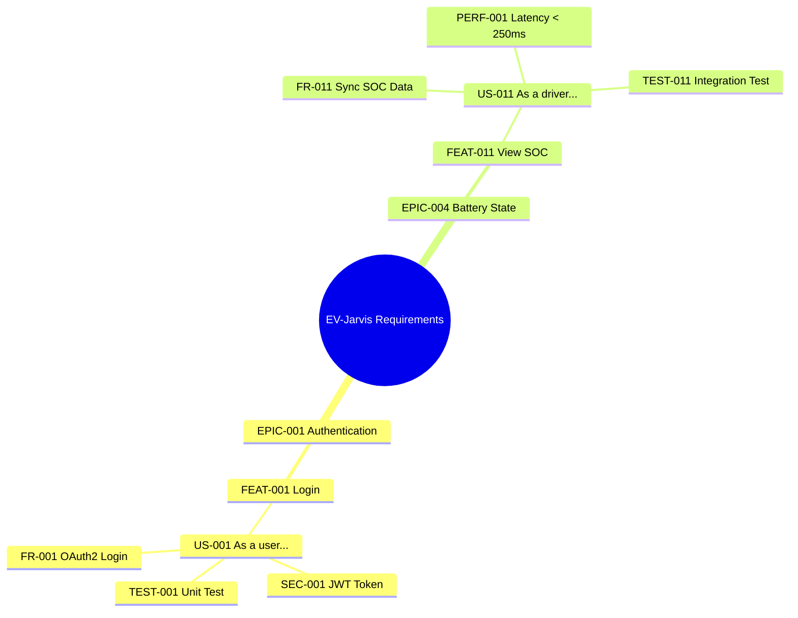
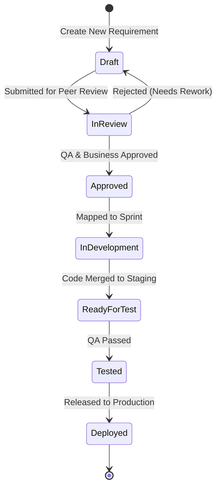
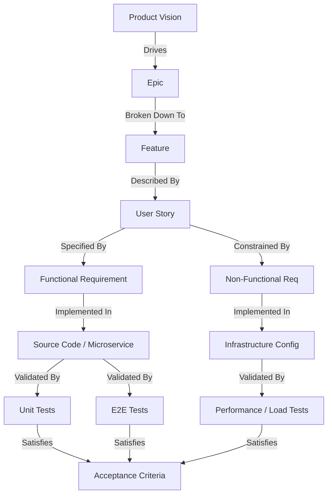

# Document Information

เอกสารนี้คือ Requirements Specification ระดับ Production-grade ที่รวบรวมข้อกำหนดทั้งหมดของระบบ EV-Jarvis โดยอ้างอิงตามมาตรฐาน IEEE 29148, ISO/IEC/IEEE 12207 และแนวทาง Agile เพื่อให้แน่ใจว่า Requirements ทั้งหมดมีความครบถ้วน ชัดเจน สามารถทดสอบได้ และมีการสอบกลับ (Requirement Traceability) ไปยัง PRD และ SRS อย่างสมบูรณ์

# Table of Contents

1. [Requirement Categories](#requirement-categories)
2. [Functional Requirements](#functional-requirements)
3. [Non-Functional Requirements](#non-functional-requirements)
4. [Business Requirements](#business-requirements)
5. [Security Requirements](#security-requirements)
6. [Database Requirements](#database-requirements)
7. [API Requirements](#api-requirements)
8. [UI Requirements](#ui-requirements)
9. [Performance Requirements](#performance-requirements)
10. [Availability & Reliability & Scalability](#availability-reliability-scalability)
11. [Logging & Monitoring](#logging-monitoring)
12. [Backup & Recovery](#backup-recovery)
13. [Validation & Error Handling](#validation-error-handling)
14. [Deployment & Operations](#deployment-operations)
15. [AI Requirements](#ai-requirements)
16. [Privacy & Compliance](#privacy-compliance)
17. [Accessibility & Localization](#accessibility-localization)
18. [Requirement Traceability](#requirement-traceability)
19. [Requirement Hierarchy & Lifecycle](#requirement-hierarchy--lifecycle)
20. [Revision History](#revision-history)

---

# Requirement Categories

ข้อกำหนดในระบบ EV-Jarvis ถูกแบ่งออกเป็นหมวดหมู่ย่อยตาม Architecture Attributes ดังนี้:
- **FR (Functional):** พฤติกรรมหรือฟังก์ชันที่ระบบต้องทำได้
- **NFR (Non-Functional):** คุณภาพการทำงานเชิงระบบโดยรวม
- **BR (Business):** กฎเกณฑ์และเงื่อนไขทางธุรกิจที่ควบคุมพฤติกรรม
- **SEC (Security):** การรักษาความปลอดภัยและการยืนยันตัวตน
- **DB/API/UI:** ข้อกำหนดเฉพาะทางด้าน Database, Interface, และ API
- **PERF/AVAIL/REL/SCAL:** ข้อกำหนดด้านความรวดเร็วและความเสถียรของระบบ
- **LOG/MON/BCK/REC:** ข้อกำหนดด้านการดูแลรักษาระบบ (Observability & Recovery)
- **VAL/ERR:** ข้อกำหนดด้านความถูกต้องของข้อมูลและการจัดการข้อผิดพลาด
- **DEP/OPS/AI:** ข้อกำหนดด้านกระบวนการทำงาน การ Deploy และ AI
- **PRIV/COMP/ACC/LOC:** ข้อกำหนดด้านกฎหมาย ผู้พิการ และภาษา

---

# Functional Requirements

| Requirement ID | Priority | Description | Business Value | Source | Acceptance Criteria | Dependencies | Related Epic | Related Feature | Related User Story |
|---|---|---|---|---|---|---|---|---|---|
| FR-001 | P0 | ระบบต้องรองรับการสมัครสมาชิกและเข้าสู่ระบบด้วย Email/Password และ OAuth2 (Google/Apple) | เพิ่มยอดผู้ใช้งานด้วยการลดอุปสรรคในการเข้าสู่ระบบ | PRD, SRS | สามารถ Login และรับ JWT Token ได้สำเร็จภายใน 2 วินาที | Auth Provider (OAuth2) | EPIC-001 | FEAT-001 | US-001 |
| FR-005 | P0 | ระบบต้องสามารถให้ผู้ใช้เพิ่มรถ EV โดยเลือกยี่ห้อ รุ่น และเชื่อมต่อกับ API ของค่ายรถได้ | อนุญาตให้ระบบดึงข้อมูล Telemetry ของรถได้โดยตรง | PRD, SRS | รถถูกสร้างใน Database พร้อม Profile ที่ถูกต้อง | Vehicle API Provider | EPIC-002 | FEAT-005 | US-005 |
| FR-011 | P0 | ระบบต้องแสดงสถานะแบตเตอรี่ล่าสุด (SOC, SOH, Estimated Range) จาก Telemetry Data | ลดความกังวลเรื่องระยะทาง (Range Anxiety) ให้ผู้ใช้ | PRD, SRS | แดชบอร์ดแสดงค่า SOC และระยะทางที่อัปเดตตรงกับตัวรถ | Telemetry Sync Job | EPIC-004 | FEAT-011 | US-011 |
| FR-017 | P1 | ระบบต้องคำนวณเส้นทางและแนะนำสถานีชาร์จระหว่างทางตามประเภทหัวชาร์จและระดับแบตเตอรี่ | ช่วยวางแผนการเดินทางระยะไกลได้อย่างแม่นยำและปลอดภัย | PRD, SRS | ระบบคำนวณเส้นทางพร้อมจุดชาร์จและ SOC ปลายทางได้ | Maps API, POI Database | EPIC-006 | FEAT-017 | US-017 |

---

# Non-Functional Requirements

| Requirement ID | Priority | Description | Business Value | Source | Acceptance Criteria | Dependencies | Related Epic | Related Feature | Related User Story |
|---|---|---|---|---|---|---|---|---|---|
| NFR-001 | P0 | ระบบต้องประมวลผลข้อมูล Telemetry โดยมี Latency ไม่เกิน 5 วินาทีหลังจากได้รับข้อมูลจากค่ายรถ | ข้อมูลเรียลไทม์เป็นกุญแจสำคัญสำหรับความน่าเชื่อถือ | SRS | Data Ingestion Pipeline จบการทำงานภายใต้ 5 วินาที | Kafka/Redis Queue | EPIC-003 | FEAT-009 | US-009 |
| NFR-002 | P1 | แพลตฟอร์มต้องถูกพัฒนาเป็น Cloud-Native และรองรับการทำ Auto-scaling เมื่อโหลดพุ่งสูง | รองรับผู้ใช้งานที่เพิ่มขึ้นโดยที่ระบบไม่ล่ม | Architecture | สเกล Container ขึ้นตาม CPU/Memory load ที่เกิน 70% | K8s / Cloud Run | All | All | All |

---

# Business Requirements

| Requirement ID | Priority | Description | Business Value | Source | Acceptance Criteria | Dependencies | Related Epic | Related Feature | Related User Story |
|---|---|---|---|---|---|---|---|---|---|
| BR-001 | P0 | ข้อมูลค่าใช้จ่ายการชาร์จต้องผูกกับ Time-of-Use (TOU) Rate ตามที่ผู้ใช้ตั้งค่าไว้เท่านั้น | เพื่อให้รายงานทางการเงินมีความถูกต้องแม่นยำที่สุด | PRD | รายงานแสดงผลการคำนวณแยกช่วงเวลา Peak/Off-Peak | Charging Session Data | EPIC-007 | FEAT-020 | US-020 |
| BR-002 | P0 | การแชร์ข้อมูลรถให้ผู้ใช้อื่น (Co-owner) ต้องถูกจำกัดสิทธิ์ในระดับ Read-Only โดยค่าเริ่มต้น | ป้องกันการปรับเปลี่ยนการตั้งค่ารถจากบุคคลที่ไม่ใช่เจ้าของหลัก | SRS | Co-owner ไม่สามารถแก้ไข Vehicle Profile หรือปลดล็อกรถได้ | Role-based Access Control | EPIC-001 | FEAT-003 | US-003 |

---

# Security Requirements

| Requirement ID | Priority | Description | Business Value | Source | Acceptance Criteria | Dependencies | Related Epic | Related Feature | Related User Story |
|---|---|---|---|---|---|---|---|---|---|
| SEC-001 | P0 | API Endpoints ทั้งหมด (ยกเว้น Login/Register) ต้องถูกป้องกันด้วย JWT Signature | ป้องกัน Unauthorized Access และ Data Breach | SRS | API คืนค่า 401 Unauthorized หากไม่มี Header Authorization | JWT Middleware | All | All | All |
| SEC-002 | P0 | รหัสผ่านผู้ใช้และ API Keys ของผู้ให้บริการรถยนต์ต้องถูกเข้ารหัสที่ฝั่งฐานข้อมูลด้วย AES-256 | ปกป้องข้อมูลสำคัญที่สุดในกรณีที่ฐานข้อมูลถูกขโมย | Security Policy | ไม่สามารถอ่าน Password หรือ Token ดิบได้จาก Database โดยตรง | Secrets Management (Vault/KMS) | EPIC-009 | FEAT-026 | US-026 |

---

# Database Requirements

| Requirement ID | Priority | Description | Business Value | Source | Acceptance Criteria | Dependencies | Related Epic | Related Feature | Related User Story |
|---|---|---|---|---|---|---|---|---|---|
| DB-001 | P0 | ฐานข้อมูลต้องใช้ Relational Database (PostgreSQL) เป็นหลัก และมีการทำ Index ใน Field ที่มีการค้นหาบ่อย (เช่น userId, vehicleId) | ความเร็วในการดึงข้อมูลและความสัมพันธ์ของข้อมูลที่ถูกต้อง (ACID) | Architecture | Query plan ระบุว่าใช้ Index Scan ใน Query หลัก | PostgreSQL | All | All | All |
| DB-002 | P1 | ข้อมูล Time-series (เช่น Telemetry History) ต้องใช้ Table Partitioning ตามเดือน | รองรับปริมาณข้อมูลมหาศาลจากการเก็บ Telemetry ของรถหลายคัน | SRS | Partition table ถูกสร้างอัตโนมัติเมื่อขึ้นเดือนใหม่ | DB Scheduler | EPIC-003 | FEAT-009 | US-009 |

---

# API Requirements

| Requirement ID | Priority | Description | Business Value | Source | Acceptance Criteria | Dependencies | Related Epic | Related Feature | Related User Story |
|---|---|---|---|---|---|---|---|---|---|
| API-001 | P0 | ทุก API Endpoint ต้องใช้มาตรฐาน RESTful JSON และมี Versioning ใน Path (เช่น `/api/v1/vehicles`) | ให้นักพัฒนาและ App สามารถเชื่อมต่อได้อย่างเป็นมาตรฐาน | Architecture | มี Swagger/OpenAPI Spec ที่ระบุทุก Endpoints พร้อม Schema | API Gateway | All | All | All |
| API-002 | P1 | API สำหรับการดึงข้อมูลเพื่อแสดงบน Dashboard รองรับ Pagination แบบ Cursor-based | ป้องกัน API Response ขนาดใหญ่และช่วยให้ UI โหลดเร็วขึ้น | SRS | คืนค่า `next_cursor` ใน API List ทุกเส้นที่มีปริมาณข้อมูลมาก | Database Cursor | EPIC-006 | FEAT-018 | US-018 |

---

# UI Requirements

| Requirement ID | Priority | Description | Business Value | Source | Acceptance Criteria | Dependencies | Related Epic | Related Feature | Related User Story |
|---|---|---|---|---|---|---|---|---|---|
| UI-001 | P0 | ส่วนต่อประสานผู้ใช้ต้องตอบสนองแบบ Responsive (Mobile-first) และรองรับ Dark/Light Mode ตาม OS | สร้างประสบการณ์ใช้งานที่ทันสมัยและเป็นมิตรกับสายตาผู้ใช้ | PRD | UI ปรับโครงสร้าง Layout ตามขนาดหน้าจอและเปลี่ยนธีมสีอัตโนมัติ | Frontend Design System | All | All | All |
| UI-002 | P1 | ขณะทำการดึงข้อมูลจาก API ตัว UI ต้องแสดง Skeleton Loading หรือ Spinner ชัดเจนพร้อมข้อความภาษาไทย | ทำให้ผู้ใช้รับรู้สถานะการทำงานและลดความหงุดหงิดจากการรอคอย | UX Guidelines | เมื่อ Latency > 300ms หน้าจอต้องแสดง State Indicator ล่วงหน้า | Frontend State Management | All | All | All |

---

# Performance Requirements

| Requirement ID | Priority | Description | Business Value | Source | Acceptance Criteria | Dependencies | Related Epic | Related Feature | Related User Story |
|---|---|---|---|---|---|---|---|---|---|
| PERF-001 | P0 | ระยะเวลาในการประมวลผลของ API (P95 Response Time) ต้องไม่เกิน 250ms สำหรับคำสั่งดึงข้อมูล (GET) | การตอบสนองที่รวดเร็วส่งผลดีต่อภาพลักษณ์ของแอพพลิเคชันระดับพรีเมียม | SRS | Performance Testing ชี้ว่า 95% ของ Request ใช้เวลาน้อยกว่า 250ms | Caching Layer (Redis) | All | All | All |
| PERF-002 | P1 | App ต้องใช้เวลา Cold Start ไม่เกิน 2 วินาทีบนโทรศัพท์มือถือระดับกลาง | เพิ่มความน่าใช้งานและเข้าถึงแอปได้รวดเร็วในเวลาเร่งด่วน | PRD | เวลา TTI (Time to Interactive) ไม่เกิน 2000ms | App Bundle Optimization | All | All | All |

---

# Availability, Reliability, Scalability

| Requirement ID | Priority | Description | Business Value | Source | Acceptance Criteria | Dependencies | Related Epic | Related Feature | Related User Story |
|---|---|---|---|---|---|---|---|---|---|
| AVAIL-001 | P0 | บริการหลักทาง API ต้องมี Availability SLA ไม่ต่ำกว่า 99.9% (Uptime) ประจำเดือน | ผู้ใช้รถ EV ต้องสามารถเรียกดูสถานะรถได้ทุกเวลา | SRS | Monitoring Tool บันทึก Uptime >= 99.9% และไม่มี Downtime เกิน 43 นาทีต่อเดือน | Load Balancer | All | All | All |
| REL-001 | P0 | ต้องมีกลไก Retry และ Circuit Breaker เมื่อระบบของผู้ให้บริการข้อมูล (Third-party API) เกิดความล่าช้าหรือล่ม | ป้องกันความล้มเหลวแบบต่อเนื่อง (Cascading Failure) ในระบบของ EV-Jarvis | Architecture | เมื่อ API ภายนอก Error เกิน 50% ระบบจะเปิด Circuit Breaker และหยุดส่ง Request ชั่วคราว | API Gateway/Service Mesh | EPIC-009 | FEAT-027 | US-027 |
| SCAL-001 | P1 | ระบบ Ingestion สำหรับรับข้อมูล Telemetry ต้องรองรับโหลดสูงสุดที่ 5,000 Request/วินาที | รองรับการขยายตัวของผู้ใช้งานรถ EV ในอนาคต | SRS | Load Test ผ่านที่ระดับ 5,000 RPS โดยข้อมูลไม่สูญหาย | Message Broker (Kafka) | EPIC-012 | FEAT-036 | US-036 |

---

# Logging, Monitoring, Backup, Recovery

| Requirement ID | Priority | Description | Business Value | Source | Acceptance Criteria | Dependencies | Related Epic | Related Feature | Related User Story |
|---|---|---|---|---|---|---|---|---|---|
| LOG-001 | P0 | ต้องมีการบันทึก Structured JSON Log พร้อม `requestId` และ `actorId` สำหรับทุก Request ที่เข้ามา | ช่วยให้วิศวกรสามารถไล่รอยปัญหา (Traceability) ได้อย่างรวดเร็ว | SRS | ทุก Log Entry មាន Field มาตรฐานครบถ้วนและไม่เก็บ Sensitive Data | Centralized Logging (ELK) | All | All | All |
| MON-001 | P0 | ต้องมี API Endpoint `/healthz` และ `/readyz` สำหรับให้ระบบ K8s/Load Balancer ใช้ตรวจสอบสถานะ | เพิ่มประสิทธิภาพในกระบวนการ Auto-healing ของ Infrastructure | Architecture | Endpoint ส่งสถานะ 200 OK เฉพาะเมื่อ Database/Cache พร้อมทำงาน | CI/CD | All | All | All |
| BCK-001 | P0 | ระบบต้องทำการสำรองข้อมูล Database แบบ Full Backup ทุกวันและ Incremental ทุกชั่วโมง | ลดความเสี่ยงจากการสูญหายของข้อมูลสำคัญของลูกค้า | Security Policy | สามารถตรวจสอบไฟล์ Backup และทดสอบ Restore ได้สำเร็จเดือนละ 1 ครั้ง | Cloud Storage (S3) | All | All | All |
| REC-001 | P1 | RTO (Recovery Time Objective) < 4 ชั่วโมง และ RPO (Recovery Point Objective) < 1 ชั่วโมง | มั่นใจว่าธุรกิจสามารถฟื้นตัวจากหายนะได้ในเวลาที่ยอมรับได้ | Business Continuity | กระบวนการ Disaster Recovery Plan (DRP) ถูกทดสอบและผ่านเกณฑ์เวลา | DR Automation | All | All | All |

---

# Validation, Error Handling, Deployment, Operations

| Requirement ID | Priority | Description | Business Value | Source | Acceptance Criteria | Dependencies | Related Epic | Related Feature | Related User Story |
|---|---|---|---|---|---|---|---|---|---|
| VAL-001 | P0 | การ Validation ต้องถูกตรวจสอบทั้งในฝั่ง Client-side (UI) และ Server-side เสมอ | ป้องกันข้อมูลไม่ถูกต้องเข้าสู่ Database และลด Load ของ Server | SRS | Server คืนค่า 422 Unprocessable Entity ทันทีที่ Payload ผิดโครงสร้าง | Request Validator | All | All | All |
| ERR-001 | P0 | ทุก Error Response จาก API ต้องใช้โครงสร้างมาตรฐาน RFC 7807 (Problem Details for HTTP APIs) | นักพัฒนา Mobile App สามารถจัดการข้อผิดพลาดด้วยวิธีที่เป็นมาตรฐานเดียวกัน | API Guidelines | Response มี Field `type`, `title`, `status`, `detail`, และ `instance` ครบถ้วน | API Error Handler | All | All | All |
| DEP-001 | P1 | กระบวนการ Deployment ไปยัง Production ต้องรองรับ Zero-downtime Deployment (Blue/Green) | ผู้ใช้สามารถใช้งานระบบได้ต่อเนื่องตลอดช่วงเวลาอัปเดตระบบ | Architecture | การ Deploy เวอร์ชันใหม่ไม่ทำให้มี HTTP 502/503 ส่งกลับไปให้ผู้ใช้งาน | CI/CD Pipeline | All | All | All |
| OPS-001 | P1 | ต้องมี Runbook และ Alert Rule สำหรับจัดการ P0 Incidents (เช่น Database Connection Failed) | ผู้ดูแลระบบแก้ปัญหาได้รวดเร็วและเป็นระบบมากขึ้น | Operations Policy | ระบบส่ง Alert ไปยัง Slack พร้อมลิงก์ Runbook เมื่อ Error Rate เกิน 5% | PagerDuty / Slack | All | All | All |

---

# AI Requirements, Privacy, Compliance, Accessibility, Localization

| Requirement ID | Priority | Description | Business Value | Source | Acceptance Criteria | Dependencies | Related Epic | Related Feature | Related User Story |
|---|---|---|---|---|---|---|---|---|---|
| AI-001 | P1 | ระบบผู้ช่วย EV-Jarvis (AI) ต้องมีกลไก Fallback Rule-based เมื่อ API ของ LLM ไม่ตอบสนองหรือล่ม | ทำให้ฟีเจอร์คำสั่งเสียง/ข้อความยังทำงานได้สำหรับคำสั่งพื้นฐาน | PRD | ระบบตอบกลับคำสั่งด้วย Template อัตโนมัติเมื่อ LLM Timeout เกิน 5 วินาที | LLM Integration | EPIC-011 | FEAT-035 | US-035 |
| PRIV-001 | P0 | ข้อมูลระบุตัวตนบุคคล (PII) ต้องถูกทำ Data Masking/Anonymization ก่อนนำไปใช้วิเคราะห์หรือทำ Log | ป้องกันการละเมิดความเป็นส่วนตัวตามกฎหมาย PDPA/GDPR | Legal & Compliance | Log และ Data Warehouse มองไม่เห็น ชื่อจริง อีเมล หรือหมายเลขตัวถังแบบเต็ม | Data Pipeline | All | All | All |
| COMP-001 | P0 | ระบบต้องมีกลไกการเก็บประวัติและเวอร์ชันของการกดยอมรับ Privacy Policy และ Terms of Service | ปฏิบัติตามกฎหมายคุ้มครองข้อมูลส่วนบุคคล (PDPA) อย่างเคร่งครัด | Legal & Compliance | ผู้ใช้ใหม่ทุกคนต้องกด Accept และระบบบันทึก Timestamp & Policy Version ไว้ใน Database | Auth Module | EPIC-001 | FEAT-001 | US-001 |
| ACC-001 | P2 | สีของ UI แพลตฟอร์มต้องผ่านมาตรฐานความคอนทราสต์ (Contrast Ratio) ขั้นต่ำตาม WCAG 2.1 AA | รองรับผู้ใช้งานที่มีภาวะสายตาหรือความบกพร่องทางการมองเห็น | UX Guidelines | สีตัวหนังสือและสีพื้นหลังมีอัตราส่วนคอนทราสต์ที่ 4.5:1 | Frontend Design System | All | All | All |
| LOC-001 | P0 | ระบบทั้งหมด (Mobile/Web) ต้องใช้ภาษาไทยเป็นภาษาหลัก และรองรับการเปลี่ยนภาษาเป็นภาษาอังกฤษ (i18n) | สอดคล้องกับพฤติกรรมการใช้งานของกลุ่มผู้ใช้คนไทยที่เป็นเป้าหมายหลัก | PRD | ตัวอักษรบนหน้าจอ เมนู และข้อความ Error แสดงภาษาไทยได้อย่างถูกต้องและเปลี่ยนภาษาได้ | i18n Library | All | All | All |

---

# Requirement Traceability Matrix

ตาราง RTM (Requirement Traceability Matrix) แสดงความสัมพันธ์จากต้นทางจนถึงเป้าหมาย:

| Requirement ID | Business Goal (Vision) | PRD Ref | SRS Ref | Epic | Feature | Status |
|---|---|---|---|---|---|---|
| FR-001 | Enhance User Experience | US-001 | FEAT-001 | EPIC-001 | Authentication | Validated |
| FR-005 | Seamless Onboarding | US-005 | FEAT-005 | EPIC-002 | Vehicle Management | Validated |
| FR-011 | Reduce Range Anxiety | US-011 | FEAT-011 | EPIC-004 | Battery State | Validated |
| FR-017 | Intelligent Navigation | US-017 | FEAT-017 | EPIC-006 | Smart Routing | Validated |
| BR-001 | Transparent Cost Tracking | US-020 | FEAT-020 | EPIC-007 | Charging Cost | Validated |
| SEC-001 | Data Protection & Security | N/A | Sec-Policy | All | All | Validated |
| DB-002 | Scalable Architecture | N/A | Data-Arch | EPIC-003 | Telemetry Sync | Validated |
| API-001 | Developer Friendly API | N/A | API-Arch | All | All | Validated |

---

# Requirement Hierarchy & Lifecycle

### Requirement Hierarchy

แผนภาพแสดงความเชื่อมโยงลำดับชั้นของ Requirement ตั้งแต่ระดับ Epic จนถึง Test Case:

### Requirement Lifecycle

แผนภาพแสดงวงจรชีวิตของข้อกำหนด ตั้งแต่เริ่มต้นร่าง จนกระทั่งตรวจสอบสำเร็จ (Validated):

# Requirement Traceability

แผนภาพแสดงการตรวจสอบย้อนกลับ (Traceability Diagram) แบบ End-to-End:

---

# Revision History

| Version | Date | Status | Author | Change Description |
|---|---|---|---|---|
| 1.0.0 | 2026-08-02 | Complete | Lead Requirements Engineer | Initial Production-grade Requirements Specification. Derived from PRD, SRS and MASTER_CONTEXT. Includes full coverage of FR, NFR, Security, API, DB, and comprehensive Traceability matrices with Mermaid diagrams. |