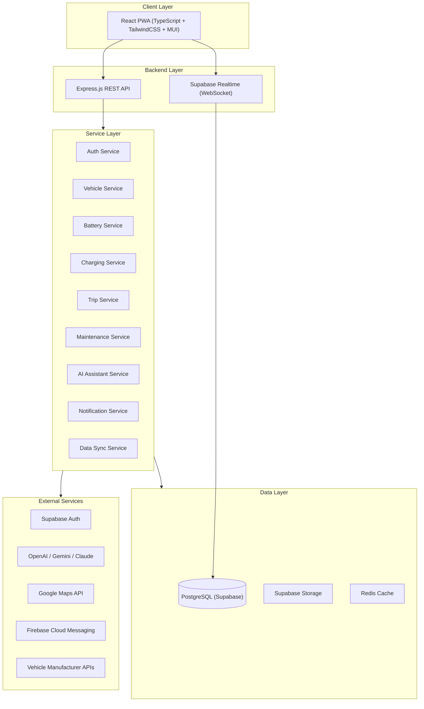
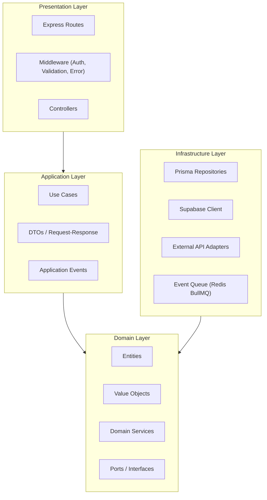
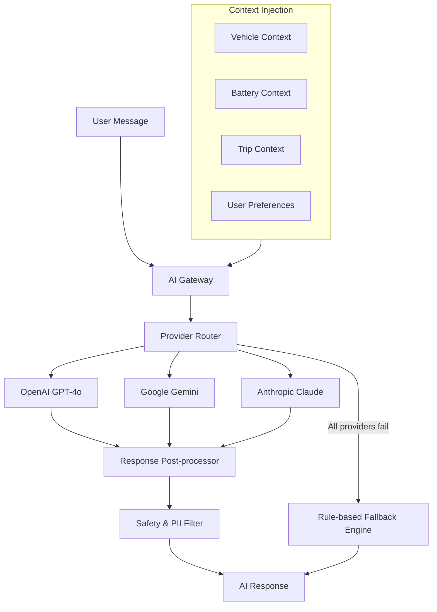
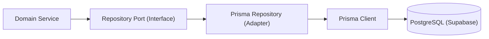
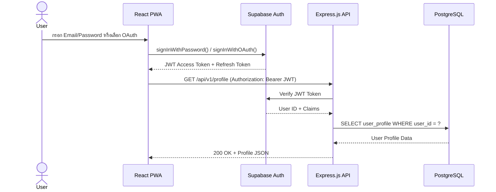
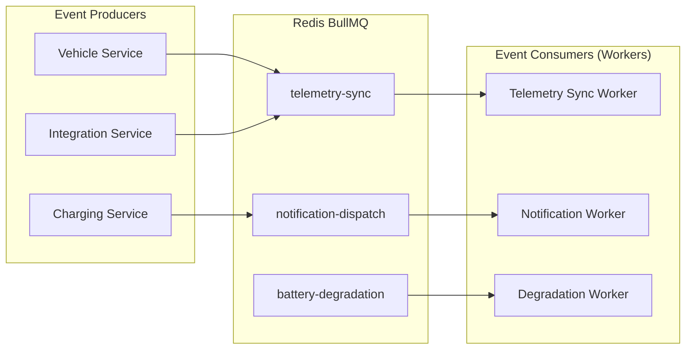
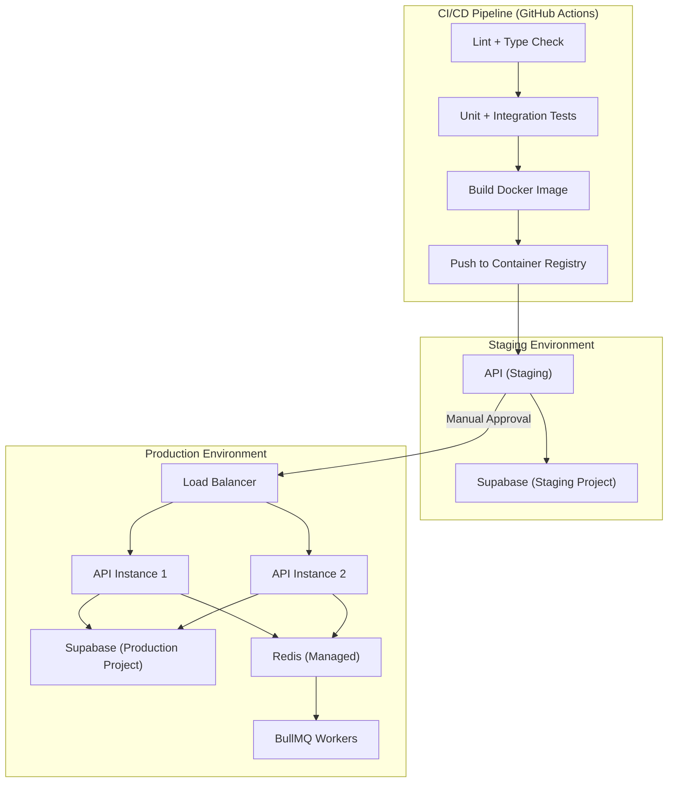

# 1. Purpose

เอกสารนี้กำหนดสถาปัตยกรรมระบบ (System Architecture) ระดับ Production-ready สำหรับ EV-Jarvis ครอบคลุมตั้งแต่ภาพรวมระดับสูง (High-level) ไปจนถึง Layer Architecture, Feature Module, การเชื่อมต่อบริการภายนอก และกลยุทธ์ด้าน Security, Performance, Scalability โดยออกแบบบนพื้นฐาน Clean Architecture ผสมกับ Feature-based Modular Architecture เพื่อให้ระบบมีความยืดหยุ่น ทดสอบได้ และขยายตัวได้ในอนาคต

เอกสารนี้เป็นเอกสารออกแบบ (Architecture Documentation) ไม่ใช่ Source Code และไม่ใช่ Implementation Guide

---

# 2. Scope

สถาปัตยกรรมนี้ครอบคลุมระบบ EV-Jarvis ทั้งหมดตาม 12 Epics ที่กำหนดใน PRD:

- **EPIC-001:** Authentication & User Profile
- **EPIC-002:** Vehicle Discovery & Onboarding
- **EPIC-003:** Vehicle Profile & Telemetry
- **EPIC-004:** Battery & Charging Status
- **EPIC-005:** Maintenance & Health
- **EPIC-006:** Trip & Routing
- **EPIC-007:** Charging Cost & Analytics
- **EPIC-008:** Location & Point of Interest
- **EPIC-009:** Integration & Data Provider
- **EPIC-010:** Notification & Alert
- **EPIC-011:** Admin & Support
- **EPIC-012:** Data Sync & Background Jobs

---

# 3. Design Principles

หลักการออกแบบที่ใช้เป็นแนวทางในการตัดสินใจทางสถาปัตยกรรมทุกจุดของ EV-Jarvis:

| Principle | คำอธิบาย |
|---|---|
| **Clean Architecture** | แยก Business Logic (Domain) ออกจาก Framework และ Infrastructure อย่างชัดเจน เพื่อให้ทดสอบได้ง่ายและเปลี่ยน Technology ได้โดยไม่กระทบ Core Logic |
| **Feature-based Modules** | จัดกลุ่มโค้ดตาม Feature (เช่น Vehicle, Battery, Trip) แทนการจัดตาม Technical Layer เพื่อให้ทีมทำงานแบบ Vertical Slice ได้อย่างอิสระ |
| **Single Responsibility** | แต่ละ Module, Service และ Component มีหน้าที่เดียว ชัดเจน ไม่ทำงานซ้ำซ้อนข้ามขอบเขต |
| **Dependency Inversion** | Layer ชั้นใน (Domain) ไม่ต้องพึ่งพา Layer ชั้นนอก (Infrastructure) แต่ใช้ Interface/Port เป็นตัวกลาง |
| **API-First Design** | กำหนด API Contract ก่อนเขียนโค้ด Frontend และ Backend สามารถพัฒนาแบบขนานกันได้ |
| **Event-Driven** | ใช้ Event-based Communication สำหรับ Background Jobs, Data Sync และ Notification เพื่อลด Coupling ระหว่าง Module |
| **Security by Default** | ทุก Request ต้องผ่าน Authentication และ Authorization ก่อนเข้าถึง Resource |
| **Fail Gracefully** | ระบบต้องจัดการ Error ได้อย่างสง่างาม มี Fallback และไม่เปิดเผยข้อมูลภายในให้ผู้ใช้ |

---

# 4. High-Level Architecture

ภาพรวมสถาปัตยกรรมระดับสูงของระบบ EV-Jarvis ทั้งหมด:



---

# 5. Layer Architecture

ระบบ EV-Jarvis ใช้ Clean Architecture แบ่งเป็น 4 Layer หลัก โดยทิศทางของ Dependency ชี้จากนอกเข้าใน (Outer -> Inner):



### 5.1 Presentation Layer
รับผิดชอบการจัดการ HTTP Request/Response รวมถึง Middleware สำหรับ Authentication, Request Validation และ Error Formatting ตามมาตรฐาน RFC 7807

### 5.2 Application Layer
บรรจุ Use Case (Application Logic) ที่ประสานงานระหว่าง Domain Layer และ Infrastructure Layer โดยใช้ DTO เป็นตัวกลางในการรับส่งข้อมูล

### 5.3 Domain Layer
เป็นหัวใจของระบบ บรรจุ Business Rules, Entities, Value Objects และ Domain Services ที่ไม่ขึ้นกับ Framework ใดๆ Layer นี้กำหนด Port (Interface) ที่ Infrastructure Layer จะ Implement

### 5.4 Infrastructure Layer
เป็นส่วนที่เชื่อมต่อกับระบบภายนอก ได้แก่ Database (Prisma), Supabase Services, External APIs (Vehicle Manufacturer, Google Maps, LLM) และ Message Queue (BullMQ)

---

# 6. Feature Modules

แต่ละ Feature Module จะมีโครงสร้างภายในเป็น Vertical Slice ครอบคลุมทุก Layer ของ Clean Architecture:

| Module | Epic | Description | Key Entities |
|---|---|---|---|
| **Authentication** | EPIC-001 | ระบบล็อกอิน สมัครสมาชิก และจัดการโปรไฟล์ผ่าน Supabase Auth | User, UserProfile, UserPreference |
| **Dashboard** | All | หน้าหลักแสดงภาพรวมข้อมูลรถ แบตเตอรี่ และการชาร์จ | DashboardWidget, UserSummary |
| **Vehicle** | EPIC-002, EPIC-003 | จัดการข้อมูลรถ EV, Telemetry Snapshot, เอกสารรถ | Vehicle, VehicleSnapshot, OwnershipNote |
| **Battery** | EPIC-004 | แสดงสถานะแบตเตอรี่ SOC, SOH, Temperature และ Estimated Range | BatteryState, BatteryHistory |
| **Charging** | EPIC-004, EPIC-007 | ติดตามสถานะการชาร์จ ประวัติการชาร์จ และวิเคราะห์ค่าใช้จ่าย | ChargingSession, ChargingHistory, CostReport |
| **Trip** | EPIC-006 | บันทึกเส้นทาง วิเคราะห์การขับขี่ และคำนวณเส้นทางพร้อมจุดชาร์จ | Trip, Route, Waypoint |
| **Maintenance** | EPIC-005 | แจ้งเตือนเช็คระยะ บันทึกการบำรุงรักษา คำนวณ Battery Degradation | MaintenanceRecord, ServiceReminder |
| **Community** | Future | พื้นที่แลกเปลี่ยนข้อมูลระหว่างผู้ใช้ (ออกแบบไว้รองรับอนาคต) | Post, Comment, UserReaction |
| **Marketplace** | Future | ซื้อขายอุปกรณ์ EV ระหว่างผู้ใช้ (ออกแบบไว้รองรับอนาคต) | Listing, Transaction |
| **Academy** | Future | บทเรียนและเนื้อหาความรู้เกี่ยวกับ EV (ออกแบบไว้รองรับอนาคต) | Course, Lesson, Progress |
| **AI Assistant** | EPIC-011 | EV-Jarvis ผู้ช่วย AI ตอบคำถามและให้คำแนะนำเจ้าของรถ EV | Conversation, Message, AIContext |
| **Notification** | EPIC-010 | Push Notification, Email Alert และ In-app Notification | Notification, NotificationRule, DeviceToken |
| **Settings** | EPIC-001 | ตั้งค่าส่วนตัว ภาษา หน่วยวัด ค่าไฟฟ้า และ Privacy | UserSetting, TOU Rate, ConsentRecord |

---

# 7. Backend Modules

โครงสร้างโฟลเดอร์ Backend ตาม Feature-based Modular Architecture:

```text
src/
├── app.ts                          # Express Application bootstrap
├── server.ts                       # HTTP Server entry point
├── config/                         # Application configuration
│   ├── database.ts                 # Prisma client initialization
│   ├── supabase.ts                 # Supabase client setup
│   ├── redis.ts                    # Redis connection
│   └── env.ts                      # Environment variables validation
├── shared/                         # Shared utilities across modules
│   ├── middleware/
│   │   ├── auth.middleware.ts       # JWT verification via Supabase
│   │   ├── validation.middleware.ts # Request payload validation (Zod)
│   │   ├── error.middleware.ts      # Global error handler (RFC 7807)
│   │   ├── rate-limit.middleware.ts  # Rate limiting
│   │   └── logging.middleware.ts    # Structured request logging
│   ├── errors/                     # Custom error classes
│   ├── events/                     # Event bus and base event types
│   ├── utils/                      # Helper functions
│   └── types/                      # Shared TypeScript types
├── modules/
│   ├── auth/
│   │   ├── auth.controller.ts
│   │   ├── auth.service.ts
│   │   ├── auth.routes.ts
│   │   ├── auth.dto.ts
│   │   └── auth.repository.ts
│   ├── vehicle/
│   │   ├── vehicle.controller.ts
│   │   ├── vehicle.service.ts
│   │   ├── vehicle.routes.ts
│   │   ├── vehicle.dto.ts
│   │   ├── vehicle.repository.ts
│   │   └── vehicle.entity.ts
│   ├── battery/
│   ├── charging/
│   ├── trip/
│   ├── maintenance/
│   ├── ai-assistant/
│   ├── notification/
│   ├── location/
│   ├── integration/
│   ├── admin/
│   └── settings/
├── jobs/                           # Background job processors (BullMQ)
│   ├── telemetry-sync.job.ts
│   ├── notification-dispatch.job.ts
│   └── battery-degradation.job.ts
├── prisma/
│   ├── schema.prisma               # Prisma schema definition
│   └── migrations/                 # Database migrations
└── tests/                          # Test files mirror module structure
```

---

# 8. Frontend Modules

โครงสร้างโฟลเดอร์ Frontend ตาม Feature-based Architecture สำหรับ React PWA:

```text
client/
├── public/
│   ├── manifest.json                # PWA manifest
│   └── sw.js                        # Service Worker
├── src/
│   ├── main.tsx                     # Application entry point
│   ├── App.tsx                      # Root component with routing
│   ├── config/                      # Frontend configuration
│   │   ├── api.ts                   # Axios instance with interceptors
│   │   ├── supabase.ts              # Supabase client for Realtime
│   │   └── i18n.ts                  # i18n configuration (Thai/English)
│   ├── shared/                      # Shared UI primitives
│   │   ├── components/              # Reusable UI components
│   │   ├── hooks/                   # Custom React hooks
│   │   ├── layouts/                 # Page layouts (MainLayout, AuthLayout)
│   │   ├── providers/               # Context providers (Theme, Auth, i18n)
│   │   └── utils/                   # Frontend utility functions
│   ├── features/
│   │   ├── auth/
│   │   │   ├── pages/               # LoginPage, RegisterPage
│   │   │   ├── components/          # LoginForm, SocialLoginButton
│   │   │   ├── hooks/               # useAuth, useSession
│   │   │   └── api/                 # Auth API calls
│   │   ├── dashboard/
│   │   ├── vehicle/
│   │   ├── battery/
│   │   ├── charging/
│   │   ├── trip/
│   │   ├── maintenance/
│   │   ├── ai-assistant/
│   │   ├── notification/
│   │   ├── location/
│   │   └── settings/
│   ├── styles/
│   │   └── globals.css              # TailwindCSS global styles
│   └── types/                       # Shared TypeScript types
├── tailwind.config.ts
├── tsconfig.json
└── vite.config.ts
```

---

# 9. AI Service Architecture

ระบบ AI Assistant (EV-Jarvis) ออกแบบเป็น Multi-provider Architecture โดยรองรับ LLM หลายค่ายพร้อมกลไก Fallback:



### AI Provider Strategy

| Provider | Role | Use Case |
|---|---|---|
| **OpenAI GPT-4o** | Primary LLM | การสนทนาทั่วไป การวิเคราะห์ข้อมูลรถ และการให้คำแนะนำเส้นทาง |
| **Google Gemini** | Secondary LLM | Multimodal Analysis (ภาพ + ข้อความ) สำหรับวิเคราะห์สภาพรถจากรูป |
| **Anthropic Claude** | Tertiary LLM | การวิเคราะห์เชิงลึกที่ต้องการความแม่นยำสูงและ Context ยาว |
| **Rule-based Fallback** | Safety Net | ตอบคำสั่งพื้นฐาน (เช่น สถานะแบตเตอรี่ ตำแหน่งรถ) เมื่อ LLM ทั้งหมดไม่พร้อม |

---

# 10. Database Interaction

ระบบ EV-Jarvis ใช้ Prisma ORM เป็นตัวกลางในการเข้าถึง PostgreSQL (Supabase) ทุก Module เข้าถึง Database ผ่าน Repository Pattern เท่านั้น:



### Data Access Rules

- ทุก Data Access ต้องผ่าน Repository Port (Interface) ที่กำหนดใน Domain Layer
- ห้ามเรียก Prisma Client โดยตรงจาก Controller หรือ Use Case
- การอ่านข้อมูลที่เรียกบ่อย (เช่น Vehicle Profile, Battery State) ต้องผ่าน Redis Cache ก่อน
- Time-series Data (Telemetry, Charging History) ใช้ Partitioned Table ตามเดือนเพื่อประสิทธิภาพ
- Supabase Realtime ใช้สำหรับ Push ข้อมูล Battery Status และ Charging Status ไปยัง Client แบบ Real-time

---

# 11. Authentication Flow

ระบบ Authentication ใช้ Supabase Auth เป็นตัวจัดการ Identity ทั้งหมด:



### Token Management

- Access Token มีอายุ 1 ชั่วโมง
- Refresh Token มีอายุ 7 วัน
- Client ทำ Auto-refresh ก่อน Token หมดอายุ 5 นาที
- ทุก API Call ต้องแนบ JWT ใน Authorization Header

---

# 12. Authorization Strategy

ระบบ Authorization ใช้ Role-Based Access Control (RBAC) ร่วมกับ Resource-level Ownership Verification:

| Role | Permissions | Description |
|---|---|---|
| **owner** | CRUD บนทรัพยากรของตนเอง | เจ้าของรถที่ลงทะเบียนในระบบ สามารถจัดการข้อมูลรถและข้อมูลส่วนตัวได้ทั้งหมด |
| **co-owner** | Read-Only บนรถที่ถูกแชร์ | ผู้ที่ได้รับสิทธิ์ดูข้อมูลรถจากเจ้าของ ไม่สามารถแก้ไขข้อมูลได้ (อ้างอิง BR-002) |
| **admin** | Full Access ทุก Resource | ผู้ดูแลระบบ สามารถจัดการผู้ใช้ ดูรายงาน และจัดการ Sync Jobs ได้ |

### Ownership Verification Flow

ทุก Request ที่เข้าถึง Resource เฉพาะเจาะจง (เช่น Vehicle, Trip) จะถูกตรวจสอบ Ownership ก่อนดำเนินการ:

1. Middleware ดึง `userId` จาก JWT Token
2. Service Layer ตรวจสอบว่า `userId` เป็นเจ้าของ Resource ที่ร้องขอ
3. หากไม่ใช่เจ้าของ ระบบคืนค่า `403 Forbidden`

---

# 13. Event Flow

ระบบ EV-Jarvis ใช้ Event-Driven Architecture สำหรับ Asynchronous Operations ผ่าน Redis BullMQ:



### Event Types

| Event | Producer | Consumer | Description |
|---|---|---|---|
| `telemetry.received` | Integration Service | Telemetry Sync Worker | ข้อมูล Telemetry ใหม่จาก Vehicle API ต้องถูกประมวลผลและบันทึก |
| `charging.started` | Charging Service | Notification Worker | แจ้งเตือนผู้ใช้เมื่อเริ่มชาร์จ |
| `charging.completed` | Charging Service | Notification Worker, Cost Worker | คำนวณค่าชาร์จและแจ้งเตือนเมื่อชาร์จเสร็จ |
| `battery.threshold` | Battery Service | Notification Worker | แจ้งเตือนเมื่อ SOC ต่ำกว่า Threshold ที่ตั้งไว้ |
| `maintenance.due` | Maintenance Service | Notification Worker | แจ้งเตือนเมื่อถึงกำหนดเช็คระยะ |

---

# 14. Background Jobs

ระบบใช้ Redis BullMQ สำหรับ Job Queue เพื่อจัดการงานเบื้องหลังอย่างเป็นระบบ:

| Job Name | Schedule | Description | Retry Policy |
|---|---|---|---|
| `telemetry-sync` | ทุก 5 นาที (Cron) | ดึงข้อมูล Telemetry ล่าสุดจาก Vehicle Manufacturer API | Retry 3 ครั้ง, Exponential Backoff (1s, 4s, 16s) |
| `battery-degradation` | ทุก 24 ชั่วโมง | คำนวณ Battery Degradation จากข้อมูล SOH ย้อนหลัง | Retry 2 ครั้ง |
| `notification-dispatch` | Event-driven | ส่ง Push Notification ผ่าน Firebase Cloud Messaging | Retry 3 ครั้ง, Dead Letter Queue หลัง Fail ครบ |
| `cost-calculation` | Event-driven | คำนวณค่าชาร์จไฟฟ้าตาม TOU Rate เมื่อ Charging Session จบ | Retry 2 ครั้ง |
| `data-cleanup` | ทุก 7 วัน | ลบ Telemetry Data ที่เก่ากว่า Retention Period | Retry 1 ครั้ง |

---

# 15. External Integrations

ระบบ EV-Jarvis เชื่อมต่อกับบริการภายนอกดังนี้:

| Service | Provider | Purpose | Integration Pattern |
|---|---|---|---|
| **Authentication** | Supabase Auth | จัดการ Identity, OAuth2, JWT Token | SDK (Server-side) |
| **Database** | Supabase (PostgreSQL) | Primary Data Store | Prisma ORM |
| **Realtime** | Supabase Realtime | WebSocket Push สำหรับ Live Data | Supabase Client |
| **File Storage** | Supabase Storage | เก็บรูปภาพรถ, เอกสาร, รูปโปรไฟล์ | Supabase Client |
| **AI - Primary** | OpenAI API | LLM สำหรับ EV-Jarvis Assistant | REST API + Adapter Pattern |
| **AI - Secondary** | Google Gemini API | Multimodal AI Analysis | REST API + Adapter Pattern |
| **AI - Tertiary** | Anthropic Claude API | Deep Analysis with Long Context | REST API + Adapter Pattern |
| **Maps** | Google Maps Platform | เส้นทาง ค้นหาสถานที่ คำนวณระยะทาง | REST API |
| **Push Notification** | Firebase Cloud Messaging | Push Notification ไปยัง Mobile/Web | Firebase Admin SDK |
| **Vehicle Data** | Vehicle Manufacturer APIs | ดึงข้อมูล Telemetry, SOC, Location | REST API + Adapter Pattern |

### Adapter Pattern

ทุกการเชื่อมต่อกับบริการภายนอกใช้ Adapter Pattern ผ่าน Port (Interface) ใน Domain Layer เพื่อให้สามารถเปลี่ยน Provider ได้โดยไม่กระทบ Business Logic

---

# 16. Security Architecture

สถาปัตยกรรมความปลอดภัยของ EV-Jarvis ออกแบบตามหลัก Defense in Depth:

| Layer | Mechanism | Description |
|---|---|---|
| **Network** | HTTPS/TLS 1.3 | การสื่อสารทั้งหมดต้องเข้ารหัสผ่าน HTTPS |
| **API Gateway** | Rate Limiting, CORS | จำกัดจำนวน Request ต่อ IP และควบคุม Origin ที่อนุญาต |
| **Authentication** | Supabase Auth + JWT | ยืนยันตัวตนผู้ใช้ด้วย JWT Token (อ้างอิง SEC-001) |
| **Authorization** | RBAC + Ownership Check | ตรวจสอบสิทธิ์ในระดับ Role และ Resource Owner |
| **Data at Rest** | AES-256 Encryption | เข้ารหัสข้อมูลที่เป็น Sensitive (Password, API Keys) ในฐานข้อมูล (อ้างอิง SEC-002) |
| **Data in Transit** | TLS 1.3 | เข้ารหัสข้อมูลระหว่างการส่งผ่านเครือข่าย |
| **Input Validation** | Zod Schema Validation | ตรวจสอบ Payload ทั้ง Client-side และ Server-side (อ้างอิง VAL-001) |
| **Output Sanitization** | PII Redaction | ลบ/ปิดบัง PII ก่อนส่ง Log หรือ Analytics (อ้างอิง PRIV-001) |
| **Dependency Security** | npm audit + Snyk | ตรวจสอบ Vulnerability ใน Dependencies อัตโนมัติผ่าน CI |

---

# 17. Scalability Strategy

กลยุทธ์การรองรับการขยายตัวของระบบ:

| Strategy | Description | Target |
|---|---|---|
| **Horizontal Scaling** | เพิ่มจำนวน Container Instance ของ Backend เมื่อ CPU/Memory สูงเกิน 70% | รองรับ Traffic spike ในช่วง Peak Hours |
| **Database Connection Pooling** | ใช้ PgBouncer สำหรับจัดการ Database Connection Pool | รองรับจำนวน Concurrent Connection สูง |
| **Redis Caching** | Cache ข้อมูลที่อ่านบ่อย (Vehicle Profile, Battery State) ด้วย TTL 60 วินาที | ลด Database Load ลง 70% สำหรับ Read Operations |
| **Table Partitioning** | แบ่ง Telemetry และ Charging History ตามเดือน (อ้างอิง DB-002) | รองรับข้อมูลหลายล้าน Records |
| **CDN** | ใช้ CDN สำหรับ Static Assets ของ PWA | ลด Latency สำหรับผู้ใช้ทั่วประเทศ |
| **Queue-based Processing** | ใช้ BullMQ แยก Background Task ออกจาก Request Path | ไม่ให้งานหนักกระทบ API Response Time |

---

# 18. Performance Strategy

กลยุทธ์การเพิ่มประสิทธิภาพระบบตาม Requirement PERF-001 และ PERF-002:

| Area | Strategy | Target |
|---|---|---|
| **API Response Time** | Redis Cache + Database Index + Query Optimization | P95 Response Time < 250ms (GET) |
| **Frontend Load** | Code Splitting, Lazy Loading, Service Worker Pre-cache | TTI < 2000ms |
| **Database Query** | Prisma Query Optimization + Index บน userId, vehicleId | Query Execution < 50ms |
| **Real-time Data** | Supabase Realtime (WebSocket) แทน Polling | ข้อมูล Battery/Charging อัปเดตภายใน 2 วินาที |
| **Image Optimization** | Supabase Storage CDN + WebP Format + Responsive Images | Image Load < 500ms |
| **Bundle Size** | Tree Shaking + Dynamic Import + Compression (Brotli) | Initial Bundle < 200KB (gzipped) |

---

# 19. Logging Strategy

ระบบ Logging ใช้ Structured JSON Format ตาม LOG-001:

| Field | Description | Required |
|---|---|---|
| `timestamp` | เวลาที่เกิด Event (ISO 8601) | ใช่ |
| `level` | ระดับ Log (info, warn, error, debug) | ใช่ |
| `requestId` | UUID ที่ไม่ซ้ำกันสำหรับแต่ละ Request | ใช่ |
| `actorId` | User ID ของผู้กระทำ (anonymized ถ้าเป็น PII) | ใช่ |
| `module` | ชื่อ Feature Module ที่เกิด Event | ใช่ |
| `action` | ชื่อ Action ที่ดำเนินการ (เช่น vehicle.create) | ใช่ |
| `duration` | ระยะเวลาที่ใช้ประมวลผล (ms) | ไม่จำเป็น |
| `error` | Error Object (ไม่รวม Stack Trace ใน Production) | ไม่จำเป็น |

### Logging Rules

- ห้าม Log ข้อมูล Sensitive (Password, Token, API Key, PII) ตาม PRIV-001
- Log ระดับ `error` ต้องมี `requestId` เสมอเพื่อการ Tracing
- ใช้ Winston เป็น Logger Library สำหรับ Backend
- Log ถูกส่งไปยัง Centralized Log Service (เช่น Supabase Logs หรือ Grafana Loki)

---

# 20. Monitoring Strategy

กลยุทธ์การเฝ้าระวังระบบตาม MON-001:

| Metric | Tool | Threshold | Action |
|---|---|---|---|
| **API Health** | `/healthz` + `/readyz` Endpoints | ไม่ตอบภายใน 5 วินาที | Restart Container |
| **Response Time** | Application Metrics | P95 > 500ms | Alert ไปยัง Slack |
| **Error Rate** | Application Metrics | Error Rate > 5% | Alert ไปยัง Slack + PagerDuty |
| **CPU Usage** | Container Metrics | > 70% | Auto-scale เพิ่ม Instance |
| **Memory Usage** | Container Metrics | > 80% | Alert + Investigation |
| **Database Connections** | PgBouncer Metrics | Active > 80% of Pool | Alert + Pool Expansion |
| **Queue Length** | BullMQ Dashboard | Queue > 1000 Jobs Pending | Alert + Scale Workers |

---

# 21. Error Handling

ระบบจัดการ Error ตามมาตรฐาน RFC 7807 (Problem Details for HTTP APIs) ตาม ERR-001:

### Error Response Format

```json
{
  "type": "https://ev-jarvis.app/errors/vehicle-not-found",
  "title": "ไม่พบข้อมูลรถ",
  "status": 404,
  "detail": "ไม่พบรถที่มี ID ที่ระบุในระบบ กรุณาตรวจสอบ ID อีกครั้ง",
  "instance": "/api/v1/vehicles/abc-123",
  "requestId": "req_8f3a2b1c-4d5e-6f7a-8b9c-0d1e2f3a4b5c"
}
```

### Error Hierarchy

| HTTP Status | Error Type | Description |
|---|---|---|
| 400 | `BAD_REQUEST` | Request Payload ไม่ถูกต้อง |
| 401 | `UNAUTHORIZED` | ไม่มี Token หรือ Token หมดอายุ |
| 403 | `FORBIDDEN` | ไม่มีสิทธิ์เข้าถึง Resource นี้ |
| 404 | `NOT_FOUND` | ไม่พบ Resource ที่ร้องขอ |
| 409 | `CONFLICT` | State Conflict (เช่น Duplicate Vehicle) |
| 422 | `VALIDATION_ERROR` | ข้อมูลไม่ผ่าน Validation |
| 429 | `RATE_LIMITED` | Request เกิน Rate Limit |
| 500 | `INTERNAL_ERROR` | ข้อผิดพลาดภายในระบบ (ไม่เปิดเผย Stack Trace) |
| 503 | `SERVICE_UNAVAILABLE` | ระบบภายนอกไม่พร้อมให้บริการ (Circuit Breaker เปิดอยู่) |

---

# 22. Folder Responsibilities

สรุปหน้าที่ของแต่ละโฟลเดอร์ในโปรเจกต์:

| Folder | Responsibility |
|---|---|
| `docs/` | เอกสารโปรเจกต์ทั้งหมด (Architecture, Requirements, API) |
| `src/config/` | การตั้งค่า Application (Database, Supabase, Redis, Environment) |
| `src/shared/middleware/` | Middleware ที่ใช้ร่วมกันทุก Module (Auth, Validation, Error, Logging) |
| `src/shared/errors/` | Custom Error Classes ที่ใช้ทั่วทั้งระบบ |
| `src/shared/events/` | Event Bus และ Event Type Definitions สำหรับ Event-Driven Pattern |
| `src/modules/<feature>/` | โค้ดเฉพาะ Feature (Controller, Service, Repository, DTO, Entity) |
| `src/jobs/` | Background Job Processors ที่ทำงานแบบ Asynchronous ผ่าน BullMQ |
| `src/prisma/` | Prisma Schema และ Database Migration Files |
| `client/src/features/` | Frontend Feature Modules (Pages, Components, Hooks, API Calls) |
| `client/src/shared/` | Shared UI Components, Hooks, Layouts และ Providers |

---

# 23. Deployment Overview



### Deployment Strategy

- ใช้ **Blue/Green Deployment** เพื่อ Zero-downtime ตาม DEP-001
- Staging Environment ใช้ Supabase Project แยกต่างหากจาก Production
- การ Deploy ไป Production ต้องผ่าน Manual Approval จาก Lead Engineer
- ใช้ Docker Container สำหรับ Backend API และ Workers
- PWA Frontend ถูก Deploy เป็น Static Files ผ่าน CDN

---

# 24. Architecture Decision Records (ADR)

| ADR | Decision | Rationale | Status |
|---|---|---|---|
| **ADR-001** | เลือก Supabase แทน Firebase | Supabase ใช้ PostgreSQL (Relational) ที่เหมาะกับ Data Model ที่มีความสัมพันธ์ซับซ้อน รวมถึง Realtime, Auth, Storage ในตัว ลด Operational Overhead | Accepted |
| **ADR-002** | เลือก Prisma เป็น ORM | Type-safe Query, Auto-generated Types, Migration System ที่ดี ทำงานร่วมกับ TypeScript ได้อย่างลื่นไหล | Accepted |
| **ADR-003** | ใช้ BullMQ แทน Supabase Edge Functions สำหรับ Background Jobs | ต้องการ Job Scheduling, Retry Policy, Dead Letter Queue ที่ควบคุมได้ละเอียด ซึ่ง BullMQ ให้ได้ครบถ้วนกว่า | Accepted |
| **ADR-004** | ใช้ Multi-provider AI แทน Single Provider | ลดความเสี่ยงจาก Vendor Lock-in และรองรับ Downtime ของ LLM Provider ใดก็ตาม ด้วย Fallback อัตโนมัติ | Accepted |
| **ADR-005** | เลือก PWA แทน Native Mobile App สำหรับ MVP | ลดเวลาพัฒนาลง 40% ด้วย Codebase เดียว รองรับ Offline ผ่าน Service Worker และ Installable บนมือถือ | Accepted |
| **ADR-006** | Feature-based Module แทน Layer-based | ทีมพัฒนาสามารถทำงานบน Feature เดียวได้อย่างอิสระ ลด Merge Conflict และเข้าใจ Codebase ได้ง่ายกว่า | Accepted |
| **ADR-007** | ใช้ RFC 7807 เป็นมาตรฐาน Error Response | เป็น Internet Standard ที่ Frontend Developer เข้าใจได้ทันที มี Tooling รองรับ | Accepted |

---

# 25. Risks

ความเสี่ยงทางสถาปัตยกรรมและแนวทางรับมือ:

| Risk | Probability | Impact | Mitigation |
|---|---|---|---|
| Supabase ปรับราคาหรือเปลี่ยนนโยบาย | Low | High | Clean Architecture ทำให้สามารถเปลี่ยน Infrastructure Layer ได้โดยไม่กระทบ Domain Logic |
| LLM Provider ล่มพร้อมกัน | Low | Medium | Rule-based Fallback Engine รับประกันว่าฟังก์ชันพื้นฐานยังทำงานได้ |
| Vehicle Manufacturer เปลี่ยน API Format | Medium | High | Adapter Pattern แยก Integration Logic ออก เปลี่ยนเฉพาะ Adapter ของค่ายนั้น |
| ข้อมูล Telemetry พุ่งสูงเกินที่วางแผน | Low | Medium | Table Partitioning + Queue-based Ingestion + Auto-scaling Workers |
| Performance ไม่ถึงเป้า 250ms | Medium | Medium | Redis Cache Layer + Database Index + CDN สำหรับ Static Assets |

---

# 26. Future Expansion

รายการที่ออกแบบไว้ในสถาปัตยกรรมเพื่อรองรับอนาคต:

| Feature | Expansion Strategy |
|---|---|
| **Community Module** | Feature Module ว่างพร้อมให้เพิ่ม Entity (Post, Comment) โดยไม่กระทบ Module อื่น |
| **Marketplace Module** | รองรับ Payment Integration ในอนาคตผ่าน Adapter Pattern |
| **Academy Module** | สร้าง Content Management ภายใน Module โดยใช้ Supabase Storage สำหรับ Media |
| **GraphQL Support** | สามารถเพิ่ม GraphQL Layer เป็น Presentation Layer ใหม่โดยไม่กระทบ Application/Domain Layer |
| **Native Mobile App** | PWA สามารถ Migrate เป็น React Native ได้เนื่องจากใช้ TypeScript + Feature-based Structure เดียวกัน |
| **Microservices** | แต่ละ Feature Module สามารถ Extract ออกเป็น Microservice แยกได้ เนื่องจากสื่อสารผ่าน Event Bus อยู่แล้ว |

---

# 27. Revision History

| Version | Date | Status | Author | Change Description |
|---|---|---|---|---|
| 1.0.0 | 2026-08-02 | Complete | Principal Software Architect | Initial System Architecture. Clean Architecture + Feature-based Modular Architecture + REST API + Event-Driven. Technology: React PWA, Express.js, Supabase (PostgreSQL + Auth + Realtime + Storage), Prisma, BullMQ, OpenAI/Gemini/Claude, Google Maps, Firebase Cloud Messaging. |
