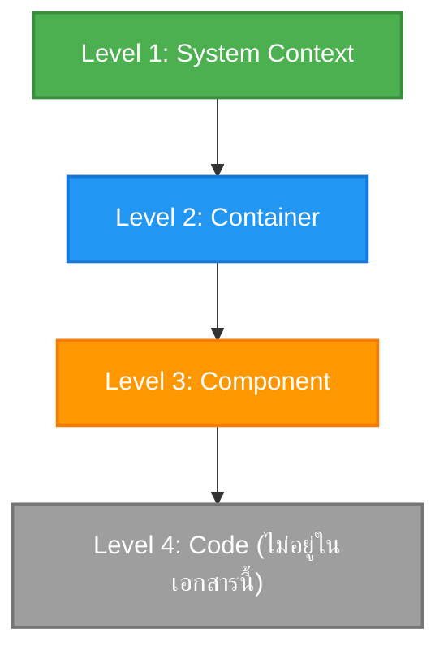
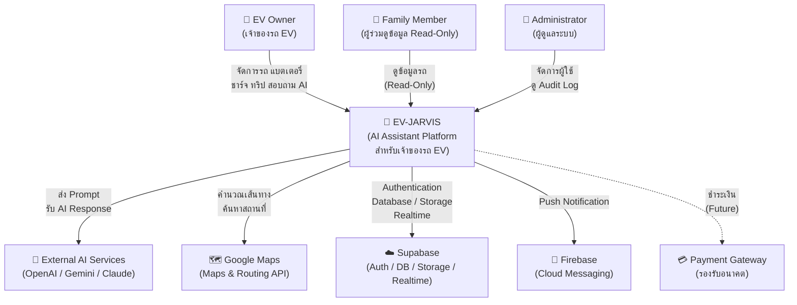
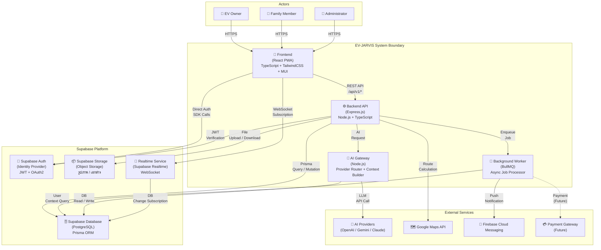
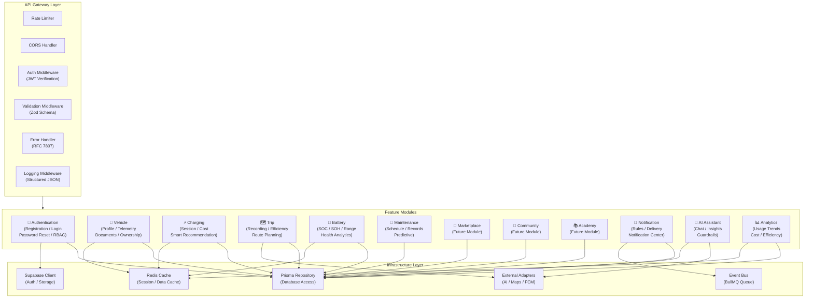
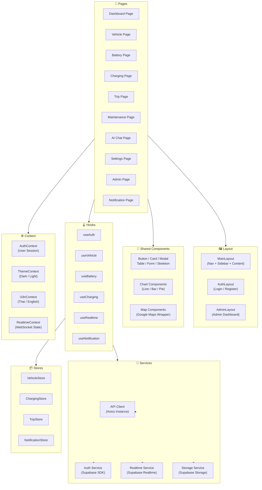
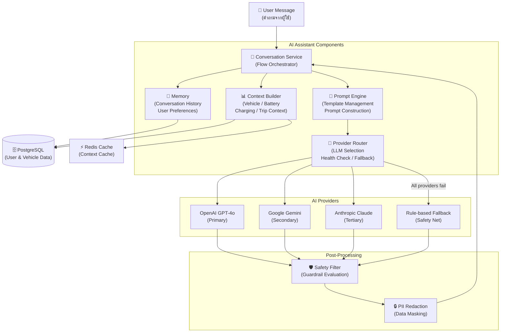
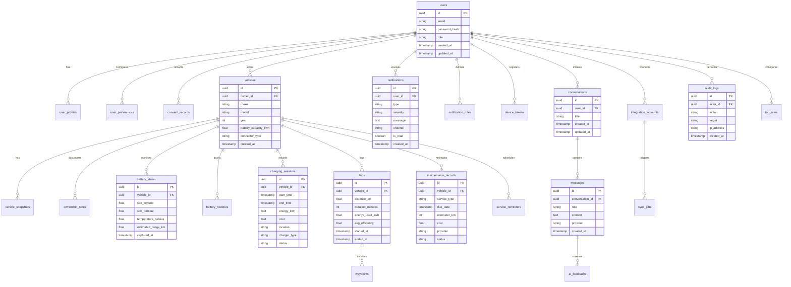
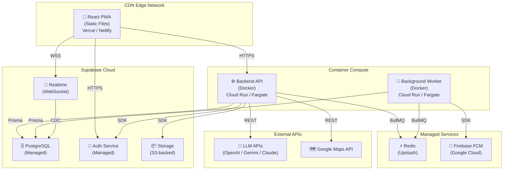

# C4 Architecture Model — EV-JARVIS

> **Document ID:** DOC-010
> **Version:** 1.0.0
> **Status:** Complete
> **Project:** EV-JARVIS
> **Owner:** Principal Solution Architect
> **Last Updated:** 2026-08-02
> **Reference Document:** docs/03_Architecture/01_SYSTEM_ARCHITECTURE.md (DOC-009)
> **Document Type:** C4 Architecture Documentation

---

# Table of Contents

1. [Purpose](#1-purpose)
2. [Scope](#2-scope)
3. [C4 Overview](#3-c4-overview)
4. [Level 1 — System Context Diagram](#4-level-1--system-context-diagram)
5. [Level 2 — Container Diagram](#5-level-2--container-diagram)
6. [Level 3 — Component Diagram (Backend)](#6-level-3--component-diagram-backend)
7. [Level 3 — Component Diagram (Frontend)](#7-level-3--component-diagram-frontend)
8. [AI Components](#8-ai-components)
9. [Database Components](#9-database-components)
10. [External Integrations](#10-external-integrations)
11. [Communication Matrix](#11-communication-matrix)
12. [Security Boundary](#12-security-boundary)
13. [Deployment Mapping](#13-deployment-mapping)
14. [Design Decisions](#14-design-decisions)
15. [Future Expansion](#15-future-expansion)
16. [Revision History](#16-revision-history)

---

# 1. Purpose

เอกสารนี้นำเสนอ C4 Architecture Model ของระบบ EV-JARVIS ตามแนวทางของ Simon Brown โดยแสดงมุมมองสถาปัตยกรรมใน 4 ระดับ ตั้งแต่ภาพรวมระดับ System Context ไปจนถึง Component Level เพื่อให้ทีมพัฒนา สถาปนิก และ Stakeholder ทุกฝ่ายสามารถเข้าใจโครงสร้าง ขอบเขต และความสัมพันธ์ของระบบได้อย่างครบถ้วน

เอกสารนี้เป็นเอกสารสถาปัตยกรรม (Architecture Documentation) ไม่ใช่ Source Code และไม่ใช่ Implementation Guide

---

# 2. Scope

C4 Model นี้ครอบคลุมระบบ EV-JARVIS ทั้งหมดตาม 12 Epics ที่กำหนดใน PRD (DOC-003):

| Epic | Description |
|---|---|
| EPIC-001 | Authentication & User Account |
| EPIC-002 | Dashboard & Insights |
| EPIC-003 | Vehicle Profile Management |
| EPIC-004 | Battery Monitoring & Analytics |
| EPIC-005 | Charging Management |
| EPIC-006 | Trip Management & Route History |
| EPIC-007 | Maintenance & Service |
| EPIC-008 | Notifications & Alerts |
| EPIC-009 | AI Assistant & Recommendations |
| EPIC-010 | Settings & User Preferences |
| EPIC-011 | Admin & Operations |
| EPIC-012 | Data Integration, Export & API Foundation |

Technology Stack ที่ใช้ในการออกแบบ:

| Layer | Technology |
|---|---|
| Frontend | React, TypeScript, TailwindCSS, Material UI, PWA |
| Backend | Node.js, Express.js |
| Database | PostgreSQL (Supabase) |
| ORM | Prisma |
| Authentication | Supabase Auth |
| Storage | Supabase Storage |
| Realtime | Supabase Realtime |
| AI | OpenAI, Gemini, Claude |
| Maps | Google Maps API |
| Notification | Firebase Cloud Messaging |

---

# 3. C4 Overview

C4 Model คือแนวทางการแสดงสถาปัตยกรรมซอฟต์แวร์ใน 4 ระดับ (Level) ตามหลักการของ Simon Brown โดยแต่ละระดับเปิดเผยรายละเอียดที่มากขึ้นเป็นลำดับ:

| Level | Name | คำอธิบาย | กลุ่มผู้อ่าน |
|---|---|---|---|
| Level 1 | System Context | แสดงขอบเขตของ EV-JARVIS กับ Actor ภายนอก (Users และ External Systems) | ทุกคนในทีม Stakeholder ผู้บริหาร |
| Level 2 | Container | แสดง Container (Application, Database, Service) ภายใน EV-JARVIS และการสื่อสารระหว่างกัน | สถาปนิก ทีมพัฒนา DevOps |
| Level 3 | Component | แสดง Component ภายใน Container แต่ละตัว เช่น Module, Service และ Repository | ทีมพัฒนา Tech Lead |
| Level 4 | Code | แสดง Class, Interface และ Function (ไม่รวมอยู่ในเอกสารนี้ จะปรากฏในเอกสาร Development) | นักพัฒนาแต่ละคน |

---

# 4. Level 1 — System Context Diagram

System Context Diagram แสดงขอบเขตของระบบ EV-JARVIS ในบริบทกว้าง โดยระบุ Actor (ผู้ใช้งาน) และ External Systems (ระบบภายนอก) ทั้งหมดที่มีปฏิสัมพันธ์กับระบบ

## 4.1 Principal Actors

| Actor | Role | คำอธิบาย |
|---|---|---|
| **EV Owner** | Primary User | เจ้าของรถ EV ที่ใช้ระบบจัดการข้อมูลรถ แบตเตอรี่ การชาร์จ ทริป และสอบถาม AI Assistant |
| **Family Member** | Co-owner (Read-Only) | ผู้ที่ได้รับสิทธิ์ดูข้อมูลรถจากเจ้าของ สามารถดูข้อมูลได้แต่ไม่สามารถแก้ไข (อ้างอิง BR-002) |
| **Administrator** | System Admin | ผู้ดูแลระบบ จัดการผู้ใช้ ดู Audit Log ตรวจสอบ System Health และตั้งค่าข้อมูลอ้างอิง |

## 4.2 External Systems

| External System | คำอธิบาย | Integration Pattern |
|---|---|---|
| **External AI Services** | OpenAI GPT-4o, Google Gemini และ Anthropic Claude สำหรับ AI Assistant | REST API + Adapter Pattern |
| **Google Maps** | บริการแผนที่ เส้นทาง และค้นหาสถานที่สำหรับ Trip Planning | REST API |
| **Supabase** | Backend-as-a-Service ประกอบด้วย PostgreSQL, Auth, Storage และ Realtime | SDK + REST API |
| **Firebase** | Firebase Cloud Messaging สำหรับ Push Notification | Firebase Admin SDK |
| **Payment Gateway** | ระบบชำระเงินสำหรับรองรับ Marketplace ในอนาคต (อ้างอิง Future Scope ใน PRD) | REST API + Adapter Pattern |

## 4.3 System Context Diagram

## 4.4 System Context Summary

| Interaction | Direction | คำอธิบาย | Protocol |
|---|---|---|---|
| EV Owner → EV-JARVIS | Inbound | ผู้ใช้เข้าถึงระบบผ่าน React PWA เพื่อจัดการข้อมูลรถและใช้งาน AI Assistant | HTTPS |
| Family Member → EV-JARVIS | Inbound | ดูข้อมูลรถที่ถูกแชร์ในสิทธิ์ Read-Only | HTTPS |
| Administrator → EV-JARVIS | Inbound | จัดการผู้ใช้ ดู System Health และ Audit Log ผ่าน Admin Console | HTTPS |
| EV-JARVIS → AI Services | Outbound | ส่ง Prompt พร้อม Context ไปยัง LLM Provider และรับ Response | HTTPS/REST |
| EV-JARVIS → Google Maps | Outbound | คำนวณเส้นทาง ระยะทาง และค้นหาสถานีชาร์จ | HTTPS/REST |
| EV-JARVIS → Supabase | Bidirectional | Authentication, Database CRUD, File Storage และ Realtime Subscription | HTTPS/WSS |
| EV-JARVIS → Firebase | Outbound | ส่ง Push Notification ไปยัง Device ของผู้ใช้ | HTTPS |
| EV-JARVIS → Payment Gateway | Outbound (Future) | ประมวลผลการชำระเงินสำหรับ Marketplace ในอนาคต | HTTPS/REST |

---

# 5. Level 2 — Container Diagram

Container Diagram แสดง Container ทั้งหมดภายในระบบ EV-JARVIS รวมถึงความสัมพันธ์ระหว่าง Container กับ Container และ Container กับ External Systems

## 5.1 Container Definition

| Container | Technology | คำอธิบาย | Responsibility |
|---|---|---|---|
| **Frontend (React PWA)** | React, TypeScript, TailwindCSS, MUI | Web Application แบบ Progressive Web App สำหรับผู้ใช้และ Admin | แสดงหน้าจอ รับ Input จากผู้ใช้ เรียก API และแสดงข้อมูล Realtime |
| **Backend API** | Node.js, Express.js, TypeScript | RESTful API Server สำหรับ Business Logic ทั้งหมด | ประมวลผล Request, Validation, Authorization และ Domain Logic |
| **AI Gateway** | Node.js, TypeScript | Gateway สำหรับจัดการ AI Provider Routing, Context Building และ Safety Filter | เลือก LLM Provider, สร้าง Context, กรอง Response และจัดการ Fallback |
| **Background Worker** | Node.js, BullMQ, Redis | Worker สำหรับ Asynchronous Jobs | ประมวลผล Telemetry Sync, Notification Dispatch, Battery Degradation และ Cost Calculation |
| **Supabase Database** | PostgreSQL (Supabase) | Relational Database หลักของระบบ | เก็บข้อมูล Transactional ทั้งหมด ผ่าน Prisma ORM |
| **Supabase Auth** | Supabase Auth | Identity Provider สำหรับ Authentication | จัดการ Registration, Login, OAuth, JWT Token และ Session |
| **Supabase Storage** | Supabase Storage | Object Storage สำหรับไฟล์ | เก็บรูปภาพรถ รูปโปรไฟล์ และเอกสาร |
| **Realtime Service** | Supabase Realtime | WebSocket Service สำหรับ Live Data | Push ข้อมูล Battery Status, Charging Status และ Notification แบบ Real-time |
| **Notification Service** | Firebase Cloud Messaging | Push Notification Provider | ส่ง Push Notification ไปยัง Device ของผู้ใช้ผ่าน FCM |

## 5.2 Container Diagram

---

# 6. Level 3 — Component Diagram (Backend)

Component Diagram ของ Backend API แสดง Module ทั้งหมดภายใน Express.js Application ตาม Feature-based Modular Architecture ที่กำหนดใน System Architecture (DOC-009)

## 6.1 Backend Components

| Component | Module | คำอธิบาย | Related Epic |
|---|---|---|---|
| **API Gateway** | `shared/middleware` | Entry point สำหรับทุก HTTP Request รวม Rate Limiting, CORS, Logging และ Error Handling | All |
| **Authentication** | `modules/auth` | จัดการ Registration, Login, Logout, Password Reset และ Session ผ่าน Supabase Auth | EPIC-001 |
| **Vehicle** | `modules/vehicle` | จัดการข้อมูลรถ EV, Telemetry Snapshot, เอกสารรถ และ Ownership | EPIC-003 |
| **Charging** | `modules/charging` | บันทึก Charging Session, คำนวณค่าใช้จ่าย และ Smart Charging Recommendation | EPIC-005 |
| **Trip** | `modules/trip` | บันทึกการเดินทาง วิเคราะห์ Efficiency และวางแผนเส้นทาง | EPIC-006 |
| **Battery** | `modules/battery` | ติดตาม SOC, SOH, Temperature, Range Estimation และ Battery Health Analytics | EPIC-004 |
| **Maintenance** | `modules/maintenance` | ตารางบำรุงรักษา ประวัติศูนย์บริการ และ Predictive Maintenance | EPIC-007 |
| **Marketplace** | `modules/marketplace` | ซื้อขายอุปกรณ์ EV ระหว่างผู้ใช้ (ออกแบบไว้รองรับอนาคต) | Future |
| **Community** | `modules/community` | พื้นที่แลกเปลี่ยนข้อมูลระหว่างผู้ใช้ (ออกแบบไว้รองรับอนาคต) | Future |
| **Academy** | `modules/academy` | บทเรียนและเนื้อหาความรู้เกี่ยวกับ EV (ออกแบบไว้รองรับอนาคต) | Future |
| **Notification** | `modules/notification` | Alert Rule Engine, Notification Delivery และ Notification Center | EPIC-008 |
| **AI Assistant** | `modules/ai-assistant` | EV-Jarvis AI Chat, Insight Cards, Feedback และ Safety Guardrails | EPIC-009 |
| **Analytics** | `modules/analytics` | Usage Trend, Cost Analytics, Trip Efficiency และ Dashboard Aggregation | EPIC-002, EPIC-007 |

## 6.2 Backend Component Diagram

---

# 7. Level 3 — Component Diagram (Frontend)

Component Diagram ของ Frontend แสดงโครงสร้างภายใน React PWA ตาม Feature-based Architecture

## 7.1 Frontend Components

| Component | คำอธิบาย | Responsibility |
|---|---|---|
| **Pages** | หน้าจอหลักแต่ละหน้า เช่น Dashboard, Vehicle, Charging, Trip, Maintenance, AI Chat, Settings, Admin | แสดง UI ตาม Route และ Compose Components ย่อย |
| **Layout** | โครงสร้างหน้าจอที่ใช้ร่วมกัน เช่น MainLayout, AuthLayout, AdminLayout | กำหนด Navigation, Sidebar, Header และ Footer |
| **Shared Components** | UI Components ที่ใช้ซ้ำได้ เช่น Button, Card, Table, Modal, Form, Skeleton, Chart | สร้าง UI ที่สอดคล้องกันทั้งระบบผ่าน Design System |
| **Hooks** | Custom React Hooks เช่น useAuth, useVehicle, useBattery, useRealtime, useNotification | จัดการ State Logic, API Call และ Side Effect |
| **Services** | API Client Layer สำหรับเรียก Backend API ผ่าน Axios Instance | แปลง HTTP Request/Response เป็น TypeScript Types |
| **Context** | React Context Providers เช่น AuthContext, ThemeContext, i18nContext, RealtimeContext | จัดการ Global State ที่ต้องการ across Components |
| **Stores** | State Management สำหรับ Feature-level State เช่น VehicleStore, ChargingStore, NotificationStore | จัดเก็บและอัปเดต Feature State ที่ซับซ้อน |

## 7.2 Frontend Component Diagram

---

# 8. AI Components

ระบบ AI Assistant (EV-Jarvis) ออกแบบเป็น Multi-provider Architecture ตาม ADR-004 ใน System Architecture (DOC-009) โดยประกอบด้วย Component ย่อยดังนี้:

## 8.1 AI Component Definition

| Component | คำอธิบาย | Responsibility |
|---|---|---|
| **Prompt Engine** | สร้างและจัดการ Prompt Template สำหรับแต่ละ Use Case เช่น การถามข้อมูลรถ การวิเคราะห์แบตเตอรี่ และการให้คำแนะนำ | แปลง User Message + Context เป็น Structured Prompt ที่เหมาะสมกับ LLM Provider แต่ละค่าย |
| **Memory** | จัดเก็บ Conversation History และ User Preference สำหรับ Multi-turn Conversation | บันทึกและดึงข้อมูลการสนทนาย้อนหลัง เพื่อให้ AI ตอบได้อย่างต่อเนื่อง |
| **Context Builder** | รวบรวม Context ที่เกี่ยวข้องจาก Vehicle, Battery, Charging, Trip และ User Preferences | ดึงข้อมูลจาก Database และ Cache เพื่อสร้าง Context ที่จำเป็นสำหรับ AI Response |
| **Provider Router** | เลือก LLM Provider ที่เหมาะสม (OpenAI → Gemini → Claude → Fallback) ตาม Use Case และ Availability | กำหนด Routing Strategy, Health Check, Timeout และ Fallback Logic |
| **Conversation Service** | จัดการ Flow ของการสนทนาทั้งหมด รวมถึง Input Sanitization, Response Post-processing, Safety Filter และ PII Redaction | ประสานงานระหว่าง Component ย่อยทั้งหมดเพื่อสร้าง Response ที่ปลอดภัยและถูกต้อง |

## 8.2 AI Component Diagram

## 8.3 AI Provider Strategy

| Provider | Role | Use Case | Timeout | Fallback |
|---|---|---|---|---|
| **OpenAI GPT-4o** | Primary LLM | การสนทนาทั่วไป การวิเคราะห์ข้อมูลรถ การให้คำแนะนำเส้นทาง | 10 วินาที | เปลี่ยนไป Gemini |
| **Google Gemini** | Secondary LLM | Multimodal Analysis (ภาพ + ข้อความ) สำหรับวิเคราะห์สภาพรถจากรูป | 10 วินาที | เปลี่ยนไป Claude |
| **Anthropic Claude** | Tertiary LLM | การวิเคราะห์เชิงลึกที่ต้องการความแม่นยำสูงและ Context ยาว | 15 วินาที | เปลี่ยนไป Fallback |
| **Rule-based Fallback** | Safety Net | ตอบคำสั่งพื้นฐาน (สถานะแบตเตอรี่ ตำแหน่งรถ) เมื่อ LLM ทั้งหมดไม่พร้อม (อ้างอิง AI-001) | ไม่มี | แจ้งผู้ใช้ว่า AI ไม่พร้อมชั่วคราว |

---

# 9. Database Components

ระบบ EV-JARVIS ใช้ PostgreSQL (Supabase) เป็น Primary Database โดยเข้าถึงผ่าน Prisma ORM ตาม Repository Pattern ที่กำหนดใน System Architecture (DOC-009)

## 9.1 Schema Overview

| Schema Area | คำอธิบาย | Key Tables |
|---|---|---|
| **User & Auth** | ข้อมูลผู้ใช้ โปรไฟล์ สิทธิ์ และ Consent | users, user_profiles, user_preferences, consent_records |
| **Vehicle** | ข้อมูลรถ EV และ Telemetry | vehicles, vehicle_snapshots, ownership_notes |
| **Battery** | สถานะแบตเตอรี่และประวัติ | battery_states, battery_histories |
| **Charging** | การชาร์จและค่าใช้จ่าย | charging_sessions, charging_histories, cost_reports, tou_rates |
| **Trip** | การเดินทางและเส้นทาง | trips, routes, waypoints |
| **Maintenance** | การบำรุงรักษา | maintenance_records, service_reminders |
| **Notification** | การแจ้งเตือน | notifications, notification_rules, device_tokens |
| **AI** | ข้อมูล AI Conversation | conversations, messages, ai_contexts, ai_feedbacks |
| **Integration** | การเชื่อมต่อภายนอก | integration_accounts, sync_jobs |
| **Admin** | Audit Log และข้อมูลอ้างอิง | audit_logs, reference_data |

## 9.2 Tables & Relationships

| Table | คำอธิบาย | Primary Key | Key Foreign Keys |
|---|---|---|---|
| `users` | บัญชีผู้ใช้งาน (Managed by Supabase Auth) | `id` (UUID) | — |
| `user_profiles` | ข้อมูลโปรไฟล์ผู้ใช้ | `id` (UUID) | `user_id` → users |
| `user_preferences` | ค่าตั้งค่าส่วนตัว (ภาษา หน่วยวัด timezone) | `id` (UUID) | `user_id` → users |
| `consent_records` | ประวัติการยอมรับ Privacy Policy | `id` (UUID) | `user_id` → users |
| `vehicles` | ข้อมูลรถ EV | `id` (UUID) | `owner_id` → users |
| `vehicle_snapshots` | สถานะล่าสุดของรถ (Telemetry) | `id` (UUID) | `vehicle_id` → vehicles |
| `ownership_notes` | เอกสารและหมายเหตุรถ | `id` (UUID) | `vehicle_id` → vehicles |
| `battery_states` | สถานะแบตเตอรี่ล่าสุด | `id` (UUID) | `vehicle_id` → vehicles |
| `battery_histories` | ประวัติแบตเตอรี่ (Partitioned by month) | `id` (UUID) | `vehicle_id` → vehicles |
| `charging_sessions` | บันทึกการชาร์จ | `id` (UUID) | `vehicle_id` → vehicles |
| `tou_rates` | อัตราค่าไฟ Time-of-Use | `id` (UUID) | `user_id` → users |
| `trips` | บันทึกการเดินทาง | `id` (UUID) | `vehicle_id` → vehicles |
| `waypoints` | จุดสำคัญบนเส้นทาง | `id` (UUID) | `trip_id` → trips |
| `maintenance_records` | ประวัติบำรุงรักษา | `id` (UUID) | `vehicle_id` → vehicles |
| `service_reminders` | การแจ้งเตือนเช็คระยะ | `id` (UUID) | `vehicle_id` → vehicles |
| `notifications` | การแจ้งเตือนทั้งหมด | `id` (UUID) | `user_id` → users |
| `notification_rules` | กฎการแจ้งเตือน | `id` (UUID) | `user_id` → users |
| `device_tokens` | Token สำหรับ Push Notification | `id` (UUID) | `user_id` → users |
| `conversations` | การสนทนากับ AI | `id` (UUID) | `user_id` → users |
| `messages` | ข้อความในการสนทนา | `id` (UUID) | `conversation_id` → conversations |
| `ai_feedbacks` | Feedback จากผู้ใช้ต่อ AI Response | `id` (UUID) | `message_id` → messages |
| `integration_accounts` | บัญชีเชื่อมต่อกับ Provider ภายนอก | `id` (UUID) | `user_id` → users |
| `sync_jobs` | สถานะ Sync Job | `id` (UUID) | `integration_account_id` → integration_accounts |
| `audit_logs` | บันทึกเหตุการณ์สำคัญ | `id` (UUID) | `actor_id` → users |

## 9.3 Prisma Integration

Prisma ORM ทำหน้าที่เป็นตัวกลางระหว่าง Application Layer และ PostgreSQL โดยมีหน้าที่:

| Function | คำอธิบาย |
|---|---|
| **Type-safe Queries** | Prisma Client สร้าง TypeScript Types อัตโนมัติจาก Schema ทำให้ Query มี Type Safety |
| **Migration Management** | ใช้ Prisma Migrate สำหรับ versioned Database Migrations ที่ rollback ได้ |
| **Schema Definition** | ไฟล์ `schema.prisma` เป็น Single Source of Truth สำหรับ Database Schema |
| **Connection Pooling** | ใช้ PgBouncer ร่วมกับ Prisma เพื่อจัดการ Connection Pool อย่างมีประสิทธิภาพ |

## 9.4 ER Diagram

---

# 10. External Integrations

ระบบ EV-JARVIS เชื่อมต่อกับบริการภายนอกทั้งหมดผ่าน Adapter Pattern ตาม Dependency Inversion Principle ที่กำหนดใน Design Principles ของ System Architecture (DOC-009)

## 10.1 Integration Details

### 10.1.1 OpenAI

| Attribute | Value |
|---|---|
| **Provider** | OpenAI |
| **API** | Chat Completions API (GPT-4o) |
| **Role** | Primary LLM สำหรับ AI Assistant |
| **Protocol** | HTTPS REST API |
| **Authentication** | API Key (stored in environment variables) |
| **Rate Limit** | ตาม OpenAI tier (TPM/RPM) |
| **Retry Policy** | 3 ครั้ง, Exponential Backoff (1s, 4s, 16s) |
| **Fallback** | เปลี่ยนไปใช้ Google Gemini |

### 10.1.2 Gemini

| Attribute | Value |
|---|---|
| **Provider** | Google |
| **API** | Gemini API (Multimodal) |
| **Role** | Secondary LLM สำหรับ Multimodal Analysis |
| **Protocol** | HTTPS REST API |
| **Authentication** | API Key (stored in environment variables) |
| **Rate Limit** | ตาม Google Cloud quota |
| **Retry Policy** | 3 ครั้ง, Exponential Backoff (1s, 4s, 16s) |
| **Fallback** | เปลี่ยนไปใช้ Anthropic Claude |

### 10.1.3 Claude

| Attribute | Value |
|---|---|
| **Provider** | Anthropic |
| **API** | Messages API (Claude) |
| **Role** | Tertiary LLM สำหรับ Long Context Analysis |
| **Protocol** | HTTPS REST API |
| **Authentication** | API Key (stored in environment variables) |
| **Rate Limit** | ตาม Anthropic tier |
| **Retry Policy** | 2 ครั้ง, Exponential Backoff (1s, 4s) |
| **Fallback** | เปลี่ยนไปใช้ Rule-based Fallback Engine |

### 10.1.4 Google Maps

| Attribute | Value |
|---|---|
| **Provider** | Google Maps Platform |
| **APIs** | Directions API, Places API, Geocoding API |
| **Role** | เส้นทาง ค้นหาสถานที่ คำนวณระยะทาง สำหรับ Trip Planning |
| **Protocol** | HTTPS REST API |
| **Authentication** | API Key (restricted by HTTP referrer and IP) |
| **Rate Limit** | ตาม Google Maps quota |
| **Data Policy** | เก็บเฉพาะ Route Summary ไม่เก็บ Location ที่ไม่จำเป็น (อ้างอิง EXT-MAPS-001) |

### 10.1.5 Firebase

| Attribute | Value |
|---|---|
| **Provider** | Google Firebase |
| **Service** | Firebase Cloud Messaging (FCM) |
| **Role** | ส่ง Push Notification ไปยัง Device ของผู้ใช้ |
| **Protocol** | HTTPS (Firebase Admin SDK) |
| **Authentication** | Service Account Key |
| **Retry Policy** | 3 ครั้ง, Dead Letter Queue หลัง Fail ครบ |
| **Device Token** | เก็บใน `device_tokens` table โดยผูกกับ `user_id` |

### 10.1.6 Supabase

| Attribute | Value |
|---|---|
| **Provider** | Supabase |
| **Services** | Auth, PostgreSQL, Storage, Realtime |
| **Role** | Backend-as-a-Service หลักของระบบ |
| **Protocol** | HTTPS REST API, WSS (Realtime) |
| **Authentication** | Service Role Key (Server-side), Anon Key (Client-side) |
| **Rationale** | เลือก Supabase แทน Firebase เพราะใช้ PostgreSQL ที่เหมาะกับ Data Model ที่มีความสัมพันธ์ซับซ้อน (อ้างอิง ADR-001) |

### 10.1.7 Payment Gateway

| Attribute | Value |
|---|---|
| **Provider** | เลือกตอน Implementation (Stripe, Omise หรือ Provider ท้องถิ่น) |
| **Role** | ประมวลผลการชำระเงินสำหรับ Marketplace Module ในอนาคต |
| **Protocol** | HTTPS REST API + Webhook |
| **Status** | ออกแบบ Adapter Pattern ไว้รองรับ ยังไม่ Implement ใน MVP |
| **Integration Pattern** | Adapter Pattern ผ่าน Port (Interface) ใน Domain Layer |

---

# 11. Communication Matrix

ตารางแสดง Interaction ทั้งหมดระหว่าง Container ภายในระบบ EV-JARVIS:

| Source Container | Target Container | Protocol | Data Flow | คำอธิบาย |
|---|---|---|---|---|
| **Frontend** | **Backend API** | HTTPS REST | Request/Response (JSON) | ทุก User Action ที่ต้องการ Business Logic เช่น CRUD Vehicle, Charging, Trip |
| **Frontend** | **Supabase Auth** | HTTPS SDK | Auth Token | Login, Register, OAuth, Token Refresh ผ่าน Supabase Client SDK |
| **Frontend** | **Realtime Service** | WSS | Push Events | รับ Battery Status, Charging Status และ Notification แบบ Real-time |
| **Frontend** | **Supabase Storage** | HTTPS SDK | File Upload/Download | อัปโหลดรูปโปรไฟล์ รูปรถ และดาวน์โหลดไฟล์ |
| **Backend API** | **Supabase Database** | TCP (Prisma) | SQL Queries | CRUD Operations ทั้งหมดผ่าน Prisma Client |
| **Backend API** | **Supabase Auth** | HTTPS | JWT Verification | ตรวจสอบ JWT Token ของทุก Protected Request |
| **Backend API** | **Supabase Storage** | HTTPS | File Metadata | จัดการ File Upload/Download ผ่าน Server-side |
| **Backend API** | **AI Gateway** | Internal Call | AI Request/Response | ส่ง User Message พร้อม Context ไปยัง AI Gateway |
| **Backend API** | **Background Worker** | Redis (BullMQ) | Job Enqueue | เพิ่ม Job เข้า Queue เช่น Telemetry Sync, Notification Dispatch |
| **Backend API** | **Google Maps** | HTTPS REST | Route Data | คำนวณเส้นทางและค้นหาสถานที่ |
| **AI Gateway** | **OpenAI** | HTTPS REST | Prompt/Completion | ส่ง Prompt และรับ AI Response |
| **AI Gateway** | **Gemini** | HTTPS REST | Prompt/Completion | ส่ง Prompt (รวม Image) และรับ AI Response |
| **AI Gateway** | **Claude** | HTTPS REST | Prompt/Completion | ส่ง Prompt และรับ AI Response |
| **AI Gateway** | **Supabase Database** | TCP (Prisma) | Context Data | ดึง User Context สำหรับ AI Prompt Construction |
| **Background Worker** | **Supabase Database** | TCP (Prisma) | Read/Write | อ่านและเขียนข้อมูลจาก Background Jobs |
| **Background Worker** | **Firebase (FCM)** | HTTPS | Push Payload | ส่ง Push Notification ไปยัง Device |
| **Realtime Service** | **Supabase Database** | Internal | DB Change Events | ฟังการเปลี่ยนแปลงข้อมูลใน Database เพื่อ Push ไปยัง Client |

---

# 12. Security Boundary

สถาปัตยกรรมความปลอดภัยของ EV-JARVIS ออกแบบตามหลัก Defense in Depth ตาม Section 16 ของ System Architecture (DOC-009) และ Security Requirements (SEC-001, SEC-002)

## 12.1 Authentication

| Aspect | Implementation | คำอธิบาย |
|---|---|---|
| **Identity Provider** | Supabase Auth | จัดการ Registration, Login, OAuth2 (Google/Apple) และ Email Verification |
| **Token Type** | JWT (JSON Web Token) | Access Token อายุ 1 ชั่วโมง, Refresh Token อายุ 7 วัน |
| **Token Verification** | Auth Middleware | ทุก Protected API ตรวจ JWT Signature และ Expiration ก่อนดำเนินการ |
| **Auto Refresh** | Frontend SDK | Client ทำ Auto-refresh ก่อน Token หมดอายุ 5 นาที |
| **Session Management** | Supabase Auth | Logout ทำให้ Refresh Token ถูก Revoke ทันที |

## 12.2 Authorization

| Aspect | Implementation | คำอธิบาย |
|---|---|---|
| **Model** | RBAC + Ownership Verification | Role-Based Access Control ร่วมกับ Resource-level Ownership Check |
| **Roles** | owner, co-owner, admin | owner = CRUD ทรัพยากรตนเอง, co-owner = Read-Only (BR-002), admin = Full Access |
| **Enforcement** | Service Layer | ทุก Request ที่เข้าถึง Resource เฉพาะเจาะจงต้องผ่าน Ownership Verification |
| **Violation Response** | 403 Forbidden | Response แบบปลอดภัย ไม่เปิดเผยข้อมูลว่า Resource มีอยู่หรือไม่ |

## 12.3 Secrets Management

| Secret Type | Storage | คำอธิบาย |
|---|---|---|
| **API Keys (LLM, Maps, FCM)** | Environment Variables | เก็บใน `.env` ไม่เก็บใน Source Code (อ้างอิง REPO-005) |
| **Database Password** | Supabase Dashboard | จัดการผ่าน Supabase Project Settings |
| **User Password** | PostgreSQL (hashed) | Hash ด้วย bcrypt ผ่าน Supabase Auth ไม่เก็บ Plain Text |
| **Integration Tokens** | Database (encrypted) | เข้ารหัสด้วย AES-256 ก่อนบันทึก (อ้างอิง SEC-002) |
| **Service Account Keys** | Environment Variables | Firebase Service Account Key เก็บเป็น Environment Variable |

## 12.4 API Gateway Security

| Mechanism | Implementation | คำอธิบาย |
|---|---|---|
| **HTTPS/TLS** | TLS 1.3 | การสื่อสารทั้งหมดต้องเข้ารหัสผ่าน HTTPS |
| **CORS** | Express CORS Middleware | กำหนด Allowed Origins เฉพาะ Frontend Domain |
| **Input Validation** | Zod Schema Validation | ตรวจสอบ Payload ทั้ง Client-side และ Server-side (อ้างอิง VAL-001) |
| **Error Sanitization** | RFC 7807 Error Handler | ไม่เปิดเผย Stack Trace, Internal Error Details หรือ Database Query ให้ Client |

## 12.5 Rate Limiting

| Scope | Limit | คำอธิบาย |
|---|---|---|
| **Global API** | 100 requests/minute per IP | ป้องกัน DDoS และ Abuse |
| **Authentication** | 10 requests/minute per IP + Email | ป้องกัน Credential Stuffing และ Brute Force |
| **AI Chat** | 20 requests/minute per User | ป้องกันการใช้ AI API เกินจำเป็น |
| **Data Export** | 5 requests/hour per User | ป้องกัน Data Scraping |
| **File Upload** | 10 uploads/hour per User | ป้องกัน Storage Abuse |

---

# 13. Deployment Mapping

ตารางแสดงว่า Container แต่ละตัวทำงานบน Infrastructure ใด:

| Container | Runtime | Infrastructure | Scaling Strategy |
|---|---|---|---|
| **Frontend (React PWA)** | Static Files | CDN (Vercel / Netlify / Cloudflare Pages) | CDN Edge Cache, Auto-scale ตาม Edge PoP |
| **Backend API** | Docker Container | Cloud Run (GCP) / AWS Fargate | Horizontal Auto-scale ตาม CPU > 70% |
| **AI Gateway** | Docker Container (ร่วมกับ Backend) | Cloud Run (GCP) / AWS Fargate | Scale ร่วมกับ Backend API |
| **Background Worker** | Docker Container | Cloud Run (GCP) / AWS Fargate | Scale ตาม Queue Length > 1000 Jobs |
| **Supabase Database** | Managed PostgreSQL | Supabase Cloud (AWS) | Vertical Scaling ตาม Plan, PgBouncer Connection Pool |
| **Supabase Auth** | Managed Service | Supabase Cloud (AWS) | Managed by Supabase |
| **Supabase Storage** | Managed Object Store | Supabase Cloud (AWS S3) | Managed by Supabase |
| **Realtime Service** | Managed WebSocket | Supabase Cloud (AWS) | Managed by Supabase |
| **Redis** | Managed Redis | Upstash / Redis Cloud | Serverless Auto-scale |
| **Firebase (FCM)** | Managed Service | Google Cloud | Managed by Firebase |

## 13.1 Deployment Diagram

## 13.2 Environment Strategy

| Environment | Purpose | Supabase Project | คำอธิบาย |
|---|---|---|---|
| **Development** | Local Development | Supabase Local (Docker) | นักพัฒนาใช้ Supabase CLI สำหรับ Local Development |
| **Staging** | Pre-production Testing | Supabase Staging Project | ทดสอบก่อน Deploy ไป Production (อ้างอิง DEP-001) |
| **Production** | Live System | Supabase Production Project | ระบบจริงสำหรับผู้ใช้ ต้องผ่าน Manual Approval ก่อน Deploy |

---

# 14. Design Decisions

รายการการตัดสินใจทางสถาปัตยกรรมที่สำคัญ พร้อมเหตุผลและทางเลือกที่พิจารณา:

| ADR ID | Decision | Alternatives Considered | Rationale | Status |
|---|---|---|---|---|
| **ADR-001** | เลือก Supabase เป็น Backend-as-a-Service หลัก | Firebase, AWS Amplify, Self-hosted PostgreSQL | Supabase ใช้ PostgreSQL (Relational) ที่เหมาะกับ Data Model ที่มีความสัมพันธ์ซับซ้อนของ EV-JARVIS รวมถึง Auth, Storage, Realtime ในตัว ลด Operational Overhead สำหรับ MVP | Accepted |
| **ADR-002** | เลือก Prisma เป็น ORM | TypeORM, Knex.js, Raw SQL | Type-safe Query, Auto-generated TypeScript Types, Migration System ที่ดี ทำงานร่วมกับ TypeScript ได้อย่างลื่นไหล ลด Runtime Error จาก Type Mismatch | Accepted |
| **ADR-003** | ใช้ BullMQ สำหรับ Background Jobs | Supabase Edge Functions, Agenda.js, pg-boss | ต้องการ Job Scheduling, Retry Policy, Dead Letter Queue ที่ควบคุมได้ละเอียด ซึ่ง BullMQ ให้ได้ครบถ้วนกว่า Edge Functions | Accepted |
| **ADR-004** | ใช้ Multi-provider AI แทน Single Provider | OpenAI Only, Self-hosted LLM | ลดความเสี่ยงจาก Vendor Lock-in และรองรับ Downtime ของ LLM Provider ใดก็ตาม ด้วย Automatic Fallback Chain (อ้างอิง AI-001) | Accepted |
| **ADR-005** | เลือก PWA แทน Native Mobile App สำหรับ MVP | React Native, Flutter, Native iOS/Android | ลดเวลาพัฒนาลง 40% ด้วย Codebase เดียว รองรับ Offline ผ่าน Service Worker และ Installable บนมือถือ พร้อมขยายเป็น Native ในอนาคต | Accepted |
| **ADR-006** | Feature-based Module Architecture | Layer-based Architecture, Hexagonal, Clean Monolith | ทีมพัฒนาสามารถทำงานบน Feature เดียวได้อย่างอิสระ ลด Merge Conflict เข้าใจ Codebase ได้ง่ายกว่า และแต่ละ Module สามารถ Extract เป็น Microservice ได้ในอนาคต | Accepted |
| **ADR-007** | ใช้ RFC 7807 เป็นมาตรฐาน Error Response | Custom Error Format, GraphQL Errors, gRPC Status | เป็น Internet Standard ที่ Frontend Developer เข้าใจได้ทันที มี Tooling รองรับ และสอดคล้องกับ ERR-001 ใน Requirements | Accepted |
| **ADR-008** | เลือก React + TypeScript + TailwindCSS + MUI สำหรับ Frontend | Vue.js, Angular, Svelte | React มี Ecosystem ใหญ่ที่สุด TypeScript เพิ่ม Type Safety TailwindCSS ให้ความยืดหยุ่น MUI ให้ Component Library ที่สมบูรณ์ รวมกันตอบโจทย์ PWA ที่ต้องการ Premium UX | Accepted |
| **ADR-009** | ใช้ Redis สำหรับ Cache และ Queue | Memcached, In-memory Cache, PostgreSQL Queue | Redis รองรับทั้ง Caching (TTL-based) และ Message Queue (BullMQ) ในตัวเดียว ลดจำนวน Infrastructure Component ที่ต้องดูแล | Accepted |
| **ADR-010** | ใช้ Express.js แทน NestJS สำหรับ Backend | NestJS, Fastify, Koa | Express.js มีความเรียบง่าย ยืดหยุ่นสูง Ecosystem ใหญ่ เหมาะกับ Modular Monolith ที่ใช้ Clean Architecture เป็นแนวทางแทน Framework Convention | Accepted |

---

# 15. Future Expansion

แผนการขยายระบบในอนาคตที่ออกแบบไว้ในสถาปัตยกรรมปัจจุบัน:

## 15.1 Microservices Migration

| Aspect | Strategy | คำอธิบาย |
|---|---|---|
| **Current State** | Modular Monolith | แต่ละ Feature Module มี Boundary ชัดเจน สื่อสารผ่าน Event Bus |
| **Migration Path** | Strangler Fig Pattern | Extract Module ที่มี Load สูง (เช่น Telemetry, AI) ออกเป็น Microservice แยก |
| **Communication** | Event-Driven (Redis → Kafka) | เปลี่ยนจาก Redis BullMQ เป็น Apache Kafka เมื่อต้องการ Multi-consumer และ Event Replay |
| **Service Discovery** | Container Orchestration | ใช้ Kubernetes Service Discovery เมื่อ Migrate ไป Microservices |
| **Database** | Database per Service | แต่ละ Microservice มี Database แยก สื่อสารผ่าน Event เท่านั้น |

## 15.2 Multi-region Deployment

| Aspect | Strategy | คำอธิบาย |
|---|---|---|
| **CDN** | Multi-region Edge Cache | PWA Static Files ถูก Cache ทุก Edge PoP ทั่วโลก |
| **API** | Regional API Instances | Deploy Backend API ใน Region ที่ผู้ใช้หนาแน่น (เช่น ap-southeast-1 สำหรับ Thailand) |
| **Database** | Read Replica | สร้าง Read Replica ของ PostgreSQL ใน Region ใกล้ผู้ใช้เพื่อลด Latency |
| **Supabase** | Multi-project | ใช้ Supabase Project แยกตาม Region สำหรับ Data Residency Compliance |

## 15.3 Offline Mode

| Aspect | Strategy | คำอธิบาย |
|---|---|---|
| **Service Worker** | Pre-cache Critical Resources | Cache HTML, CSS, JS และ API Response ที่สำคัญผ่าน Service Worker |
| **IndexedDB** | Local Data Store | เก็บ Vehicle Profile, Battery State และ Recent Data ใน IndexedDB |
| **Background Sync** | Queue Offline Actions | เมื่อกลับมา Online ให้ Sync ข้อมูลที่บันทึกขณะ Offline |
| **Conflict Resolution** | Last-write-wins + Merge | ใช้ Timestamp-based Conflict Resolution สำหรับข้อมูลที่แก้ไขขณะ Offline |

## 15.4 Plugin System

| Aspect | Strategy | คำอธิบาย |
|---|---|---|
| **Architecture** | Plugin Interface (Port) | กำหนด Interface สำหรับ Plugin ที่ต้องการเพิ่ม Feature ใหม่ |
| **Registration** | Dynamic Module Loading | Plugin ลงทะเบียนผ่าน Configuration ไม่ต้องแก้ Core Code |
| **Use Cases** | Vehicle Brand Adapter, Charging Network Adapter, Insurance Adapter | Partner สร้าง Plugin สำหรับเชื่อมต่อกับ EV-JARVIS ได้โดยไม่ต้องแก้ Core |
| **Marketplace** | Plugin Store (Future) | สร้าง Marketplace สำหรับ Plugin ที่ตรวจสอบและอนุมัติแล้ว |
| **Security** | Sandboxed Execution | Plugin ทำงานใน Isolated Context ไม่สามารถเข้าถึงข้อมูลที่ไม่ได้รับอนุญาต |

---

# 16. Revision History

| Version | Date | Status | Author | Change Description |
|---|---|---|---|---|
| 1.0.0 | 2026-08-02 | Complete | Principal Solution Architect | Initial C4 Architecture Model. Level 1 System Context with 3 Actors and 5 External Systems. Level 2 Container Diagram with 9 Containers. Level 3 Component Diagrams for Backend (13 modules) and Frontend (7 component groups). AI Components (5 sub-components with multi-provider strategy). Database ER Diagram (22 tables). External Integrations (7 providers). Communication Matrix, Security Boundary, Deployment Mapping, Design Decisions (10 ADRs), and Future Expansion plans. |
