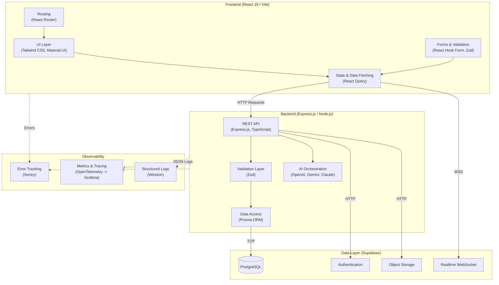
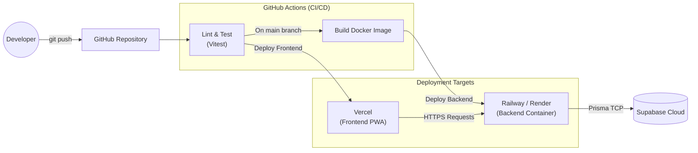
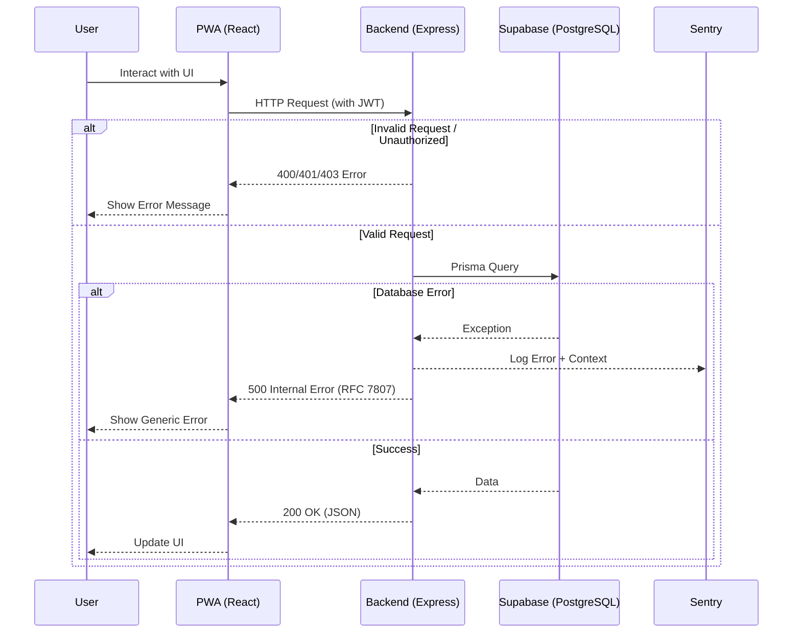

# Technology Stack — EV-JARVIS

> **Document ID:** DOC-012
> **Version:** 1.0.0
> **Status:** Complete
> **Project:** EV-JARVIS
> **Owner:** Principal Software Architect & Technology Lead
> **Last Updated:** 2026-08-02
> **Reference Documents:** System Architecture (DOC-009), C4 Model (DOC-010)
> **Document Type:** Architecture Documentation

---

# 1. Purpose

เอกสารนี้ระบุชุดเทคโนโลยี (Technology Stack) อย่างเป็นทางการสำหรับโปรเจกต์ EV-JARVIS ครอบคลุมตั้งแต่ Frontend, Backend, Database, AI, DevOps ตลอดจนเครื่องมือในการพัฒนาและการทดสอบ โดยมุ่งเน้นการกำหนดขอบเขตความรับผิดชอบของแต่ละเทคโนโลยี มาตรฐานการพัฒนา และเหตุผลในการตัดสินใจเลือกเทคโนโลยี (Technology Decisions) อย่างเป็นระบบ

เอกสารนี้ไม่ได้เป็นคู่มือการเขียนโค้ด (Implementation Guide) แต่เป็นเอกสารอ้างอิงหลักสำหรับทีมวิศวกรรมในการเลือกใช้เครื่องมือให้ถูกต้องตามสถาปัตยกรรมที่กำหนด

---

# 2. Technology Selection Philosophy

หลักปรัชญาในการเลือกเทคโนโลยีสำหรับ EV-JARVIS:

1.  **TypeScript First:** ใช้ TypeScript ทั้ง Frontend และ Backend เพื่อ Type Safety ระหว่าง Client และ Server ป้องกัน Runtime Error และเพิ่ม Developer Productivity
2.  **Managed Services over Self-Hosted:** เลือกใช้บริการแบบ Managed (เช่น Supabase, Vercel, Railway) ในระยะ MVP เพื่อให้ทีมโฟกัสที่การพัฒนา Business Logic แทนการดูแล Infrastructure
3.  **Standardization & Community:** เลือกเทคโนโลยีที่มีชุมชนนักพัฒนาขนาดใหญ่ มีการดูแลอย่างต่อเนื่อง (Active Maintenance) และเป็นมาตรฐานของอุตสาหกรรม (เช่น React, Express, PostgreSQL)
4.  **Performance & Scale:** เทคโนโลยีที่เลือกต้องรองรับการขยายตัว (Scalability) ตามสถาปัตยกรรม Modular Monolith และตอบสนองได้รวดเร็ว (Low Latency)
5.  **Multi-Provider Resilience:** สำหรับบริการที่มีความเสี่ยงด้านความพร้อมใช้งาน (เช่น AI) ต้องออกแบบให้รองรับหลายผู้ให้บริการ (Multi-provider) พร้อมระบบ Fallback อัตโนมัติ

---

# 3. Technology Stack Overview

สรุปเทคโนโลยีทั้งหมดที่ได้รับอนุมัติให้ใช้งานในโปรเจกต์:

| Category | Technology | Version | Purpose | Reason |
|---|---|---|---|---|
| **Frontend Framework** | React | 19 | UI Library หลักสำหรับการสร้าง PWA | Ecosystem ใหญ่, Component-based, ประสิทธิภาพสูง |
| **Frontend Language** | TypeScript | 5.x | ภาษาหลักสำหรับการเขียน Frontend | Type Safety ป้องกัน Runtime Error |
| **Build Tool** | Vite | Latest | Frontend Build Tool และ Dev Server | Build เร็ว Hot Module Replacement (HMR) ไว |
| **Styling** | Tailwind CSS | 3.x / 4.x | Utility-first CSS Framework | เขียน UI ได้รวดเร็ว, ขนาดไฟล์ CSS เล็ก |
| **UI Components** | Material UI (MUI) | 5.x | Ready-to-use Component Library | มี Component พื้นฐานครบถ้วน เหมาะกับ Dashboard |
| **Routing** | React Router | 6.x | Client-side Routing | มาตรฐานของ React สำหรับการจัดการ URL |
| **State & Data Fetching** | React Query (TanStack) | 5.x | จัดการ Server State, Caching, Syncing | ลด Boilerplate ของ Redux, จัดการ Cache อัตโนมัติ |
| **Forms** | React Hook Form | 7.x | จัดการฟอร์มแบบ Uncontrolled | ประสิทธิภาพสูง ไม่ Re-render บ่อย |
| **Validation** | Zod | 3.x | Schema Validation สำหรับ Client/Server | ทำงานร่วมกับ TypeScript ได้แนบเนียน (Type Inference) |
| **App Type** | PWA | - | Progressive Web App | รองรับ Offline, ติดตั้งลงมือถือได้, พัฒนาเร็วกว่า Native |
| **Backend Runtime** | Node.js | LTS (20.x) | Runtime Environment สำหรับ Backend | ใช้ JavaScript/TypeScript ครอบคลุมทั้ง Stack |
| **Backend Framework** | Express.js | 4.x / 5.x | Web Framework สำหรับ REST API | ยืดหยุ่น เป็นมาตรฐาน ควบคุม Middleware ได้อิสระ |
| **Backend Language** | TypeScript | 5.x | ภาษาหลักสำหรับการเขียน Backend | แลกเปลี่ยน Type กับ Frontend ได้ |
| **ORM** | Prisma | Latest | Object-Relational Mapping | Type-safe Database Query, Auto-generate Types |
| **Database** | PostgreSQL | 15+ | Relational Database หลัก (via Supabase) | โครงสร้างข้อมูลซับซ้อน มี Data Integrity สูง |
| **Auth Provider** | Supabase Auth | - | Identity & Authentication Service | รวมกับ PostgreSQL ได้ดี, รองรับ OAuth, JWT |
| **Object Storage** | Supabase Storage | - | เก็บไฟล์รูปภาพและเอกสาร | S3-compatible, จัดการสิทธิ์ด้วย RLS ได้ |
| **Realtime** | Supabase Realtime | - | WebSocket สำหรับ Push Event | เชื่อมกับ PostgreSQL Change Data Capture |
| **AI (Primary)** | OpenAI API | GPT-4o | LLM หลักสำหรับการคุยโต้ตอบ | คุณภาพสูงที่สุดในตลาด ปรับแต่ง Context ได้ดี |
| **AI (Secondary)** | Gemini API | Latest | LLM สำหรับ Multimodal & Fallback | รองรับรูปภาพได้ดีมาก และเป็นตัวเลือก Fallback ชั้นดี |
| **AI (Tertiary)** | Claude API | 3.x | LLM สำหรับ Long Context & Fallback | รองรับ Context กว้างและมีความปลอดภัยสูง |
| **Maps** | Google Maps Platform | - | API สำหรับแผนที่, สถานที่, เส้นทาง | ครอบคลุมสถานที่และข้อมูลเส้นทางที่ดีที่สุด |
| **Notification** | Firebase Cloud Messaging | - | บริการ Push Notification | รองรับ Cross-platform (Web PWA, iOS, Android) |
| **Unit/Integration Test**| Vitest | Latest | Testing Framework | ทำงานร่วมกับ Vite ได้รวดเร็ว API คล้าย Jest |
| **E2E Test** | Playwright | Latest | End-to-End Testing | ทดสอบ Browser ได้แม่นยำ และทำงานขนานได้ |
| **API Test** | Supertest | Latest | HTTP Assertion สำหรับ Express | ทดสอบ REST API ได้ง่ายและรวดเร็ว |
| **Source Control** | Git & GitHub | - | Version Control & Repository | มาตรฐานอุตสาหกรรม |
| **CI/CD** | GitHub Actions | - | Automation Pipeline | ผสานรวมกับ GitHub โดยตรง ไม่ต้องใช้ External Service |
| **Containerization**| Docker | - | จัดเตรียมและรัน Backend & Worker | สภาพแวดล้อมสม่ำเสมอตั้งแต่ Dev จนถึง Prod |
| **Dev Environment** | Docker Compose | - | จัดการ Container สำหรับ Local Dev | รัน Backend, Database, Redis พร้อมกันในคำสั่งเดียว |
| **Frontend Hosting** | Vercel | - | บริการ Hosting สำหรับ React PWA | Edge CDN, Auto Preview Deployments |
| **Backend Hosting** | Railway / Render | - | บริการ Hosting สำหรับ Docker Container | Auto Deploy, Autoscaling, ดูแลรักษาง่าย |
| **Database Hosting** | Supabase Cloud | - | Managed PostgreSQL & Services | ไม่ต้องจัดการ Infrastructure ของ Database เอง |
| **Error Tracking** | Sentry | Latest | จับ Error ทั้ง Frontend และ Backend | แสดง Stack Trace และข้อมูล Context ได้ละเอียด |
| **Tracing / Metrics** | OpenTelemetry | - | Distributed Tracing Standard | มาตรฐานเปิด ไม่ยึดติดกับ Vendor ใด |
| **Dashboard** | Grafana | - | ระบบแสดงผล Metrics จาก OpenTelemetry | ยืดหยุ่น เชื่อมต่อ Data Source ได้หลากหลาย |
| **Logging** | Winston | 3.x | Structured Logging สำหรับ Node.js | เขียน Log เป็น JSON เพื่อให้ระบบ Centralize อ่านง่าย |
| **API Standard** | REST API | - | รูปแบบการออกแบบ API | เข้าใจง่าย เครื่องมือทดสอบเยอะ |
| **API Docs** | OpenAPI 3.1 | - | ข้อกำหนดรูปแบบเอกสาร API | สร้างเอกสารอัตโนมัติ สร้าง Client Code ได้ |
| **Security Auth** | JWT | - | รูปแบบ Token สำหรับ Authentication | Stateless ตรวจสอบได้เร็ว |
| **Security Comm.** | HTTPS | TLS 1.3 | การเข้ารหัสการส่งข้อมูล | ป้องกัน Man-in-the-Middle Attack |
| **Security Config** | CORS, Helmet | - | Middleware สำหรับ HTTP Security | ป้องกันการเรียกข้าม Domain ผิดปกติและการโจมตีเบื้องต้น |

## 3.1 Technology Relationships Diagram

---

# 4. Frontend Stack

## 4.1 Technologies & Responsibilities

| Technology | Responsibility & Usage Rules |
|---|---|
| **React 19** | ใช้เป็น UI Framework หลัก สร้าง Component แบบ Functional พร้อม Hooks (หลีกเลี่ยง Class Component) |
| **TypeScript** | บังคับใช้ Strict Mode กำหนด Type ของ Props, State และ API Response ห้ามใช้ `any` หากไม่จำเป็นจริงๆ |
| **Vite** | ใช้สำหรับการ Build และ Development Server แทน Webpack ไม่ปรับแต่ง Configuration หากไม่จำเป็น |
| **Tailwind CSS** | ใช้สำหรับ Styling ระดับ Utility เขียนลงใน `className` โดยตรง เพื่อลดการเขียน Custom CSS |
| **Material UI (MUI)** | ใช้สำหรับ Complex Components (เช่น Tables, Data Grids, Dialogs, Date Pickers) ที่ Tailwind ต้องใช้เวลาเขียนนาน |
| **React Router** | จัดการ Client-side Routing รองรับ Code Splitting / Lazy Loading แยกตาม Feature |
| **React Query** | จัดการ Server State ทั้งหมด (Fetch, Cache, Sync, Update) ห้ามใช้ `useEffect` สำหรับดึงข้อมูล API |
| **React Hook Form** | จัดการ Form State แบบ Uncontrolled Component เพื่อลด Rerender และจัดการ Validation |
| **Zod** | สร้าง Schema สำหรับ Validate ข้อมูลฝั่ง Client และเชื่อมต่อกับ React Hook Form ผ่าน Resolver |
| **PWA (Vite PWA)** | สร้าง Manifest และ Service Worker สำหรับทำ Offline Mode, Caching Static Assets และ Add to Home Screen |

## 4.2 Frontend Architecture Rules
- ใช้แนวคิด **Feature-based Folder Structure** (เช่น `src/features/vehicle/`) แยกโค้ดตาม Business Domain
- ใช้ **Custom Hooks** เพื่อแยก Business Logic ออกจาก UI Component
- **State Management:** แบ่งเป็น 3 ระดับ 1) Server State = React Query, 2) Global Client State = Zustand หรือ React Context (เฉพาะที่จำเป็น), 3) Local UI State = `useState`

---

# 5. Backend Stack

## 5.1 Technologies & Responsibilities

| Technology | Responsibility & Usage Rules |
|---|---|
| **Node.js LTS** | Runtime หลักสำหรับ API Server และ Background Workers ต้องกำหนด Version ให้ตรงกันทั้ง Local และ Production |
| **Express.js** | Web Framework สำหรับจัดการ HTTP Request/Response สร้าง Router และ Middleware (Auth, Error Handling, Logging) |
| **TypeScript** | บังคับใช้ Strict Mode กำหนด Type ของ Request Body, Params, Query และ Response Data |
| **Prisma ORM** | ติดต่อฐานข้อมูล PostgreSQL ผ่าน Schema แบบ Code-first ใช้ในการ Generate Client และทำ Database Migrations |

## 5.2 Backend Architecture Rules
- นำหลักการ **Clean Architecture** ประยุกต์ใช้ แบ่ง Layer เป็น Controllers (API), Services (Business Logic) และ Repositories (Data Access)
- ใช้ **Dependency Injection** (หรือ Module Pattern เบื้องต้น) เพื่อให้ Service ทดสอบ (Mock) ได้ง่าย
- ส่ง Response ด้วยมาตรฐาน **RFC 7807 (Problem Details)** สำหรับ Error

---

# 6. Database Stack

## 6.1 Database Configuration

- **Engine:** PostgreSQL 15+ (Hosted on Supabase)
- **Schema Management:** จัดการโครงสร้างฐานข้อมูลผ่าน `prisma/schema.prisma` ห้ามแก้โครงสร้างจาก Supabase Dashboard โดยตรง (ยกเว้น RLS หรือ Role)
- **Connection Pooling:** ใช้ PgBouncer (ผ่าน Supabase) เพื่อจัดการ Connection จำนวนมากจาก Serverless / Container Environments

## 6.2 Prisma & Migration Strategy
- **ORM:** Prisma Client
- **Migration Tool:** `prisma migrate dev` สำหรับ Local, `prisma migrate deploy` สำหรับ Staging/Production ใน CI/CD
- **Strategy:** ทุกการเปลี่ยนแปลงของ Database Schema ต้องสร้าง Migration File เสมอ และเก็บเข้า Git Version Control เพื่อให้สามารถ Rollback หรือ สร้าง Environment ใหม่ได้ทันที

---

# 7. AI Stack

ระบบผู้ช่วย (AI Assistant) สำหรับ EV-JARVIS ออกแบบมาให้มีความยืดหยุ่น ทนทาน และประหยัดค่าใช้จ่ายด้วย Multi-provider Strategy

## 7.1 Provider Responsibilities

| Provider | Model | Responsibility |
|---|---|---|
| **OpenAI API** | GPT-4o | **Primary:** ประมวลผลข้อความทั่วไป วิเคราะห์ข้อมูล Telemetry ตอบคำถามทางเทคนิคที่ต้องการความแม่นยำสูง |
| **Gemini API** | Gemini 1.5 Flash / Pro | **Secondary:** การวิเคราะห์รูปภาพ (เช่น อัปโหลดรูปหน้าปัดรถยนต์ รูปใบเสร็จค่าชาร์จ) และเป็น Fallback Tier 1 |
| **Claude API** | Claude 3.5 Sonnet | **Tertiary:** วิเคราะห์เนื้อหาขนาดยาว (เช่น ประวัติการชาร์จเป็นเดือน) และเป็น Fallback Tier 2 |

## 7.2 Provider Selection & Fallback Strategy

ระบบจะใช้ **Strategy Pattern** ในการเลือก AI Provider:
1. **Default Logic:** ส่ง Request ไปยัง OpenAI (Primary)
2. **Multimodal Logic:** หาก Request มี Image File ให้สลับไปใช้ Gemini ทันที
3. **Fallback Logic:** หาก OpenAI API ไม่ตอบสนอง (Timeout) หรือติด Rate Limit, ระบบจะสลับไปใช้ Gemini แบบอัตโนมัติ (Retry 1) และหากยังล้มเหลว จะสลับไปใช้ Claude (Retry 2)
4. **Graceful Degradation:** หากทุก AI Provider ล่ม จะคืนค่า Error อธิบายให้ผู้ใช้ทราบอย่างสุภาพ

## 7.3 Cost Optimization
- **Caching:** Caching บริบท (Context) ของผู้ใช้ใน Redis ชั่วคราว เพื่อไม่ต้องส่งประวัติการตั้งค่ารถเข้าไปใน Prompt ทุกครั้ง
- **Prompt Engineering:** กระชับ System Prompt ส่งมอบ Context เท่าที่จำเป็นตาม Action ที่ผู้ใช้ถาม

---

# 8. Infrastructure Stack

## 8.1 Deployment Architecture

| Component | Technology | Responsibility |
|---|---|---|
| **Frontend Deployment** | Vercel | ให้บริการไฟล์ Static สำหรับ React PWA พร้อม Edge CDN (Global Cache) และ Preview Branch |
| **Backend Deployment** | Railway (or Render) | รัน Docker Container สำหรับ Express.js API และ BullMQ Workers รองรับ Autoscaling |
| **Containerization** | Docker | บรรจุ Backend App, Dependencies และ Runtime ลงใน Image (ใช้วิธี Multi-stage Build ร่วมกับ Alpine) |
| **CI/CD Pipeline**| GitHub Actions | รัน Automated Tests, Linter, Build Image และ Deploy อัตโนมัติเมื่อเกิดการ Push/Merge สู่ Branch หลัก |

## 8.2 Deployment Technology Diagram

---

# 9. Development Tools

มาตรฐานเครื่องมือที่ทีมพัฒนาทุกคนต้องใช้:

- **Editor/IDE:** VS Code (Visual Studio Code) หรือ Cursor แนะนำให้แชร์ `settings.json` ผ่าน Repository
- **Linter & Formatter:** ESLint (Linting กฎของ TS/React) และ Prettier (จัด Format โค้ดอัตโนมัติบนการ Save)
- **Version Control:** Git (Local) เชื่อมต่อกับ GitHub (Remote) ทำตามแบบแผน GitHub Flow
- **API Client:** Postman หรือ Bruno สำหรับทดสอบ HTTP REST APIs ระหว่างพัฒนา (แนะนำเก็บ Bruno Collection ใน Git)
- **UI Design:** Figma สำหรับการทำ Prototyping และตรวจสอบ Spec การออกแบบ (Handoff)

---

# 10. Testing Stack

## 10.1 Testing Strategy

1. **Unit Test (Vitest):** ทดสอบ Business Logic, Utility Functions และ Service Methods แบบโดดเดี่ยว (Mock ฐานข้อมูล) - *เป้าหมาย: ตรวจจับ Logic Error*
2. **Integration Test (Vitest / Supertest):** ทดสอบ API Endpoints ตั้งแต่ Controller ทะลุลงไปถึง Test Database - *เป้าหมาย: ตรวจสอบการเชื่อมต่อโมดูล*
3. **E2E Test (Playwright):** จำลองพฤติกรรมผู้ใช้งานจริงบน Browser กดปุ่ม กรอกฟอร์ม และตรวจสอบผลลัพธ์ UI - *เป้าหมาย: ยืนยัน Flow หลัก (Critical Paths)*
4. **Performance Test:** ทดสอบโหลด (Load Testing) เบื้องต้นผ่าน Artillery หรือ K6 (สำหรับ API ที่ถูกเรียกบ่อย)

---

# 11. Security Stack

## 11.1 Security Implementation

| Layer | Implementation |
|---|---|
| **Authentication** | ใช้ **JWT (JSON Web Token)** ที่ออกโดย Supabase Auth ฝั่ง Client ต้องเก็บ Token ในสถานที่ปลอดภัย (เช่น Memory + Secure Cookie หรือ IndexedDB แบบเข้ารหัส) |
| **Authorization** | Backend ตรวจสอบ Role (`owner`, `admin`) ผ่าน JWT Claim และตรวจสิทธิ์การเป็นเจ้าของ (Ownership Verification) ในระดับ Service |
| **Secrets & ENV** | ห้าม Commit `.env` เข้า Git เด็ดขาด จัดเก็บความลับ (เช่น OpenAI Key) ผ่าน **Environment Variables** (ใน Railway/Vercel) และ GitHub Secrets |
| **Encryption** | การส่งข้อมูลทั้งหมดต้องผ่านช่องทาง **HTTPS (TLS 1.3)** ข้อมูลรหัสผ่านถูก Hash ด้วย bcrypt บน Supabase อัตโนมัติ |
| **HTTP Security** | Backend ใช้ **Helmet** ตั้งค่า Security Headers พื้นฐาน และเปิดใช้งาน **CORS** ให้อนุญาตเฉพาะ Domain ของ Frontend เท่านั้น |

---

# 12. Performance Strategy

เพื่อให้ EV-JARVIS ตอบสนองได้อย่างรวดเร็วและใช้ Resource ได้อย่างคุ้มค่า:

1. **Caching (API Level):** นำ Redis (via Upstash) มาทำ Caching สำหรับข้อมูลที่ไม่มีการเปลี่ยนแปลงบ่อย (เช่น ประเภทรถยนต์, ข้อมูล POI สาธารณะ) 
2. **Lazy Loading:** Frontend ใช้ `React.lazy()` เพื่อ Split โค้ดตาม Route ผู้ใช้โหลดเฉพาะ JavaScript ของหน้าที่กำลังดู
3. **Image Optimization:** เก็บรูปภาพบน Supabase Storage และใช้ฟีเจอร์ Transformation/Optimization ปรับขนาดรูปและบีบอัดก่อนส่งให้ Client
4. **API Optimization:** ควบคุมขนาด Payload ที่ส่งคืนจาก Backend ส่งเฉพาะข้อมูลที่ UI ต้องการผ่าน DTO (Data Transfer Object)
5. **Database Optimization:** สร้าง Database Indexes (ใน Prisma Schema) บน Foreign Keys หรือ Field ที่ถูกใช้ในเงื่อนไขการค้นหา (WHERE clause) เป็นประจำ

---

# 13. Monitoring Stack

## 13.1 Observability

- **Logging (Winston):** ระบบ Backend ต้องเขียน Log เป็นโครงสร้าง JSON (Structured Logging) ประกอบด้วย `level`, `message`, `timestamp` และ `requestId`
- **Crash Reporting (Sentry):** ติดตั้ง Sentry SDK ทั้งบน React (Frontend) และ Express (Backend) เพื่อจับ Unhandled Exceptions, Promise Rejections และแจ้งเตือนทีมผ่าน Slack เมื่อเกิด Error
- **Tracing & Metrics (OpenTelemetry + Grafana):** ติดตั้ง OpenTelemetry เพื่อตรวจสอบคอขวด (Bottleneck) ระหว่าง Request (เช่น ใช้เวลา Query นาน หรือ AI Provider ตอบสนองช้า) ส่งข้อมูลไปแสดงผลบน Dashboard ของ Grafana

## 13.2 Request Lifecycle Diagram

---

# 14. Dependency Management

นโยบายการจัดการแพ็กเกจบน Node.js (npm/yarn/pnpm):

- **Package Policy:** อนุญาตให้ติดตั้งเฉพาะ Library ที่มีการใช้งานแพร่หลาย มีการอัปเดตล่าสุดภายใน 1 ปี และได้รับอนุญาตลิขสิทธิ์แบบ Open Source (MIT, Apache 2.0)
- **Version Policy:** ระบุหมายเลขเวอร์ชันของ Library หลักแบบ Exact Match (เอาเครื่องหมาย `^` ออกสำหรับ Core Libraries) ป้องกันปัญหาโค้ดพังตอน Deploy
- **Upgrade Strategy:** กำหนดการรัน `npm audit` บน CI/CD ทุกครั้ง หากพบ Vulnerability ระดับ High/Critical ต้องหยุดการ Merge PR ทันที และทำการอัปเกรดแบบรายเดือนโดยตั้ง Task เพื่อใช้เครื่องมือเช่น Dependabot ตรวจสอบ

---

# 15. Coding Standards Summary

มาตรฐานการเขียนโค้ดเพื่อควบคุมคุณภาพ (รายละเอียดเชิงลึกอยู่ใน `04_Development/*`):

- **TypeScript Rules:** บังคับเปิด `strict: true` ห้ามใช้งาน `@ts-ignore` และ `any` หากไม่มีเหตุผลอันควร (ต้องมีคอมเมนต์กำกับ)
- **Folder Structure:** แยกโค้ดตาม Domain Feature ไม่จัดระเบียบตามประเภทไฟล์ (ใช้ Feature-Sliced Design เบื้องต้น)
- **Naming:** 
  - ตัวแปร/ฟังก์ชัน: `camelCase`
  - คลาส/คอมโพเนนต์/Type/Interface: `PascalCase`
  - ค่าคงที่ (Constants): `UPPER_SNAKE_CASE`
  - ไฟล์: `kebab-case.ts`
- **Error Handling:** ฝั่ง Backend ต้องโยน Custom Error Classes ที่สืบทอดจาก `Error` ฐาน ฝั่ง Frontend จัดการรับ Error ที่ Global State หรือ Error Boundary 

---

# 16. Technology Decision Matrix

ตารางสรุปการตัดสินใจและเปรียบเทียบทางเลือก (Trade-offs):

| Technology | Alternative Considered | Why Selected | Trade-offs |
|---|---|---|---|
| **React + Vite** | Next.js | ต้องการสร้าง PWA ที่เน้น Client-side เป็นหลัก ไม่จำเป็นต้องใช้ SSR/SEO | ขาด SSR, การทำ SEO ยากกว่า Next.js เล็กน้อย (แต่ไม่ใช่ปัญหาของแอปจัดการรถ) |
| **Express.js** | NestJS | ทีมมีความคุ้นเคยสูง ปรับแต่ง Middleware ได้อิสระ โครงสร้างบางเบา (Lightweight) | ไม่มี Framework Convention ชัดเจน ต้องบังคับโครงสร้างผ่าน Rules อย่างเข้มงวด |
| **Prisma ORM** | TypeORM | ให้ Type Safety สูงสุด (Type inference) ทำงานร่วมกับ TypeScript แนบเนียน Migration ใช้งานง่าย | ประสิทธิภาพกับ Query ซับซ้อนมาก ๆ (Complex JOINs) อาจช้ากว่า Raw SQL |
| **Supabase** | Firebase | ต้องการฐานข้อมูลเชิงสัมพันธ์ (Relational) เพราะ Entity รถ แบตเตอรี่ ทริป มีความสัมพันธ์กันสูง (PostgreSQL ตอบโจทย์กว่า NoSQL) | ต้องเข้าใจการเขียน SQL Migration เล็กน้อย การจัดการ RLS ซับซ้อนกว่า Firebase Rule |
| **Railway / Render** | AWS ECS / EKS | Deploy ง่ายกว่าเพียงเชื่อมโยงกับ GitHub Repository เหมาะกับทีมขนาดเล็กถึงกลางในเฟสแรก | ควบคุม Network Layer หรือเซิร์ฟเวอร์ระดับ OS ได้น้อยกว่าตั้งเองบน AWS |

---

# 17. Future Technology Roadmap

แผนที่นำทางเทคโนโลยีสำหรับการขยายสเกลในอนาคต:

| Horizon | Timeline | Technologies to Introduce | Purpose |
|---|---|---|---|
| **Near-term** | Version 1.1 | **Redis (Upstash)** | เพิ่มระบบ Queue งานเบื้องหลังด้วย BullMQ (เช่น การซิงค์ Telemetry แบบ Asynchronous) และ Caching |
| **Mid-term** | Version 2.0 | **GraphQL (Apollo)** | เพิ่ม Graph API สำหรับ Frontend ให้ออกแบบ Query ดึงข้อมูลตามโครงสร้างที่ต้องการลด Overfetching |
| **Mid-term** | Version 2.0 | **React Native** | นำ Business Logic ของ PWA ไปสร้างแอปพลิเคชันมือถือแบบ Native ลง App Store / Play Store |
| **Long-term**| Version 3.0+ | **Kubernetes (K8s)** | อพยพจาก Railway ไปรันบน Kubernetes (EKS/GKE) สำหรับสถาปัตยกรรม Microservices เต็มรูปแบบ |

---

# 18. Revision History

| Version | Date | Status | Author | Change Description |
|---|---|---|---|---|
| 1.0.0 | 2026-08-02 | Complete | Principal Software Architect & Technology Lead | เอกสารระบุชุดเทคโนโลยี (Tech Stack) ฉบับเริ่มต้น ประกอบด้วยเทคโนโลยีฝั่ง Frontend (React, Vite, MUI), Backend (Express, Prisma), Database (Supabase PostgreSQL), AI, DevOps และแนวปฏิบัติสอดคล้องกับ System Architecture และ Requirements |
