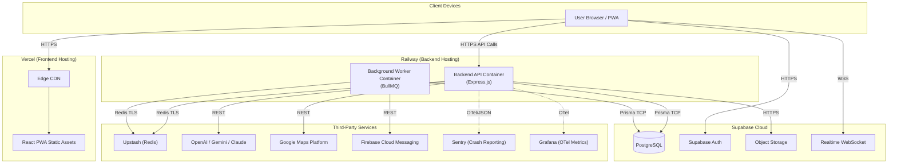
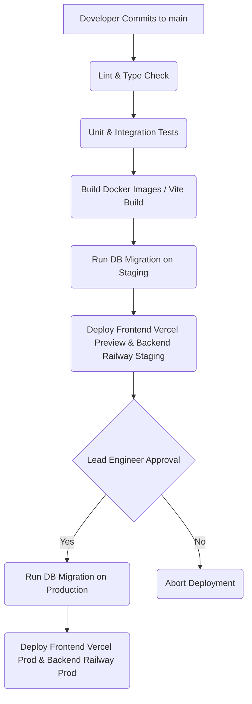

# Deployment Architecture — EV-JARVIS

> **Document ID:** DOC-011
> **Version:** 1.1.0
> **Status:** Complete
> **Project:** EV-JARVIS
> **Owner:** Principal Cloud Architect & DevOps Lead
> **Last Updated:** 2026-08-02
> **Reference Documents:** System Architecture (DOC-009), C4 Model (DOC-010), Tech Stack (DOC-012)
> **Document Type:** Deployment Architecture Documentation

---

# Table of Contents

1. [Deployment Overview](#1-deployment-overview)
2. [Environment Strategy](#2-environment-strategy)
3. [Infrastructure Architecture](#3-infrastructure-architecture)
4. [Frontend Deployment](#4-frontend-deployment)
5. [Backend Deployment](#5-backend-deployment)
6. [AI Services Deployment](#6-ai-services-deployment)
7. [Database Deployment](#7-database-deployment)
8. [Storage Strategy](#8-storage-strategy)
9. [Networking](#9-networking)
10. [Reverse Proxy](#10-reverse-proxy)
11. [Docker Architecture](#11-docker-architecture)
12. [Container Structure](#12-container-structure)
13. [CI/CD Deployment Flow](#13-cicd-deployment-flow)
14. [Secrets Management](#14-secrets-management)
15. [Monitoring](#15-monitoring)
16. [Logging](#16-logging)
17. [Backup Strategy](#17-backup-strategy)
18. [Disaster Recovery](#18-disaster-recovery)
19. [Scaling Strategy](#19-scaling-strategy)
20. [Availability](#20-availability)
21. [Deployment Security](#21-deployment-security)
22. [Release Workflow](#22-release-workflow)
23. [Rollback Strategy](#23-rollback-strategy)
24. [Deployment Checklist](#24-deployment-checklist)
25. [Revision History](#25-revision-history)

---

# 1. Deployment Overview

เอกสารนี้กำหนดสถาปัตยกรรมการนำระบบ (Deployment Architecture) ของ EV-JARVIS ขึ้นสู่สภาพแวดล้อมจริง โดยออกแบบบนแนวคิด Managed Services และ Serverless/Containerized Infrastructure เพื่อลดภาระการดูแลระบบ (Operational Overhead) สำหรับ MVP

เป้าหมายการนำระบบขึ้นทำงานคือ Zero-Downtime, การติดตั้งผ่าน Automated Pipeline อัตโนมัติทั้งหมด (GitHub Actions) และมีความพร้อมสำหรับการมอนิเตอร์และแก้ไขปัญหาในแบบ Real-time ข้อมูลอ้างอิงทั้งหมดในเอกสารนี้สอดคล้องกับชุดเทคโนโลยีที่ประกาศใน TECH_STACK.md ทุกประการ

---

# 2. Environment Strategy

ระบบแบ่งสภาพแวดล้อม (Environment) ออกเป็น 4 ระดับ เพื่อแยกข้อมูลจริงออกจากการพัฒนาและการทดสอบอย่างเด็ดขาด:

| Environment | Purpose | Infrastructure & Configuration |
|---|---|---|
| **Local** | สำหรับนักพัฒนาในทีมเขียนโค้ดและทดสอบด้วยตัวเองบนเครื่องส่วนตัว | ใช้ Docker Compose รัน Backend API, BullMQ Worker, Supabase Local, Redis Local และใช้ Vite Dev Server รัน Frontend |
| **Development** | สำหรับการทดสอบอัตโนมัติของ CI/CD Pipeline (Integration/E2E Tests) | รันบน GitHub Actions Runner หรือบริการ Container ชั่วคราว ใช้ Mock API สำหรับระบบภายนอก |
| **Staging** | เหมือน Production ทุกประการ ใช้สำหรับทดสอบโดย QA และการตรวจสอบรอบสุดท้าย (UAT) | Frontend อยู่บน Vercel Preview, Backend บน Railway (Staging), ใช้ Supabase Staging Project แยกเด็ดขาดจากระบบจริง |
| **Production** | ระบบจริงสำหรับให้ผู้ใช้บริการ | Frontend บน Vercel Production, Backend บน Railway Production, ใช้ Supabase Production Project และรับข้อมูลจริง |

---

# 3. Infrastructure Architecture

โครงสร้างพื้นฐานของ EV-JARVIS ใช้ผู้ให้บริการ Cloud และ Managed Services ต่อไปนี้ (อ้างอิง TECH_STACK.md):

---

# 4. Frontend Deployment

| Aspect | Detail |
|---|---|
| **Platform** | Vercel |
| **Artifacts** | Static HTML, CSS, JS (Vite Build output) |
| **Routing** | React Router จัดการฝั่ง Client |
| **Caching** | ใช้ Vercel Edge Network Cache ควบคุมด้วย `Cache-Control: public, max-age=31536000, immutable` สำหรับ Assets ที่มี Hash ในชื่อไฟล์ |
| **PWA** | มีการ Generate Service Worker และ Web Manifest ฝังไปกับ Build ทันที |

---

# 5. Backend Deployment

| Aspect | Detail |
|---|---|
| **Platform** | Railway (Alternative: Render หากมีปัญหา) |
| **Technology** | Node.js LTS (20.x), Express.js |
| **Scaling** | Horizontal Auto-scaling ตาม CPU Usage บน Railway |
| **Health Checks**| Railway อาศัย Endpoint `/healthz` เพื่อตรวจสอบสถานะ ถ้า Container ตอบ 200 จะทำการ Route Traffic เข้ามา |
| **Dependencies** | ใช้ `npm ci` เพื่อโหลด Dependency แบบ Lock version ป้องกันความผิดพลาดตอน Build |

---

# 6. AI Services Deployment

การ Deploy ระบบที่พึ่งพา AI (OpenAI, Gemini, Claude) จะไม่มีการตั้ง Server AI เอง แต่จะอาศัย API ของ Provider ภายนอกทั้งหมด โดยมีโครงสร้างดังนี้:

- **Keys Management:** API Key ของทั้ง 3 ค่ายถูกเก็บเป็น Environment Variables อย่างปลอดภัยใน Railway
- **Fallback Mechanism:** จัดการในระดับ Backend API (Code Level) หาก Provider หลัก Timeout/Rate Limited ระบบจะเรียก Provider สำรอง
- **Context Caching:** ใช้ Upstash Redis ในการทำ Caching บริบท เพื่อลดจำนวน Request และ Token ที่ส่งไปยัง API เหล่านี้

---

# 7. Database Deployment

| Aspect | Detail |
|---|---|
| **Platform** | Supabase Cloud (Managed PostgreSQL) |
| **Connection** | การเชื่อมต่อจาก Backend ไป Database ใช้ Prisma ORM ผ่าน PgBouncer (Connection Pooling) เพื่อรองรับ Scale |
| **Migrations** | โครงสร้างตารางจัดการผ่าน `prisma/schema.prisma` การอัปเดต Schema ทำได้โดยรัน `npx prisma migrate deploy` ใน CI/CD |
| **Data Isolation**| แบ่ง Project เป็น Staging Project และ Production Project แยกกันอย่างชัดเจนที่ระดับ Supabase Cloud |

---

# 8. Storage Strategy

- **File Storage:** ใช้ **Supabase Storage** (ซึ่ง Backup บน S3 โดยอัตโนมัติ) 
- **CDN:** ใช้ CDN ของ Supabase ในการเสิร์ฟรูปภาพและเอกสารของผู้ใช้ที่ต้องการโหลดเร็ว
- **Security:** ปกป้องไฟล์ภาพที่ละเอียดอ่อนด้วย Row Level Security (RLS) Policy บนตาราง `storage.objects`

---

# 9. Networking

- **DNS:** ชื่อโดเมนถูกจัดการผ่าน Cloudflare (หรือ Vercel DNS)
- **Frontend URL:** `app.ev-jarvis.com` (Vercel)
- **Backend URL:** `api.ev-jarvis.com` (Map CNAME ไปยัง Railway URL)
- **Internal Traffic:** การสื่อสารระหว่าง `ev-jarvis-api` และ `ev-jarvis-worker` ไม่ผ่าน Public Internet สามารถสื่อสารผ่าน Private Network ของ Railway ได้
- **WebSocket:** การเชื่อมต่อ Realtime จัดการโดยโดเมนของ Supabase โดยตรง `*.supabase.co`

---

# 10. Reverse Proxy

ในสถาปัตยกรรมนี้ไม่มีการตั้ง Nginx หรือ HAProxy เอง เนื่องจากใช้บริการ Managed Services:
- **Vercel Edge:** ทำหน้าที่เสมือน Reverse Proxy และ CDN ฝั่ง Frontend 
- **Railway Ingress:** มีระบบ Envoy proxy อัตโนมัติ (Built-in proxy) ทำหน้าที่ Load Balancing จัดการ HTTPS SSL/TLS Termination ก่อนส่ง Traffic ให้ Backend Container

---

# 11. Docker Architecture

Backend ของโปรเจกต์นี้บรรจุใน Docker Container โดยมีมาตรฐานดังนี้:
- **Multi-stage Build:** แยก Build stage (Install devDependencies, run build) ออกจาก Production stage เพื่อให้ Image สุดท้ายมีขนาดเล็ก
- **Base Image:** `node:20-alpine` (มีขนาดเล็ก เพิ่มความปลอดภัย)
- **User:** รัน Process ภายใน Docker ด้วย User `node` (Non-root user) ป้องกันการโจมตี Container Escape
- **Immutability:** Docker Image จะถูก Build ครั้งเดียวและถือว่าเป็น Immutable ใช้ Image ตัวเดิม Deploy ไปทั้ง Staging และ Production เพื่อให้พฤติกรรมเหมือนกัน

---

# 12. Container Structure

| Container Name | Base Image | Role | Port | Health Check |
|---|---|---|---|---|
| `ev-jarvis-api` | `node:20-alpine` | รัน Express.js รองรับ Public REST Request | `4000` | HTTP GET `/healthz` |
| `ev-jarvis-worker` | `node:20-alpine` | รัน BullMQ Worker เพื่อดึงคิวจาก Redis ไปรัน Background Task (ไม่มี Public Route) | `none` | อาศัย Container Status |

---

# 13. CI/CD Deployment Flow

เครื่องมือที่ใช้คือ **GitHub Actions** ทุกขั้นตอนเป็น Automation ยกเว้นการปล่อย (Release) ขึ้น Production ที่ต้องการกด Approve

---

# 14. Secrets Management

ระบบควบคุมความลับอย่างเข้มงวด:
- **GitHub Secrets:** เก็บค่าความลับทั้งหมดที่จะถูกใช้ตอน Build หรือ Deploy (เช่น `DATABASE_URL`, `OPENAI_API_KEY`)
- **Runtime Variables:** ค่าใน GitHub Secrets จะถูก Inject เข้าสู่ Vercel และ Railway ในรูป Environment Variables
- **No Hardcoding:** ห้ามเขียน Key ใน Source Code หากตรวจพบให้ทำการ Rotate Key ทันที
- **Access Control:** เฉพาะผู้ดูแลระบบ (Repository Admin) เท่านั้นที่มีสิทธิ์เข้าถึงหรือปรับแก้ตัวแปรความลับ

---

# 15. Monitoring

ระบบใช้ชุดเครื่องมือ Observability ตามข้อกำหนดใน Tech Stack:
- **Sentry:** ผูก SDK ไว้ที่ระดับ Frontend (React Error Boundary) และ Backend (Express Error Middleware) สำหรับจับ Crash และ Exception
- **OpenTelemetry (OTel):** เครื่องมือสำหรับ Distributed Tracing ทำให้สามารถวัดผล Latency ได้ตั้งแต่รับ Request จนถึงเวลาที่ใช้ในการ Query ฐานข้อมูลหรือเรียก AI
- **Grafana:** เชื่อมต่อและดึง Metrics จาก OTel ไปแสดงเป็นกราฟแดชบอร์ด

---

# 16. Logging

- **Winston:** Backend ใช้ Winston ในการเขียน Log แทน `console.log` 
- **Structured JSON Logs:** ทุก Log ต้องอยู่ในรูปแบบ JSON เพื่อการ Search ได้ง่าย และบรรจุ `requestId` กำกับเสมอ
- **Log Aggregation:** Log ของ Backend บน Railway จะถูกส่งตรงเข้าระบบ Logs ของ Railway หรือสตรีมไปยังระบบส่วนกลาง (เช่น Grafana Loki)
- **Sensitive Data:** ห้ามบันทึก Password, Token และ API Key ใน Log

---

# 17. Backup Strategy

| Component | Strategy |
|---|---|
| **Database (Supabase)** | ทำ Daily Backup อัตโนมัติทุกวันโดยผู้ให้บริการ + เปิดใช้งานโหมด Point-in-Time Recovery (PITR) เพื่อให้สามารถ Rollback ย้อนเวลากลับไปได้ระดับนาทีในรอบสัปดาห์ |
| **Object Storage** | ข้อมูลรูปภาพเก็บใน Supabase Storage ซึ่งรองรับการเข้ารหัสและ Backup ตามมาตรฐาน AWS S3 (99.999999999% Durability) |
| **Code & Config** | เก็บอยู่บน GitHub มี History ย้อนหลัง |

---

# 18. Disaster Recovery

กรณีเกิดปัญหาขั้นร้ายแรง เช่น แพลตฟอร์มล่ม:
- **RPO (Recovery Point Objective):** 1 ชั่วโมง (ยอมให้สูญเสียข้อมูลได้มากสุด 1 ชั่วโมงที่ผ่านมา ซึ่ง Supabase PITR ปกป้องข้อมูลได้ดีกว่านี้)
- **RTO (Recovery Time Objective):** 30 นาที (เวลาที่ใช้ในการกู้คืนระบบให้กลับมาใช้งานได้)
- **Recovery Plan:** หาก Railway ล่ม, ให้ปรับเปลี่ยน GitHub Actions YAML Deploy ไปที่ Render แทน เนื่องจาก Docker Image เดิมสามารถรันได้ทันทีโดยไม่ต้องแก้ไขโค้ด

---

# 19. Scaling Strategy

ระบบออกแบบให้สเกลได้อย่างอิสระ:
- **Frontend:** Vercel ขยายตัวโดยใช้ Edge Network อัตโนมัติตามจำนวนผู้ใช้
- **Backend API:** Railway จะเพิ่ม Container ใหม่ (Scale Out) หากค่าเฉลี่ย CPU หรือ Memory เกิน 70% 
- **Database:** Supabase ขยาย Connection ป้องกันคอขวดผ่าน PgBouncer และใช้ Redis (Upstash) เพื่อแบ่งเบาการอ่าน (Read Load) ของ Query ที่ซ้ำเดิม

---

# 20. Availability

เป้าหมาย Uptime ของระบบคือ **99.0%** ต่อเดือน:
- อาศัยการทำ Rolling Deployment (เปิด Container ใหม่ให้พร้อมรับ Traffic ก่อนค่อยดับ Container เก่า) เพื่อหลีกเลี่ยง Downtime ขณะ Release
- การแบ่งส่วนของ Worker ออกจาก API เพื่อให้ Background Jobs ที่ประมวลผลหนัก ไม่กระเทือนต่อเวลาการตอบสนองของ Web API หลักผู้ใช้

---

# 21. Deployment Security

- **Network Encryption:** การส่งข้อมูลบังคับผ่าน `HTTPS (TLS 1.3)` เท่านั้น (HSTS)
- **HTTP Headers:** ใช้ Helmet จัดการใส่ Header เช่น Content Security Policy (CSP), X-Frame-Options 
- **CORS:** กำหนดโดเมนอนุญาตที่ชัดเจนที่ฝั่ง Backend (`app.ev-jarvis.com`) ปฏิเสธ Request จาก Domain ไม่พึงประสงค์
- **Vulnerability Scan:** รันคำสั่ง `npm audit` ภายใน CI ก่อนปล่อยผ่าน

---

# 22. Release Workflow

1. ใช้โครงสร้างแบบ **GitHub Flow** นักพัฒนาแตก Branch (เช่น `feature/login`) และ Push โค้ด
2. เปิด Pull Request (PR) เข้าสู่ Branch `main`
3. CI ตรวจสอบ Code (Lint, Unit Test)
4. เมื่อได้รับการ Approve จากสมาชิกในทีม, PR ถูกรวมเข้า `main`
5. ระบบ Deploy ไปยัง **Staging** แบบอัตโนมัติ
6. QA / Lead ตรวจสอบ และหากสมบูรณ์ จะกดปุ่มใน GitHub Actions สั่ง Deploy ขึ้น **Production**

---

# 23. Rollback Strategy

| Scenario | Rollback Plan |
|---|---|
| **Frontend Bug** | ไปที่หน้าแดชบอร์ด Vercel แล้วเลือก Rollback (Revert) ไปยังการ Deploy ก่อนหน้า ซึ่งใช้เวลาเพียงระดับวินาที |
| **Backend Code Bug** | กดยกเลิก Deployment ใน Railway หรือใช้คำสั่ง Revert Commit ใน GitHub เพื่อให้ CI สั่ง Build เวอร์ชั่นที่ใช้งานได้ล่าสุดกลับมา |
| **Database Migration Bug** | ใช้ Script ย้อนกลับข้อมูล (Down Migration) หากเป็น Data Issue แต่สำหรับ Code Issue ควรใช้แนวทาง "Forward Fix" คือแก้บั๊กแล้วทำ Migration เดินหน้าเท่านั้น |

---

# 24. Deployment Checklist

**ก่อน (Pre-Deployment):**
- [ ] PR ชิ้นล่าสุดผ่านการ Approved ทั้ง Code และ Unit Test
- [ ] หากมี Environment Variables ตัวใหม่ ให้มั่นใจว่าแอดเข้าระบบ Production Secrets แล้ว
- [ ] เตรียม Down-migration หรือ Rollback Script สำหรับแก้ปัญหา Database Schema

**ระหว่าง (During Deployment):**
- [ ] ตรวจสอบว่าระบบ CI รันผ่าน (ไฟเขียว)
- [ ] เฝ้าติดตาม Grafana และ Sentry ภายใน 5-10 นาทีหลังปล่อย

**หลัง (Post-Deployment):**
- [ ] ดำเนินการ Smoke Test ขั้นพื้นฐานบน Production (เช่น ล็อกอิน, เข้าหน้าแดชบอร์ด)
- [ ] อัปเดต Revision / CHANGELOG และประกาศให้ทีมรับทราบใน Slack

---

# 25. Revision History

| Version | Date | Status | Author | Change Description |
|---|---|---|---|---|
| 1.0.0 | 2026-08-02 | Complete | Principal Cloud Architect | ร่างโครงสร้าง Deployment เริ่มต้น |
| 1.1.0 | 2026-08-02 | Complete | Principal Cloud Architect & DevOps Lead | อัปเดตและปรับปรุงเนื้อหาเอกสารให้ตรงตาม Tech Stack (Vercel, Railway, Supabase) จัดโครงสร้างใหม่ 25 หัวข้อครอบคลุมการติดตั้ง ความปลอดภัย และ CI/CD Pipeline |
