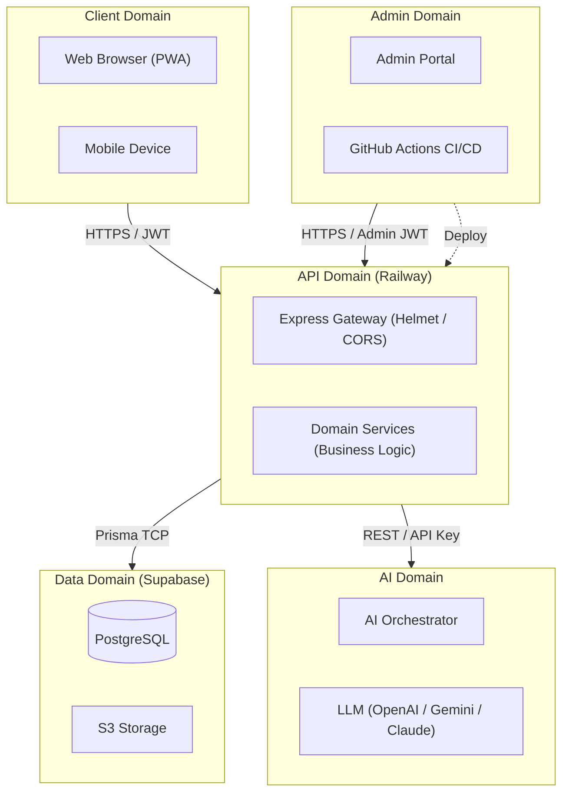

# Security Architecture — EV-JARVIS

> **Document ID:** DOC-013
> **Version:** 1.0.0
> **Status:** Complete
> **Project:** EV-JARVIS
> **Owner:** Principal Security Architect & DevSecOps Lead
> **Last Updated:** 2026-08-02
> **Reference Documents:** System Architecture (DOC-009), C4 Model (DOC-010), Tech Stack (DOC-012), Deployment (DOC-011)
> **Document Type:** Security Architecture Documentation

---

# Table of Contents

1. [Purpose](#1-purpose)
2. [Security Principles](#2-security-principles)
3. [Security Domains](#3-security-domains)
4. [Authentication](#4-authentication)
5. [Authorization](#5-authorization)
6. [API Security](#6-api-security)
7. [Database Security](#7-database-security)
8. [Encryption](#8-encryption)
9. [Secrets Management](#9-secrets-management)
10. [Secure File Upload](#10-secure-file-upload)
11. [Input Validation](#11-input-validation)
12. [OWASP Top 10 Mitigation](#12-owasp-top-10-mitigation)
13. [AI Security](#13-ai-security)
14. [Logging & Audit](#14-logging--audit)
15. [Monitoring](#15-monitoring)
16. [Incident Response](#16-incident-response)
17. [Security Checklist](#17-security-checklist)
18. [Compliance](#18-compliance)
19. [Security Roadmap](#19-security-roadmap)
20. [Revision History](#20-revision-history)

---

# 1. Purpose

เอกสารนี้กำหนดสถาปัตยกรรมด้านความปลอดภัย (Security Architecture) สำหรับแพลตฟอร์ม EV-JARVIS ครอบคลุมทุกระดับชั้นของระบบ (All Layers) ตั้งแต่ Frontend, Backend, Database, AI Services, Infrastructure จนถึงกระบวนการ Development (DevSecOps) เพื่อป้องกันความเสี่ยงและภัยคุกคามทางไซเบอร์ตามมาตรฐานสากล

เอกสารนี้เชื่อมโยงกับ Tech Stack (DOC-012) และ System Architecture (DOC-009) เพื่อให้มั่นใจว่ามาตรการรักษาความปลอดภัยถูกฝังอยู่ในขั้นตอนการพัฒนาและการนำระบบขึ้นทำงานจริงอย่างแนบเนียน

---

# 2. Security Principles

หลักการพื้นฐานที่ใช้ในการออกแบบระบบรักษาความปลอดภัยสำหรับ EV-JARVIS:

| Principle | Description | Implementation in EV-JARVIS |
|---|---|---|
| **Zero Trust** | ไม่อนุญาตความน่าเชื่อถือโดยอัตโนมัติ ไม่ว่าจะมาจากภายในหรือภายนอกเครือข่าย | ทุก Request ที่เข้ามายัง API ต้องผ่านการยืนยันตัวตนด้วย JWT แม้จะเรียกจากระบบภายใน |
| **Least Privilege** | ให้สิทธิ์เข้าถึงเท่าที่จำเป็นต่อการปฏิบัติงานเท่านั้น | Database Role, IAM Policy บน Cloud และ User Role ถูกกำหนดให้เข้าถึงเฉพาะ Resource ที่จำเป็น |
| **Defense in Depth** | สร้างมาตรการป้องกันหลายชั้น (Multiple Layers) เพื่อลดความเสี่ยงหากชั้นใดถูกเจาะ | มีระบบป้องกันตั้งแต่ Edge (CORS/Helmet), API (Validation), Domain (RBAC), จนถึง Database (RLS) |
| **Secure by Default** | การตั้งค่าเริ่มต้นต้องปลอดภัยเสมอ ผู้ใช้ไม่ต้องปรับแก้เพื่อให้ปลอดภัย | Password Policy 強, HTTP Headers รัดกุมแต่ต้น, และเปิด Private Repo บน GitHub |

---

# 3. Security Domains

ภาพรวมโครงสร้างของขอบเขตความปลอดภัย (Security Domains) ที่ถูกแยกส่วนเพื่อควบคุม:

---

# 4. Authentication

กระบวนการพิสูจน์ตัวตนใช้ **Supabase Auth** เป็นแกนหลัก:

| Component | Strategy / Policy |
|---|---|
| **Primary Method** | Email & Password, OAuth2 (Google, Apple) |
| **JWT** | ใช้ JSON Web Token ในการสื่อสารระหว่าง Client และ API (Stateless) |
| **Access Token** | อายุใช้งาน (Lifespan) 1 ชั่วโมง เก็บใน Memory หรือ Secure Storage (ฝั่ง Client) |
| **Refresh Token** | อายุใช้งาน 7 วัน เก็บใน HTTP-Only Cookie เพื่อใช้ต่ออายุ Access Token ป้องกัน XSS |
| **Session Strategy** | Single Session ต่อ 1 Device (อ้างอิงตอน MVP) ระบบจะตรวจสอบ Revoked Tokens เมื่อ Logout |
| **Password Policy** | ความยาวขั้นต่ำ 8 ตัวอักษร ต้องมีตัวพิมพ์เล็ก พิมพ์ใหญ่ ตัวเลข และสัญลักษณ์พิเศษ |
| **Account Lockout** | ล็อกบัญชีชั่วคราว (15 นาที) หากใส่รหัสผิดเกิน 5 ครั้ง ป้องกัน Brute-force |
| **Device Login** | บันทึกข้อมูล Device ID / User-Agent เพื่อตรวจสอบการเข้าสู่ระบบจากเครื่องใหม่ |
| **Remember Device** | อาศัย Refresh Token ในการ "Remember Me" สูงสุด 7 วัน |
| **MFA Ready** | โครงสร้างฐานข้อมูลและระบบล็อกอินเตรียมพร้อมสำหรับ Multi-Factor Authentication (Phase 2) |

---

# 5. Authorization

เมื่อพิสูจน์ตัวตนสำเร็จ การตรวจสอบสิทธิ์จะเข้าสู่กระบวนการควบคุมตาม **RBAC (Role-Based Access Control)** ผสมกับ **Ownership Check**:

## 5.1 Role Hierarchy

| Role | Hierarchy Level | Capabilities |
|---|---|---|
| **Admin** | Level 3 (Highest) | จัดการผู้ใช้งานทั้งหมด ดู Dashboard ภาพรวม และลบเนื้อหาในระบบ (System-wide) |
| **Owner** | Level 2 | จัดการรถยนต์ (Vehicle), ดูประวัติการชาร์จ, ลบหรือแก้ไขข้อมูลรถยนต์ของตัวเอง |
| **User** | Level 1 | สิทธิ์เริ่มต้นหลังสมัครสมาชิก สามารถเพิ่มรถยนต์เพื่อให้กลายเป็น Owner ได้ |
| **Guest** | Level 0 | สิทธิ์ก่อนเข้าสู่ระบบ เข้าถึงได้เฉพาะ Landing Page และ Public POIs (สถานีชาร์จสาธารณะ) |

## 5.2 Permission Matrix (Example)

| Resource | Action | Admin | Owner | User | Guest |
|---|---|:---:|:---:|:---:|:---:|
| Vehicle Profile | Create | ✅ | ✅ | ✅ | ❌ |
| Vehicle Profile | Read | ✅ | ✅ (Own) | ❌ | ❌ |
| Vehicle Profile | Update | ✅ | ✅ (Own) | ❌ | ❌ |
| Vehicle Profile | Delete | ✅ | ✅ (Own) | ❌ | ❌ |
| Telemetry | Read | ✅ | ✅ (Own) | ❌ | ❌ |

*(หมายเหตุ: Owner Check ใช้ `userId` ใน JWT Payload เทียบกับ `ownerId` ของ Record)*

---

# 6. API Security

ชั้นความปลอดภัยสำหรับ Backend API (Express.js บน Railway):

| Mechanism | Implementation Detail |
|---|---|
| **HTTPS / TLS** | บังคับใช้ TLS 1.3 สำหรับทุก Endpoint ปฏิเสธ HTTP ด้วย HSTS |
| **JWT Validation** | Middleware ถอดรหัสและตรวจสอบ Signature ของ JWT (ผ่าน Supabase Auth SDK) |
| **Token Rotation** | Refresh Token จะถูกหมุนเวียน (Rotated) ทุกครั้งที่นำมาขอ Access Token ใหม่ (Reuse Detection) |
| **Replay Protection** | ใช้ Request ID (UUID) และ Timestamp ตรวจสอบเพื่อป้องกันการโจมตีซ้ำ (Replay Attack) สำหรับ Transaction สำคัญ |
| **Nonce** | ใช้ Nonce ในกระบวนการ OAuth เพื่อป้องกัน CSRF และ Replay |
| **Request Signing** | ไม่ใช้ใน MVP (เตรียมไว้สำหรับ Server-to-Server Communication ในอนาคต) |
| **Rate Limit** | ควบคุมจำนวน Request ต่อ IP: Global (100 req/min), Auth (10 req/min), AI Chat (20 req/min) |
| **API Gateway** | อาศัย Ingress ของ Railway ทำหน้าที่ Reverse Proxy รับภาระ SSL Termination ก่อนถึง Express |
| **Versioning** | บังคับมี Version ใน URL (เช่น `/api/v1/vehicles`) ป้องกันปัญหา Breaking Change และง่ายต่อการทำ Audit |

---

# 7. Database Security

การจัดการความปลอดภัยในชั้นข้อมูล (Supabase / PostgreSQL):

| Aspect | Implementation Detail |
|---|---|
| **Encryption at Rest** | ข้อมูลบนดิสก์ถูกเข้ารหัสอัตโนมัติด้วย AES-256 (มาตรฐานของ Supabase Cloud / AWS) |
| **TLS (In Transit)** | การเชื่อมต่อจาก Backend เข้า PostgreSQL (Prisma) ต้องผ่านพอร์ตที่เข้ารหัส TLS (พอร์ต 5432 หรือ 6543 สำหรับ PgBouncer) |
| **Backup Encryption** | ข้อมูลสำรอง (Backups) ถูกเข้ารหัสด้วย Keys ที่บริหารจัดการโดย Supabase |
| **Row Security (RLS)** | เปิดใช้งาน Row Level Security ทุกตาราง จำกัดให้ User สามารถอ่าน/เขียนได้เฉพาะ Row ที่ `user_id` ตรงกับตนเอง |
| **Least Privilege** | แอพพลิเคชันต่อ Database ด้วย Role ที่กำหนดสิทธิ์ (API Role) ไม่มีสิทธิ์ในการ Drop Table หรือปรับแต่ง Schema |
| **Database Roles** | แบ่งแยก Role `postgres` (Admin/Migration) และ `authenticator` (Application Runtime) อย่างชัดเจน |
| **Secrets** | Database Connection String และ Password จะไม่หลุดไปยัง Frontend เก็บเป็น Environment Variable ใน Railway |

---

# 8. Encryption

โปรโตคอลและอัลกอริทึมเข้ารหัสที่นำมาใช้:

- **Data at Rest (Storage/DB):** AES-256 (Managed by Provider)
- **Data in Transit (Web/API):** TLS 1.3
- **Keys/Certificates:** RSA (2048-bit minimum) หรือ ECDSA (P-256)
- **Password Hash:** Argon2id (หรือ bcrypt ตามมาตรฐาน Supabase Auth) ถูกใช้ในการ Hash รหัสผ่านก่อนบันทึกลงฐานข้อมูล โดยมีการใส่ Salt ทุกครั้ง
- **Key Rotation:** หมุนเวียนคีย์ API ของ Third-party ทุก 90 วันตามนโยบาย (Secret Rotation)

---

# 9. Secrets Management

การปกป้องกุญแจสำคัญ รหัสผ่าน และ API Keys:

| Tool / Environment | Strategy |
|---|---|
| **Environment Variables** | ห้ามฮาร์ดโค้ด Key ลงใน Source Code ให้เรียกผ่าน `process.env` (Backend) หรือ `import.meta.env` (Vite Frontend) |
| **Git Ignore Policy** | กำหนด `.env`, `.env.local` ลงใน `.gitignore` อย่างเด็ดขาด และใช้ `git-secrets` แสกนก่อน Commit |
| **Production Secrets** | การนำ Key ขึ้นระบบใช้วิธีฝังลงแพลตฟอร์มปลายทางเท่านั้น ห้ามส่งต่อกันผ่านแชท (Slack/Line) |
| **GitHub Actions** | ใส่ Secrets ในเมนู GitHub Secrets เพื่อให้ CI/CD อ่านไปใช้ตอน Build |
| **Railway** | กรอก Environment Variables ในหน้า Project Settings เพื่อ Inject ลง Container ตอน Runtime |
| **Vercel** | กรอก Environment Variables ในหน้า Project Settings (ระวังการใช้ Prefix `VITE_` กับข้อมูลที่ไม่ใช่ Public) |
| **Supabase** | Service Role Key เก็บเฉพาะใน Railway, Anon Key สามารถเปิดเผยบน Vercel ได้ |
| **Secret Rotation** | หมุนเวียน API Key (เช่น OpenAI) และตรวจสอบการใช้งาน หากมีเหตุการณ์ผิดปกติจะ Revoke ทันที |

---

# 10. Secure File Upload

ระบบรับไฟล์ (เช่น ภาพโปรไฟล์, เอกสารประจำรถ) ต้องมีความปลอดภัย:

- **Allowed Types:** รับเฉพาะประเภทที่กำหนด (Whitelist: `image/jpeg`, `image/png`, `application/pdf`)
- **File Validation:** ตรวจสอบขนาด (Max 5MB) และ Magic Bytes (MIME Type Snipping) ด้วย Code บน Backend ก่อนอัปโหลด
- **Virus Scan Ready:** โครงสร้างเตรียมพร้อมสำหรับการเชื่อมต่อ API สแกนไวรัสไฟล์ก่อนเปิดให้โหลด (ใน Roadmap Phase 2)
- **Storage Isolation:** ไฟล์ผู้ใช้จะอยู่ใน Supabase Storage Bucket ที่เปิด RLS ไฟล์สำคัญจะไม่สามารถเข้าถึงได้แบบสาธารณะ (Private Bucket)

---

# 11. Input Validation

เพื่อป้องกัน Data Injection และข้อมูลขยะ:

- **Server Side Validation:** ใช้ `Zod` ตรวจสอบ Payload ของทุก API Request (Body, Query, Params) ทันทีที่เข้าถึง Controller หากไม่ผ่านจะตีกลับ HTTP 400 (Bad Request)
- **Client Validation:** ใช้ `Zod` ร่วมกับ `React Hook Form` ตรวจสอบฟอร์มก่อน Submit เพื่อ UX ที่ดี
- **Whitelist:** กำหนดโครงสร้างข้อมูลให้ชัดเจนด้วย Schema ตรวจหาฟิลด์แปลกปลอมและลบทิ้ง (Strip Unknown Fields)
- **Sanitization:** กรองตัวอักษรพิเศษ (HTML Entities) สำหรับ Input ประเภทข้อความอิสระ (Textarea) เพื่อป้องกัน XSS

---

# 12. OWASP Top 10 Mitigation

แนวทางการรับมือความเสี่ยง 10 ประการตามมาตรฐาน OWASP:

| OWASP Risk | Mitigation Strategy in EV-JARVIS |
|---|---|
| **1. Broken Access Control** | บังคับใช้ JWT Authentication, ตรวจสอบ Ownership ด้วย ID เสมอ, เปิด RLS บน Supabase |
| **2. Cryptographic Failures** | บังคับใช้ TLS 1.3 สำหรับทุก Traffic, ไม่เก็บรหัสผ่านแบบ Plain Text, ใช้ Argon2id/Bcrypt Hash |
| **3. Injection** | ป้องกัน SQL Injection โดยใช้ Prisma ORM ซึ่งทำ Parameterized Query อัตโนมัติ (ห้ามใช้ Raw SQL หากไม่รัดกุม) |
| **4. Insecure Design** | ปฏิบัติตามหลัก Defense in Depth ควบคุมตั้งแต่ Edge, Gateway, Domain ไปจนถึง Database |
| **5. Security Misconfiguration** | ปิดการแสดง Error Stack Trace ใน Production, ซ่อน `X-Powered-By`, ใช้ Helmet ปิดรอยรั่ว HTTP Headers |
| **6. Vulnerable Components** | ตรวจสอบแพ็กเกจด้วย `npm audit` บน CI/CD Pipeline (GitHub Actions) และระงับการ Build หากพบความเสี่ยง High/Critical |
| **7. Identification & Auth Failures** | ใช้ Supabase Auth ซึ่งมีมาตรฐานสากล, Account Lockout ป้องกัน Brute-force, ห้ามเซสชันคงค้างยาวนาน |
| **8. Software & Data Integrity Failures** | ทำ Signed Commits, ล็อก Version ของ Dependencies ใน `package-lock.json` ป้องกัน Dependency Hijacking |
| **9. Security Logging & Monitoring** | บันทึกพฤติกรรมแปลกปลอม (Failed Login) ด้วย Winston และเชื่อมต่อเข้ากับ Grafana/Sentry พร้อม Alerting |
| **10. SSRF** | API ที่มีการเรียก Webhook ภายนอก จะต้องจำกัดโดเมนปลายทาง (Whitelist) ไม่อนุญาตให้เรียกหา Local Network (127.0.0.1) เด็ดขาด |

---

# 13. AI Security

ความเสี่ยงที่เกิดจากการใช้โมเดลปัญญาประดิษฐ์ (OpenAI / Gemini / Claude) ต้องถูกจำกัดวง:

- **Prompt Injection:** ป้องกันผู้ใช้ส่งคำสั่งหลอกให้ AI เปิดเผย System Prompt โดยการกรอง Input (Sanitization) และวางโครงสร้าง Prompt ให้แบ่งแยกระหว่าง `System Instruction` และ `User Content` ชัดเจน
- **Jailbreak Prevention:** ป้อนเงื่อนไขเชิงปฏิเสธ (Negative Constraint) ใน System Prompt เช่น "ห้ามตอบคำถามที่ขัดต่อกฎความปลอดภัย" และอาศัย Filter ของค่ายผู้พัฒนาโมเดล
- **Model Abuse:** บังคับใช้ AI Rate Limit (20 req/min) เพื่อป้องกันการโจมตีแบบ DoS ก่อให้เกิดค่าใช้จ่ายจำนวนมาก (Billing Attack)
- **Hallucination Risk:** ควบคุมอุณหภูมิ (Temperature = 0.2 - 0.5) สำหรับการวิเคราะห์ที่ต้องการความจริงจัง พร้อมแสดง Disclaimer ต่อผู้ใช้
- **Sensitive Data Protection:** (PII Anonymization) ปกปิดชื่อนามสกุล ทะเบียนรถยนต์ หรือข้อมูลบัตรเครดิต ก่อนส่งไปยัง AI API 
- **Conversation Isolation:** ข้อมูลบริบทการสนทนาของรถคันหนึ่ง ห้ามนำไปเป็น Context ในการถามตอบของรถอีกคันเด็ดขาด ควบคุมด้วย Session ID
- **Prompt & Output Validation:** ตรวจสอบความถูกต้องของ Input และรับ Output เป็น JSON Object (Structured Output) เท่านั้น ป้องกัน AI สร้างโค้ดประสงค์ร้ายลงหน้า UI

---

# 14. Logging & Audit

- **Audit Trail:** ทุกกิจกรรมเกี่ยวกับการเปลี่ยนสิทธิ์ (เช่น โอนความเป็นเจ้าของรถ) หรือแก้ข้อมูลสำคัญ จะต้องบันทึก History Log
- **Security Logs:** บันทึกการ Request ที่ถูกบล็อก (403, 401, Rate Limited) พร้อม Timestamp, IP, และ User-Agent
- **Admin Logs:** ธุรกรรมใด ๆ ที่กระทำโดยสิทธิ์ Admin จะถูกบันทึกไว้อย่างชัดเจนแบบแยกส่วน ป้องกันการทุจริตภายใน
- **Authentication Logs:** Supabase จัดการระบบบันทึก Login Success / Login Failed ให้อัตโนมัติ
- **Retention Policy:** จัดเก็บ Log ไว้ในระบบเป็นเวลา 90 วัน สำหรับการตรวจสอบย้อนหลัง

---

# 15. Monitoring

เฝ้าระวังระบบเพื่อจับพฤติกรรมน่าสงสัย (Integrates with OpenTelemetry / Sentry / Grafana):

- **Failed Login:** สังเกตการณ์หากมีการ Log-in ผิดพลาดเกิน 5 ครั้งจาก IP เดียวกันภายใน 5 นาที
- **Suspicious Activity:** ตรวจสอบหากมีการเข้าถึง Resource ที่ไม่ได้เป็นเจ้าของเกินขีดจำกัด (เช่น ยิง `GET /vehicles/:id` แบบสุ่มรหัส)
- **Rate Limit Trigger:** แจ้งเตือนเมื่อ IP ใด ๆ ติด Rate Limit ถี่ผิดปกติ
- **API Abuse:** แจ้งเตือนเมื่อปริมาณค่าใช้จ่าย หรือจำนวน Request ไปยัง OpenAI พุ่งสูงผิดปกติ (Billing Alert)
- **Monitoring Dashboard:** ใช้ Grafana แดชบอร์ดสรุปผล Metrics เหล่านี้แบบ Real-time ให้ทีม DevSecOps

---

# 16. Incident Response

แผนการรับมือเมื่อเกิดภัยคุกคามทางไซเบอร์:

1. **Detection:** ตรวจพบโดย Alert จาก Grafana / Sentry หรือแจ้งความผิดปกติจากผู้ใช้ (ผ่าน Slack Channel ภายใน 15 นาที)
2. **Containment:** จำกัดวงความเสียหาย 
   - หากบัญชีผู้ใช้ถูกเจาะ ให้ทำการบังคับ Logout (Revoke Tokens) บัญชีนั้น 
   - หากระบบรั่วไหลในวงกว้าง ตัดการเข้าถึง API ภายนอก (Toggle Switch) หรือจำกัด API Gateway ให้เข้าได้เฉพาะภายใน
3. **Recovery:** ประเมินขอบเขต, เปลี่ยนผ่าน API Key ใหม่ (Rotate Secrets), นำระบบกลับสู่สภาวะปกติ (จาก Code หรือ Backup)
4. **Postmortem:** หาสาเหตุรากฐาน (Root Cause Analysis) เขียนสรุปเหตุการณ์ (Incident Report) อัปเดตแพตช์ และปรับปรุง Security Domain ภายใน 48 ชั่วโมง

---

# 17. Security Checklist

## 17.1 Developer Checklist (Before PR)
- [ ] โค้ดไม่มี Hardcoded Secrets
- [ ] มีการใช้ `Zod` Validate Input ทุกตัว
- [ ] มีการตรวจสอบสิทธิ์ `user_id` ก่อนแก้ไข Database
- [ ] ทดสอบแล้วว่า Dependency ใหม่ไม่มีช่องโหว่รุนแรง

## 17.2 Deployment Checklist (CI/CD)
- [ ] `npm audit` และ Linter รันผ่าน 100%
- [ ] Secrets ใน GitHub Actions และ Railway เป็นชุดล่าสุดที่ถูกต้อง
- [ ] รัน Database Migration (RLS Policy อัปเดตตรงตาม Schema)

## 17.3 Production Checklist (Post-Deploy)
- [ ] ทดสอบ Rate Limit ป้องกัน Spam ได้จริง
- [ ] SSL/TLS Certificate ของ Vercel และ Railway ถูกต้องและยังไม่หมดอายุ
- [ ] Headers ทางความปลอดภัย (เช่น HSTS, CSP) แสดงบน Response ถูกต้อง

---

# 18. Compliance

สถาปัตยกรรมความปลอดภัยนี้อ้างอิงกับมาตรฐานและการกำกับดูแล:

- **OWASP ASVS:** สอดคล้องกับ Application Security Verification Standard (Level 1-2)
- **OWASP Top 10:** อุดช่องโหว่ความเสี่ยงสูงสุด 10 ประการ (ตาม Section 12)
- **GDPR Ready / PDPA Ready:** โครงสร้างข้อมูลแยกข้อมูลส่วนบุคคล (PII) ชัดเจน เตรียมรองรับระบบให้ความยินยอม (Consent Management) และสิทธิ์ในการขอลบข้อมูล (Right to be Forgotten) 
- **Secure SDLC:** พัฒนาแบบ Agile ที่ฝังกระบวนการความปลอดภัยลงใน CI/CD Pipeline อย่างเป็นรูปธรรม

---

# 19. Security Roadmap

แผนพัฒนาระบบความปลอดภัยในอนาคต:

- **Phase 1 (MVP - Current):** JWT Auth, Role/Ownership Base Control, Edge Security, RLS, Secret Management พื้นฐาน
- **Phase 2 (Mid-term):** เปิดระบบ Multi-Factor Authentication (MFA), ติดตั้งระบบ Virus Scan สำหรับไฟล์ที่อัปโหลด, Audit Logs ขั้นสูง
- **Phase 3 (Long-term):** ติดตั้ง WAF (Web Application Firewall) เต็มรูปแบบ, ISO 27001 Certification Readiness, ระบบสแกนหา PII อัตโนมัติก่อนส่งหา AI (DLP)

---

# 20. Revision History

| Version | Date | Status | Author | Change Description |
|---|---|---|---|---|
| 1.0.0 | 2026-08-02 | Complete | Principal Security Architect | สร้างเอกสารสถาปัตยกรรมความปลอดภัย (Security Architecture) ครอบคลุมหลักการ Zero Trust, Authentication, Authorization, Database Security, AI Security, ภัยคุกคาม OWASP Top 10 และกระบวนการตรวจจับ สอดคล้องกับ Tech Stack (Vercel, Railway, Supabase) อย่างสมบูรณ์ |
