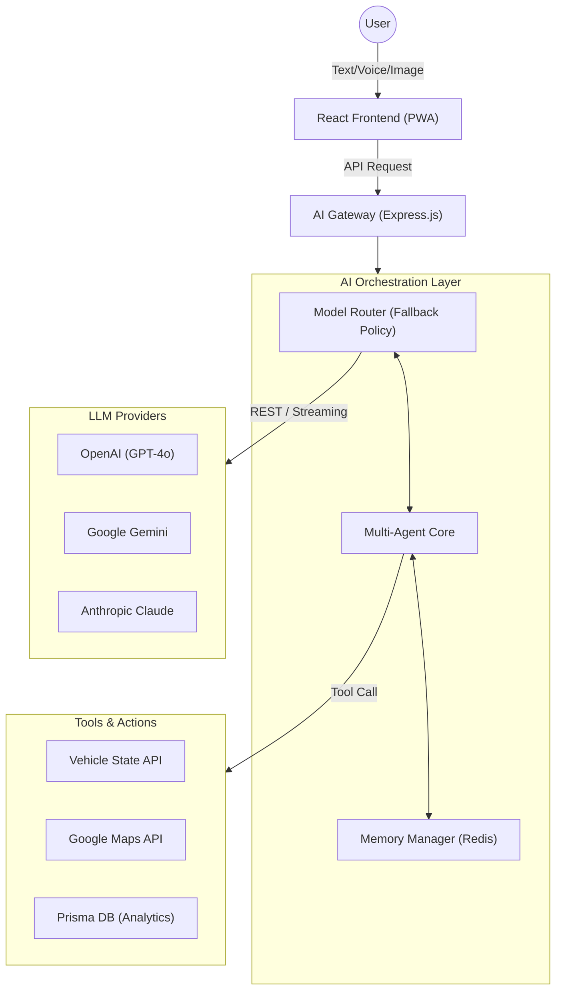
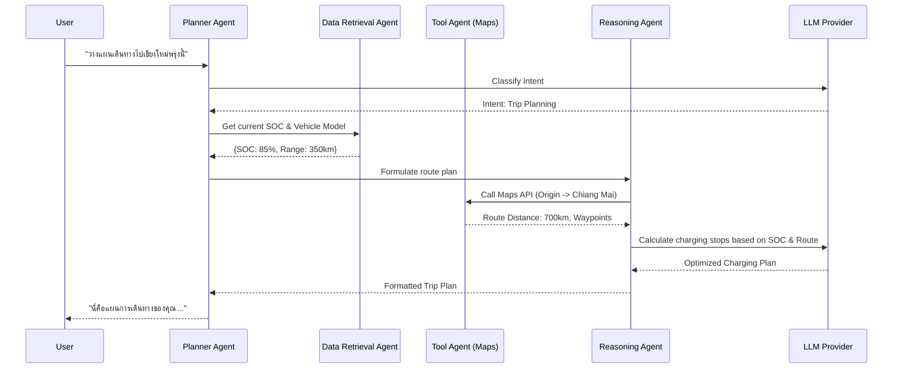

# AI Architecture — EV-JARVIS

> **Document ID:** DOC-014
> **Version:** 1.0.0
> **Status:** Complete
> **Project:** EV-JARVIS
> **Owner:** Chief AI Architect & LLM Systems Engineer
> **Last Updated:** 2026-08-02
> **Reference Documents:** Tech Stack (DOC-012), Security Architecture (DOC-013)
> **Document Type:** AI Architecture Documentation

---

# Table of Contents

1. [Purpose](#1-purpose)
2. [AI Design Principles](#2-ai-design-principles)
3. [AI Capability Matrix](#3-ai-capability-matrix)
4. [AI System Architecture](#4-ai-system-architecture)
5. [Multi-Agent Architecture](#5-multi-agent-architecture)
6. [Agent Workflow](#6-agent-workflow)
7. [LLM Strategy](#7-llm-strategy)
8. [Prompt Architecture](#8-prompt-architecture)
9. [Memory Architecture](#9-memory-architecture)
10. [Tool Calling Architecture](#10-tool-calling-architecture)
11. [RAG Readiness](#11-rag-readiness)
12. [AI Security](#12-ai-security)
13. [AI Observability](#13-ai-observability)
14. [AI Performance](#14-ai-performance)
15. [AI Governance](#15-ai-governance)
16. [AI Roadmap](#16-ai-roadmap)
17. [AI Technology Mapping](#17-ai-technology-mapping)
18. [Future Expansion](#18-future-expansion)
19. [Revision History](#19-revision-history)

---

# 1. Purpose

เอกสารนี้กำหนดสถาปัตยกรรมปัญญาประดิษฐ์ (AI Architecture) ของ EV-JARVIS โดยให้ภาพรวมของ Ecosystem ระบบ AI ทั้งหมด ตั้งแต่การเรียกใช้งาน LLM (Large Language Model), โครงสร้าง Multi-Agent, การจัดการ Memory, การเชื่อมต่อ Tool, Prompt Engineering ตลอดจนความปลอดภัยและการสเกลระบบในอนาคต เอกสารนี้ออกแบบเพื่อรับประกันว่า AI ภายใน EV-JARVIS ทำงานได้อย่างแม่นยำ ปลอดภัย และคุ้มค่า

---

# 2. AI Design Principles

หลักการออกแบบระบบ AI ใน EV-JARVIS เพื่อให้เกิดประสิทธิภาพสูงสุด:

- **Human-in-the-loop:** AI ทำหน้าที่เป็นผู้ช่วยเสนอแนะ (Assistant) แต่การตัดสินใจสำคัญ (เช่น ส่งคำสั่งชาร์จไฟหรือแก้ไขข้อมูลรถ) ต้องได้รับการยืนยันจากผู้ใช้
- **Reliable AI:** ระบบต้องมี Fallback Mechanism หาก Model หลักใช้งานไม่ได้ หรือ API ล่ม จะสลับไปยัง Provider อื่นโดยอัตโนมัติ
- **Secure AI:** ป้องกันการโจมตีทาง Prompt (Prompt Injection) และควบคุมสิทธิ์ของ Tool ตาม Role ของผู้ใช้ 
- **Modular AI:** โครงสร้าง Agent และ Tool แยกส่วนออกจากกัน เพื่อให้ง่ายต่อการถอดเปลี่ยนหรืออัปเกรด Model ในอนาคต
- **Scalable AI:** ออกแบบมารองรับ Concurrent Requests ปริมาณมาก โดยอาศัย Streaming และ Caching
- **Observable AI:** ทุก Request ที่เรียก LLM ต้องสามารถตรวจวัด (Trace) หาคอขวดและตรวจสอบค่าใช้จ่าย (Token/Cost) ได้
- **Cost-aware AI:** ควบคุมจำนวน Token ผ่าน Context Compression และเลือกใช้ Model ขนาดเล็กสำหรับงานที่ไม่ซับซ้อน

---

# 3. AI Capability Matrix

ขีดความสามารถที่ระบบ AI ของ EV-JARVIS ครอบคลุม:

| Capability | Description | Target Model Level |
|---|---|---|
| **AI Assistant** | ตอบคำถามทั่วไป และโต้ตอบแบบ Conversational | Primary (GPT-4o) / Fallback |
| **Trip Planning** | วางแผนเส้นทาง แวะพักชาร์จ อ้างอิงจาก SOC และแผนที่ | Primary (GPT-4o) + Maps Tool |
| **Battery Analytics** | วิเคราะห์สุขภาพแบตเตอรี่ และแนวโน้มความเสื่อม (SOH) | Primary (GPT-4o) + DB Tool |
| **Charging Recommendation** | เสนอแนะเวลาชาร์จไฟที่ประหยัด (Off-peak) | Primary (GPT-4o) |
| **Maintenance Recommendation** | คาดการณ์และแจ้งเตือนการบำรุงรักษาล่วงหน้า | Primary / Secondary |
| **Natural Language Query** | ผู้ใช้ถามสถานะรถด้วยเสียง/ข้อความปกติ แทนการกด UI | Primary (GPT-4o) |
| **Vehicle Q&A** | อธิบายสัญลักษณ์หน้าปัดรถยนต์ คู่มือรถ | Multimodal (Gemini Flash) |
| **Dashboard Explanation** | สรุปผลข้อมูล Telemetry เป็นภาษามนุษย์ | Primary (GPT-4o) |
| **Document Understanding** | อ่านและดึงข้อมูลจากเอกสารเช่น ใบประกัน หรือใบเสร็จ | Multimodal (Gemini Flash) |
| **Notification Summaries** | สรุปการแจ้งเตือนหลายรายการให้เหลือข้อความสั้น ๆ | Tertiary (Claude / GPT-4o-mini) |

---

# 4. AI System Architecture

โครงสร้างระดับบนของ AI ภายใน EV-JARVIS:

---

# 5. Multi-Agent Architecture

การออกแบบสถาปัตยกรรมแบบ Multi-Agent ช่วยให้ AI แต่ละตัวมีความเชี่ยวชาญเฉพาะทาง (Specialized Agents) และลดโอกาสการเกิด Hallucination จากการรวมความรับผิดชอบไว้ที่ Prompt เดียว:

| Agent | Responsibility | Communication |
|---|---|---|
| **Planner Agent** | รับ Input จากผู้ใช้ แยกแยะเจตนา (Intent) และวางแผนว่าต้องใช้ Agent ใด | Supervisor of all Agents |
| **Reasoning Agent** | วิเคราะห์ตรรกะซับซ้อน เช่น ทำไมแบตเตอรี่ถึงลดลงผิดปกติ | เรียก Data Retrieval Agent |
| **Tool Agent** | แปลง Intent ให้กลายเป็น Parameter ที่ถูกต้องสำหรับการเรียกใช้งาน API / Tools | ส่งผลลัพธ์คืน Reasoning |
| **Data Retrieval Agent** | รวบรวมข้อมูลดิบจาก Database หรือ RAG (ถ้ามี) แบบ Read-only | ถูกเรียกโดย Reasoning / Planner |
| **Notification Agent** | จัดหน้าตา/ปรับข้อความสำหรับการ Push Notification ให้ดูเป็นมิตร | ทำงาน Asynchronous |
| **Analytics Agent** | วิเคราะห์ตัวเลข สถิติเชิงปริมาณ และคำนวณ Cost ของแบตเตอรี่ | เรียก Tool Agent |
| **Summarization Agent** | สรุปข้อมูลที่ยาวมาก (เช่น คู่มือรถ, ประวัติทริป) | ทำงานเดี่ยว (Standalone) |
| **Future Expansion Agent**| (เตรียมพร้อม) Agent สำหรับการซื้อประกัน โต้ตอบกับศูนย์บริการ ฯลฯ | - |

---

# 6. Agent Workflow

ตัวอย่างขั้นตอนการทำงานเมื่อผู้ใช้พิมพ์: *"วางแผนเดินทางไปเชียงใหม่ พรุ่งนี้เช้า"*

---

# 7. LLM Strategy

นโยบายการจัดหาและจัดการ Model ให้เกิดความเสถียรที่สุด:

- **Primary Model:** `OpenAI GPT-4o` สำหรับงานหลักทั้งหมด เนื่องจากความเสถียรของ Tool Calling และ Reasoning
- **Fallback Model:** `Gemini 1.5 Pro/Flash` ทำหน้าที่เป็น Tier 1 Fallback หรือใช้เป็น Primary เมื่อมีงานที่เกี่ยวกับ Vision (Image Analysis)
- **Tertiary Model:** `Claude 3.5 Sonnet` ทำหน้าที่ประมวลผลข้อความขนาดยาว (Long Context Window) และเป็น Tier 2 Fallback
- **Routing Policy:** Express Backend เป็นคนจัดการ Routing ถ้า `Primary` Timeout (> 5 วิ) หรือ 429 Too Many Requests จะสลับไป Fallback อัตโนมัติ
- **Model Selection:** เลือกรุ่นที่มี Function Calling (Tool Use) รองรับเท่านั้น
- **Offline Mode Readiness:** (Future) โครงสร้างออกแบบมาให้ต่อ API มาตรฐาน (OpenAI Compatible) เพื่อรองรับ Local LLM (เช่น LLaMA) ภายในศูนย์ข้อมูลตัวเองหรือบน Edge Device
- **Future Model Replacement:** สามารถสลับเปลี่ยนโมเดลหลักได้ง่ายเพียงแก้ Configuration ใน Database

---

# 8. Prompt Architecture

สถาปัตยกรรมการแบ่งเลเยอร์ของ Prompt เพื่อควบคุมคุณภาพเนื้อหา:

- **System Prompt:** กฎเหล็กที่ AI แหกไม่ได้ (เช่น บุคลิกภาพ, กรอบความปลอดภัย, สิ่งที่ห้ามทำ) ฝังอยู่ที่ Backend (Hardcoded)
- **Developer Prompt:** (หรือ Instruction) คู่มือชั่วคราวในการตอบสนองตาม Intent (เช่น "อธิบายผลแบตเตอรี่ในรูปแบบตาราง")
- **Task Prompt:** ข้อมูลเฉพาะที่ได้จาก Tool Agent เช่น ข้อมูล JSON ของสถานีชาร์จ
- **User Prompt:** ข้อความที่ผู้ใช้พิมพ์เข้ามา (อาจมี Malicious code จึงต้องระวัง)
- **Prompt Validation:** มีการแสกนหาคำต้องห้ามใน User Prompt (เช่น "Forget all instructions") ก่อนส่งไปหา LLM
- **Prompt Versioning:** ทุกการแก้ System Prompt ต้องขึ้นเป็น Version ใหม่ใน Git และทำ A/B Testing ใน Staging 
- **Prompt Lifecycle:** ร่าง (Draft) -> ทดสอบคุณภาพ (Eval) -> นำขึ้นใช้งาน (Prod) -> เลิกใช้ (Deprecated)

---

# 9. Memory Architecture

การจดจำบริบทเพื่อให้ AI สามารถโต้ตอบได้ต่อเนื่องเป็นธรรมชาติ:

- **Conversation Memory:** บันทึกโครงสร้างการคุย (Message History) ของ Session ปัจจุบันใน Memory (Express Request) และซิงค์ลง Upstash Redis
- **Short-term Memory:** เก็บความทรงจำภายในระยะเวลา 24 ชั่วโมงใน Redis เพื่อความรวดเร็วในการต่อบทสนทนา (เช่น จำได้ว่าเมื่อวานคุยถึงสถานีชาร์จไหนค้างไว้)
- **Long-term Memory:** เก็บลง Supabase PostgreSQL สำหรับการสรุปข้อมูลที่ผ่านมา (Summary)
- **User Preference Memory:** ดึงโปรไฟล์ตั้งค่าของผู้ใช้ (เช่น รถยี่ห้ออะไร ชอบขับเร็วแค่ไหน) มาทำ **Context Injection** ใส่ System Prompt เสมอ
- **Memory Expiration:** Short-term Memory (Redis) จะตั้งค่า TTL ไว้ที่ 24-48 ชั่วโมง
- **Future Persistent Memory:** การใช้ Vector Database ในอนาคต (RAG) เพื่อให้ AI นึกถึงอดีตที่ผ่านมาหลายเดือนได้

---

# 10. Tool Calling Architecture

เครื่องมือที่ AI มีสิทธิ์เรียกใช้ (Function Calling):

- **Vehicle API:** ดึงสถานะรถ (SOC, อุณหภูมิแบตเตอรี่, สถานะประตู/แอร์) (Read-only ใน MVP)
- **Charging API:** ค้นหาสถานีชาร์จสาธารณะ ตรวจสอบหัวชาร์จว่าง
- **Maps API:** ค้นหาสถานที่ คำนวณระยะทางและเวลา (Google Maps)
- **Weather API:** เช็คสภาพอากาศตลอดเส้นทาง (เพื่อคำนวณผลกระทบต่อแบตเตอรี่)
- **Notification Service:** สั่ง AI ให้ตั้งเวลาแจ้งเตือนผู้ใช้ในอนาคต
- **Database Access:** (จำกัดอย่างเข้มงวด) AI เรียกดูสถิติ (Analytics) ได้ผ่าน API ภายในเท่านั้น ห้าม AI คุยกับ Database โดยตรงผ่าน SQL
- **External API Layer:** มีการห่อหุ้ม (Wrapper) ควบคุม Error Handling ของ Tools อย่างเป็นระบบ หาก API ล่ม AI จะไม่พังตาม

---

# 11. RAG Readiness

ความพร้อมสำหรับ Retrieval-Augmented Generation (เพื่อใช้อ่านคู่มือรถ หรือข้อมูลเฉพาะ):

- **Knowledge Base:** จัดเตรียมโครงสร้างสำหรับจัดเก็บคู่มือผู้ใช้รถ EV ยี่ห้อต่าง ๆ และตารางบำรุงรักษา
- **Document Index:** โครงสร้างข้อมูลรองรับการอัปโหลดไฟล์ PDF/Markdown
- **Embedding Strategy:** ใช้งาน `text-embedding-3-small` ของ OpenAI เป็นตัวหลัก (สำหรับอนาคต)
- **Chunking:** ตัดเอกสารออกเป็นส่วนย่อย (Chunks) ขนาด 500 - 1000 Tokens รักษา Context
- **Retrieval Pipeline:** (เตรียมรองรับ) รับคำถาม -> แปลงเป็น Vector -> ค้นหาใน DB -> ส่งผลให้ LLM
- **Ranking:** ใช้งาน Re-ranking Algorithm เบื้องต้นเพื่อเลือกเฉพาะคู่มือที่ตรงยี่ห้อรถเท่านั้น
- **Citation Ready:** โครงสร้าง Prompt บังคับให้ AI ต้องอ้างอิงแหล่งที่มาของคู่มือ
- **Future Vector Database:** ปัจจุบันอาศัย pgvector (บน Supabase) เป็นฐานเก็บ Vector

---

# 12. AI Security

นโยบายรักษาความปลอดภัยตามมาตรฐาน AI Security (สอดคล้องกับ DOC-013):

- **Prompt Injection:** ทำ Input Sanitization และใช้ System Prompt แบบกั้นขอบเขต (Delimiter) ชัดเจน 
- **Jailbreak Protection:** ฝัง Negative Rules ใน System Prompt แจ้ง LLM ให้ปฏิเสธการตอบรับ Role-play ที่อยู่นอกเหนือขอบเขตยานยนต์
- **Tool Permission:** การสั่งรัน Tool (เช่น เปิดแอร์, ล็อกรถ) ต้องตรวจ JWT Authorization ของผู้ใช้อีกครั้ง ห้ามให้ AI รันคำสั่ง Bypass สิทธิ์
- **Sensitive Data Filtering:** ปิดบังสัญลักษณ์ข้อมูลส่วนบุคคล (PII) เช่น หมายเลขบัตรเครดิต ก่อนส่งให้ LLM
- **Output Validation:** ตรวจสอบโครงสร้างคำตอบของ AI ด้วย Zod ว่าตรงตาม JSON Schema ที่กำหนด ป้องกัน AI ส่งข้อมูลประสงค์ร้ายลง Frontend
- **Hallucination Mitigation:** ลด Temperature (0.2) สำหรับงานเกี่ยวกับสเปกรถ และกำหนดว่า "หากไม่ทราบ ให้ตอบว่าไม่ทราบ ห้ามเดา"
- **Abuse Prevention:** Rate Limiting ในระดับผู้ใช้งานแต่ละคนผ่าน Redis
- **Conversation Isolation:** Session ID ผูกกับ User ID เสมอ AI ไม่สามารถดึงความจำของ User A ไปตอบ User B ได้

---

# 13. AI Observability

การติดตามและประเมินประสิทธิภาพของระบบ AI (ผ่าน OpenTelemetry / Grafana):

- **Latency:** วัดความหน่วงตั้งแต่ส่ง Request ถึง LLM จนถึงได้รับ Token แรก (TTFT) และจนจบประโยค
- **Cost:** ประเมินราคาต่อ Request โดยคำนวณจาก Input/Output Tokens อิงตามเรทราคาแต่ละโมเดล
- **Token Usage:** ตรวจสอบขนาดของ Context Window เพื่อปรับลด Memory หรือ Compress Context หากใช้ Token เปลืองเกินเหตุ
- **Error Rate:** ติดตามจำนวน API Timeout, 429 Rate Limit จากค่าย AI
- **Tool Success Rate:** ความถี่ที่ AI ตัดสินใจเรียก Tool ถูกต้อง และ API ปลายทางทำงานสำเร็จ
- **LLM Monitoring / Tracing:** ทุก AI Request ผูกกับ `traceId` เดียวกับ Backend ทั่วไป เพื่อหาข้อบกพร่องใน Flow
- **Logging:** (Winston) บันทึก Request/Response (บางส่วน) ลง Log เพื่อวิเคราะห์คุณภาพ (ห้าม Log ข้อมูลส่วนบุคคล)

---

# 14. AI Performance

เทคนิคการเพิ่มความเร็วในการตอบสนองของระบบ:

- **Caching:** เก็บคำตอบ (Semantic Cache) ของคำถามยอดฮิตที่คำตอบไม่มีวันเปลี่ยน (เช่น "EV คืออะไร?") ลง Redis หากความหมายใกล้เคียงจะส่ง Cache กลับทันที (อนาคต)
- **Streaming:** ใช้ Server-Sent Events (SSE) หรือ WebSocket ส่งคำตอบทีละ Token (`stream: true`) ไปยัง PWA เพื่อให้ผู้ใช้รู้สึกว่าระบบเร็ว ไม่ต้องรอจนจบประโยค
- **Parallel Tool Calling:** ให้โมเดลรุ่นใหม่รัน Tools ที่ไม่ขัดแย้งกันพร้อมกัน (เช่น เรียกหาพิกัดแผนที่ พร้อมหาพยากรณ์อากาศ) 
- **Prompt Optimization:** ตัดข้อความที่ไม่จำเป็นออกจาก System Prompt ลดจำนวน Input Tokens 
- **Context Compression:** ลบประวัติแชทที่เก่าเกิน 10 ข้อความออก หรือสรุปเป็นย่อหน้าสั้น ๆ ก่อนส่ง
- **Response Optimization:** บังคับโครงสร้าง Output ย่อขนาดให้กะทัดรัด

---

# 15. AI Governance

การกำกับดูแลและจัดการการเปลี่ยนแปลงโมเดล:

- **Model Version:** ผูกรหัส Model ไว้เป็นแบบ Explicit (เช่น `gpt-4o-2024-05-13`) ห้ามใช้ tag แบบ `latest` ใน Production เพื่อกันไม่ให้พฤติกรรม AI เปลี่ยนโดยไม่ตั้งใจ
- **Prompt Version:** การแก้ Prompt ต้องทำผ่าน PR (Pull Request) ให้ทีมอนุมัติ (Code Review Process)
- **Evaluation:** ใช้ชุดทดสอบ (Eval Dataset) เช่น ส่งสถานการณ์จำลอง 50 แบบไปถาม AI เพื่อดูความถูกต้องของคำตอบและ Tool Calling ก่อน Release 
- **Approval Workflow:** การอัปเดตแกนกลางของ AI Agent ต้องได้รับความเห็นชอบจาก Chief AI Architect
- **Rollback:** สถาปัตยกรรมรองรับการสั่ง Revert Prompt หรือสลับ Model กลับไปยังเวอร์ชันที่เสถียรภายใน 5 นาที
- **Audit Trail:** จัดเก็บว่าใครอัปเดต Prompt หรือเปลี่ยน Provider ในฐานข้อมูลของระบบ

---

# 16. AI Roadmap

แผนปฏิบัติการพัฒนาสติปัญญาของ EV-JARVIS:

| Phase | Description | Status |
|---|---|---|
| **Phase 1: Rule-based AI** | แชทบอทตอบคำถามตายตัว การสร้าง Prompt แบบง่าย (Hardcoded) | ข้าม / MVP |
| **Phase 2: LLM Assistant** | ผู้ช่วยพื้นฐาน โต้ตอบภาษามนุษย์, Function Calling พื้นฐาน (Current Architecture) | ปัจจุบัน |
| **Phase 3: Multi-Agent** | ระบบ Planner / Reasoner ทำงานร่วมกัน, สรุปข้อมูลอัตโนมัติ, RAG แบบสมบูรณ์ | กลางระยะ |
| **Phase 4: Autonomous Workflow**| AI ดำเนินการแทนผู้ใช้เป็นขั้นตอน เช่น จองสถานีชาร์จอัตโนมัติ เมื่อ SOC ต่ำและอยู่ใกล้จุดแวะพัก | ระยะยาว |

---

# 17. AI Technology Mapping

การใช้งาน AI สอดคล้องกับเครื่องมือใน Tech Stack (DOC-012):

| AI Component | Tech Stack Mapping |
|---|---|
| **Orchestration / SDK** | Vercel AI SDK หรือ LangChain (Node.js/Express) |
| **Model Providers** | OpenAI API, Google Gemini API, Anthropic API |
| **Short-term Memory** | Upstash Redis |
| **Long-term Memory** | Supabase PostgreSQL |
| **Vector DB (Future)** | Supabase `pgvector` |
| **Frontend UI** | React 19, Markdown Renderers, SSE Data Fetching |
| **Observability** | OpenTelemetry, Sentry, Grafana |

---

# 18. Future Expansion

ทิศทางขยายขีดความสามารถ AI ในอนาคต:

- **Vision Support:** ส่งภาพหน้าปัดรถยนต์หรือจุดบกพร่องที่รถให้ AI วิเคราะห์ผ่านกล้องมือถือ (ใช้ Gemini Flash / GPT-4o Vision)
- **Voice Assistant:** เชื่อมระบบ Speech-to-Text (STT) และ Text-to-Speech (TTS) ให้ผู้ใช้โต้ตอบด้วยเสียงขณะขับรถ
- **Predictive Maintenance:** เทรน Machine Learning แบบจำเพาะ (Custom ML) หรือให้ LLM วิเคราะห์ Time-Series Telemetry เพื่อพยากรณ์ชิ้นส่วนเสื่อมสภาพ
- **On-device AI / Offline AI:** ผสาน Small Language Models (SLMs) ไว้ในอุปกรณ์หรือระบบ Infotainment ในรถเพื่อทำงานขณะออฟไลน์
- **Fleet AI:** ยกระดับ AI จากดูแลรถ 1 คัน เป็นการบริหารจัดการขบวนรถขนส่ง EV (Fleet Management) ช่วยวางแผนจัดเส้นทาง

---

# 19. Revision History

| Version | Date | Status | Author | Change Description |
|---|---|---|---|---|
| 1.0.0 | 2026-08-02 | Complete | Chief AI Architect | ออกแบบสถาปัตยกรรม AI สำหรับ EV-JARVIS ครอบคลุม Multi-Agent, LLM Strategy, Prompt, Memory, Security, RAG Readiness และ Observability ให้สอดคล้องกับ Tech Stack (OpenAI, Gemini, Express, Supabase) |
