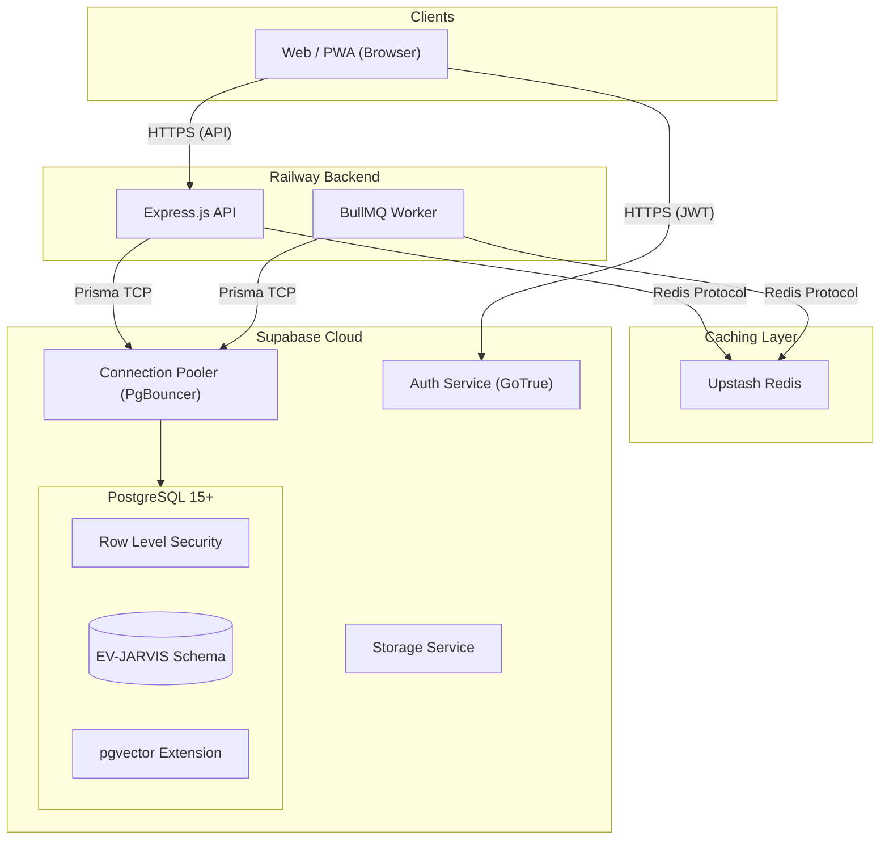
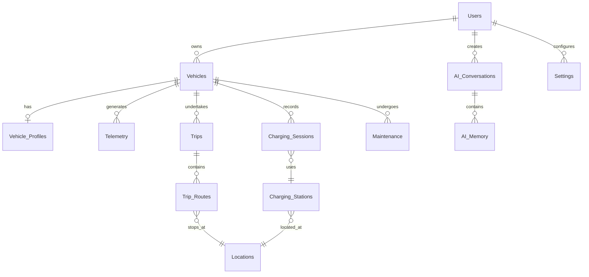

# Database Design — EV-JARVIS

> **Document ID:** DOC-015
> **Version:** 1.0.0
> **Status:** Complete
> **Project:** EV-JARVIS
> **Owner:** Chief Database Architect
> **Last Updated:** 2026-08-02
> **Document Type:** Database Architecture Documentation

---

# Table of Contents

1. [Database Overview](#1-database-overview)
2. [Database Goals](#2-database-goals)
3. [Design Principles](#3-design-principles)
4. [Database Architecture](#4-database-architecture)
5. [Entity Overview](#5-entity-overview)
6. [Core Business Tables](#6-core-business-tables)
7. [Relationships](#7-relationships)
8. [Naming Convention](#8-naming-convention)
9. [Primary Keys](#9-primary-keys)
10. [Foreign Keys](#10-foreign-keys)
11. [Composite Keys](#11-composite-keys)
12. [Constraints](#12-constraints)
13. [Index Strategy](#13-index-strategy)
14. [Partition Strategy](#14-partition-strategy)
15. [Performance Optimization](#15-performance-optimization)
16. [Caching Strategy](#16-caching-strategy)
17. [Row Level Security Design](#17-row-level-security-design)
18. [Multi-user Isolation](#18-multi-user-isolation)
19. [AI Data Storage](#19-ai-data-storage)
20. [JSON Columns](#20-json-columns)
21. [Vector-ready Design](#21-vector-ready-design)
22. [Soft Delete Strategy](#22-soft-delete-strategy)
23. [Audit Logging](#23-audit-logging)
24. [Timezone Strategy](#24-timezone-strategy)
25. [UUID Strategy](#25-uuid-strategy)
26. [Migration Strategy](#26-migration-strategy)
27. [Backup Strategy](#27-backup-strategy)
28. [Disaster Recovery](#28-disaster-recovery)
29. [Scaling Strategy](#29-scaling-strategy)
30. [Future Expansion](#30-future-expansion)

---

# 1. Database Overview

เอกสารฉบับนี้กำหนดสถาปัตยกรรมและโครงสร้างฐานข้อมูลสำหรับแพลตฟอร์ม EV-JARVIS โดยฐานข้อมูลหลักคือ **Supabase PostgreSQL** 
การออกแบบมุ่งเน้นความเป็น Production Ready, Cloud Native, Scalability และความปลอดภัยขั้นสูง (Multi-user Isolation ผ่าน RLS) 
รวมถึงการเตรียมพร้อมสำหรับระบบปัญญาประดิษฐ์ (AI Ready) เพื่อรองรับฟีเจอร์ AI Assistant, Memory, Vector Search (RAG) และ Recommendation

---

# 2. Database Goals

- **High Availability & Durability:** ข้อมูลต้องปลอดภัย ไม่สูญหาย พร้อมใช้งาน 99.9%
- **Security First:** ป้องกันการเข้าถึงข้ามบัญชี (Data Breach) ด้วยระดับ Row Level Security
- **Performance at Scale:** ตอบสนองรวดเร็วตั้งแต่ 100 ถึง 100,000 Users
- **AI Integration:** จัดเก็บ Context, ประวัติการสนทนา และรองรับการค้นหาแบบ Vector ได้ในฐานข้อมูลเดียว
- **Developer Experience:** ทำงานร่วมกับ Prisma ORM และ Type-safe ตลอดทั้ง Stack

---

# 3. Design Principles

1. **UUID as Primary Key:** ตารางหลักทั้งหมดใช้ `UUIDv4` เพื่อหลีกเลี่ยง ID Guessing (Insecure Direct Object Reference - IDOR)
2. **UTC for Time:** ฟิลด์ประเภทเวลา (`timestamptz`) ทั้งหมดต้องบันทึกเป็นเขตเวลา UTC เท่านั้น
3. **Soft Delete:** ข้อมูลสำคัญ (เช่น Users, Vehicles, Trips) ไม่ถูกลบออกจริง แต่ใช้ฟิลด์ `deleted_at` 
4. **Denormalization for Reads:** อนุญาตให้เกิด Data Redundancy ในระดับที่รับได้ผ่าน JSONB หรือฟิลด์สรุปผล (เช่น `current_soc`) เพื่อลดความซับซ้อนของการ JOIN และเพิ่มประสิทธิภาพการอ่าน
5. **Least Privilege:** ทุกการเชื่อมต่อจะถูกควบคุมสิทธิ์อย่างเข้มงวด ทั้งระดับ Table, Column และ Row

---

# 4. Database Architecture

ระบบฐานข้อมูลทำงานอยู่บน Supabase Cloud โดยมีการเชื่อมต่อ 3 ส่วนหลัก:



---

# 5. Entity Overview

ตารางข้อมูลภายในระบบแบ่งออกเป็น 5 หมวดหมู่หลัก (Domains):
1. **Identity Domain:** Users, API Keys, Settings
2. **Core Domain:** Vehicles, Vehicle Profiles, Telemetry, Maintenance
3. **Trip & Charging Domain:** Trips, Trip Routes, Charging Sessions, Charging Stations, Locations
4. **AI Domain:** AI Conversations, AI Memory, AI Recommendations
5. **System Domain:** Audit Logs, Worker Jobs, System Config, Weather Cache, Notifications

---

# 6. Core Business Tables

โครงสร้างตารางหลักที่จะปรากฏใน `schema.prisma` (แสดงเฉพาะฟิลด์สำคัญ):

### Users
ตารางผู้ใช้ อ้างอิง 1:1 กับ `auth.users` ของ Supabase
- `id` (UUID, PK) -> ผูกกับ Supabase Auth
- `email` (String, Unique)
- `name` (String)
- `role` (Enum: ADMIN, USER)
- `created_at`, `updated_at`, `deleted_at`

### Vehicles
ตารางหลักของรถยนต์
- `id` (UUID, PK)
- `user_id` (UUID, FK -> Users)
- `vin` (String, Unique) - หมายเลขตัวถัง
- `make`, `model`, `year` (String)
- `license_plate` (String)
- `battery_capacity_kwh` (Float)
- `current_soc` (Int) - Caching ค่าแบตเตอรี่ล่าสุด
- `is_primary` (Boolean)

### Vehicle Profiles
การตั้งค่าเฉพาะของรถแต่ละคัน (เพื่อช่วย AI วางแผน)
- `id` (UUID, PK)
- `vehicle_id` (UUID, FK -> Vehicles, Unique)
- `max_charge_limit` (Int)
- `preferred_charging_networks` (JSONB)
- `average_consumption_kwh_per_100km` (Float)

### Battery Status
ประวัติและสุขภาพของแบตเตอรี่ระยะยาว (SOH)
- `id` (UUID, PK)
- `vehicle_id` (UUID, FK -> Vehicles)
- `recorded_at` (DateTime)
- `state_of_health` (Float)
- `cycle_count` (Int)

### Charging Sessions
ประวัติการชาร์จไฟ
- `id` (UUID, PK)
- `vehicle_id` (UUID, FK -> Vehicles)
- `station_id` (UUID, Nullable FK -> Charging Stations)
- `start_time`, `end_time` (DateTime)
- `start_soc`, `end_soc` (Int)
- `kwh_added` (Float)
- `total_cost` (Float)

### Trips
การเดินทาง
- `id` (UUID, PK)
- `vehicle_id` (UUID, FK -> Vehicles)
- `origin_id`, `destination_id` (UUID, FK -> Locations)
- `start_time`, `end_time` (DateTime)
- `distance_km` (Float)
- `energy_consumed_kwh` (Float)
- `status` (Enum: PLANNED, IN_PROGRESS, COMPLETED, CANCELLED)

### Trip Routes
จุดแวะพัก/เส้นทางย่อยภายในทริป
- `id` (UUID, PK)
- `trip_id` (UUID, FK -> Trips)
- `step_order` (Int)
- `location_id` (UUID, FK -> Locations)
- `estimated_arrival` (DateTime)

### Locations
ตารางรวมสถานที่ (บ้าน, ที่ทำงาน, จุดแวะพัก)
- `id` (UUID, PK)
- `user_id` (UUID, Nullable FK -> Users) - หากเป็น Location ส่วนตัว
- `name` (String)
- `latitude`, `longitude` (Float)
- `address` (String)

### Charging Stations
ข้อมูลสถานีชาร์จสาธารณะ
- `id` (UUID, PK)
- `location_id` (UUID, FK -> Locations)
- `provider_name` (String)
- `plug_types` (JSONB)
- `max_kw` (Float)
- `is_active` (Boolean)

### Notifications
- `id` (UUID, PK)
- `user_id` (UUID, FK -> Users)
- `title`, `body` (String)
- `type` (Enum: ALERT, SYSTEM, MAINTENANCE, AI)
- `is_read` (Boolean)

### Settings
- `id` (UUID, PK)
- `user_id` (UUID, FK -> Users)
- `preferences` (JSONB) - เก็บธีม, ภาษา, แจ้งเตือน

### AI Conversations
เก็บประวัติแชทกับ AI (Session)
- `id` (UUID, PK)
- `user_id` (UUID, FK -> Users)
- `title` (String)
- `started_at`, `last_updated_at` (DateTime)

### AI Memory
เก็บข้อความ (Messages) และ Vector Embeddings เพื่อทำ RAG
- `id` (UUID, PK)
- `conversation_id` (UUID, Nullable FK)
- `user_id` (UUID, FK -> Users)
- `role` (Enum: USER, ASSISTANT, SYSTEM, TOOL)
- `content` (String)
- `tool_calls`, `tool_results` (JSONB)
- `embedding` (Vector - Future Use)

### AI Recommendations
สิ่งที่ AI แนะนำให้ทำ (เช่น สลับยาง, ชาร์จไฟพรุ่งนี้)
- `id` (UUID, PK)
- `user_id` (UUID, FK -> Users)
- `vehicle_id` (UUID, Nullable FK -> Vehicles)
- `context` (String)
- `action_type` (String)
- `status` (Enum: PENDING, APPLIED, DISMISSED)

### Maintenance
ประวัติการซ่อมบำรุง
- `id` (UUID, PK)
- `vehicle_id` (UUID, FK -> Vehicles)
- `date` (DateTime)
- `description` (String)
- `cost` (Float)
- `odometer_km` (Int)

### Telemetry
ข้อมูลเรียลไทม์ที่ส่งมาจากรถยนต์ (ออกแบบเพื่อรองรับ Time-Series)
- `id` (UUID, PK)
- `vehicle_id` (UUID, FK -> Vehicles)
- `timestamp` (DateTime)
- `speed_kmh` (Float)
- `soc` (Int)
- `latitude`, `longitude` (Float)

### Weather Cache
ลดการเรียก API สภาพอากาศภายนอกซ้ำซ้อน
- `id` (UUID, PK)
- `latitude`, `longitude` (Float)
- `forecast_data` (JSONB)
- `expires_at` (DateTime)

### Audit Logs
บันทึกเหตุการณ์สำคัญเพื่อ Security (Security Requirement)
- `id` (UUID, PK)
- `user_id` (UUID, Nullable FK)
- `action` (String)
- `resource_type`, `resource_id` (String)
- `ip_address`, `user_agent` (String)
- `details` (JSONB)

### API Keys
- `id` (UUID, PK)
- `user_id` (UUID, FK -> Users)
- `hashed_key` (String)
- `scopes` (JSONB)
- `expires_at` (DateTime)

### System Config
- `key` (String, PK)
- `value` (JSONB)

### Worker Jobs
- (ใช้งาน BullMQ ภายใน Redis เป็นหลัก แต่มีตารางนี้สำหรับพัก Job ที่ 실패)

---

# 7. Relationships



---

# 8. Naming Convention

- **Tables:** `snake_case` รูปพหูพจน์ (เช่น `users`, `charging_sessions`)
- **Columns:** `snake_case` (เช่น `created_at`, `current_soc`)
- **Foreign Keys:** `{table_singular}_id` (เช่น `vehicle_id`)
- **Indexes:** `idx_{table}_{column}` (เช่น `idx_telemetry_vehicle_id`)
- **Boolean fields:** นำหน้าด้วย `is_` หรือ `has_` (เช่น `is_active`)

*(หมายเหตุ: Prisma Model จะเขียนด้วย PascalCase และ camelCase ตามมาตรฐาน TypeScript แต่จะทำ Map ลง Database เป็น snake_case ผ่าน `@map` และ `@@map`)*

---

# 9. Primary Keys

ใช้ **UUIDv4** ล้วนสำหรับทุกตารางธุรกิจ เพื่อป้องกันให้การคาดเดารหัส และปลอดภัยในการแบ่งพาร์ติชัน/สเกลในอนาคต:
```prisma
id String @id @default(uuid()) @db.Uuid
```

---

# 10. Foreign Keys

กำหนด Foreign Keys พร้อมระดับการตรวจสอบ Referential Integrity อย่างชัดเจน:
- `ON DELETE CASCADE`: สำหรับความสัมพันธ์แบบพึ่งพาเด็ดขาด (เช่น รถยนต์ลบทิ้ง Profile ต้องหายไป, ทริปลบ ทริปรูตต้องหาย)
- `ON DELETE SET NULL` หรือ `RESTRICT`: สำหรับความสัมพันธ์แบบพึ่งพาหลวม (เช่น สถานีชาร์จถูกลบ แต่ประวัติการชาร์จต้องคงอยู่)

---

# 11. Composite Keys

สำหรับตารางความสัมพันธ์ M:N หรือตาราง System บางประเภท (เช่น System Config) อาจใช้ Composite Key:
```prisma
@@id([vehicle_id, date]) // ตัวอย่าง Time-series summary
```

---

# 12. Constraints

- **Unique Constraints:** บังคับค่าที่ไม่ซ้ำ (เช่น `email` ใน Users, `vin` ใน Vehicles)
- **Check Constraints:** บังคับความถูกต้องของข้อมูล (เช่น `soc` ต้องอยู่ระหว่าง 0 ถึง 100) (สามารถใช้ Check Constraint ของ Postgres หรือทำผ่าน Zod ในระดับ API)
- **Not Null:** ห้ามใส่ค่าว่างในฟิลด์จำเป็นทั้งหมด

---

# 13. Index Strategy

เพื่อเพิ่มความเร็วในการอ่าน:
1. **Primary Key / Foreign Key Index:** สร้าง Index อัตโนมัติในทุกคอลัมน์ที่เป็น FK (เช่น `vehicle_id`, `user_id`)
2. **Time-based Index:** สร้าง B-Tree Index บนตารางใหญ่ที่มีการสืบค้นแบบ Range Query บ่อย เช่น `telemetry(timestamp)`, `charging_sessions(start_time)`
3. **Compound Index:** สำหรับ Query ที่ใช้หลายเงื่อนไขร่วมกัน เช่น `idx_ai_memory_conv_time (conversation_id, created_at)`
4. **GIN Index:** สร้างบนคอลัมน์ `JSONB` ที่ต้องการให้ค้นหาคีย์ข้างในได้เร็ว (เช่น สเปกของหัวชาร์จใน Charging Stations)

---

# 14. Partition Strategy

เมื่อระบบมีสเกลระดับ 100,000 Users ตาราง `telemetry` และ `ai_memory` จะขยายตัวมหาศาล:
- **Table Partitioning (PostgreSQL Native):** ใช้ Range Partitioning ตามเดือนบนตาราง `telemetry` (เช่น `telemetry_2026_08`, `telemetry_2026_09`) 
- ช่วยให้ Query เฉพาะเดือนที่ต้องการทำได้รวดเร็ว และทิ้ง (Drop) ข้อมูลเก่าที่หมดอายุได้โดยไม่ต้องใช้คำสั่ง DELETE

---

# 15. Performance Optimization

- ปรับจูน PgBouncer บน Supabase เพื่อรองรับ Concurrent Connections จาก Railway Serverless / BullMQ
- หลีกเลี่ยงการทำ `SELECT *` ดึงเฉพาะคอลัมน์ที่จำเป็น
- ใช้คำสั่ง Bulk Insert / Update เมื่อบันทึกข้อมูล Telemetry
- ตั้งค่า `statement_timeout` ใน Postgres เพื่อป้องกัน Query ที่ใช้เวลานานผิดปกติทำให้ฐานข้อมูลล็อก

---

# 16. Caching Strategy

ฐานข้อมูลไม่ต้องรับโหลดทั้งหมดเพียงลำพัง:
- **Upstash Redis:** เก็บข้อมูลที่มีการเรียกบ่อยแต่เปลี่ยนแปลงน้อย (เช่น `Locations`, `Charging Stations`)
- **Query Caching:** แคชผลลัพธ์ของ Dashboard ชั่วคราว (1-5 นาที)
- **Weather Cache Table:** ลดค่าใช้จ่ายในการเรียก External API ด้วยการเก็บข้อมูลพยากรณ์อากาศที่อัปเดตราย 3 ชั่วโมงลงตาราง

---

# 17. Row Level Security Design

ใช้ **PostgreSQL RLS (Row Level Security)** ใน Supabase เป็นเกราะป้องกันชั้นสุดท้าย (Defense in Depth):

ตัวอย่างนโยบายสำหรับ `Vehicles`:
- **SELECT:** `auth.uid() = user_id` (อ่านรถได้เฉพาะของตัวเอง)
- **INSERT:** `auth.uid() = user_id` (สร้างรถให้ตัวเองเท่านั้น)
- **UPDATE:** `auth.uid() = user_id` 
- **DELETE:** (ใช้ Soft Delete ผ่าน Backend API เท่านั้น, บล็อก DELETE ภายนอก)

ระบบจะเปิด `ENABLE ROW LEVEL SECURITY` สำหรับทุกตารางที่มีข้อมูลส่วนบุคคล

---

# 18. Multi-user Isolation

โครงสร้างตารางหลักผูกกับ `user_id` ทั้งหมด ทำให้สามารถจัดการ Isolation ได้สมบูรณ์ ทุก Query จาก Prisma Middleware หรือ API จะต้องแนบสิทธิ์เพื่อกรองข้อมูลข้าม Users ไม่ให้หลุดไปหากันอย่างเด็ดขาด (ป้องกัน OWASP Broken Access Control)

---

# 19. AI Data Storage

ออกแบบเพื่อรองรับ Gemini 3.1 Pro, OpenAI, Claude:
- เก็บ Prompt และ Response ทั้งหมดใน `ai_memory` 
- บันทึก Metadata เชิงเหตุผล (Reasoning Metadata) จากโมเดล เช่น `tool_calls` ให้อยู่ในคอลัมน์ JSONB
- บันทึก `role` อย่างชัดเจน (USER, ASSISTANT, TOOL, SYSTEM) เพื่อประกอบเป็น Context ส่งให้โมเดล

---

# 20. JSON Columns

ฟิลด์แบบ `JSONB` ถูกใช้อย่างมีกลยุทธ์สำหรับข้อมูลที่โครงสร้างไม่แน่นอน:
- `settings.preferences`: แตกต่างไปตามเวอร์ชันแอปพลิเคชัน
- `audit_logs.details`: เก็บ Payload ที่เปลี่ยนไป (Before/After)
- `charging_stations.plug_types`: เก็บ Array ของหัวชาร์จและกำลังไฟที่ไม่ตายตัว

---

# 21. Vector-ready Design

เพื่อรองรับ **RAG (Retrieval-Augmented Generation)** ในอนาคต:
- เปิด Extension `pgvector` บน Supabase PostgreSQL
- เพิ่มคอลัมน์ `embedding vector(1536)` ลงในเอกสารความรู้ หรือ `ai_memory` (1536 คือมิติของโมเดล `text-embedding-3-small`)
- สร้าง Index ชนิด `hnsw` หรือ `ivfflat` เพื่อความรวดเร็วในการทำ Vector Similarity Search

---

# 22. Soft Delete Strategy

ทุกตารางข้อมูลหลักจะมีคอลัมน์ `deleted_at DateTime?` 
- การลบ (DELETE) ปกติจะแปลงร่างเป็น การอัปเดต (UPDATE `deleted_at` = Now)
- Prisma Client จะมีการติดตั้ง Global Middleware (หรือ Extension) เพื่อต่อท้ายเงื่อนไข `WHERE deleted_at IS NULL` อัตโนมัติทุกการ Query
- ฐานข้อมูลจะลบจริงผ่าน Worker (Hard Delete) เฉพาะเมื่อข้อมูลเก่าเกิน 3 ปี หรือ User ร้องขอ (GDPR / PDPA)

---

# 23. Audit Logging

บันทึกทุกกิจกรรมรุนแรง (เช่น สร้าง, แก้ไข, ลบ) ของรถยนต์ การเปลี่ยนพาสเวิร์ด และการตั้งค่า เพื่อความปลอดภัย:
- ข้อมูล Audit Logs เป็นแบบ Immutable (เขียนแล้วห้ามแก้)
- ควบคุมสิทธิ์ด้วย RLS ให้ User ธรรมดาอ่านได้เฉพาะกิจกรรมของตัวเอง ส่วน Admin จะเห็นภาพรวม
- รองรับการ Export เป็นไฟล์ CSV/JSON ได้

---

# 24. Timezone Strategy

- บังคับการเก็บ Timestamp ทั้งหมดเป็น `TIMESTAMPTZ` (Timestamp with Time Zone) 
- ฐานข้อมูลจะประมวลผลเป็น UTC+0 
- Frontend (React) หรือ Backend API ทำหน้าที่แปลงเขตเวลา (เช่น `Asia/Bangkok` GMT+7) ในจังหวะแสดงผล (Presentation Layer) เท่านั้น

---

# 25. UUID Strategy

- UUID (Universally Unique Identifier) ป้องกันไม่ให้แฮ็กเกอร์สามารถคาดเดาหมายเลข Sequence รถของระบบได้ 
- ช่วยให้การเชื่อมข้อมูลข้ามฐานข้อมูล (ถ้ามีในอนาคต) ไม่เกิดการชนกันของ ID

---

# 26. Migration Strategy

- เครื่องมือ: **Prisma Migrate**
- ทุกการแก้ไข `schema.prisma` จะต้องรันคำสั่ง `prisma migrate dev --create-only` เพื่อสร้างไฟล์ `.sql` สำหรับรีวิว
- CI/CD (GitHub Actions) จะทำหน้าที่รัน `prisma migrate deploy` เพื่อติดตั้ง Migration ขึ้น Staging และ Production อัตโนมัติ
- ไม่อนุญาตให้แก้ไข Schema บน Production Supabase Dashboard โดยตรงเด็ดขาด

---

# 27. Backup Strategy

ระบบของ Supabase จัดการ Backup:
- **Daily Automated Backups:** จัดเก็บอัตโนมัติบนระบบคลาวด์แยกส่วน
- **Point-in-Time Recovery (PITR):** เปิดใช้งานสำหรับแพ็กเกจ Pro ขึ้นไป ทำให้สามารถกู้คืนข้อมูลกลับไป ณ วินาทีใดก็ได้ภายใน 7-30 วันที่ผ่านมา
- การตั้งค่าเพิ่มเติม: Backup รหัสผ่าน/API Key เก็บไว้อย่างปลอดภัย (Encrypt Backup)

---

# 28. Disaster Recovery

- **RPO (Recovery Point Objective):** < 1 นาที (จากฟีเจอร์ PITR ของ Supabase)
- **RTO (Recovery Time Objective):** < 15 นาที (เวลาในการสลับไปยังฐานข้อมูลสำรอง หรือ Restore จาก Backup ล่าสุด)
- ในกรณีฐานข้อมูลหลักล่ม สคริปต์ Infrastructure (หรือ Supabase Dashboard) จะสามารถปลุก Database Instance ใหม่และเรียกคืนข้อมูลได้อย่างรวดเร็ว

---

# 29. Scaling Strategy

แผนรองรับการเติบโตของฐานข้อมูล:
- **100 Users (MVP):** Supabase Shared Instance, ไม่ต้องมี Caching มาก, PgBouncer Pool Size = 15
- **1,000 Users:** เริ่มเปิดการใช้งาน Upstash Redis เพื่อ Cache ข้อมูลสถานีชาร์จ, ปรับ Index Strategy ค้นหาได้เร็วขึ้น
- **10,000 Users:** ทำ Database Read Replicas หากปริมาณการอ่านข้อมูล (เช่น Dashboard) สูงขึ้น, แยก Worker DB ออกจาก Primary
- **100,000 Users:** ใช้ Partitioning บนตาราง `telemetry`, ลดระยะเวลาเก็บข้อมูล (Archiving Data) ลง Cold Storage (S3) สำหรับข้อมูลที่เกิน 1 ปี

---

# 30. Future Expansion

โครงสร้างฐานข้อมูลออกแบบมารองรับ:
- **Fleet Management:** (ตาราง `fleets` ควบคุมรถพร้อมกันหลายสิบคัน)
- **Predictive Maintenance:** การใช้ Machine Learning อ่านข้อมูลจาก Time-series Telemetry
- **Hardware Integration (IoT):** ต่อท่อรับข้อมูล OCPP จากสถานีชาร์จ (Charging Station) โดยตรง
- **Blockchain / Web3:** สร้างคอลัมน์เก็บ Wallet Address หากโปรเจกต์ต้องการจ่ายค่าชาร์จด้วยคริปโทฯ

---
*(หมายเหตุ: เอกสารนี้เป็นสถาปัตยกรรมระดับ Database Design โครงสร้างตารางจริงในระดับ Code จะอ้างอิงและพัฒนาต่อยอดจากเอกสารฉบับนี้ผ่าน Prisma Schema)*
