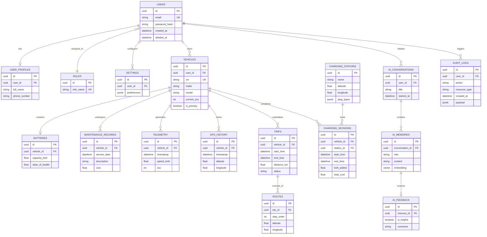

# Entity Relationship Diagram (ERD) — EV-JARVIS

> **Document ID:** DOC-016
> **Version:** 1.0.0
> **Status:** Complete
> **Project:** EV-JARVIS
> **Owner:** Chief Database Architect
> **Last Updated:** 2026-08-02
> **Document Type:** Database Architecture Documentation

---

# 1. Document Metadata

เอกสารฉบับนี้คือการออกแบบ Entity Relationship Diagram (ERD) สำหรับระบบ EV-JARVIS ซึ่งเป็นสถาปัตยกรรมระดับ Database Logical และ Physical Design สอดคล้องกับเอกสาร Database Design (DOC-015) 

---

# 2. Purpose

เพื่ออธิบายความสัมพันธ์ระหว่างตาราง (Entities) ภายในฐานข้อมูล PostgreSQL (Supabase) อย่างเป็นระบบ ทั้งในมุมมองการจัดการผู้ใช้งาน รถยนต์ไฟฟ้า การชาร์จ ข้อมูล Telemetry และระบบ AI Assistant รวมถึงการจัดการความสัมพันธ์ที่ส่งผลต่อประสิทธิภาพ (Performance) และความปลอดภัย (Security)

---

# 3. Scope

ครอบคลุมทุก Domain ของระบบ EV-JARVIS ได้แก่:
- Identity & Access Management
- Vehicle & Telemetry Management
- Trip & Charging Operations
- Maintenance & Alerts
- AI Interaction & Memory
- System Operations & Auditing

---

# 4. Database Domain Overview

ฐานข้อมูลถูกออกแบบโดยยึดหลัก Domain-Driven Design (DDD) แบ่งกลุ่มตารางที่มีความสัมพันธ์ใกล้ชิดกันออกเป็นหมวดหมู่ (Domains) เพื่อความง่ายต่อการพัฒนาและแบ่ง Partition ในอนาคต

---

# 5. Entity List

รายการตารางข้อมูลหลักที่ปรากฏในระบบ EV-JARVIS:

**Identity Domain**
- `users`: ข้อมูลพื้นฐานผู้ใช้งาน (อ้างอิง Supabase Auth)
- `user_profiles`: โปรไฟล์เพิ่มเติม ข้อมูลส่วนตัว
- `settings`: การตั้งค่าแอปพลิเคชันของผู้ใช้แต่ละคน
- `roles`: ระดับสิทธิ์ของระบบ
- `permissions`: สิทธิ์การเข้าถึงแบบละเอียด

**Vehicle & Telemetry Domain**
- `vehicles`: ข้อมูลหลักของรถยนต์ไฟฟ้า
- `batteries`: สเปกและสถานะรวมของแบตเตอรี่แต่ละลูก
- `telemetry`: ข้อมูล Real-time (SOC, อุณหภูมิ, ความเร็ว)
- `telemetry_history`: ข้อมูลสรุปรายวันเพื่อลดความหนาแน่นของตาราง
- `gps_history`: บันทึกพิกัดย้อนหลัง
- `sensor_data`: ข้อมูลเชิงลึกจากเซ็นเซอร์ (ลมยาง, แอร์)
- `energy_usage`: สถิติการใช้พลังงาน

**Trip & Charging Domain**
- `trips`: ข้อมูลการเดินทางแต่ละครั้ง
- `routes`: เส้นทางและจุดแวะพักภายในทริป
- `trip_statistics`: สถิติสรุปหลังจบการเดินทาง (ระยะทางรวม, ประสิทธิภาพ)
- `charging_sessions`: ประวัติการชาร์จไฟ (เวลา, ปริมาณไฟ, ราคา)
- `charging_stations`: ข้อมูลสถานีชาร์จสาธารณะ

**Maintenance & Alerts Domain**
- `maintenance_records`: ประวัติการบำรุงรักษา
- `service_history`: การเข้าศูนย์บริการ
- `alerts`: การแจ้งเตือนระดับระบบ (เช่น แบตเตอรี่ร้อน)
- `notifications`: ข้อความแจ้งเตือนถึงผู้ใช้ (Push / In-app)

**AI Domain**
- `ai_conversations`: กลุ่มของการพูดคุย (Sessions)
- `ai_memories`: ข้อความแชท (Messages) หรือ Context ในการคุย
- `ai_feedback`: ฟีดแบ็กจากผู้ใช้ต่อคำตอบ AI (Like/Dislike)

**System & Integration Domain**
- `system_logs`: Log การทำงานของระบบ
- `audit_logs`: ประวัติการกระทำสำคัญ (Create, Delete, Auth)
- `api_keys`: กุญแจสำหรับการเชื่อมต่อภายนอก (Developer API)
- `integrations`: สถานะการเชื่อมต่อกับบริการภายนอก (Google Maps, ODB2 Provider)

---

# 6. Entity Relationship Description

- **One-to-One (1:1):** 
  - `users` (1) ↔ `user_profiles` (1)
  - `vehicles` (1) ↔ `batteries` (1)
- **One-to-Many (1:N):** 
  - `users` (1) ↔ `vehicles` (N) (ผู้ใช้ 1 คนมีรถได้หลายคัน)
  - `vehicles` (1) ↔ `charging_sessions` (N)
  - `vehicles` (1) ↔ `telemetry` (N)
  - `ai_conversations` (1) ↔ `ai_memories` (N)
- **Many-to-Many (M:N):**
  - `users` ↔ `roles` (ผูกผ่านตารางกลางถ้าต้องการให้ User มีหลาย Role, ปัจจุบันใช้ One-to-Many กรณีที่ User หนึ่งมีเพียง 1 Role หลัก)
- **Optional Relationships:**
  - `charging_sessions` อาจมีหรือไม่มี `charging_stations_id` ก็ได้ (กรณีชาร์จไฟบ้าน)
- **Cascade Delete Rules:**
  - `ON DELETE CASCADE` สำหรับความสัมพันธ์พึ่งพาที่ขาดกันไม่ได้ เช่น หาก `ai_conversations` ถูกลบ `ai_memories` ทั้งหมดภายใต้ Session นั้นจะต้องถูกลบทิ้งทันที

---

# 7. Primary Keys

ทุกตารางใช้ **UUIDv4** เป็น Primary Key `id` ป้องกันพฤติกรรมเดาสุ่ม ID แบบต่อเนื่อง และเหมาะสำหรับการทำ Database Sharding ในอนาคต:
- `id UUID PRIMARY KEY DEFAULT uuid_generate_v4()`

---

# 8. Foreign Keys

คอลัมน์ที่เป็น Foreign Key จะต้องลงท้ายด้วย `_id` และอ้างอิง `id` จากตารางเป้าหมาย พร้อมตั้งค่า Constraint ให้ชัดเจน เช่น `user_id UUID REFERENCES users(id)`

---

# 9. Composite Keys

ถูกนำมาใช้ในตารางแบบความสัมพันธ์ หรือข้อมูลสรุปรายวันเพื่อป้องกันข้อมูลซ้ำซ้อน:
- ตารางความสัมพันธ์ `role_permissions (role_id, permission_id)`
- ตารางสรุปเวลา `telemetry_history (vehicle_id, date)`

---

# 10. Unique Constraints

บังคับข้อมูลที่ไม่ซ้ำซ้อนระดับฐานข้อมูล (Database Constraint):
- `users.email`
- `vehicles.vin` (Vehicle Identification Number)
- `api_keys.key_hash`

---

# 11. Index Strategy

เพิ่มความเร็วในการสืบค้น (Query Optimization):
- **B-Tree:** สร้างบนคอลัมน์ที่เป็น Foreign Keys (`vehicle_id`, `user_id`)
- **BRIN (Block Range Index):** สร้างบนตาราง Time-series ใหญ่อย่าง `telemetry(timestamp)` และ `gps_history(timestamp)` เนื่องจากมีข้อมูลเรียงตามเวลาเป็นจำนวนมาก
- **GIN:** สร้างบนตารางที่ใช้สืบค้นคำ (Full-Text Search) และฟิลด์ `JSONB`

---

# 12. Partition Strategy

- **Range Partitioning:** นำมาใช้กับตาราง `telemetry`, `sensor_data` และ `system_logs` โดยตัดรอบ (Partition) เป็นรายเดือน หรือ รายไตรมาส ป้องกันฐานข้อมูลช้าลงเมื่อสะสมข้อมูลเป็นปี

---

# 13. Time-Series Storage Strategy

สำหรับข้อมูลที่ไหลเข้ามาตลอดเวลาจากรถยนต์ (Telemetry):
- แยกข้อมูล Real-time เก็บใน `telemetry`
- นำข้อมูลเก่ากว่า 7 วันมารวมผล (Aggregation) เป็น `telemetry_history` (ข้อมูลรายวัน/รายชั่วโมง) 
- ข้อมูลความละเอียดสูงใน `telemetry` จะถูกทยอยลบ (Retention Policy = 30-90 วัน) 

---

# 14. JSONB Usage

ใช้ `JSONB` เก็บข้อมูลที่เปลี่ยนแปลงโครงสร้างได้อิสระ (Schema-less):
- `settings.preferences`: เก็บค่าคอนฟิกต่าง ๆ ของแอป (Dark Mode, Language)
- `api_keys.scopes`: Array ของสิทธิ์ที่ Key นั้นทำได้
- `integrations.config`: ข้อมูลเชื่อมต่อ Provider แต่ละค่ายที่ไม่เหมือนกัน
- `audit_logs.payload`: เก็บ JSON Before/After ของข้อมูลที่ถูกแก้ไข

---

# 15. Vector-ready Design (Future AI Memory)

เพื่อรองรับ LLM RAG (Retrieval-Augmented Generation):
- ตาราง `ai_memories` จะต้องเตรียมพร้อมสำหรับคอลัมน์ `embedding vector(1536)` (ผ่าน pgvector extension)
- ทำให้ AI สามารถสืบค้นประวัติแชทเก่าด้วยความหมาย (Semantic Search) แทนการเทียบคำตรง ๆ 

---

# 16. Row Level Security Considerations

ใช้คุณสมบัติเด่นของ Supabase (PostgreSQL RLS):
- แพลตฟอร์มรับประกัน **Multi-Tenant Isolation** ตาราง `vehicles`, `trips`, `ai_conversations` จะมีนโยบาย `auth.uid() = user_id` กำกับเสมอ
- API ข้ามลูกค้าระหว่าง Users จะถูก Block อัตโนมัติจากชั้นฐานข้อมูล

---

# 17. Data Lifecycle

- **Hot Data:** ข้อมูลที่เข้าถึงบ่อย (Users, Active Trips, Latest Telemetry) เก็บในตารางปกติ
- **Warm Data:** ประวัติแชท AI, ประวัติการชาร์จ เก็บในตารางปกติ แต่อาจไม่แสดงผลทันทีจนกว่าผู้ใช้จะกดดูย้อนหลัง
- **Cold Data:** ระบบ Audit Logs เก่ากว่า 1 ปี จะย้าย (Archive)

---

# 18. Archiving Strategy

สำหรับข้อมูลที่มีอายุนานเกินกำหนด (Data Retention):
- ระบบจะรัน Cron Job (ผ่าน BullMQ Worker) ทำการ Export ข้อมูลจาก `telemetry` ปีก่อนขึ้น Object Storage (S3 / Supabase Storage) รูปแบบ `.csv` หรือ `.parquet` และลบออกจากฐานข้อมูลหลัก (Hard Delete) เพื่อคืนพื้นที่ (Disk Space)

---

# 19. Mermaid ER Diagram

แผนภาพความสัมพันธ์ระหว่างตาราง (Logical Data Model):

---

# 20. Future Expansion

โครงสร้าง ERD นี้ถูกออกแบบมาให้รองรับการขยายตัว (Extensibility) ในอนาคต:
- **Fleet Management:** สามารถเพิ่มตาราง `fleets` และความสัมพันธ์ `fleet_vehicles` (M:N) เพื่อให้บริษัทรถเช่าหรือธุรกิจขนส่งจัดการรถหลายร้อยคันได้
- **Smart Contracts / Payments:** เตรียมตาราง `wallets` และ `transactions` เพื่อรับชำระค่าชาร์จไฟหรือจ่ายค่าบำรุงรักษาในแอป

---

# 21. Revision History

| Version | Date | Status | Author | Change Description |
|---|---|---|---|---|
| 1.0.0 | 2026-08-02 | Complete | Chief Database Architect | สร้างเอกสารการออกแบบ Entity Relationship Diagram (ERD) เบื้องต้นครบทุก Domains ครอบคลุมผู้ใช้งาน รถยนต์ สถานีชาร์จ ทริป Telemetry และประวัติการสนทนาของ AI พร้อมแนวทางการเพิ่มประสิทธิภาพการค้นหาข้อมูล (Indexes/Partitions) |
