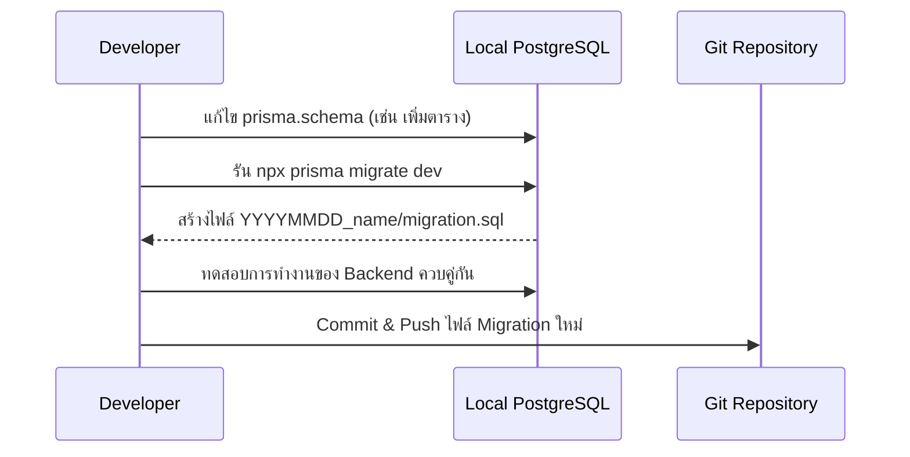
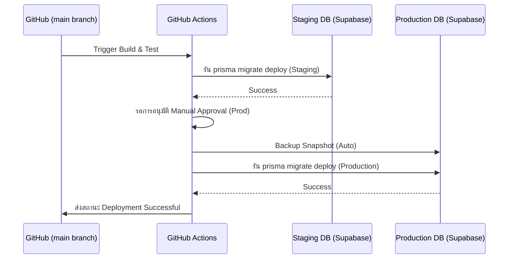

# Database Migration Guide — EV-JARVIS

> **Document ID:** DOC-018
> **Version:** 1.0.0
> **Status:** Complete
> **Project:** EV-JARVIS
> **Owner:** Chief Database Architect, PostgreSQL Migration Specialist
> **Last Updated:** 2026-08-02
> **Database Engine:** PostgreSQL 15+ (Supabase)

---

## 1. Metadata

เอกสารคู่มือการบริหารจัดการฐานข้อมูล (Database Migration Guide) ฉบับนี้ ระบุกระบวนการเปลี่ยนผ่านโครงสร้างฐานข้อมูล (Schema Evolution) การตั้งค่าข้อมูลพื้นฐาน (Seed Data) และการนำขึ้นระบบ (Deployment) สู่สภาพแวดล้อม Production สำหรับแพลตฟอร์ม EV-JARVIS

---

## 2. Purpose

เพื่อป้องกันความผิดพลาดอันนำไปสู่การสูญหายของข้อมูล (Data Loss) หรือการหยุดชะงักของบริการ (Downtime) อันเนื่องมาจากการเปลี่ยนแปลงฐานข้อมูล โดยการบังคับใช้กระบวนการทางวิศวกรรมที่สามารถตรวจสอบ ย้อนกลับ และทำงานร่วมกับ CI/CD ได้อย่างมีประสิทธิภาพสูงสุด

---

## 3. Scope

ครอบคลุมทุกองค์ประกอบบน Supabase PostgreSQL ได้แก่ Schema, Tables, Indexes, Constraints, Triggers, Functions, RLS Policies, Extensions และข้อมูล Reference (Seed Data) ห้ามแก้ไขโครงสร้างผ่าน GUI ของ Supabase โดยเด็ดขาด การเปลี่ยนแปลงทั้งหมดต้องทำผ่านระบบ Migration

---

## 4. Migration Strategy

ระบบ EV-JARVIS ใช้กลยุทธ์ **Prisma Migrate** เป็นหัวใจหลักในการจัดการ:
- `prisma migrate dev` สำหรับการพัฒนาใน Local
- `prisma migrate deploy` สำหรับ Staging และ Production
- ไฟล์ Migration ทุกไฟล์ต้องเป็น Immutable (ห้ามแก้ไขย้อนหลังเมื่อถูก Deploy ไปแล้ว)
- ทุกการแก้ปัญหาหรือเพิ่มฟีเจอร์ ต้องสร้างไฟล์ Migration ใหม่เท่านั้น (Forward-only Migration)

---

## 5. Versioning Strategy

ควบคุมเวอร์ชันฐานข้อมูลผ่านชื่อโฟลเดอร์ Migration ที่อิงกับ Timestamp (เช่น `YYYYMMDDHHMMSS_description`) ควบคู่กับระบบควบคุมเวอร์ชัน (Git) เพื่อให้สามารถสืบค้นประวัติย้อนหลังได้ 100%

---

## 6. Database Initialization

ขั้นตอนเตรียมพร้อมฐานข้อมูลเมื่อสร้าง Environment ใหม่ (เช่น การจำลอง Local หรือตั้ง Server ชุดใหม่):
1. ติดตั้ง Postgres Extensions ที่จำเป็น
2. รัน Migration Files เรียงตามลำดับเวลา
3. รัน Seed Data Files เพื่อนำเข้าข้อมูล Reference

---

## 7. Migration Folder Structure

โครงสร้างของระบบ Database Migration ภายใน Repository:

```
prisma/
  ├── schema.prisma           # โครงสร้างล่าสุด 
  ├── migrations/
  │   ├── 20260801000000_init/
  │   │   └── migration.sql
  │   ├── 20260802000000_add_vehicles/
  │   │   └── migration.sql
  ├── seed/
  │   ├── 01_roles.sql
  │   ├── 02_permissions.sql
```

---

## 8. Migration Naming Convention

- ตัวอักษรพิมพ์เล็กทั้งหมด (Lowercase)
- คั่นด้วย Underscore (Snake Case)
- อธิบายสิ่งที่ทำอย่างกระชับ
- **ตัวอย่าง:** `20260801123000_create_users_table.sql`, `20260802140000_add_ai_memory_index.sql`

---

## 9. Initial Schema Creation

ในการสร้าง Schema แรกของโปรเจกต์ (`20260801000000_init`):
- ห้ามดึงข้อมูลตัวอย่างทางธุรกิจ (Dummy Data) มาใส่
- จะต้องสร้างตารางตาม `02_ERD.md` ทุกตารางในรอบเดียวเพื่อเป็นการเซ็ตอัพ Base Schema 

---

## 10. Seed Data Strategy

ข้อมูลประเภท Seed Data จะถูกแยกออกจาก Migration (Schema Change) อย่างเด็ดขาด:
- การนำเข้าข้อมูลหลักจะรันผ่านคำสั่ง `npx prisma db seed`
- ข้อมูล Seed ต้องเป็น Idempotent (สามารถรันซ้ำได้โดยไม่ก่อให้เกิด Error หรือข้อมูลซ้ำซ้อน) เช่น การใช้คำสั่ง `INSERT ... ON CONFLICT DO NOTHING` หรือ `UPSERT`

---

## 11. Reference Data

ข้อมูลจำเป็นที่ต้องมีเพื่อให้ระบบเริ่มทำงานได้ (Reference Data):
- **Role Table:** ข้อมูลบทบาท
- **Permission Table:** ข้อมูลสิทธิ์
- **System Config:** การตั้งค่าพื้นฐาน 

---

## 12. Default Roles

Seed Script จะต้องสร้าง Role หลักลงในตาราง `roles` เสมอเมื่อเริ่มระบบ:
- `ADMIN`: ผู้ดูแลระบบ
- `USER`: เจ้าของรถ

---

## 13. Default Permissions

Seed Script สร้าง Permissions ลงในตาราง:
- `user.read`, `user.update`
- `vehicle.read`, `vehicle.create`, `vehicle.delete`
- `ai.chat`

---

## 14. Row Level Security Migration

นโยบายความปลอดภัยของแถวข้อมูล (RLS Policies) ต้องถูกประกาศในไฟล์ `.sql` Migration แยก (เพื่อความสะดวกในการอ่าน) หรือเขียนรวมต่อท้ายคำสั่งสร้างตาราง:
```sql
ALTER TABLE "vehicles" ENABLE ROW LEVEL SECURITY;
CREATE POLICY "user_can_view_own_vehicle" ON "vehicles"
  FOR SELECT USING (auth.uid() = user_id);
```
หากมีการเปลี่ยนแปลง Policy จะต้องลบ (DROP) ของเดิมก่อนสร้างใหม่ (CREATE) 

---

## 15. Index Migration

การเพิ่ม Index ในฐานข้อมูล Production ขนาดใหญ่ (มากกว่า 1 แสนแถว) จะทำให้เกิด Table Lock หากใช้คำสั่ง `CREATE INDEX` ปกติ 
- **ข้อบังคับ:** ต้องใช้คำสั่ง `CREATE INDEX CONCURRENTLY` ทุกครั้งเมื่อทำ Migration บนตารางใหญ่ เพื่อไม่ให้ระบบหยุดทำงาน

---

## 16. Constraint Migration

การเพิ่ม Constraint เช่น `CHECK` หรือ `UNIQUE` บนตารางที่มีข้อมูลอยู่แล้ว อาจทำให้ Migration ล้มเหลวหากมีข้อมูลที่ผิดเงื่อนไขอยู่ 
- **ขั้นตอน:** ให้ตรวจสอบและปรับปรุงข้อมูล (Data Sanitization) ก่อนเพิ่ม Constraint หรือตั้งให้เป็น `NOT VALID` ก่อนแล้วค่อยสั่ง `VALIDATE CONSTRAINT` ในภายหลัง

---

## 17. Trigger Migration

การสร้าง Trigger (เช่น ฟังก์ชันอัปเดต `updated_at` อัตโนมัติ):
- ควรแยกเป็น 2 ส่วน: สร้างฟังก์ชัน (Function) และ สร้าง Trigger 
- ต้องเพิ่มเงื่อนไข `OR REPLACE` ป้องกัน Error หากสร้างซ้ำ

---

## 18. Function Migration

ฟังก์ชัน (Stored Procedures / Functions):
- ใช้คำสั่ง `CREATE OR REPLACE FUNCTION ...` เสมอ
- หากเปลี่ยนชนิดข้อมูล (Return Type หรือ Arguments) ต้องสั่ง `DROP FUNCTION` ของเก่าออกก่อน

---

## 19. View Migration

สำหรับตารางจำลอง (View) ที่ใช้ใน Dashboard:
- ใช้คำสั่ง `CREATE OR REPLACE VIEW` 
- การเปลี่ยนโครงสร้าง View อาจกระทบ View อื่นที่นำไปใช้ต่อ (Dependency) ต้องลำดับการทำ Migration ให้ถูกต้อง

---

## 20. Materialized View Migration

สำหรับ Materialized View ที่นำไปแคชข้อมูล (เช่น สรุปสถิติชาร์จไฟประจำเดือน):
- ไม่สามารถใช้ `OR REPLACE` ได้หากเปลี่ยนโครงสร้าง ต้องลบทิ้ง (`DROP`) แล้วสร้างใหม่ (`CREATE`)
- ต้องระบุคำสั่ง Refresh อัตโนมัติ (`REFRESH MATERIALIZED VIEW CONCURRENTLY`) เข้าสู่ Cron Job 

---

## 21. Extension Installation

ก่อนที่จะสร้างตารางใดๆ จะต้องมีไฟล์ Migration `00000000000000_install_extensions.sql` เป็นอันดับแรก:

```sql
CREATE EXTENSION IF NOT EXISTS "uuid-ossp";     -- UUID v4 generation
CREATE EXTENSION IF NOT EXISTS "pgcrypto";      -- Hashing & Encryption (Argon2)
CREATE EXTENSION IF NOT EXISTS "vector";        -- pgvector for AI memory
```

---

## 22. Rollback Strategy

โดยปกติ Prisma ไม่สนับสนุนคำสั่ง `down` (Rollback) โดยตรง:
- กรณี Migration นำไปสู่ข้อผิดพลาด **ในระหว่างการทำงานบน CI**: ให้ย้อนกลับ (Revert) Code และรัน Restore จาก Database Backup
- กรณีพบ Error **หลัง Deploy นานแล้ว (Production):** ให้สร้างไฟล์ Migration ใหม่ที่เป็นแนวทางเดินหน้า (Forward Migration) เพื่อแก้ไข (Fix Forward) หรือย้อนโครงสร้าง (Rollback Forward) เพื่อให้สอดคล้องกับแนวคิด Immutable History

---

## 23. Zero Downtime Migration

เพื่อให้ EV-JARVIS ออนไลน์ 100%:
1. **เพิ่มคอลัมน์:** สามารถทำได้ทันที (Downtime 0 วินาที)
2. **เปลี่ยนชื่อคอลัมน์:** ห้ามเปลี่ยนตรงๆ ให้ใช้วิธีเพิ่มคอลัมน์ใหม่ -> ซิงก์ข้อมูล (Dual Write) -> เปลี่ยน API ไปอ่านคอลัมน์ใหม่ -> ลบคอลัมน์เก่า (ใน Sprint ถัดไป)
3. **ลบคอลัมน์:** ไม่ทำในรอบ Deploy ที่มีการแก้ API ต้องรอจนแน่ใจว่า API ทุก Instance ไม่ได้ใช้งานคอลัมน์นั้นแล้วค่อยดรอปทิ้ง

---

## 24. Blue/Green Deployment Support

ฐานข้อมูลต้องสนับสนุน Blue/Green Deployment ของฝั่ง Application (Express.js):
- โครงสร้างฐานข้อมูลจะต้องรองรับการทำงานของ API ทั้งเวอร์ชันเก่า (Blue) และใหม่ (Green) เป็นเวลาอย่างน้อยชั่วคราว
- ปฏิบัติตามกฎ Backward Compatibility อย่างเคร่งครัด

---

## 25. Backup Strategy

ก่อนที่จะรัน `prisma migrate deploy` บน Production ทุกครั้ง (ในกรณี Schema ขนาดใหญ่หรือเสี่ยงสูง):
- CI/CD จะสั่งรัน Supabase Management API (หรือใช้ pg_dump) เพื่อทำ Logical Backup ชั่วคราวก่อนเริ่ม Migration
- ระบบของ Supabase ควรกำหนดให้สำรองข้อมูลประจำวันแบบอัตโนมัติ (PITR - Point-in-Time Recovery) ไว้แล้ว

---

## 26. Restore Strategy

หากฐานข้อมูลพัง (Corruption):
- แจ้งทีม DevOps นำเครื่องลงสู่ Maintenance Mode
- สั่งคืนค่าระบบจาก Point-in-Time Recovery ของ Supabase ไปยังเวลาก่อนทำ Migration
- หาก PITR ล้มเหลว ให้ดึงไฟล์ SQL Backup มาอิมพอร์ตผ่าน `psql`

---

## 27. Disaster Recovery

กรณีเกิดเหตุร้ายแรง (Region Down):
- ทีมงานต้องสามารถดึงไฟล์ Backup และไฟล์ Migration ล่าสุดจาก Git มา Spin-up ฐานข้อมูลในผู้ให้บริการรายอื่น หรือ Region อื่นภายในเวลาเป้าหมาย (RTO < 15 นาที)

---

## 28. Large Data Migration

เมื่อต้องย้ายหรืออัปเดตข้อมูลจำนวนมหาศาล (เช่น ตาราง Telemetry ระดับหลายล้านแถว):
- ห้ามใช้คำสั่ง `UPDATE` ในระดับ Migration ธรรมดา 
- ให้เขียน Worker Script (Node.js/BullMQ) หรือ PL/pgSQL Function ทำการอัปเดตข้อมูลเป็นชุด (Batches) ขนาดละ 1,000 แถว เพื่อป้องกัน Memory Overflow และ Table Lock

---

## 29. Data Validation

ก่อนบรรจุ (Commit) ไฟล์ Migration:
- นักพัฒนาต้องตรวจสอบไวยากรณ์ (Syntax) เสมอผ่านการรันบน Environment จำลอง 
- ไฟล์ Migration ห้ามทำลาย (Drop) คอลัมน์ที่มีข้อมูลสำคัญโดยไม่มีการสำรองล่วงหน้า

---

## 30. Migration Testing

ทดสอบระบบก่อนการอัปเดต (Integration Test):
- รันระบบบน GitHub Actions ให้สร้าง Temporary Database เปล่า
- อิมพอร์ต Migration ทั้งหมดเพื่อดูว่าสำเร็จ 100% หรือไม่
- หากเกิด Syntax Error หรือ Type Mismatch จะต้องไม่อนุญาตให้ทำการ Merge PR สู่ Main 

---

## 31. CI/CD Integration

การทำงานอัตโนมัติร่วมกับ GitHub Actions:
- เมื่อ Pull Request ถูกอนุมัติ และ Merge ลง branch `main` 
- GitHub Actions จะยืนยันตัวตนกับ Supabase (ผ่าน SUPABASE_ACCESS_TOKEN) และสั่งรัน `npx prisma migrate deploy` ไปยังสภาพแวดล้อม Staging ก่อน
- หากผ่านการทดสอบ จะรอการอนุมัติ (Manual Approval) แล้วจึงรัน Migration ไปยัง Production

---

## 32. Production Release Flow

ขั้นตอนปฏิบัติตามมาตรฐาน (Standard Operating Procedure):
1. **Pre-flight Check:** ตรวจสอบ Backup ล่าสุด (PITR Status)
2. **Migration Run:** รัน Schema Change อัตโนมัติจาก CI/CD
3. **Application Deploy:** อัปเดต Backend API และ Frontend ขึ้น Production
4. **Post-flight Check:** ตรวจสอบ Error Logs บน Grafana/Sentry และตรวจสอบความเร็วฐานข้อมูล

---

## 33. Future Expansion

กระบวนการนี้พร้อมขยายตัวรองรับ:
- การแยก Database ออกเป็น Microservices ย่อย
- การแบ่งฐานข้อมูลข้ามโซนภูมิศาสตร์ (Global Distributed Database) ด้วยการใช้ Foreign Data Wrapper (FDW) หรือ Edge Caching
- การทำ Read Replicas หากปริมาณการอ่านมหาศาล (ในกรณีนี้ Migration จะทำบน Primary Node เสมอ)

---

## 34. Revision History

| Version | Date | Status | Author | Change Description |
|---|---|---|---|---|
| 1.0.0 | 2026-08-02 | Complete | Chief Database Architect | จัดทำกระบวนการ Migration แบบ Production-ready ที่เชื่อมต่อระหว่าง Prisma ORM, Supabase และการทำงานระดับ CI/CD อธิบายความปลอดภัยและรองรับระบบที่ไร้ช่วงเวลาหยุดทำงาน (Zero Downtime) |

---

## แผนภาพกระบวนการทำงาน (Mermaid Diagrams)

### Migration Flow
(กระบวนการของนักพัฒนาในการสร้างและทดสอบการแก้ไขฐานข้อมูล)



### Deployment Flow
(กระบวนการนำการเปลี่ยนแปลงขึ้นสู่ระบบจริงผ่าน CI/CD)



### Rollback Flow
(แนวทางปฏิบัติเมื่อเกิดเหตุขัดข้องหลังจากการทำ Migration ขึ้น Production)

```mermaid
flowchart TD
    A[พบปัญหาฐานข้อมูลบน Production] --> B{เกิดจากโครงสร้างหรือ Data?}
    
    B -->|โครงสร้าง (Schema)| C[ใช้วิธี Fix Forward]
    C --> D[สร้าง Migration หักล้างอันเก่า (เช่น ลบคอลัมน์ที่ผิด)]
    D --> E[Deploy Migration ใหม่ขึ้นระบบ]
    
    B -->|ข้อมูลเสียหาย (Data Corruption)| F[ประกาศ Maintenance Mode]
    F --> G[แจ้ง Supabase ทำงาน Point-in-Time Recovery]
    G --> H[กู้ระบบกลับไปยังเวลาก่อนหน้า (RTO < 15 นาที)]
    H --> I[ระบบกลับมาปกติ พร้อมสืบหาสาเหตุ]
```
