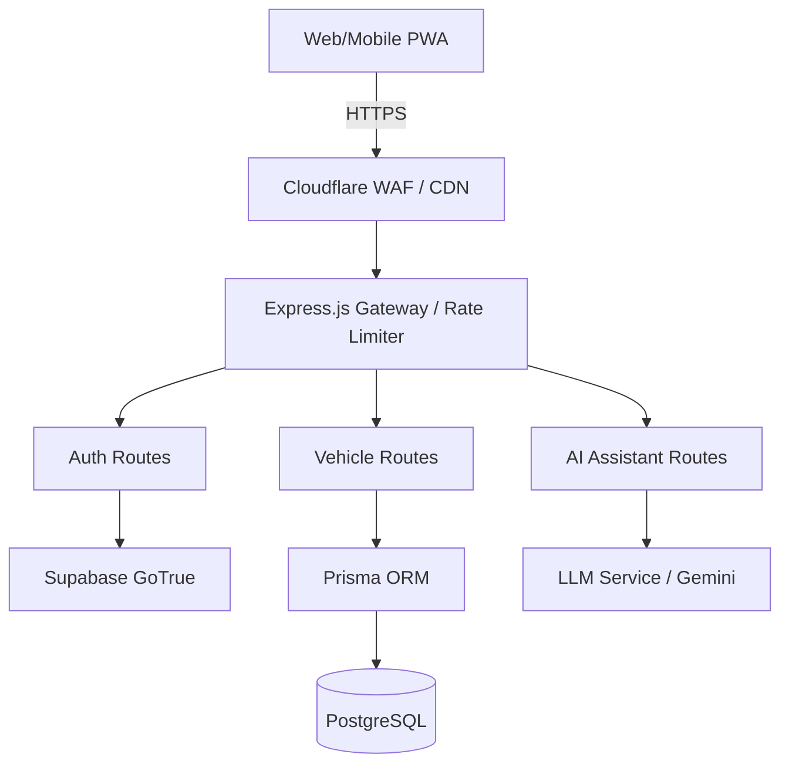
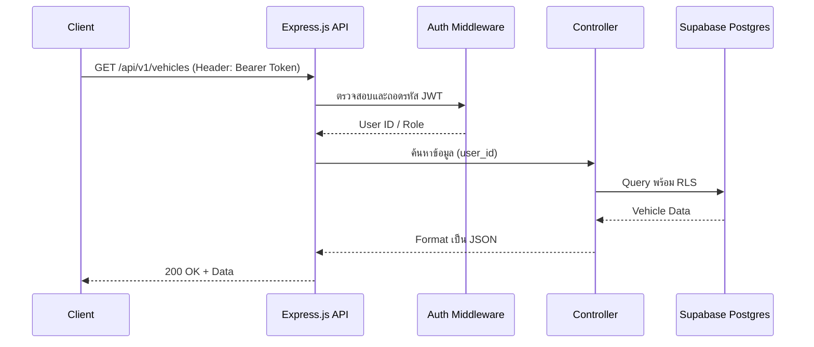
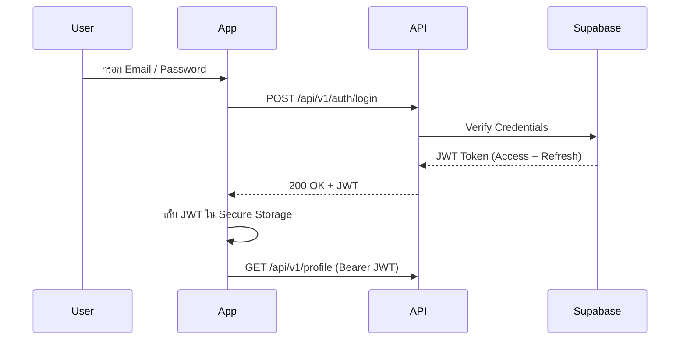
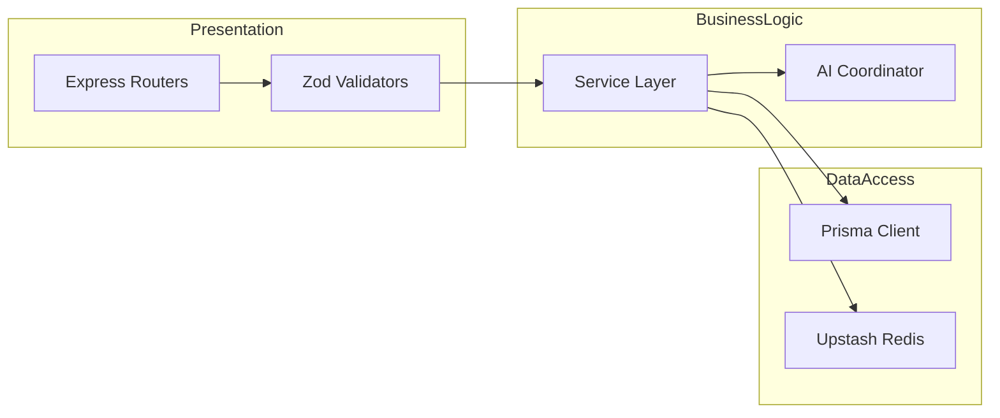

# API Specification — EV-JARVIS

> **Document ID:** DOC-019
> **Version:** 1.0.0
> **Status:** Complete
> **Project:** EV-JARVIS
> **Owner:** Principal API Architect
> **Last Updated:** 2026-08-02
> **Format:** RESTful JSON

---

## 1. Purpose
เอกสารฉบับนี้กำหนดมาตรฐานการออกแบบ (API Contract) สำหรับ RESTful API ของระบบ EV-JARVIS เพื่อให้ทีม Frontend (React/PWA) และบริการภายนอก สามารถเรียกใช้งาน Backend (Node.js/Express) ได้อย่างถูกต้อง เป็นมาตรฐานเดียวกัน และมีความปลอดภัยระดับสูงสุด

## 2. Scope
ครอบคลุมโครงสร้างของ Request/Response, ระบบ Authentication, Error Handling, Pagination, Rate Limiting และรายละเอียดของ Endpoints ทุกหมวดหมู่ ได้แก่ Authentication, Vehicle, Charging, Trip, Maintenance, Dashboard, Notification, AI Assistant, Settings และ Admin

## 3. API Design Principles
- **RESTful by Default:** ใช้ HTTP Methods (`GET`, `POST`, `PUT`, `PATCH`, `DELETE`) ตามมาตรฐาน
- **Stateless:** ทุก Request ต้องสมบูรณ์ในตัวเอง (อ้างอิงสถานะจาก JWT)
- **JSON Only:** สื่อสารด้วย `application/json` และเข้ารหัสแบบ `UTF-8`
- **Secure:** บังคับใช้ `HTTPS (TLS 1.3)` เท่านั้น ไม่อนุญาตให้ใช้ HTTP ธรรมดา
- **Predictable:** รูปแบบการตอบกลับ (Response Format) ต้องมีโครงสร้างที่คาดเดาได้เสมอ

## 4. API Versioning Strategy
- กำหนดเวอร์ชันไว้ที่ URL Path เสมอเพื่อรองรับการเปลี่ยนโครงสร้างในอนาคตโดยไม่กระทบผู้ใช้เดิม
- รูปแบบ: `/api/v1/...`

## 5. Base URL Structure
- **Production:** `https://api.ev-jarvis.com/api/v1`
- **Staging:** `https://staging-api.ev-jarvis.com/api/v1`
- **Development:** `http://localhost:4000/api/v1`

## 6. Authentication Strategy
- ใช้ **JWT (JSON Web Tokens)** ออกโดยระบบ Supabase Auth
- ส่ง Token ผ่าน HTTP Header: `Authorization: Bearer <token>`
- Token มีอายุ 1 ชั่วโมง (Short-lived) และใช้ Refresh Token เพื่อขอใหม่แบบอัตโนมัติ

## 7. Authorization Strategy
- ใช้ระบบ **RBAC (Role-Based Access Control)** 
- Endpoint ทั่วไปเข้าถึงได้เฉพาะ Role `USER` (พร้อมการตรวจสอบ Data Ownership ผ่าน RLS)
- Endpoint หมวดหมู่ Admin เข้าถึงได้เฉพาะ Role `ADMIN` เท่านั้น

## 8. Standard Request Format
```json
{
  "data": {
    "key": "value"
  }
}
```

## 9. Standard Response Format
**Success Response:**
```json
{
  "success": true,
  "data": {
    "id": "uuid",
    "name": "Tesla Model 3"
  },
  "meta": {
    "timestamp": "2026-08-02T12:00:00Z",
    "request_id": "req_123456"
  }
}
```

## 10. HTTP Status Codes
- `200 OK`: สำเร็จ
- `201 Created`: สร้าง Resource สำเร็จ
- `204 No Content`: ลบสำเร็จ ไม่มีเนื้อหาตอบกลับ
- `400 Bad Request`: ข้อมูลส่งมาผิดรูปแบบ (Validation Error)
- `401 Unauthorized`: Token หมดอายุหรือไม่ถูกต้อง
- `403 Forbidden`: ไม่มีสิทธิ์ (Role) เข้าถึง Resource นี้
- `404 Not Found`: ไม่พบข้อมูล
- `429 Too Many Requests`: ติด Rate Limit
- `500 Internal Server Error`: ข้อผิดพลาดฝั่งเซิร์ฟเวอร์

## 11. Error Response Standard
**Error Response:**
```json
{
  "success": false,
  "error": {
    "code": "VALIDATION_FAILED",
    "message": "Invalid input data",
    "details": [
      { "field": "email", "message": "Must be a valid email address" }
    ]
  },
  "meta": {
    "timestamp": "2026-08-02T12:00:00Z",
    "request_id": "req_123456"
  }
}
```

## 12. Pagination Standard
ใช้แบบ Cursor-based สำหรับข้อมูล Real-time หรือ Offset-based สำหรับข้อมูลทั่วไป:
- **Query Params:** `?page=1&limit=20`
- **Response Meta:**
```json
"pagination": {
  "total": 100,
  "page": 1,
  "limit": 20,
  "total_pages": 5
}
```

## 13. Filtering & 14. Sorting & 15. Search
- **Filter:** `?status=COMPLETED&type=FAST`
- **Sort:** `?sort=-created_at,name` (เครื่องหมายลบหมายถึง Descending)
- **Search:** `?q=tesla` (ทำ Full-Text Search)

## 16. Rate Limiting
- **Global:** 100 requests / 1 นาที / IP
- **Auth (Login/Register):** 5 requests / 5 นาที / IP
- ส่งกลับ Header: `X-RateLimit-Limit`, `X-RateLimit-Remaining`, `X-RateLimit-Reset`

## 17. Idempotency
- ทุก Endpoint แบบ `POST` และ `PATCH` ที่เกี่ยวข้องกับการเงิน/ชาร์จไฟ ต้องส่ง Header `Idempotency-Key: <uuid>` เพื่อป้องกันการส่งข้อมูลซ้ำซ้อน (Double Submit)

## 18. API Security
- ตรวจจับและบล็อก SQL Injection / XSS ผ่าน WAF
- ข้อมูล PII ใน Response จะถูกทำ Data Masking
- การเชื่อมต่อถูกบังคับเข้ารหัสด้วย HTTPS/TLS 1.3

## 19. API Naming Convention
- URL Path ใช้ `kebab-case` พหูพจน์ (เช่น `/api/v1/charging-sessions`)
- Query Parameters ใช้ `snake_case` (เช่น `start_date=...`)

---

## แผนภาพสถาปัตยกรรม (Mermaid Diagrams)

### API Architecture


### Request Flow


### Authentication Flow


### API Layer


---

## 20. Endpoint Categories

*(หมายเหตุ: นี่คือ Specification ของ Endpoint หลักในแต่ละหมวดหมู่ตามข้อกำหนดการผลิตของ EV-JARVIS)*

### 20.1 Authentication

#### `POST /auth/register`
- **Description:** สมัครสมาชิกใหม่
- **Auth Required:** No
- **Request Body:** `{"email": "...", "password": "...", "full_name": "..."}`
- **Response:** `201 Created`
- **Database:** `users`, `user_profiles`

#### `POST /auth/login`
- **Description:** เข้าสู่ระบบ
- **Auth Required:** No
- **Request Body:** `{"email": "...", "password": "..."}`
- **Response:** `200 OK` (Returns access_token, refresh_token)

#### `POST /auth/refresh-token`
- **Description:** ขอ Token ใหม่
- **Auth Required:** No (Requires Refresh Token in body/cookie)

#### `GET /auth/profile`
- **Description:** ดึงข้อมูลส่วนตัวของผู้ใช้ปัจจุบัน
- **Auth Required:** Yes (`USER`)
- **Response:** `200 OK`
- **Database:** `users`, `user_profiles`

---

### 20.2 Vehicle

#### `GET /vehicles`
- **Description:** ดูรายชื่อรถยนต์ทั้งหมดของผู้ใช้ (Vehicle CRUD)
- **Auth Required:** Yes (`USER`)
- **Response:** `200 OK` List of vehicles
- **Database:** `vehicles`, `batteries`

#### `POST /vehicles`
- **Description:** เพิ่มรถยนต์คันใหม่
- **Auth Required:** Yes (`USER`)
- **Request Body:** `{"vin": "...", "make": "Tesla", "model": "Model 3", "battery_capacity": 75}`
- **Validation:** `vin` ต้องมีความยาว 17 ตัวอักษร, `battery_capacity` > 0
- **Database:** `vehicles`, `batteries`

#### `GET /vehicles/:id/status`
- **Description:** ดึงข้อมูลสถานะล่าสุด (SOC, การเชื่อมต่อ)
- **Auth Required:** Yes (`USER`)
- **Database:** `telemetry` (ล่าสุด)

#### `GET /vehicles/:id/telemetry`
- **Description:** ดึงประวัติ Telemetry แบบ Time-series
- **Auth Required:** Yes (`USER`)

---

### 20.3 Charging

#### `GET /charging/sessions`
- **Description:** ดูประวัติการชาร์จ (พร้อม Filter และ Pagination)
- **Auth Required:** Yes (`USER`)
- **Database:** `charging_sessions`

#### `POST /charging/sessions`
- **Description:** บันทึกการชาร์จใหม่ (ในกรณีใช้ Manual หรือระบบอื่นส่งมา)
- **Auth Required:** Yes (`USER`)
- **Request Body:** `{"vehicle_id": "uuid", "station_id": "uuid", "kwh_added": 40.5, "cost": 150.00}`

#### `GET /charging/statistics`
- **Description:** ดูสถิติการชาร์จสรุปรายเดือน
- **Auth Required:** Yes (`USER`)

#### `GET /charging/stations`
- **Description:** ค้นหาสถานีชาร์จสาธารณะใกล้เคียง (Search & Filter)
- **Request Params:** `?lat=13.7&lng=100.5&radius=10`
- **Database:** `charging_stations`

#### `GET /charging/recommendation`
- **Description:** ขอคำแนะนำสถานีชาร์จจาก AI
- **Auth Required:** Yes (`USER`)

---

### 20.4 Trip

#### `POST /trips/plan`
- **Description:** ให้ AI ช่วยวางแผนการเดินทาง (Trip Planning / Navigation)
- **Auth Required:** Yes (`USER`)
- **Request Body:** `{"vehicle_id": "uuid", "origin_lat": 13.7, "dest_lat": 18.7}`
- **Response:** `200 OK` (ส่งกลับ Route พร้อมจุดแวะชาร์จ)
- **Database:** `trips`, `routes`

#### `GET /trips/history`
- **Description:** ประวัติการเดินทางที่ผ่านมา (Trip History)
- **Auth Required:** Yes (`USER`)

#### `GET /trips/:id/statistics`
- **Description:** สถิติการใช้พลังงานของทริปนั้นๆ
- **Database:** `trip_statistics`

---

### 20.5 Maintenance

#### `GET /maintenance/records`
- **Description:** ประวัติการเข้าบำรุงรักษา
- **Auth Required:** Yes (`USER`)
- **Database:** `maintenance_records`

#### `GET /maintenance/schedules`
- **Description:** แผนการเช็คระยะครั้งต่อไป (คำนวณจาก Odometer ล่าสุด)
- **Auth Required:** Yes (`USER`)

---

### 20.6 Dashboard

#### `GET /dashboard/overview`
- **Description:** สรุปข้อมูลทั้งหมดในหน้าแรก (รถ, แบต, การเดินทาง)
- **Auth Required:** Yes (`USER`)
- **Response:** Object รวมข้อมูลพร้อมสร้าง Widgets ใน Frontend
- **Database:** Aggregation ข้ามตาราง

---

### 20.7 Notification

#### `GET /notifications`
- **Description:** ดูข้อความแจ้งเตือน / Alerts
- **Auth Required:** Yes (`USER`)
- **Database:** `notifications`, `alerts`

#### `POST /notifications/push`
- **Description:** ลงทะเบียน Web Push Token (เพื่อรับ Notification จาก Service Worker)
- **Auth Required:** Yes (`USER`)

#### `PATCH /notifications/preferences`
- **Description:** ปรับแต่งการรับแจ้งเตือน
- **Auth Required:** Yes (`USER`)

---

### 20.8 AI Assistant

#### `POST /ai/conversation`
- **Description:** เริ่มหรือพูดคุยต่อกับ AI Assistant
- **Auth Required:** Yes (`USER`)
- **Request Body:** `{"conversation_id": "uuid(optional)", "message": "วันนี้ขับรถไปพัทยาต้องชาร์จกี่รอบ"}`
- **Response:** `200 OK` Streamed Response หรือ JSON Text พร้อมคำตอบ
- **Database:** `ai_conversations`, `ai_memory`
- **Related Requirements:** `AI-001`, `AI-002`

#### `GET /ai/recommendation`
- **Description:** ดึงข้อแนะนำเชิงรุก (Proactive Insights) จาก AI
- **Auth Required:** Yes (`USER`)

#### `GET /ai/history`
- **Description:** ดูประวัติการคุยกับ AI ทั้งหมด
- **Database:** `ai_conversations`

#### `GET /ai/analytics`
- **Description:** สำหรับ Admin ดูสถิติการใช้งาน AI และ Tokens 
- **Auth Required:** Yes (`ADMIN`)

---

### 20.9 Settings

#### `PATCH /settings/preferences`
- **Description:** ปรับแต่งค่าแอปพลิเคชัน (Application Settings / Privacy)
- **Auth Required:** Yes (`USER`)
- **Request Body:** JSONB Object (เช่น ธีมหน้าจอ)
- **Database:** `settings`

---

### 20.10 Admin

#### `GET /admin/users`
- **Description:** ระบบ User Management และ Role Management
- **Auth Required:** Yes (`ADMIN`)
- **Database:** `users`, `roles`

#### `GET /admin/audit-logs`
- **Description:** ดึงข้อมูลประวัติกิจกรรมระดับระบบ
- **Auth Required:** Yes (`ADMIN`)
- **Database:** `audit_logs`, `system_logs`

#### `PATCH /admin/system-config`
- **Description:** ปรับแต่งค่าตัวแปรระดับระบบ
- **Auth Required:** Yes (`ADMIN`)

---
