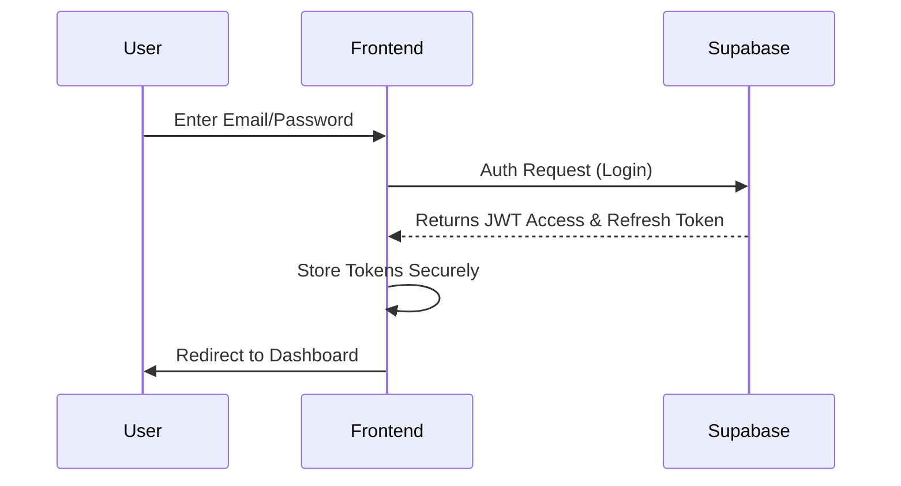
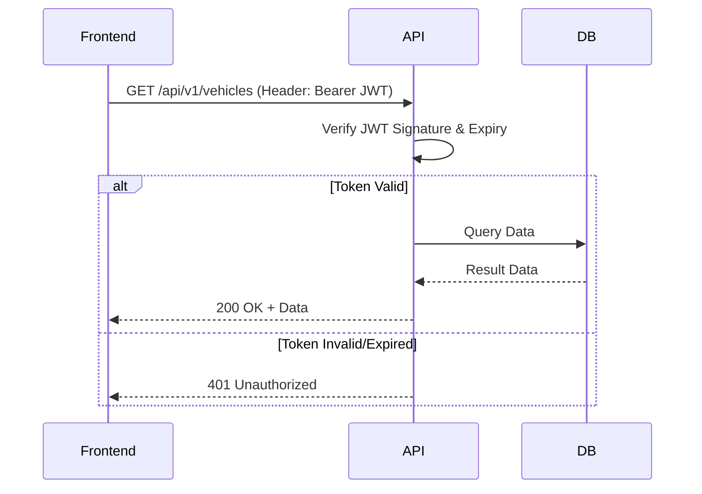
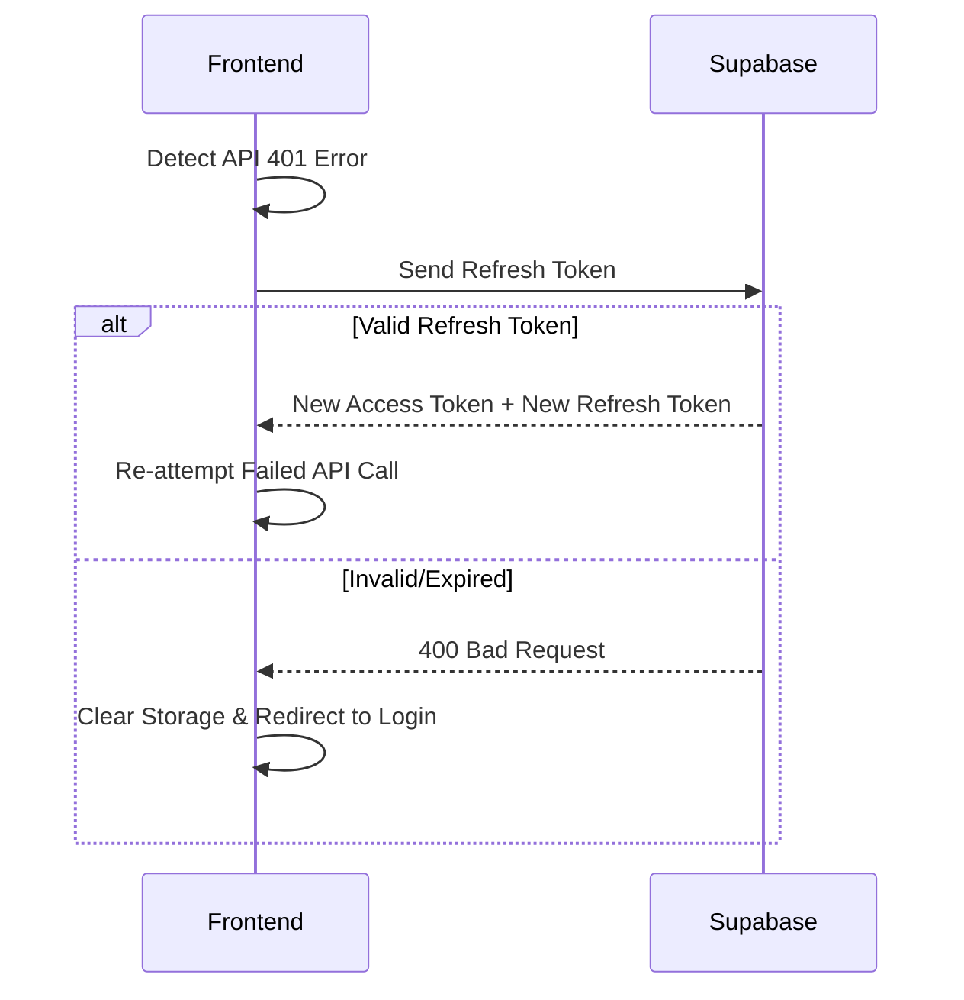
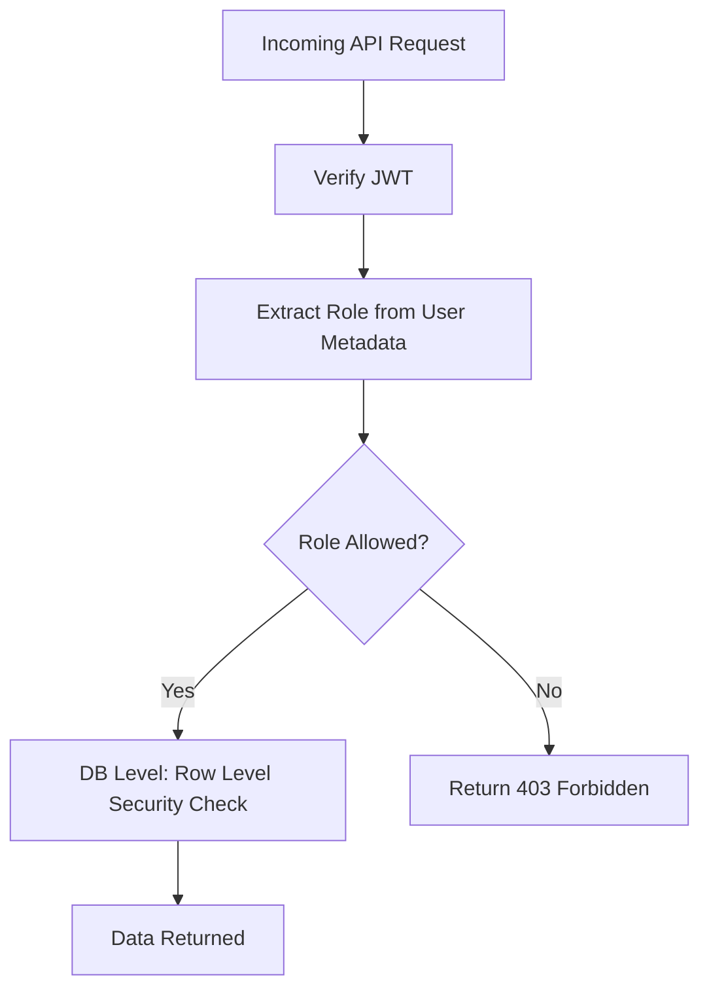

# Authentication & Authorization Architecture — EV-JARVIS

> **Document ID:** DOC-020
> **Version:** 1.0.0
> **Status:** Complete
> **Project:** EV-JARVIS
> **Owner:** Principal Security & Identity Architect
> **Last Updated:** 2026-08-02
> **Technology:** Supabase Auth (GoTrue), JWT, Express.js

---

## 1. Purpose
เอกสารฉบับนี้กำหนดมาตรฐานสถาปัตยกรรมการยืนยันตัวตน (Authentication) และการอนุญาตสิทธิ์ (Authorization) สำหรับระบบ EV-JARVIS เพื่อปกป้องข้อมูลผู้ใช้งานและการสื่อสารทั้งหมดผ่านระบบ API และ Database โดยใช้ Supabase Auth เป็นตัวจัดการหลักร่วมกับ JWT

## 2. Scope
ครอบคลุมกระบวนการจัดการบัญชีผู้ใช้ (Login, Registration, Password Reset), โครงสร้าง Token, ระบบสิทธิ์ RBAC (Role-Based Access Control), การจัดการเซสชัน และการป้องกันภัยคุกคามด้านความปลอดภัยที่เกี่ยวข้องกับการยืนยันตัวตน

## 3. Authentication Principles
- **Zero Trust:** ไม่เชื่อถือทุก Request ที่มาจากทั้งภายนอกและภายในระบบ ต้องมีการแนบ JWT เพื่อตรวจสอบทุกครั้ง
- **Stateless Tokens:** ใช้ JWT ในการยืนยันตัวตนโดยไม่เก็บสถานะเซสชันใน Server Memory 
- **Short-Lived Access:** Access Token มีอายุสั้น (1 ชั่วโมง) และต้องใช้ Refresh Token ในการขอใหม่
- **Secure Storage:** อุปกรณ์ Client ต้องเก็บ Token ใน Secure Storage หรือ `HttpOnly`, `Secure` Cookie เท่านั้น
- **Least Privilege:** ผู้ใช้ทุกคนเริ่มต้นด้วยสิทธิ์น้อยที่สุด

## 4. Identity Architecture
ระบบ Identity ขับเคลื่อนโดย **Supabase Auth (GoTrue)** ซึ่งดูแลเรื่องการ Hash รหัสผ่าน (Argon2 / Bcrypt) การส่งอีเมลยืนยัน และการออก JWT ทันทีที่การยืนยันตัวตนสำเร็จ จากนั้น JWT จะถูกส่งมายัง Backend (Express.js) ผ่าน Header เพื่อดำเนินการทางธุรกิจต่อไป

## 5. Login Flow
ผู้ใช้กรอก Email และ Password บนแอปพลิเคชัน จากนั้นแอปจะส่งไปยัง Supabase Auth หากรหัสผ่านถูกต้อง Supabase จะออก Access Token และ Refresh Token กลับมา แอปพลิเคชันจะเก็บ Token ไว้และแนบไปกับ API ขอข้อมูลส่วนตัว

## 6. Logout Flow
แอปพลิเคชันเรียกคำสั่ง Logout ไปยัง Supabase (เพื่อ Revoke Refresh Token) จากนั้นทำการล้าง Access Token ที่ฝั่ง Client (Local/Session Storage) ทันที API และแอปจะถือว่าผู้ใช้ไม่มีตัวตนอีกต่อไป

## 7. Registration Flow
ผู้ใช้กรอกข้อมูลส่วนตัวเพื่อสมัครสมาชิก ข้อมูลจะถูกบันทึกใน `auth.users` ของ Supabase จากนั้นจะมี Database Trigger (Postgres) ดักจับเหตุการณ์เพื่อสร้างบันทึกใหม่ในตาราง `public.users` ให้โดยอัตโนมัติ

## 8. Email Verification
เพื่อป้องกันสแปม ผู้ใช้ใหม่ต้องยืนยันอีเมลผ่านลิงก์ที่ถูกส่งจาก Supabase ก่อนจึงจะสามารถ Login และรับ Access Token เพื่อเข้าใช้งานระบบได้

## 9. Password Reset
ผู้ใช้ขอกู้คืนรหัสผ่านด้วยอีเมล Supabase ส่งลิงก์พร้อม Recovery Token แบบใช้ครั้งเดียว เมื่อผู้ใช้คลิกจะสามารถตั้งรหัสผ่านใหม่ได้อย่างปลอดภัย

## 10. Refresh Token Flow
เมื่อ Access Token หมดอายุ ระบบแอปพลิเคชันจะใช้ Refresh Token เพื่อขอ Access Token ใหม่จาก Supabase โดยอัตโนมัติเบื้องหลังโดยไม่ต้องบังคับให้ผู้ใช้กรอกรหัสผ่านใหม่ (Silent Refresh) หาก Refresh Token หมดอายุ ผู้ใช้จะต้อง Login ใหม่อีกครั้ง

## 11. JWT Structure
**Header:**
```json
{
  "alg": "HS256",
  "typ": "JWT"
}
```
**Payload:**
```json
{
  "aud": "authenticated",
  "exp": 1700000000,
  "iat": 1699996400,
  "sub": "user-uuid",
  "email": "user@ev-jarvis.com",
  "phone": "",
  "app_metadata": {
    "provider": "email"
  },
  "user_metadata": {
    "role": "USER"
  },
  "role": "authenticated"
}
```

## 12. Session Management
ไม่ใช้ Server-side session ฝั่ง Backend API จะอ่าน JWT Payload และทำ Trust Check ด้วย JWT Secret (ของ Supabase) แทน การจัดการเซสชันเป็นความรับผิดชอบของ Token Expiration

## 13. Role-Based Access Control (RBAC)
โครงสร้างสิทธิ์แบ่งตาม Role ที่เก็บอยู่ใน `user_metadata` ของ JWT 
ทุก API Endpoint จะมี Middleware (`requireRole`) เพื่อแกะ JWT และปฏิเสธการร้องขอที่ Role ไม่ถึง

## 14. Permission Matrix

| Resource | Guest | User | Admin | Super Admin |
|---|---|---|---|---|
| Register/Login | ✅ | ✅ | ✅ | ✅ |
| View Own Vehicles | ❌ | ✅ | ✅ | ✅ |
| AI Assistant | ❌ | ✅ | ✅ | ✅ |
| Manage All Users | ❌ | ❌ | ✅ | ✅ |
| Modify System Config | ❌ | ❌ | ❌ | ✅ |

## 15. User Roles
- **Guest:** ผู้ใช้ที่ยังไม่ได้ล็อกอิน (ทำได้แค่ดูหน้าสาธารณะ)
- **User:** ผู้ใช้ทั่วไป (เจ้าของรถ EV) มีสิทธิ์ดูข้อมูลรถ ทริป และประวัติของตนเอง
- **Admin:** ผู้ดูแลระบบ สามารถดูข้อมูลรวม ช่วยเหลือผู้ใช้ และจัดการสิทธิ์
- **Super Admin:** ผู้พัฒนาระบบที่มีสิทธิ์ขั้นสูงสุด จัดการ Configuration

## 16. Route Protection
ฝั่ง Frontend (React) ใช้ Private Route Component ป้องกันไม่ให้ผู้ใช้เข้าถึงหน้าบางหน้า หากตรวจไม่พบ JWT ใน State จะ Redirect ไปยังหน้า `/login` ทันที

## 17. API Authentication
ฝั่ง Backend API (Express.js) เช็ค `Authorization: Bearer <token>` 
- หากไม่พบ หรือ Token หมดอายุ จะตอบกลับด้วย `401 Unauthorized` ทันทีโดยไม่ประมวลผลต่อ
- ถอดรหัส Token และแนบตัวแปร `req.user` ให้ Controller

## 18. Database Authentication
ฝั่ง Database (Supabase) เมื่อถูกเข้าถึงผ่าน Backend จะสามารถส่งต่อ JWT หรือใช้ Service Role Key:
- **Client/Direct DB Call:** ถ้าเข้าถึงโดยตรง จะแกะ Token ผ่านฟังก์ชัน `auth.uid()` ของ PostgreSQL
- **Backend API Call:** Backend API ใช้ Prisma โดยส่ง Token หรือ User ID เพื่อไปทำ RLS (Row Level Security) 

## 19. Row Level Security Mapping
สถาปัตยกรรมระดับ Database บังคับใช้ RLS (Row Level Security):
- อนุญาตให้ User สามารถสร้างและเข้าถึงได้เฉพาะข้อมูลที่ `auth.uid() = user_id` เท่านั้น
- Admin Role สามารถใช้เงื่อนไข Bypass หรือ Policy แยกสำหรับตรวจสอบสถานะผู้ดูแล

## 20. Token Expiration Strategy
- Access Token (JWT): หมดอายุภายใน 1 ชั่วโมง (3,600 วินาที)
- Refresh Token: หมดอายุภายใน 30 วัน (เลื่อนอายุได้ถ้ามีการใช้งาน - Rolling expiration)

## 21. Refresh Strategy
- เมื่อ React PWA หรือ Mobile App พบว่า Access Token ใกล้หมดอายุ หรือ API ตอบกลับ 401
- App จะส่ง Refresh Token ไปยัง `POST /auth/v1/token?grant_type=refresh_token`
- Supabase จะอัปเดต Token ทั้งสองแบบกลับมา และทำงานต่อได้ราบรื่น (Silent Update)

## 22. Multi-device Login
ระบบอนุญาตให้เข้าสู่ระบบพร้อมกันหลายเครื่อง (เช่น มือถือ + คอมพิวเตอร์) 
Supabase จะจัดเก็บ Refresh Token แยกเซสชันของอุปกรณ์นั้นๆ ออกจากกัน

## 23. Device Management
ระบบสามารถสั่ง Logout ทางไกล (Remote Logout) ให้กับอุปกรณ์อื่น โดยดึงรายการ Session ทั้งหมดและสั่งลบ Refresh Token สำหรับเครื่องที่ไม่ต้องการ

## 24. Security Best Practices
- ห้ามเก็บ Token ไว้ใน `localStorage` หากป้องกัน XSS ได้ยาก (แนะนำ `HttpOnly` Cookie หรือ `SecureStore` ในแอปมือถือ)
- เปลี่ยน Secret Key สำหรับ JWT หากพบว่าเกิดความเสี่ยง
- ห้ามวาง Secret ของ Supabase (Service Key) ลงในโค้ดฝั่ง Client (React) เด็ดขาด

## 25. Attack Prevention
- **Brute Force:** ป้องกันด้วย Rate Limiting ที่ Endpoint เข้าสู่ระบบ 
- **Session Hijacking:** อายุของ Access Token ที่สั้น ช่วยลดความเสี่ยง
- **Token Theft:** ใช้งาน HTTPS (TLS 1.3) บังคับเสมอ เพื่อป้องกัน Man-in-the-Middle
- **Replay Attack:** ใช้ระบบ Timestamp ของ JWT (`exp`, `iat`) 
- **CSRF:** หากใช้ Header Bearer Token จะปลอดภัยจาก CSRF เบื้องต้น
- **XSS:** ป้องกันด้วยการกรอง Input (Sanitization) และจำกัดการเข้าถึง DOM อย่างเข้มงวด

---

## 26. Mermaid Diagrams

### Login Flow


### JWT Flow


### Refresh Token Flow


### RBAC Flow


---

## 27. Revision History

| Version | Date | Status | Author | Change Description |
|---|---|---|---|---|
| 1.0.0 | 2026-08-02 | Complete | Principal Security Architect | สร้างเอกสารสถาปัตยกรรม Authentication & Authorization (Supabase Auth/JWT) รวมถึงการจัดการ RBAC, RLS, Refresh Strategy และการป้องกันภัยคุกคาม พร้อมรวมแผนภาพการทำงาน |
