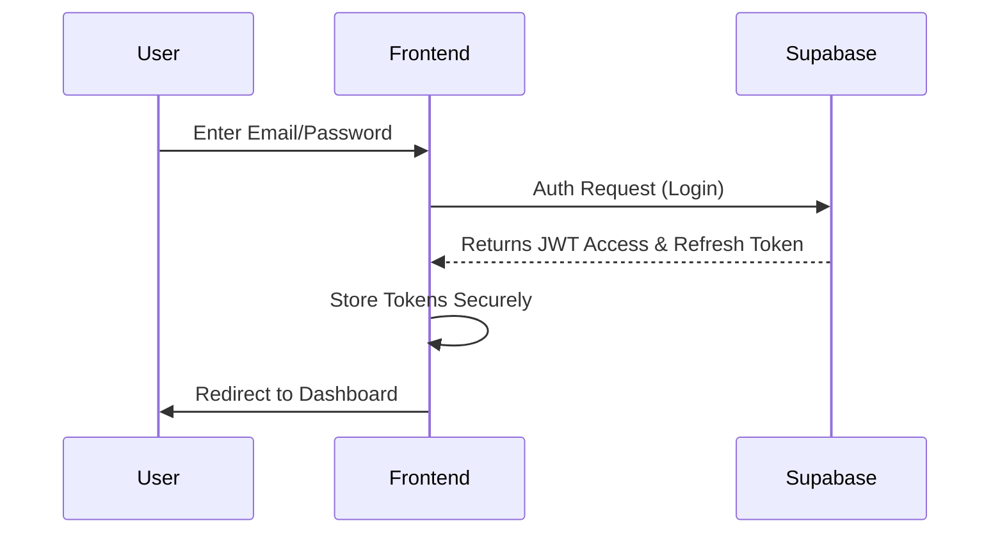
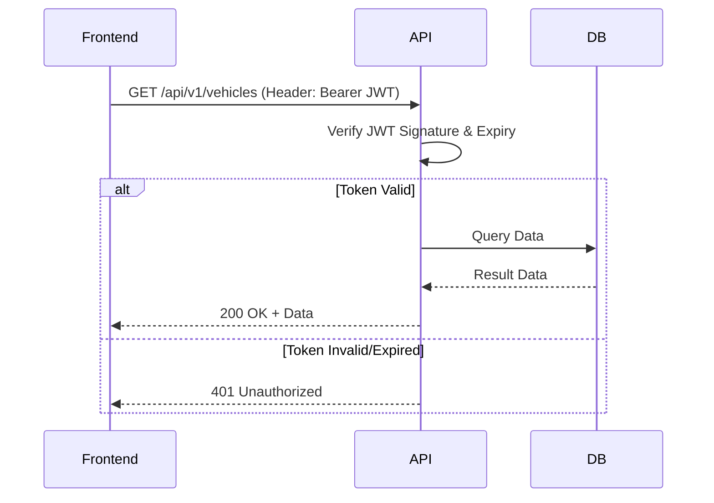
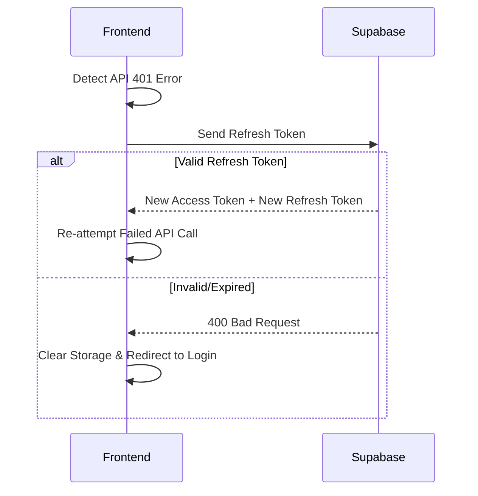
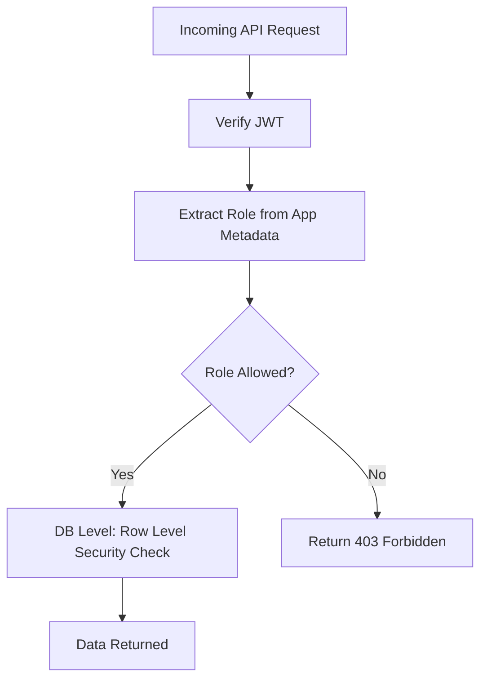

# Authentication & Authorization Architecture — EV-JARVIS

> **Document ID:** DOC-020
> **Version:** 1.1.0
> **Status:** Approved
> **Project:** EV-JARVIS
> **Owner:** Principal Security & Identity Architect
> **Last Updated:** 2026-08-07
> **Technology:** Supabase Auth, `@supabase/ssr`, Next.js App Router, JWT claims/JWKS, Express.js

---

## 1. Purpose
เอกสารฉบับนี้กำหนดมาตรฐานสถาปัตยกรรมการยืนยันตัวตน (Authentication) และการอนุญาตสิทธิ์ (Authorization) สำหรับระบบ EV-JARVIS เพื่อปกป้องข้อมูลผู้ใช้งานและการสื่อสารทั้งหมดผ่านระบบ API และ Database โดยใช้ Supabase Auth เป็นตัวจัดการหลักร่วมกับ JWT

## 2. Scope
ครอบคลุมกระบวนการจัดการบัญชีผู้ใช้ (Login, Registration, Password Reset), โครงสร้าง Token, ระบบสิทธิ์ RBAC (Role-Based Access Control), การจัดการเซสชัน และการป้องกันภัยคุกคามด้านความปลอดภัยที่เกี่ยวข้องกับการยืนยันตัวตน

## 3. Authentication Principles
- **Zero Trust:** ไม่เชื่อถือทุก Request ที่มาจากทั้งภายนอกและภายในระบบ ต้องมีการแนบ JWT เพื่อตรวจสอบทุกครั้ง
- **Stateless Tokens:** ใช้ JWT ในการยืนยันตัวตนโดยไม่เก็บสถานะเซสชันใน Server Memory 
- **Short-Lived Access:** Access Token มีอายุสั้น (1 ชั่วโมง) และต้องใช้ Refresh Token ในการขอใหม่
- **Secure Storage:** อุปกรณ์ Client ต้องเก็บ Token ใน Secure Storage หรือ `HttpOnly`, `Secure` Cookie เท่านั้น
- **Least Privilege:** ผู้ใช้ทุกคนเริ่มต้นด้วยสิทธิ์น้อยที่สุด

### Sprint 1 Milestone 3 implementation baseline

- Project Owner อนุมัติ Next.js SSR และ cookie-based session เมื่อ 2026-08-07 แทน React/Vite client-session contract เดิม
- Frontend ใช้ `@supabase/ssr` browser/server client และตรวจ protected page ฝั่งเซิร์ฟเวอร์
- Backend ตรวจ Supabase-issued token ด้วย `getClaims()`/JWKS-compatible verification; ไม่ใช้ shared JWT secret
- Authorization role อ่านจาก trusted `app_metadata`; Sprint 1 รองรับเฉพาะ `user` และ `admin`
- Service Role/Secret Key เป็น server-only และห้ามอยู่ใน `NEXT_PUBLIC_*`

## 4. Identity Architecture
ระบบ Identity ขับเคลื่อนโดย **Supabase Auth** ซึ่งดูแล password hashing, email verification และ token lifecycle Frontend ใช้ cookie session ผ่าน Supabase SSR ส่วน Backend รับ Bearer token สำหรับ `/api/v1` และตรวจ claims ก่อนดำเนินการทางธุรกิจ

## 5. Login Flow
ผู้ใช้กรอก Email และ Password ผ่าน Next.js Server Action ซึ่งเรียก Supabase Auth เมื่อสำเร็จ Supabase SSR เขียน session cookie และ protected page ตรวจ claims ฝั่งเซิร์ฟเวอร์ก่อน render

## 6. Logout Flow
Next.js Server Action เรียก Supabase `signOut()` เพื่อ revoke session และล้าง Auth cookies จากนั้น protected route ต้อง redirect กลับ `/login`; ไม่ใช้ Local/Session Storage เก็บ token

## 7. Registration Flow
ผู้ใช้กรอกข้อมูลส่วนตัวเพื่อสมัครสมาชิก ข้อมูลจะถูกบันทึกใน `auth.users` ของ Supabase จากนั้นจะมี Database Trigger (Postgres) ดักจับเหตุการณ์เพื่อสร้างบันทึกใหม่ในตาราง `public.users` ให้โดยอัตโนมัติ

## 8. Email Verification
เพื่อป้องกันสแปม ผู้ใช้ใหม่ต้องยืนยันอีเมลผ่านลิงก์ที่ถูกส่งจาก Supabase ก่อนจึงจะสามารถ Login และรับ Access Token เพื่อเข้าใช้งานระบบได้

## 9. Password Reset
ผู้ใช้ขอกู้คืนรหัสผ่านด้วยอีเมล Supabase ส่งลิงก์พร้อม Recovery Token แบบใช้ครั้งเดียว เมื่อผู้ใช้คลิกจะสามารถตั้งรหัสผ่านใหม่ได้อย่างปลอดภัย

## 10. Refresh Token Flow
เมื่อ Access Token หมดอายุ ระบบแอปพลิเคชันจะใช้ Refresh Token เพื่อขอ Access Token ใหม่จาก Supabase โดยอัตโนมัติเบื้องหลังโดยไม่ต้องบังคับให้ผู้ใช้กรอกรหัสผ่านใหม่ (Silent Refresh) หาก Refresh Token หมดอายุ ผู้ใช้จะต้อง Login ใหม่อีกครั้ง

## 11. JWT Claims

ระบบเชื่อถือเฉพาะ token ที่ Supabase ตรวจลายเซ็นและเวลาใช้งานสำเร็จ ต้องมี `sub` และ `aud=authenticated` ส่วน authorization role ใช้ `app_metadata.role` เท่านั้น ห้ามใช้ `user_metadata` เพราะผู้ใช้แก้ไขได้ Algorithm/key rotation ให้ยึด Supabase JWKS และ SDK configuration ปัจจุบันแทนการ hard-code algorithm

## 12. Session Management
Frontend ใช้ server-readable cookie session ผ่าน `@supabase/ssr` และ Proxy ช่วย refresh cookie Backend API ไม่เก็บ session ใน memory และต้องเรียก `getClaims(token)` เพื่อตรวจลายเซ็น/claims แทนการ decode payload หรือใช้ shared JWT secret

## 13. Role-Based Access Control (RBAC)
โครงสร้างสิทธิ์แบ่งตาม Role ที่เก็บอยู่ใน trusted `app_metadata` ของ JWT
ทุก API Endpoint จะมี Middleware (`requireRole`) เพื่อแกะ JWT และปฏิเสธการร้องขอที่ Role ไม่ถึง

## 14. Permission Matrix

| Resource | Guest | User | Admin |
|---|---|---|---|
| Register/Login | ✅ | ✅ | ✅ |
| View Own Profile | ❌ | ✅ | ✅ |
| Manage All Users | ❌ | ❌ | ✅ |
| Modify System Config | ❌ | ❌ | ❌ (Out of Sprint 1 scope) |

## 15. User Roles
- **Guest:** ผู้ใช้ที่ยังไม่ได้ล็อกอิน (ทำได้แค่ดูหน้าสาธารณะ)
- **User:** ผู้ใช้ทั่วไป (เจ้าของรถ EV) มีสิทธิ์ดูข้อมูลรถ ทริป และประวัติของตนเอง
- **Admin:** ผู้ดูแลระบบ สามารถดูข้อมูลรวม ช่วยเหลือผู้ใช้ และจัดการสิทธิ์

Sprint 1 รองรับเพียง `user` และ `admin`; ห้ามเพิ่ม `super_admin` หรือ vehicle-level role โดยไม่มี Owner approval ใหม่

## 16. Route Protection
Next.js Proxy ป้องกัน `/dashboard` และ `/profile` ด้วย verified claims และ redirect ไป `/login` เมื่อไม่มี session ที่เชื่อถือได้ แต่ละ protected page ตรวจ session ฝั่งเซิร์ฟเวอร์ซ้ำก่อนอ่านข้อมูล

## 17. API Authentication
ฝั่ง Backend API (Express.js) เช็ค `Authorization: Bearer <token>` 
- หากไม่พบ หรือ Token หมดอายุ จะตอบกลับด้วย `401 Unauthorized` ทันทีโดยไม่ประมวลผลต่อ
- ตรวจ Token ด้วย Supabase `getClaims()` และแนบ verified identity ให้ Controller

## 18. Database Authentication
ฝั่ง Database (Supabase) เมื่อถูกเข้าถึงผ่าน Backend จะสามารถส่งต่อ JWT หรือใช้ Service Role Key:
- **Client/Direct DB Call:** ถ้าเข้าถึงโดยตรง จะแกะ Token ผ่านฟังก์ชัน `auth.uid()` ของ PostgreSQL
- **Backend API Call:** Backend ตรวจ JWT ก่อนใช้ Prisma และบังคับ authorization ใน application layer; privileged server client ห้ามส่งออก Frontend

## 19. Row Level Security Mapping
สถาปัตยกรรมระดับ Database บังคับใช้ RLS (Row Level Security):
- อนุญาตให้ User สามารถสร้างและเข้าถึงได้เฉพาะข้อมูลที่ `auth.uid() = user_id` เท่านั้น
- Admin Role สามารถใช้เงื่อนไข Bypass หรือ Policy แยกสำหรับตรวจสอบสถานะผู้ดูแล

## 20. Token Expiration Strategy
- อายุ Access/Refresh Token ให้ยึดค่า EV-JARVIS-DEV Supabase Auth configuration ที่ตรวจและอนุมัติแล้ว ห้ามสมมติหรือ hard-code ค่าใน client

## 21. Refresh Strategy
- `@supabase/ssr` และ Next.js Proxy จัดการ cookie refresh ระหว่าง request
- หาก refresh ไม่สำเร็จ protected route ต้องล้างสถานะที่เชื่อถือไม่ได้และ redirect ไป Login
- ห้ามอ่านหรือ log refresh token ใน application code

## 22. Multi-device Login
ระบบอนุญาตให้เข้าสู่ระบบพร้อมกันหลายเครื่อง (เช่น มือถือ + คอมพิวเตอร์) 
Supabase จะจัดเก็บ Refresh Token แยกเซสชันของอุปกรณ์นั้นๆ ออกจากกัน

## 23. Device Management
ระบบสามารถสั่ง Logout ทางไกล (Remote Logout) ให้กับอุปกรณ์อื่น โดยดึงรายการ Session ทั้งหมดและสั่งลบ Refresh Token สำหรับเครื่องที่ไม่ต้องการ

## 24. Security Best Practices
- ห้ามเก็บ Token ไว้ใน `localStorage` หากป้องกัน XSS ได้ยาก (แนะนำ `HttpOnly` Cookie หรือ `SecureStore` ในแอปมือถือ)
- เปลี่ยน Secret Key สำหรับ JWT หากพบว่าเกิดความเสี่ยง
- ห้ามวาง Secret ของ Supabase (Service Key) ลงในโค้ดฝั่ง Client (React) เด็ดขาด

## 25. Attack Prevention
- **Brute Force:** ป้องกันด้วย Rate Limiting ที่ Endpoint เข้าสู่ระบบ 
- **Session Hijacking:** อายุของ Access Token ที่สั้น ช่วยลดความเสี่ยง
- **Token Theft:** ใช้งาน HTTPS (TLS 1.3) บังคับเสมอ เพื่อป้องกัน Man-in-the-Middle
- **Replay Attack:** ใช้ระบบ Timestamp ของ JWT (`exp`, `iat`) 
- **CSRF:** Cookie-based mutation ต้องใช้ Server Action/คำขอ same-origin และคงค่า cookie policy ของ Supabase SSR; ห้ามเพิ่ม cross-origin mutation โดยไม่มี CSRF review
- **XSS:** ป้องกันด้วยการกรอง Input (Sanitization) และจำกัดการเข้าถึง DOM อย่างเข้มงวด

---

## 26. Mermaid Diagrams

### Login Flow

```mermaid
sequenceDiagram
    participant User
    participant Frontend
    participant Supabase
    
    User->>Frontend: Enter Email/Password
    Frontend->>Supabase: Auth Request (Login)
    Supabase-->>Frontend: Returns JWT Access & Refresh Token
    Frontend->>Frontend: Store Tokens Securely
    Frontend->>User: Redirect to Dashboard
```

### JWT Flow

```mermaid
sequenceDiagram
    participant Frontend
    participant API
    participant DB
    
    Frontend->>API: GET /api/v1/vehicles (Header: Bearer JWT)
    API->>API: Verify JWT Signature & Expiry
    alt Token Valid
        API->>DB: Query Data
        DB-->>API: Result Data
        API-->>Frontend: 200 OK + Data
    else Token Invalid/Expired
        API-->>Frontend: 401 Unauthorized
    end
```

### Refresh Token Flow

```mermaid
sequenceDiagram
    participant Frontend
    participant Supabase
    
    Frontend->>Frontend: Detect API 401 Error
    Frontend->>Supabase: Send Refresh Token
    alt Valid Refresh Token
        Supabase-->>Frontend: New Access Token + New Refresh Token
        Frontend->>Frontend: Re-attempt Failed API Call
    else Invalid/Expired
        Supabase-->>Frontend: 400 Bad Request
        Frontend->>Frontend: Clear Storage & Redirect to Login
    end
```

### RBAC Flow

```mermaid
flowchart TD
    Request[Incoming API Request] --> Verify[Verify JWT]
    Verify --> Extract[Extract Role from App Metadata]
    Extract --> RoleCheck{Role Allowed?}
    RoleCheck -->|Yes| RLSCheck[DB Level: Row Level Security Check]
    RoleCheck -->|No| Reject[Return 403 Forbidden]
    RLSCheck --> Success[Data Returned]
```

---

## 27. Revision History

| Version | Date | Status | Author | Change Description |
|---|---|---|---|---|
| 1.1.0 | 2026-08-07 | Approved | Project Owner / Codex | ปรับ Auth architecture ให้ตรง Next.js SSR cookies, modern claims/JWKS และ `app_metadata` roles ที่ตรวจผ่าน |
| 1.0.0 | 2026-08-02 | Complete | Principal Security Architect | สร้างเอกสารสถาปัตยกรรม Authentication & Authorization (Supabase Auth/JWT) รวมถึงการจัดการ RBAC, RLS, Refresh Strategy และการป้องกันภัยคุกคาม พร้อมรวมแผนภาพการทำงาน |
