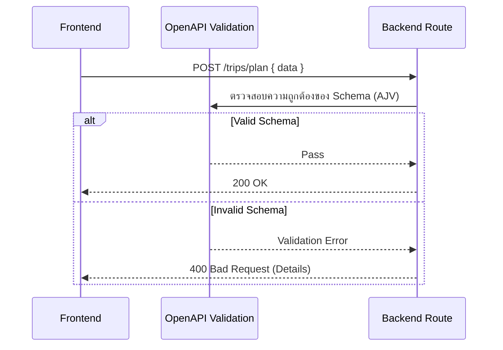
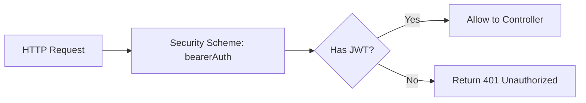
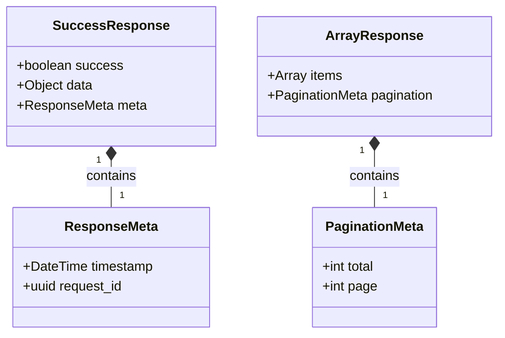

# OpenAPI 3.1 Specification — EV-JARVIS

> **Document ID:** DOC-021
> **Version:** 1.0.0
> **Status:** Complete
> **Project:** EV-JARVIS
> **Owner:** Principal API Architect
> **Last Updated:** 2026-08-02
> **Specification Standard:** OpenAPI 3.1.0

---

## 1. Purpose
เอกสารฉบับนี้คือข้อกำหนดและดีไซน์ OpenAPI 3.1 ที่เป็นแหล่งอ้างอิงหลัก (Canonical API Contract) สำหรับการพัฒนาฝั่ง Frontend, Backend และการสร้าง API Client SDK แบบอัตโนมัติ (Code Generation) เพื่อให้มั่นใจได้ว่าระบบทั้งหมดสื่อสารด้วยภาษาและโครงสร้างรูปแบบเดียวกัน

## 2. Scope
ครอบคลุมโครงสร้าง OpenAPI (Swagger) ทั้งหมดของโปรเจกต์ EV-JARVIS ตั้งแต่ Server Environments, Security Schemes, Component Schemas, Request/Response Format และ Endpoints หลักทุกประเภท

## 3. OpenAPI Overview
ระบบ EV-JARVIS ใช้ **OpenAPI Version 3.1.0** เป็นมาตรฐานสูงสุด เพื่อรองรับ Type Schema เต็มรูปแบบ (รองรับ JSON Schema Draft 2020-12) ทำให้ทำงานร่วมกับ TypeScript (Zod) ฝั่งแอปพลิเคชันได้ไร้รอยต่อ
- **Format:** JSON / YAML
- **Encoding:** UTF-8
- **Protocol:** HTTPS

## 4. Versioning Policy
- **API Version:** ถูกระบุอยู่ใน Base URL (`/api/v1`)
- **OpenAPI Version:** อัปเดตตามรอบ Release (เช่น `1.0.0`, `1.1.0`)

## 5. Base URL
- `/api/v1`

## 6. Servers

| Environment | URL | Description |
|---|---|---|
| **Production** | `https://api.ev-jarvis.com/api/v1` | เซิร์ฟเวอร์หลักที่เปิดใช้งานจริง |
| **Staging** | `https://staging-api.ev-jarvis.com/api/v1` | สภาพแวดล้อมเสมือนจริงสำหรับทดสอบ |
| **Development**| `http://localhost:4000/api/v1` | เซิร์ฟเวอร์ในเครื่องนักพัฒนา |

## 7. Global Security Scheme

```yaml
components:
  securitySchemes:
    bearerAuth:
      type: http
      scheme: bearer
      bearerFormat: JWT
      description: "ใส่ JWT Access Token ที่ได้จาก Supabase Auth"
```
*ทุก Endpoint ถูกล็อกด้วย `bearerAuth` เป็นค่า Default เว้นแต่จะระบุเป็นอย่างอื่น*

---

## 8. Global Components

โครงสร้างความรู้ส่วนกลางที่ถูกใช้ซ้ำ (Component Reuse Strategy)

### 9. Common Error Objects
```yaml
schemas:
  ErrorObject:
    type: object
    properties:
      success:
        type: boolean
        example: false
      error:
        type: object
        properties:
          code:
            type: string
          message:
            type: string
          details:
            type: array
            items:
              type: object
```

### 10. Pagination Objects
```yaml
schemas:
  PaginationMeta:
    type: object
    properties:
      total:
        type: integer
      page:
        type: integer
      limit:
        type: integer
      total_pages:
        type: integer
```

### 11. Success Response Objects
```yaml
schemas:
  SuccessResponse:
    type: object
    properties:
      success:
        type: boolean
        example: true
      data:
        type: object
      meta:
        $ref: '#/components/schemas/ResponseMeta'
```

### 12. Standard Metadata Objects
```yaml
schemas:
  ResponseMeta:
    type: object
    properties:
      timestamp:
        type: string
        format: date-time
      request_id:
        type: string
        format: uuid
```

## 13. API Naming Standards
- **Tags:** แบ่งกลุ่มหมวดหมู่ใหญ่ด้วยชื่อพหูพจน์ หรือชื่อระบบหลัก (เช่น `Vehicles`, `AI Assistant`)
- **OperationId:** ใช้ CamelCase ผสม Action และ Resource (เช่น `getVehicleById`, `createChargingSession`)

---

## 14. Document Schemas

### Authentication
`LoginRequest`, `RegisterRequest`, `TokenResponse`
### Users
`UserProfile`, `UserSettings`
### Vehicles
`Vehicle`, `VehicleCreate`, `VehicleStatus`
### Battery
`BatteryInfo`, `BatteryHealth`
### Charging
`ChargingSession`, `ChargingStation`, `ChargingStats`
### Trips & Routes
`Trip`, `TripPlan`, `RoutePoint`
### Maintenance
`MaintenanceRecord`, `ServiceSchedule`
### Notifications
`Notification`, `PushToken`
### Dashboard
`DashboardOverview`, `WidgetData`
### Settings
`SystemSettings`, `UserPreferences`
### AI
`AIConversation`, `AIMemory`, `AIPrompt`, `AIRecommendation`
### Telemetry
`TelemetryData`, `TelemetryHistory`
### Analytics & Admin
`AuditLog`, `AdminUserList`

*(ทุก Schema จะต้องถูกประกาศในส่วน `components/schemas` ของไฟล์ OpenAPI)*

---

## 15. Endpoint Definitions

รายละเอียดเชิงลึกของทุก Endpoint อ้างอิงตาม `01_API_SPECIFICATION.md` และตารางในฐานข้อมูล

---
### Tag: Authentication

#### `POST /auth/register`
- **Operation ID:** `registerUser`
- **Summary:** สมัครสมาชิกใหม่
- **Description:** รับข้อมูลอีเมลและรหัสผ่านเพื่อสร้างบัญชี Supabase
- **Security:** `None`
- **Request Schema:** `RegisterRequest`
- **Response Schema:** `TokenResponse`
- **Error Schema:** `ErrorObject`
- **Example:** `{"email":"test@ev.com","password":"..."}`
- **Related Database Tables:** `users`, `user_profiles`
- **Related Requirement IDs:** `SEC-001`

#### `POST /auth/login`
- **Operation ID:** `loginUser`
- **Summary:** เข้าสู่ระบบ
- **Description:** ยืนยันตัวตนและรับ JWT Access/Refresh Token
- **Security:** `None`
- **Request Schema:** `LoginRequest`
- **Response Schema:** `TokenResponse`
- **Error Schema:** `ErrorObject`
- **Related Database Tables:** `users`
- **Related Requirement IDs:** `SEC-002`

---
### Tag: Vehicles

#### `GET /vehicles`
- **Operation ID:** `getVehicles`
- **Summary:** ดึงรายการรถยนต์ทั้งหมดของผู้ใช้
- **Description:** ข้อมูลรถ (Make, Model, VIN, SOC) ที่ผู้ใช้ครอบครอง
- **Security:** `bearerAuth` (Role: `USER`)
- **Response Schema:** `Array of Vehicle`
- **Error Schema:** `ErrorObject`
- **Related Database Tables:** `vehicles`, `batteries`
- **Related Requirement IDs:** `VEH-001`

#### `GET /vehicles/{id}/telemetry`
- **Operation ID:** `getVehicleTelemetry`
- **Summary:** ดึงข้อมูล Real-time Telemetry ของรถคันนั้น
- **Security:** `bearerAuth` (Role: `USER`)
- **Response Schema:** `TelemetryData`
- **Related Database Tables:** `telemetry`
- **Related Requirement IDs:** `VEH-003`

---
### Tag: Charging

#### `GET /charging/sessions`
- **Operation ID:** `getChargingSessions`
- **Summary:** ดึงประวัติการชาร์จ
- **Description:** รองรับ Pagination และ Filter วันที่
- **Security:** `bearerAuth` (Role: `USER`)
- **Response Schema:** `Array of ChargingSession` (พร้อม `PaginationMeta`)
- **Related Database Tables:** `charging_sessions`
- **Related Requirement IDs:** `CHG-002`

#### `GET /charging/recommendation`
- **Operation ID:** `getChargingRecommendation`
- **Summary:** แนะนำสถานีชาร์จจาก AI
- **Security:** `bearerAuth` (Role: `USER`)
- **Response Schema:** `AIRecommendation`
- **Related Database Tables:** `charging_stations`
- **Related Requirement IDs:** `AI-005`

---
### Tag: Trips

#### `POST /trips/plan`
- **Operation ID:** `planTrip`
- **Summary:** ให้ AI สร้างแผนการเดินทางพร้อมจุดชาร์จ
- **Security:** `bearerAuth` (Role: `USER`)
- **Request Schema:** `TripPlanRequest`
- **Response Schema:** `TripPlanResponse`
- **Related Database Tables:** `trips`, `routes`
- **Related Requirement IDs:** `TRP-001`

---
### Tag: AI Assistant

#### `POST /ai/conversation`
- **Operation ID:** `sendAIMessage`
- **Summary:** พูดคุยกับ AI Assistant
- **Security:** `bearerAuth` (Role: `USER`)
- **Request Schema:** `AIMessageRequest`
- **Response Schema:** `AIMessageResponse`
- **Related Database Tables:** `ai_conversations`, `ai_memory`
- **Related Requirement IDs:** `AI-001`

---
*(Endpoints อื่นๆ ในหมวดหมู่ Maintenance, Dashboard, Settings, และ Admin ยึดตามรูปแบบ Schema เดียวกัน)*

---

## 16. OpenAPI Management Strategy

### OpenAPI Folder Structure
เพื่อไม่ให้ไฟล์ YAML มีขนาดใหญ่เกินไป การจัดการโครงสร้าง OpenAPI ฝั่ง Code จะถูกแยกเป็นโมดูล:
```
openapi/
  ├── openapi.yaml          # เมนไฟล์ที่รวมทุกอย่างเข้าด้วยกัน
  ├── info.yaml             # Metadata, Servers
  ├── paths/                # โฟลเดอร์แยกตาม Endpoints
  │   ├── auth.yaml
  │   ├── vehicles.yaml
  │   └── ai.yaml
  └── components/
      ├── schemas.yaml      # Data Models
      ├── responses.yaml    # Standard Responses
      └── security.yaml     # JWT Setup
```

### Schema Organization & Component Reuse
- แนะนำให้ใช้เครื่องมือ `swagger-cli` หรือ `@redocly/cli` เพื่อรวมไฟล์แยก (Bundle) กลับมาเป็น `openapi.json` เพื่อให้เครื่องมือฝั่ง Frontend หรือ Postman สามารถนำไปใช้ได้ทันที
- ใช้ `$ref` ในการดึง Schema ที่ใช้ร่วมกันเสมอ ห้ามเขียน Schema แบบ In-line ลงใน Endpoint ซ้ำซ้อน

### Versioning & Deprecation Policy
- หากมีการเปลี่ยนแปลงระดับ Breaking Change (เช่น ลบฟิลด์, เปลี่ยน Type) ต้องสร้างเวอร์ชันใหม่ของ API Path (เช่น `/api/v2`)
- หากฟีเจอร์เดิมกำลังจะถูกยกเลิก ให้เติม `deprecated: true` ลงใน Operation ของ OpenAPI ก่อนล่วงหน้า 1-3 เดือน

---

## แผนภาพการจัดการ API (Mermaid Diagrams)

### API Layer
```mermaid
flowchart TD
    Frontend[Frontend (Zod / TypeScript)] -->|Generated Client| APIClient[OpenAPI SDK]
    APIClient -->|HTTPS| Backend[Express.js (Backend)]
    Backend -->|Validation| OpenAPISchema[OpenAPI Schema Validator]
    OpenAPISchema --> Controllers
```

### Request Flow


### Authentication Flow (OpenAPI View)


### Schema Relationship


---

## 17. Revision History

| Version | Date | Status | Author | Change Description |
|---|---|---|---|---|
| 1.0.0 | 2026-08-02 | Complete | Principal API Architect | สร้างเอกสาร OpenAPI 3.1 Specification เป็นศูนย์กลางกำหนด Contract ระหว่าง Frontend/Backend รวมถึงการจัดการ Component Schemas แบบใช้งานซ้ำ (Reuse) |
