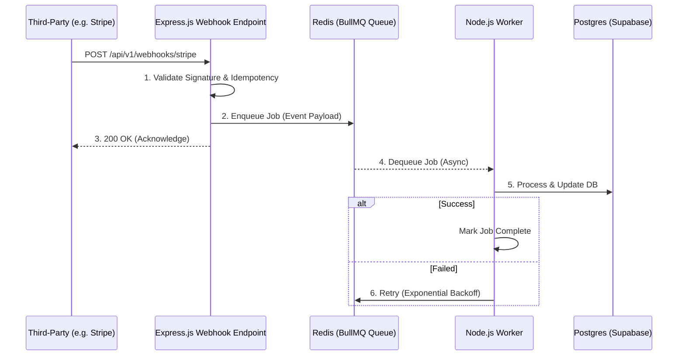
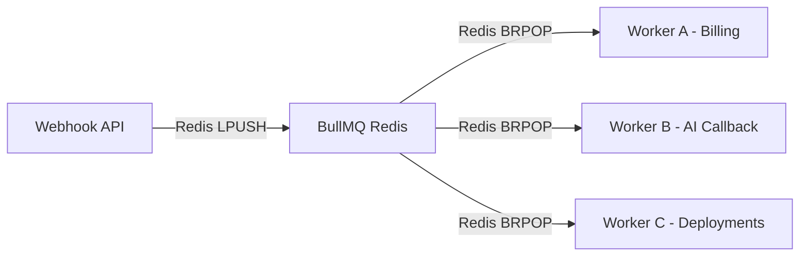

# Webhook Architecture — EV-JARVIS

> **Document ID:** DOC-022
> **Version:** 1.0.0
> **Status:** Complete
> **Project:** EV-JARVIS
> **Owner:** Principal Backend Integration Architect
> **Last Updated:** 2026-08-02

---

## 1. Purpose
เอกสารฉบับนี้กำหนดมาตรฐานสถาปัตยกรรม Webhook สำหรับระบบ EV-JARVIS เพื่อให้การเชื่อมต่อและรับ-ส่งเหตุการณ์ (Events) ระหว่างระบบภายนอก (Third-Party Services) และบริการภายใน (Internal Services) เป็นไปอย่างปลอดภัย (Secure) น่าเชื่อถือ (Reliable) และสามารถประมวลผลแบบอะซิงโครนัส (Asynchronous Processing) ได้อย่างไร้รอยต่อ

## 2. Supported Webhooks
ระบบ EV-JARVIS รองรับการรับ Events จากแพลตฟอร์มต่อไปนี้:
- **Stripe:** รับ Events สำหรับการชำระเงิน, Subscription
- **PromptPay (Future):** รับ Callback เมื่อลูกค้ายืนยันการโอนเงิน (สแกน QR)
- **Supabase Auth Events:** รับ Triggers ทันทีที่มีการสมัครสมาชิกหรือล็อกอินสำเร็จ
- **GitHub:** การรับ CI/CD Webhooks กรณี Code Update
- **Vercel:** สถานะการ Deploy ฝั่ง Frontend
- **Railway (Future):** สถานะการ Deploy ฝั่ง Backend API
- **AI Job Callback:** รับ Callback จาก Gemini 3.1 Pro / OpenAI GPT-5.x กรณีทำงานแบบ Long-running Analysis
- **Notification Events:** ตรวจสอบสถานะว่าข้อความ Push ถูกส่งหรืออ่านแล้ว (Read Receipts)

## 3. Internal Event Bus
เมื่อ API รับ Webhook เข้ามาแล้ว จะไม่ทำงาน (Process) ทันทีใน Request นั้น แต่จะเปลี่ยนข้อมูลเป็น Event แล้วโยนเข้าสู่ **Internal Event Bus** ที่ใช้ **Redis + BullMQ** เพื่อกระจายงานไปยัง Background Workers ที่รับผิดชอบ ป้องกันปัญหา Timeout (API บล็อก)

## 4. Event Flow


## 5. Security
- **Signature Verification:** ตรวจสอบความถูกต้องของ Webhook ผ่าน Secret HMAC (เช่น Stripe-Signature) ฝั่ง Express.js จะใช้ `raw-body` ในการคำนวณ Hash เพื่อเปรียบเทียบ
- **Secret Rotation:** จัดเตรียม API สำหรับเปลี่ยนค่า Webhook Secrets ได้อย่างราบรื่น (Zero Downtime)
- **Replay Protection:** เก็บ Event ID ลงตาราง Redis/DB ด้วย TTL เพื่อกันการรับ Event ที่เคยรับไปแล้ว (ป้องกันการยิงซ้ำ)
- **Timestamp Validation:** หาก Timestamp ใน Header ของ Webhook เก่ากว่า 5 นาที จะถูกปฏิเสธทันที
- **IP Whitelist:** บล็อก Request ที่ไม่ได้มาจากช่วง IP Address ของ Provider (เช่น Stripe IPs, Vercel IPs)
- **Rate Limiting:** ป้องกันการสแปม Webhook โดยการตั้งข้อจำกัดจำนวน Request ผ่าน Cloudflare WAF

## 6. Retry Strategy
- หาก Worker ทำงานล้มเหลว BullMQ จะทำการ Retry อัตโนมัติ (Exponential Backoff)
- ลำดับการ Retry: 10 วิ, 1 นาที, 5 นาที, 30 นาที, สูงสุด 5 ครั้ง

## 7. Dead Letter Queue
- หาก Worker ลองประมวลผลจนครบจำนวน Retry แล้วยังล้มเหลว งานนั้นจะถูกส่งไปยังคิวคนตาย (Dead Letter Queue - DLQ) 
- ข้อมูล DLQ จะถูกส่งแจ้งเตือนทีมวิศวกรผ่าน Slack/Discord และสามารถสั่ง Replay ผ่าน Admin Dashboard ได้

## 8. Idempotency
ทุก Webhook Handler ถูกออกแบบให้เป็น Idempotent:
1. การันตีว่า ถ้ารับ Webhook ซ้ำ ผลลัพธ์สุดท้ายจะเหมือนเดิม
2. นำฟิลด์ (เช่น `stripe_event_id` หรือ `job_id`) ไปเช็คใน Database ก่อนทำงาน

## 9. Event Versioning
- รองรับการเปลี่ยนโครงสร้าง Payload ของ External Service 
- Handler จะตรวจจับค่า `api_version` หรือ `type` ภายใน JSON Payload เพื่อชี้ไปยัง Logic Processor ที่ถูกต้องเสมอ

## 10. Payload Format
```json
{
  "event_id": "evt_1234567890",
  "type": "payment_intent.succeeded",
  "api_version": "2026-08-01",
  "created_at": "2026-08-02T12:00:00Z",
  "data": {
    "object": {
      "id": "pi_...",
      "amount": 20000,
      "currency": "thb"
    }
  }
}
```

## 11. JSON Examples
**Stripe Webhook Example:**
```json
{
  "id": "evt_1OpAAA...",
  "object": "event",
  "type": "charge.succeeded",
  "data": { ... }
}
```
**AI Callback Example (Gemini):**
```json
{
  "job_id": "aijob_0987",
  "status": "COMPLETED",
  "result": {
    "recommendation": "ควรชาร์จก่อนเดินทาง 30 นาที"
  }
}
```

## 12. Error Handling
- ระดับ API Layer: หาก Signature ผิด ตอบกลับ `401 Unauthorized` ทันที
- ระดับ API Layer: หากรับ Payload ไม่สมบูรณ์ ตอบกลับ `400 Bad Request`
- ระดับ Worker Layer: หากประมวลผลล้มเหลว โยน Error ให้ BullMQ จัดการ

## 13. Monitoring
- ตรวจสอบความยาวของคิวแบบ Real-time ผ่าน **BullMQ Dashboard**
- เก็บ Metric ระยะเวลาการประมวลผล (Processing Time) และส่งเข้า Grafana

## 14. Logging
- บันทึกการรับ Webhook ขาเข้าทั้งหมดลง Elasticsearch หรือ DataDog
- รวม `event_id` เป็น Correlation ID ลงใน Log เพื่อใช้ค้นหาปัญหา (Traceability)

## 15. Alerting
- แจ้งเตือนเมื่อ DLQ มีจำนวนงานเพิ่มขึ้น > 5 งานใน 1 ชั่วโมง
- แจ้งเตือนหากอัตราการตอบกลับ 500 ให้กับ Provider เกิน 1% (แปลว่า Database ล่มหรือ Queue ค้าง)

## 16. Event Lifecycle
1. **Received:** API รับ Webhook
2. **Queued:** งานอยู่ใน BullMQ
3. **Active:** Worker กำลังทำ
4. **Completed / Failed:** สถานะสุดท้าย
5. **Archived:** ลบออกจากคิวเมื่อทำงานเสร็จสมบูรณ์ 24 ชั่วโมง

## 17. Async Processing
Webhook endpoint ในฝั่ง Backend มีหน้าที่เพียงตรวจสอบความถูกต้อง (Verify) แล้วส่งรหัส `200 OK` ภายในเวลาน้อยกว่า 500ms งานที่ใช้เวลานาน (เช่น AI Processing 10 วินาที) จะไปทำที่ Worker เสมอ

## 18. Queue Architecture


## 19. Background Workers
Workers ถูกสร้างด้วย Node.js และเชื่อมต่อฐานข้อมูลผ่าน Prisma ทำงานแบบ Cluster Mode เพื่อกระจายโหลด

## 20. AI Callback Workflow
- ส่ง Job ไปให้ระบบ AI ภายนอกทำงาน -> AI ทำงานเสร็จส่ง Webhook มาหา EV-JARVIS -> Worker บันทึก `ai_memory` ลง Database -> ส่ง SSE (Server-Sent Events) แจ้งแอปพลิเคชันให้แสดงคำตอบบนหน้าจอแบบเรียลไทม์

## 21. Billing Workflow
- ผู้ใช้จ่ายเงินสำเร็จ -> Stripe ยิง Webhook มาหา EV-JARVIS -> ยืนยันความปลอดภัย -> โยนเข้าคิว Billing -> Worker เปลี่ยนสถานะใบเสร็จ (Invoice) และปลดล็อกฟีเจอร์พรีเมียมให้ผู้ใช้

## 22. Notification Workflow
- ระบบส่งอีเมลผ่าน SendGrid/Resend -> Provider ยิง Webhook แจ้งสถานะ Bounced / Delivered -> Worker อัปเดตตาราง `notifications` เพื่อเก็บสถานะ

## 23. Deployment Considerations
- ควรกำหนดรหัส Webhook Secrets ผ่าน Environment Variables ทันทีตอน Deploy
- การเพิ่ม Provider ใหม่ ต้องตั้งค่า Path ใน Reverse Proxy ให้ข้าม Rate Limit บางชนิด 

## 24. Best Practices
- **Return 200 Quickly:** ตอบ 200 OK ให้เร็วที่สุดภายในไม่กี่มิลลิวินาที 
- **Graceful Shutdown:** หาก Worker ต้องปิดตัว (เช่น Deploy อัปเดต) ต้องรอให้คิวงานปัจจุบันทำเสร็จ หรือคืนงานกลับเข้าคิว
- **Sanitization:** ไม่ไว้ใจข้อมูลใน Payload เด็ดขาด แม้ลายเซ็นจะถูกต้อง ต้องมีการตรวจ XSS และ SQL Injection ผ่าน Zod Schema ก่อนประมวลผลเสมอ

## 25. Revision History

| Version | Date | Status | Author | Change Description |
|---|---|---|---|---|
| 1.0.0 | 2026-08-02 | Complete | Principal Backend Integration Architect | กำหนดสถาปัตยกรรม Webhook & Async Processing รองรับ Stripe, AI Callback ด้วยระบบ Queue (Redis/BullMQ) การรักษาความปลอดภัย และการจัดการคิวล้มเหลว (DLQ) |
