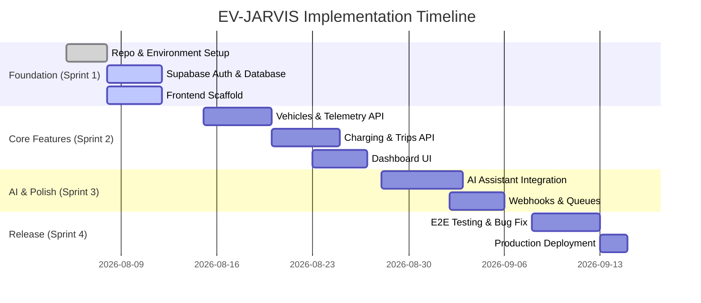

# Master Implementation Plan — EV-JARVIS

> **Document ID:** DOC-023
> **Version:** 1.0.0
> **Status:** Complete
> **Project:** EV-JARVIS
> **Owner:** Chief Software Architect & Technical Project Manager
> **Last Updated:** 2026-08-02

---

## 1. Purpose
เอกสารฉบับนี้คือ **แผนการดำเนินการหลัก (Master Implementation Plan)** ของโปรเจกต์ EV-JARVIS เพื่อให้ AI Agents ตลอดจนนักพัฒนาในทีมใช้เป็นคู่มือสำหรับการเริ่มพัฒนา (Execution Roadmap) ครอบคลุมตั้งแต่การตั้งค่า Environment เบื้องต้น การพัฒนา API, Frontend, AI Assistant ไปจนถึงขั้นตอนการ Testing และ Deployment สู่ Production โดยอ้างอิงกับเอกสาร Architecture ทั้งหมดอย่างเคร่งครัด

## 2. Project Overview
EV-JARVIS คือแอปพลิเคชันจัดการรถยนต์ไฟฟ้าอัจฉริยะ (PWA) ขับเคลื่อนด้วยระบบ AI (Gemini / OpenAI) โดยมีโครงสร้างแบบ Modular Monolith (Backend: Node.js / Express.js) และ Frontend แบบ Single Page Application (React / TypeScript / Tailwind CSS) ทำงานบนฐานข้อมูล PostgreSQL (ผ่าน Supabase) 

## 3. Development Strategy
- **MVP First:** มุ่งเน้นการสร้างคุณสมบัติหลักเพื่อรองรับกลุ่ม Early Adopter ก่อน
- **Incremental Development:** พัฒนาเพิ่มเป็นส่วนย่อย ๆ สามารถทดสอบ (Testable) ได้ในทุกช่วง
- **Feature Flags:** เตรียมสวิตช์เปิดปิดฟีเจอร์สำหรับทดสอบ AI หรือฟีเจอร์ที่ยังไม่เสถียรบน Production
- **AI-ready Architecture:** ออกแบบโครงสร้างข้อมูลด้วย `pgvector` และ RAG Patterns เพื่อรองรับการสืบค้นของ AI ตั้งแต่วันแรก

## 4. Development Phases

| Phase | Name | Description |
|---|---|---|
| **Phase 0** | Environment Setup | ตั้งค่า Repo, Config, Supabase, Vercel, Railway |
| **Phase 1** | Authentication | เชื่อมต่อ Supabase Auth (Login/Register/JWT) |
| **Phase 2** | Vehicle Management | พัฒนาระบบ CRUD และบันทึกสถานะรถยนต์ |
| **Phase 3** | Dashboard | สร้างหน้าแรก และ Widget สรุปข้อมูล |
| **Phase 4** | Battery Analytics | ระบบติดตามสถานะแบตเตอรี่ (SOC, SOH) |
| **Phase 5** | Charging | ระบบจัดการประวัติและสถานีชาร์จ |
| **Phase 6** | Trips | ระบบบันทึกและคำนวณการเดินทาง |
| **Phase 7** | Notifications | ระบบการแจ้งเตือน (Email / Push) |
| **Phase 8** | AI Assistant | พัฒนาระบบแชท ผสาน RAG และ Gemini/OpenAI |
| **Phase 9** | Admin | เครื่องมือสำหรับ Super Admin จัดการข้อมูล |
| **Phase 10** | Testing | QA, E2E, Unit Testing (Jest/Cypress) |
| **Phase 11** | Deployment | นำขึ้น Production และเซ็ต CI/CD Pipeline |

## 5. Sprint Planning

### Sprint 1: Foundation & Auth (Weeks 1-2)
- **Duration:** 2 สัปดาห์
- **Deliverables:** โครงโปรเจกต์ (React + Express), เชื่อมต่อ DB, ระบบ Auth ทำงานได้
- **Dependencies:** Supabase Database Provisioning

### Sprint 2: Core Data (Weeks 3-4)
- **Duration:** 2 สัปดาห์
- **Deliverables:** Vehicle, Charging, Trip CRUD APIs พร้อมหน้า UI รองรับ
- **Dependencies:** API Specifications สมบูรณ์

### Sprint 3: AI & Advanced Features (Weeks 5-6)
- **Duration:** 2 สัปดาห์
- **Deliverables:** AI Assistant, Webhooks, Notification, Dashboard
- **Dependencies:** Sprint 2 Data Models

### Sprint 4: Stabilization & Launch (Weeks 7-8)
- **Duration:** 2 สัปดาห์
- **Deliverables:** UAT, Bug Fixes, Final Deployment
- **Dependencies:** All previous sprints

## 6. Backend Tasks
- [ ] ติดตั้ง Express.js, TypeScript, Prisma ORM
- [ ] ตั้งค่า JWT Middleware อ้างอิง Supabase Auth
- [ ] สร้าง Routers และ Controllers ครบทุก Endpoint (หมวดหมู่ Vehicle, Charge, Trip)
- [ ] ติดตั้งระบบ Queue (BullMQ + Redis) สำหรับ Webhooks
- [ ] ติดตั้ง Zod Validator ขาเข้าของทุก API

## 7. Frontend Tasks
- [ ] ตั้งค่า Vite + React + TypeScript + Tailwind CSS
- [ ] ติดตั้ง Axios และ Zod
- [ ] พัฒนา UI Components ตาม Design System
- [ ] พัฒนา Pages (Dashboard, Vehicles, Trips, Charging)
- [ ] ตั้งค่า Service Worker เพื่อทำให้แอปเป็น PWA (Installable)

## 8. Database Tasks
- [ ] นำไฟล์ ERD มาสร้าง `schema.prisma`
- [ ] ทำ Migration ครั้งที่ 1 บน Supabase
- [ ] สร้าง RLS (Row Level Security) Policies ด้วย SQL Scripts
- [ ] ตั้งค่า Database Triggers สำหรับระบบ Auth (เช่น User Profile Auto-creation)

## 9. AI Tasks
- [ ] ติดตั้ง SDK ของ Gemini และ OpenAI ฝั่ง Backend
- [ ] พัฒนาฟังก์ชัน Retrieval-Augmented Generation (RAG) เชื่อมกับ `pgvector`
- [ ] สร้าง Prompt Templates สำหรับ Agent (Trip Planner, EV Assistant)
- [ ] เขียน API `POST /ai/conversation` แบบ Streaming (SSE)

## 10. API Tasks
- [ ] รวบรวม `swagger.yaml` จาก OpenAPI Document
- [ ] ติดตั้ง Swagger UI ใน Express (`/api-docs`)
- [ ] สร้างระบบตรวจสอบ API Rate Limit (Redis)

## 11. DevOps Tasks
- [ ] เขียน Dockerfile สำหรับฝั่ง Backend
- [ ] ตั้งค่า GitHub Actions สำหรับ CI/CD (Lint, Test, Build)
- [ ] ตั้งค่า Secret Management ใน Vercel และ Railway

## 12. Testing Tasks
- [ ] เขียน Unit Test สำหรับ Core Business Logic (Jest)
- [ ] เขียน Integration Test สำหรับ API ที่เกี่ยวข้องกับการชาร์จ
- [ ] เขียน E2E Test สำหรับ Flow การล็อกอิน (Cypress/Playwright)

## 13. Documentation Tasks
- [ ] อัปเดตตารางพจนานุกรมข้อมูล (Data Dictionary) หากมีการปรับปรุง
- [ ] อัปเดต API Specs ในรูปแบบโค้ด

## 14. Deployment Tasks
- [ ] Deploy Frontend ไปที่ Vercel (Production & Preview environments)
- [ ] Deploy Backend ไปที่ Railway (พร้อม Redis)
- [ ] ตั้งค่า Custom Domain (`ev-jarvis.com`)
- [ ] ทดสอบระบบ Webhook บน Production (Stripe, Notification)

---

## 15. Definition of Done (DoD)
- โค้ดถูก Merge เข้าสู่สาขา `main` ผ่าน Pull Request
- ผ่านการทดสอบ CI Pipeline (ไม่มี Lint/TypeScript Errors)
- เอกสาร OpenAPI ถูกจัดทำสอดคล้องกับโค้ดปัจจุบัน
- ผ่านการรีวิว RLS (Row Level Security) โดย Security Checklist

## 16. Risks
1. **Third-party Limit:** การเรียกใช้ AI LLM รัวจนชน Rate Limit
2. **Database Load:** คิวรี่ Time-series Data สำหรับ Telemetry สะสมช้าลงเมื่อข้อมูลเยอะ
3. **PWA Incompatibility:** ฟีเจอร์ของ PWA บางตัวใน iOS ทำงานไม่สมบูรณ์เมื่อเทียบกับ Android

## 17. Mitigation Plan
1. **AI Caching:** ใช้ Redis ช่วยเก็บคำตอบที่เหมือนกัน (Semantic Cache) 
2. **Data Partitioning:** เตรียมการทำ Table Partitioning หาก Table การชาร์จหรือพิกัดใหญ่เกิน 10M rows
3. **Graceful Degradation:** ถ้า Push Notification ใช้งานไม่ได้บน iOS รุ่นเก่า ให้อาศัย In-app Alert เป็นหลัก

## 18. Team Responsibilities
- **Project Manager:** กำกับดูแลไทม์ไลน์ ตัดสินใจเรื่อง Scope และ Features
- **Frontend Engineer:** สร้าง UI (React, Tailwind) และเชื่อมต่อ API
- **Backend Engineer:** เขียน Express.js, Prisma, Webhook, Queue
- **AI Engineer:** ออกแบบ Prompt, RAG System และ Optimize โมเดล AI
- **DevOps:** เซ็ต Pipeline, Vercel, Railway, Supabase และดูแล Monitoring
- **QA:** ทดสอบฟีเจอร์แบบ Manual และ Automated

*(แม้ว่าปัจจุบันจะขับเคลื่อนโดยนักพัฒนาหรือ Agent เพียงคนเดียว แต่กรอบการทำงานต้องรองรับลักษณะ Cross-functional Team)*

## 19. Estimated Timeline

## 20. Future Expansion
- **Microservices:** หากมีการแยกวงจรการเงินและระบบ IoT หนาแน่น จะย้ายไปเป็น Microservices 
- **Mobile Native:** ถ้า PWA ไม่เพียงพอ จะพัฒนา Mobile App ด้วย React Native (Expo)

## 21. Revision History
| Version | Date | Status | Author | Change Description |
|---|---|---|---|---|
| 1.0.0 | 2026-08-02 | Complete | Chief Software Architect | สถาปนา Master Implementation Plan ควบคุมแผนการทำงานและ Scope ทั่วทั้งโครงการ |
